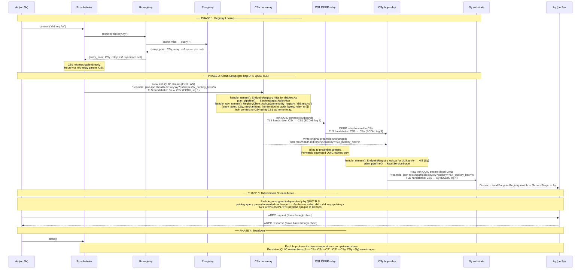

# Multi-Hop Relay: Registration, Discovery & Connection Flow

> [!IMPORTANT]
> **Status: Proposed — not yet implemented.** This document is a detailed design
> spec derived from architecture discussions, intended to serve as the basis for an
> integration test of the multi-hop system.

---

## 1. Entity Map

```
┌─────────────────────────── Public Internet ──────────────────────────────┐
│                                                                           │
│   R (Community Registry / DHT)    CS1 (Coordinator+Substrate)            │
│                                   CS2 (Coordinator+Substrate)            │
│                                                                           │
└───────────────────────────────────────────────────────────────────────────┘
         ▲  outbound only           ▲  outbound only
         │                          │
┌────────┴────── SubnetX ──────────┴──────────────────────────────────────┐
│                                                                           │
│   Rx (Local Registry)    CSx (Coordinator+Substrate, hop-relay)          │
│                                                                           │
│                          Sx (Substrate, no external outbound)            │
│                              └── SynApp Ax                               │
└───────────────────────────────────────────────────────────────────────────┘
         ▲  outbound only           ▲  outbound only
         │                          │
┌────────┴────── SubnetY ──────────┴──────────────────────────────────────┐
│                                                                           │
│   Ry (Local Registry)    CSy (Coordinator+Substrate, hop-relay)          │
│                                                                           │
│                          Sy (Substrate, no external outbound)            │
│                              └── SynApp Ay                               │
└───────────────────────────────────────────────────────────────────────────┘
```

**Reachability constraints:**

| From \ To     | R   | CS1 | CS2 | CSx | Rx  | Sx  | CSy | Ry  | Sy  |
|---------------|-----|-----|-----|-----|-----|-----|-----|-----|-----|
| CS1 / CS2     | ✅  | ✅  | ✅  | ❌* | ❌* | ❌  | ❌* | ❌* | ❌  |
| CSx           | ✅↑ | ✅↑ | ✅↑ | —   | ✅  | ✅  | ❌* | ❌  | ❌  |
| Rx            | ✅↑ | ✅↑ | ✅↑ | ✅  | —   | ✅  | ❌  | ❌  | ❌  |
| Sx            | ❌  | ❌  | ❌  | ✅  | ✅  | —   | ❌  | ❌  | ❌  |
| CSy           | ✅↑ | ✅↑ | ✅↑ | ❌* | ❌  | ❌  | —   | ✅  | ✅  |
| Ry            | ✅↑ | ✅↑ | ✅↑ | ❌  | ❌  | ❌  | ✅  | —   | ✅  |
| Sy            | ❌  | ❌  | ❌  | ❌  | ❌  | ❌  | ✅  | ✅  | —   |

`↑` = outbound-only (can initiate, cannot receive inbound)
`*` = reachable only via CS1/CS2 DERP relay (once CSx/CSy registers home relay)

---

## 2. Registry Entry Format

All entries in any registry (R, Rx, Ry) are signed pkarr records.

### Node Record

```json
{
  "node_did": "did:p2p:<pubkey>",
  "iroh_node_id": "<iroh-public-key>",
  "home_relay": "https://cs1.syneroym.net",
  "direct_quic": "1.2.3.4:4242",
  "capabilities": ["hop-relay", "derp-relay", "substrate"],
  "signed_by": "<node_pubkey>",
  "seq": 1
}
```

- `home_relay` is set only if the node cannot receive inbound directly
- `direct_quic` is set only if the node has a public IP
- `capabilities` declares what services this node offers at the transport level

### Service Record

```json
{
  "service_did": "did:svc:<service-pubkey>",
  "node_did": "did:p2p:<hosting-substrate>",
  "entry_point": "did:p2p:<first-hop-with-public-relay-access>",
  "relay": "https://cs1.syneroym.net",
  "protocols": ["wrpc", "jsonrpc"],
  "signed_by": "<publishing-registry-pubkey>",
  "seq": 1
}
```

- `entry_point` is the hop-relay node a caller should connect to first
- `relay` is CS1/CS2's URL — the DERP relay the entry_point is registered at
- `signed_by` is the registry that published this (Rx for SubnetX services, Ry for SubnetY)

### Preamble Wire Format (on every new QUIC stream)

The **existing URL-scheme preamble format** is used unchanged for all streams, including hop-relay hops:

```
<scheme>://<interface>.<service_id>[?pubkey=<hex-ed25519>]
\n   (newline-terminated)

Examples:
  json-rpc://health.did:key:Ay?pubkey=<Sx-Ed25519-pubkey-hex>
  raw://did:key:Ay?pubkey=<Sx-Ed25519-pubkey-hex>
```

- `service_id` — the target service DID; used by each hop to look up the next hop
- `pubkey` — the originating caller's Ed25519 public key hex; forwarded **unchanged** through all hops so the final service (Ay) can verify identity
- `scheme` (transport + protocol) — whatever the originating caller chose; forwarded unchanged
- `caller_did` — **not needed** as a separate field. `did:key` is derived deterministically from the Ed25519 `pubkey`, so the final service can reconstruct it: `did:key:<z-base-32(pubkey)>`

Each intermediate hop reads the preamble once, determines the next hop via its local `EndpointRegistry` lookup (miss) → community registry lookup, then writes the **same preamble string** verbatim to the next-hop stream before starting blind `copy_bidirectional`.

---

## 3. Startup Registration — Step by Step

### Phase A: Public Internet Nodes

**CS1 starts:**
1. Generates Ed25519 keypair → `node_did = did:p2p:CS1`
2. Starts Iroh endpoint on `1.2.3.4:4242` (public UDP)
3. Starts DERP relay service on same endpoint
4. Publishes node record to R:
   ```json
   { "node_did": "did:p2p:CS1", "direct_quic": "1.2.3.4:4242",
     "capabilities": ["derp-relay", "hop-relay", "substrate"], "seq": 1 }
   ```
5. hop-relay routing table: empty

**CS2 starts:** symmetric to CS1 on `5.6.7.8:4242`.

**R starts:** Acts as the top-level DHT registry. Nodes publish and resolve records via its HTTP `/v1/resolve` and `/v1/publish` API. Internally backed by pkarr + BEP-0044 DHT.

---

### Phase B: SubnetX Nodes

**CSx starts:**
1. Generates Ed25519 keypair → `node_did = did:p2p:CSx`
2. Starts Iroh endpoint on local subnet IP (no public IP)
3. Connects **outbound** to CS1's Iroh endpoint — registers CS1 as home relay
   - CS1's DERP relay now knows: *"CSx is behind me, I can forward to it"*
4. Publishes node record to R (via its outbound connection):
   ```json
   { "node_did": "did:p2p:CSx", "iroh_node_id": "<CSx-iroh-key>",
     "home_relay": "https://cs1.syneroym.net",
     "capabilities": ["hop-relay", "substrate"], "seq": 1 }
   ```
5. Starts native `hop_relay` subsystem (routing table empty)
6. Starts local community_registry client pointed at Rx

**Rx starts:**
1. Generates Ed25519 keypair → `node_did = did:p2p:Rx`
2. Connects **outbound** to R (configured as parent registry)
3. Publishes its own node record to R:
   ```json
   { "node_did": "did:p2p:Rx", "type": "registry",
     "parent": "did:p2p:R", "signed_by": "Rx_pubkey", "seq": 1 }
   ```
4. Starts accepting publish/resolve requests from SubnetX nodes
5. Local service index: empty

**Sx starts:**
1. Generates Ed25519 keypair → `node_did = did:p2p:Sx`
2. Starts Iroh endpoint on local subnet IP only
3. Config has: `hop_relay_parent = did:p2p:CSx`, `local_registry = Rx`
4. Connects **outbound** to CSx (local QUIC)
5. Sends registration to CSx's hop_relay subsystem:
   ```json
   { "node_did": "did:p2p:Sx", "iroh_node_id": "<Sx-iroh-key>",
     "services": [], "signed_by": "Sx_pubkey" }
   ```
6. CSx routing table now has: `did:p2p:Sx → Sx_iroh_addr` (node-level entry, no services yet)

**SynApp Ax deploys on Sx:**
1. Sx orchestrator deploys Ax → `service_did = did:svc:Ax`
2. Sx's substrate registers Ax with CSx:
   ```json
   { "service_did": "did:svc:Ax", "node_did": "did:p2p:Sx",
     "protocols": ["wrpc"], "signed_by": "Sx_pubkey" }
   ```
3. **CSx updates routing table:** `did:svc:Ax → did:p2p:Sx`
4. CSx propagates to Rx:
   ```json
   { "service_did": "did:svc:Ax", "node_did": "did:p2p:Sx",
     "entry_point": "did:p2p:CSx", "relay": "https://cs1.syneroym.net",
     "signed_by": "CSx_pubkey", "seq": 1 }
   ```
5. **Rx stores this** in its local service index
6. **Rx publishes upward to R** (same record, countersigned by Rx):
   ```json
   { "service_did": "did:svc:Ax", "entry_point": "did:p2p:CSx",
     "relay": "https://cs1.syneroym.net",
     "signed_by": "Rx_pubkey", "seq": 1 }
   ```

---

### Phase C: SubnetY Nodes (symmetric)

CSy, Ry, Sy, and SynApp Ay go through the exact same steps as Phase B.
After Ay deploys, R contains Ay's record:
```json
{ "service_did": "did:svc:Ay", "entry_point": "did:p2p:CSy",
  "relay": "https://cs1.syneroym.net",
  "signed_by": "Ry_pubkey", "seq": 1 }
```

---

## 4. Registry State After Full Startup

### R (Public Registry)

| Key | Value |
|---|---|
| `node:CS1` | `{direct_quic: 1.2.3.4:4242, capabilities: [derp-relay, hop-relay]}` |
| `node:CS2` | `{direct_quic: 5.6.7.8:4242, capabilities: [derp-relay, hop-relay]}` |
| `node:CSx` | `{iroh_node_id: ..., home_relay: cs1.syneroym.net, capabilities: [hop-relay]}` |
| `node:CSy` | `{iroh_node_id: ..., home_relay: cs1.syneroym.net, capabilities: [hop-relay]}` |
| `node:Rx`  | `{type: registry, parent: R}` |
| `node:Ry`  | `{type: registry, parent: R}` |
| `svc:Ax`   | `{entry_point: CSx, relay: cs1.syneroym.net, signed_by: Rx}` |
| `svc:Ay`   | `{entry_point: CSy, relay: cs1.syneroym.net, signed_by: Ry}` |

### Rx (SubnetX Local Registry)

| Key | Value |
|---|---|
| `node:CSx` | `{local_quic: 192.168.x.1:4242, capabilities: [hop-relay]}` |
| `node:Sx`  | `{local_quic: 192.168.x.2:4242, hop_via: CSx}` |
| `svc:Ax`   | `{node: Sx, entry_point: CSx, signed_by: CSx}` |

### CSx hop-relay routing table (in-memory)

| service_did | next_hop |
|---|---|
| `did:svc:Ax` | `did:p2p:Sx` (local Iroh addr) |

### Ry and CSy routing table: symmetric for Ay/Sy.

---

## 5. Connection Establishment: Ax → Ay



---

## 6. Encryption Model

Each leg of the chain is independently encrypted by Iroh's QUIC TLS 1.3 (ECDH per leg). The caller's Ed25519 `pubkey` is carried in the preamble as the `?pubkey=<hex>` query parameter and forwarded **unchanged** through every hop. The final service (Ay) uses this to:

1. Verify the caller's identity (Ed25519 signature on the request payload)
2. Derive `caller_did = did:key:<z-base-32(pubkey)>` for authorization
3. Optionally encrypt a response envelope specifically for the caller

```
Leg 1: Sx ↔ CSx       QUIC TLS session key K1 (ephemeral ECDH)
Leg 2: CSx ↔ CS1      QUIC TLS session key K2 (ephemeral ECDH)
Leg 3: CS1 ↔ CSy      QUIC TLS session key K3 (ephemeral ECDH)
Leg 4: CSy ↔ Sy       QUIC TLS session key K4 (ephemeral ECDH)

Application payload:   wRPC frames signed by Sx's Ed25519 key
                       Verifiable by Ay using ?pubkey= from preamble
                       Opaque to CS1, CSx, CSy (they only see encrypted QUIC frames)
```

This is "layered" in the sense that each relay contributes its own TLS session to the chain — each hop can only see its own leg's plaintext (the preamble it reads once, and then opaque bytes). No hop can reconstruct the full path or read the application payload.

---

## 7. Failure Scenarios

| Failure | Effect | Recovery |
|---|---|---|
| Sx goes offline | CSx's Iroh connection to Sx drops → routing table entry evicted → propagated to Rx → propagated to R | When Sx restarts, it re-registers with CSx → records republished |
| CSx goes offline | Sx loses its only upstream. All SubnetX services become unreachable from outside. | CSx reconnects outbound to CS1 on restart; re-registers; Rx re-publishes |
| CS1 goes offline | CSx and CSy lose their home relay. CSx↔CSy connectivity breaks. | CSx/CSy fall back to CS2 as backup relay (if configured) |
| Rx goes offline | Sx cannot resolve external services. Cached records serve for TTL duration. | Sx can still reach CSx and use CSx's direct connection to R for lookups |

---

## 8. Integration Test Specification

This scenario maps directly to an end-to-end integration test.

### Test Topology (all in-process)

```rust
// All nodes run as in-process Tokio tasks with fake or real Iroh endpoints
// Use iroh's test utilities for in-process QUIC without real sockets

let cs1 = TestNode::new("CS1").with_capabilities([DerpRelay, HopRelay]).start().await;
let r   = TestRegistry::new("R").start().await;

// SubnetX
let rx  = TestRegistry::new("Rx").with_parent(r.addr()).start().await;
let csx = TestNode::new("CSx").with_home_relay(cs1.addr())
                               .with_registry(r.addr())
                               .with_local_registry(rx.addr())
                               .start().await;
let sx  = TestNode::new("Sx").with_hop_relay_parent(csx.addr())
                              .with_local_registry(rx.addr())
                              .start().await;
let ax  = sx.deploy_synapp("Ax").await;  // returns service_did

// SubnetY (symmetric)
let ry  = TestRegistry::new("Ry").with_parent(r.addr()).start().await;
let csy = TestNode::new("CSy").with_home_relay(cs1.addr())
                               .with_registry(r.addr())
                               .with_local_registry(ry.addr())
                               .start().await;
let sy  = TestNode::new("Sy").with_hop_relay_parent(csy.addr())
                              .with_local_registry(ry.addr())
                              .start().await;
let ay  = sy.deploy_synapp("Ay").await;
```

### Test Assertions

```rust
// ── Registration assertions ──────────────────────────────────────────────

// R contains CSx node record with home_relay=CS1
let csx_rec = r.resolve_node(csx.node_did()).await?;
assert_eq!(csx_rec.home_relay, cs1.relay_url());
assert!(csx_rec.capabilities.contains(&HopRelay));

// R contains Ax service record signed by Rx, entry_point=CSx
let ax_rec = r.resolve_service(ax.service_did()).await?;
assert_eq!(ax_rec.entry_point, csx.node_did());
assert_eq!(ax_rec.relay, cs1.relay_url());
assert_eq!(ax_rec.signed_by, rx.pubkey());

// CSx routing table contains Ax → Sx
assert_eq!(csx.routing_table().get(ax.service_did()), Some(sx.node_did()));

// Symmetric for Ay/CSy/Ry
let ay_rec = r.resolve_service(ay.service_did()).await?;
assert_eq!(ay_rec.entry_point, csy.node_did());

// ── Connection assertions ─────────────────────────────────────────────────

// Ax connects to Ay
let conn = ax.connect(ay.service_did()).await?;
assert!(conn.is_ok());

// Round-trip works
conn.send(b"hello from Ax").await?;
let msg = ay.recv().await?;
assert_eq!(msg.payload, b"hello from Ax");
assert_eq!(msg.caller_did, sx.node_did());  // identity forwarded correctly

// CS1 is blind — it sees no plaintext preamble content
assert!(cs1.observed_preambles().is_empty());

// ── Failure and recovery assertions ──────────────────────────────────────

// Sx goes offline
sx.shutdown().await;
// CSx routing table entry for Ax evicted
assert!(csx.routing_table().get(ax.service_did()).is_none());
// R's record for Ax eventually removed (after Rx propagates eviction)
tokio::time::sleep(Duration::from_secs(2)).await;
assert!(r.resolve_service(ax.service_did()).await.is_err());

// Sx restarts — record reappears
let sx = sx.restart().await;
let ax = sx.deploy_synapp("Ax").await;
let ax_rec = r.resolve_service(ax.service_did()).await?;
assert_eq!(ax_rec.entry_point, csx.node_did());  // same entry point, re-registered
```

### Key Invariants to Verify

1. **Routing table correctness:** CSx's routing decision for `did:key:Ay` always correctly resolves to CSy via the community registry, not locally.
2. **Registry hierarchy:** Every service reachable from Sy/Sx is resolvable at R, via the Ry/Rx chain.
3. **Identity propagation:** `?pubkey=<Sx_pubkey_hex>` is present and unchanged at Ay's receive; Ay can derive `caller_did = did:key:<pubkey>` from it.
4. **Hop blindness:** CS1 never observes any preamble plaintext from a CSx↔CSy connection.
5. **Connection isolation:** Two concurrent connections Ax→Ay and Ax→Ay2 (another service on Sy) use separate QUIC streams; neither affects the other.
6. **Teardown propagation:** When Sx disconnects, all entries are evicted up the chain to R within a bounded time.
