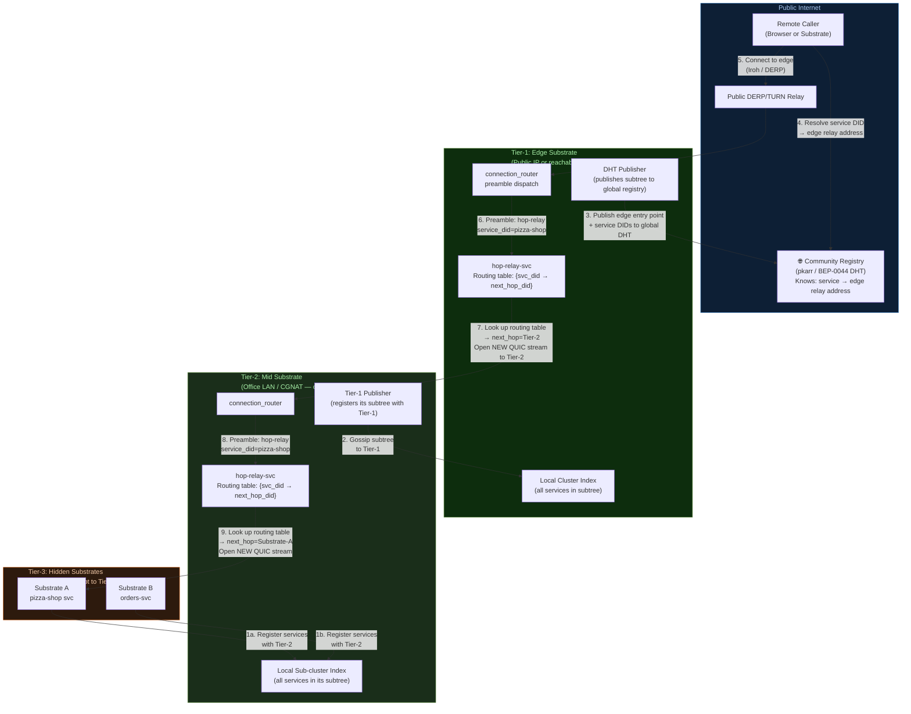
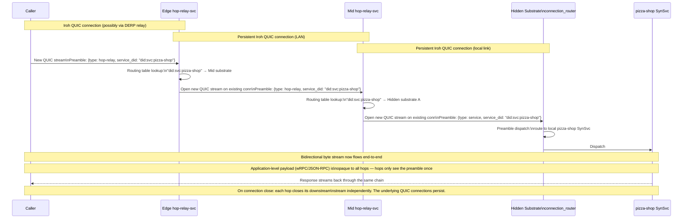
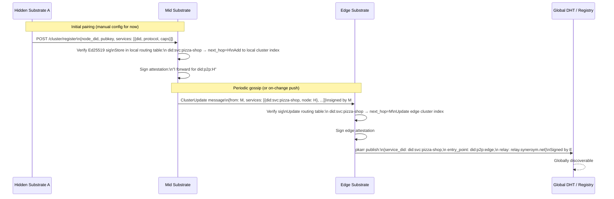

# Multi-Hop Relay Architecture

> [!IMPORTANT]
> **Status: Proposed — not yet implemented.** This document captures a design agreed upon during architecture discussions. Implementation has not started. The design should be reviewed and updated as implementation begins and new constraints are discovered.

---

## Core Model (One-Line Summary)

> A tree of substrates where each node acts as both a **local registry** (routing table of downstream services) and a **transparent relay** (per-connection bidirectional tunnel to the correct neighbor). The caller only needs the address of the nearest reachable hop and the target service DID. The tree routes it the rest of the way.

---

## What This Is NOT

| Discarded approach | Why discarded |
|---|---|
| Onion / layered encryption (Tor model) | Caller would need to know the full path and construct nested crypto. Over-engineered for our goals. |
| Caller encodes the full hop chain in the request | Brittle to topology changes; leaks internal network structure to callers. |
| Shared persistent tunnel between hops (single pipe) | Head-of-line blocking; equivalent to the TCP-over-TCP problem. |

---

## Topology



---

## The Tunnel Model — Per-Connection Bidirectional Streams

The key mechanism: each hop-relay opens a **new QUIC stream** (not a new QUIC connection) to the next hop for each incoming service connection. This reuses the existing Iroh QUIC connection between persistent neighbors (Iroh manages the connection lifecycle) but isolates each service call to its own stream, eliminating head-of-line blocking.



---

## How Each Hop Stays Blind to the Payload

Each hop reads exactly one preamble at connection open time using the **existing URL-scheme preamble format** already in the router:

```
<scheme>://<interface>.<service_did>[?pubkey=<hex-ed25519>]

Examples:
  json-rpc://health.did:key:pizza-shop?pubkey=<caller-hex-pubkey>
  raw://did:key:pizza-shop?pubkey=<caller-hex-pubkey>
```

- **`service_did`** is the `service_id` field in `RoutePreamble` — the target service's DID.
- **`pubkey`** is the existing optional query parameter on `RoutePreamble` — the caller's Ed25519 public key, forwarded unchanged through the entire chain so the final service can verify the caller's identity. Since `did:key` is derived deterministically from the pubkey, a separate `caller_did` field is not needed.
- **`scheme`** (transport + protocol) is whatever the **originating caller chose** and is forwarded unchanged. The intermediate hop never inspects or re-encodes it; it passes the exact preamble bytes it received when opening the downstream stream.

After the preamble is consumed, the hop does **pure bidirectional byte copying** between the upstream stream and the downstream stream it opened. It never reads the payload again — the hop is a transparent pipe.

The application-level payload (wRPC frames, JSON-RPC requests/responses) is protected by:
- **Transport encryption** per QUIC leg (Iroh QUIC / TLS 1.3)
- **Service-level Ed25519 signing** already present on all substrate messages

No additional onion encryption needed. Each hop simply cannot interpret the bytes it forwards.

---

## Service Registration — Upward Gossip

How a service on a hidden substrate becomes discoverable at the global registry:



**What the global DHT record contains:**

```json
{
  "service_did": "did:svc:pizza-shop",
  "entry_point": "did:p2p:edge-substrate",
  "relay": "https://relay-x.syneroym.net",
  "protocols": ["wrpc", "jsonrpc"],
  "signed_by": "edge-substrate-pubkey",
  "seq": 101
}
```

**What the record does NOT contain:** internal topology (mid-substrate, hidden substrate addresses). The tree structure below the edge is private. The caller only learns *"connect to this edge relay and ask for did:svc:pizza-shop"*.

---

## Connection Establishment — Caller Perspective

From the caller's view this is a simple two-step:

```
1. resolve(service_did)  →  {entry_point, relay}      [DHT lookup]
2. connect(entry_point)                                 [Iroh / DERP]
   send preamble: {type: hop-relay, service_did: ...}
   ← bidirectional stream to service ←
```

The caller has **no idea** how many hops exist between the entry point and the actual service. The complexity is entirely in the substrate tree.

---

## The hop-relay Subsystem

A native Rust subsystem built into the substrate binary with two responsibilities:

### Routing table (registry role)

```
Table: service_did → (next_hop_node_did, iroh_node_addr)

Populated by:
  - Direct registration from children (for Tier-N+1 → Tier-N)
  - Gossip updates from child hop-relay subsystems (for deeper subtrees)

Evicted by:
  - Iroh connection-close event from child substrate (no separate TTL/heartbeat needed)
  - Explicit deregister message from child
```

### Stream forwarder (relay role)

```
On incoming stream (handled inside handle_raw_stream → ServiceStage::RelayHop):
  1. Read preamble → extract service_id (target DID) via existing read_preamble()
  2. EndpointRegistry::lookup() → miss (service not local)
  3. RegistryClient::lookup(community_registry_url, service_id, resolve=true)
       → SignedEndpointInfo { mechanisms: [Iroh { endpoint_addr_bytes, relay_url }] }
  4. Parse IrohAddr from endpoint_addr_bytes
  5. Obtain Iroh Connection to next-hop substrate (reuse existing or connect)
  6. Open new QUIC bidirectional stream on that connection
  7. Write the original preamble string to the new stream (unchanged)
  8. tokio::io::copy_bidirectional(upstream_stream, downstream_stream)
  9. On either side close → close both streams; underlying QUIC connection persists
```

> [!NOTE]
> **Implementation:** `hop-relay` is a **native Rust subsystem built into the substrate binary**, sitting alongside `connection_router`. WASM sandboxing would add per-byte overhead on every forwarded connection — the wrong tradeoff for infrastructure-level byte shuttling.
>
> The integration point in the existing stage-pipeline architecture is `ServiceStage::RelayHop` inside `handle_raw_stream()` in [`route_handler/io.rs`](../crates/router/src/route_handler/io.rs). The preamble parsing, registry lookup, and pipeline planning are already wired in `handle_stream()` — the only missing piece is the `RelayHop` branch that reaches out to the community registry and opens an outbound Iroh stream:
>
> ```rust
> // Inside handle_raw_stream(), ServiceStage::RelayHop branch:
> ServiceStage::RelayHop { .. } => {
>     // Resolve next-hop substrate via community registry
>     let info = RegistryClient::lookup(&registry_url, &preamble.service_id, true).await?;
>     let iroh_addr = iroh_addr_from_mechanisms(&info.info.mechanisms)?;
>
>     // Open outbound stream to next-hop substrate (reuses existing Iroh connection)
>     let conn = iroh_endpoint.connect(iroh_addr, SYNEROYM_ALPN).await?;
>     let (mut send, mut recv) = conn.open_bi().await?;
>
>     // Forward the original preamble to the next hop, unchanged
>     send.write_all(preamble_line.as_bytes()).await?;
>
>     // Blind bidirectional forwarding
>     tokio::io::copy_bidirectional(&mut stream, &mut ReaderWriter { reader: recv, writer: send }).await?;
>     Ok(())
> }
> ```
> The `EncryptionStage::RelayOpaqueForward` variant in `routing.rs` is the corresponding stub for the encryption stage — used when a hop needs to forward an E2E-encrypted stream without terminating TLS.

---

## Routing Table Propagation — Like BGP, But Simpler

Each hop only knows about **its own routing table** — it does not know the full path. When service `did:svc:pizza-shop` is registered:

| Hop | Routing table entry |
|---|---|
| Mid Substrate | `did:svc:pizza-shop → Hidden Substrate A` |
| Edge Substrate | `did:svc:pizza-shop → Mid Substrate` |
| Global DHT | `did:svc:pizza-shop → Edge Substrate` (public record) |

Each node only knows the **next hop**, not the full path. This is exactly the IP routing model applied to service DIDs.

---

## Comparison: This Design vs. the Discarded Onion Model

| Aspect | Discarded (Onion/Layered) | This Design (Hop-Relay Tree) |
|---|---|---|
| Caller must know full path | ✅ Yes | ❌ No — just entry point + service DID |
| Crypto per hop | Layered Ed25519 encrypt per hop | None extra — per-hop QUIC TLS + existing service signing |
| Routing responsibility | Caller | Each hop (local routing table) |
| Adding a new hop depth | Caller must update | Only the new hop registers with its parent |
| Implementation complexity | High | Low — reuses blind tunnel + preamble dispatch |
| Topology leakage to caller | Full path visible | Only entry point visible |
| Head-of-line blocking risk | Low (per-hop layered) | Low (per-connection QUIC streams) |

---

## What Changes in Existing Code

| File / Component | Change |
|---|---|
| `router/route_handler/io.rs` | Implement `ServiceStage::RelayHop` branch in `handle_raw_stream()`: community registry lookup → Iroh connect → forward preamble → `copy_bidirectional` |
| `router/routing.rs` | `ServiceStage::RelayHop` and `EncryptionStage::RelayOpaqueForward` are **already stubbed** — just need the real implementation body |
| `router/route_handler/dispatch.rs` | `plan_pipeline()` needs a new match arm: when `EndpointRegistry::lookup()` misses, attempt a community registry lookup and return `ServiceStage::RelayHop` |
| `core/community_registry.rs` | `RegistryClient::lookup()` already exists and returns `EndpointMechanism::Iroh { endpoint_addr_bytes, relay_url }` — no changes needed |
| Preamble format | **No changes.** The existing URL-scheme preamble (`scheme://interface.service_id?pubkey=<hex>`) is forwarded **unchanged** to the next hop. No new format or fields needed. |
| Config | Add optional `community_registry_url` to substrate config for hops that need to reach out-of-local-registry services |

---

## Resolved Design Decisions

| Question | Resolution |
|---|---|
| **Routing table TTL** — if a hidden substrate goes offline silently, how is its routing table entry evicted? | **Iroh handles this.** The Iroh connection between the child substrate and its parent drops on disconnect. The `hop-relay` subsystem listens for connection-closed events from Iroh and evicts the corresponding routing table entries immediately. Propagation upward follows the same path as registration. No separate heartbeat/TTL mechanism needed. |
| **Duplicate service DID** — same service DID registered at two different tree branches. | Shouldn't happen — service DIDs are derived from keypairs, so each service has a unique DID by construction. If it somehow does occur, each hop's routing table keeps the **first-registered** entry (stability preferred over last-writer-wins). A duplicate detection log entry is emitted so operators can investigate. |
| **Native vs. WASM** — should `hop-relay` be a SynSvc or a substrate subsystem? | **Native Rust in the substrate binary.** Shares the substrate's Iroh `Endpoint` and Tokio runtime directly. WASM overhead on a tight `copy_bidirectional` loop is the wrong tradeoff for infrastructure-level byte forwarding. |
| **Connection upgrade** — if two substrates previously connected via N hops discover they can reach each other directly, does the chain short-circuit? | **On new connections only.** When a child substrate re-registers with a shorter/direct path, the routing table is updated. Existing in-flight connections drain naturally over the old path. New connections use the updated path automatically. No mid-connection rerouting. |
