# Syneroym Ecosystem — Architecture Document
---

## Table of Contents

1. [Executive Summary](#1-executive-summary)
2. [Architecture Goals & Constraints](#2-architecture-goals--constraints)
3. [System Layers Overview](#3-system-layers-overview)
4. [Layer 1 — Infrastructure](#4-layer-1--infrastructure)
5. [Layer 2 — Substrate Runtime](#5-layer-2--substrate-runtime)
6. [Layer 3 — Shared Substrate Utilities](#6-layer-3--shared-substrate-utilities)
7. [Layer 4 — SynApp Specifications](#7-layer-4--synapp-specifications)
8. [Federation Architecture](#8-federation-architecture)
9. [Consumer Experience Architecture](#9-consumer-experience-architecture)
10. [Security Architecture](#10-security-architecture)
11. [Resolved Architecture TBD Items](#11-resolved-architecture-tbd-items)
12. [Consolidated Technology Stack](#12-consolidated-technology-stack)
13. [MVP Phase 1 Scope & Acceptance Criteria](#13-mvp-phase-1-scope--acceptance-criteria)
14. [Open Questions](#14-open-questions)
15. [Glossary](#15-glossary)

---

## 1. Executive Summary

Syneroym is a federated, locality-first ecosystem for autonomous mini-applications (**SynApps**) that run on provider-controlled commodity hardware. It replicates the benefits of large consumer platforms — discovery, reputation, standardised transaction flows, institutional trust — while eliminating their drawbacks: vendor lock-in, data ownership loss, governance asymmetry, and opaque algorithms.

This document defines the architecture, technology stack, component design for:

- **The Syneroym Substrate** — the common technology layer all SynApps run on
- **SynApp 1: Business, Professional & Retail Spaces** — Home Services Guild + Food & Small Retailer Mesh

---

## 2. Architecture Goals & Constraints

### 2.1 Guiding Principles

| Principle | Implication |
|---|---|
| **Locality-first** | Optimised for geographically proximate providers and consumers; global scale is secondary |
| **Progressive decentralisation** | Single device is fully useful; federation is additive |
| **Data sovereignty** | All provider data lives on provider-controlled infrastructure |
| **Transparency over opaqueness** | Ranking, discovery, and reputation algorithms are open-source or auditable |
| **Interoperability by convention** | SynApps cooperate via shared primitives; no central coordinator needed |
| **Offline-first** | Graceful degradation under partition; queued and async workflows |

### 2.2 Key Hardware Constraints

| Profile | Hardware | Typical Use |
|---|---|---|
| Tier 1 — Minimal | Raspberry Pi 4, Android phone (2 GB RAM) | Single provider self-host, light load |
| Tier 2 — Standard | Old PC / mini PC (4–8 GB RAM, SSD) | Provider or small aggregator |
| Tier 3 — Distributed | Multiple VMs, PCs, Servers (8–32 GB RAM) | Infrastructure provider, large aggregator |

---

## 3. System Layers Overview

The architecture is composed of four layers, each building on the one below.

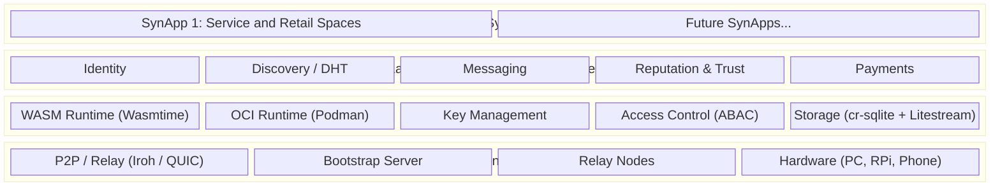

### 3.1 Conceptual Entity Model

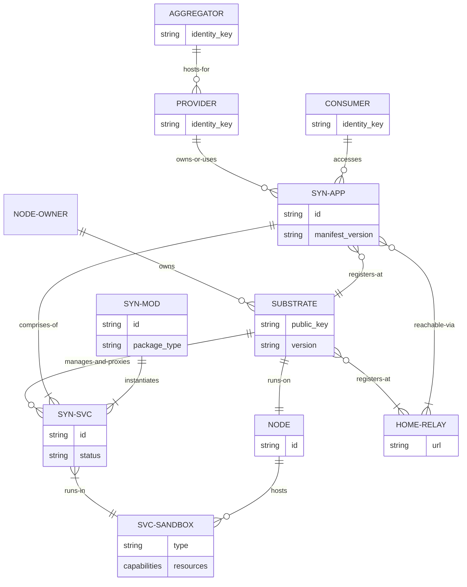

---

## 4. Layer 1 — Infrastructure

### 4.1 P2P Networking: Iroh

Direct QUIC (UDP) connections are attempted first. NAT/firewall fallback uses relay-mediated connections.

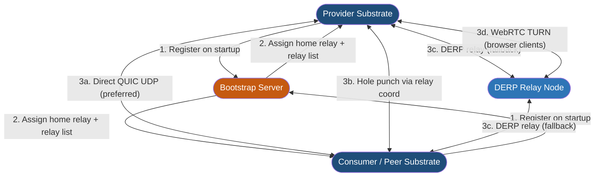

**Technology:** `iroh` (Rust crate) — provides QUIC transport, NAT hole punching, DERP relay, and peer discovery in a single library. `webrtc-rs` for browser clients via WebRTC Data Channels.

### 4.2 Relay Node Architecture

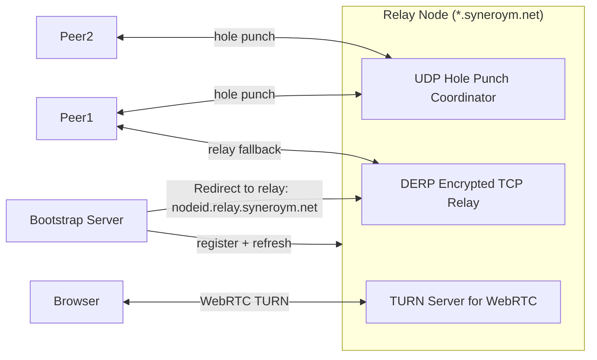

**Local DNS:** Each substrate caches relay hostname resolutions. This avoids hammering Bootstrap server for the large number of dynamically rotating relay nodes.

### 4.3 Bootstrap Server & DHT Fallback

**[TBD: Decentralised Bootstrap Fallback]**

The bootstrap server is an operational dependency. To survive its unavailability:

1. The bootstrap server **mirrors its relay registry** as `pkarr` signed packets published to the BitTorrent DHT under a well-known namespace key (`syneroym-relays.<version>`)
2. Substrates **cache** the last-known relay list locally (TTL: 24 hours)
3. On bootstrap unavailability, substrates use the cached list, then fall back to DHT lookup via `pkarr`
4. A community governance key signs the DHT namespace — any sufficiently trusted community member can republish in an emergency

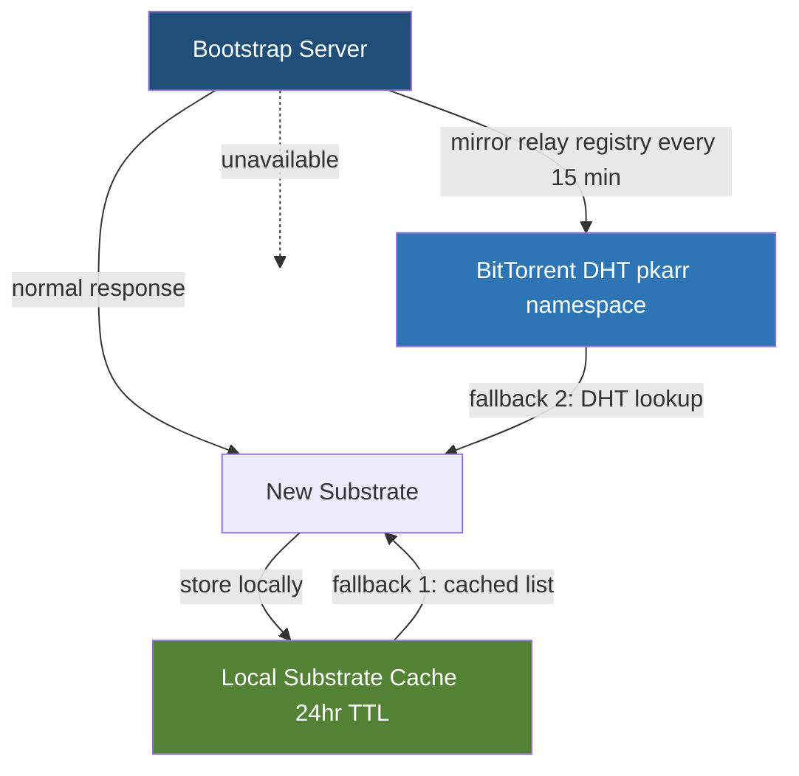

---

## 5. Layer 2 — Substrate Runtime

### 5.1 Substrate Internal Architecture

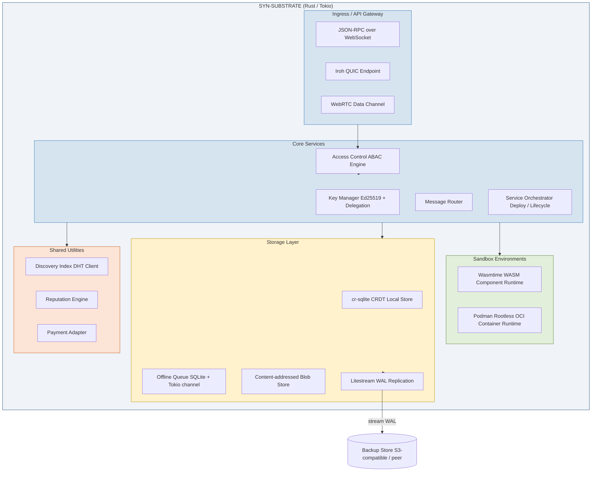

### 5.2 SynApp Packaging & API Pipeline

**[TBD: Migration Protocol, Backup Mechanism]**


**Migration Protocol:** Provider data portability is achieved via a documented export/import format:
- `syneroym export --app <app-id>` produces a signed archive: cr-sqlite snapshot + blob store + identity keypair (optional) + App Spec
- Archive is portable to any substrate running a compatible substrate version
- Import validates the archive signature and replays into a fresh cr-sqlite instance
- Litestream continuous replication can additionally keep a live replica on a secondary node

### 5.3 Storage & CRDT Merge Semantics

**[TBD: CRDT merge semantics, Conflict resolution rules per entity type]**

All structured data is stored in **cr-sqlite** — SQLite extended with CRDT primitives. Each table row carries a Hybrid Logical Clock (HLC) timestamp and a site ID.

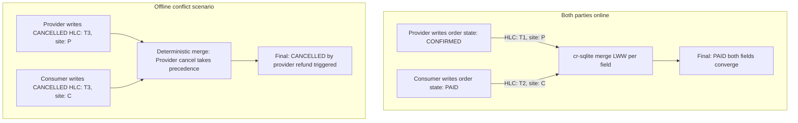

**Merge rules by entity type:**

| Entity | Merge Strategy | Rationale |
|---|---|---|
| Order state | Provider action beats consumer action within same HLC epoch; later HLC wins otherwise | Provider has operational authority over their service |
| Catalog item | Last-write-wins per field (standard LWW) | Catalog is provider-owned; no concurrent consumer writes |
| Message | Append-only log; no merge conflicts | Messages are immutable once sent |
| Booking slot | Availability is a set-CRDT (OR-Set); reservation is LWW with provider authority | Prevents double-booking |
| Reputation record | Append-only; signed by issuer; no merge | Records are immutable attestations |
| Access control policy | Provider LWW; infrastructure provider cannot override | Data sovereignty |

---

## 6. Layer 3 — Shared Substrate Utilities

### 6.1 Identity

Every entity has an **Ed25519** keypair. Identity documents are self-describing JSON-LD structures signed by the entity key.

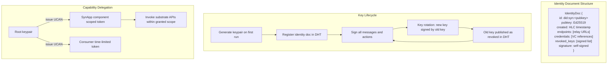

### 6.2 Discovery & DHT

**[TBD: Partitioning and consistency model, Discovery ranking algorithm]**

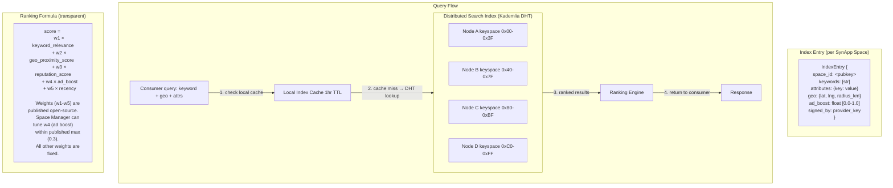

**Partitioning:** Standard Kademlia XOR-distance routing. Each substrate node stores index entries whose key (SHA-256 of space_id) falls within its keyspace shard. Replication factor: 3 (entries stored on 3 closest nodes).

**Consistency:** Eventual consistency; index entries carry an HLC timestamp. Stale entries expire after 72 hours unless refreshed by the provider substrate.

### 6.3 Messaging

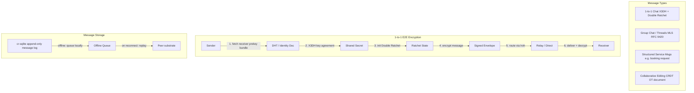

**Libraries:** `libsignal-protocol-rust` for X3DH + Double Ratchet; `openmls` (Rust) for MLS group messaging.

### 6.4 Trust & Reputation

**[TBD: Vouching mechanics and weighting, Credential format and verification, Reputation portability mechanism, Propagation protocol, Anti-gaming mechanisms, Sybil resistance]**

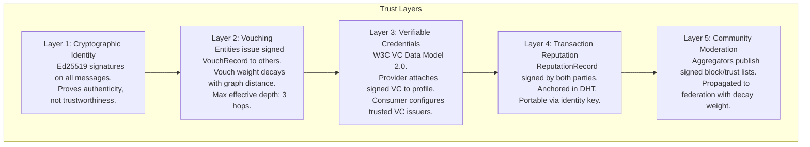

**Vouching mechanics:**

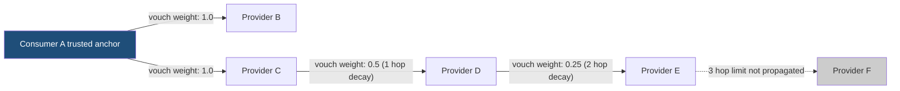

**Vouch weight formula:** `effective_weight = base_weight × decay_factor^hop_count`  
Default `decay_factor = 0.5`. Max effective depth: 3 hops (weight < 0.125 beyond this is ignored).

**Sybil resistance mechanisms:**
1. **Stake requirement:** To issue a vouch with weight > 0.5, the issuer must have ≥ 5 completed transactions with positive reputation in their own history
2. **Rate limiting:** Max 10 new vouches issued per 30-day window per identity
3. **Reputation anchoring:** Reputation records require both-party signatures — a provider cannot self-generate fake transaction history
4. **Community moderation override:** Aggregator block lists can zero out reputation from known Sybil clusters

**Anti-gaming (discovery ranking):**
- Ad boost is capped at `w4_max = 0.3` of total score — organic signals always dominate
- Keyword stuffing is mitigated by TF-IDF scoring on index entries (raw keyword count is not used)
- Review bombing detection: reputation score uses a Bayesian average with a prior of 3.5/5.0 and minimum 5 reviews before score is published

**Reputation portability:** A provider migrating substrates republishes their `ReputationRecord` collection (each record is independently signed by both parties) to the DHT under their existing identity key. No loss of history.

### 6.5 Payments

**[TBD: Payment rails and escrow, Coin and mutual credit mechanics]**

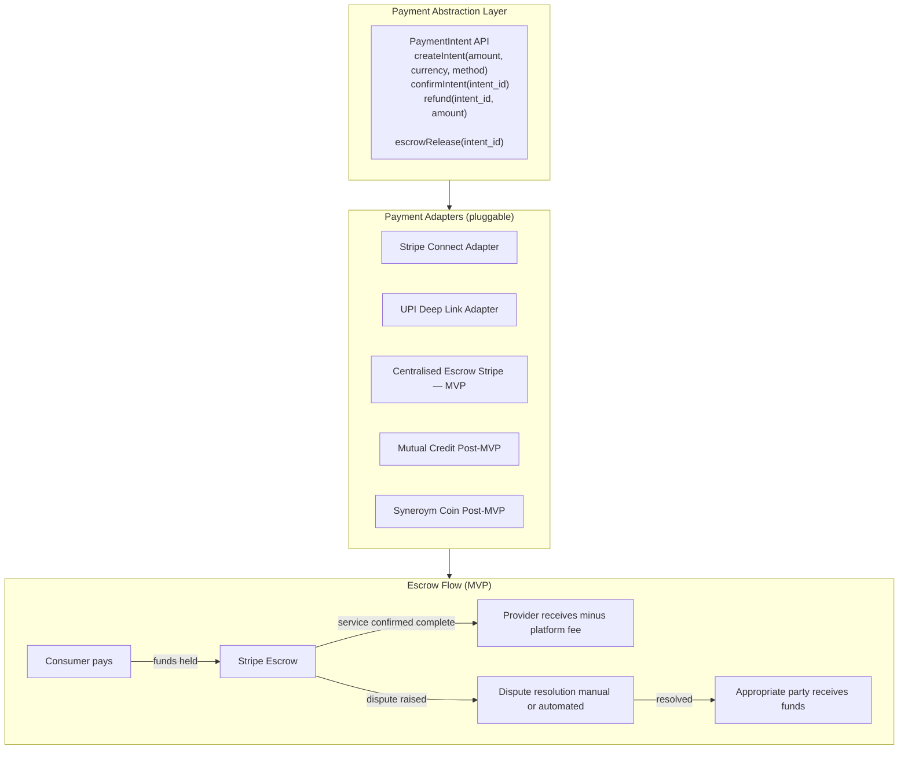

**Mutual credit (post-MVP):** A bilateral IOU system where providers and consumers issue credits to each other denominated in a local unit. No external currency required. Each credit line is a signed ledger between two parties; the substrate mediates settlement. Regulatory classification: internal loyalty points (not securities or currency) in most jurisdictions.

**Syneroym Coin (post-MVP):** Internal ledger token (not a cryptocurrency or blockchain-based token) managed by a community governance multi-sig. Used for ecosystem incentives and cross-aggregator settlement. Regulatory review required before launch.

---

## 7. Layer 4 — SynApp Specifications

### 7.1 SynApp 1: Business, Professional & Retail Spaces

#### 7.1.1 Component Architecture

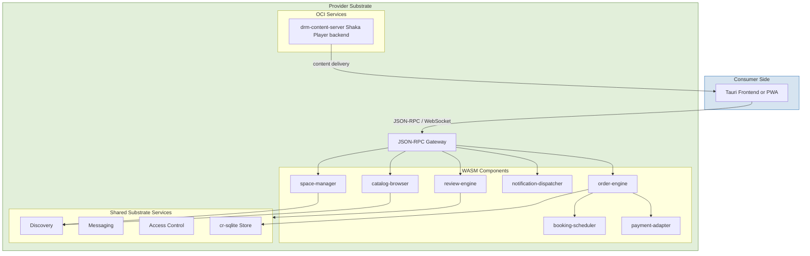

#### 7.1.2 Order State Machine

**[TBD: Conflict resolution rules per entity type (order)]**

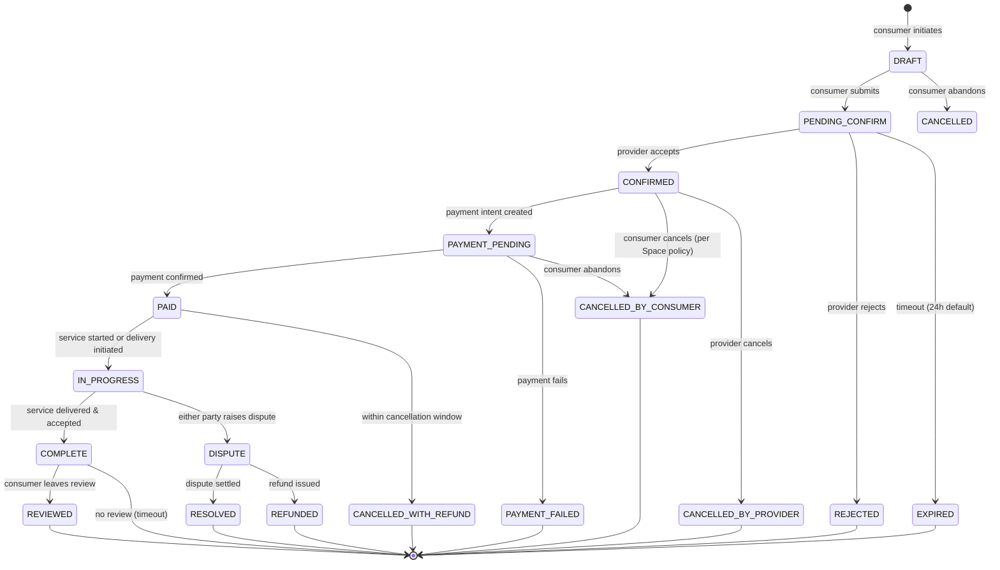

**Offline conflict rules for order state:**
- Provider CANCELLED + Consumer CANCELLED in same HLC epoch → **Provider takes precedence** (provider has operational authority); refund triggered
- Provider CONFIRMED + Consumer CANCELLED in same HLC epoch → **Consumer wins** (consumer initiated the cancellation workflow first); no charge
- Both parties IN_PROGRESS state with diverged sub-state → **merge by union** of completed steps; disputed steps require manual resolution

#### 7.1.3 Consumer Transaction Flow

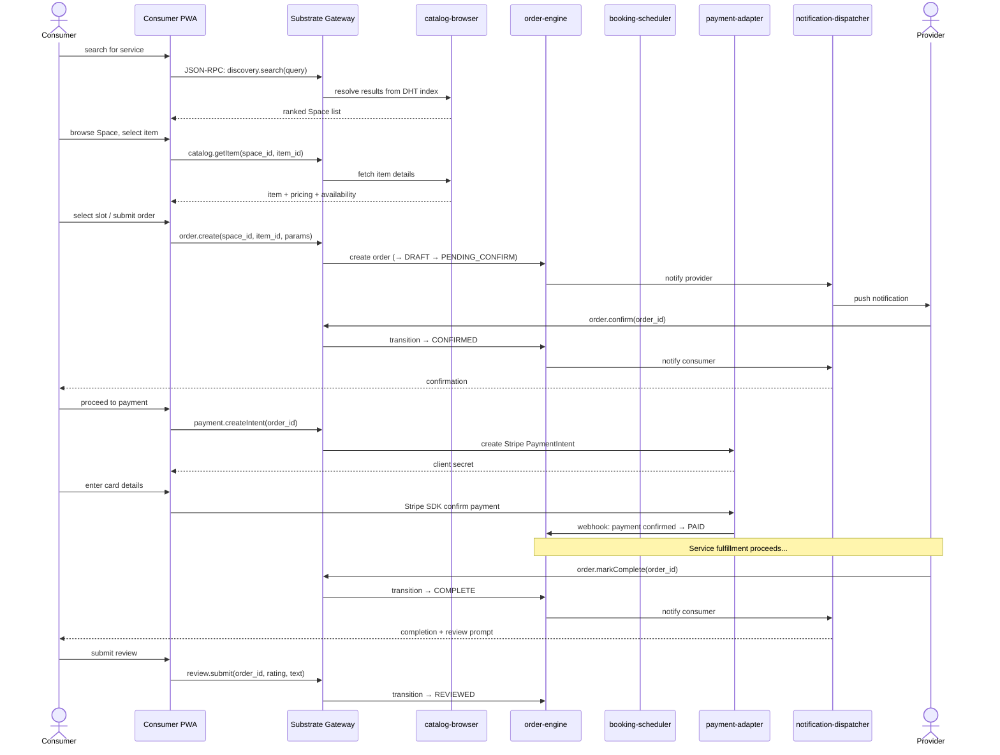

#### 7.1.4 Recommendation Algorithm

**[TBD: Recommendation algorithm]**

Catalog recommendations are **client-side only** — no consumer query data is sent to third parties.

```
score(item, consumer_context) =
    0.4 × collaborative_signal     // items frequently co-viewed/co-ordered by similar consumers (local cluster only)
  + 0.3 × semantic_similarity      // embedding distance between item description and consumer's session query history
  + 0.2 × provider_reputation      // normalised reputation score of Space
  + 0.1 × recency                  // freshness of catalog entry
```

Consumer session context (query history, viewed items) is kept **only in PWA local storage**, never transmitted. Collaborative signals are computed from **aggregate anonymised counts** published by the provider substrate — no individual consumer data leaves their device.

**Key differences from SynApp 1:**
- Catalog schema includes `available_until` (time-bounded perishables) and `preparation_time_minutes`
- Adds `delivery-engine` and `tracking-service` components
- Order state machine includes `PREPARING`, `OUT_FOR_DELIVERY`, `DELIVERED` sub-states within `IN_PROGRESS`

---

## 8. Federation Architecture

### 8.1 Cross-Substrate Discovery Flow

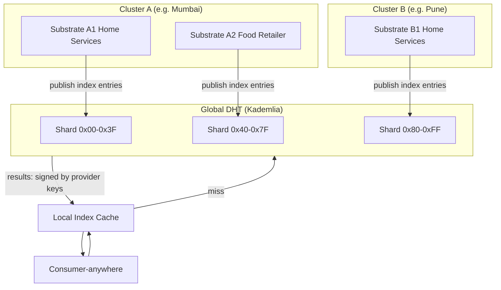

### 8.2 Minimum Federation Contract

A third-party SynApp is federation-compatible if it implements:

1. **Identity:** Ed25519 keypair; identity doc in DHT
2. **Discovery:** Publishes index entries conforming to the `IndexEntry` WIT type to the DHT
3. **Messaging:** Accepts structured substrate messages typed with shared WIT interfaces
4. **Reputation:** Generates `ReputationRecord` conforming to the shared schema on transaction completion
5. **Portability:** Exports data in the documented `SynExport` archive format

No central coordinator is required — these are convention-based contracts enforced by schema validation.

---

## 9. Consumer Experience Architecture

### 9.1 Consumer App Architecture

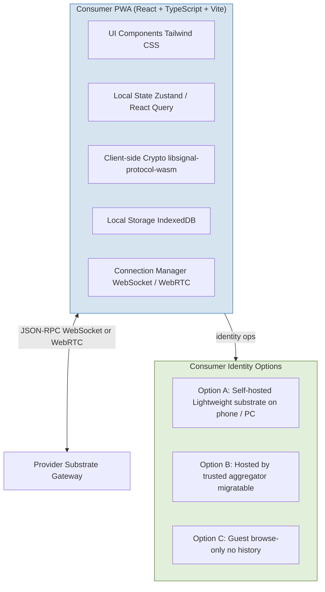

---

## 10. Security Architecture

### 10.1 Encryption at Every Layer

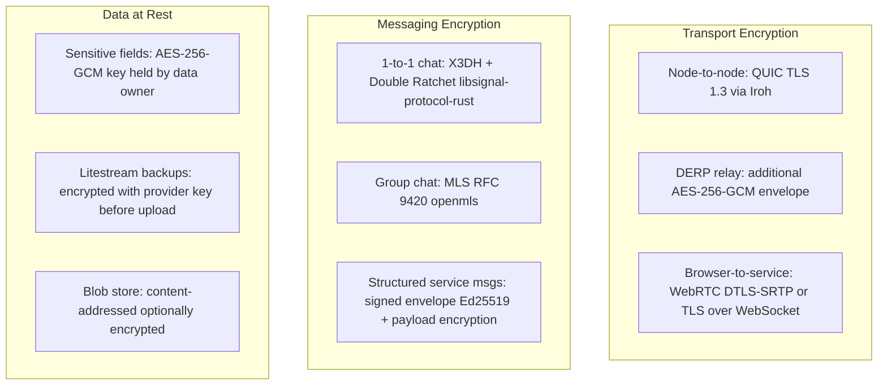

### 10.2 Isolation Guarantees

```mermaid
flowchart TD
    subgraph NODE2["NODE (physical machine)"]
        subgraph APP1["SynApp 1 (WASM sandbox)"]
            W1[WASM Component WASI capability-limited]
            DB1[(cr-sqlite App 1 only)]
        end

        subgraph APP2["SynApp 2 (Podman container)"]
            P1[OCI Container rootless, non-root user]
            DB2[(cr-sqlite App 2 only)]
        end

        subgraph SUBSTRATE_CORE["Substrate Core"]
            AC3[ABAC Engine enforces all cross-app access]
            MSG4[Message Router no cross-app ambient access]
        end
    end

    APP1 <-->|"explicit substrate-mediated API calls only"| SUBSTRATE_CORE
    APP2 <-->|"explicit substrate-mediated API calls only"| SUBSTRATE_CORE
    APP1 -. "no direct access" .-> APP2
    APP2 -. "no direct access" .-> APP1

    style APP1 fill:#E2EFDA,stroke:#548235
    style APP2 fill:#FCE4D6,stroke:#C55A11
    style SUBSTRATE_CORE fill:#D6E4F0,stroke:#2E75B6
```

---

## 11. Architecture TBD Items

This section is an index of every `[TBD]` marker in the requirements spec, that need to be revisited and finalized.

| # | TBD Item (from requirements spec) | Resolution | Section |
|---|---|---|---|
| 1 | Migration protocol | Signed `SynExport` archive; cr-sqlite snapshot + blob store + App Spec; `syneroym export/import` CLI | §5.2 |
| 2 | Backup mechanism | Litestream WAL streaming to S3-compatible or peer node; continuous or on-demand | §5.2 |
| 3 | CRDT merge semantics | cr-sqlite with HLC timestamps; LWW per field; entity-specific override rules defined | §5.3 |
| 4 | Conflict resolution rules per entity type | Full merge rule table per entity type; order conflicts favour provider authority | §5.3 |
| 5 | Vouching mechanics and weighting | Signed VouchRecord; weight = `base × 0.5^hops`; max depth 3; stake requirement for high-weight vouches | §6.4 |
| 6 | Credential format and verification | W3C VC Data Model 2.0; `didkit` for issuance/verification; consumer configures trusted issuers | §6.4 |
| 7 | Reputation portability mechanism | Both-party signed `ReputationRecord` anchored in DHT; portable by republishing under same identity key | §6.4 |
| 8 | Propagation protocol (community moderation) | Signed block/trust lists; propagated via DHT with decay weight; aggregators are authoritative for their cluster | §6.4 |
| 9 | Anti-gaming mechanisms | Bayesian reputation average; ad boost cap; TF-IDF keyword scoring; review bomb detection | §6.4 |
| 10 | Sybil resistance | Stake requirement for vouching; rate limiting; both-party signature on reputation records | §6.4 |
| 11 | Payment rails and escrow | Stripe Connect (MVP) + UPI; pluggable adapter pattern; centralised escrow via Stripe MVP | §6.5 |
| 12 | Coin and mutual credit mechanics | Bilateral signed IOU ledger (post-MVP); Syneroym internal ledger token (post-MVP); no blockchain | §6.5 |
| 13 | Recommendation algorithm | Client-side scoring formula; no consumer data transmitted; collaborative signals from anonymised aggregates | §7.1.4 |
| 14 | Discovery partitioning and consistency model | Kademlia DHT; XOR-distance sharding; replication factor 3; eventual consistency; 72h TTL | §6.2 |
| 15 | Discovery ranking algorithm | Transparent weighted formula (5 signals); ad boost capped at 0.3; formula published open-source | §6.2 |
| 16 | Decentralised bootstrap fallback | pkarr signed packets mirrored to BitTorrent DHT; 24h local cache; community governance key | §4.3 |
| 17 | Ad auction mechanics and placement limits | Ad boost is a `[0.0–0.3]` float in the index entry; no auction in MVP; elevated placement within local cluster only | §6.2 |

---

## 12. Consolidated Technology Stack

### 12.1 Core Infrastructure & Substrate

| Layer / Concern | Technology | Notes |
|---|---|---|
| Substrate language | **Rust** (2021 edition, stable) | Memory safety; WASM compilation target; strong async ecosystem |
| Async runtime | **Tokio** 1.x | Industry standard; required by Iroh |
| P2P / relay | **Iroh** (iroh + iroh-net) | QUIC, NAT hole punching, DERP relay |
| WebRTC (browser) | **webrtc-rs** | Browser-to-service via Data Channels |
| WASM runtime | **Wasmtime** (latest stable, WASI 0.2) | Bytecode Alliance; component model support |
| Container runtime | **Podman** 4.x+ (rootless) | No daemon; rootless; Docker-compatible |
| API IDL | **WIT** (Component Model 1.0) | Single source of truth for all interfaces |
| External API | **JSON-RPC 2.0** over WebSocket | Derived automatically from WIT |
| Inter-component calls | **wRPC** | High-performance streaming between components |
| Local storage | **cr-sqlite** | CRDT-extended SQLite; HLC timestamps |
| Backup / replication | **Litestream** | WAL streaming; S3-compatible or peer |
| DHT / registry | **pkarr** + BEP 0044 DHT | SynApp registry + bootstrap fallback |
| Local DNS | **Hickory DNS** (Rust) | Dynamic relay hostname resolution |
| Observability | **OpenTelemetry** (OTLP) | Traces + metrics + logs; Grafana/Prometheus exporters |
| Configuration | **TOML** + JSON Schema | Human-readable; validated |

### 12.2 SynApp & Crypto Libraries

| Concern | Technology | Notes |
|---|---|---|
| SynApp component language | **Rust → WASM** (wit-bindgen) | Primary path |
| OCI services | **Rust or Go** in Alpine container | For services that can't target WASM |
| 1-to-1 messaging crypto | **libsignal-protocol-rust** | X3DH + Double Ratchet |
| Group messaging crypto | **openmls** (Rust) | MLS RFC 9420 |
| Verifiable Credentials | **didkit** (Rust) | W3C VC Data Model 2.0 |
| DRM video | **Shaka Player** | Digital content delivery |
| Payment (MVP) | **Stripe Connect SDK** + UPI deep links | Pluggable adapter |

### 12.3 Consumer Frontend

| Concern | Technology |
|---|---|
| Framework | **React** (TypeScript) + **Vite** |
| Styling | **Tailwind CSS** |
| State management | **Zustand** + **React Query** |
| Mobile wrapper | **Tauri** (Rust) — code sharing with substrate |
| Client-side crypto | **libsignal-protocol-wasm** |

### 12.4 Developer Toolchain

| Tool | Purpose |
|---|---|
| `cargo` + `cargo-component` | Build Rust → WASM components |
| `wit-bindgen` CLI | Generate host/guest bindings from WIT |
| `wasm-tools` | Component inspection, composition, adapter linking |
| `podman-compose` | Local multi-service development |
| `litestream` CLI | Backup/restore testing |
| `otelcol` | Local observability stack |
| `syneroym` CLI (custom) | Substrate management: deploy, remove, status, logs, export |

---

## 13. MVP Phase 1 Scope & Acceptance Criteria

### 13.1 In Scope

- Substrate: setup, keypair generation, relay registration, Wasmtime + Podman sandboxing
- Identity + access control: Ed25519 identity, ABAC policy enforcement, UCAN delegation tokens
- P2P: Iroh QUIC + DERP relay fallback; WebRTC for browsers
- Discovery: local index cache, DHT participation, keyword + geo + attribute search
- Messaging: 1-to-1 E2E encrypted chat; structured service messages
- Storage: cr-sqlite; Litestream backup; offline queue with deterministic replay
- SynApp 1 MVP: Space setup, catalog browse, full order state machine (DRAFT → COMPLETE), Stripe payment integration
- Consumer PWA: discover, browse, order, pay
- Data portability: `SynExport` format; export and import CLI commands

### 13.2 Explicitly Out of Scope (MVP)

- Syneroym-native coin or mutual credit
- Advanced ad auction mechanics (ad boost field is present but auction engine is not)
- Fully decentralised bootstrap replacement (DHT mirror is built; full replacement is not)
- AI-assisted workflow synthesis

### 13.3 Acceptance Criteria

1. A provider deploys SynApp 1 on a single node and creates a Space with catalog entries
2. A consumer on a separate node discovers that Space via DHT and completes an order end-to-end including payment
3. If either side goes offline during the order flow, queued actions synchronise and resolve deterministically on reconnection
4. Provider exports service and transaction data via `syneroym export` and restores it on a new node without data loss in core entities
5. ABAC policies prevent unauthorised reads/writes across at least two independent users and two services
6. At least one trust signal (VC, vouch count, or reputation score) is visible to the consumer before payment confirmation

---

## 14. Open Questions & Recommendations

| # | Question | Priority | Recommendation / Direction |
|---|---|---|---|
| OQ-1 | **DHT implementation choice:** libp2p Kademlia vs custom BEP 0044. | High | **Custom BEP 0044 over Iroh.** Avoids bloating dependency tree with libp2p and conflicting network stacks. Aligns with `pkarr`. Use `mainline` crate logic over Iroh QUIC connections. |
| OQ-2 | **Consumer identity for non-self-hosters:** SLA and migration. | High | **Device-Bound Keys + Encrypted Cloud Backup.** Generate Ed25519 locally in browser. Encrypt state/keys symmetrically for multi-device sync, stored as opaque blobs on Syneroym/Aggregator storage. |
| OQ-3 | **Bootstrap governance:** operations and funding. | High | **Consortium Model.** Major aggregators (e.g., Guilds, Meshes) form a non-profit consortium to share hosting costs of distributed bootstrap nodes, with DHT fallback ensuring network survival. |
| OQ-4 | **Minimum federation contract:** WIT versioning. | Medium | **RFC Process for WIT Interfaces.** Establish `syneroym/core-interfaces`. Use Wasmtime adapter components to translate between versions (e.g., `v1` to `v2`) during deprecation periods. |
| OQ-5 | **Aggregator accountability:** legal and operational obligations. | Medium | **Layer 3/4 Trust Mechanisms.** Aggregators issue Verifiable Credentials (VCs). If malicious, providers migrate via `SynExport`, drop bad VC, and acquire a new one from a trusted aggregator. |
| OQ-6 | **Infrastructure Provider SLA:** formal guarantees. | Medium | **Substrate Uptime Proofs.** Substrates broadcast encrypted heartbeats to Provider PWAs. If SLA drops (e.g., < 99%), UI prompts provider to migrate Space using `SynExport`. |
| OQ-7 | **Consumer UX ownership:** Consumer PWA governance. | Medium | **Reference Open-Source PWA.** Syneroym builds and open-sources a reference PWA (MIT/Apache). Aggregators fork and brand it, hardcoding their bootstrap nodes and tuning local discovery weights. |
| OQ-8 | **Payment rail expansion:** cross-border, smart-contract escrow. | Low | Defer to Post-MVP. Evaluate based on initial adoption metrics. |
| OQ-9 | **Regulatory review:** mutual credit and Syneroym coin in target markets. | Low | Defer to Post-MVP. Requires legal counsel engagement before implementation. |
| OQ-10 | **AI-assisted workflow synthesis:** scope, integration, privacy. | Low | Defer to Post-MVP. Keep workflows manual for Phase 1. |

---

## 15. Glossary

| Term | Definition |
|---|---|
| **SynApp** | A composed set of SYN-SVCs that together implement a business application |
| **SYN-SVC** | A running instance of a SYN-MOD; executes within a SVC-SANDBOX on a NODE |
| **SYN-MOD** | A reusable, independently deployable unit of business logic (WASM component or OCI image) |
| **SYN-SUBSTRATE** | The core runtime layer on a NODE; manages deployment, messaging, discovery, and access control |
| **NODE** | A physical or virtual machine running one SUBSTRATE instance |
| **HOME_RELAY** | A relay server providing connectivity for SUBSTRATEs behind NAT or firewall |
| **Space** | A named, provider-configured business context within a SynApp (e.g. a plumber's booking page) |
| **WIT** | WebAssembly Interface Types — the IDL used for all component interfaces |
| **CRDT** | Conflict-free Replicated Data Type — data structure that merges deterministically without coordination |
| **HLC** | Hybrid Logical Clock — combines physical and logical time; used for CRDT ordering in cr-sqlite |
| **DERP** | Designated Encrypted Relay Protocol — Iroh's relay transport when QUIC direct connection fails |
| **ABAC** | Attribute-Based Access Control — policy model used by the substrate access control engine |
| **pkarr** | Public-Key Addressable Resource Records — DHT records signed by an Ed25519 key |
| **UCAN** | User Controlled Authorization Networks — capability token standard used for delegation |
| **wRPC** | WIT-native RPC — high-performance inter-component streaming calls within a node |
| **LWW** | Last-Write-Wins — CRDT merge strategy where the most recent write (by HLC) takes precedence |
| **MLS** | Messaging Layer Security (RFC 9420) — end-to-end encrypted group messaging protocol |

---

*Syneroym Architecture Design Document v0.1 — Internal & Confidential*
