# Syneroym Ecosystem — Architecture Document
---

## Table of Contents

- [Executive Summary](#executive-summary)
- [Architecture Goals & Constraints](#architecture-goals--constraints)
- [System Layers Overview](#system-layers-overview)
- [Layer 1 — Infrastructure](#layer-1--infrastructure)
- [Layer 2 — Substrate Runtime](#layer-2--substrate-runtime)
- [Layer 3 — Shared Substrate Utilities](#layer-3--shared-substrate-utilities)
- [Layer 4 — SynApp Specifications](#layer-4--synapp-specifications)
- [Federation Architecture](#federation-architecture)
- [Consumer Experience Architecture](#consumer-experience-architecture)
- [Observability Architecture](#observability-architecture)
- [Security Architecture](#security-architecture)
- [Resolved Architecture TBD Items](#resolved-architecture-tbd-items)
- [Consolidated Technology Stack](#consolidated-technology-stack)
- [MVP Phase 1 Scope & Acceptance Criteria](#mvp-phase-1-scope--acceptance-criteria)
- [Future: Heterogeneous Networks](#connectivity-substrate-in-heterogeneous-networks)
- [Open Questions](#open-questions)
- [Glossary](#glossary)

---

## Executive Summary

Syneroym is a federated, locality-first ecosystem for autonomous mini-applications (**SynApps**) that run on provider-controlled commodity hardware. It replicates the benefits of large consumer platforms — discovery, reputation, standardised transaction flows, institutional trust — while eliminating their drawbacks: vendor lock-in, data ownership loss, governance asymmetry, and opaque algorithms.

This document defines the architecture, technology stack, component design for:

- **The Syneroym Substrate** — the common technology layer all SynApps run on
- **SynApp 1: Business, Professional & Retail Spaces** — Home Services Guild + Food & Small Retailer Mesh

---

## Architecture Goals & Constraints

### Guiding Principles

| Principle | Implication |
|---|---|
| **Locality-first** | Optimised for geographically proximate providers and consumers; global scale is secondary |
| **Progressive decentralisation** | Single device is fully useful; federation is additive |
| **Data sovereignty** | All provider data lives on provider-controlled infrastructure |
| **Transparency over opaqueness** | Ranking, discovery, and reputation algorithms are open-source or auditable |
| **Interoperability by convention** | SynApps cooperate via shared primitives; no central coordinator needed |
| **Offline-first** | Graceful degradation under partition; queued and async workflows |

### Key Hardware Constraints

| Profile | Hardware | Typical Use |
|---|---|---|
| Tier 1 — Minimal | Raspberry Pi 4, Android phone (2 GB RAM) | Single provider self-host, light load |
| Tier 2 — Standard | Old PC / mini PC (4–8 GB RAM, SSD) | Provider or small aggregator |
| Tier 3 — Distributed | Multiple VMs, PCs, Servers (8–32 GB RAM) | Infrastructure provider, large aggregator |

---

## System Layers Overview

The architecture is composed of four layers, each building on the one below.

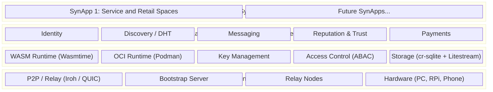
```mermaid
block-beta
  columns 1
  block:L4["Layer 4 — SynApp Layer"]
    A["SynApp 1: Service and Retail Spaces"]
    C["Future SynApps..."]
  end
  block:L3["Layer 3 — Shared Substrate Utilities"]
    D["Identity"]
    E["Discovery / DHT"]
    F["Messaging"]
    G["Reputation & Trust"]
    H["Payments"]
  end
  block:L2["Layer 2 — Substrate Runtime"]
    I["WASM Runtime (Wasmtime)"]
    J["OCI Runtime (Podman)"]
    K["Key Management"]
    L["Access Control (ABAC)"]
    M["Storage (cr-sqlite + Litestream)"]
  end
  block:L1["Layer 1 — Infrastructure"]
    N["P2P / Relay (Iroh / QUIC)"]
    O["Bootstrap Server"]
    P["Relay Nodes"]
    Q["Hardware (PC, RPi, Phone)"]
  end
```

### Conceptual Entity Model

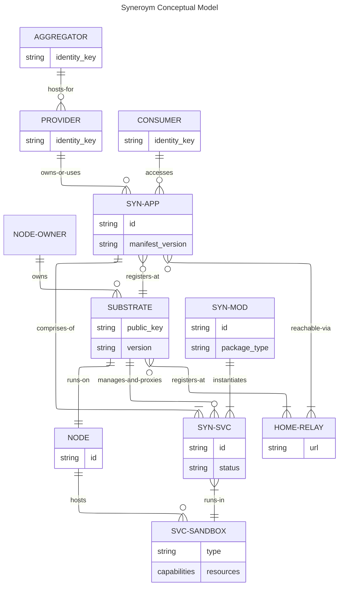
```mermaid
---
title: Syneroym Conceptual Model
config:
    layout: elk
---
erDiagram
    NODE-OWNER ||--o{ SUBSTRATE : owns
    SUBSTRATE ||--|| NODE : runs-on
    SUBSTRATE ||--o{ SYN-SVC : manages-and-proxies
    SUBSTRATE }o--|{ HOME-RELAY : registers-at
    SYN-APP ||--|{ SYN-SVC : comprises-of
    SYN-APP }o--|| SUBSTRATE : registers-at
    SYN-SVC }|--|| SVC-SANDBOX : runs-in
    NODE ||--o{ SVC-SANDBOX : hosts
    SYN-MOD ||--|{ SYN-SVC : instantiates
    SYN-APP }o--|{ HOME-RELAY : reachable-via
    PROVIDER ||--o{ SYN-APP : owns-or-uses
    AGGREGATOR ||--o{ PROVIDER : hosts-for
    CONSUMER ||--o{ SYN-APP : accesses

    NODE { string id }
    SUBSTRATE { string public_key string version }
    SYN-SVC { string id string status }
    SYN-APP { string id string manifest_version }
    SYN-MOD { string id string package_type }
    SVC-SANDBOX { string type capabilities resources }
    HOME-RELAY { string url }
    PROVIDER { string identity_key }
    CONSUMER { string identity_key }
    AGGREGATOR { string identity_key }
```

---

## Layer 1 — Infrastructure

### P2P Networking: Iroh

*Note: MVP focuses on connecting peers over IP. Future enhancements for heterogeneous networks (BLE, LoRa) are detailed in the [Connectivity Substrate](#connectivity-substrate-in-heterogeneous-networks) section.*

Direct QUIC (UDP) connections are attempted first. NAT/firewall fallback uses relay-mediated connections.

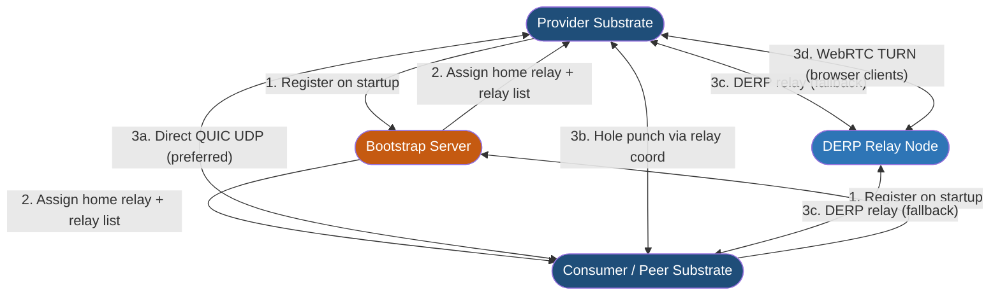
```mermaid
flowchart TD
    A([Provider Substrate]) 
    B([Consumer / Peer Substrate])
    R([DERP Relay Node])
    BS([Bootstrap Server])

    A -->|"1. Register on startup"| BS
    B -->|"1. Register on startup"| BS
    BS -->|"2. Assign home relay + relay list"| A
    BS -->|"2. Assign home relay + relay list"| B

    A <-->|"3a. Direct QUIC UDP (preferred)"| B
    A <-->|"3b. Hole punch via relay coord"| B
    A <-->|"3c. DERP relay (fallback)"| R
    R <-->|"3c. DERP relay (fallback)"| B

    A <-->|"3d. WebRTC TURN (browser clients)"| R

    style A fill:#1F4E79,color:#fff
    style B fill:#1F4E79,color:#fff
    style R fill:#2E75B6,color:#fff
    style BS fill:#C55A11,color:#fff
```

**Technology:** `iroh` (Rust crate) — provides QUIC transport, NAT hole punching, DERP relay, and peer discovery in a single library. `webrtc-rs` for browser clients via WebRTC Data Channels.

### Relay Node Architecture

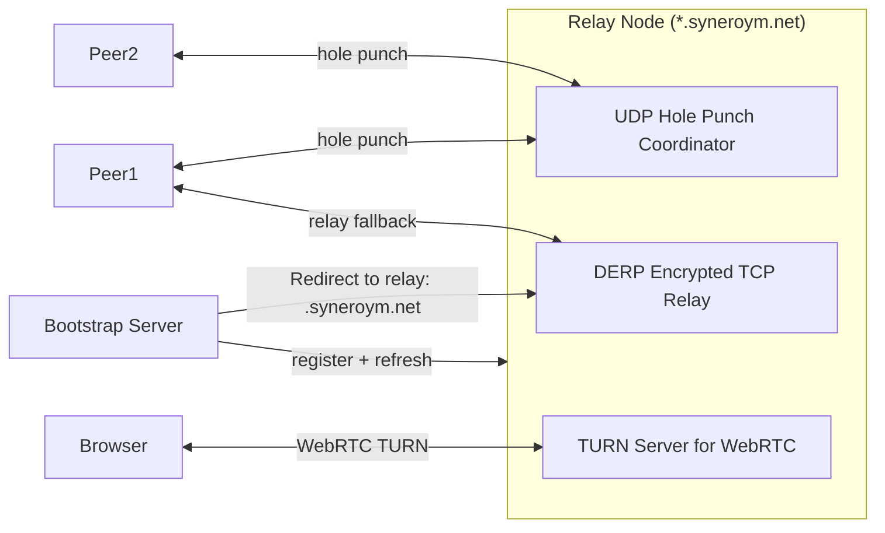
```mermaid
flowchart LR
    subgraph Relay["Relay Node (*.syneroym.net)"]
        HP[UDP Hole Punch Coordinator]
        DR[DERP Encrypted TCP Relay]
        TR[TURN Server for WebRTC]
    end

    BS[Bootstrap Server] -->|"register + refresh"| Relay
    BS -->|"Redirect to relay: <relaynodeid>.syneroym.net"| DR
    Peer1 <-->|"hole punch"| HP
    Peer2 <-->|"hole punch"| HP
    Peer1 <-->|"relay fallback"| DR
    Browser <-->|"WebRTC TURN"| TR
```

**Local DNS:** Each substrate caches relay hostname resolutions. This avoids hammering Bootstrap server for the large number of dynamically rotating relay nodes.

### Bootstrap Server & DHT Fallback

**Decentralised Bootstrap Fallback**

The bootstrap server is an operational dependency. To survive its unavailability:

1. The bootstrap server **mirrors its relay registry** as `pkarr` signed packets published to the BitTorrent DHT under a well-known namespace key (`syneroym-relays.<version>`)
2. Substrates **cache** the last-known relay list locally (TTL: 24 hours)
3. On bootstrap unavailability, substrates use the cached list, then fall back to DHT lookup via `pkarr`
4. A community governance key signs the DHT namespace — any sufficiently trusted community member can republish in an emergency

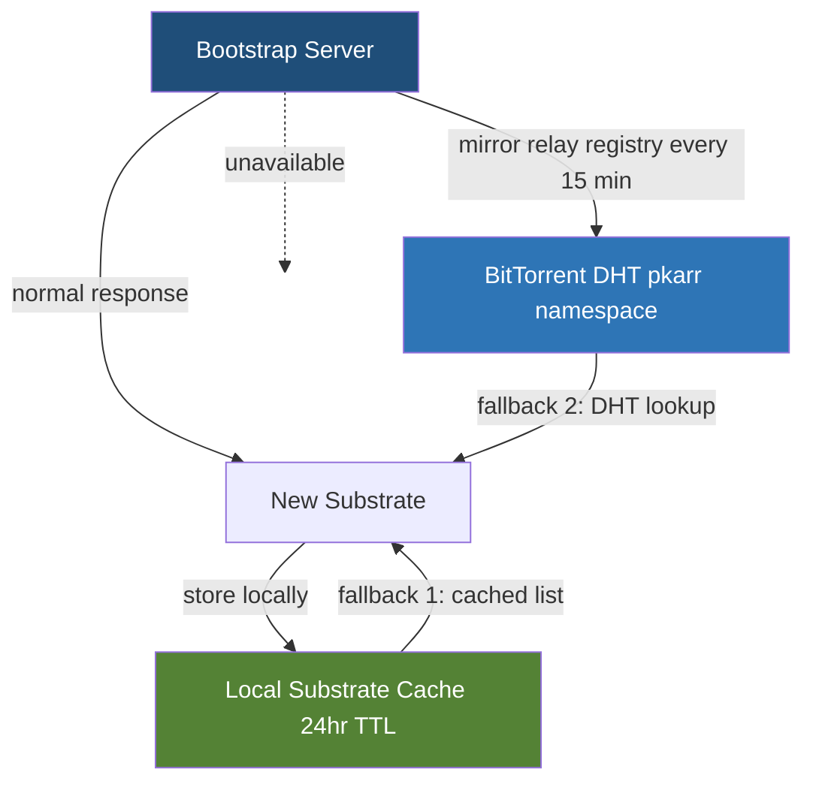
```mermaid
flowchart TD
    BS[Bootstrap Server]
    DHT[BitTorrent DHT pkarr namespace]
    CACHE[Local Substrate Cache 24hr TTL]
    SUB[New Substrate]

    BS -->|"mirror relay registry every 15 min"| DHT
    BS -->|"normal response"| SUB
    SUB -->|"store locally"| CACHE

    BS -. unavailable .-> X[ ]
    CACHE -->|"fallback 1: cached list"| SUB
    DHT -->|"fallback 2: DHT lookup"| SUB

    style X fill:none,stroke:none
    style BS fill:#1F4E79,color:#fff
    style DHT fill:#2E75B6,color:#fff
    style CACHE fill:#548235,color:#fff
```

---

## Layer 2 — Substrate Runtime

### Substrate Internal Architecture

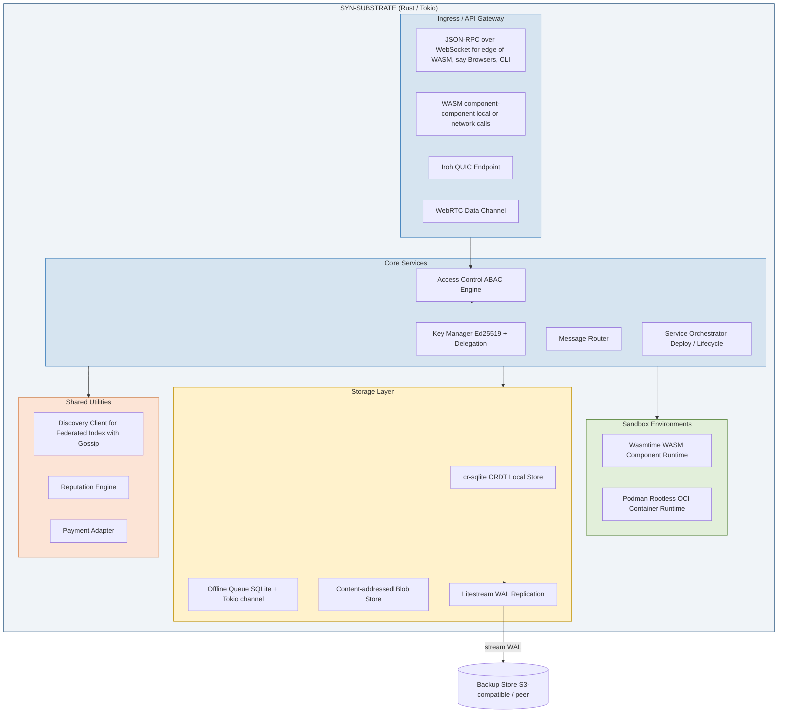
```mermaid
flowchart TD
    subgraph SUBSTRATE["SYN-SUBSTRATE (Rust / Tokio)"]
        direction TB
        
        subgraph INGRESS["Ingress / API Gateway"]
            WS[JSON-RPC over WebSocket for edge of WASM, say Browsers, CLI]
            wRPC[WASM component-component local or network calls]
            QUIC_EP[Iroh QUIC Endpoint]
            WRT[WebRTC Data Channel]
        end

        subgraph CORE["Core Services"]
            KM[Key Manager Ed25519 + Delegation]
            AC[Access Control ABAC Engine]
            MSG[Message Router]
            ORCH[Service Orchestrator Deploy / Lifecycle]
        end

        subgraph SANDBOX["Sandbox Environments"]
            WASM[Wasmtime WASM Component Runtime]
            OCI[Podman Rootless OCI Container Runtime]
        end

        subgraph STORAGE["Storage Layer"]
            CRSQL[cr-sqlite CRDT Local Store]
            QUEUE[Offline Queue SQLite + Tokio channel]
            BLOB[Content-addressed Blob Store]
            LS[Litestream WAL Replication]
        end

        subgraph UTIL["Shared Utilities"]
            DISC[Discovery Client for Federated Index with Gossip]
            REP[Reputation Engine]
            PAY[Payment Adapter]
        end
    end

    INGRESS --> AC
    AC --> CORE
    CORE --> SANDBOX
    CORE --> STORAGE
    CORE --> UTIL
    STORAGE --> LS
    LS -->|"stream WAL"| BACKUP[(Backup Store S3-compatible / peer)]

    style SUBSTRATE fill:#f0f4f8,stroke:#1F4E79
    style INGRESS fill:#D6E4F0,stroke:#2E75B6
    style CORE fill:#D6E4F0,stroke:#2E75B6
    style SANDBOX fill:#E2EFDA,stroke:#548235
    style STORAGE fill:#FFF2CC,stroke:#BF9000
    style UTIL fill:#FCE4D6,stroke:#C55A11
```

### SynApp Packaging & API Pipeline

**Packaging**


```mermaid
flowchart LR
    WIT[WIT Interface Definition]
    WB[wit-bindgen Code Generator]
    RS[Rust SynApp Source]
    WASM_C[WASM Component .wasm]
    APP_SPEC[App Spec .toml manifest]
    SUB[Substrate Orchestrator]
    JRPC[wRPC or JSON-RPC 2.0 External API]

    WIT -->|generates bindings| WB
    WB --> RS
    RS -->|"cargo component build"| WASM_C
    WASM_C --> APP_SPEC
    APP_SPEC -->|deploy| SUB
    SUB -->|derives automatically| JRPC

    style WIT fill:#1F4E79,color:#fff
    style JRPC fill:#2E75B6,color:#fff
```

**Migration Protocol and Backup Mechanism**
- `syneroym export --app <app-id>` produces a signed archive: cr-sqlite snapshot + blob store + identity keypair (optional) + App Spec
- Archive is portable to any substrate running a compatible substrate version
- Import validates the archive signature and replays into a fresh cr-sqlite instance
- Litestream continuous replication can additionally keep a live replica on a secondary node

### Storage & CRDT Merge Semantics

**CRDT merge semantics and conflict resolution**

All structured data is stored in **cr-sqlite** — SQLite extended with CRDT primitives. Each table row carries a Hybrid Logical Clock (HLC) timestamp and a site ID.

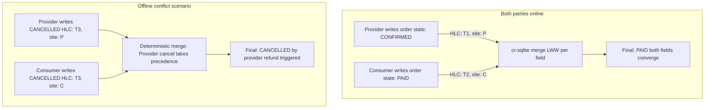
```mermaid
flowchart TD
    subgraph ONLINE["Both parties online"]
        A1[Provider writes order state: CONFIRMED] -->|"HLC: T1, site: P"| MERGE
        B1[Consumer writes order state: PAID] -->|"HLC: T2, site: C"| MERGE
        MERGE[cr-sqlite merge LWW per field] --> FINAL1[Final: PAID both fields converge]
    end

    subgraph OFFLINE["Offline conflict scenario"]
        A2[Provider writes CANCELLED HLC: T3, site: P] --> RECON
        B2[Consumer writes CANCELLED HLC: T3, site: C] --> RECON
        RECON[Deterministic merge: Provider cancel takes precedence] --> FINAL2[Final: CANCELLED by provider refund triggered]
    end
```

**Merge rules by entity type:**

| Entity | Merge Strategy | Rationale |
|---|---|---|
| Order state | Provider action beats consumer action within same HLC epoch; later HLC wins otherwise | Provider has operational authority over their service |
| Catalog item | Last-write-wins per field (standard LWW) | Catalog is provider-owned; no concurrent consumer writes |
| Message | Append-only log; no merge conflicts | Messages are immutable once sent |
| Booking slot | Availability is a set-CRDT (OR-Set); reservation is LWW with provider authority | Prevents double-booking |
| Reputation record | Append-only; signed by issuer; no merge | Records are immutable attestations |
| Access control policy | Provider LWW; infrastructure provider cannot override | Data sovereignty |

### Multi-Device Sync and Sharded Deployment

This section addresses two requirements: app sync across secondary provider devices and app sharding across multiple hosts.

**A) Multi-device sync (primary + secondary provider devices)**

- Each provider device runs a local substrate instance with its own site ID.
- App state changes are committed locally first in cr-sqlite, then replicated asynchronously.
- If a secondary device is offline, it continues operating on local state and queues outbound updates.
- On reconnection, peers exchange oplogs and converge using entity-specific merge rules from [Storage & CRDT Merge Semantics](#storage--crdt-merge-semantics).
- Operational ownership fields (for example, order lifecycle authority) remain deterministic across devices via signed identity roles.

**B) Sharded SynApp deployment (single app across multiple hosts)**

- App Spec supports per-component placement constraints, allowing components to run on distinct nodes.
- The substrate orchestrator schedules components based on declared resource class (`cpu`, `memory`, `gpu`, locality tags).
- Inter-shard communication uses substrate-authenticated service identities over QUIC/WebSocket.
- Failure of one shard does not halt unrelated shards; dependent workflows move to queued/retry mode until dependencies recover.

Example placement:

- `catalog-browser` + `space-manager` on low-cost edge node
- `order-engine` + `payment-adapter` on higher-availability node
- `drm-content-server` on storage-optimised node

### Substrate API Surfaces

To support diverse caller types (WASM components, peer substrates, CLI, browsers, external integrations), the substrate exposes **two API surfaces, both derived from identical WIT definitions**:

- **wRPC surface** — for WASM SynApp components (intra-substrate) and peer substrates (cross-node over Iroh QUIC), CLI. WIT types are preserved end-to-end; zero serialization overhead.
- **JSON-RPC 2.0 surface** — for browsers and third-party integrations, the provider status UI, and third-party integrations. Derived automatically from WIT; documented as an OpenRPC schema.

---

## Layer 3 — Shared Substrate Utilities

### Identity

Every entity has an **Ed25519** keypair. Identity documents are self-describing JSON-LD structures signed by the entity key.

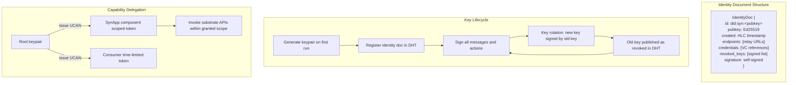
```mermaid
flowchart TD
    subgraph IDENTITY["Identity Document Structure"]
        direction LR
        ID_DOC["IdentityDoc {
          id: did:syn:&lt;pubkey&gt;
          pubkey: Ed25519
          created: HLC timestamp
          endpoints: [relay URLs]
          credentials: [VC references]
          revoked_keys: [signed list]
          signature: self-signed
        }"]
    end

    subgraph LIFECYCLE["Key Lifecycle"]
        GEN[Generate keypair on first run] --> REG[Register identity doc in DHT]
        REG --> USE[Sign all messages and actions]
        USE --> ROT[Key rotation: new key signed by old key]
        ROT --> REV[Old key published as revoked in DHT]
        REV --> USE
    end

    subgraph DELEGATION["Capability Delegation"]
        ROOT[Root keypair] -->|"issue UCAN"| APP[SynApp component scoped token]
        ROOT -->|"issue UCAN"| CONSUMER_TOK[Consumer time-limited token]
        APP --> INVOKE[Invoke substrate APIs within granted scope]
    end
```

### Discovery & DHT

**Relay Discovery:** BEP 0044 Mainline DHT (via `pkarr`) is used for relay information storage.

**Searchable Catalog:** Federated local indexes with gossip propagation.
- Substrates maintain a local SQLite FTS5 (full-text search) index of known Spaces.
- Substrates gossip new entries to peers within their cluster.
- Consumer queries hit the local index first, fanning out to known peers if results are insufficient.
- No global DHT is used for search; epidemic propagation within clusters aligns with the locality-first principle.

**Partitioning, consistency model, and ranking algorithm**

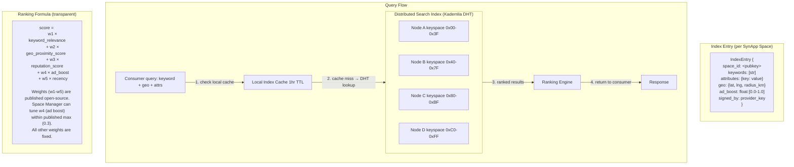
```mermaid
flowchart TD
    subgraph DHT["Distributed Search Index (Kademlia DHT)"]
        direction LR
        N1[Node A keyspace 0x00-0x3F]
        N2[Node B keyspace 0x40-0x7F]
        N3[Node C keyspace 0x80-0xBF]
        N4[Node D keyspace 0xC0-0xFF]
    end

    subgraph INDEX_ENTRY["Index Entry (per SynApp Space)"]
        E["IndexEntry {
          space_id: &lt;pubkey&gt;
          keywords: [str]
          attributes: {key: value}
          geo: {lat, lng, radius_km}
          ad_boost: float [0.0-1.0]
          signed_by: provider_key
        }"]
    end

    subgraph QUERY["Query Flow"]
        Q[Consumer query: keyword + geo + attrs]
        Q -->|"1. check local cache"| LC[Local Index Cache 1hr TTL]
        LC -->|"2. cache miss → DHT lookup"| DHT
        DHT -->|"3. ranked results"| RANK[Ranking Engine]
        RANK -->|"4. return to consumer"| RESP[Response]
    end

    subgraph RANKING["Ranking Formula (transparent)"]
        R["score = 
          w1 × keyword_relevance
          + w2 × geo_proximity_score  
          + w3 × reputation_score
          + w4 × ad_boost
          + w5 × recency

        Weights (w1-w5) are published open-source.
        Space Manager can tune w4 (ad boost)
        within published max (0.3).
        All other weights are fixed."]
    end
```

**Partitioning:** Standard Kademlia XOR-distance routing. Each substrate node stores index entries whose key (SHA-256 of space_id) falls within its keyspace shard. Replication factor: 3 (entries stored on 3 closest nodes).

**Consistency:** Eventual consistency; index entries carry an HLC timestamp. Stale entries expire after 72 hours unless refreshed by the provider substrate.

### Messaging

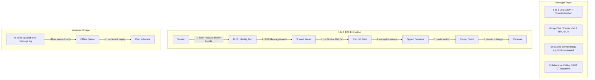
```mermaid
flowchart TD
    subgraph MSG_TYPES["Message Types"]
        direction LR
        M1[1-to-1 Chat X3DH + Double Ratchet]
        M2[Group Chat / Threads MLS RFC 9420]
        M3[Structured Service Msgs e.g. booking request]
        M4[Collaborative Editing CRDT OT document]
    end

    subgraph E2E["1-to-1 E2E Encryption"]
        direction LR
        S[Sender] -->|"1. fetch receiver prekey bundle"| DHT2[DHT / Identity Doc]
        DHT2 -->|"2. X3DH key agreement"| X3DH[Shared Secret]
        X3DH -->|"3. init Double Ratchet"| DR[Ratchet State]
        DR -->|"4. encrypt message"| ENV[Signed Envelope]
        ENV -->|"5. route via Iroh"| R_NODE[Relay / Direct]
        R_NODE -->|"6. deliver + decrypt"| REC[Receiver]
    end

    subgraph STORAGE_MSG["Message Storage"]
        CR[cr-sqlite append-only message log]
        CR -->|"offline: queue locally"| Q2[Offline Queue]
        Q2 -->|"on reconnect: replay"| PEER[Peer substrate]
    end
```

**Libraries:** `libsignal-protocol-rust` for X3DH + Double Ratchet; `openmls` (Rust) for MLS group messaging.

### Trust & Reputation

**Reputation:** Replaces global average ratings with network-gated trust signals and transactional proofs.

- **Network-Gated Ratings:** A provider's rating is only visible to consumers sharing a trust path in the vouch graph. This prevents rating inflation and fake reviews from strangers, reflecting real-world community trust. (Note: May present a cold-start challenge for consumers with thin networks).
- **Transactional Proof:** Displays verified transaction counts and repeat customer rates instead of subjective ratings. Both parties must sign the transaction record, providing a strong, verifiable signal.

**Trust, vouching, credentials, reputation portability, and anti-gaming**

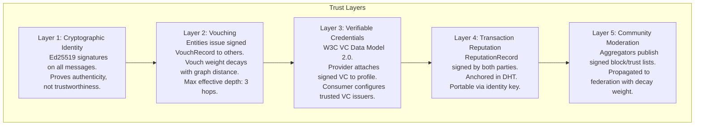
```mermaid
flowchart TD
    subgraph TRUST_LAYERS["Trust Layers"]
        L1["Layer 1: Cryptographic Identity
        Ed25519 signatures on all messages.
        Proves authenticity, not trustworthiness."]

        L2["Layer 2: Vouching
        Entities issue signed VouchRecord to others.
        Vouch weight decays with graph distance.
        Max effective depth: 3 hops."]

        L3["Layer 3: Verifiable Credentials
        W3C VC Data Model 2.0.
        Provider attaches signed VC to profile.
        Consumer configures trusted VC issuers."]

        L4["Layer 4: Transaction Reputation
        ReputationRecord signed by both parties.
        Anchored in DHT. Portable via identity key."]

        L5["Layer 5: Community Moderation
        Aggregators publish signed block/trust lists.
        Propagated to federation with decay weight."]

        L1 --> L2 --> L3 --> L4 --> L5
    end
```

**Vouching mechanics:**

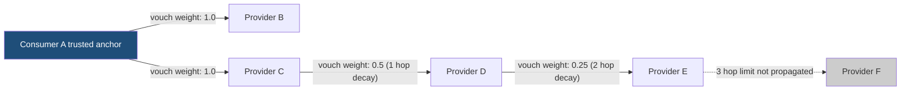
```mermaid
flowchart LR
    A[Consumer A trusted anchor] -->|"vouch weight: 1.0"| B[Provider B]
    A -->|"vouch weight: 1.0"| C[Provider C]
    C -->|"vouch weight: 0.5 (1 hop decay)"| D[Provider D]
    D -->|"vouch weight: 0.25 (2 hop decay)"| E[Provider E]
    E -. "3 hop limit not propagated" .-> F[Provider F]

    style A fill:#1F4E79,color:#fff
    style F fill:#CCCCCC
```

**Vouch weight formula:** `effective_weight = base_weight × decay_factor^hop_count`  
Default `decay_factor = 0.5`. Max effective depth: 3 hops (weight < 0.125 beyond this is ignored).

**Sybil resistance mechanisms:**
1. **Stake requirement:** To issue a vouch with weight > 0.5, the issuer must have ≥ 5 completed transactions with positive reputation in their own history
2. **Rate limiting:** Max 10 new vouches issued per 30-day window per identity
3. **Reputation anchoring:** Reputation records require both-party signatures — a provider cannot self-generate fake transaction history
4. **Community moderation override:** Aggregator block lists can zero out reputation from known Sybil clusters

**Anti-gaming (discovery ranking):**
- Ad boost is capped at `w4_max = 0.3` of total score — organic signals always dominate
- Keyword stuffing is mitigated by TF-IDF scoring on index entries (raw keyword count is not used)
- Review bombing detection: reputation score uses a Bayesian average with a prior of 3.5/5.0 and minimum 5 reviews before score is published

**Reputation portability:** A provider migrating substrates republishes their `ReputationRecord` collection (each record is independently signed by both parties) to the DHT under their existing identity key. No loss of history.

### Payments

**Payment Strategy (MVP):** MVP focuses on redirection to external payment flows (e.g., UPI deep links) or out-of-band settlement. Verification is offline-delayed. Fully integrated payment gateways are evaluated for post-MVP phases to minimize centralized dependencies initially.

**Payment rails, escrow, and post-MVP credit/coin direction**

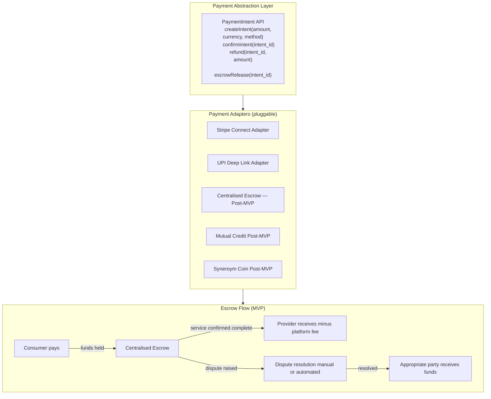
```mermaid
flowchart TD
    subgraph PAY_ABSTRACT["Payment Abstraction Layer"]
        API["PaymentIntent API
        createIntent(amount, currency, method)
        confirmIntent(intent_id)
        refund(intent_id, amount)
        escrowRelease(intent_id)"]
    end

    subgraph ADAPTERS["Payment Adapters (pluggable)"]
        STRIPE[Stripe Connect Adapter]
        UPI[UPI Deep Link Adapter]
        ESCROW[Centralised Escrow — Post-MVP]
        CREDIT[Mutual Credit Post-MVP]
        COIN[Syneroym Coin Post-MVP]
    end

    subgraph ESCROW_FLOW["Escrow Flow (MVP)"]
        direction LR
        C[Consumer pays] -->|"funds held"| E[Centralised Escrow]
        E -->|"service confirmed complete"| P[Provider receives minus platform fee]
        E -->|"dispute raised"| D[Dispute resolution manual or automated]
        D -->|"resolved"| BOTH[Appropriate party receives funds]
    end

    PAY_ABSTRACT --> ADAPTERS
    ADAPTERS --> ESCROW_FLOW
```

**Mutual credit (post-MVP):** A bilateral IOU system where providers and consumers issue credits to each other denominated in a local unit. No external currency is required. Each credit line is a signed ledger between two parties; the substrate mediates settlement. Regulatory classification varies by jurisdiction and requires legal review before rollout.

**Syneroym Coin (post-MVP):** Internal ledger token (not a cryptocurrency or blockchain-based token) managed by a community governance multi-sig. Used for ecosystem incentives and cross-aggregator settlement. Regulatory review required before launch.

---

## Layer 4 — SynApp Specifications

### SynApp 1: Business, Professional & Retail Spaces
Domain processes, protocols, and workflows for this SynApp are adapted from the Beckn Protocol for a peer-to-peer topology. Reference the protocol specifications here.

#### Component Architecture

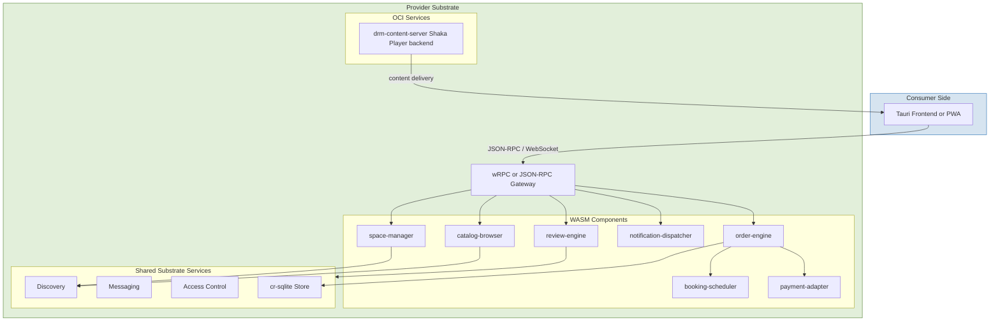
```mermaid
flowchart TD
    subgraph CONSUMER_SIDE["Consumer Side"]
        PWA[Tauri Frontend or PWA]
    end

    subgraph PROVIDER_SUBSTRATE["Provider Substrate"]
        GW[wRPC or JSON-RPC Gateway]
        
        subgraph WASM_COMPONENTS["WASM Components"]
            SM[space-manager]
            CB[catalog-browser]
            OE[order-engine]
            BS2[booking-scheduler]
            PA[payment-adapter]
            ND[notification-dispatcher]
            RE[review-engine]
        end

        subgraph OCI_SERVICES["OCI Services"]
            DRM[drm-content-server Shaka Player backend]
        end

        subgraph SHARED["Shared Substrate Services"]
            DISC2[Discovery]
            MSG2[Messaging]
            AC2[Access Control]
            STORE[cr-sqlite Store]
        end
    end

    PWA -->|"JSON-RPC / WebSocket"| GW
    GW --> SM & CB & OE & ND & RE
    OE --> BS2 & PA
    OE --> STORE
    SM --> DISC2
    CB --> DISC2
    RE --> SHARED
    DRM -->|"content delivery"| PWA

    style CONSUMER_SIDE fill:#D6E4F0,stroke:#2E75B6
    style PROVIDER_SUBSTRATE fill:#E2EFDA,stroke:#548235
```

#### Order State Machine

**Order conflict resolution rules**

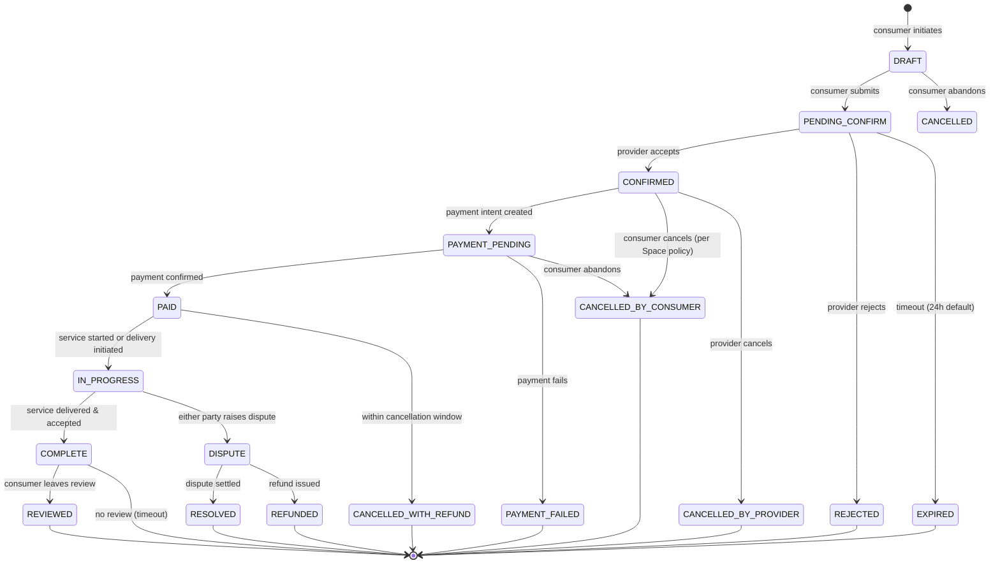
```mermaid
stateDiagram-v2
    [*] --> DRAFT : consumer initiates

    DRAFT --> PENDING_CONFIRM : consumer submits
    DRAFT --> CANCELLED : consumer abandons

    PENDING_CONFIRM --> CONFIRMED : provider accepts
    PENDING_CONFIRM --> REJECTED : provider rejects
    PENDING_CONFIRM --> EXPIRED : timeout (24h default)

    CONFIRMED --> PAYMENT_PENDING : payment intent created
    CONFIRMED --> CANCELLED_BY_CONSUMER : consumer cancels (per Space policy)
    CONFIRMED --> CANCELLED_BY_PROVIDER : provider cancels

    PAYMENT_PENDING --> PAID : payment confirmed
    PAYMENT_PENDING --> PAYMENT_FAILED : payment fails
    PAYMENT_PENDING --> CANCELLED_BY_CONSUMER : consumer abandons

    PAID --> IN_PROGRESS : service started or delivery initiated
    PAID --> CANCELLED_WITH_REFUND : within cancellation window

    IN_PROGRESS --> COMPLETE : service delivered & accepted
    IN_PROGRESS --> DISPUTE : either party raises dispute

    COMPLETE --> REVIEWED : consumer leaves review
    COMPLETE --> [*] : no review (timeout)

    DISPUTE --> RESOLVED : dispute settled
    DISPUTE --> REFUNDED : refund issued

    RESOLVED --> [*]
    REFUNDED --> [*]
    REVIEWED --> [*]
    REJECTED --> [*]
    EXPIRED --> [*]
    CANCELLED_BY_CONSUMER --> [*]
    CANCELLED_BY_PROVIDER --> [*]
    PAYMENT_FAILED --> [*]
    CANCELLED_WITH_REFUND --> [*]
```

**Offline conflict rules for order state:**
- Provider CANCELLED + Consumer CANCELLED in same HLC epoch → **Provider takes precedence** (provider has operational authority); refund triggered
- Provider CONFIRMED + Consumer CANCELLED in same HLC epoch → **Consumer wins** (consumer initiated the cancellation workflow first); no charge
- Both parties IN_PROGRESS state with diverged sub-state → **merge by union** of completed steps; disputed steps require manual resolution

#### Consumer Transaction Flow

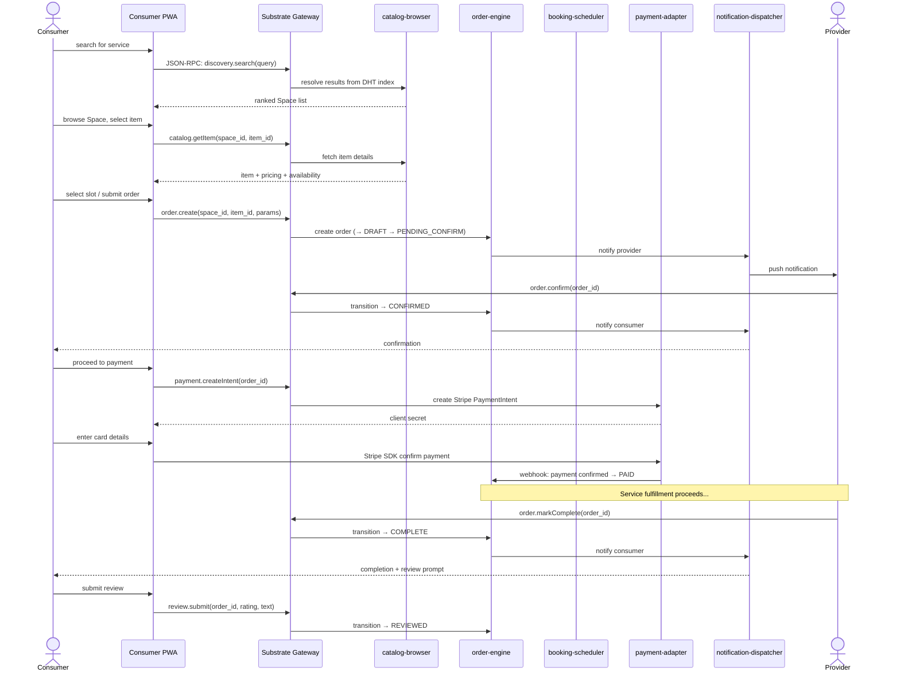
```mermaid
sequenceDiagram
    actor Consumer
    participant PWA as Consumer PWA
    participant GW as Substrate Gateway
    participant CB as catalog-browser
    participant OE as order-engine
    participant BS as booking-scheduler
    participant PA as payment-adapter
    participant ND as notification-dispatcher
    actor Provider

    Consumer->>PWA: search for service
    PWA->>GW: JSON-RPC: discovery.search(query)
    GW->>CB: resolve results from DHT index
    CB-->>PWA: ranked Space list

    Consumer->>PWA: browse Space, select item
    PWA->>GW: catalog.getItem(space_id, item_id)
    GW->>CB: fetch item details
    CB-->>PWA: item + pricing + availability

    Consumer->>PWA: select slot / submit order
    PWA->>GW: order.create(space_id, item_id, params)
    GW->>OE: create order (→ DRAFT → PENDING_CONFIRM)
    OE->>ND: notify provider
    ND->>Provider: push notification

    Provider->>GW: order.confirm(order_id)
    GW->>OE: transition → CONFIRMED
    OE->>ND: notify consumer
    ND-->>Consumer: confirmation

    Consumer->>PWA: proceed to payment
    PWA->>GW: payment.createIntent(order_id)
    GW->>PA: create Stripe PaymentIntent
    PA-->>PWA: client secret
    Consumer->>PWA: enter card details
    PWA->>PA: Stripe SDK confirm payment
    PA->>OE: webhook: payment confirmed → PAID

    Note over OE,Provider: Service fulfillment proceeds...

    Provider->>GW: order.markComplete(order_id)
    GW->>OE: transition → COMPLETE
    OE->>ND: notify consumer
    ND-->>Consumer: completion + review prompt

    Consumer->>PWA: submit review
    PWA->>GW: review.submit(order_id, rating, text)
    GW->>OE: transition → REVIEWED
```

#### Recommendation Algorithm

**Recommendation algorithm**

Catalog recommendations are **client-side only** — no consumer query data is sent to third parties.

```
score(item, consumer_context) =
    0.4 × collaborative_signal     // items frequently co-viewed/co-ordered by similar consumers (local cluster only)
  + 0.3 × semantic_similarity      // embedding distance between item description and consumer's session query history
  + 0.2 × provider_reputation      // normalised reputation score of Space
  + 0.1 × recency                  // freshness of catalog entry
```

Consumer session context (query history, viewed items) is kept **only in local app storage**, never transmitted. Collaborative signals are computed from **aggregate anonymised counts** published by the provider substrate — no individual consumer data leaves their device.

**Key differences from SynApp 1:**
- Adds `delivery-engine` and `tracking-service` components
- Order state machine includes `PREPARING`, `OUT_FOR_DELIVERY`, `DELIVERED` sub-states within `IN_PROGRESS`

---

## Federation Architecture

### Cross-Substrate Discovery Flow

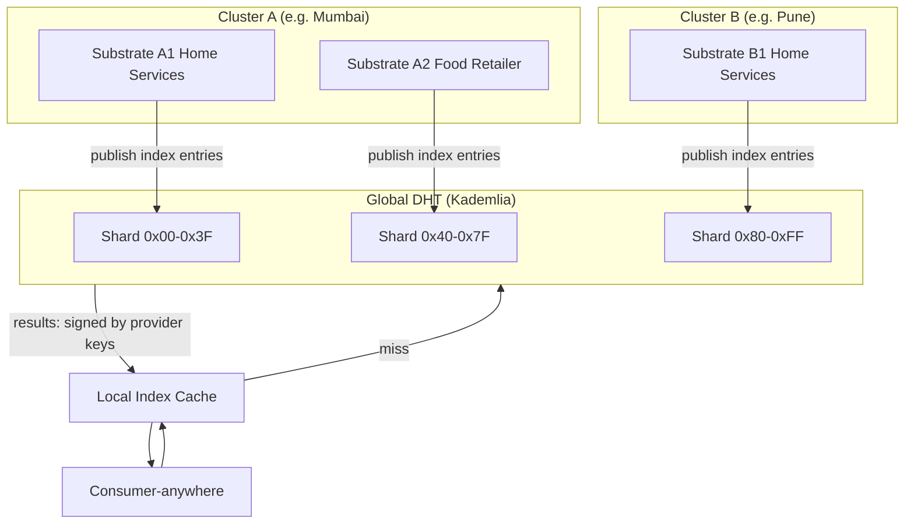
```mermaid
flowchart TD
    subgraph CLUSTER_A["Cluster A (e.g. Mumbai)"]
        SA1[Substrate A1 Home Services]
        SA2[Substrate A2 Food Retailer]
    end

    subgraph CLUSTER_B["Cluster B (e.g. Pune)"]
        SB1[Substrate B1 Home Services]
    end

    subgraph DHT2["Global DHT (Kademlia)"]
        SHARD1[Shard 0x00-0x3F]
        SHARD2[Shard 0x40-0x7F]
        SHARD3[Shard 0x80-0xFF]
    end

    CONSUMER3[Consumer-anywhere] --> LOCAL_CACHE[Local Index Cache]
    LOCAL_CACHE -->|"miss"| DHT2
    DHT2 -->|"results: signed by provider keys"| LOCAL_CACHE
    LOCAL_CACHE --> CONSUMER3

    SA1 -->|"publish index entries"| SHARD1
    SA2 -->|"publish index entries"| SHARD2
    SB1 -->|"publish index entries"| SHARD3
```

### Minimum Federation Contract

A third-party SynApp is federation-compatible if it implements:

1. **Identity:** Ed25519 keypair; identity doc in DHT
2. **Discovery:** Publishes index entries conforming to the `IndexEntry` WIT type to the DHT
3. **Messaging:** Accepts structured substrate messages typed with shared WIT interfaces
4. **Reputation:** Generates `ReputationRecord` conforming to the shared schema on transaction completion
5. **Portability:** Exports data in the documented `SynExport` archive format

No central coordinator is required — these are convention-based contracts enforced by schema validation.

---

## Consumer Experience Architecture

### Consumer App Architecture

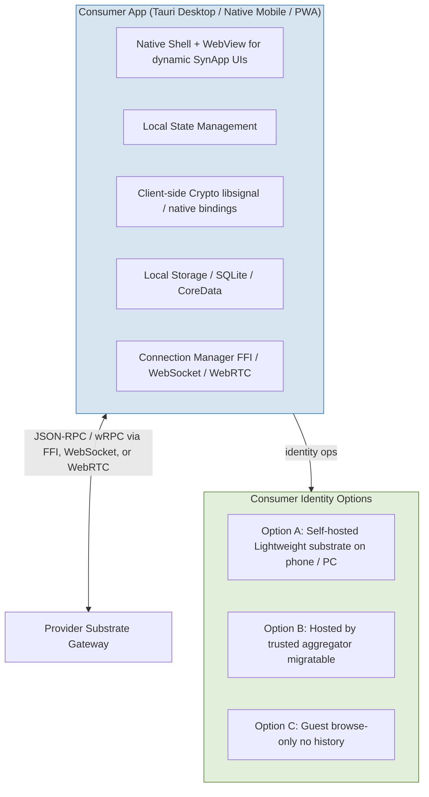
```mermaid
flowchart TD
    subgraph CLIENT["Consumer App (Tauri Desktop / Native Mobile / PWA)"]
        UI[Native Shell + WebView for dynamic SynApp UIs]
        STATE[Local State Management]
        CRYPTO_CLIENT[Client-side Crypto libsignal / native bindings]
        STORAGE_CLIENT[Local Storage / SQLite / CoreData]
        CONN[Connection Manager FFI / WebSocket / WebRTC]
    end

    subgraph IDENTITY_OPT["Consumer Identity Options"]
        OPT_A[Option A: Self-hosted Lightweight substrate on phone / PC]
        OPT_B[Option B: Hosted by trusted aggregator migratable]
        OPT_C[Option C: Guest browse-only no history]
    end

    CLIENT <-->|"JSON-RPC / wRPC via FFI, WebSocket, or WebRTC"| PROVIDER_GW[Provider Substrate Gateway]
    CLIENT -->|"identity ops"| IDENTITY_OPT

    style CLIENT fill:#D6E4F0,stroke:#2E75B6
    style IDENTITY_OPT fill:#E2EFDA,stroke:#548235
```

---

## Observability Architecture

### Design Philosophy

Observability in Syneroym is tailored for two audiences: **non-technical providers** (business health) and **support staff/developers** (technical diagnostics).

The substrate provides **instrumentation primitives, not bundled observability stacks**. It emits open-format signals that operators can route to their chosen backends. No external observability service is required to operate a substrate.

### Instrumentation Layer (All Tiers)

All instrumentation is in-process, zero-cost when unused, and based on open facades:

- **Tracing:** `tracing` crate (Rust). Structured spans and events at every component boundary, substrate hop, and async I/O point. A correlation `trace_id` generated at the client app flows through every wRPC call, queue entry, and cross-substrate message — enabling full reconstruction of any user action across nodes.
- **Metrics:** `metrics` crate facade. Key signals: order state transitions, queue depth and age, relay connection stability, merge conflict rate, component restart count. Default backend: in-process circular buffer. Operators attach external backends (Prometheus, VictoriaMetrics) by configuration.
- **Logs:** `tracing-subscriber` emitting structured JSON to a rotating local file. Human-readable with `jq`; parseable by any log tool. No external sink by default.
- **In-process ring buffer:** Retains the last N spans and metric snapshots in memory. Queryable via the substrate health API without any external tool. The primary observability interface for Tier 1 nodes.

### The `health-narrator` Component

The translation layer between raw instrumentation and provider-facing experience. A lightweight WASM component deployed as part of the substrate core that:

- Subscribes to the substrate event stream
- Maintains a rolling 7-day **plain-language event timeline** in cr-sqlite — human-readable records generated from structured log events via templates (e.g. *"Order #47 confirmed"*, *"Connection to relay lost"*)
- Evaluates a small set of health rules producing a simple `HealthState`: Connection / Payments / Sync — each Good, Degraded, or Offline with a plain-language explanation
- Sends proactive alerts via the notification dispatcher when health degrades
- Generates **diagnostic bundles** on demand: a signed, sanitized snapshot of recent timeline events, metric snapshots, substrate version and configuration — formatted for handoff to support staff

### Provider-Facing Status UI

Built into the substrate's own HTTP server as a static HTML page (assets bundled into the binary, no external process). Accessible at `http://localhost:8080/admin`. Shows:

- A single honest top-level status: *Your shop is open and reachable*
- Last booking time and today's order counts — business-level signals, not technical ones
- Three plain-language health indicators: Connection / Payments / Sync
- Proactive alert banners with plain-language explanations and suggested actions
- A **Get Help** button that generates and sends a diagnostic bundle to the provider's support contact via the substrate messaging layer — one tap, no technical knowledge required

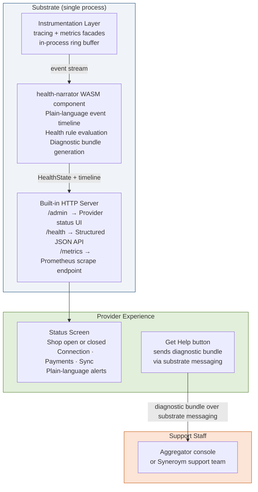
```mermaid
flowchart TD
    subgraph SUBSTRATE["Substrate (single process)"]
        INSTR["Instrumentation Layer
        tracing + metrics facades
        in-process ring buffer"]

        HN["health-narrator WASM component
        Plain-language event timeline
        Health rule evaluation
        Diagnostic bundle generation"]

        HTTP["Built-in HTTP Server
        /admin  → Provider status UI
        /health → Structured JSON API
        /metrics → Prometheus scrape endpoint"]
    end

    subgraph PROVIDER_UI["Provider Experience"]
        UI["Status Screen
        Shop open or closed
        Connection · Payments · Sync
        Plain-language alerts"]
        HELP["Get Help button
        sends diagnostic bundle
        via substrate messaging"]
    end

    subgraph SUPPORT["Support Staff"]
        AGG["Aggregator console
        or Syneroym support team"]
    end

    INSTR -->|event stream| HN
    HN -->|HealthState + timeline| HTTP
    HTTP --> UI
    HELP -->|diagnostic bundle over substrate messaging| AGG

    style SUBSTRATE fill:#f0f4f8,stroke:#1F4E79
    style PROVIDER_UI fill:#E2EFDA,stroke:#548235
    style SUPPORT fill:#FCE4D6,stroke:#C55A11
```

### Tiered Observability Stack

| Tier | What Ships | Notes |
|---|---|---|
| **Tier 1** — Mobile / RPi | In-process instrumentation + ring buffer + health-narrator + built-in HTML status UI | No external process; zero additional footprint |
| **Tier 2** — Standard node | All of Tier 1 + optional bundled OCI stack | One-command enable; auto-profile selection based on hardware tier |
| **Tier 3** — Distributed / Aggregator | All of Tier 2 + Tempo traces + support console + managed-node aggregation | Full stack; primary interface for support staff |

**Bundled OCI stack (Tier 2+, disabled by default):** Grafana OSS + VictoriaMetrics + Loki + Promtail. All single binaries, self-hosted, low-resource. Enabled via `syneroym observability enable`. Pre-built Syneroym dashboard JSON for core substrate and SynApp metrics provisioned automatically on enable.

**Aggregator as support console:** The aggregator's Grafana instance is the primary diagnostic tool for support staff. Diagnostic bundles from managed providers arrive via substrate messaging as structured reports. Deeper diagnostics can be pulled from any managed node with provider consent, enforced by ABAC policy.

**Tier 1 under aggregator:** A mobile or RPi node operating under an aggregator forwards its metrics scrape endpoint and log stream to the aggregator's bundled stack. The provider gets full dashboard visibility via the aggregator without running any stack locally.

### Simulation Testing and CRDT Validation

The substrate ships a **multi-node simulation harness** used during development and CI:

- Runs N substrate instances in a single test binary with a controllable fake network
- Induces partitions, delays, and node restarts deterministically
- Every CRDT merge rule has a corresponding simulation scenario verifying the deterministic outcome
- Property-based tests (`proptest`) verify CRDT correctness for arbitrary sequences of concurrent writes
- Simulation output carries the same `trace_id` correlation used in production — failures are immediately diagnosable from the trace

The harness is built during the walking skeleton stage and extended with each new component. It is the primary validation tool for offline and reconnect behavior before it reaches a real provider's device.

## Security Architecture

### Encryption at Every Layer

```mermaid
flowchart TD
    subgraph TRANSPORT["Transport Encryption"]
        T1[Node-to-node: QUIC TLS 1.3 via Iroh]
        T2[DERP relay: additional AES-256-GCM envelope]
        T3[Browser-to-service: WebRTC DTLS-SRTP or TLS over WebSocket]
    end

    subgraph MESSAGING_ENC["Messaging Encryption"]
        M1[1-to-1 chat: X3DH + Double Ratchet libsignal-protocol-rust]
        M2[Group chat: MLS RFC 9420 openmls]
        M3[Structured service msgs: signed envelope Ed25519 + payload encryption]
    end

    subgraph AT_REST["Data at Rest"]
        R1[Sensitive fields: AES-256-GCM key held by data owner]
        R2[Litestream backups: encrypted with provider key before upload]
        R3[Blob store: content-addressed optionally encrypted]
    end
```

### Isolation Guarantees

```mermaid
flowchart TD
    subgraph NODE2["NODE (physical machine)"]
        subgraph APP1["SynApp 1 (WASM sandbox)"]
            W1[WASM Component WASI capability-limited]
            DB1[(cr-sqlite App 1 only)]
        end

        subgraph APP2["SynApp 2 (Podman container)"]
            P1[OCI Container rootless, non-root user]
            DB2[(cr-sqlite App 2 only)]
        end

        subgraph APP3["SynApp 2 (WASM sandbox)"]
            W2[WASM Component WASI capability-limited]
            DB2[(cr-sqlite App 2 only)]
        end

        subgraph SUBSTRATE_CORE["Substrate Core"]
            AC3[ABAC Engine enforces all cross-app access]
            MSG4[Message Router no cross-app ambient access]
        end
    end

    APP1 <-->|"direct access after substrate-vetted initialization"| APP3
    APP1 <-->|"explicit substrate-mediated API calls only"| SUBSTRATE_CORE
    APP2 <-->|"explicit substrate-mediated API calls only"| SUBSTRATE_CORE
    APP1 -. "no direct access" .-> APP2
    APP2 -. "no direct access" .-> APP1

    style APP1 fill:#E2EFDA,stroke:#548235
    style APP2 fill:#FCE4D6,stroke:#C55A11
    style APP3 fill:#E2EFDA,stroke:#548235
    style SUBSTRATE_CORE fill:#D6E4F0,stroke:#2E75B6
```

---

## Resolved Architecture TBD Items

This section is an index of every `[TBD]` marker in the requirements spec, that need to be revisited and finalized.

| # | TBD Item (from requirements spec) | Resolution | Section |
|---|---|---|---|
| 1 | Migration protocol | Signed `SynExport` archive; cr-sqlite snapshot + blob store + App Spec; `syneroym export/import` CLI | [SynApp Packaging & API Pipeline](#synapp-packaging--api-pipeline) |
| 2 | Backup mechanism | Litestream WAL streaming to S3-compatible or peer node; continuous or on-demand | [SynApp Packaging & API Pipeline](#synapp-packaging--api-pipeline) |
| 3 | CRDT merge semantics | cr-sqlite with HLC timestamps; LWW per field; entity-specific override rules defined | [Storage & CRDT Merge Semantics](#storage--crdt-merge-semantics) |
| 4 | Conflict resolution rules per entity type | Full merge rule table per entity type; order conflicts favour provider authority | [Storage & CRDT Merge Semantics](#storage--crdt-merge-semantics) |
| 5 | Vouching mechanics and weighting | Signed VouchRecord; weight = `base × 0.5^hops`; max depth 3; stake requirement for high-weight vouches | [Trust & Reputation](#trust--reputation) |
| 6 | Credential format and verification | W3C VC Data Model 2.0; `didkit` for issuance/verification; consumer configures trusted issuers | [Trust & Reputation](#trust--reputation) |
| 7 | Reputation portability mechanism | Both-party signed `ReputationRecord` anchored in DHT; portable by republishing under same identity key | [Trust & Reputation](#trust--reputation) |
| 8 | Propagation protocol (community moderation) | Signed block/trust lists; propagated via DHT with decay weight; aggregators are authoritative for their cluster | [Trust & Reputation](#trust--reputation) |
| 9 | Anti-gaming mechanisms | Bayesian reputation average; ad boost cap; TF-IDF keyword scoring; review bomb detection | [Trust & Reputation](#trust--reputation) |
| 10 | Sybil resistance | Stake requirement for vouching; rate limiting; both-party signature on reputation records | [Trust & Reputation](#trust--reputation) |
| 11 | Payment rails and escrow | Out-of-band settlement / UPI redirection (MVP); pluggable adapter pattern evaluated post-MVP | [Payments](#payments) |
| 12 | Coin and mutual credit mechanics | Bilateral signed IOU ledger (post-MVP); Syneroym internal ledger token (post-MVP); no blockchain | [Payments](#payments) |
| 13 | Recommendation algorithm | Client-side scoring formula; no consumer data transmitted; collaborative signals from anonymised aggregates | [Recommendation Algorithm](#recommendation-algorithm) |
| 14 | Discovery partitioning and consistency model | Kademlia DHT; XOR-distance sharding; replication factor 3; eventual consistency; 72h TTL | [Discovery & DHT](#discovery--dht) |
| 15 | Discovery ranking algorithm | Transparent weighted formula (5 signals); ad boost capped at 0.3; formula published open-source | [Discovery & DHT](#discovery--dht) |
| 16 | Decentralised bootstrap fallback | pkarr signed packets mirrored to BitTorrent DHT; 24h local cache; community governance key | [Bootstrap Server & DHT Fallback](#bootstrap-server--dht-fallback) |
| 17 | Ad auction mechanics and placement limits | Ad boost is a `[0.0–0.3]` float in the index entry; no auction in MVP; elevated placement within local cluster only | [Discovery & DHT](#discovery--dht) |

---

## Consolidated Technology Stack

### Core Infrastructure & Substrate

| Layer / Concern | Technology | Notes |
|---|---|---|
| Substrate language | **Rust** (2021 edition, stable) | Memory safety; WASM compilation target; strong async ecosystem |
| Async runtime | **Tokio** 1.x | Industry standard; required by Iroh |
| P2P / relay | **Iroh** (iroh + iroh-net) | QUIC, NAT hole punching, DERP relay |
| WebRTC (browser) | **webrtc-rs** | Browser-to-service via Data Channels |
| WASM runtime | **Wasmtime** (latest stable, WASI 0.2) | Bytecode Alliance; component model support |
| Container runtime | **Podman** 4.x+ (rootless) | No daemon; rootless; Docker-compatible |
| API IDL | **WIT** (Component Model 1.0) | Single source of truth for all interfaces |
| External API | **JSON-RPC 2.0** over WebSocket | Derived automatically from WIT |
| Inter-component calls | **wRPC** | High-performance streaming between components |
| Local storage | **cr-sqlite** | CRDT-extended SQLite; HLC timestamps |
| Backup / replication | **Litestream** | WAL streaming; S3-compatible or peer |
| DHT / registry | **pkarr** + BEP 0044 DHT | SynApp registry + bootstrap fallback |
| Local DNS | **Hickory DNS** (Rust) | Dynamic relay hostname resolution. Else, could use plain lookup cache |
| Observability | **OpenTelemetry** (OTLP) | Traces + metrics + logs; Grafana/Prometheus exporters |
| Configuration | **TOML** + JSON Schema | Human-readable; validated |

### SynApp & Crypto Libraries

| Concern | Technology | Notes |
|---|---|---|
| SynApp component language | **Rust → WASM** (wit-bindgen) | Primary path |
| OCI services | **Rust or Go** in Alpine container | For services that can't target WASM |
| 1-to-1 messaging crypto | **libsignal-protocol-rust** | X3DH + Double Ratchet |
| Group messaging crypto | **openmls** (Rust) | MLS RFC 9420 |
| Verifiable Credentials | **ssi** (Rust) | W3C VC Data Model 2.0 |
| DRM video | **Shaka Player** | Digital content delivery |
| Payment (MVP) | **Stripe Connect SDK** + UPI deep links | Pluggable adapter |

### Consumer Frontend

| Concern | Technology |
|---|---|
| Shell / Core | **Native (SwiftUI / Jetpack Compose / Tauri)** — embedding the substrate for robust background execution |
| Mini-App UI | **HTML/CSS/JS (Web App)** — loaded dynamically inside a native **WebView** |
| Client-side crypto | Native bindings for `libsignal` (mobile) / WASM bindings (desktop) |

### Developer Toolchain

| Tool | Purpose |
|---|---|
| `cargo` + `cargo-component` | Build Rust → WASM components |
| `wit-bindgen` CLI | Generate host/guest bindings from WIT |
| `wasm-tools` | Component inspection, composition, adapter linking |
| `podman-compose` | Local multi-service development |
| `litestream` CLI | Backup/restore testing |
| `otelcol` | Local observability stack |
| `syneroym` CLI (custom) | Substrate management: deploy, remove, status, logs, export |

---

## MVP Phase 1 Scope & Acceptance Criteria

### In Scope

- Substrate: setup, keypair generation, relay registration, Wasmtime + Podman sandboxing
- Identity + access control: Ed25519 identity, ABAC policy enforcement, UCAN delegation tokens
- P2P: Iroh QUIC + DERP relay fallback; WebRTC for browsers
- Discovery: local index cache, DHT participation, keyword + geo + attribute search
- Messaging: 1-to-1 E2E encrypted chat; structured service messages
- Storage: cr-sqlite; Litestream backup; offline queue with deterministic replay
- SynApp 1 MVP: Space setup, catalog browse, full order state machine (DRAFT → COMPLETE), Stripe payment integration
- Consumer App: discover, browse, order, pay
- Data portability: `SynExport` format; export and import CLI commands

### Explicitly Out of Scope (MVP)

- Syneroym-native coin or mutual credit
- Advanced ad auction mechanics (ad boost field is present but auction engine is not)
- Fully decentralised bootstrap replacement (DHT mirror is built; full replacement is not)
- AI-assisted workflow synthesis

### Acceptance Criteria

1. A provider deploys SynApp 1 on a single node and creates a Space with catalog entries
2. A consumer on a separate node discovers that Space via DHT and completes an order end-to-end including payment
3. If either side goes offline during the order flow, queued actions synchronise and resolve deterministically on reconnection
4. Provider exports service and transaction data via `syneroym export` and restores it on a new node without data loss in core entities
5. ABAC policies prevent unauthorised reads/writes across at least two independent users and two services
6. At least one trust signal (VC, vouch count, or reputation score) is visible to the consumer before payment confirmation

### Requirements Traceability (requirements.md -> architecture.md)

| Requirement Theme | Architecture Coverage |
|---|---|
| P2P-first with relay fallback | [P2P Networking: Iroh](#p2p-networking-iroh), [Relay Node Architecture](#relay-node-architecture) |
| Bootstrap survivability | [Bootstrap Server & DHT Fallback](#bootstrap-server--dht-fallback) |
| Substrate lifecycle and service orchestration | [Substrate Internal Architecture](#substrate-internal-architecture), [SynApp Packaging & API Pipeline](#synapp-packaging--api-pipeline) |
| Offline queue + deterministic reconciliation | [Storage & CRDT Merge Semantics](#storage--crdt-merge-semantics) |
| Multi-device app operation + reconnection sync | [Multi-Device Sync and Sharded Deployment](#multi-device-sync-and-sharded-deployment) |
| Sharded app deployment across hosts | [Multi-Device Sync and Sharded Deployment](#multi-device-sync-and-sharded-deployment) |
| Identity, delegation, key lifecycle | [Identity](#identity) |
| Discovery index partitioning + ranking transparency | [Discovery & DHT](#discovery--dht) |
| Messaging modes and E2E encryption | [Messaging](#messaging), [Encryption at Every Layer](#encryption-at-every-layer) |
| Trust layers and reputation portability | [Trust & Reputation](#trust--reputation) |
| Payment and escrow integration | [Payments](#payments) |
| Consumer unified app model | [Consumer App Architecture](#consumer-app-architecture) |
| Multi-tenant isolation and access control | [Isolation Guarantees](#isolation-guarantees) |
| Phase 1 acceptance criteria alignment | [Acceptance Criteria](#acceptance-criteria) |

---


## Connectivity Substrate In Heteregenous networks

### Overview

The system provides a **connectivity substrate** that enables application services to communicate across heterogeneous networks as if they were directly connected. The substrate hides network complexity such as NAT traversal, relays, gateways, and transport differences.

Applications interact with the substrate through a **socket-like interface**, while node runtimes handle discovery, path selection, transport establishment, and optional protocol adaptation.

The design intentionally avoids creating a global overlay routing protocol. Instead, nodes expose **attachment points** that indicate how they can be reached. Routing inside constrained networks (e.g., BLE or LoRa meshes) is handled by gateway nodes responsible for those network domains.

---

### Identity Model

Two decentralized identifiers (DIDs) are used.

#### Node DID

Represents a **node runtime instance** responsible for networking and connectivity.

Example:

```

did:p2p:nodeA

```

Node responsibilities include:

- discovery participation
- connection establishment
- path construction
- transport management
- protocol adaptation
- hosting services

Nodes may also expose **management endpoints** for runtime operations.

---

#### Service DID

Represents a **service endpoint** running behind a node.

Example:

```

did:p2p:svc123

```

Applications connect to services using their service DID.

Service resolution maps a service DID to the node hosting that service.

```

Service DID → Node DID

```

The node runtime routes incoming connections to the correct service.

---

### Discovery

Discovery uses **BEP-0044 mutable records** stored in a distributed hash table (DHT).

BEP-0044 records have a **1000-byte value limit**, so records contain only minimal reachability information.

Two record types exist:

- Service records
- Node records

---

#### Service Record

Key:

```

hash(service_did)

````

Value example:

```json
{
  "service_did": "did:p2p:svc123",
  "node": "did:p2p:nodeA",
  "protocols": ["wrpc"],
  "seq": 42
}
````

Purpose:

* identify which node hosts a service
* advertise supported application protocols

---

#### Node Record

Key:

```
hash(node_did)
```

Node records advertise **attachment points** where the node can be reached.

Example:

```
nodeA
attachments:
  q:34.10.1.5:4242
  i:abc123
  g:gw1:ble
```

Attachment types:

| Prefix | Meaning                              |
| ------ | ------------------------------------ |
| `q`    | direct QUIC endpoint                 |
| `i`    | Iroh relay/home node                 |
| `g`    | gateway node responsible for routing |

Example interpretation:

* direct QUIC connectivity available
* reachable via Iroh relay
* reachable via BLE gateway `gw1`

Gateway nodes publish their own node records.

---

### Node Runtime

Every machine participating in the system runs a **node runtime** responsible for connectivity operations.

Responsibilities include:

* DHT discovery
* endpoint/service registry
* path construction
* transport management
* connection establishment
* protocol adapter management

Nodes may host multiple services.

---

### Application Interface

Applications interact with the node runtime using a **socket-like API**.

Server:

```go
listener := node.listen(service_did)

conn := listener.accept()
```

Client:

```go
conn := node.connect(service_did)
```

Communication:

Connections expose a standard byte-stream interface:

```
conn.read()
conn.write()
conn.close()
```

Application protocol libraries (HTTP, JSON-RPC, Kafka, etc.) operate on this stream.

The substrate does not interpret or modify protocol data unless an adapter is explicitly configured.

---

### Transport Layer

Transport adapters provide network connectivity.

Examples include:

* QUIC
* TCP
* Iroh (NAT traversal)
* relay transports

Transport interface:

```
dial(endpoint)
listen(endpoint)
capabilities()
```

Transports are selected dynamically based on node reachability information.

---

### Path Construction

The **caller node runtime** constructs connection strategies after discovery.

Inputs:

* local node capabilities
* remote node attachments
* available transport adapters

Output:

* candidate connection strategies

Example strategies:

Direct QUIC:

```
strategy: direct_quic
addr: 34.10.1.5:4242
```

Iroh Connectivity:

```
strategy: iroh_connect
iroh_node: abc123
```

Gateway Route:

```
strategy: gateway
gateway_node: gw1
target_node: nodeA
```

Strategies are ranked by preference:

```
direct > hole punching > relay > gateway
```

A path represents a **connection strategy**, not a full hop list.

---

### Gateway Nodes

Gateway nodes bridge constrained networks such as BLE or LoRa.

Example topology:

```
Client Node
   │
Internet
   │
Gateway
   │
BLE Mesh
   │
Target Node
```

Gateway responsibilities include:

* transport bridging
* local network routing
* connection forwarding

Caller nodes connect to a gateway and request forwarding to a target node.

Example gateway request:

```
CONNECT nodeA service svc123
```

Routing inside the constrained network is handled entirely by the gateway.

---

### Connection Establishment

Connection establishment proceeds as follows.

Resolve service:

```
service_record = DHT.get(service_did)
```

This returns the node hosting the service.

Resolve node:

```
node_record = DHT.get(node_did)
```

Retrieve the node’s attachment points.

Build candidate paths.

Example:

```
1 direct_quic
2 iroh_connect
3 gateway_route
```

Attempt connection:

```
for path in paths:
    conn = try_connect(path)
    if success:
        break
```

---

### Protocol Negotiation

During connection establishment the client runtime declares the intended protocol.

Example handshake:

```
HELLO
service = did:p2p:svc123
protocol = jsonrpc
```

The server runtime checks whether the service supports the requested protocol.

If the protocols differ, a compatible **protocol adapter** may be selected.

---

### Protocol Adaptation

Protocol adapters allow interoperability between different application protocols.

Example:

```
JSON-RPC client → wRPC service
```

Connection pipeline:

```
Client Application
   │
JSON-RPC
   │
Transport
   │
Server Node Runtime
   │
JSONRPC → wRPC Adapter
   │
wRPC
   │
Service
```

Adapters operate at the application protocol level and do not interact with transport logic.

Adapters are typically deployed on the **server side** to keep clients simple.

---

### Connection Handling Logic

Simplified runtime logic:

```
resolve service DID
resolve node DID
build candidate paths
establish transport connection

if client_protocol != server_protocol:
    attach protocol adapter

return connection to application
```

The runtime focuses solely on connectivity and optional protocol adaptation.

---

### Routing Model

The architecture avoids global routing.

Responsibilities are separated as follows:

| Component    | Responsibility                |
| ------------ | ----------------------------- |
| Caller node  | select attachment strategy    |
| Gateway node | perform local network routing |
| Transport    | carry bytes                   |

Discovery only exposes **network entry points**, not complete network paths.

---

### Minimal Initial Implementation

The initial implementation includes:

Discovery:

* BEP-0044 DHT

Transports:

* direct QUIC
* Iroh NAT traversal
* TCP relay

Protocol adaptation:

* JSON-RPC → wRPC

Application API:

```
listen(service_did)
connect(service_did)
read
write
```

Additional transports, gateways, and protocol adapters can be added later without changing the core architecture.

---

## Open Questions & Recommendations

| # | Question | Priority | Recommendation / Direction |
|---|---|---|---|
| OQ-1 | **DHT implementation choice:** libp2p Kademlia vs custom BEP 0044. | High | **Custom BEP 0044 aligned with `pkarr`.** Keep DHT transport compatible with BEP 0044/mainline expectations; keep Iroh for peer transport and relay. Avoid mixed-stack coupling that breaks protocol compatibility. |
| OQ-2 | **Consumer identity for non-self-hosters:** SLA and migration. | High | **Device-Bound Keys + Encrypted Cloud Backup.** Generate Ed25519 locally in browser. Encrypt state/keys symmetrically for multi-device sync, stored as opaque blobs on Syneroym/Aggregator storage. |
| OQ-3 | **Bootstrap governance:** operations and funding. | High | **Consortium Model.** Major aggregators (e.g., Guilds, Meshes) form a non-profit consortium to share hosting costs of distributed bootstrap nodes, with DHT fallback ensuring network survival. |
| OQ-4 | **Minimum federation contract:** WIT versioning. | Medium | **RFC Process for WIT Interfaces.** Establish `syneroym/core-interfaces`. Use Wasmtime adapter components to translate between versions (e.g., `v1` to `v2`) during deprecation periods. |
| OQ-5 | **Aggregator accountability:** legal and operational obligations. | Medium | **Layer 3/4 Trust Mechanisms.** Aggregators issue Verifiable Credentials (VCs). If malicious, providers migrate via `SynExport`, drop bad VC, and acquire a new one from a trusted aggregator. |
| OQ-6 | **Infrastructure Provider SLA:** formal guarantees. | Medium | **Substrate Uptime Proofs.** Substrates broadcast encrypted heartbeats to Provider Apps. If SLA drops (e.g., < 99%), UI prompts provider to migrate Space using `SynExport`. |
| OQ-7 | **Consumer UX ownership:** Consumer App governance. | Medium | **Reference Open-Source Apps.** Syneroym builds and open-sources reference apps (Native mobile, Tauri desktop). Aggregators fork and brand it, hardcoding their bootstrap nodes and tuning local discovery weights. |
| OQ-8 | **Payment rail expansion:** cross-border, smart-contract escrow. | Low | Defer to Post-MVP. Evaluate based on initial adoption metrics. |
| OQ-9 | **Regulatory review:** mutual credit and Syneroym coin in target markets. | Low | Defer to Post-MVP. Requires legal counsel engagement before implementation. |
| OQ-10 | **AI-assisted workflow synthesis:** scope, integration, privacy. | Low | Defer to Post-MVP. Keep workflows manual for Phase 1. |

---

## Glossary

| Term | Definition |
|---|---|
| **SynApp** | A composed set of SYN-SVCs that together implement a business application |
| **SYN-SVC** | A running instance of a SYN-MOD; executes within a SVC-SANDBOX on a NODE |
| **SYN-MOD** | A reusable, independently deployable unit of business logic (WASM component or OCI image) |
| **SYN-SUBSTRATE** | The core runtime layer on a NODE; manages deployment, messaging, discovery, and access control |
| **NODE** | A physical or virtual machine running one SUBSTRATE instance |
| **HOME_RELAY** | A relay server providing connectivity for SUBSTRATEs behind NAT or firewall |
| **Space** | A named, provider-configured business context within a SynApp (e.g. a plumber's booking page) |
| **WIT** | WebAssembly Interface Types — the IDL used for all component interfaces |
| **CRDT** | Conflict-free Replicated Data Type — data structure that merges deterministically without coordination |
| **HLC** | Hybrid Logical Clock — combines physical and logical time; used for CRDT ordering in cr-sqlite |
| **DERP** | Designated Encrypted Relay Protocol — Iroh's relay transport when QUIC direct connection fails |
| **ABAC** | Attribute-Based Access Control — policy model used by the substrate access control engine |
| **pkarr** | Public-Key Addressable Resource Records — DHT records signed by an Ed25519 key |
| **UCAN** | User Controlled Authorization Networks — capability token standard used for delegation |
| **wRPC** | WIT-native RPC — high-performance inter-component streaming calls within a node |
| **LWW** | Last-Write-Wins — CRDT merge strategy where the most recent write (by HLC) takes precedence |
| **MLS** | Messaging Layer Security (RFC 9420) — end-to-end encrypted group messaging protocol |
| **Beckn** | Beckn Protocols — open protocol for value exchange between people and businesses using digital infrastructure. |

---
