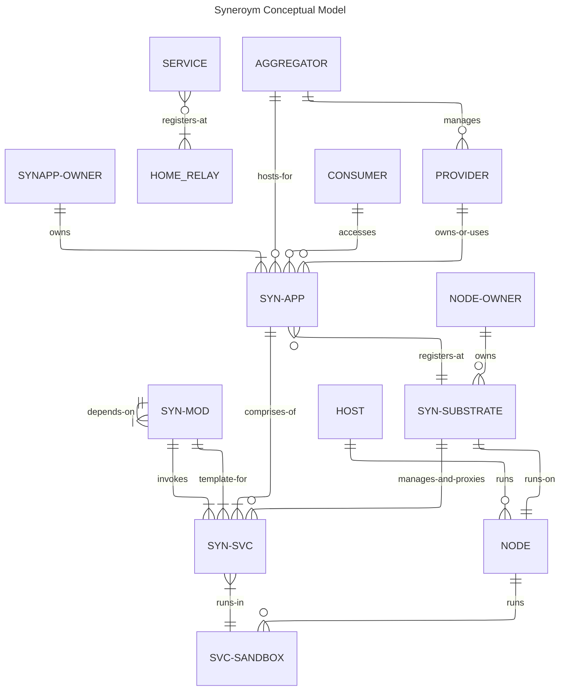

# Syneroym Ecosystem Spec [WIP]
This document expands on the vision described [here](/VISION.md). Please go through that to understand the bigger picture. Following from there, our objective is to build a technology substrate that enables diverse classes of provider ecosystems to emerge through `Autonomous Mini-Apps Cooperating over a common technology substrate`. We also build initial mini-apps that kickstart these new ecosystems and demonstrate various interaction patterns.

> **Document scope note:** This is a *requirements* document. It specifies *what* the system must do and *why*, not *how*. Sections marked `[Architecture TBD]` indicate areas where the approach is intentionally deferred to a separate Architecture Design Document. These include: reputation mechanisms, federated discoverability, coin/credit systems, DHT design, CRDT merge semantics, and relay topology.

This requirements spec is structured as follows:

- Philosophy & Design Constraints
- Requirements Overview
- Personas
- Common Requirements
- Trust Model
- Conceptual Model
- Substrate Functionality
- Shared Utilities and Services
- Mini-App Specs:
    - Vertical 1: Home Services Guild (e.g. Electricians, Plumbers)
    - Vertical 2: Food and Small Retailer Mesh (e.g. Small restaurants, grocery stores)
- Open Questions

---

## Philosophy & Design Constraints

A key difference in the newly envisioned provider ecosystem compared to large-scale consumer platforms is the (often geographical) clustering of service providers and consumers. Global reach and scale from a single embedding source is not a fundamental requirement. Reach and scale are improved instead by pre-established collaboration and coordination patterns across clusters of autonomous participants. Given this differentiator, we need to preserve benefits and reduce the drawbacks of large-scale consumer platforms like those listed in the [vision document](/VISION.md#background).

### Preserving Benefits

- Technology enablement of business without managed infrastructure
- Massive discovery & distribution
- Streamlining, standardization of interaction patterns
- Institutional trust
- Security at scale
- Fault tolerance
- Legal shielding
- Reputation aggregation
- Economies of scale
- Network effects

### Reducing Drawbacks

- Non-availability in constrained geographies, power/network/technology scenarios
- Vendor lock-in
- Governance asymmetry — less freedom (but less decision-making hassle) for participants
- Inflexibility to customise for localised scenarios
- Data ownership loss
- Sudden policy risk leading to unhappy participants
- No transparency of how internal systems/algorithms work
- Strategic dependency
- Not friendly to building deep provider-client relationships; mostly transactional

### Design Principles

The following principles guide design decisions throughout the system:

**Locality-first.** The system is optimised for scenarios where providers and consumers are geographically proximate. Federation beyond local clusters is a secondary concern.

**Progressive decentralisation.** A provider can start with a single device and no federation. Complexity is introduced incrementally as their needs grow. The system must not require full federation to be useful.

**Data sovereignty.** All provider data lives on infrastructure the provider controls or has explicitly chosen to lease. No provider data is stored on Syneroym-operated infrastructure except transiently for routing.

**Transparency over opaqueness.** Ranking, discovery, and reputation algorithms are either open source or provider-auditable. No hidden algorithmic black boxes determining outcomes for providers.

**Interoperability by convention.** Mini-apps cooperate through shared substrate primitives and open protocols. No mini-app should require a central coordinator to interoperate with another.

---

## Requirements Overview

High-level requirement highlights:

- Providers can self-host business applications on commodity hardware (PCs, phones, Raspberry Pi) without requiring cloud accounts or deep technical expertise.
- Providers can federate with others to share infrastructure and improve resilience and discovery reach.
- Consumers can discover and transact with providers through a unified experience regardless of which substrate hosts the provider.
- The substrate provides shared primitives (identity, messaging, payments, reputation) that mini-apps build on rather than re-implement.
- The system degrades gracefully under network partition — queuing, offline-first storage, and async workflows keep transactions progressing.
- All participants retain the ability to exit — migrating data and services to a different infrastructure provider or running independently.

---

## Personas in the Syneroym Ecosystem

The following are key personas. A single person or organisation may play multiple roles simultaneously.

**Individual Service Provider.** Provides a service to others — e.g. plumber, photographer, consultant. May self-host or use a Provider Aggregator.

**Self-hosted Service Provider.** A provider who hosts their own online services on hardware they control.

**Service Provider Aggregator.** Takes responsibility for managing online services for multiple providers. E.g. a plumber cooperative that manages booking for all its members.

**Infrastructure Provider.** Makes hardware infrastructure available for others to use or lease. E.g. an individual with a spare PC or a small hosting co-op.

**Consumer / General User.** Uses the Syneroym ecosystem to discover and purchase services or products, or to interact with other entities (chat, follow, collaborate).

**App Developer.** Builds business mini-apps and makes them available for others to deploy on their infrastructure.

**Space Manager.** A persona within a SynApp — the person (often the provider or aggregator) responsible for configuring and managing a Space, its catalog, branding, and operational policies.

---

## Common Requirements

These requirements apply across all business domains and mini-apps.

### Infrastructure & Hosting

- Service Providers run business applications on PCs or mobiles they control, even when those machines are not reachable on the external internet or are behind network firewalls.
- Infrastructure Providers make hardware (old PCs, cloud VMs, etc.) available for Service Providers to host applications or application components on a leased basis.
- Service Providers can monitor online service health and react to notifications about service status through UI, CLI, or other tools that leverage substrate-provided hooks.
- Infrastructure Providers can monitor infrastructure health, control access to nodes, and react to notifications about infrastructure status through similar tooling.
- App Developers can package mini-apps (e.g. as WASM modules or OCI images) which Providers can deploy to matching container infrastructure (WASM runtime, Podman/Docker).
- Consumers can access Provider services through options the Provider makes available: app UI, browser, API, or command-line tools.
- Service Providers can move services and data across Infrastructure Providers without restriction. [Migration protocol: Architecture TBD]
- Service Providers can back up and restore app data. [Backup mechanism: Architecture TBD — Litestream is a candidate]
- Service Providers can install the same app on multiple secondary devices. The app works independently on those devices when disconnected, and synchronises state with the primary device when reconnected. [CRDT merge semantics: Architecture TBD]
- Service Providers can install an app such that parts (shards) of it are hosted on different hosts, each managing a subset of load.

### Connectivity & Offline Behaviour

- The substrate supports direct peer-to-peer connections wherever possible, and falls back to relay-mediated encrypted connections when NAT or firewall constraints prevent direct connectivity.
- On mobile platforms, if the substrate and embedded services are throttled by the OS, inbound requests are queued as offline notifications. The service processes them when the substrate application is next active.
- For transactional workflows (order → payment → fulfilment), offline behaviour is explicitly defined: actions taken while offline are queued; conflicting state changes made by both parties during a disconnected period are resolved deterministically on reconnection. [Conflict resolution rules per entity type: Architecture TBD]

### Messaging & Data Sharing

- All entities (Providers, Consumers, Services) can exchange messages with each other, subject to access control policies set by the entity owner.
- Message types include: one-to-one multimedia chat, group chat, discussion threads around a pivot context (e.g. a blog post, a project), structured service messages (e.g. booking requests, record access grants), and collaborative content editing.
- Examples:
    - A provider and consumer text/audio/video chat, or exchange structured booking messages.
    - A medical provider shares patient records with the patient, or grants access to another provider with patient consent.
    - Two substrate owners chat or share media.
    - Multiple entities participate in a discussion thread around a shared context.
    - Multiple entities collaborate over shared content (e.g. collective project artifact editing).

---

## Trust Model

Centralized platforms derive consumer trust from brand, legal accountability, and aggregated reviews. A federated system needs explicit mechanisms to establish equivalent trust without central authority.

### The Trust Problem

When a consumer discovers a provider through Syneroym, they have no prior relationship with either the provider or the infrastructure operator. The system must give the consumer sufficient signal to decide whether to transact. Conversely, providers must have signal that consumers are not fraudulent.

### Trust Layers

Trust in the Syneroym ecosystem operates at multiple levels:

**Layer 1: Cryptographic Identity.** Every entity (person, service, substrate node) has a keypair-based identity. Messages and actions are signed. This proves authenticity but not trustworthiness.

**Layer 2: Referral and Vouching.** Entities can vouch for other entities within their network. A consumer who transacts with a provider can vouch for them. A provider aggregator vouches for the providers it manages. Vouching creates a web of trust that consumers and automated systems can traverse. [Vouching mechanics and weighting: Architecture TBD]

**Layer 3: Verifiable Credentials.** Providers can attach verifiable credentials to their profile — e.g. a trade licence, a government ID, a certification. The system supports attaching and displaying such credentials without requiring a central verifier. The consuming party decides which credential issuers they trust. [Credential format and verification: Architecture TBD]

**Layer 4: Transaction History and Reputation.** Completed transactions generate a reputation record that is portable across the ecosystem. A provider's reputation is not locked to a single platform. [Reputation portability mechanism: Architecture TBD]

**Layer 5: Community Moderation.** Provider Aggregators and local communities can maintain their own block/trust lists. Bad actor reports propagate across the federation with appropriate weighting. [Propagation protocol: Architecture TBD]

### Legal Liability Boundary

The system does not provide legal shielding in the way centralised platforms do — that shielding derives from the platform's legal personhood and terms of service. Syneroym infrastructure operators bear their own legal responsibility for services they host under applicable local law. The requirements are:

- The substrate must make it straightforward for a Provider or Aggregator to display their own terms of service to consumers.
- The substrate must not create an implicit representation to consumers that a federated node has been vetted by Syneroym.
- A separate document will outline recommended legal structures for Provider Aggregators operating at scale. [Legal guidance: Out of scope for this spec]

---

## Conceptual Model

The following diagram shows various conceptual entities in the Syneroym ecosystem and relationships between them.

### Key Entity Definitions

**SYN-MOD (Syneroym Module).** A reusable, independently deployable unit of business logic. Packaged as a WASM component or OCI image. May depend on other modules and may invoke or act as a template for SYN-SVCs.

**SYN-SVC (Syneroym Service).** A running instance of a module, executing within a SVC-SANDBOX on a NODE. Managed and proxied by the SUBSTRATE.

**SVC-SANDBOX.** The execution environment for a SYN-SVC. May be a WASM runtime instance, a Podman container, or equivalent. Provides isolation between services sharing a NODE.

**SYN-APP (Syneroym Application).** A composed set of SYN-SVCs that together implement a business application (e.g. the Home Services Guild mini-app). Registered with a SUBSTRATE.

**SYN-SUBSTRATE.** The core runtime layer on a NODE. Manages service deployment, lifecycle, discovery registration, messaging, and access control on behalf of the NODE-OWNER.

**NODE.** A physical or virtual machine running one SUBSTRATE instance. May run multiple SVC-SANDBOXes.

**HOME_RELAY.** A relay server that provides connectivity for SUBSTRATEs and SVCs that cannot accept inbound connections directly (e.g. behind NAT or firewall).

---

## Substrate Functionality

Description of the core Syneroym substrate functionality, key protocols, and important flows.

### Substrate Setup

- Node owner installs the substrate on a node.
- Substrate generates admin keypair on first run. Private key never leaves the node.
- Substrate registers with a Relay:
    - Contacts bootstrap server to obtain a home relay.
    - Publishes node pubkey and associated relay address in a Pkarr-signed packet in the BEP 0044 DHT (used for the node's control plane, e.g. SYN-SVC deploy/remove).
    - Starts an Iroh QUIC server using that relay.
- Substrate identifies its capabilities (sandbox/container types, quota configurability). Node owner configures capability limits (CPU, GPU, memory, disk, other capabilities) available to hosted Services.
- Access control setup:
    - If the node owner has a primary substrate, this substrate's pubkey is registered with it.
    - Necessary substrate access is granted to the owner's primary key.
    - SYN-APP owner pubkeys are granted access to substrate management APIs (deploy, remove, observe) with associated quotas.

### Substrate Managing Services

- Substrate provides a secure end-to-end communication channel between clients and the services it manages.
- Substrate supports WASM and Podman sandbox environments at minimum.
- Substrate attempts direct client-service communication wherever possible; falls back to external relay (DERP) when intermediate network infrastructure does not permit direct connections.
- On mobile platforms, if the substrate and embedded services are throttled by the OS, requests are sent as offline notifications. The service response is triggered when the substrate application is next active.

### Core Substrate Services

**Messaging.** Substrate enables general messaging and data sharing across all entities, pivoted around a specific context — one-to-one multimedia chat, group chat, discussion threads around a pivot context (blog, post), social media follow/subscribe, browsing content.

**Discovery.** Nodes store a partition of a distributed search index to aid federated service discovery. [Partitioning and consistency model: Architecture TBD]

**Identity.** Each entity is identified by a cryptographic keypair. The substrate manages key storage, rotation, and delegation on behalf of the node owner.

**Access Control.** The substrate enforces access control policies on all inter-service and client-service communication. Policies are owned by the entity owner and are not overridable by the infrastructure provider.

---

## Supporting Ecosystem Entities

### Relay

- On startup, a relay may apply to register as a community relay with the Syneroym bootstrap server (refreshed periodically).
- On successful registration, it is reachable as `<relaynodeid>.syneroym.net`.
- Acts as a coordination server for direct connections between peers using UDP hole punching.
- Acts as an encrypted TCP data relay when direct connection is not possible (no UDP, symmetric NAT, CGNAT).
- Acts as a TURN relay for WebRTC when browsers access services behind NAT.

### Bootstrap

- Maintains a registry of officially operated relays with capability metadata (TCP relay, TURN, etc.).
- Accepts community relay registration offers; verifies capability claims (offline or real-time checks).
- Registers DNS entries for community relays under `*.syneroym.net`.
- Returns a weighted random set of relays from the registry based on requested capability and relay capacity.
- Periodically audits registered relays and expires stale entries.
- For node ID lookups, checks internal cache or DHT fallback and returns the relay. For HTTP URL lookups from browsers, finds the relay and issues an HTTP redirect.

> **Single point of failure note.** The bootstrap server is a governance and availability dependency. Requirement: the bootstrap server's registry must be exportable to a decentralised alternative (e.g. a well-known DHT namespace) so the ecosystem can survive bootstrap server unavailability. [Decentralised bootstrap fallback: Architecture TBD]

### Consumer-Facing Aggregation

> This section addresses a gap in the prior spec. Centralised platforms provide consumers a single app. In Syneroym, providers may run on different substrates operated by different entities. The consumer experience must remain coherent.

- A Consumer App (web or mobile) allows consumers to discover, browse, and transact with providers across multiple substrates and mini-apps from a single interface.
- The Consumer App queries the distributed discovery index; it does not need to know which substrate hosts a given provider.
- A consumer's identity, transaction history, and preferences are portable and self-owned — stored on a substrate the consumer controls or has designated.
- The Consumer App is itself a thin client; business logic runs on provider substrates. The Consumer App is not a privileged participant in the ecosystem.

---

## SynApp Lifecycle

### Development

- Build WASM components with wRPC for inter-component calling.
- Generate JSON-RPC dispatch code for non-wRPC callers (e.g. browsers calling from JavaScript). WIT serves as the canonical API definition; JSON-RPC interface is derived from it.
- Package in OCI containers where WASM is not appropriate.

### Deployment

- An Application Specification composes components into a SynApp and declares dependencies, resource requirements, and configuration schema.
- Provider applies the Application Specification to chosen substrate(s).
- Substrate validates resource availability and access permissions before deploying.

### Monitoring

- Substrate monitors the application and provides health information, notifications, and automated redeploy on failure.
- Providers receive alerts through UI, CLI, or webhook integrations of their choice.

---

## SynApp 1: Business, Professional, and Retail Spaces

*Covers Home Services Guild and Food & Small Retailer Mesh*

### Setup and Configuration

- The Small Retail & Services SynApp is available as a deployable package for Service Providers or Aggregators.
- Provider configures deployment parameters and deploys the SynApp on chosen infrastructure.
- Provider creates one or more online Spaces. (Aggregators typically create one Space per managed provider.)
- Space Manager sets up access controls for who can manage the Space.
- Space Manager configures common Space settings: branding, payment method setup, cancellation policy defaults.
- Space Manager sets up the catalog schema and populates the service or product catalog:
    - Per-item info: title, description, images, pricing, cancellation policy.
    - Order-to-fulfilment workflow configuration: select and compose from available workflow types.
- Space Manager ingests digital content corresponding to catalog items where applicable (movies, courses, books, etc.).

### Consumer-Provider Transaction Flow

- **Discovery.** Consumer discovers provider Space through the distributed index, direct link, or referral.
- **Browsing.** Consumer browses catalog. Space may offer contextual recommendations. [Recommendation algorithm: Architecture TBD]
- **Terms and Pricing.** Consumer selects from available options; negotiation protocols allow price tuning within provider-configured bounds.
- **Order Confirmation.** Pickup/delivery location, time window, and any service-specific parameters are agreed.
- **Payment.** Payment is processed per the agreed model. [Payment rails and escrow: Architecture TBD]
- **Fulfilment.** Digital content is delivered via DRM-respecting players where applicable; physical or in-person services proceed per agreement.
- **Cancellation, Return, Refund.** Handled per Space-configured policy and applicable workflow rules.
- **Sub-workflow composition.** Complex orders (e.g. food + delivery) are handled by composing multiple sub-workflows.

### Service Variation Dimensions

The system accommodates the following variation axes across workflows:

**Booking:** Event slots, consulting time slots, open-ended job requests.

**Payment:** One-time; pre- or post-delivery; multi-part; negotiated; subscription; escrow; system coins; mutual credit systems. [Coin and mutual credit mechanics: Architecture TBD]

**Product type:** Time-bound (e.g. prepared food), digital content, physical goods.

**Service type:** Time-slot service, job-completion-based service, location-based service.

**Location:** Fixed location, provider-proximate, consumer-proximate, remote/digital.

**Relationship type:** One-time, recurring, long-term with continuous shared history (e.g. doctor-patient).

**Service record:** Long-term (doctor-patient), engagement-specific (courses), tracking-required (delivery).

### Data and History

- Service record history is maintained per provider-consumer pair, with configurable expiry.
- Data sharing across providers and users leverages substrate primitives for structured sharing and access control. Provider and consumer both consent to and control what is shared with whom.
- Long-term relationship data (e.g. medical records, job history) is provider-hosted but consumer-portable on request.

### Discovery

- Entities can discover other entities via keyword search, attribute-value point search, and interval/range search.
- Discovery results are drawn from the distributed index maintained by participating substrate nodes.
- Discovery ranking is transparent and configurable by the Space Manager within published bounds. [Discovery ranking algorithm: Architecture TBD]

### Reputation

- Consumers can leave reviews and ratings for completed transactions.
- Reputation scores are portable — a provider's reputation is not lost if they move substrates.
- Referral-based reputation mechanisms allow trusted community members to amplify or contextualise reputation signals.
- [Reputation portability protocol, visibility, anti-gaming mechanisms, Sybil resistance: Architecture TBD]

### Advertising

- Contextual advertising is matched client-side: the consumer's device evaluates ad relevance against the local index without sending consumer query data to a third party.
- Space Managers can pay for elevated placement in discovery results within their local cluster. Placement weighting is disclosed to consumers.
- [Ad auction mechanics and placement limits: Architecture TBD]

---

## Design Considerations

*Technology choices under consideration — not final decisions.*

- **P2P and relay:** Iroh for peer-to-peer connectivity, hole punching, and relay.
- **Inter-service networking:** Podman pods or rootless networks for services co-located on the same node.
- **Browser connectivity:** webrtc-rs for connections via browser WebRTC Data Channels.
- **API layer:** JSON-RPC with WASM components and wRPC. WIT as canonical API; JSON-RPC derived from it.
- **Storage and sync:** Litestream for backup/replication; cr-sqlite for CRDT-based local-first storage.
- **DNS:** Consider running a local DNS server to manage the large number of dynamically changing relay servers and reduce cloud DNS maintenance cost.
- **DRM:** Shaka player for DRM-respecting video delivery.
- **Communication layer inspiration:** Matrix, ATProto, Nostr.
- **AI-assisted workflows:** Potential use of AI to assist in synthesising service types and discover-to-delivery workflow configuration. Scope and approach to be defined.
- **Ad matching:** Client-side contextual ad matching against real-time local index.

---

## Open Questions

The following questions require decisions before or during detailed architecture design:

1. **Governance of shared protocols.** Who maintains the interoperability protocols and schema versions that mini-apps must implement to federate? What is the process for evolving them? How are breaking changes managed?

2. **Bootstrap server continuity.** Who operates and funds the bootstrap server long-term? What is the fallback if the Syneroym organisation cannot maintain it?

3. **Consumer identity and wallet.** Does a consumer need to run their own substrate to have a self-sovereign identity and history? Or is there a lightweight identity option for consumers who cannot or will not self-host?

4. **Payment rail selection.** Which payment rails are supported at launch? How are cross-border payments handled? Is escrow centralised (a trusted third party) or implemented via smart contract or protocol?

5. **Coin and mutual credit system.** Is this a cryptocurrency, an internal ledger, or a mutual credit protocol? What are the regulatory implications in target markets?

6. **Aggregator accountability.** What obligations does a Provider Aggregator take on toward the providers it manages? How are disputes between an aggregator and a provider resolved?

7. **Infrastructure Provider SLA.** What guarantees, if any, can an Infrastructure Provider make to a Service Provider? How is breach of those guarantees resolved?

8. **Minimum viable federation.** What is the minimum a third-party developer must implement to build a compliant mini-app that federates with existing Syneroym mini-apps?

9. **Consumer UX ownership.** Who builds and maintains the consumer-facing aggregation app? Is it open source and community-maintained, or Syneroym-operated?

10. **Multi-tenancy security boundary.** What are the formal isolation guarantees between SynApps sharing a substrate node? Can a malicious SynApp exfiltrate data from another co-hosted SynApp?