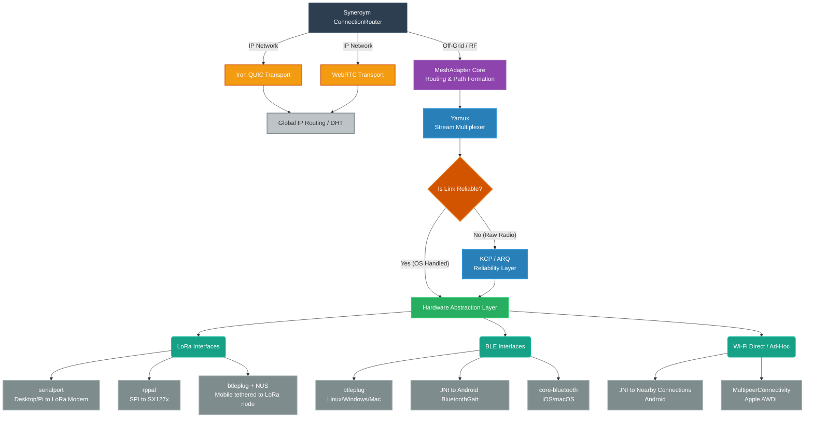

# Mesh Addressing and Unified Interface Design

This document outlines the implementation plan for integrating heterogeneous mesh transports (LoRa, BLE, Wi-Fi Direct) into the Syneroym substrate, focusing on the addressing/routing protocol and the necessary refactoring of `SyneroymClient`.

> 1. **Routing Algorithm:** We will use a **Distance-Vector** protocol (similar to Reticulum). This is conceptually more robust and bandwidth-efficient than flooding, which is crucial for heterogeneous links. Explicit gateway configuration will also be utilized.
> 2. **Crate Boundary:** The logic will live in a dedicated `crates/mesh_transport` (package `syneroym-mesh-transport`) crate. `syneroym-router` will consume it as a transport mechanism alongside `iroh` and `webrtc`.
> 3. **Delay-Tolerant Networking (DTN):** We will implement **Full Intermediate DTN (Store-and-Forward)**. As reasoned, the mechanics of waiting for a path and enforcing storage caps apply equally to the source node and any intermediate node (which acts as a "relative source"). Therefore, the generalized DTN logic will allow intermediate nodes to buffer relayed packets up to a configurable cap until a path forms.

---

## Proposed Changes

### `crates/mesh_transport/` (New Crate)

This new crate will house the `MeshAdapter` and the physical interface implementations.

#### [NEW] `src/routing.rs`
- **Addressing:** Use the existing Syneroym `Identity` (DIDs) as the native mesh addresses. No secondary ID system is needed.
- **Routing Protocol:** Implement a hybrid routing model combining explicit gateways and dynamic discovery:
  - *Static Gateway Routing:* Support explicit configuration of static routes. Because Syneroym uses cryptographic hashes (DIDs) which have no topological meaning (unlike IP subnets), wildcard or prefix routing is impossible. Static routing will consist of:
    1. **Exact-Match Rules:** "For specific node `did:key:XXX`, always route traffic through Gateway GW2." (Useful for pinning routes to known bridges).
    2. **Default Routes (Failover):** "For any unknown DID, route through Gateway GW1, fallback to GW2." (Bridging to the global IP network).
  - *Dynamic Distance-Vector (Route Propagation):* Nodes will dynamically map the mesh through a gossip protocol:
    1. **Initial Announce:** A node periodically broadcasts an `Announce` packet declaring its DID (Hop Count = 0).
    2. **Receiving an Announce:** When a neighbor receives this packet, it records the route in its table ("Node A is 1 hop away via Interface X").
    3. **Re-broadcasting (Gossiping):** The neighbor increments the Hop Count and re-broadcasts the Announce to its own neighbors ("I can reach Node A in 1 hop").
    4. **Loop Prevention & Damping:** Re-broadcasting naturally damps down. A node will *only* re-broadcast an announce if it represents a brand new route or a route with fewer hops than one it already knows. Once a wave of announces washes over the mesh and optimal paths are found, nodes stop re-broadcasting. Additionally, announces carry a strict TTL (e.g., max 10 hops), creating a hard geographic "horizon" beyond which an announce never propagates.
    5. **Memory Limits & Pruning:** To prevent small nodes from running out of RAM, the routing table has a strict capacity limit (e.g., 500 routes). It acts as an LRU (Least Recently Used) cache weighted by distance. If the table fills up, it evicts routes that haven't been actively used for traffic, starting with the furthest nodes (highest hop count), because it's statistically less likely to need to relay for nodes very far away. If a node stops announcing entirely, its route simply expires and is pruned.
    6. **Routing Algorithm Trade-offs:**
       - *Distance-Vector (Syneroym/Reticulum):* High setup cost (nodes must announce and map the network before sending data), but extremely low runtime cost because data follows a known optimal path. Best for stable or slowly changing meshes.
       - *Managed Flooding (Meshtastic):* Zero setup cost (no routing tables), but high runtime cost because every packet is re-broadcast by multiple nodes up to a hop limit. Works well for small, sparse networks.
       - *Pure Epidemic Flooding (BitChat/Bitmessage):* Zero setup cost, but catastrophic runtime bandwidth cost. Excellent for privacy (metadata masking) or highly volatile ad-hoc scenarios where the topology changes too fast for tables to form.
- **Mesh Packet Framing:** Define a lightweight binary packet structure for radio transmission:
  ```rust
  struct MeshPacket {
      message_id: [u8; 16],  // Unique ID for deduplication
      destination: [u8; 32], // Short-hash of target DID
      source: [u8; 32],      // Short-hash of sender DID
      ttl: u8,               // Hop limit
      flags: u8,             // Packet type (Announce, Data, ACK)
      payload: Vec<u8>,      // Yamux-multiplexed stream chunks
  }
  ```
- **Routing Table:** Implement a local routing table that maps a `Target DID` to the `Next Hop Node DID` and the `Physical Interface ID` (e.g., "Node B via BLE-1").

#### [NEW] `src/interfaces.rs`
- Define the `MeshInterface` trait representing a physical MAC layer:
  ```rust
  #[async_trait]
  pub trait MeshInterface {
      async fn send_packet(&self, packet: &MeshPacket) -> Result<()>;
      async fn recv_packet(&mut self) -> Result<MeshPacket>;
  }
  ```
- Create stub implementations for `BleInterface` (using `btleplug`) and `LoRaSerialInterface` (using `serialport`).

#### [NEW] `src/adapter.rs`
- Implement the `MeshAdapter` which ties the routing table, interfaces, and multiplexing together.
- **Relay & DTN Logic:** 
  - *Deduplication:* The adapter maintains a rolling cache of recently seen `message_id`s. If a duplicate packet arrives, it is silently dropped.
  - *Store-and-Forward (DTN Role):* Because caching packets requires RAM, DTN functionality will be gated behind a configuration flag (e.g., `enable_dtn_storage = true`). Tiny microcontrollers will leave this off and drop unroutable packets, while larger nodes (like a Raspberry Pi) will act as dedicated mailboxes. If a path does not exist, a DTN-enabled node places the packet in a capped local queue.
    - *Ownership Transfer:* If a DTN node is gracefully shutting down, it can attempt to dump its pending queue to another nearby DTN-enabled node before going offline. If it crashes unexpectedly, the packets are lost (unless Source-Copy routing was used).
  - *Multi-Path Retries & DTN Path Improvement:* In a DTN, if a packet is stuck at an intermediate node, there is a risk it never reaches the destination. If the *earlier* node (or the source) kept a copy, it could try alternate newly-discovered paths. This touches on formal DTN routing algorithms:
    - **Single-Copy Routing:** When Node A hands a packet to Node B, Node A deletes its copy. If Node B gets stuck, only Node B can retry if it learns a new route. (Bandwidth efficient, but lower delivery guarantee).
    - **Multi-Copy (Epidemic) Routing:** Nodes replicate the packet to every neighbor. Extremely robust but causes severe network flooding.
    - **Syneroym DTN Strategy: Bounded Multi-Copy (Spray and Wait):** To ensure redundancy and prevent a single point of failure if a DTN node crashes, Syneroym will utilize the `N-copies` approach. 
      - The source generates a small, bounded number of copies (e.g., `N=3`).
      - It "sprays" these copies to the first 3 distinct DTN-enabled nodes it encounters.
      - These 3 nodes place the packet in their respective DTN queues, acting as redundant mailboxes. 
      - If *any* of them discovers a path to the destination, it delivers the packet. The `message_id` deduplication cache at the destination will safely discard the other copies if they eventually arrive. This provides high reliability without the catastrophic bandwidth cost of Epidemic Flooding.
- Wrap reliable connections (AWDL) and unreliable connections + ARQ/KCP (LoRa) inside the `yamux` stream multiplexer.
- Expose a `listen()` method that yields `(AsyncRead + AsyncWrite)` streams to be handed to `syneroym_router::ConnectionRouter::handle_stream`.

---

### `crates/sdk/` (Unified Interface Refactor)

The `SyneroymClient` must be decoupled from its hardcoded Iroh assumptions.

#### [MODIFY] `src/lib.rs`
- **Refactor `TransportConnection` Enum:**
  Currently, this enum only supports Iroh (lines 92-100). Abstract the streaming capability:
  ```diff
  - pub enum TransportConnection {
  -     Iroh { endpoint: Endpoint, conn: Connection },
  - }
  + pub enum TransportConnection {
  +     Iroh { endpoint: Endpoint, conn: Connection },
  +     Mesh { multiplexer: YamuxConnection }, // Handles AWDL, LoRa, BLE
  +     WebRtc { channel: WebRtcDataChannel },
  + }
  ```
  Alternatively, abstract this completely into a dynamic `Box<dyn StreamFactory>` so the client doesn't need to know the enum variants.

- **Refactor `connect_with_mechanisms`:**
  Update the connection loop (lines 255-303) to evaluate `EndpointMechanism::Mesh` alongside Iroh. If the target is physically close (discovered via BLE), instantiate the `TransportConnection::Mesh` branch.

- **Refactor `open_request_stream`:**
  Update the stream opener (lines 388-412) to dynamically open streams based on the active transport:
  ```rust
  match conn_wrapper {
      TransportConnection::Iroh { conn, .. } => conn.open_bi().await?,
      TransportConnection::Mesh { multiplexer } => multiplexer.open_stream().await?,
  }
  ```

---

## Appendix: MeshAdapter Library Hierarchy & Architecture Diagram

This section outlines the proposed library hierarchy for a cross-platform, multi-protocol `MeshAdapter` in Rust. It bridges heterogeneous physical hardware layers (LoRa, BLE, Wi-Fi Direct) into the reliable, multiplexed `AsyncRead + AsyncWrite` streams expected by the Syneroym `ConnectionRouter`.

### Architecture Diagram



### 1. Syneroym Core Layer
This is the existing Syneroym codebase (`ConnectionRouter`, `RouteHandler`). It expects nothing but standard Tokio `AsyncRead + AsyncWrite` streams and handles E2E encryption and JSON-RPC dispatch.

### 2. MeshAdapter Layer (Custom Rust)
The brain of the mesh. 
* Maintains the routing table.
* Handles mesh discovery (e.g., listening to BLE Broadcasts).
* Decides which physical interface to route packets through.

### 3. Multiplexing Layer
* **Library:** `yamux`
* **Purpose:** Takes a single sequential byte pipe and splits it into multiple independent Tokio streams, mirroring QUIC's behavior so multiple services can communicate simultaneously over one radio link.

### 4. Reliability Layer (Conditional)
* **Library:** `kcp` or a custom lightweight ARQ crate.
* **Purpose:** Provides sequence numbers and acknowledgments to ensure packets arrive in order and are retransmitted if lost.
* **When it is used:** Only on "raw" links like LoRa or BLE Advertisements.
* **When it is bypassed:** When using Apple Multipeer or Android Nearby, which already use TCP/reliable modes under the hood.

### 5. Hardware Abstraction Layer (HAL)
A custom Rust trait (e.g., `pub trait MeshInterface { async fn send_packet() }`) that hides the platform-specific madness from the MeshAdapter.

### 6. The Base Libraries (Platform Specific)

#### LoRa
* **Desktop (Linux/Windows/Mac) to a USB LoRa Modem (e.g., RNode):** The `serialport` crate is fully cross-platform. If you plug a USB LoRa radio into a Windows PC (COM port) or Mac (/dev/tty), this library handles it flawlessly.
* **Raspberry Pi to a raw LoRa chip (SPI):** The `rppal` crate is used for direct GPIO/SPI pin access on Linux boards.
* **Mobile (The "Pseudo-LoRa" BLE Tether):** Since iOS and Android phones do not have LoRa antennas, they rely on a peripheral device (like a LilyGO T-Beam in your pocket). The mobile app uses BLE (via `btleplug` or native APIs) to connect to the Nordic UART Service (NUS) on the peripheral. To the Syneroym `MeshAdapter` on the phone, this looks exactly like a LoRa serial port, but the bytes are actually traveling over BLE to the peripheral, which then blasts them out over the LoRa mesh.

#### BLE (Bluetooth Low Energy)
* **Desktop (Linux/Windows/Mac):** The `btleplug` crate is the gold standard for cross-platform Rust BLE.
* **Apple (iOS/macOS):** Native `CoreBluetooth` accessed via FFI (`swift-bridge` or `objc`).
* **Android:** Native `BluetoothGatt` accessed via `jni` (Rust to Java/Kotlin).

#### Wi-Fi Direct / Proprietary Ad-Hoc
* **Apple (AWDL):** `MultipeerConnectivity` framework accessed via FFI. This handles both discovery and reliable data streaming natively.
* **Android:** `Nearby Connections API` accessed via `jni`. Provides the "Reliable Payload" API natively.
