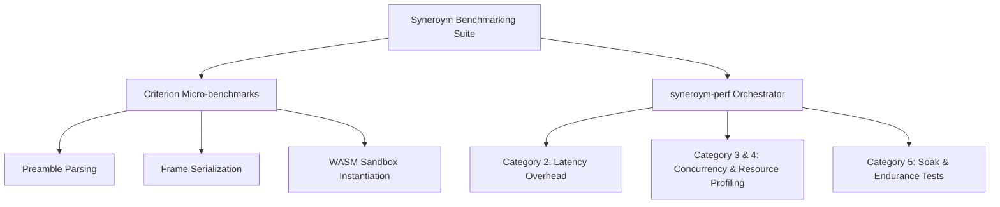

# Syneroym Performance & Robustness Testing Report

This document compiles the complete overview of the performance, benchmarking, and robustness framework implemented across all development phases of the Syneroym substrate.

---

## 1. Benchmarking Architecture Overview

Syneroym employs a tiered testing and performance verification architecture designed to guarantee the speed, correctness, and resource stability of the runtime under peak and sustained loads.



---

## 2. Testing & Performance Categories

### Category 1: Micro-Benchmarks (Phase 1)
- **Objective**: Establish microsecond-level performance baselines for hotpaths under CPU stress in complete isolation.
- **Components Tested**:
  - `RoutePreamble` serialization and parsing.
  - Length-prefixed framing and framing adapters.
  - WASM Component sandboxed store creation and instantiation.
- **Execution**:
  ```bash
  mise run bench:micro
  ```

### Category 2: Latency Overhead Tests (Phase 2)
- **Objective**: Measure the exact latency impact of executing traffic through the substrate compared to a raw direct connection.
- **Components Tested**:
  - **TCP Gateway Proxy Overhead**: Compares direct TCP socket roundtrips to gateway-routed WebRTC/Iroh proxy streams.
  - **WASM Component Execution Overhead**: Compares direct local WASM invocation to routed client-gateway IPC.
- **Execution**:
  ```bash
  mise run bench:latency
  ```

### Category 3 & 4: Concurrency & Resource Profiling (Phase 3)
- **Objective**: Evaluate the substrate’s stability under aggressive concurrent execution, and profile memory/CPU footprint.
- **Scenarios**:
  - **Sustained High Concurrency**: 100 concurrent clients flooding the runtime for 30s.
  - **Spike Load**: Instant step-up from 1 to 100 concurrent clients to evaluate dynamic pool adaptation.
  - **WASM Pool Exhaustion**: Flood-testing with 20 parallel WASM instantiation calls against a pool size limit of 10 to ensure safety.
- **Execution**:
  ```bash
  mise run bench:concurrency
  ```

### Category 5: Soak / Endurance Tests (Phase 4)
- **Objective**: Long-duration endurance runs designed to expose slow resource leaks (Memory RSS, file descriptors, connection handles, task handles, compiled components cache).
- **Workloads Run Concurrently**:
  - **Workload A (Sustained RPC)**: Constant 10 requests/sec WASM RPC invocations.
  - **Workload B (Deploy Churn)**: Deploying fresh compiled WASM services dynamically every 30s.
  - **Workload C (Connection Churn)**: Continuous connect-request-disconnect cycles to verify socket cleanup.
  - **Workload D (Tokio Task Monitor)**: Continuous checks on active tokio tasks.
- **Leak Detection Heuristics**:
  - **Memory (RSS)**: Trisection median comparisons over linear regression slope trends (detects monotonic growth).
  - **Tokio Tasks**: Bounds verification (ending count should be $\le$ baseline + 15).
  - **Active Connections**: Bounds verification (ending active connection count $\le$ baseline + 2).
  - **Open FDs**: Bounds verification (ending FDs $\le$ baseline + 10).
  - **Component Cache**: DashMap compiled component counts exactly matching expected deployed instances.
- **Execution**:
  ```bash
  # Run standard 30-minute soak test
  mise run bench:soak
  
  # Run custom duration soak test
  cargo run -p syneroym-perf -- soak --duration 120
  ```

---

## 3. Custom Observability Metrics Layout

To support detailed resource profiling, the Syneroym Substrate exposes the following custom Prometheus metrics via its `/metrics` endpoint:

| Metric Name | Type | Description |
|---|---|---|
| `substrate.system.rss_bytes` | Gauge | Total resident set size memory of the substrate process in bytes. |
| `substrate.system.cpu_percent` | Gauge | Percentage CPU utilization of the substrate process. |
| `substrate.system.open_fds` | Gauge | Total active file descriptors allocated in `/dev/fd`. |
| `substrate.tokio.active_tasks` | Gauge | Alive tasks currently running on the tokio runtime. |
| `substrate.connections.active` | Gauge | Active WebRTC and Iroh routing connection channels. |
| `substrate.wasm.component_cache_size` | Gauge | Total compiled WASM component templates cached in DashMap memory. |
| `substrate.wasm.active_instances` | Gauge | Dynamic active instantiations running concurrently in the sandbox. |

---

## 4. CI/CD Integration & Gating Heuristics

All metrics and latency benchmarks output detailed JSON results to `tests/perf/results/`. The `syneroym-perf` orchestrator is fully compatible with standard CI/CD gating:
- **Return Code**: Any detected resource leak or test failure immediately exits with a non-zero code.
- **Leak Summaries**: Prints a comprehensive console table showing ✅/❌ status and baseline/peak/ending metrics.
