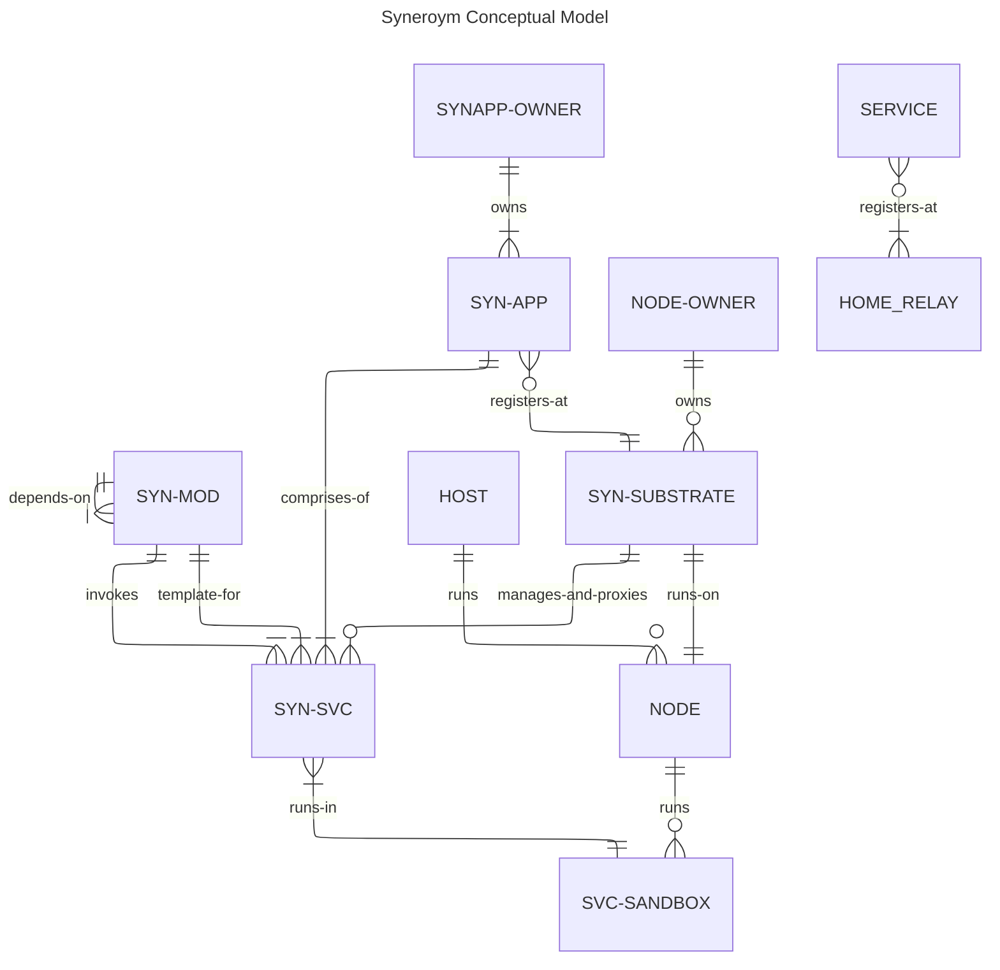

# Syneroym Ecosystem Spec [WIP]
This document expands on the vision described [here] (/VISION.md). Please go through that to understand the bigger picture. Following from there, our objective is to build a technology substrate that enables diverse classes of provider ecosystems to emerge through `Autonomous Mini-Apps Cooperating over a common technology substrate`. We also build initial mini-apps that kickstart these new ecosystems and demonstrate various interaction patterns. 

This requirements spec is structured as follows.

- Philosophy & Design Constraints
- Requirements Overview
- Conceptual Model
- Substrate Functionality: The core substrate layer for all participants
- Shared Utilities and Services: Common Utilities useful to multiple mini-apps
- Mini-App Specs:
    - Vertical 1: Home Services Guild (e.g. Electricians, Plumbers)
    - Vertical 2: Food and Small Retailer Mesh (e.g. Small restaurants, grocery stores)

## Philosophy & Design Constraints
A key difference in the newly envisioned provider ecosystem compared to large-scale consumer platforms is, the (often geographical) clustering of service providers and consumers. Global reach and scale from a single embedding source is not a fundamental requirement. Reach and scale are improved instead, by pre-established collaboration and coordination patterns across clusters of autonomous participants. Given this differentiator, we need to preserve benefits and reduce the drawbacks of large-scale consumer platforms like those listed in the [vision document](/VISION.md#background).

Following is a list of benefits of large-scale consumer platforms we need to preserve and drawbacks we need to reduce, and our approach to achieve those.

### Preserving Benefits
    - Technology enablement of business without managed infrastructure
    - Massive discovery & distribution
    - Streamlining, standardization of interaction patterns
    - Institutional trust
    - Security at scale
    - Fault tolerance
    - Legal shielding
    - Reputation aggregation
    - Economies of scale
    - Network effects

### Reducing Drawbacks
    - Non-availability (geographies, power/network/technology constrained scenarios)
    - Vendor lock-in
    - Governance asymmetry less freedom (but less decision making hassle) to participants
    - Flexibility to customize for localized scenarios
    - Data ownership loss
    - Sudden policy risk leading to unhappy participants
    - No transparency of how the internal systems/algorithms work
    - Strategic dependency
    - Not friendly to buildup of deep provider-client relationships, mostly transactional

## Requirements Overview
High level requirement highlights

## Personas in Syneroym ecosystem
The following are key personas in the Syneroym ecosystem. 

- Service Provider:
    - Individual Service Provider: E.g. Anyone providing some service to others. E.g. a plumber, photographer, blogger. Can self-host his services online, or through a Provider aggregator, as described below
    - Self-hosted Service Provider: Provider who host their own online services.
    - Service Provider Aggregator: They take up the responsibility of managing online services of multiple providers.
- Infrastructure provider: They make their hardware infrastructure available for others to use/lease.
- General User: Uses Syneroym platform to avail services, or interacts with other entities. E.g. chat group or discussion thread around a context like a social media wall, or book a electrician visit.
- App Developer: Who builds business mini-apps and make those available for others to deploy on their infrastructure.

Of course, it is likely that a single Person/Org plays the role of different personas. 

## Common requirements
Following are common user requirements irrespective of business domain.

- Service Providers run business applications and supporting services on PCs or Mobiles they control, even when machines are not available on external network, behind network firewalls.
- Infrastructure providers make hardware (old PCs, or cloud) available for service providers who then can then host applications or their parts (modules, services) on such leased infrastructure.
- Service Providers can monitor online service health, react to notifications about service status through UI, CLI or other tools that leverage substrate provided hooks.
- Infrastructure Providers can monitor infrastructure health, control access to nodes, and react to notifications about infrastructure status through UI, CLI or other tools that leverage substrate provided hooks
- App Developers can write mini-apps / services appropriately packaged e.g. in WASM modules or OCI images which Providers can deploy to matching container infrastructure (wasm runtime, docker)
- Consumers can access Provider services through options made available by providers such as app UI, Browser, API, or Command line tools
- Service Providers can move services and data across Infrastructure providers without restriction
- Service Providers can backup and restore app data
- Service Providers can install the same app on multiple secondary devices. App works independently on those whenever not connected to each other, and synchronize the storage/state with primary when connected. 
- Service Providers can install app such that parts (shards) of the app are hosted on different hosts each managing a subset of load.
- All Entities, Providers, Consumers, and Services can exchange messages with each other as per access control policies set up by the entity owner. Messages structure and type depends upon the nature of the participating entities and use case. E.g. 
    - A provider and consumer might simply text/audio/video chat, or exchange structured messages pertaining to accessing data/services. E.g. 
    - Medical service provider can provide Patients their latest medical records, or allow access to other providers if patient consents. 
    - Two Substrate owners could chat with each other, share media
    - Multiple entities could participate in a discussion thread around some pivot context like user wall. 
    - Multiple entities could collaborate over shared content. E.g. collective project artifact edit

## Conceptual Model
The following diagram shows various conceptual entities in the Syneroym ecosystem and relationships between them. Will help establish common nomenclature too.

## Substrate Functionality
Description of the core Syneroym substrate functionality, key protocols, important flows.

### Substrate Setup
- Node-owner Installs substrate on node
- Substrate creates admin keys
- Register with Relay:
    - Get home relay to connect from bootstrap server
    - Insert node key and relay used in Pkarr signed packet (for node's control plane services like SYN-SVC deploy/remove) in BEP 0044 DHT
    - Start iroh quic server on that relay
- Substrate Identifies its capabilities (sandbox/container types, quota configurability), user configures capability & limits (CPU, GPU, Mem, Disk, other capabilities) for Services
- Access control:
    - Register substrate pubkey with owner's primary substrate (i.e. owner owns multiple substrates), 
    - Enable necessary substrate access to owner primary key
    - Provide access control to various SYN-APP owner pubkeys for SYNAPP management APIs of substrate (deploy, remove, observe), and associated quotas

### Substrate managing services
Substrate enables and manages access to services deployed under it.
- Substrate provides a secure end-to-end communication channel between clients and services it manages.
- Substrate supports variety of services and sandbox environments. Start with WASM, Podman
- Substrate tries to support direct client server communication for services it manages wherever possible, or uses external relays (DERP) if intermediate network infrastructure does not allow direct connections
- On mobile platforms, if the substrate and embedded services are throttled, requests are sent over as offline notifications. The service response is triggered when the substrate application is active again.

### Core Substrate services
- Substrate enables general messaging and data sharing across all entities pivoted around specific context. E.g. one-one multimedia chats, group chat, discussion threads around a pivot context like blog or post, social media follow/subscribe, browsing content
- Discovery: Nodes store a partition of search index to aid federated service discovery

## Supporting Ecosystem Entities
### Relay

- On startup, relay applies to register as community relay with syneroym bootstrap server if interested in contributing (refresh periodically)
- On successful registration, it is available as <relaynodeid>.syneroym.net
- Relay acts as coordination server for direct connections between peers using UDP hole punching
- Relay acts as a encrypted TCP data relay for cases when direct connection is not possible (no UDP, or symmetric NAT, CGNAT)
- Acts as TURN Relay (for WebRTC when browsers access services behind NAT)

### Bootstrap
Register new relays:
- Register some officially maintained relays with capabilities (tcp relay, TURN)
- Accept new relay's Offer to register as community relay for capabilities it provides, accept after verification (offline, or real-time checks)
- Register the DNS entry for that relay with registrar for *.relaynodeid.syneroym.net
- Return a random set of relays from the registered ones based on relay capability requested, weight relays by their capacity (powerful relays are returned with higher probability)
- Periodically run relay checks and expire stale community relays

Relay Lookup for nodeid:
- For any nodeid lookup, check in internal cache or DHT fallback and return relay
- For HTTP url nodeid lookups (browsers), find the relay and send an HTTP redirect to it. 

## Synapp Lifecycle
### Development
- Build wasm components with wRPC for inter-component calling
- JSON-RPC Dispatch Code generation for non wRPC callers if needed (e.g. JSON-RPC for calls from browser). 
- Packaging in OCI containers
### Deployment
- Application specification composing components
- Provider Applies application spec to substrates available
### Monitoring
- Substrate monitors application and provide health info, notifications, help redeploys

## SynApp 1: Business, Professional, Retail Spaces. 
Home Services Guild, Food & Small Retailer Mesh
- Small Retail & Services Synapp is available as a package for Service Providers or Aggregators to use.
- Provider configures deployment parameters, and deploys Synapp on chosen infrastructure provider.
- Provider creates online Space. Or multiple Spaces, especially if Provider is an aggregator. Setup space managemer access controls.
- Space manager sets up the common Space settings such as Branding details, Payment type setup
- Space manager sets up catalog schema and service/product catalog within their their space. 
    - Info: Title, Description, Images, Pricing, Cancellation policy
    - Order to Fulfilment workflow configuration: Allow selection/synthesization of multiple workflows
- Space manager ingests digital content corresponding to catalog, if applicable (movies, online course packages, books etc.)
- Consumer-Provider progress toward order -> fulfilment workflow
    - Terms, Pricing tuning: Select from available options, negotiate, finalize.
    - Order confirmation: Pickup/Delivery location, Time window
    - Payment and Delivery: Digital content delivery via DRM respecting players, others as per agreement.
    - Cancellation, Return-Refund
    - Compose multiple sub-workflows (e.g. food and delivery workflows)
- System accomodates service variations across workflow
    - Booking: Event, consulting time slots
    - Payment: One-time, pre-post delivery, multi-part, Negotiation, subscription, escrow, system coins, mutual-credit systems
    - Product type: Time bound product (food), Digital content
    - Service type: Time-slot Service, Job completion based service, Location based
    - Location: Fixed location, Location-proximity based
    - Relationship: One time, recurring, long-term with continuous history (doctor-patient)
    - Service record: Long term (e.g. doctor patient), Engagement specific (courses), Location tracking
- Service record history for provider consumer pair with expiry
- Data sharing across Providers-Users leveraging substrate primitives for sharing and access control.
- Discovery mechanisms: Entities can discover other entities by various kinds of searches and triggers. Keyword search, attribute value point and interval/range search
- Contextual Advertising
- Referral based Reputation management 

## Design considerations
- Iroh for p2p, hole punching, relay. 
- Inter-Service networking via podman pods (or rootless networks) if services live on same node.
- webrtc-rs for connection via browser WebRTC Datachannels
- Consider JSON-RPC and wasm components or wRPC. WIT as Canonical API and JSON-RPC derived from it
- Litestream and cr-sqlite for CRDT and replication/backup.
- Consider having own DNS server to manage numerous dynamically changing relay servers and cost of DNS maintainence with cloud providers increases.
- Shaka DRM respecting video player.
- Substrate communication layer: Ideas from Matrix, ATProto, Nostr. 
- Use AI to synthesize service types, discover-to-delivery workflows? How?
- Client side contextual Ad matching, real-time index match