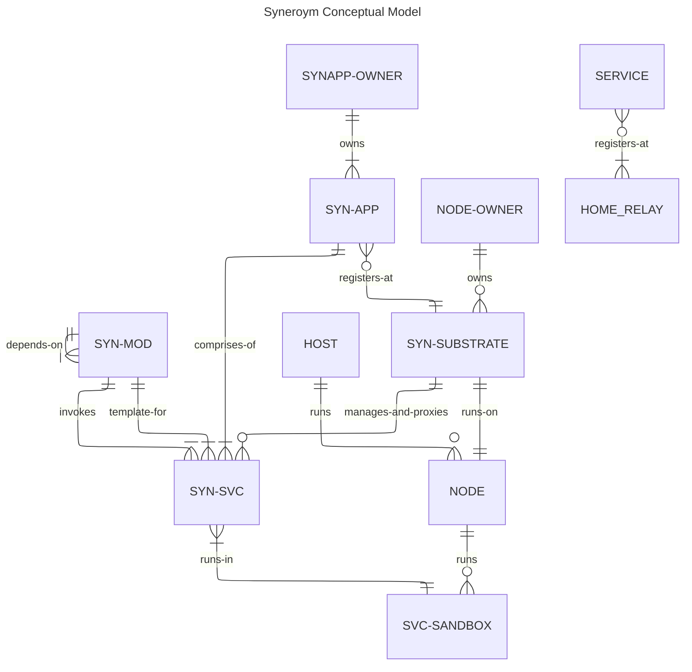

# Syneroym Ecosystem Spec [WIP]
This document expands on the vision described [here] (/VISION.md). Please go through that to understand the bigger picture. Following from there, our objective is to build a technology substrate that enables diverse classes of provider ecosystems to emerge through `Autonomous Mini-Apps Cooperating over a common technology substrate`. We also build initial mini-apps that kickstart these new ecosystems and demonstrate various interaction patterns. 

This requirements spec is structured as follows.

- Philosophy & Design Constraints
- Substrate Primitives: The core protocol layer for all participants
- Shared Utilities and Services: Common Utilities useful to multiple mini-apps
- Mini-App Specs:
    - Vertical 1: Home Services Guild (e.g. Electricians, Plumbers)
    - Vertical 2: Food and Small Retailer Mesh (e.g. Small restaurants, grocery stores)

## Philosophy & Design Constraints
A key difference in the newly envisioned provider ecosystem compared to large-scale consumer platforms is, the (often geographical) clustering of service providers and consumers. Global reach and scale from a single embedding source is not a fundamental requirement. Reach and scale are improved instead, by pre-established collaboration and coordination patterns across clusters of autonomous participants. Given this differentiator, we need to preserve benefits and reduce the drawbacks of large-scale consumer platforms like those listed in the [vision document](/VISION.md#background).

Following is a list of benefits of large-scale consumer platforms we need to preserve and drawbacks we need to reduce, and our approach to achieve those.

### Preserving Benefits
    - Technology enablement of business without managed infrastructure
    - Massive discovery & distribution
    - Streamlining, standardization of interaction patterns
    - Institutional trust
    - Security at scale
    - Fault tolerance
    - Legal shielding
    - Reputation aggregation
    - Economies of scale
    - Network effects

### Reducing Drawbacks
    - Non-availability (geographies, power/network/technology constrained scenarios)
    - Vendor lock-in
    - Governance asymmetry less freedom (but less decision making hassle) to participants
    - Flexibility to customize for localized scenarios
    - Data ownership loss
    - Sudden policy risk leading to unhappy participants
    - No transparency of how the internal systems/algorithms work
    - Strategic dependency
    - Not friendly to buildup of deep provider-client relationships, mostly transactional

### Conceptual Diagram
The following diagram shows various conceptual entities in the Syneroym ecosystem and relationships between them.

