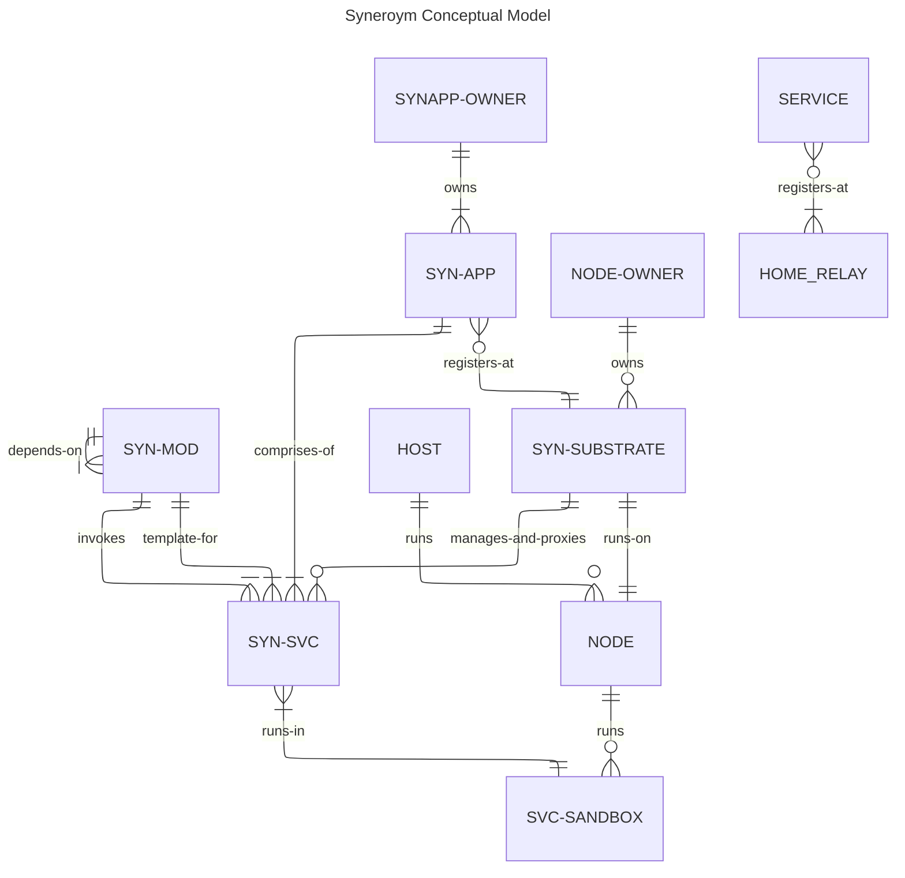

# Syneroym Ecosystem Spec [WIP]
This document expands on the vision described [here] (/VISION.md). Please go through that to understand the bigger picture. Following from there, our objective is to build a technology substrate that enables diverse classes of provider ecosystems to emerge through `Autonomous Mini-Apps Cooperating over a common technology substrate`. We also build initial mini-apps that kickstart these new ecosystems and demonstrate various interaction patterns. 

This requirements spec is structured as follows.

- Philosophy & Design Constraints
- Substrate Primitives: The core protocol layer for all participants
- Shared Utilities and Services: Common Utilities useful to multiple mini-apps
- Mini-App Specs:
    - Vertical 1: Home Services Guild (e.g. Electricians, Plumbers)
    - Vertical 2: Food and Small Retailer Mesh (e.g. Small restaurants, grocery stores)

## Philosophy & Design Constraints
A key difference in the newly envisioned provider ecosystem compared to large-scale consumer platforms is, the (often geographical) clustering of service providers and consumers. Global reach and scale from a single embedding source is not a fundamental requirement. Reach and scale are improved instead, by pre-established collaboration and coordination patterns across clusters of autonomous participants. Given this differentiator, we need to preserve benefits and reduce the drawbacks of large-scale consumer platforms like those listed in the [vision document](/VISION.md#background).

Following is a list of benefits of large-scale consumer platforms we need to preserve and drawbacks we need to reduce, and our approach to achieve those.

### Preserving Benefits
    - Technology enablement of business without managed infrastructure
    - Massive discovery & distribution
    - Streamlining, standardization of interaction patterns
    - Institutional trust
    - Security at scale
    - Fault tolerance
    - Legal shielding
    - Reputation aggregation
    - Economies of scale
    - Network effects

### Reducing Drawbacks
    - Non-availability (geographies, power/network/technology constrained scenarios)
    - Vendor lock-in
    - Governance asymmetry less freedom (but less decision making hassle) to participants
    - Flexibility to customize for localized scenarios
    - Data ownership loss
    - Sudden policy risk leading to unhappy participants
    - No transparency of how the internal systems/algorithms work
    - Strategic dependency
    - Not friendly to buildup of deep provider-client relationships, mostly transactional

## Conceptual Diagram
The following diagram shows various conceptual entities in the Syneroym ecosystem and relationships between them.

## Flows

### Substrate Setup
- Node-owner Installs substrate on node
- Substrate creates admin keys
- Register to relay:
    - Get home relay to connect from bootstrap server
    - Insert node key and relay used in Pkarr signed packet (for node's control plane services like SYN-SVC deploy/remove) in BEP 0044 DHT
    - Start iroh quic server on that relay
- Substrate Identifies its capabilities (sandbox/container types, quota configurability), user configures limits (CPU, Mem, Disk) for Services
- Access control:
    - Register substrate pubkey with owner's primary substrate (i.e. owner owns multiple substrates), 
    - Enable necessary substrate access to owner primary key
    - Provide access control to various SYN-APP owner pubkeys for SYNAPP management APIs of substrate (deploy, remove, observe), and associated quotas

### Relay
- Iroh Relay, and/or TURN Relay (for WebRTC)
- Apply to register as community relay with syneroym bootstrap server if interested in contributing (refresh periodically)
- On successful registration, it is available as relaynodeid.syneroym.net, download certs

### Bootstrap Server
Register new relays:
- Register some officially maintained relays with capabilities (tcp relay, TURN)
- Accept new relay's Offer to register as community relay for capabilities it provides, accept after verification (offline, or real-time checks)
- Register the DNS entry for that relay with registrar for *.relaynodeid.syneroym.net
- Return a random set of relays from the registered ones based on relay capability requested, weight relays by their capacity (powerful relays are returned with higher probability)
- Periodically run relay checks and expire stale community relays

Relay Lookup for nodeid:
- For any nodeid lookup, check in internal cache or DHT fallback and return relay
- For HTTP url nodeid lookups (browsers), find the relay and send an HTTP redirect to it. 

### DNS
- Store all relay subdomain mappings with DNS service (e.g. Cloudfare or Route 55)

### Application Dev
### Design considerations
- Consider "Connect" library to support both JSON and gRPC