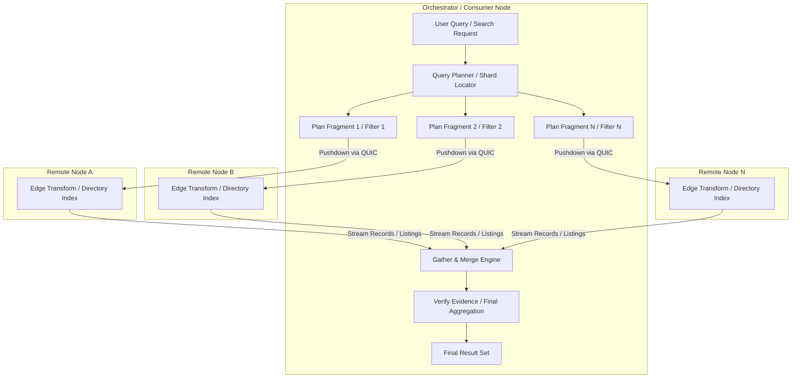

# Roym: Integrated Experience

## What Roym is

Roym is one place to talk with people, find local help or goods, and arrange
work or purchases. It should feel as simple as a chat app, while letting small
businesses and local groups serve people directly.

It starts with two kinds of local offerings:

- **Home services:** people can find and work with local professionals, such as
  plumbers, cleaners, or electricians.
- **Food and small shops:** people can find local producers and sellers, ask
  questions, and arrange an order or delivery.

Roym does not make people choose one role forever. The same person can chat
with friends, buy something, offer a service, or help run a local group.

## People who use Roym

- **Consumer:** Finds people or shops, asks questions, agrees on work or a
  purchase, and keeps the conversation and record in one place.
- **Provider:** A service business or seller. Shows what they offer, speaks
  with customers, manages bookings or orders, and keeps their customer
  relationships.
- **SynOrg Owner:** Runs a local group (guild, union, cooperative). Approves
  member providers, runs a directory, sets group rules, and handles complaints
  inside the group.

**Terminology:** This document uses both "local group" (plain English) and
"SynOrg" (Syneroym Organization). They mean the same thing: an independent
administrative domain.

One person can hold more than one role. A SynOrg owner may also be a provider.
A consumer may later become a provider. The journey below orders roles by
what depends on what, not by who people are.

---

## Decisions of record

These decisions are settled for the first release. The rest of this document
assumes them. Nothing is open. The reasoning behind the one decision that
overturned an ADR is kept at the end, under
[Decisions taken during review](#decisions-taken-during-review).

| # | Decision | Why |
|---|---|---|
| D1 | **Search in the first release is one SynOrg directory service.** No distributed shard index, no rendezvous hashing, no signed publications. | The Distributed Matching Fabric (`[P2P-DSC]`) is M8 work. It is not needed to show search working across independent installations — see [Scope R3](#r3--cross-installation-trust). |
| D2 | **Roym has one source tree with two build targets.** It compiles to `wasm32-wasip2` and runs in the sandbox, or it compiles into the `syneroym-substrate` binary. Both builds call only host interfaces. | Keeps one codebase and one security boundary. See [Packaging](#packaging-one-source-two-builds). |
| D3 | **The native build must not touch host crates directly.** It goes through the same host interfaces as the WASM build, via an in-process shim. Existing native services (such as the control plane) call `syneroym-data-db` directly; Roym must not. | If the native build could take shortcuts, the two builds would drift and the WASM build would quietly become second-class. |
| D4 | **No third-party mailboxes.** A message waits in the sender's own outbox until one of the recipient's substrates is reachable. | This is [ADR-0013](decisions/0013-p2p-messaging-architecture.md) §3, already decided. Mailboxes would need their own ADR covering encryption, retention, abuse, deletion, and operator-visible metadata. That is not first-release work. |
| D5 | **Group chat uses an owner-distributed group key over a Gossip DAG, ordered by raw sender timestamps.** The group owner generates one symmetric key per epoch and sends it to each member over the existing 1:1 channel, then generates a new one on every join, every removal, and on a schedule. Not MLS. | **Revised 2026-08-13**, amending [ADR-0013](decisions/0013-p2p-messaging-architecture.md) §6. MLS assumes a Delivery Service that gives every member the same order of Commits. We have no server, and a DAG sort does not supply that: a member can apply the only Commit it has seen, advance its epoch, then receive one that sorts earlier — and MLS epochs are forward-only. The ordering rule from §5 is unchanged and still correct. See [O1](#resolved-o1--group-key-management) for the full reasoning. |
| D6 | **Clients talk to Roym as JSON-RPC through the client gateway.** The HTML UI is one such client, served by a thin Web entrypoint service that is also the single API origin. The API is the product boundary, not the UI. | Any other client — a different UI, a script, a CLI — can be written against the same API. **Revised 2026-08-18:** the entrypoint originally existed for two reasons, and only one survives. Five services would still mean five browser origins, so a single API origin is still worth a service. But "a WASM component cannot serve HTTP" stopped being true when [M06A](planning/milestones/M06A-app-platform-surface/task.md) completed (2026-08-17), so **the entrypoint is now an ordinary WASM component and is no longer exempt from D2 and D3** (M06B `D-06B-1`). See [Client contract](#client-contract). |
| D7 | **The substrate signs on the person's behalf under delegation.** The user's Master DID delegates to the Substrate Node DID; Roym signs with the delegated key. Private user keys do not go into browser storage. | [ADR-0013](decisions/0013-p2p-messaging-architecture.md) §1 already defines this delegation. It also means the gateway must learn which person is asking — see [gap G3](#substrate-work-required). |
| D8 | **Every participant installs a substrate, including consumers.** There is no browser-only consumer path in the first release. | The client gateway binds `127.0.0.1` and authenticates no client. A hosted gateway serving browser consumers needs remote binding plus client authentication — see [gap G3](#substrate-work-required). The lightweight device identity from the requirements still applies; the person just runs it on their own machine. |
| D9 | **The Transaction service runs on the provider's substrate.** | It makes the provider the single writer for a transaction, which the requirements demand. Putting it on the SynOrg would make the group a required intermediary and would break providers who belong to no group. |
| D10 | **Group chat is core, not a stretch.** Attachments and multi-device sync are not. | Group chat is a flagship demonstration and shares the Gossip DAG with nothing else in the release, so it cannot be added cheaply later. Attachments and multi-device sync are separate systems that no other core goal depends on. |

> **Note on the plan text.** The meta plan's M6 item 3 says "relative-clock
> deterministic ordering". [ADR-0013](decisions/0013-p2p-messaging-architecture.md)
> §5 explicitly rejects relative-clock negotiation and chooses raw sender
> timestamps. The plan wording is stale and should be corrected to match D5.

---

## What Roym is made of

Roym is a SynApp: one deployment and management unit that groups several
services. Each service has its own API, its own data, and its own access
rules. They talk to each other through declared `Bind` dependencies, never
through shared database access.

| Service | Runs on | Owns | Main API |
|---|---|---|---|
| **Web entrypoint** | Every participant's substrate | The UI bundle; nothing else | serves static assets; forwards JSON-RPC to the four services below |
| **Conversation** | Every participant's substrate | Conversations, messages, delivery state, outbox, group keys | `send`, `history`, `conversations`, `delivery-status` |
| **Profile & Contacts** | Every participant's substrate | Own profile, contact list, favourites, block list | `profile.get/set`, `contacts.*`, `block.*` |
| **Catalog** | Provider's substrate | Listings, prices, service area, availability | `listing.*`, `availability.*` |
| **Transaction** | Provider's substrate | Requests, quotes, agreements, bookings, orders, receipts | `request.*`, `quote.*`, `agreement.*`, `receipt.*` |
| **Directory** | SynOrg's substrate | Member list, published listings, search index, membership credentials, revocations | `search`, `member.*`, `credential.*`, `revocation.*` |

Four rules follow from this split:

1. **The Transaction service is the single writer for a transaction.** It lives
   on the provider's substrate, because the provider owns the offer. The
   consumer's actions reach it as requests, not as direct writes. This is what
   the requirements mean by "a single writer per service resolves this".
2. **The Directory is optional.** A consumer can reach a provider by direct
   link or referral with no directory involved. A provider can be live and
   sell without joining any SynOrg. The Directory adds reach and trust
   evidence; it is not a required step in any protocol.
3. **The Conversation service is symmetric.** Consumer, provider, and SynOrg
   owner all run the same one. There is no "customer support" variant.
4. **The Web entrypoint holds no business logic.** It serves files and forwards
   calls. Anything it decided would exist only in the native build, which would
   make the WASM build quietly incomplete and break D2. See
   [Client contract](#client-contract) for why it exists at all.

## Client contract

```
  HTML UI ─────HTTP────▶ client gateway (7960) ──▶ Web entrypoint ──▶ Conversation
  any other client ────▶          "                (one origin)    ├─▶ Profile & Contacts
                                                                    ├─▶ Catalog
                                                                    └─▶ Transaction
```

The UI is served with the app, from the Web entrypoint. Deploying the Roym
SynApp gives you its UI; there is no separate install and no version skew
between the UI and the API it speaks to.

**Why a separate service rather than the Conversation service serving it.** This
originally rested on two independent reasons. **Only the second survives**
(revised 2026-08-18):

1. ~~**A WASM component cannot serve HTTP.**~~ **No longer true.**
   [M06A](planning/milestones/M06A-app-platform-surface/task.md) closed this on
   2026-08-17: a component now serves static assets straight from blob storage
   without being instantiated (A1), handles an inbound HTTP request in guest
   code (A2), and answers a WebSocket upgrade (A3) — proven end to end from a
   real browser against `test-components/miniapp-demo1-wasm` (A4, A5). The
   native `miniapp-demo1-web` pattern this bullet pointed at is now one of two
   options, not the only one.
2. **One browser origin.** The gateway routes by `Host:`, so each service is a
   different hostname and therefore a different origin. A UI served from one
   hostname that called the other four directly would need CORS headers on
   every service and a preflight on every call. Routing through one entrypoint
   removes that entirely. This reason is untouched by M06A and still holds, so
   the entrypoint stays — as a WASM component.

The entrypoint reaches the other four services by declared dependency, which is
intra-app and works today.

- Every Roym capability the UI uses is a public JSON-RPC method. If the UI
  needs something the API cannot do, the API is wrong, not the UI.
- The UI holds no user private key and no business logic it cannot recompute
  from the API.
- ~~The entrypoint is the **only** part of Roym exempt from D2 and D3.~~
  **Exemption retired 2026-08-18** (M06B `D-06B-1`). It existed only because a
  component could not serve HTTP; M06A removed that, so **no part of Roym is
  exempt from D2 and D3**. The original caveat still applies in spirit: the
  entrypoint holds no business logic, and if logic moves into it the WASM build
  stops being a complete Roym.
- **Shipped differently than planned here**: the UI bundle is a packed asset
  bundle (`crates/roym_web/ui/bundle.tar.gz`, `mise run build:roym-ui`)
  deployed alongside `web`'s manifest entry (`assets.archive`), not
  compiled into the entrypoint binary itself. It still versions with the
  app automatically, since a redeploy of `web` is how a UI update ships —
  the outcome this bullet asked for, reached through the asset-bundle
  mechanism `roym.toml`'s other services already use for their own
  manifests, rather than a literal embed.

**Today the gateway binds `127.0.0.1` and presents the node's own identity as
the caller.** So for the first release the browser must run on the same machine
as the substrate, and the gateway must gain a way to know which person is
asking. See [gap G3](#substrate-work-required).

---

## Packaging: one source, two builds

Roym is written once against the host interfaces. It is then built two ways.

| | WASM build | Native build |
|---|---|---|
| Target | `wasm32-wasip2`, run by Wasmtime in the sandbox | linked into `syneroym-substrate`, behind a Cargo feature |
| Host calls | `wit-bindgen` guest bindings | in-process shim implementing the same interfaces |
| Data access | host interfaces only | host interfaces only (D3) |
| Use | untrusted or separately-deployed installs | installs that want Roym built in, and lower call overhead |

In Rust terms: define one trait per host interface, implement each trait twice
(guest bindings, native shim), and make Roym generic over them. The same
integration tests run against both builds. A test that passes on one and fails
on the other is a bug in the shim.

**This is the constraint that sets M6's real size.** Roym cannot use any
capability that does not exist as a host interface. Two capabilities it needs
do not exist yet — see [G1 and G2](#substrate-work-required).

---

## First release scope

This table is the only normative scope statement in this document. The journey
and technical sections that follow explain it; they do not extend it.

Work is grouped into four releases. Each release must pass its acceptance
tests before the next begins.

> **Scheduled 2026-08-24.** All four releases are
> [M06C](planning/milestones/M06C-roym-product/task.md), which exists to
> build exactly this table. Owners:
>
> | Release | Slices |
> |---|---|
> | R1 — a usable local guild | **C4** (identity, profile, contacts, safety), **C5** (catalog, conversation), **C6** (directory search), **C7** (request → quote → agreement, cards). R1's gate closes at the end of C7 |
> | R2 — the transaction vertical | **C8** |
> | R3 — cross-installation trust | **C9** |
> | R4 — private group chat | **C10** |
>
> Three earlier slices carry no release because they are groundwork the whole
> table sits on: **C1** completes the dual-build shim, **C2** builds the
> SynApp skeleton and the Hub shell, and **C3** builds the signing interface
> and the signed-record envelope every row below depends on.
>
> **The Directory service deliberately spans two releases** — its search half
> is R1 and its trust half is R3, and R2 has none of it (M06C `D-06C-6`).
> That split is what keeps "the Directory is optional" enforceable rather
> than aspirational.

### R1 — A usable local guild

| Goal | Required contract | User scenario | Excluded | Acceptance test |
|---|---|---|---|---|
| A person can be a consumer without running a full install of their own | Device-bound consumer key with encrypted backup and import (`[FND-IDT]` Lightweight Consumer Identity) | A consumer sets up, backs up, then restores on a clean machine | Recovery by an operator; social recovery | Restore on a clean node reproduces identity and history; no operator can impersonate |
| A provider can publish what they offer | Versioned listing schema covering booking, payment, product, service, location, relationship, and service-record dimensions | Provider publishes a listing and edits it | Media galleries; stock counting | Listing round-trips through export/import with schema version preserved |
| Two people can talk | 1:1 text with X3DH + Double Ratchet; durable outbox with `pending`/`delivered`/`failed` visible to the user | Consumer messages an offline provider; provider comes online and sees it | Attachments; voice; video; group chat | Message survives a process restart on both sides and is never shown as delivered while pending |
| A need becomes an offer | Versioned request → quote → agreement records, each signed | Consumer describes a need, provider quotes, consumer accepts | Negotiation history rendering; templates | Accepting a quote produces a signed agreement receipt containing every field listed in [Records](#records-and-what-each-one-proves) |
| A person can find a provider through a group | Directory `search` by category, area, and filters, returning source and freshness | Consumer searches, sees results with trust evidence | Ranking; paid placement; free-text intent parsing | Results state their source and age; missing evidence shows as unknown, never as positive |
| People are safe from unwanted contact | Block, report, per-sender contact rate limits, listing publication limits | Consumer blocks a provider and reports a listing | Automated moderation; appeals workflow | A blocked sender's messages never reach the recipient's inbox; the recipient keeps its transaction records |

### R2 — The transaction vertical

| Goal | Required contract | User scenario | Excluded | Acceptance test |
|---|---|---|---|---|
| An agreement becomes scheduled work | Transaction state machine with named writer, permitted transitions, expiry, idempotency key, conflict rule | Consumer books a slot; a second consumer tries the same slot | Recurring bookings; multi-part jobs | Two concurrent bookings of one slot produce one confirmation and one named conflict, never two confirmations |
| Payment can be recorded honestly | `payment-acknowledgement` record, separate from settlement; payment instruction bound into the signed agreement | Provider requests payment, consumer pays outside Roym, both acknowledge | Provider-verified settlement; escrow; refunds | The UI never labels an acknowledgement as verified payment; the payee shown matches the agreement |
| Completion is recorded | Mutually signed `fulfilment-receipt` | Both sides sign off completed work | Ratings; feedback scores | Neither party can alter a signed receipt; corrections appear as separate records |
| A person can leave with their data | Versioned, integrity-checked export of conversations, agreements, and receipts | Consumer exports everything, imports on a new install | Selective export; redaction | A same-version export/import round-trip passes; import reproduces verification status. **Reworded 2026-08-24** (M06C `D-06C-2`): this read *"Cross-version fixture test passes"*, which G5 going out of scope makes unmeetable — see [G5](#g5--public-contract-versioning). R1's listing row is unaffected and stands as written, since a same-version round-trip that preserves the version field is not cross-version work |
| A person can recover from device loss | Encrypted backup with a tested restore path | Provider loses their machine and restores | Automatic cloud backup | Restore on a clean node passes the durability suite with no acknowledged transaction lost |

### R3 — Cross-installation trust

| Goal | Required contract | User scenario | Excluded | Acceptance test |
|---|---|---|---|---|
| A consumer can transact with a provider on a different install | Endpoint resolution through the discovery overlay ([ADR-0022](decisions/0022-two-tier-logical-service-discovery.md)) | Consumer on install X hires a provider on install Z | Automatic discovery between SynOrgs | Full R1+R2 flow passes end to end with the three parties on three separate installs |
| Group membership means something checkable | Signed membership credential with issuer, scope, and expiry; signed revocation list | Consumer checks a provider's guild membership | Trade licences; third-party credentials | The consumer's own node verifies signature, issuer, scope, and expiry — never the directory that served the result |
| A group can enforce its rules | Signed, scoped moderation decision with source and timestamp | SynOrg suspends a member | Cross-group propagation; global blocklists | A suspended member vanishes from that directory's results; already-cached copies show the revocation on next check, and the document does not claim instant removal |

### R4 — Private group chat

Core, not a stretch. Built last of the core set, because it needs R1's 1:1
messaging underneath it.

| Goal | Required contract | User scenario | Excluded | Acceptance test |
|---|---|---|---|---|
| A group can talk with no central chat server | Gossip DAG: messages spread directly between members, each linking to earlier ones | A member posts; every other member receives it without any server in the path | Message search; pinned messages | With no coordinator reachable, members who can reach each other still exchange and order messages |
| Every member sees the same order | Total order by `(sender_timestamp, sender_did)`, per [ADR-0013](decisions/0013-p2p-messaging-architecture.md) §5 | Two members post at the same moment from skewed clocks | Correcting displayed times | Every member's transcript is byte-identical after sync, whatever order messages arrived in |
| Only members can read the group | Owner-distributed per-epoch group key; rekey on every join, every removal, and on a schedule (D5) | A member joins, then another is removed | Rejoining and reading the gap; leaderless groups | A joiner cannot read messages from before the join; a removed member cannot read messages after the removal; a scheduled rekey with stable membership still changes the key |
| Membership is visible to the group | Join and removal are ordinary DAG events, ordered by the same rule as messages | The owner adds a member | Approval votes; member-initiated invites | Every member's membership history is identical after sync; no key reaches a party absent from that history |
| An offline member catches up | Members hold and serve the DAG to each other; no external store | A member is offline for a day, then returns | Unbounded history retention | The returning member pulls the gap from any online peer and converges to the same transcript |

### Beyond the first release

Real systems in their own right, sequenced after the core set:

- **Attachments:** images, files, video
- **Multi-device sync:** primary-substrate reconciliation per [ADR-0013](decisions/0013-p2p-messaging-architecture.md) §2
- **Chat polish:** threads, polls, reminders, read receipts, typing indicators, broadcasts

### Not in the first release

- Roym does not process payments, hold money, or run escrow. It opens an
  external payment page and records what both sides say happened.
- No public ratings or scores computed from past work.
- No AI assistant that searches, recommends, or acts for people. Search is by
  category, area, and filters — not free-text intent parsing.
- No automatic discovery between independently run SynOrgs. Groups can record
  peer relationships now; the protocol comes later.
- No automated dispute workflow. A consumer can forward complaint details to a
  SynOrg owner by hand.
- No distributed shard index (D1).

---

## Participant journey

This traces who does what, and when. Services and protocols are black boxes
here.

### Phase 1 — Provider sets up

```
P1.  Provider installs a Syneroym substrate with the Roym SynApp
P2.  Provider creates their profile
P3.  Provider creates a catalog of services or products
       — the listing is signed, which proves who published it
       — signing does not prove the listing is honest; trust evidence
         comes separately, from membership credentials and receipts
P4.  Provider sets availability (appointment slots or supply schedule)
P5.  Provider is live and can be reached by direct link or referral
       — being listed in a SynOrg directory is optional and comes next
```

### Phase 2 — SynOrg owner sets up a local group

```
S1.  SynOrg Owner installs a Syneroym substrate with the Roym SynApp
S2.  SynOrg Owner creates the SynOrg: name, rules, area, categories,
       support contact, dispute path, directory policy, retention policy
S3.  SynOrg Owner runs the Directory service on their own node
S4.  Provider applies to join
S5.  SynOrg Owner reviews the provider against group rules
S6.  SynOrg Owner approves and issues a signed membership credential
       — scoped, with an expiry date
S7.  Provider chooses to publish listings to that directory
       — publishing is the provider's action, not the SynOrg's
S8.  Provider receives SynOrg announcements and updates
```

Everyday work for the SynOrg owner:

```
S9.   Reviews newly published listings for rule compliance
S10.  Shares announcements, guides, and local information
S11.  Contacts a member about a listing that breaks the rules;
        if unresolved, publishes a signed suspension decision
S12.  Receives a complaint forwarded from a conversation, reviews it
        with both sides, and acts under group rules
S13.  Removes a repeat offender: revokes the membership credential and
        publishes the revocation
        — the member disappears from this directory's results
        — copies already cached elsewhere show the revocation when
          they are next checked; nobody can promise instant removal
```

### Phase 3 — Consumer arrives

```
C1.  Consumer installs Roym and creates a device-bound identity
C2.  Consumer is prompted to back it up, after seeing some value first
C3.  Consumer creates a profile
C4.  Consumer adds one or more SynOrg directories to search
```

> **How does a consumer find a SynOrg?** Out of band: word of mouth, a shared
> link, a referral, or a well-known list. Which SynOrg to trust is the
> consumer's own decision.

Finding a provider:

```
C5.  Consumer searches by category, area, and filters
C6.  The search goes to each directory the consumer has added
       — directly, from the consumer's node
       — a directory is a query target, not a required hub
C7.  Each directory returns matching listings with their source and age
C8.  Consumer's own node combines and verifies results
       — checks each listing signature
       — checks each membership credential: signature, issuer, scope,
         expiry, revocation
       — missing evidence shows as unknown, never as a positive default
C9.  Consumer sees results, and can see why each one appeared
```

Engaging a provider — the provider may be on any installation; the flow is the
same:

```
C10.  Consumer starts a conversation from a listing
        — subject to the provider's contact rate limits
C11.  Provider replies in the same conversation
        — if either side is offline, the message waits in the sender's
          own outbox and shows as `pending` until it is delivered (D4)
C12.  Consumer sends a structured request: category, description,
        approximate area, preferred window, attachments, data-use notice
        — the exact address is disclosed only when it is needed
C13.  Provider sends a versioned quote card: scope, price, taxes and
        fees, schedule, location, payment method and payee,
        cancellation and refund terms, expiry, dispute path
C14.  Consumer accepts, rejects, or asks for changes
        — acceptance by both sides produces a signed agreement receipt
        — a material change produces a new version, not an edit
```

Booking, payment, completion:

```
C15.  Consumer books a slot, or places an order
        — the provider's Transaction service is the single writer and
          decides; a losing concurrent booking gets a named conflict
C16.  Both sides see the same progress card, driven by the transaction
        state machine
C17.  Provider requests payment; the payment instruction was already
        fixed in the signed agreement, so the payee cannot be swapped
        in a later chat message
C18.  Consumer pays through the external service
C19.  Each side records a payment acknowledgement with whatever proof
        they have
        — this proves both sides said the same thing
        — it does not prove the money moved; the UI must say so
C20.  Provider marks the work complete; both sides sign a fulfilment
        receipt
C21.  Consumer may recommend the provider to a contact, in a private
        conversation
```

### Later: discovery volunteers

Not first-release work. As a network grows, volunteers can run directory
capacity for a SynOrg instead of the SynOrg running it all itself. The
mechanism for associating a volunteer node with a SynOrg is undesigned, and is
sequenced with the Matching Fabric in M8.

### Interaction map

```
  ┌──────────────────┐   membership credential,   ┌──────────────────┐
  │      SynOrg      │   announcements            │     Provider     │
  │                  │◀──────────────────────────▶│                  │
  │  • members       │   provider publishes       │  • catalog       │
  │  • directory     │   listings by choice       │  • availability  │
  │  • rules         │                            │  • transactions  │
  │  • revocations   │                            │                  │
  └────────┬─────────┘                            └────────▲─────────┘
           │                                               │
           │ search query,                                 │ conversation,
           │ verified results                              │ quote, booking,
           │                                               │ payment, receipt
           │                                               │ (direct, E2E)
           │              ┌──────────────────┐             │
           └─────────────▶│     Consumer     │◀────────────┘
                          │                  │
                          │  • verifies all  │
                          │    evidence      │
                          │    locally       │
                          └──────────────────┘
```

The consumer queries directories directly and verifies every result on its own
node. A directory can be skipped entirely when the consumer already has a link
or a referral.

---

## Records and what each one proves

Each record is signed, versioned, and append-only. Nothing in this list can be
rewritten after the fact; corrections are new records that reference the old
one.

| Record | Signed by | Proves | Does **not** prove |
|---|---|---|---|
| `listing` | Provider | Who published this offer, and when | That the offer is honest or the provider is competent |
| `membership-credential` | SynOrg | This SynOrg approved this provider, within a scope, until an expiry date | That the SynOrg vetted them well, or that any other group agrees |
| `revocation` | SynOrg | This SynOrg withdrew a credential at a stated time | That every cached copy is gone |
| `request` | Consumer | What the consumer asked for | — |
| `quote` | Provider | The exact terms offered, at a version | — |
| `agreement-receipt` | Both | Both parties accepted these exact terms, including payee, expiry, cancellation and refund terms, and dispute path | That either side will perform |
| `payment-acknowledgement` | Each side, separately | Each party stated what they observed about a payment | **That money moved.** Only a supported payment provider's own attestation could show that, and none is integrated |
| `fulfilment-receipt` | Both | Both parties agreed the work was done | Quality, or that no dispute follows |
| `moderation-decision` | SynOrg | This group applied this rule to this member at this time | Global truth; another group is free to disagree |

Two rules that follow:

- **Payment evidence is not a public listing field.** A `payment-acknowledgement`
  belongs to the two parties. It is disclosed to a third party only by an
  explicit, scoped, expiring grant. The requirements are clear that trust
  signals must not be pushed into one global public store, and search results
  must not carry a party's payment history by default.
- **Deleting a message does not delete the other party's record.** A person can
  remove their own local copy and ask the other side to do the same. Agreements
  and receipts survive that, because both parties signed them.

---

## Transaction state

Every transaction is an entity with one named writer: the **Transaction
service on the provider's substrate**. The consumer's client sends requests;
the Transaction service decides.

```
  requested ──▶ quoted ──▶ agreed ──▶ scheduled ──▶ in-progress
                  │           │           │              │
                  ▼           ▼           ▼              ▼
              expired    cancelled    cancelled      completed
```

- **Writer:** the provider's Transaction service, always. There is no
  multi-master merge for transactions.
- **Idempotency:** every state-changing request carries an idempotency key.
  A retry after a lost connection reaches the same final state; it never
  creates a second booking.
- **Expiry:** a quote has an explicit expiry. An unaccepted quote expires
  rather than sitting open forever.
- **Conflicts:** two consumers booking the same slot produce one `scheduled`
  and one named conflict returned to the loser. Last-write-wins is not
  acceptable here.
- **Cancellation:** permitted states and actors are explicit and are part of
  the agreed terms. A consumer can cancel a still-pending request, and the UI
  shows when cancellation is no longer guaranteed.
- **Audit:** transitions are append-only. Corrections never rewrite a
  previously signed fact.

**CRDTs are not used for transactions.** They are appropriate for merging one
person's own device state and chat metadata, and nothing else in Roym.

---

## What is encrypted, and who can see what

"End-to-end encrypted" needs a precise statement, so users are not misled.

| Party | Can read message content? | Can see metadata? |
|---|---|---|
| The two people in a 1:1 conversation | Yes | Yes |
| Group members (current epoch) | Yes, for that epoch | Yes |
| **The group owner** | Yes — they generate and distribute the key (D5) | Yes, plus the full membership history |
| A removed group member | No, from the next epoch onward | Sees nothing new |
| Relay / coordinator node | **No** | Sees that two endpoints exchanged traffic, sizes, and timing |
| Directory service | **No** — it never carries conversations | Sees search queries and which listings were returned |
| The host operator of a provider's substrate | **Yes**, if the provider does not run their own machine. A compromised host can read plaintext in use | Everything on that node |
| Backup destination | No, if backups are encrypted before they leave | Sizes and timing |
| The device itself | Yes | Yes |

Three consequences to state plainly in the product:

1. **A managed-guild provider trusts its host.** If a SynOrg hosts a provider's
   substrate, that operator can read that provider's conversations. This must be
   disclosed before the provider chooses the managed path.
2. **Transport encryption is not end-to-end privacy.** Relay and coordinator
   links are encrypted, but that is a separate, weaker thing, and the UI must
   never present it as message privacy.
3. **A group owner can read their group.** They hold the key they distribute.
   This is the same power a group admin has in any common chat app, with one
   difference worth naming: the owner is also the key distributor. Membership
   changes are visible DAG events precisely so the owner cannot add a reader
   without the group seeing it. The group's UI should say who the owner is.

**Recovering from a compromise.** If a member's device is compromised, the owner
rekeys and the attacker loses access from the next epoch. That recovery depends
on somebody *noticing*. Scheduled rekeying is what covers the case nobody
notices: it bounds how long stolen key material stays useful, instead of leaving
it useful forever.

**Where signing happens:** in the substrate, using a key delegated from the
person's Master DID (D7). The HTML UI does not hold a signing key. This means
the substrate signs whatever an authenticated local client asks it to sign —
which is exactly why the gateway needs to authenticate that client (G3).

---

## Safety and operations

These are requirements, not polish, and they are in R1.

- **Block:** a blocked sender's messages never reach the recipient's inbox.
  Blocking does not delete the recipient's transaction records with that party.
- **Report:** a person can report impersonation, fraud, harassment, unsafe
  service, or illegal content to the relevant SynOrg. A report has a status.
  An unverified allegation is never published as fact.
- **Contact rate limits:** unsolicited first contact is rate-limited per
  sender and controllable by the recipient.
- **Publication limits:** a provider cannot flood a directory with listings.
- **Policy disclosure:** a SynOrg's rules, retention policy, dispute path, and
  support contact are visible before a provider joins or a consumer searches
  through it.
- **Retention and deletion:** every durable record has a stated owner, retention
  policy, and deletion or tombstone behaviour. Export and account deletion are
  separate actions. The product does not promise deletion it cannot enforce.
- **Backup and recovery:** encrypted backup with a restore path that is tested
  on a clean node before release.

---

## Technical design

Written for engineers who know web, distributed systems, and security, but not
Syneroym.

### Terms

- **Syneroym node / substrate:** one running Syneroym installation.
- **Service:** an independently run part of an application with its own API.
- **SynApp:** an application definition grouping several services. It is the
  deployment and management unit. Roym is one SynApp.
- **Capability token:** a signed, limited permission — who may do what, on
  which resource. It can be passed on with fewer permissions, never more. In
  Syneroym these use the UCAN format ([ADR-0015](decisions/0015-ucan-capability-model.md)).
- **Gossip DAG:** a graph of group messages shared directly between members.
  Each message links to earlier ones, which lets clients order late-arriving
  messages the same way.
- **CRDT:** a data structure that merges compatible changes from several
  devices without a central lock. Used only for one person's own device state.

### Service boundaries and permissions

- Roym both offers and consumes services. It exposes its APIs to other SynApps
  and calls other apps through their APIs.
- Roym calls services two ways, and the difference matters for what has to be
  built. A **declared dependency** (`Bind`) is fixed at deploy time and resolved
  against Roym's own app instance — right for Roym's five services calling each
  other. A **direct service call** names a DID at runtime — the only shape that
  fits a directory the *user* chose after deployment, since a deploy-time
  binding cannot express "the directories this person added last week".
- Roym therefore needs no cross-app `Bind`. Its own services are one app
  instance, and everything outside it is user-chosen at runtime. What it does
  need is for a remote service to be *resolvable* by a caller its operator never
  met — see [gap G4](#g4--declared-service-visibility).
- Every call carries the caller's identity and a capability token. The
  receiving service checks both ([ADR-0016](decisions/0016-native-dispatch-identity-threading.md)).
- A plugin gets a token for one conversation or one action. It cannot read
  unrelated conversations.

### Messaging

- **1:1:** X3DH plus Double Ratchet, through `vodozemac` (`D-B4-7`).
- **Group:** one symmetric group key per epoch, generated by the group owner and
  sent to each member over the 1:1 channel above. Messages spread as a Gossip
  DAG between members. Relays forward but cannot read (D5).
- **Rekey:** the owner generates a new group key on every join, on every
  removal, and on a schedule. Scheduled rekeying is what bounds the damage from
  a compromise nobody noticed — without it, a stolen key stays useful forever.
- **Membership changes are DAG events.** Adding or removing a member is an
  ordinary entry in the group's DAG, so every member sees it. The owner cannot
  add a reader silently.
- **Keying is one module behind one interface.** Nothing in the DAG, the
  ordering rule, the history sync, or the storage depends on which key
  agreement is in use, so this can be replaced without touching them (D5).
- **Ordering:** each message carries a signed timestamp from its own sender,
  taken at face value. The sequence is sorted by `(sender_timestamp, sender_did)`.
  Every peer sorts the same immutable values, so ordering is identical
  everywhere. Clock skew can make the *displayed* time wrong; it can never make
  two peers disagree about order ([ADR-0013](decisions/0013-p2p-messaging-architecture.md) §5).
- **Delivery:** before sending, Roym writes the message to a durable local
  outbox. If no substrate of the recipient is reachable, it retries. There is no
  third-party buffer (D4). The consequence is honest and must be shown: if the
  two sides never overlap online, the message is not delivered, and it stays
  `pending`.
- **Ephemeral signals:** typing indicators and read receipts use the
  `syneroym:messaging` publish/subscribe channel. They are best-effort and are
  never part of durable delivery.

**Message deletion.** Deleting writes a durable deletion record and removes the
local copy. It does **not** revoke a key: in a group, every member already holds
the epoch key and may already hold the ciphertext. A key cannot be taken back.
Deletion is a request that well-behaved clients honour, plus local removal.
The product must say this, not imply cryptographic erasure.

### Cards

A card in a conversation is versioned, typed JSON. The client uses the type and
version to render a quote, booking, or progress view. A client that meets an
unknown card type renders it safely and never executes sender-supplied code.

**Settled 2026-08-24** (M06C `D-06C-3`), because the producer (the Transaction
service) and the consumer (the Hub) are built in different slices, and a rule
decided inside either one gets decided twice, differently.

The first release has **seven card types**, and no others:

| Type | Signed by | Appears at |
|---|---|---|
| `request` | Consumer | C12 — the consumer describes a need |
| `quote` | Provider | C13 — the provider's exact terms |
| `agreement-receipt` | Both | C14 — both sides accepted those terms |
| `booking-progress` | Provider's Transaction service | C16 — the shared progress view, driven by the state machine |
| `payment-request` | Provider | C17 — payee comes from the signed agreement, never from a later message |
| `payment-acknowledgement` | Each side, separately | C19 — what each party observed |
| `fulfilment-receipt` | Both | C20 — both agreed the work was done |

Each renders through a **fixed template chosen by `(type, version)`**. The Hub
ships seven templates plus one fallback; it is not a general interpreter.

"Renders it safely and never executes sender-supplied code" means, precisely:

- No sender-supplied HTML, script, style, or markup is inserted into the page.
  Card values are text to be displayed, never markup to be parsed.
- No URL a card carries is fetched, prefetched, resolved, or navigated to
  automatically. The one payment link is shown in full and followed only on an
  explicit human click.
- An unknown type — or a known type at an unknown version — renders as a
  neutral block naming the type and saying this client does not understand it.
  Never as an empty card, and never as a guess at what it might have meant.

### Search

For the first release (D1):

- The Directory service holds the listings its members published to it, and
  answers queries by category, area, and filters.
- A consumer's node queries each directory it has been given, in parallel,
  and merges the answers.
- Results carry their source and their age. The consumer's node verifies every
  signature, credential, expiry, and revocation before showing anything as
  trusted evidence.
- **Finding is separate from trusting.** The directory helps find candidates.
  It never declares them trustworthy, and the consumer's node never takes the
  directory's word for a verification result.

The M8 Matching Fabric replaces the "which directories do I ask" step with
deterministic placement and shard lookup. It does not change the verification
rule above, which is why building the directory first does not create rework.

### Data ownership and recovery

- Each installation keeps its conversations, contacts, listings, and
  transactions in its own encrypted SQLite databases.
- A person's identity is separate from a node's network identity. Replacing a
  node does not change who signed a message.
- Important state changes are recorded so an interrupted update recovers after
  a crash. Durable outboxes keep retrying after a network outage.
- Roym must never write unencrypted user data to the filesystem. Keys stay
  separate from the files they protect.

---

## Substrate work required

These do not exist today. Implementation planning must schedule them before,
or alongside, the Roym services themselves.

> **Scheduled 2026-08-18.** All four are
> [M06B](planning/milestones/M06B-roym-substrate-foundations/task.md), which
> exists to close exactly this section. Owners:
>
> | Gap | Slice |
> |---|---|
> | G1 — durable messaging host interface | **B4** (interface + 1:1 delivery), **B5** (group DAG, ordering, group key) |
> | G2 — guest-reachable outbox | **B4** — folded into G1's interface rather than given its own, per this section's own reasoning (M06B `D-06B-2`) |
> | G3 — person identity at the client gateway | **B1** |
> | G4 — declared service visibility | **B2**, both layers: publication ([ADR-0018](decisions/0018-service-record-visibility.md), Accepted 2026-08-18) and resolution ([ADR-0022](decisions/0022-two-tier-logical-service-discovery.md) §5). The resolution half was previously M05C S4; it moved (M06B `D-06B-4`) |
>
> M06B adds a fifth item this section does not number: the **dual-build shim**
> that D2 and D3 require, as slice **B3**. It ships before B4 so the largest new
> interface is designed against both builds from the start.

### G1 — A durable messaging host interface

`syneroym:messaging` today is `publish` / `subscribe` / `unsubscribe` plus raw
stream registration. It cannot carry chat, and
[ADR-0013](decisions/0013-p2p-messaging-architecture.md) §6 says by name that
durable message content must never depend on it.

Needed: a host interface for conversations, direct delivery, delivery state,
history, and group key handling — plus the Layer 3 machinery underneath it
(direct exchange, DAG sync, group key distribution). **This is the largest single item
in M6.** Under D2 and D3 there is no way around it: the native build cannot
skip the interface and call internal crates.

### G2 — A guest-reachable outbox

The durable queue and dead-letter queue exist as a Rust library
(`crates/async_queue`, per [ADR-0023](decisions/0023-durable-async-primitives.md))
with no WIT surface. Roym needs `pending` / `delivered` / `failed` state and
retry from both builds. Either give the queue a host interface, or fold outbox
state into G1's interface — G1 is the better home, since message delivery state
is what users actually see.

### G3 — Person identity at the client gateway

The gateway binds `127.0.0.1` and presents the **node's** identity as the
caller ([gateway.rs:36](../crates/client_gateway/src/gateway.rs#L36)). It does
not authenticate the HTTP client. So today any local process could ask the
substrate to sign as the user, and the substrate cannot tell which person is
asking on a shared node.

Needed: a local session model that binds an authenticated client to a person's
identity, so D7's delegated signing is safe.

### G4 — Declared service visibility

Two separate visibility gaps sit at two layers, and Roym needs both.

**Can a caller resolve this service at all?** Today, no — not across
installations. The client gateway warns at startup that without a
pre-installed `resolve_ucan` token, app-scoped hostnames "will be refused by any
supervisor they reach"; with only the same-node gate they resolve "only for apps
supervised by this node"
([gateway.rs](../crates/client_gateway/src/gateway.rs#L128)). So a consumer
reaching a provider's Roym app, or querying a SynOrg's Directory on another
node, is cleanly refused unless an operator installed a token in advance. The
fix is [ADR-0022](decisions/0022-two-tier-logical-service-discovery.md) §5's
per-logical-service "open to all" declaration. **Rescheduled 2026-08-18** from
M05C slice S4 to **M06B slice B2**, so that one slice owns both layers of this
question; S4 keeps cross-app `Bind` only. **This blocks R1's directory search
and all of R3.**

**Does this service's record get published?** [ADR-0018](decisions/0018-service-record-visibility.md),
**Accepted 2026-08-18**. It records that publication is a side effect of whether
a certificate flag was passed, so "deployed but deliberately private" and
"undiscoverable by accident" are the same state from outside. Roym needs this
for a provider being live but unlisted (P5) and for publishing to a chosen
directory (S7). Its three-valued `visibility` enum already exists on both sides
of the WIT boundary — M06A slice A1 defined it for asset readability, a
different question — so **B2 owes the `service-config` field and the
publication path that honours it**, not the enum.

These are adjacent but not the same: one governs *resolution by a caller*, the
other *publication of a record*. Whether they should stay two mechanisms or
become one is a question for the implementation plan, not for this document.

> **A note on M05C S4's gate.** S4 is gated on "a first real cross-app
> dependency exists". Roym does not supply one — its own services share an app
> instance, and everything outside is addressed by DID at runtime. So S4's
> *visibility* half now has a consumer and is M6-blocking, while its *cross-app
> `Bind`* half still has none. The two should be split rather than shipped
> together on a gate only one of them clears.

### G5 — Public contract versioning

Publications, search results, credentials, revocations, conversations,
agreements, receipts, and export bundles all cross installation boundaries and
all need explicit schema versions with cross-version fixtures, per the
Interoperability and Portability baselines.

> **Out of scope for the first release, deliberately. Scheduled 2026-08-24**
> (M06C `D-06C-1`).
>
> **What is deferred:** cross-installation schema *versioning* as a discipline
> — migration paths, compatibility shims, and cross-version fixtures. The
> product is pre-release. There is no installed base to stay compatible with,
> so a version ladder would be built against a population that does not exist
> and would be wrong by the time one does.
>
> **What still ships:** an explicit `version` field on every signed record,
> from its first byte. This is not a compatibility shim — it is the one part
> that is cheap now and expensive later, because adding a field to a signed
> structure afterwards changes its canonical bytes and invalidates every
> signature already produced.
>
> **This makes one acceptance test above unmeetable as written**, and it is
> reworded rather than left to fail: R2's export row now reads *"A same-version
> export/import round-trip passes"*. R1's listing row is unaffected — a
> same-version round-trip preserving the version field is not cross-version
> work.
>
> **Pickup trigger: revisit before the first external release**, meaning
> before any installation Syneroym does not control holds Roym data. G5 is the
> one gap in this section with no milestone owner, so it is tracked in
> [deferred-backlog.md](planning/deferred-backlog.md) §10 rather than resting
> on this paragraph alone.

---

## Decisions taken during review

Nothing is open. All five questions raised during the 2026-08-13 review were
settled and folded into the decisions of record. The reasoning for the one that
changed an ADR is kept below, because the choice gives up a real security
property and that should not be silently buried in a table.

<a id="resolved-o1--group-key-management"></a>

### Resolved: O1 — group key management

**Taken: owner-distributed group key. Not MLS.** This amends
[ADR-0013](decisions/0013-p2p-messaging-architecture.md) §6, which chose MLS via
`openmls`. See D5.

What the two options share, and therefore what was never at stake: the Gossip
DAG, message ordering, history sync, membership events, storage, and the UI.
Those are the larger half of group chat and are identical either way. Only the
keying module differs, which is why this was a cheap decision to get right.

**The deciding argument is that MLS assumes a server we do not have.** MLS's
architecture relies on a Delivery Service to give every member the same order of
Commits. That is not incidental — the ratchet tree advances as a linear chain of
epochs, so members must agree on which Commit won. A DAG total sort does not
supply this. A member can apply the only Commit it has seen, advance its epoch,
and then receive a Commit that sorts earlier. MLS epochs are forward-only and
`openmls` offers no un-commit, so that member must either buffer Commits behind
a confidence rule we have not designed, or diverge and re-sync group state.
[ADR-0013](decisions/0013-p2p-messaging-architecture.md) §5 handles the case
where a member learns of the conflict *before* applying, and not this one. This
is why decentralised group key agreement remains a research topic rather than a
drop-in library choice.

| | MLS via `openmls` | Owner-distributed key (**taken**) |
|---|---|---|
| Fit with no Delivery Service | Needs a consistent Commit order we would have to invent; late-arriving earlier Commits have no clean handling | No commits, no epochs to converge |
| Integration work | Storage provider, crypto provider, group-state persistence across restarts, KeyPackage publication so members can be added while offline, Welcome flow | Generate a key, send it over channels R1 already built |
| Concurrent membership changes | Two members committing at once race | Cannot happen — only the owner rekeys |
| Recovering from a known compromise | Rekey; attacker locked out | Rekey; attacker locked out |
| Recovering from an *unnoticed* compromise | Automatic — routine joins and leaves refresh key material | Only on the next scheduled rekey, which is why D5 requires one |
| Who can read the group | Current members | Current members **and the owner** |
| Owner offline | Any member can propose | Nobody can join or leave until the owner returns |
| Scaling | `O(log N)` rekey | `O(N)` rekey — fine for groups of hundreds, wrong for tens of thousands |

**Two costs were narrower than first assessed, and both are mitigated:**

- *Post-compromise security.* The first assessment said there was none. That was
  too strong: an owner who learns of a compromise rekeys, and the attacker is
  out. The real gap is narrower — MLS recovers *without anyone noticing*, since
  ordinary membership traffic refreshes keys. D5's scheduled rekey bounds the
  unnoticed case instead of leaving it open forever.
- *Group types.* The first assessment proposed restricting core group chat to
  owner-led groups, on the argument that a family or neighbourhood group has no
  natural owner. **Dropped.** Every group in every common chat app has a creator
  who can add and remove people; "family group" is a name, not a different
  structure. Making membership changes visible DAG events removes the one power
  our owner would otherwise have beyond a normal admin — adding a reader
  silently.

**What remains given up, accepted knowingly:** the owner can read the group, the
owner must be online for joins and leaves, and rekey cost grows linearly with
group size. None binds at the scale this product targets.

**Reversibility.** D5 requires the keying to sit behind one interface that the
DAG, ordering, sync, and storage do not depend on. If MLS is ever wanted — for
large groups, or to interoperate with other MLS clients — it replaces that one
module. Recorded in [deferred-backlog.md](planning/deferred-backlog.md) §5.

---

## Appendix: Conceptual Architecture — Federated Query Graphs & Universal Search

This section compares the **Federated Query Orchestrator** (`[PLT-DAP-02]`, Operator Graph) and the **Universal Search / Distributed Matching Fabric** (`[P2P-DSC]`, Search Node).

At a high level, both systems solve the same core problem: **executing a query across partitioned, decentralized data nodes without centralizing raw datasets.**



### 1. Common Conceptual Abstractions

The two subsystems share a unified four-stage execution pipeline:

| Pipeline Stage | Federated Query Orchestrator (`[PLT-DAP-02]`) | Universal Search / Matching Node (`[P2P-DSC]`) | Common Abstraction |
|---|---|---|---|
| **1. Planning & Placement** | DataFusion generates a logical plan, identifies physical partitions across DIDs, and splits the query into Substrait plan fragments. | Consumer node resolves search tags (category, spatial geohash) against known directories or rendezvous-hashed shard holders. | **Scatter Planner:** Maps a logical intent to a set of physical node targets and builds per-node query payloads. |
| **2. Edge Pushdown (ELT)** | Edge node executes `syneroym:data/transform` inside a sandboxed WASM guest directly against local SQLite storage. | Directory/index node runs structured query filtering over local member listings and published intents. | **Edge Evaluation:** Pushes filtering logic to where data lives instead of pulling raw databases over the wire. |
| **3. Streamed Exchange** | Edge nodes stream Arrow record batches back over multiplexed Iroh QUIC streams (`syneroym:data/stream`) with backpressure. | Target nodes stream matching listing records over multiplexed QUIC streams with response paging. | **Framed Data Stream:** Point-to-point, backpressured transport of typed record batches over QUIC. |
| **4. Ingestion & Merging** | Orchestrator merges streams, executes remaining non-pushable operations (cross-node joins, global sorting, top-$k$). | Consumer node merges parallel results, ranks listings by trust/relevance, and presents them to the UI. | **Gather & Reduction:** Merging, ranking, and deduplication of parallel result streams. |

---

### 2. Deep Differences Not Easily Reconciled

While their pipeline shapes match, the two systems serve fundamentally different operational models that resist a naive single-implementation unification:

#### A. Zero-Trust Verification vs. Relational Correctness
* **Federated SQL (`[PLT-DAP-02]`):** Operates in a **closed or semi-trusted administrative domain** (e.g. across nodes belonging to one SynApp deployment). The engine assumes that an edge node's returned numbers and aggregations are mathematically honest if the DID transport is authorized.
* **Universal Search (`[P2P-DSC]`):** Operates in an **open, adversarial zero-trust network**. The search node **cannot trust** the directory's assertions. Every individual listing must carry independent cryptographic proofs (ed25519 author signatures, verifiable credentials, unexpired timestamps, non-revocation proofs). The gather stage is fundamentally a *cryptographic verification engine* first, and a *record merger* second.

#### B. Complete Sets vs. Best-Effort Top-$k$ Ranking
* **Federated SQL:** Relational queries demand **exact completeness and sound semantics**. If one partition fails or times out during a `SUM()` or `JOIN`, the entire query fails or returns an explicit error.
* **Universal Search:** Search operates under **best-effort, loss-tolerant semantics**. If 3 out of 10 directories are offline or slow, the search yields partial results from the remaining 7, ranking candidates by freshness, reputation score (`[P2P-REP]`), and proximity without failing the user request.

#### C. Schema Uniformity vs. Heterogeneous Extensible Schemas
* **Federated SQL:** Relies on strict, compile-time relational schemas (Arrow schemas, SQL table column types) known to the DataFusion planner.
* **Universal Search:** Operates over semi-structured, evolving entity schemas (e.g., extensible JSON Action Cards, arbitrary service tags, localized taxonomies) where unknown attributes must degrade gracefully in the client UI.

#### D. State Pushdown vs. Index Synchronization
* **Federated SQL:** Pushdown is ephemeral: send a query fragment, evaluate against hot tables, discard execution context.
* **Universal Search:** Nodes maintain persistent inverted indices, rendezvous cache shards, and spatial cell buckets requiring background TTL management, gossip synchronization, and cache eviction.

---

### 3. Engine Footprint & The Impedance Mismatch of External Engines

Syneroym nodes are designed to be **extremely lightweight and resource-frugal** (running on edge devices, home servers, and mobile webviews) while preserving **strict per-app encryption and single-file isolation**.

Beyond binary size and memory footprint, there is a fundamental **architectural impedance mismatch** between off-the-shelf analytical query engines (Apache DataFusion, Arrow, Substrait, Tantivy) and Syneroym's execution model:

#### A. The Impedance Mismatches

1. **Storage & Transport Layer Mismatch:**
   - *Standard Engines:* Assume unencrypted columnar files (Parquet/Arrow IPC), accessible via standard filesystem paths or object stores (S3/HDFS), read by memory-mapped file handles or multi-threaded scanning threads.
   - *Syneroym Reality:* All persistent state is encapsulated inside **DEK-encrypted single-file SQLite databases** and content-addressed encrypted blobs behind WASM WIT host boundaries (`data-layer`, `blob-store`). Raw files cannot be memory-mapped or scanned directly by external C/Rust engines without bypassing the per-app encryption and capability fences.
   - *P2P Networking:* Data exchange across nodes flows over **Iroh QUIC streams** with authenticated DIDs, session tokens, and route preambles—not raw Arrow Flight / gRPC endpoints.

2. **Metadata & Topology Awareness:**
   - *Standard Engines:* Rely on traditional catalog metadata (table schemas, partition keys, static table providers).
   - *Syneroym Reality:* The planner optimizes across a **dynamic P2P mesh**:
     - Service discovery and placement topology (Registry records, DIDs, shard/replica mappings).
     - Network topology: direct vs. relay hops, latency estimates, and online/offline reachability.
   - Injecting this dynamic mesh topology into an off-the-shelf engine like DataFusion requires rewriting its catalog, `TableProvider`, and physical optimization layers from scratch.

3. **Adversarial Verification vs. Closed Federation:**
   - Standard distributed execution assumes trusted compute workers that return sound, honest intermediate record batches.
   - In cross-installation search (`[P2P-DSC]`), data is inherently untrusted. The gather stage must perform **cryptographic signature verification, credential expiration checks, and revocation evaluations** on returned listings. DataFusion physical operators have no concept of zero-trust record verification.

| Capability | Heavy External Engine | SQLite-for-All Alternative | Trade-offs & Architectural Assessment |
|---|---|---|---|
| **Text Search** | **Tantivy** (Lucene-style inverted index files) | **SQLite FTS5** (built-in full-text index) | Tantivy writes separate index files, breaking SQLite DEK encryption and WAL replication (`[PLT-RED]`). FTS5 indexes live **inside the encrypted database** and replicate automatically. BM25 ranking is built-in. |
| **Vector / Embeddings** | Standalone vector daemon | **`sqlite-vec`** (C extension) | Integrates vector search and agent memory directly inside the app's encrypted SQLite instance with zero extra process or network overhead. |
| **Relational / Analytical Query** | **Apache DataFusion + Substrait** | **Parameterized SQL Pushdown + `AggregationPipeline`** | DataFusion + Arrow + Substrait add tens of megabytes to the binary and heavy memory allocation during query planning. For edge workloads, simple parameterized SQL pushdown with in-memory top-$k$ merging eliminates this overhead completely. |

#### Why "SQLite for All" Fits Syneroym:
1. **Zero Index Leakage & Single Security Perimeter:** When full-text search (FTS5) and vector embeddings (`sqlite-vec`) reside inside SQLite, the host's DEK encryption and access-control guarantees apply universally. No plaintext index data or secondary index files ever escape to the filesystem.
2. **Unified Durability and Replication (`[PLT-RED]`):** Milestone 7 replicates state via SQLite WAL streaming over QUIC. With SQLite-for-all, search indexes and relational tables are replicated and snapshotted simultaneously with zero extra replication machinery.
3. **Scatter-Gather over Shards:** Real-world cross-installation queries in Roym are almost exclusively **fan-out filters with top-$k$ ranking** (e.g. matching listings by area and category). An orchestrator node simply issues parallel parameterized queries over `data-layer` proxies and performs an in-memory heap merge of the results, making a heavy distributed query compiler unnecessary for typical node scales.

---

### 4. Beyond Cross-Node SQL: Two-Tier Intent & Document Aggregation

SQL is a relational abstraction designed for a single, uniform tabular database with fixed schemas. In a decentralized, multi-installation mesh, data is inherently **heterogeneous and multi-modal**:
- **Document / JSON Collections:** Semi-structured, evolving entity schemas (Action Cards, listings, custom service configurations) with nested JSON attributes (`data-layer`).
- **Lexical & Full-Text Data:** Text descriptions, guild posts, service catalogs indexed via **SQLite FTS5**.
- **Vector Embeddings:** Episodic memory, skill vectors, and semantic discovery representations indexed via **`sqlite-vec`**.
- **Cryptographic Attestations:** UCAN delegation chains, verifiable credentials, and signed interaction receipts.

Because node schemas evolve independently across installations, **raw SQL is not the cross-node wire protocol.** Instead, the architecture establishes a **Two-Tier Model**:

```mermaid
flowchart TD
    subgraph Tier 1: P2P Intent & Document Pipeline (Across Nodes)
        Intent[User / App Intent Filter]
        Planner[Lightweight Rule Planner]
        Merger[Reduction & Cryptographic Evidence Verifier]
        
        Intent --> Planner
        Planner -->|Structured Intent Payload| NodeA[Node A: Directory]
        Planner -->|Vector Cosine Spec| NodeB[Node B: Vector Index]
        Planner -->|JSON Filter / Match Doc| NodeC[Node C: Service Store]
        
        NodeA -->|Signed Publications| Merger
        NodeB -->|Top-k Vector Matches| Merger
        NodeC -->|JSON Documents| Merger
    end

    subgraph Tier 2: Local Node Pushdown (Inside SQLite)
        NodeA --> PushA[Translate to SQLite FTS5 / SQL]
        NodeB --> PushB[Translate to sqlite-vec Distance]
        NodeC --> PushC[Translate to AggregationPipeline / SQL]
    end
```

#### The Two Tiers Defined:
1. **Tier 1 — The P2P Wire Protocol (Structured Intent & Document Pipelines):**
   - Cross-node requests express queries as **Intent Filters and Document Aggregation stages** (e.g., `$match`, `$project`, `$spatial_near`, `$text_search`, `$vector_near`, `$required_credentials`).
   - This format is self-describing, schema-flexible, and natively carries cryptographic proofs and JSON Action Cards over Iroh QUIC streams.
2. **Tier 2 — Local Node Storage & Execution (SQLite Engine Compilation):**
   - SQL is an **internal storage execution detail** of an individual node's SQLite database.
   - When a node receives a structured intent, its local host engine compiles it into whichever SQLite capability best executes it:
     - Document filters $\rightarrow$ Parameterized SQL + SQLite JSON operators.
     - Text keywords $\rightarrow$ SQLite **FTS5** (BM25 search).
     - Semantic embeddings $\rightarrow$ **`sqlite-vec`** (cosine/L2 distance).
     - Relational transformations $\rightarrow$ `AggregationPipeline` (`GROUP BY`, views).

---

### 5. Planning Architecture: Taking Lessons from Calcite / Cascades

Rather than embedding a monolithic analytical framework or writing naive ad-hoc scatter-gather scripts, Syneroym adopts the **proven conceptual patterns of extensible query planners (like Apache Calcite and the Volcano/Cascades framework)** stripped of heavy runtime baggage:

1. **Logical Plan Representation (Intent & Relational AST):**
   - Queries (whether document filters, relational aggregations, spatial bounds, or semantic searches) are represented as a lightweight, clean AST (Project, Filter, Aggregate, SpatialScan, TextMatch, VectorScan).
2. **Uniform Node Baseline & Topology-Aware Rules:**
   - Every Syneroym Substrate node provides the **identical uniform baseline** (SQLite SQL, FTS5 full-text, `sqlite-vec`, and WASM sandbox execution). There is no need for per-node operator capability negotiation.
   - Transformation rules operate directly over **App Supervisor & Registry metadata**:
     - *Uniform Pushdown Rule:* Translate logical AST nodes into local SQLite parameterized queries (SQL, FTS5 match, `sqlite-vec` KNN) executed directly at the target node.
     - *Placement & Routing Rule:* Use shard/rendezvous routing tables to partition the scan into physical DIDs.
     - *Topology & Latency Rule:* Select nearest healthy read-replicas (`[PLT-RED]`) or direct-connection paths over high-latency multi-hop relays.
3. **Execution as Streams over Iroh:**
   - The physical plan executes as an asynchronous operator graph. Remote scan operators open multiplexed Iroh QUIC streams to target DIDs, receiving typed JSON/Arrow-lite frames.
4. **Unified In-Memory Reducer:**
   - The orchestrator executes the top of the physical tree: streaming hash-aggregates, in-memory heap-based top-$k$ merges, and cryptographic evidence verification pipelines.

---

### 6. Unified Architectural Summary

| Scope | Language / Wire Format | Execution Engine |
|---|---|---|
| **Local Service Storage (Within 1 Node)** | Parameterized SQL, Raw SQL (privileged DDL), SQLite JSON | `rusqlite` + SQLCipher (single-file encrypted DB) |
| **Cross-Node Service Dispatch** | Structured JSON Aggregation / Intent Documents (`data-layer`, `[P2P-DSC]`) | Multiplexed Iroh QUIC streams |
| **Cross-Node Reducer & Verification** | Streaming In-Memory Aggregator (Merge Sort, Top-$k$, Evidence Verification) | Substrate In-Memory Reducer |

1. **Unified Storage & Security Boundary:** All local state (relational data, FTS5 text indexes, `sqlite-vec` embeddings, and directory listings) is hosted in single-file, DEK-encrypted SQLite databases.
2. **Shared Transport Foundation:** All cross-node scatter-gather queries use the same underlying Iroh QUIC multiplexed streams (`[PLT-DAP-05]`), connection pooling, and token-based DID authentication.
3. **Lightweight Topology-Aware Planner:** A bespoke, lightweight rule-based planner inspired by Volcano/Calcite that translates queries into structured intent pushdowns and maps them to target DIDs based on live Registry state.
4. **Decoupled Application Logic:**
   - **Internal SynApp Queries:** Use structured document filters / `AggregationPipeline` pushdown over the `data-layer` interface.
   - **Cross-Installation Discovery (`[P2P-DSC]`):** Uses the **Signed Publication & Matching Fabric** pattern, where FTS5/tag-filtered candidate listings are streamed back and client-verified for signatures, credentials, and revocations during the reduction step.

