# Syneroym Ecosystem — Architecture Document

> **Migration Note:** The architectural designs and roadmap have been significantly updated post-dd864a1. See the **Post-DD864A1 Target Designs (Addendum)** at the bottom of this document for the canonical Layer 1-4 definitions.

> [!WARNING]
> **Implementation Note:** The **wRPC protocol layers/surface** is not yet implemented — the current inter-component and external API surface is JSON-RPC 2.0. Multi-hop relay routing (the Federated Coordinator model) is implemented in the coordinator crates; see [Multi-Hop Relay (Federated Coordinator)](#multi-hop-relay-federated-coordinator).

---

## Table of Contents

- [Executive Summary](#executive-summary)
- [Architecture Goals & Constraints](#architecture-goals--constraints)
- [System Layers Overview](#system-layers-overview)
- [Layer 1 — Infrastructure](#layer-1--infrastructure)
- [Layer 2 — Substrate Runtime](#layer-2--substrate-runtime)
- [Layer 3 — Shared Substrate Utilities](#layer-3--shared-substrate-utilities)
- [Layer 4 — SynApp Specifications](#layer-4--synapp-specifications)
- [Federation Architecture](#federation-architecture)
- [Consumer Experience Architecture](#consumer-experience-architecture)
- [Observability Architecture](#observability-architecture)
- [Security Architecture](#security-architecture)
- [Resolved Architecture TBD Items](#resolved-architecture-tbd-items)
- [Consolidated Technology Stack](#consolidated-technology-stack)
- [MVP Phase 1 Scope & Acceptance Criteria](#mvp-phase-1-scope--acceptance-criteria)
- [Future: Heterogeneous Networks](#connectivity-substrate-in-heterogeneous-networks)
- [Open Questions](#open-questions)
- [Glossary](#glossary)

---

## Executive Summary

Syneroym is a truly peer-to-peer, locality-first ecosystem for autonomous mini-applications (**SynApps**) that run on provider-controlled commodity hardware. Clusters interoperate through federation — cooperation between independently owned peer clusters over shared protocols, not server federation; no server sits between participants. The [thesis](../THESIS.md) states the core bet. The system replicates the benefits of large consumer platforms — discovery, reputation, standardised transaction flows, institutional trust — while eliminating their drawbacks: vendor lock-in, data ownership loss, governance asymmetry, and opaque algorithms.

This document defines the architecture, technology stack, component design for:

- **The Syneroym Substrate** — the common technology layer all SynApps run on
- **SynApp 1: Business, Professional & Retail Spaces** — Home Services Guild + Food & Small Retailer Mesh, the first verticals of **Roym**, our flagship combined experience

---

## Architecture Goals & Constraints

### Guiding Principles

| Principle | Implication |
|---|---|
| **Locality-first** | Optimised for geographically proximate providers and consumers; global scale is secondary |
| **Progressive decentralisation** | Single device is fully useful; federation is additive |
| **Data sovereignty** | All provider data lives on provider-controlled infrastructure |
| **Transparency over opaqueness** | Ranking, discovery, and reputation algorithms are open-source or auditable |
| **Interoperability by convention** | SynApps cooperate via shared primitives; no central coordinator needed |
| **Offline-first** | Graceful degradation under partition; queued and async workflows |

### Key Hardware Constraints

| Profile | Hardware | Typical Use |
|---|---|---|
| Tier 1 — Minimal | Raspberry Pi 4, Android phone (2 GB RAM) | Single provider self-host, light load |
| Tier 2 — Standard | Old PC / mini PC (4–8 GB RAM, SSD) | Provider or small aggregator |
| Tier 3 — Distributed | Multiple VMs, PCs, Servers (8–32 GB RAM) | Infrastructure provider, large aggregator |

---

## System Layers Overview

The architecture is composed of four layers, each building on the one below.

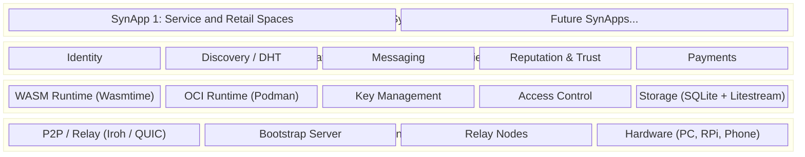

### Conceptual Entity Model

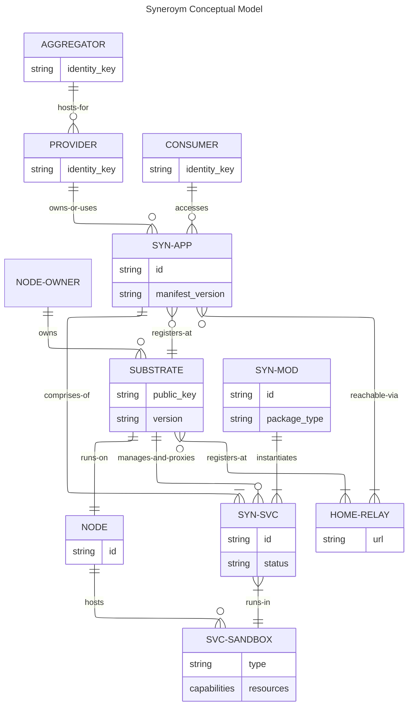

---

## Layer 1 — Infrastructure

### P2P Networking: Iroh

*Note: MVP focuses on connecting peers over IP. Future enhancements for heterogeneous networks (BLE, LoRa) are detailed in the [Connectivity Substrate](#connectivity-substrate-in-heterogeneous-networks) section.*

Direct QUIC (UDP) connections are attempted first. NAT/firewall fallback uses relay-mediated connections.

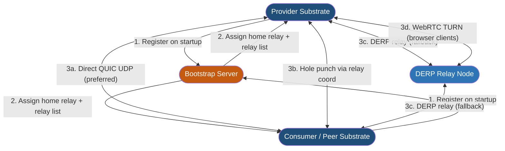

**Technology:** `iroh` (Rust crate) — provides QUIC transport, NAT hole punching, DERP relay, and peer discovery in a single library. `webrtc-rs` for browser clients via WebRTC Data Channels.

### Relay Node Architecture

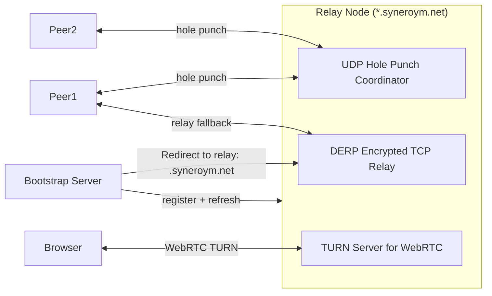

**Local DNS:** Each substrate caches relay hostname resolutions. This avoids hammering Bootstrap server for the large number of dynamically rotating relay nodes.

### Multi-Hop Relay (Federated Coordinator)

Implemented in the coordinator crates (`crates/coordinator_iroh`), not the substrate. Substrates are endpoints only; they never bridge network segments themselves. The `hop-relay` subsystem lives in the Coordinator and unifies Layer 7 preamble forwarding for Iroh with the existing WebRTC fallback relay.

A private, internet-unreachable substrate registers with a local Coordinator, which itself talks to the public Coordinator/Registry only on demand (outbound-only, no permanent tunnel). A caller resolves the target through the registry, opens a stream to the entry-point Coordinator carrying a preamble naming the real target, and the Coordinator forwards the stream to that target's local Coordinator over its own outbound connection — which is what lets a fully inbound-blocked substrate stay reachable. Endpoints then run their own end-to-end handshake inside the forwarded stream; the Coordinator relays encrypted bytes and cannot read them.

Full entities and step-by-step message flow: [Appendix: Multi-Hop Relay Walkthrough](#appendix-multi-hop-relay-walkthrough).

### Bootstrap Server & DHT Fallback

**Decentralised Bootstrap Fallback**

The bootstrap server is an operational dependency. To survive its unavailability:

1. The bootstrap server **mirrors its relay registry** as `pkarr` signed packets published to the BitTorrent DHT under a well-known namespace key (`syneroym-relays.<version>`)
2. Substrates **cache** the last-known relay list locally (TTL: 24 hours)
3. On bootstrap unavailability, substrates use the cached list, then fall back to DHT lookup via `pkarr`
4. A community governance key signs the DHT namespace — any sufficiently trusted community member can republish in an emergency

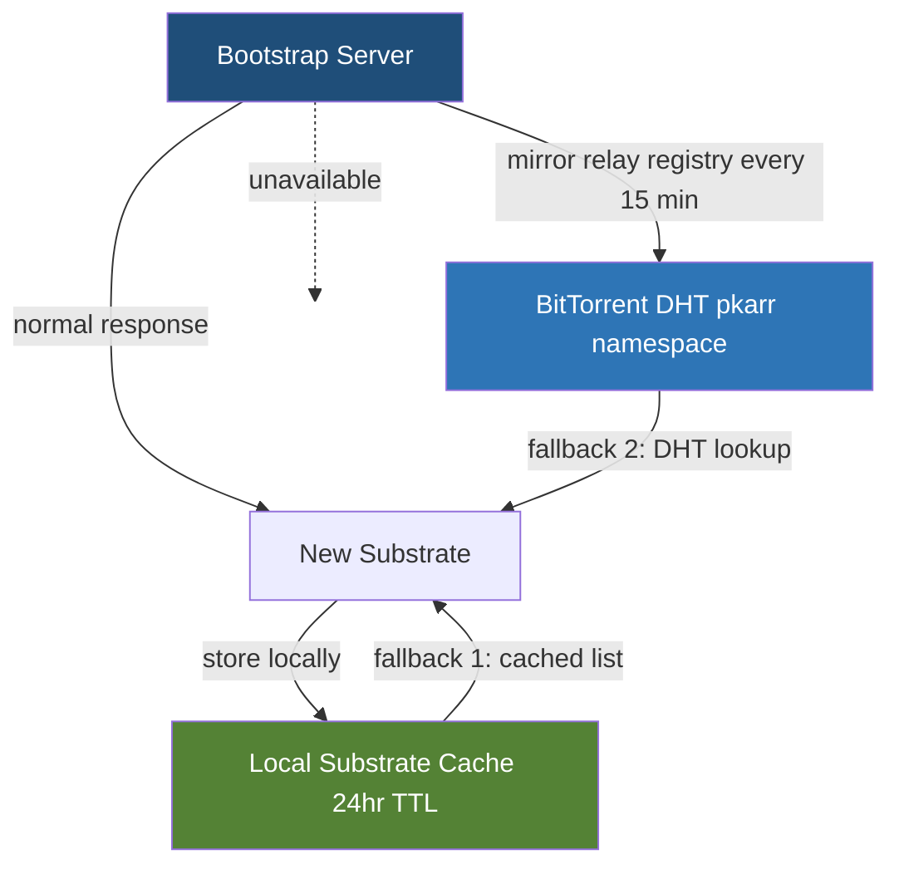

---

## Layer 2 — Substrate Runtime

### Substrate Internal Architecture

```mermaid
flowchart TD
    subgraph SUBSTRATE["SYN-SUBSTRATE (Rust / Tokio)"]
        direction TB
        
        subgraph INGRESS["Ingress / API Gateway"]
            WS[JSON-RPC over WebSocket for edge of WASM, say Browsers, CLI]
            wRPC[WASM component-component local or network calls]
            QUIC_EP[Iroh QUIC Endpoint]
            WRT[WebRTC Data Channel]
        end

        subgraph CORE["Core Services"]
            KM[Key Manager Ed25519 + Delegation]
            AC[Access Control Engine]
            MSG[Message Router]
            ORCH[Service Orchestrator Deploy / Lifecycle]
        end

        subgraph SANDBOX["Sandbox Environments"]
            WASM[Wasmtime WASM Component Runtime]
            OCI[Podman Rootless OCI Container Runtime]
        end

        subgraph STORAGE["Storage Layer"]
            CRSQL[SQLite (encrypted) Store]
            QUEUE[Offline Outbox Queue SQLite + Tokio channel]
            BLOB[Content-addressed Blob Store]
            LS[Litestream WAL Replication]
        end

        subgraph UTIL["Shared Utilities"]
            DISC[Matching Fabric Client]
            REP[Reputation Engine]
            PAY[Payment Adapter]
        end
    end

    INGRESS --> AC
    AC --> CORE
    CORE --> SANDBOX
    CORE --> STORAGE
    CORE --> UTIL
    STORAGE --> LS
    LS -->|"stream WAL"| BACKUP[(Backup Store S3-compatible / peer)]

    style SUBSTRATE fill:#f0f4f8,stroke:#1F4E79
    style INGRESS fill:#D6E4F0,stroke:#2E75B6
    style CORE fill:#D6E4F0,stroke:#2E75B6
    style SANDBOX fill:#E2EFDA,stroke:#548235
    style STORAGE fill:#FFF2CC,stroke:#BF9000
    style UTIL fill:#FCE4D6,stroke:#C55A11
```

### SynApp Packaging & API Pipeline

**Packaging**

```mermaid
flowchart LR
    WIT[WIT Interface Definition]
    WB[wit-bindgen Code Generator]
    RS[Rust SynApp Source]
    WASM_C[WASM Component .wasm]
    APP_SPEC[App Spec .toml manifest]
    SUB[Substrate Orchestrator]
    JRPC[JSON-RPC 2.0 External API (wRPC planned)]

    WIT -->|generates bindings| WB
    WB --> RS
    RS -->|"cargo component build"| WASM_C
    WASM_C --> APP_SPEC
    APP_SPEC -->|deploy| SUB
    SUB -->|derives automatically| JRPC

    style WIT fill:#1F4E79,color:#fff
    style JRPC fill:#2E75B6,color:#fff
```

**Migration Protocol and Backup Substrate Mechanism**
- `syneroym export --app <app-id>` produces a signed archive: SQLite snapshot + blob store + identity keypair (optional) + App Spec
- Archive is portable to any substrate running a compatible substrate version
- Import validates the archive signature and replays into a fresh SQLite instance
- **Torrent-Style Backup Pool:** Litestream continuous replication can keep a live replica on a secondary node. This is formalised into a "Backup Substrate" mutual pool model. Nodes allocate storage to host symmetrically encrypted backups of others in exchange for participating in the network's backup pool.
- **Active Failover:** In advanced configurations, a Backup Substrate can act as a hot standby, temporarily responding on a downed peer's behalf with cached state to ensure continuous discoverability.

### Storage & Write Arbitration

Structured data lives in one encrypted SQLite database per service (`rusqlite` + `sqlcipher`), single-writer / multi-reader. There is exactly one writer per service at a time — a replica stays read-only until an operator promotes it (`[PLT-RED]`). Two writers never touch the same database concurrently, so there is nothing to merge at the storage layer.

What looks like a "conflict" is really two requests racing to reach the single writer. The writer serializes them and applies a business-level arbitration rule per entity:

| Entity | Arbitration Rule | Rationale |
|---|---|---|
| Order state | Provider action beats a same-instant consumer action; otherwise first request wins | Provider has operational authority over their service |
| Catalog item | Last write wins per field | Catalog is provider-owned; no concurrent consumer writes |
| Message | Append-only log; no arbitration needed | Messages are immutable once sent |
| Booking slot | First confirmed reservation wins; later requests for the same slot are rejected | Prevents double-booking |
| Reputation record | Append-only; signed by issuer | Records are immutable attestations |
| Access control policy | Provider's write wins; infrastructure provider cannot override | Data sovereignty |

A disconnected client (secondary device, mobile app, offline peer) is not a second writer — it is a client whose requests queue locally and replay against the single writer on reconnect, via the standard offline outbox (`[PLT-ASY]`), guarded by idempotency keys. See [Multi-Device Sync](#multi-device-sync-and-sharded-deployment).

### Multi-Device Sync and Sharded Deployment

This section addresses two requirements: app sync across secondary provider devices and app sharding across multiple hosts.

**A) Multi-device sync (primary + secondary provider devices)**

- A secondary provider device is a client of the primary service, not a second writer to its database.
- Requests made offline queue in the device's local outbox (`[PLT-ASY]`), each tagged with an idempotency key.
- On reconnection, queued requests replay against the single writer, which applies the arbitration rules from [Storage & Write Arbitration](#storage--write-arbitration).
- Operational ownership (for example, order lifecycle authority) stays deterministic because there is one writer, not because of a merge step.

**B) Sharded SynApp deployment (single app across multiple hosts)**

- App Spec supports per-component placement constraints, allowing components to run on distinct nodes.
- The substrate orchestrator schedules components based on declared resource class (`cpu`, `memory`, `gpu`, locality tags).
- Inter-shard communication uses substrate-authenticated service identities over QUIC/WebSocket.
- Failure of one shard does not halt unrelated shards; dependent workflows move to queued/retry mode until dependencies recover.

Example placement:

- `catalog-browser` + `space-manager` on low-cost edge node
- `order-engine` + `payment-adapter` on higher-availability node
- `drm-content-server` on storage-optimised node

### Substrate API Surfaces

To support diverse caller types (WASM components, peer substrates, CLI, browsers, external integrations), the substrate exposes **two API surfaces, both derived from identical WIT definitions**:

- **wRPC surface** — for WASM SynApp components (intra-substrate) and peer substrates (cross-node over Iroh QUIC), CLI. WIT types are preserved end-to-end; zero serialization overhead.
- **JSON-RPC 2.0 surface** — for browsers and third-party integrations, the provider status UI, and third-party integrations. Derived automatically from WIT; documented as an OpenRPC schema.

---

## Layer 3 — Shared Substrate Utilities

### Identity

The system implements a **Three-Tier Identity Architecture** to decouple the persistent, high-trust root identity from ephemeral day-to-day operations.

1. **Government Identity (Optional):** Pure physical data with a state signature, verified via a Zero-Knowledge Proof (Method B).
2. **Master Key (DID):** A persistent `did:key` (Ed25519) stored securely (encrypted local file or OS enclave). Used strictly to issue `Verifiable Credential Bonds` tying the Master Key to the National ID (or acting as a self-sovereign root) and issuing delegation/revocation certificates.
3. **Temporary Key (DID):** A short-lived (e.g., 3-month) `did:key` (Ed25519). **This Temporary Key acts as the primary `NodeId` routing index in the DHT (pkarr).**

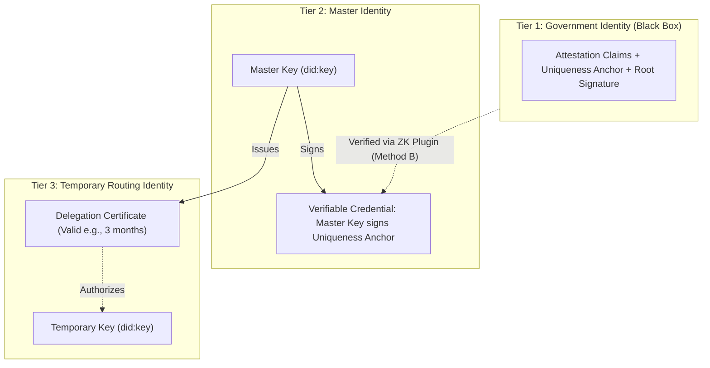

#### Cryptographic Delegation (Method A)
For standard operations, the Master Key issues a "Delegation Certificate" to a generated Temporary Key. Handshakes (e.g., `verifyAndDeriveSharedSecret`) validate this chain:
1. Did the Temporary Key sign the active request?
2. Did the Master Key authorize this Temporary Key?
3. (Optional) Is the Master Key bound to a verified National ID?

#### Zero-Knowledge Architecture (Method B)
To prove National ID bindings without revealing the DID or Uniqueness Anchor, the substrate utilizes an **Optional ZK Runtime Plugin** (WASM-based). 
- It accepts the National ID file, root signature, Master Key, and Temporary Key (as Public Input) into a dynamic proving scheme (e.g., `anon-aadhaar` downloaded on demand).
- Verifiers check the output proof string against public parameters.

#### Identity Resolution & Revocation (The Master Anchor)
To maintain strict security without modifying standard DHT signature mechanics (BEP 44), the **Master Key acts as the persistent anchor**. Both keys utilize standard `pkarr` DHT records signed by their respective private keys.

**Master Anchor Payload Schema:**
The Master Key DHT payload is stored in the `pkarr` TXT record as a JSON-encoded string:
```json
{
  "schema": "master_anchor_v1",
  "temporary_keys": [
    "did:key:z6Mkt...",
    "did:key:z6Mku..."
  ],
  "timestamp": 1690000000
}
```

**Secure Resolution Flow:**
1. **Registry Lookup:** A client queries the Community/App Registry for a Logical Service Name. The registry returns the **Master Key DID** that owns the service.
2. **Authorization Check (DHT):** The client looks up `pkarr:<Master Key DID>`. The client parses the JSON payload and validates the schema, extracting the array of authorized, active **Temporary Key DIDs** (representing the user's active devices/servers).
3. **Routing Lookup (DHT):** The client finds the matching Temporary Key in the array, looks up `pkarr:<Temporary Key DID>`, and retrieves the actual IP/Relay endpoints.

**Passive Revocation:**
If a Temporary Key is compromised (e.g., a stolen laptop), the Master Key updates its own DHT record array to omit the compromised key. 
- The compromised key's individual `pkarr` record might technically still exist in the DHT, but **clients will instantly reject it** because it is no longer authorized by the Master Anchor.
- Dependent clients with cached routes perform a "Refresh-on-Failure" lookup: they query the Master Key again, see the new authorized Temporary Key, and securely reconnect.

**Master Key Compromise (Tier 1 Fallback):**
If the Master Key itself is compromised, the true user falls back to **Tier 1 (The Physical Identity)**. 
- Because an attacker possesses the digital `did:key` but not the physical identity card (e.g., the NFC chip on an e-passport or Aadhaar biometrics), the attacker cannot generate a fresh ZK Proof.
- The user generates a *new* Master Key and binds it to the same Uniqueness Anchor by creating a new Verifiable Credential Bond (or ZK Proof) that includes a modern timestamp/epoch. 
- The Community Registry and network resolve conflicts by always trusting the Master Key that provides the most recent, cryptographically valid ZK Proof tied to the physical Uniqueness Anchor. 
- **Orphaned DHT Records:** The attacker's compromised Master Key will technically still maintain its `pkarr` DHT record. However, this record becomes entirely orphaned and irrelevant because the higher-level routing layers (e.g., the Community Registry, peer contact lists) update their internal pointers to resolve the Logical Service/Identity exclusively to the *new* Master Key. This effectively severs the attacker's access and re-establishes the new Master Key as the anchor without needing to "delete" the old DHT entry.

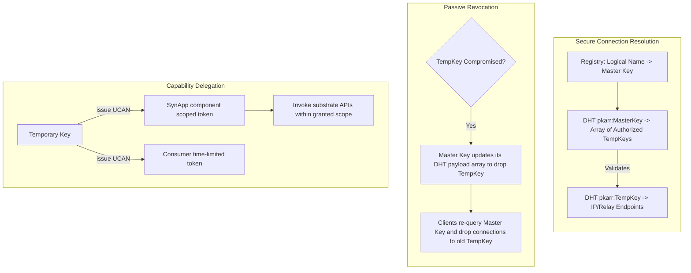

---

## Layer 3 — Shared Substrate Utilities

### Discovery & Matching

**Relay Discovery:** BEP 0044 Mainline DHT (via `pkarr`) resolves node/relay endpoints only — identity-to-route lookups, not catalog search.

**Catalog Matching:** Adapted from the [Distributed Matching Fabric](https://github.com/syneroym/foundation/blob/main/ideas/multi-surface-matching-fabric-ux.md#syneroym-distributed-matching-fabric). Providers publish signed Publications (listings, intents, capabilities). Indexes are distributed caches, never authoritative. Clients verify every result — signature, timestamp, expiry — before trusting it.

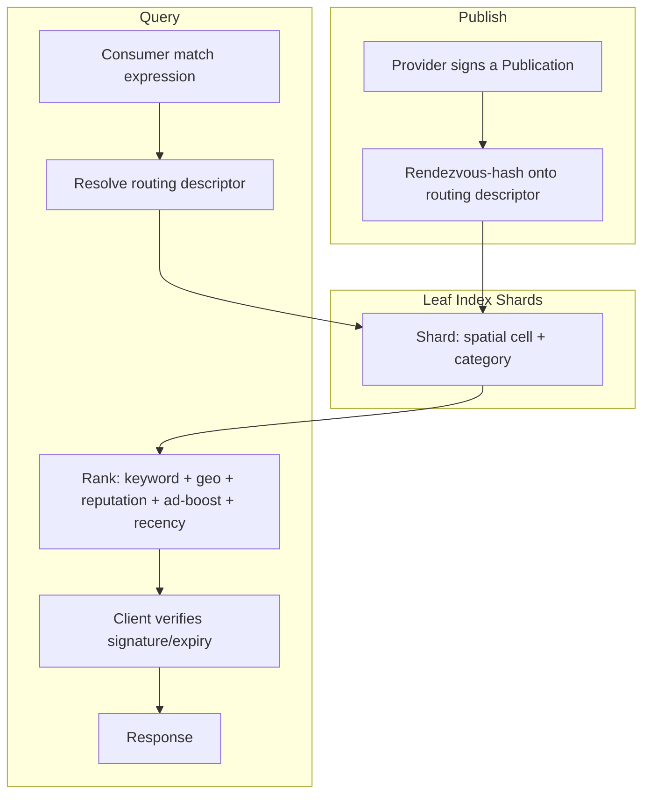

**Placement:** a protocol-defined Routing Schema (spatial cell, category, ...) plus rendezvous hashing maps each Publication deterministically onto leaf index shards. Providers compute their own placement; no coordinator needed.

**Ranking:** transparent weighted formula (keyword relevance, geo proximity, reputation, ad-boost, recency). Weights are published open-source; ad-boost is capped at 0.3.

**M8 ships:** Publications, one or two routing dimensions (spatial + category), flat leaf-shard lookup, client-side verification — enough for real cross-cluster federation.

**Additive, later:** a hierarchical synopsis tree and query planner (worth it only once leaf-shard count makes fan-out expensive), composite routing descriptors, cross-shard ranking, adaptive fan-out. None of these require reworking the Publication format or placement contract once M8 ships it.

### Messaging

```mermaid
flowchart TD
    subgraph MSG_TYPES["Message Types"]
        direction LR
        M1[1-to-1 Chat X3DH + Double Ratchet]
        M2[Group Chat / Threads MLS RFC 9420]
        M3[Structured Service Msgs e.g. booking request]
        M4[Collaborative Editing (optional, later)]
    end

    subgraph E2E["1-to-1 E2E Encryption"]
        direction LR
        S[Sender] -->|"1. fetch receiver prekey bundle"| DHT2[DHT / Identity Doc]
        DHT2 -->|"2. X3DH key agreement"| X3DH[Shared Secret]
        X3DH -->|"3. init Double Ratchet"| DR[Ratchet State]
        DR -->|"4. encrypt message"| ENV[Signed Envelope]
        ENV -->|"5. route via Iroh"| R_NODE[Relay / Direct]
        R_NODE -->|"6. deliver + decrypt"| REC[Receiver]
    end

    subgraph STORAGE_MSG["Message Storage"]
        CR[SQLite append-only message log]
        CR -->|"offline: outbox queue locally"| Q2[Offline Outbox Queue]
        Q2 -->|"on reconnect: replay & retry"| PEER[Peer substrate]
    end
```

**Libraries:** `libsignal-protocol-rust` for X3DH + Double Ratchet; `openmls` (Rust) for MLS group messaging.

### Trust & Reputation

**Reputation:** Replaces global average ratings with network-gated trust signals and transactional proofs.

- **Network-Gated Ratings:** A provider's rating is only visible to consumers sharing a trust path in the vouch graph. This prevents rating inflation and fake reviews from strangers, reflecting real-world community trust. (Note: May present a cold-start challenge for consumers with thin networks).
- **Transactional Proof:** Displays verified transaction counts and repeat customer rates instead of subjective ratings. Both parties must sign the transaction record, providing a strong, verifiable signal.

**Trust, vouching, credentials, reputation portability, and anti-gaming**

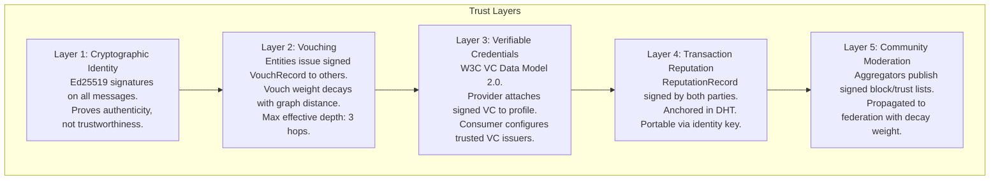

**Vouching mechanics:**

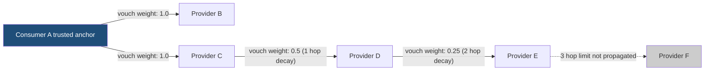

**Vouch weight formula:** `effective_weight = base_weight × decay_factor^hop_count`  
Default `decay_factor = 0.5`. Max effective depth: 3 hops (weight < 0.125 beyond this is ignored).

**Sybil resistance mechanisms:**
1. **Stake requirement:** To issue a vouch with weight > 0.5, the issuer must have ≥ 5 completed transactions with positive reputation in their own history
2. **Rate limiting:** Max 10 new vouches issued per 30-day window per identity
3. **Reputation anchoring:** Reputation records require both-party signatures — a provider cannot self-generate fake transaction history
4. **Community moderation override:** Aggregator block lists can zero out reputation from known Sybil clusters

**Anti-gaming (discovery ranking):**
- Ad boost is capped at `w4_max = 0.3` of total score — organic signals always dominate
- Keyword stuffing is mitigated by TF-IDF scoring on index entries (raw keyword count is not used)
- Review bombing detection: reputation score uses a Bayesian average with a prior of 3.5/5.0 and minimum 5 reviews before score is published

**Reputation portability:** A provider migrating substrates republishes their `ReputationRecord` collection (each record is independently signed by both parties) to the DHT under their existing identity key. No loss of history.

### Payments

**Payment Strategy (MVP):** MVP focuses on redirection to external payment flows (e.g., UPI deep links) or out-of-band settlement. Verification is offline-delayed. Fully integrated payment gateways are sequenced in later, to minimize centralized dependencies initially.

**Payment rails and credit/coin direction**

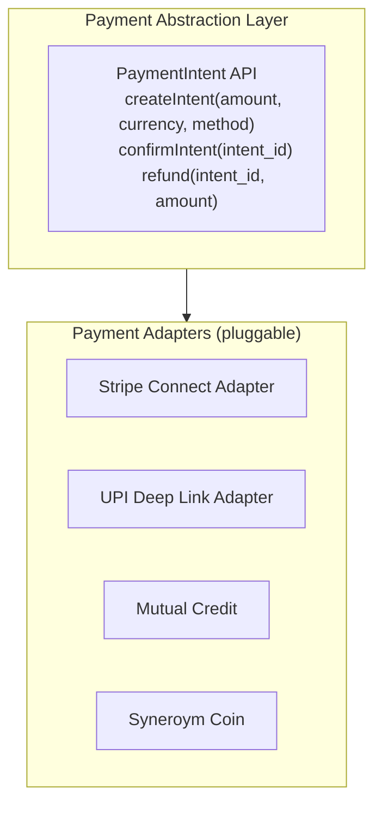

Escrow and dispute-mediated fund custody are deferred; see [Decentralized Escrow & Dispute Resolution](#6-decentralized-escrow--dispute-resolution) in Phase 6.

**Mutual credit (layers onto the Payment Abstraction Layer above; legal review required before rollout):** A bilateral IOU system where providers and consumers issue credits to each other denominated in a local unit. No external currency is required. Each credit line is a signed ledger between two parties; the substrate mediates settlement. Regulatory classification varies by jurisdiction.

**Syneroym Coin (layers onto the same abstraction; legal review required before launch):** Internal ledger token (not a cryptocurrency or blockchain-based token) managed by a community governance multi-sig. Used for ecosystem incentives and cross-aggregator settlement.

---

## Layer 4 — SynApp Specifications

### SynApp 1: Business, Professional & Retail Spaces
Domain processes, protocols, and workflows for this SynApp are adapted from the Beckn Protocol for a peer-to-peer topology. Reference the protocol specifications here.

#### Component Architecture

```mermaid
flowchart TD
    subgraph CONSUMER_SIDE["Consumer Side"]
        PWA[Tauri Frontend or PWA]
    end

    subgraph PROVIDER_SUBSTRATE["Provider Substrate"]
        GW[JSON-RPC Gateway (wRPC planned)]
        
        subgraph WASM_COMPONENTS["WASM Components"]
            SM[space-manager]
            CB[catalog-browser]
            OE[order-engine]
            BS2[booking-scheduler]
            PA[payment-adapter]
            ND[notification-dispatcher]
            RE[review-engine]
        end

        subgraph OCI_SERVICES["OCI Services"]
            DRM[drm-content-server Shaka Player backend]
        end

        subgraph SHARED["Shared Substrate Services"]
            DISC2[Discovery]
            MSG2[Messaging]
            AC2[Access Control]
            STORE[SQLite Store]
        end
    end

    PWA -->|"JSON-RPC / WebSocket"| GW
    GW --> SM & CB & OE & ND & RE
    OE --> BS2 & PA
    OE --> STORE
    SM --> DISC2
    CB --> DISC2
    RE --> SHARED
    DRM -->|"content delivery"| PWA

    style CONSUMER_SIDE fill:#D6E4F0,stroke:#2E75B6
    style PROVIDER_SUBSTRATE fill:#E2EFDA,stroke:#548235
```

#### Order State Machine

**Order conflict resolution rules**

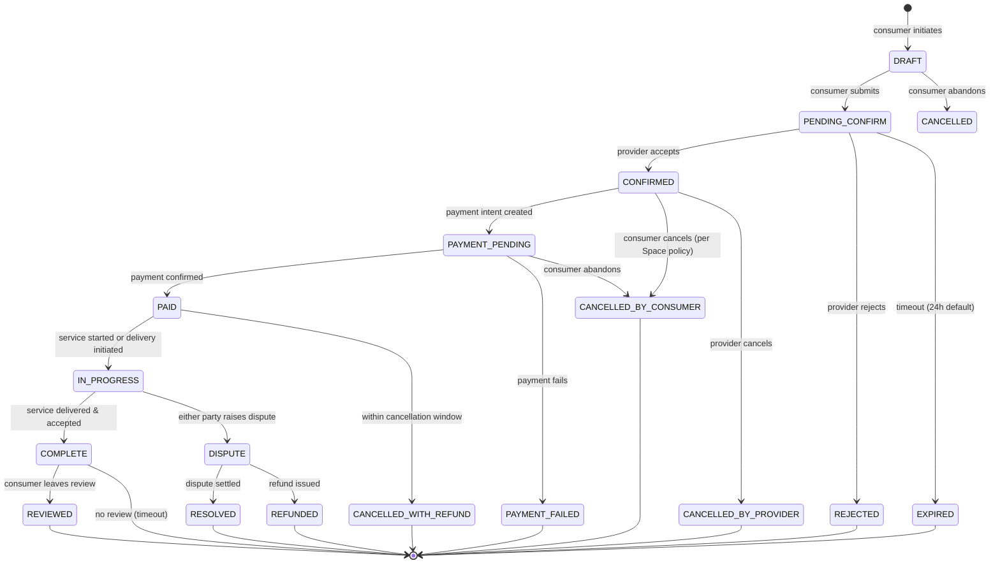

**Order state conflict rules (single writer arbitrates):**
- Provider cancel and consumer cancel both pending for the same order → **Provider takes precedence** (provider has operational authority), regardless of arrival order; refund triggered
- Provider confirm and consumer cancel both pending → **Consumer wins** (consumer initiated the cancellation workflow first); no charge
- Both parties record progress on the same in-progress order → the writer applies each update as it arrives; independent sub-steps naturally accumulate. Steps that genuinely conflict require manual resolution

#### Consumer Transaction Flow

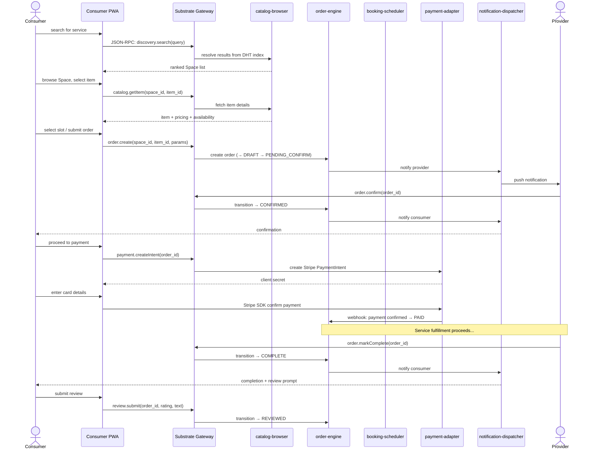

#### Recommendation Algorithm

**Recommendation algorithm**

Catalog recommendations are **client-side only** — no consumer query data is sent to third parties.

```
score(item, consumer_context) =
    0.4 × collaborative_signal     // items frequently co-viewed/co-ordered by similar consumers (local cluster only)
  + 0.3 × semantic_similarity      // embedding distance between item description and consumer's session query history
  + 0.2 × provider_reputation      // normalised reputation score of Space
  + 0.1 × recency                  // freshness of catalog entry
```

Consumer session context (query history, viewed items) is kept **only in local app storage**, never transmitted. Collaborative signals are computed from **aggregate anonymised counts** published by the provider substrate — no individual consumer data leaves their device.

**Key differences from SynApp 1:**
- Adds `delivery-engine` and `tracking-service` components
- Order state machine includes `PREPARING`, `OUT_FOR_DELIVERY`, `DELIVERED` sub-states within `IN_PROGRESS`

---

## Federation Architecture

### Cross-Substrate Discovery Flow

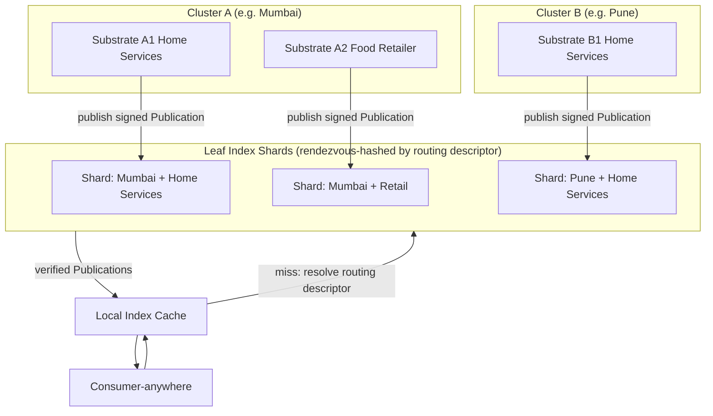

### Minimum Federation Contract

A third-party SynApp is federation-compatible if it implements:

1. **Identity:** Ed25519 keypair; identity doc in DHT
2. **Discovery:** Publishes signed Publications conforming to the shared Publication schema, placed per the protocol Routing Schema
3. **Messaging:** Accepts structured substrate messages typed with shared WIT interfaces
4. **Reputation:** Generates `ReputationRecord` conforming to the shared schema on transaction completion
5. **Portability:** Exports data in the documented `SynExport` archive format

No central coordinator is required — these are convention-based contracts enforced by schema validation.


---

## Consumer Experience Architecture

### Consumer App Architecture

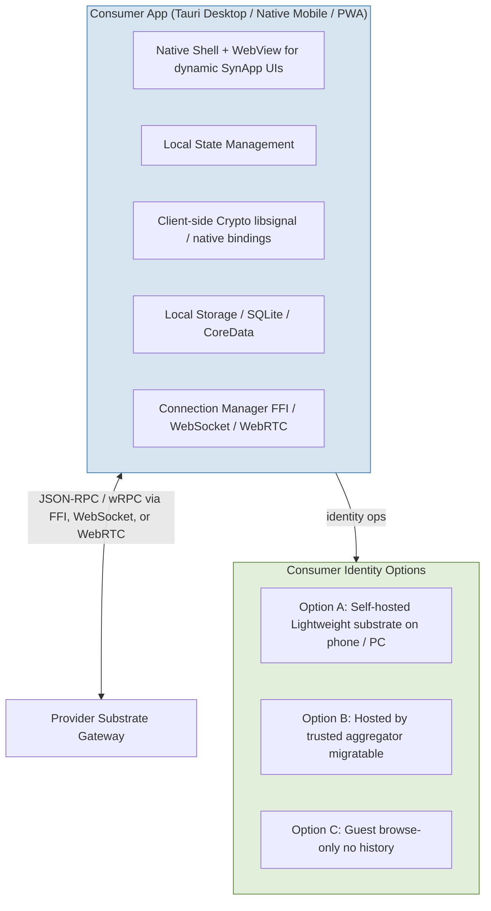

---

## Observability Architecture

### Design Philosophy

Observability in Syneroym is tailored for two audiences: **non-technical providers** (business health) and **support staff/developers** (technical diagnostics).

The substrate provides **instrumentation primitives, not bundled observability stacks**. It emits open-format signals that operators can route to their chosen backends. No external observability service is required to operate a substrate.

### Instrumentation Layer (All Tiers)

All instrumentation is in-process, zero-cost when unused, and based on open facades:

- **Tracing:** `tracing` crate (Rust). Structured spans and events at every component boundary, substrate hop, and async I/O point. A correlation `trace_id` generated at the client app flows through every wRPC call, queue entry, and cross-substrate message — enabling full reconstruction of any user action across nodes.
- **Metrics:** `metrics` crate facade. Key signals: order state transitions, queue depth and age, relay connection stability, merge conflict rate, component restart count. Default backend: in-process circular buffer. Operators attach external backends (Prometheus, VictoriaMetrics) by configuration.
- **Logs:** `tracing-subscriber` emitting structured JSON to a rotating local file. Human-readable with `jq`; parseable by any log tool. No external sink by default.
- **In-process ring buffer:** Retains the last N spans and metric snapshots in memory. Queryable via the substrate health API without any external tool. The primary observability interface for Tier 1 nodes.

### The `health-narrator` Component

The translation layer between raw instrumentation and provider-facing experience. A lightweight WASM component deployed as part of the substrate core that:

- Subscribes to the substrate event stream
- Maintains a rolling 7-day **plain-language event timeline** in SQLite — human-readable records generated from structured log events via templates (e.g. *"Order #47 confirmed"*, *"Connection to relay lost"*)
- Evaluates a small set of health rules producing a simple `HealthState`: Connection / Payments / Sync — each Good, Degraded, or Offline with a plain-language explanation
- Sends proactive alerts via the notification dispatcher when health degrades
- Generates **diagnostic bundles** on demand: a signed, sanitized snapshot of recent timeline events, metric snapshots, substrate version and configuration — formatted for handoff to support staff

### Provider-Facing Status UI

Built into the substrate's own HTTP server as a static HTML page (assets bundled into the binary, no external process). Accessible at `http://localhost:8080/admin`. Shows:

- A single honest top-level status: *Your shop is open and reachable*
- Last booking time and today's order counts — business-level signals, not technical ones
- Three plain-language health indicators: Connection / Payments / Sync
- Proactive alert banners with plain-language explanations and suggested actions
- A **Get Help** button that generates and sends a diagnostic bundle to the provider's support contact via the substrate messaging layer — one tap, no technical knowledge required

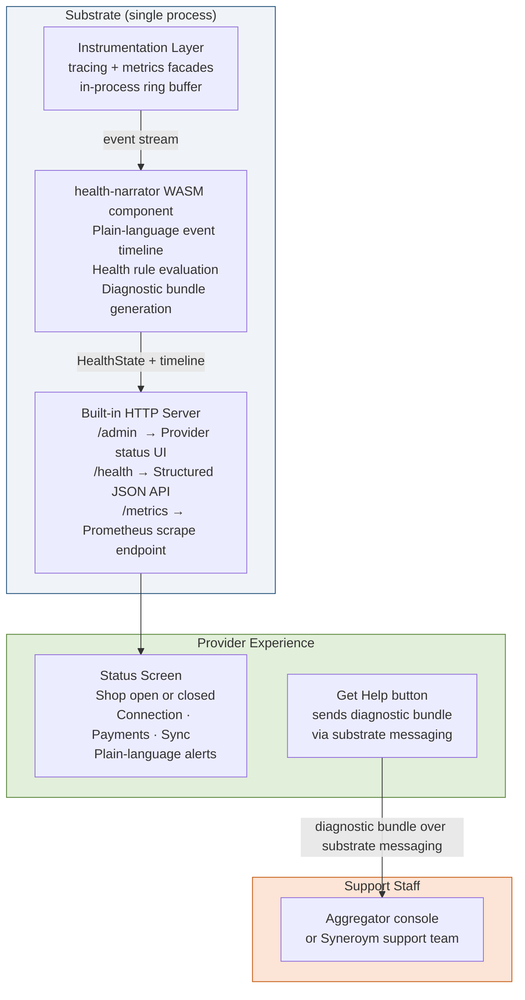

### Tiered Observability Stack

| Tier | What Ships | Notes |
|---|---|---|
| **Tier 1** — Mobile / RPi | In-process instrumentation + ring buffer + health-narrator + built-in HTML status UI | No external process; zero additional footprint |
| **Tier 2** — Standard node | All of Tier 1 + optional bundled OCI stack | One-command enable; auto-profile selection based on hardware tier |
| **Tier 3** — Distributed / Aggregator | All of Tier 2 + Tempo traces + support console + managed-node aggregation | Full stack; primary interface for support staff |

**Bundled OCI stack (Tier 2+, disabled by default):** Grafana OSS + VictoriaMetrics + Loki + Promtail. All single binaries, self-hosted, low-resource. Enabled via `syneroym observability enable`. Pre-built Syneroym dashboard JSON for core substrate and SynApp metrics provisioned automatically on enable.

**Aggregator as support console:** The aggregator's Grafana instance is the primary diagnostic tool for support staff. Diagnostic bundles from managed providers arrive via substrate messaging as structured reports. Deeper diagnostics can be pulled from any managed node with provider consent, enforced by access-control policy.

**Tier 1 under aggregator:** A mobile or RPi node operating under an aggregator forwards its metrics scrape endpoint and log stream to the aggregator's bundled stack. The provider gets full dashboard visibility via the aggregator without running any stack locally.

### Simulation Testing and Replay Validation

The substrate ships a **multi-node simulation harness** used during development and CI:

- Runs N substrate instances in a single test binary with a controllable fake network
- Induces partitions, delays, and node restarts deterministically
- Every arbitration rule in [Storage & Write Arbitration](#storage--write-arbitration) has a corresponding simulation scenario verifying the deterministic outcome
- Property-based tests (`proptest`) verify outbox replay is idempotent for arbitrary request orderings and retries
- Simulation output carries the same `trace_id` correlation used in production — failures are immediately diagnosable from the trace

The harness is built during the walking skeleton stage and extended with each new component. It is the primary validation tool for offline and reconnect behavior before it reaches a real provider's device.

## Security Architecture

### Encryption at Every Layer

```mermaid
flowchart TD
    subgraph TRANSPORT["Transport Encryption"]
        T1[Node-to-node: QUIC TLS 1.3 via Iroh]
        T2[DERP relay: additional AES-256-GCM envelope]
        T3[Browser-to-service: WebRTC DTLS-SRTP or TLS over WebSocket]
    end

    subgraph MESSAGING_ENC["Messaging Encryption"]
        M1[1-to-1 chat: X3DH + Double Ratchet libsignal-protocol-rust]
        M2[Group chat: MLS RFC 9420 openmls]
        M3[Structured service msgs: signed envelope Ed25519 + payload encryption]
    end

    subgraph AT_REST["Data at Rest"]
        R1[Sensitive fields: AES-256-GCM key held by data owner]
        R2[Litestream backups: encrypted with provider key before upload]
        R3[Blob store: content-addressed optionally encrypted]
    end
```

### Substrate Integrity & Remote Attestation

In the "uncontrolled cloud" model, ensuring that a substrate is running the expected, uncompromised binary is achieved using **Remote Attestation**. Because the ecosystem spans different hardware tiers, the substrate abstracts hardware differences via a unified native RPC endpoint.

#### The Universal Attestation Endpoint
The Substrate exposes a core native endpoint (e.g., `substrate.attest(nonce)`) over its wRPC/JSON-RPC interface. Depending on the physical hardware, it returns a polymorphic **Attestation Quote**:
- **`Tpm20`**: For Linux/Windows PCs and Raspberry Pis equipped with a TPM 2.0 module. Contains a hardware-signed quote of the OS Measurement Log (e.g., Linux IMA).
- **`AndroidKeyAttestation`**: For Android phones. Uses ARM TrustZone or Titan M chips to provide a Google-signed certificate chain that includes the hardware-verified hash of the Syneroym APK.
- **`AppleAppAttest`**: For iOS/Mac devices. Uses the Secure Enclave to cryptographically prove it is a genuine Apple device running an untampered version of the Syneroym App.

#### Verification Flow
1. **The Challenge**: When the Service Deployer (or Service Owner) deploys a service or is asked to unlock the database upon a node restart, they send a cryptographically secure random `nonce` to the `substrate.attest` endpoint.
2. **The Quote**: The substrate determines its hardware type, asks the local security chip to sign the `nonce` and the current software state, and returns the appropriate Quote type.
3. **Verification & Key Release**: The deployer receives the Quote, checks the type, and runs the corresponding verification logic (verifying the TPM PCRs, or the Google/Apple certificate chains). Only if the hardware mathematically proves the correct, unmodified Syneroym binary is running does the deployer release the encryption key over the network.
4. **Periodic Auditing**: The deployer can periodically re-challenge the substrate with a new `nonce` to continuously verify the node has not been tampered with while running.

### Isolation Guarantees

```mermaid
flowchart TD
    subgraph NODE2["NODE (physical machine)"]
        subgraph APP1["SynApp 1 (WASM sandbox)"]
            W1[WASM Component WASI capability-limited]
            DB1[(SQLite App 1 only)]
        end

        subgraph APP2["SynApp 2 (Podman container)"]
            P1[OCI Container rootless, non-root user]
            DB2[(SQLite App 2 only)]
        end

        subgraph APP3["SynApp 2 (WASM sandbox)"]
            W2[WASM Component WASI capability-limited]
            DB2[(SQLite App 2 only)]
        end

        subgraph SUBSTRATE_CORE["Substrate Core"]
            AC3[Access Control Engine enforces all cross-app access]
            MSG4[Message Router no cross-app ambient access]
        end
    end

    APP1 <-->|"direct access after substrate-vetted initialization"| APP3
    APP1 <-->|"explicit substrate-mediated API calls only"| SUBSTRATE_CORE
    APP2 <-->|"explicit substrate-mediated API calls only"| SUBSTRATE_CORE
    APP1 -. "no direct access" .-> APP2
    APP2 -. "no direct access" .-> APP1

    style APP1 fill:#E2EFDA,stroke:#548235
    style APP2 fill:#FCE4D6,stroke:#C55A11
    style APP3 fill:#E2EFDA,stroke:#548235
    style SUBSTRATE_CORE fill:#D6E4F0,stroke:#2E75B6
```

---

## Resolved Architecture TBD Items

This section is an index of every `[TBD]` marker in the requirements spec, that need to be revisited and finalized.

| # | TBD Item (from requirements spec) | Resolution | Section |
|---|---|---|---|
| 1 | Migration protocol | Signed `SynExport` archive; SQLite snapshot + blob store + App Spec; `syneroym export/import` CLI | [SynApp Packaging & API Pipeline](#synapp-packaging--api-pipeline) |
| 2 | Backup mechanism | Litestream WAL streaming to S3-compatible or peer node; continuous or on-demand | [SynApp Packaging & API Pipeline](#synapp-packaging--api-pipeline) |
| 3 | Storage conflict model | Single writer per service (SQLite); arbitration rules per entity type, not CRDT merge | [Storage & Write Arbitration](#storage--write-arbitration) |
| 4 | Conflict resolution rules per entity type | Arbitration table per entity type; order conflicts favour provider authority | [Storage & Write Arbitration](#storage--write-arbitration) |
| 5 | Vouching mechanics and weighting | Signed VouchRecord; weight = `base × 0.5^hops`; max depth 3; stake requirement for high-weight vouches | [Trust & Reputation](#trust--reputation) |
| 6 | Credential format and verification | W3C VC Data Model 2.0; `didkit` for issuance/verification; consumer configures trusted issuers | [Trust & Reputation](#trust--reputation) |
| 7 | Reputation portability mechanism | Both-party signed `ReputationRecord` anchored in DHT; portable by republishing under same identity key | [Trust & Reputation](#trust--reputation) |
| 8 | Propagation protocol (community moderation) | Signed block/trust lists; propagated via DHT with decay weight; aggregators are authoritative for their cluster | [Trust & Reputation](#trust--reputation) |
| 9 | Anti-gaming mechanisms | Bayesian reputation average; ad boost cap; TF-IDF keyword scoring; review bomb detection | [Trust & Reputation](#trust--reputation) |
| 10 | Sybil resistance | Stake requirement for vouching; rate limiting; both-party signature on reputation records | [Trust & Reputation](#trust--reputation) |
| 11 | Payment rails and escrow | Out-of-band settlement / UPI redirection ships first; pluggable adapter pattern extends it without rework | [Payments](#payments) |
| 12 | Coin and mutual credit mechanics | Bilateral signed IOU ledger and Syneroym internal ledger token, sequenced after core payments; no blockchain; both need legal review before launch | [Payments](#payments) |
| 13 | Recommendation algorithm | Client-side scoring formula; no consumer data transmitted; collaborative signals from anonymised aggregates | [Recommendation Algorithm](#recommendation-algorithm) |
| 14 | Discovery partitioning and consistency model | Publications placed via protocol routing schema + rendezvous hashing onto leaf index shards; client-verified, cache-only indexes | [Discovery & Matching](#discovery--matching) |
| 15 | Discovery ranking algorithm | Transparent weighted formula (5 signals); ad boost capped at 0.3; formula published open-source | [Discovery & Matching](#discovery--matching) |
| 16 | Decentralised bootstrap fallback | pkarr signed packets mirrored to BitTorrent DHT; 24h local cache; community governance key | [Bootstrap Server & DHT Fallback](#bootstrap-server--dht-fallback) |
| 17 | Ad auction mechanics and placement limits | Ad boost is a `[0.0–0.3]` float on the Publication; no auction in MVP; elevated placement within local cluster only | [Discovery & Matching](#discovery--matching) |

---

## Appendix: Multi-Hop Relay Walkthrough

Full detail behind [Multi-Hop Relay (Federated Coordinator)](#multi-hop-relay-federated-coordinator), kept here for implementers working on the coordinator; the summary there is enough for everyone else.

#### Scenario Entities

*   **Public Infrastructure (Internet)**
    *   **C**: Global Coordinator (acting as public DERP/TURN relay, and public `hop-relay`).
    *   **R**: Global Registry (community registry, future DHT).
*   **Public/External Edge**
    *   **Sx**: Substrate with outbound internet access.
    *   **Ax**: Synapp deployed on **Sx**.
*   **Private Subnetwork Infrastructure**
    *   **Cp**: Private Coordinator (local relay). Acts as the `hop-relay` for the private network.
    *   **Rp**: Private Registry (community registry). Connects outbound to **R** to gossip records.
    *   **Sz**: Hidden Substrate. Resides purely in the private network with no external internet access.
    *   **Az**: Synapp deployed on **Sz**.

#### 1. Startup and Configuration

1.  **Public Infrastructure Starts**: Coordinator **C** and Registry **R** are brought online on the public internet.
2.  **Private Infrastructure Starts**: 
    *   Coordinator **Cp** and Registry **Rp** are brought online within the private subnetwork.
    *   **Cp** exposes a lightweight HTTP discovery endpoint (e.g., `/v1/info`) that serves its Iroh Node ID and relay configuration.
    *   **Cp** also registers itself in the global Registry **R** as an available coordinator (controlled by a configuration switch to share its record).
    *   **Cp** does *not* maintain a permanent connection to **C**. It connects outbound to the public Coordinator **C** on-demand only when data transfer is needed.
    *   **Rp** is configured with **R** as its parent registry so it can query and publish records upward.
3.  **External Substrate (Sx) Starts**: 
    *   **Sx** connects outbound to Coordinator **C** and Registry **R**. 
4.  **Hidden Substrate (Sz) Starts**: 
    *   **Sz** starts in the private network and connects to its local Registry (**Rp**).
    *   To find a local coordinator, **Sz** first checks its config for a direct `discovery_url` (fetching the Iroh connection details via HTTP). If not provided, it queries its local Registry **Rp** (which forwards the lookup to **R**) to discover available coordinators. It dynamically selects one (e.g., **Cp**) and caches its Iroh details.

#### 2. Registry Entries at Deployment

1.  **Ax Deployment**: 
    *   Synapp **Ax** is deployed on **Sx**. 
    *   The deployer of **Ax** (using `SyneroymClient::deploy_wasm`) generates a signed service record and publishes it directly to the global Registry **R**.
2.  **Az and Sz Deployment**: 
    *   Synapp **Az** is deployed on the hidden substrate **Sz**.
    *   The substrate **Sz** registers itself and its services (**Az**) with the local Registry **Rp**.
3.  **Cp Registration**: 
    *   The private Coordinator **Cp** registers its Iroh key and connection details (like relay endpoints) into the global Registry (**R**), assuming its configuration switch is set to share its record. This makes its Iroh endpoint dynamically discoverable for substrates relying on registry lookups.
4.  **Upward Gossip**: 
    *   **Rp** gossips the registration of both **Az** and **Sz** upward to the global Registry **R**.
5.  **Global Record State**: 
    *   The global Registry **R** now holds public records for **Az** and **Sz**. 
    *   Because **Az** is deployed on **Sz**, the record primarily obscures **Sz** (and indirectly **Az** via **Sz**). It states that to reach **Sz**, a caller must route to the entry point **Cp**.
    *   The record also copies over the private topology, allowing **Cp** to use a registry lookup to find the specific connection details for **Sz** when transferring data.

#### 3. Communication Flow: Ax connecting to Az (Inbound to Private)

1.  **Packet Transmission**: Synapp **Ax** uses the `SyneroymClient` to send a packet to **Az**. The client initiates a connection to the next hop.
2.  **Global Resolution**: The client queries the global Registry **R** for **Az**.
3.  **Discovery**: Registry **R** responds with the routing information: target entry point is **Cp** (whose public connection details are also provided).
4.  **Connection to Cp**: 
    *   The client establishes a connection to the private Coordinator **Cp** (transparently using the Iroh SDK, which leverages public relay **C** internally).
    *   The client opens a stream and directly sends a connection preamble to **Cp**, containing the target service DID (**Sz** / **Az**) and the calling substrate's public identity (**Sx**'s public key or an ephemeral key).
5.  **Routing (Cp to Sz)**: 
    *   **Cp** receives the stream and reads the preamble.
    *   **Cp** performs a registry lookup to find the connection details for **Sz** (no in-memory routing table caches are used).
    *   It determines the final hop is the hidden substrate **Sz**. **Cp** establishes an Iroh connection and forwards the stream to **Sz**.
6.  **Target Dispatch and Handshake (Sz)**: 
    *   **Sz** receives the stream and reads the preamble to recognize the target is its local Synapp **Az**.
    *   **Sz** and **Sx** complete an explicit End-to-End Diffie-Hellman handshake inside the stream.
    *   Once the secure channel is established, **Sz** dispatches the application payload to **Az**.

#### 4. Communication Flow: Az connecting to Ax (Outbound to Public)

1.  **Packet Transmission**: Synapp **Az** asks its host substrate **Sz** to send a packet to **Ax**.
2.  **Resolution**: The client on **Sz** queries the local Registry **Rp**.
    *   **Rp** does not have a local record for **Ax**, so it queries its parent, the global Registry **R**.
    *   **R** returns **Ax**'s location (reachable directly via **Sx** on the public internet).
3.  **Outbound Routing**: Because **Sz** has no outbound internet access, it cannot connect to **Sx** directly. It utilizes the **Cp** Iroh connection details it retrieved at startup (either via HTTP discovery or via the **Rp** -> **R** registry lookup), and prepares to route the connection request through **Cp**.
4.  **Stream Setup**: 
    *   **Sz** connects to **Cp** and sends the preamble for **Ax** (including **Sz**'s public key or an ephemeral public key).
    *   **Cp** reads the preamble, realizes the target is on the public network, and connects outbound to deliver the stream to **Sx** (potentially via relay **C**).
5.  **Data Transfer**: The bidirectional stream is established. Because **Cp** initiated an *outbound* connection on-demand, it natively bypasses the inbound reachability limitations (NATs/Firewalls) that constrain the Ax -> Az flow.

#### 5. Data Transfer Characteristics

1.  **End-to-End (E2E) Encryption Handshake**:
    *   While intermediate transport legs are protected by Iroh, the Coordinators must route via preambles.
    *   To ensure true privacy, once the multi-hop stream is connected, the endpoints (**Sx** and **Sz**) perform an explicit E2E encryption handshake inside the established stream.
    *   This handshake utilizes the exact mechanism currently implemented in the frontend (`peer-proxy.html` / `verifyAndDeriveSharedSecret`): an explicit ECDH key exchange where the ephemeral keys are signed by the permanent Ed25519 identity keys. This provides mutual authentication and establishes an AES-GCM symmetric cipher state.
2.  **Opaque Forwarding**: 
    *   Following the E2E handshake, the application payload (e.g., wRPC frames) is encrypted at **Sx** and decrypted only at **Sz** (or vice versa).
    *   The Coordinator **Cp** acts purely as a blind Level 7 pipe. It copies the E2E-encrypted bytes back and forth between streams and cannot read the application payload.
3.  **Teardown**: 
    *   Once the communication finishes, either endpoint closes the stream. 
    *   Each hop independently closes its respective stream segment.

---

## Consolidated Technology Stack

### Core Infrastructure & Substrate

| Layer / Concern | Technology | Notes |
|---|---|---|
| Substrate language | **Rust** (2021 edition, stable) | Memory safety; WASM compilation target; strong async ecosystem |
| Async runtime | **Tokio** 1.x | Industry standard; required by Iroh |
| P2P / relay | **Iroh** (iroh + iroh-net) | QUIC, NAT hole punching, DERP relay |
| WebRTC (browser) | **webrtc-rs** | Browser-to-service via Data Channels |
| WASM runtime | **Wasmtime** (latest stable, WASI 0.2) | Bytecode Alliance; component model support |
| Container runtime | **Podman** 4.x+ (rootless) | No daemon; rootless; Docker-compatible |
| API IDL | **WIT** (Component Model 1.0) | Single source of truth for all interfaces |
| External API | **JSON-RPC 2.0** over WebSocket | Derived automatically from WIT |
| Inter-component calls | **wRPC** | High-performance streaming between components |
| Local storage | **SQLite** (`rusqlite` + `sqlcipher`) | Single writer per service; see Storage & Write Arbitration |
| Backup / replication | **Litestream** | WAL streaming; S3-compatible or peer |
| DHT / registry | **pkarr** + BEP 0044 DHT | SynApp registry + bootstrap fallback |
| Local DNS | **Hickory DNS** (Rust) | Dynamic relay hostname resolution. Else, could use plain lookup cache |
| Observability | **OpenTelemetry** (OTLP) | Traces + metrics + logs; Grafana/Prometheus exporters |
| Configuration | **TOML** + JSON Schema | Human-readable; validated |

### SynApp & Crypto Libraries

| Concern | Technology | Notes |
|---|---|---|
| SynApp component language | **Rust → WASM** (wit-bindgen) | Primary path |
| OCI services | **Rust or Go** in Alpine container | For services that can't target WASM |
| 1-to-1 messaging crypto | **libsignal-protocol-rust** | X3DH + Double Ratchet |
| Group messaging crypto | **openmls** (Rust) | MLS RFC 9420 |
| Verifiable Credentials | **ssi** (Rust) | W3C VC Data Model 2.0 |
| DRM video | **Shaka Player** | Digital content delivery |
| Payment (MVP) | **Stripe Connect SDK** + UPI deep links | Pluggable adapter |

### Consumer Frontend

| Concern | Technology |
|---|---|
| Shell / Core | **Native (SwiftUI / Jetpack Compose / Tauri)** — embedding the substrate for robust background execution |
| Mini-App UI | **HTML/CSS/JS (Web App)** — loaded dynamically inside a native **WebView** |
| Client-side crypto | Native bindings for `libsignal` (mobile) / WASM bindings (desktop) |

### Developer Toolchain

| Tool | Purpose |
|---|---|
| `cargo` + `cargo-component` | Build Rust → WASM components |
| `wit-bindgen` CLI | Generate host/guest bindings from WIT |
| `wasm-tools` | Component inspection, composition, adapter linking |
| `podman-compose` | Local multi-service development |
| `litestream` CLI | Backup/restore testing |
| `otelcol` | Local observability stack |
| `syneroym` CLI (custom) | Substrate management: deploy, remove, status, logs, export |

---


## Connectivity Substrate In Heteregenous networks

### Overview

The system provides a **connectivity substrate** that enables application services to communicate across heterogeneous networks as if they were directly connected. The substrate hides network complexity such as NAT traversal, relays, gateways, and transport differences.

Applications interact with the substrate through a **socket-like interface**, while node runtimes handle discovery, path selection, transport establishment, and optional protocol adaptation.

The design intentionally avoids creating a global overlay routing protocol. Instead, nodes expose **attachment points** that indicate how they can be reached. Routing inside constrained networks (e.g., BLE or LoRa meshes) is handled by gateway nodes responsible for those network domains.

---

### Identity Model

Two decentralized identifiers (DIDs) are used.

#### Node DID

Represents a **node runtime instance** responsible for networking and connectivity.

Example:

```

did:p2p:nodeA

```

Node responsibilities include:

- discovery participation
- connection establishment
- path construction
- transport management
- protocol adaptation
- hosting services

Nodes may also expose **management endpoints** for runtime operations.

---

#### Service DID

Represents a **service endpoint** running behind a node.

Example:

```

did:p2p:svc123

```

Applications connect to services using their service DID.

Service resolution maps a service DID to the node hosting that service.

```

Service DID → Node DID

```

The node runtime routes incoming connections to the correct service.

---

### Discovery

Discovery uses **BEP-0044 mutable records** stored in a distributed hash table (DHT).

BEP-0044 records have a **1000-byte value limit**, so records contain only minimal reachability information.

Two record types exist:

- Service records
- Node records

---

#### Service Record

Key:

```

hash(service_did)

````

Value example:

```json
{
  "service_did": "did:p2p:svc123",
  "node": "did:p2p:nodeA",
  "protocols": ["wrpc"],
  "seq": 42
}
````

Purpose:

* identify which node hosts a service
* advertise supported application protocols

---

#### Node Record

Key:

```
hash(node_did)
```

Node records advertise **attachment points** where the node can be reached.

Example:

```
nodeA
attachments:
  q:34.10.1.5:4242
  i:abc123
  g:gw1:ble
```

Attachment types:

| Prefix | Meaning                              |
| ------ | ------------------------------------ |
| `q`    | direct QUIC endpoint                 |
| `i`    | Iroh relay/home node                 |
| `g`    | gateway node responsible for routing |

Example interpretation:

* direct QUIC connectivity available
* reachable via Iroh relay
* reachable via BLE gateway `gw1`

Gateway nodes publish their own node records.

---

### Node Runtime

Every machine participating in the system runs a **node runtime** responsible for connectivity operations.

Responsibilities include:

* DHT discovery
* endpoint/service registry
* path construction
* transport management
* connection establishment
* protocol adapter management

Nodes may host multiple services.

---

### Application Interface

Applications interact with the node runtime using a **socket-like API**.

Server:

```go
listener := node.listen(service_did)

conn := listener.accept()
```

Client:

```go
conn := node.connect(service_did)
```

Communication:

Connections expose a standard byte-stream interface:

```
conn.read()
conn.write()
conn.close()
```

Application protocol libraries (HTTP, JSON-RPC, Kafka, etc.) operate on this stream.

The substrate does not interpret or modify protocol data unless an adapter is explicitly configured.

---

### Transport Layer

Transport adapters provide network connectivity.

Examples include:

* QUIC
* TCP
* Iroh (NAT traversal)
* relay transports

Transport interface:

```
dial(endpoint)
listen(endpoint)
capabilities()
```

Transports are selected dynamically based on node reachability information.

---

### Path Construction

The **caller node runtime** constructs connection strategies after discovery.

Inputs:

* local node capabilities
* remote node attachments
* available transport adapters

Output:

* candidate connection strategies

Example strategies:

Direct QUIC:

```
strategy: direct_quic
addr: 34.10.1.5:4242
```

Iroh Connectivity:

```
strategy: iroh_connect
iroh_node: abc123
```

Gateway Route:

```
strategy: gateway
gateway_node: gw1
target_node: nodeA
```

Strategies are ranked by preference:

```
direct > hole punching > relay > gateway
```

A path represents a **connection strategy**, not a full hop list.

---

### Gateway Nodes

Gateway nodes bridge constrained networks such as BLE or LoRa.

Example topology:

```
Client Node
   │
Internet
   │
Gateway
   │
BLE Mesh
   │
Target Node
```

Gateway responsibilities include:

* transport bridging
* local network routing
* connection forwarding

Caller nodes connect to a gateway and request forwarding to a target node.

Example gateway request:

```
CONNECT nodeA service svc123
```

Routing inside the constrained network is handled entirely by the gateway.

---

### Connection Establishment

Connection establishment proceeds as follows.

Resolve service:

```
service_record = DHT.get(service_did)
```

This returns the node hosting the service.

Resolve node:

```
node_record = DHT.get(node_did)
```

Retrieve the node’s attachment points.

Build candidate paths.

Example:

```
1 direct_quic
2 iroh_connect
3 gateway_route
```

Attempt connection:

```
for path in paths:
    conn = try_connect(path)
    if success:
        break
```

---

### Protocol Negotiation

During connection establishment the client runtime declares the intended protocol.

Example handshake:

```
HELLO
service = did:p2p:svc123
protocol = jsonrpc
```

The server runtime checks whether the service supports the requested protocol.

If the protocols differ, a compatible **protocol adapter** may be selected.

---

### Protocol Adaptation

Protocol adapters allow interoperability between different application protocols.

Example:

```
JSON-RPC client → wRPC service
```

Connection pipeline:

```
Client Application
   │
JSON-RPC
   │
Transport
   │
Server Node Runtime
   │
JSONRPC → wRPC Adapter
   │
wRPC
   │
Service
```

Adapters operate at the application protocol level and do not interact with transport logic.

Adapters are typically deployed on the **server side** to keep clients simple.

---

### Connection Handling Logic

Simplified runtime logic:

```
resolve service DID
resolve node DID
build candidate paths
establish transport connection

if client_protocol != server_protocol:
    attach protocol adapter

return connection to application
```

The runtime focuses solely on connectivity and optional protocol adaptation.

---

### Routing Model

The architecture avoids global routing.

Responsibilities are separated as follows:

| Component    | Responsibility                |
| ------------ | ----------------------------- |
| Caller node  | select attachment strategy    |
| Gateway node | perform local network routing |
| Transport    | carry bytes                   |

Discovery only exposes **network entry points**, not complete network paths.

---

### Minimal Initial Implementation

The initial implementation includes:

Discovery:

* BEP-0044 DHT

Transports:

* direct QUIC
* Iroh NAT traversal
* TCP relay

Protocol adaptation:

* JSON-RPC → wRPC

Application API:

```
listen(service_did)
connect(service_did)
read
write
```

Additional transports, gateways, and protocol adapters can be added later without changing the core architecture.

---


---

## Post-DD864A1 Target Designs (Addendum)
# Syneroym: Substrate Feature Implementation Design

This document details the "How"—the concrete engineering designs and implementation strategies—that map to the features defined in the [Feature Specification](system-requirements-spec.md#post-dd864a1-target-specifications-addendum).

> **Note:** Only sections with complex architectural considerations are expanded here. Trivial mappings are omitted.
>
> **Implementation Status:** This document describes target implementation. The current codebase already contains the walking skeleton for DID-key identities, local endpoint registration, the community registry client, JSON-RPC routing, Iroh/WebRTC coordinators, Wasmtime execution, and Podman lifecycle support. It does not yet contain the full wRPC surface, topology-aware app registry, vault, data-layer API, MQTT broker, or replication system described here.

---

## Phase 0: Core Architecture Implementation

### [TOP-PRM] Core Primitives (`SynSvc`) vs. Control Plane Overlay (`SynApp`)

*   **Manifest Compiler & Orchestrator Boundary:**
    *   **Design:** `SynApp` is redefined as an immutable `DeploymentPlan` generated from a versioned `SynAppManifest`. The orchestrator (`crates/app_orchestration`) acts as the compiler. It parses TOML/JSON manifests, resolves topological constraints, and enforces cycle detection.
    *   **Domain Models:** Introduces strongly typed definitions for `AppBlueprintId`, `AppInstanceId`, `LogicalServiceName`, `ServiceId` (the Explicit physical ID), `LogicalServiceRef`, and `InterfaceName` to firmly decouple roles from execution instances.
    *   **Dependency Resolution (ManifestCatalog):** To avoid network/filesystem I/O inside the pure planning phase, dependency resolution relies on a `ManifestCatalog` trait. `SynApp` dependencies use explicit `Spawn` (inline instantiation) or `Bind` (reference an existing `AppInstanceId`) modes.

### [TOP-ADR] Service Addressing and Resolution Topology

*   **Logical Resolution Integration (Above the Router):**
    *   **Design:** Logical resolution sits strictly *above* the physical network router. The router continues to rely on explicit `ServiceId`s (DID-keys). The resolver translates a `LogicalServiceRef` to an explicit `ServiceId` via the App Registry.
    *   **Selection Topology:** The Resolver/Selector supports three modes:
        *   **Singleton:** Returns the sole eligible member.
        *   **Redundant:** Uses round-robin selection for unkeyed calls; rendezvous selection for keyed calls.
        *   **Sharded:** Supports dynamic sub-strategies declared in the manifest. **Important Disclaimer:** The routing layer is stateless; it determines the *target ServiceId* but does not manage data placement. Stateful sharded applications must rely on underlying replication and/or migration coordinated by ownership epochs to ensure the selected target actually holds the requested state.
            *   **Rendezvous Determinism:** All sharded strategies rely on strict deterministic rendezvous hashing (used as the consistent-hashing strategy) using BLAKE3. The input is strictly length-prefixed to prevent collision vectors: `hash(len(domain_separator)||domain_separator || len(routing_key)||routing_key || len(service_id)||service_id)`, where lengths are encoded as `u64` big-endian, and the `domain_separator` is the `AppInstanceId`. Selection is determined by an unsigned lexicographic comparison of the 32-byte digest outputs (highest wins). In the event of a hash collision, a lexical sort of the canonical `ServiceId` bytes selects the highest value as the tie-breaker. Future revisions may incorporate weighted rendezvous hashing to account for unequal service instance capacities.
            *   **Hash Sharding (Pure Hash):** Uses deterministic rendezvous hashing over the entire `routing_key`. This provides statistically uniform key distribution (though not necessarily even request load, due to data skew). **Use Case:** Compute-oriented workloads or strictly point-lookup KV stores.
            *   **Entity-Tag Sharding (Data Locality):** The routing key is enforced as a strict typed contract: `{ partition_key: byte[], item_key: byte[] }`. The resolver applies rendezvous hashing *only* to the `partition_key` (e.g., a tenant ID). This guarantees that requests for a specific logical entity consistently *resolve* to the same eligible `ServiceId` within a given epoch. **Use Case:** Multi-tenant SaaS or entity-bound time-series. **Caveat (Tenant Skew):** A massive entity can create a severe hotspot; apps must implement sub-sharding via a composite partition structure (e.g., `{ tenant_id: byte[], shard_id: byte[] }`) if an entity exceeds a single instance's capacity.
            *   **Range Sharding (Ordered Key Space):** Maps contiguous, non-overlapping ranges of the routing key space to specific `ServiceId`s. The key space partitioning is configured dynamically via a range routing table. The registry validates that chunks are contiguous and completely cover the key space from `-inf` to `+inf` (no gaps or overlaps are allowed). The resolver maps the incoming routing key by looking it up in the sorted table using byte-lexicographical ordering. **Use Case:** Stateful services (databases/KV stores) requiring ordered scan support.
            *   **Scatter-Gather (Execution Pattern):** Global, cross-entity multi-range queries are unsupported natively at the routing layer. If a service requires a global range query spanning multiple chunks, the Substrate Resolver provides a `resolve_all()` method returning `{ topology_epoch, members: [ServiceId] }`. This ensures the calling application operates on an epoch-consistent snapshot. The caller is responsible for broadcasting the query, gathering results, handling partial failures, managing timeouts, and ordering/paginating the aggregated results.
    *   **Caching Keys:** Topology caches are keyed by `AppInstanceId + LogicalServiceName` (storing the `ResolvedTopology`, not the selected member), while Route caches are keyed by `ServiceId + InterfaceName`. Invalidation triggers on `topology_epoch` updates, `cache_ttl` expiry, or terminal connection failures.

### [TOP-REG] Types of Registries in the Ecosystem

*   **Contextual App Registry & Topology Resolver:**
    *   **Design:** A registry abstraction (`AppRegistry` trait) resides outside the router to manage topology state, while a separate Selector routes requests. This keeps mutable state out of the resolution path.
    *   **Persistence:** The registry persists `AppInstanceId + LogicalServiceName` records detailing the topology mode, member `ServiceId`s, health/eligibility, `topology_epoch`, `cache_ttl`, and membership leases.
    *   **Static vs. Native Mode:** In `StaticInventory` mode (Phase 0 standalone), resolved bindings are persisted only in the installation trace and injected directly into service config. `Native` mode registers topologies into a live registry backend.

### [TOP-DSC] Discovery Mechanisms and Inventory

*   **Journaled Standalone Orchestration (`roymctl`):**
    *   **Design:** `roymctl` manages static inventory deployments via a strict Crash Consistency Deployment Journal (`PLANNED → APPLYING → ACTIVE → ROLLING_BACK → ROLLED_BACK / ROLLBACK_FAILED`).
    *   **Crash Consistency:** If a deployment fails midway, `roymctl reconcile` can recover or rollback the deployment to prevent orphaned services. Static mode explicitly rejects dynamic load balancing/sharding manifests unless the service can handle a fixed member set.
*   **Master Anchor Resolution (Phase 0 Contract):**
    *   **Design:** Phase 0 implements the resolver contract to handle Master Anchor endpoint-resolution logically, distinguishing the Master Key from the Temporary Key.
    *   *Note: Production Master Anchor DHT authorization and signed record formats are deferred to Phase 1 `[FND-IDT]`.*

### [TOP-ROB] Network & Connection Robustness

*   **Idiomatic Iroh Connection Pooling:** 
    *   **Design:** Instead of maintaining a custom `connection_cache` (with locks and state machines) in the coordinator to deduplicate connections, we leverage Iroh's native `Endpoint` behavior. Iroh inherently tracks active connections by `NodeId` and transparently multiplexes new requests over existing QUIC connections.
    *   **Rationale (Discarded Alternative):** We deliberately *do not* implement a custom connection cache. Adding a custom cache in front of Iroh introduces race conditions, lock contention, and redundant state tracking. By relying on Iroh's internal pooling, we avoid these issues and simplify the implementation.
*   **Retry Logic Integration:** 
    *   **Design:** Connection establishment is wrapped in a standard asynchronous retry loop. If `endpoint.connect()` fails, it enters a backoff loop (up to the configured `max_retries`, defaulting to 3). This handles scenarios where the Iroh relay or direct peer is momentarily unreachable.
*   **Reactive Eviction & Fault Tolerance:**
    *   **Design:** Connections are not proactively monitored. When an operation (e.g., `accept_bi()` or `write()`) returns a `ConnectionClosed` or timeout error, the system traps the error, reactively evicts any localized references, and optionally triggers a retry of the workflow depending on idempotency. Stream-level errors (like an abruptly closed stream) will fail that specific stream without tearing down the underlying Iroh `Connection`, allowing subsequent multiplexed streams to succeed.
    *   **Rationale (Discarded Alternative):** We deliberately *do not* implement application-level ping/pong heartbeats to validate connection health. Standard transport-level timeouts (QUIC idle timeouts, WebRTC SCTP timeouts) are sufficient. "Evict when found out" (reactive eviction) saves bandwidth, reduces battery drain on mobile devices, and avoids the complexity of managing parallel heartbeat tasks.

---

## Phase 1: Foundation & Core Infrastructure

### [FND-SEC] Substrate Security
The Substrate relies on multiple cryptographic and hardware-level techniques to guarantee a zero-trust environment.

*   **Data at Rest & Envelope Encryption:** 
    *   **Design:** Per-service SQLite database files and blob objects are encrypted using Data Encryption Keys (DEKs). A Master Key (KEK) is injected into RAM at startup to unlock the DEKs, ensuring instant key rotation without massive re-encryption.
    *   **The "Unlock" Model:** DEKs are scoped to individual services from day one. The KEK starts substrate-global (M3, [ADR-0006](decisions/0006-sqlite-encryption-sqlcipher.md)) and narrows progressively — per-SynApp-Instance in M4 (gated on IAM/UCAN), with per-service scoping as the eventual target. Keys are *never* stored on the substrate's disk in plaintext. If encryption is required, the service remains locked upon node restart until the owner provisions the KEK into RAM through an authenticated management channel, optionally after attestation.
    *   **Secret Vault:** Service secrets are stored as encrypted vault rows inside the service or app-instance metadata database. Host functions reveal secrets only into the target invocation's protected memory; the vault never materializes secret values as flat files unless a legacy Podman compatibility mode explicitly requests a degraded injection path.
*   **Memory Protection & RAM Dumping Mitigations:** 
    *   **Design:** Perfectly securing a key in RAM from a determined root-level attacker is theoretically impossible without hardware enclaves, but the substrate raises the bar significantly. The Substrate uses OS-level memory locking (`mlock`) to prevent swapping to disk, and `madvise(MADV_DONTDUMP)` to exclude the key from core dumps.
    *   **Key Splitting:** Keys can be obfuscated or split in the `zeroize` memory vault when not actively executing queries, making naive RAM scraping harder. This is a mitigation, not a formal boundary against a compromised kernel or root-level attacker.

### [FND-CFG] Service Configuration

*   **Versioned Configuration Store:** The orchestrator writes a fully resolved, schema-validated configuration generation for each `SynSvc`. Running invocations keep the generation they started with; new WASM invocations read the newest active generation.
*   **Dual-Target Configuration Delivery:** Configuration defined in the SynApp/Endpoint manifest is delivered differently for each execution environment:
    *   **WASM:** The preferred path is a typed host function such as `syneroym:app-config/get`, which returns hierarchical non-secret configuration on demand. WASI `environment` variables or pre-opened read-only files are compatibility shims only for non-secret values.
    *   **Podman:** The orchestrator may flatten non-secret configuration into environment variables or mount generated config files read-only, because legacy containers usually expect those interfaces.
*   **Secret Delivery:** Secrets are resolved from the Vault at invocation or deployment time.
    *   **WASM:** Services call `syneroym:vault/reveal` and receive the value only inside the current invocation's host-managed memory. The secret is never written to the filesystem or environment.
    *   **Podman:** The orchestrator may inject a secret through an environment variable or ephemeral `tmpfs` file only when the manifest explicitly allows the degraded legacy mode. Such services should be labeled as having weaker secret isolation.
*   **Cold Restarts & State:** WASM component instances are disposable, but service state lives in host-managed storage. The `SessionContext` (containing UCAN capabilities and claims) is tied to the incoming request and held securely within the Wasmtime host's `Store`. Applying a new configuration generation is safe for new invocations; long-running tasks follow the `[PLT-ASY]` restart or compensation rules.

### [FND-IAM] Access Control
The Access Control architecture relies on the Federated Data-Aware Authorization Engine (FDAE) to combine cryptographic capabilities with massive-scale relational data filtering.

*   **SynSvc Access (Host Function):**
    *   **Design:** WASM applications do not query databases directly. The WASM linker exposes the data-layer as a strictly typed WIT import (`import syneroym:data-layer/store;`).
    *   **Identity Injection:** The host function implementation automatically injects the caller identity as `synapp:<app_instance_id>:svc:<service_id>`. This cannot be spoofed by the guest.
    *   **Execution:** It dynamically compiles the FDAE ReBAC policies directly into the SQL query before execution, and explicitly scopes all operations to the app-instance namespace and the service's database.
*   **Comprehensive Schema Specification (Structured Policy Model):**
    *   **Design:** To eliminate runtime string lexers in the Wasm host framework, the policy language is written as a fully structured configuration tree (YAML/JSON). Deserializing this file directly produces a typed policy model for the query planner.
    *   **Registry:** Maps logical keys to physical storage engines (e.g., `sqlite_db` vs `hr_api` which triggers a Wasm Host Extension).
    *   **Hierarchies:** Maps unbounded graph pathways (e.g., `management_chain`).
    *   **Definitions:** Defines objects, data joins, and boolean permission paths (e.g., a `union` of direct ownership vs transitive manager chain checks).
*   **Engine Evaluation Steps & The Pushdown Sieve:**
    *   **Lookahead Optimization:** The engine reviews the permission block. If nodes share the same physical SQLite storage driver, it flags them for "Join Tree Collapse".
    *   **SQL Generation (The Pushdown):** The engine merges the relationship hops into a singular, cycle-protected `WITH RECURSIVE` SQLite query.
    *   **Global Logic Short-Circuiting:** If a path evaluates to a true state (e.g., under a `union` operator), the engine instantly returns an Allowed state, bypassing further external checks.
    *   **Cross-Service Parameter Fetch:** If a step crosses a boundary (e.g., requires external HR data), the engine halts local SQL execution, marshals the intermediate value across the Wasm runtime memory boundary, fires the native host extension function to fetch remote proofs, and resumes execution.
*   **Dual-Mode Capability:**
    *   **Mode A (Point-In-Time Evaluation):** When verifying a specific resource handle ("Can Alice view document 12?"), the engine appends an absolute constraint (`WHERE documents.id = ?`).
    *   **Mode B (Relational Data Filtering):** When requesting a dashboard index ("Show me all documents I can see"), the engine wraps the user's base command in the compiled `WHERE EXISTS` security block as a global subquery. This forces SQLite to perform index-level pruning before the data ever reaches the Wasm guest.
*   **Performance Safeguards & Security:**
    *   **Strict Parameter Isolation:** The query compiler strictly uses native parameterized binding (`?` or `:name`) to prevent SQL injection.
    *   **Deterministic Cycle Protections:** Every recursive configuration block includes a path concatenation tracker (`visited_track`) to break execution if cyclic loops are introduced in the user data.
    *   **Instruction Watchdogs:** Generated queries execute alongside an active instruction cycle watchdog (`sqlite3_progress_handler`) and a policy-configurable time budget. If execution exceeds the budget, the transaction is rolled back with a "Default Denied" state. The default must be conservative but not hard-coded into the architecture.

---

## Phase 2: Core Platform Capabilities

### [PLT-DAT] Data Layer

The Data Layer provides a complete foundation for distributed application state and communication, securely accessed via typed host functions.

#### 1. Structured Data Service (Document API)
A platform-managed persistent store that `SynSvcs` use via typed host functions or RPC APIs.

*   **Logical Data Services ([PLT-DAP-01]):** The data service acts as a logical router. Rather than tightly coupling a dataset to a single physical SQLite database, the `SynApp` defines a dataset that can be physically sharded across multiple Substrate nodes transparently. *(Design TBD: How the Orchestrator discovers which node holds which shard, and how data routing tables are maintained).*
*   **Unified Storage, Tailored Query ([PLT-DAT]):** To avoid data consistency or stale-data issues, the underlying physical data layer is *always* SQLite. We provide build profiles (`syneroym-oltp` vs `syneroym-olap`), but currently both rely entirely on standard SQLite for their queries. (Note: Using **DuckDB** in the `olap` profile via its SQLite-scanner extension is explicitly deferred to Future Product Phases).
*   **Database Isolation (One DB per Service):** Instead of a monolithic combined database, every service gets its own independent SQLite `.db` file (and WAL). The substrate also maintains its own separate database.
    *   *Benefits:* Maximizes write parallelism across the system (since each service has its own independent WAL lock), enables selective Iroh WAL replication per service, and isolates failure blast radiuses.
*   **Concurrency Architecture (Actor/Pool Model):** To handle high concurrency within a single service's database without hitting `SQLITE_BUSY` contention in Tokio, the platform utilizes **`rusqlite`** combined with **`deadpool-sqlite`**:
    *   *Why `rusqlite`:* The data layer requires raw access to the SQLite C API for dynamic query generation, progress handlers, extension loading (e.g. `sqlite-vec`), WAL inspection hooks, and explicit checkpoint control. These use cases reduce the value of `sqlx`'s compile-time query macros.
    *   *Reader Pool:* Read queries (e.g., `GET`, `LIST`) are dispatched across a `deadpool-sqlite` connection pool. This enables parallel, non-blocking reads and seamlessly bridges synchronous `rusqlite` calls into the Tokio runtime via `spawn_blocking`.
    *   *Single Writer Thread:* All mutations (`PUT`, `DELETE`) are routed via an `mpsc` channel to a single, dedicated background task holding an exclusive `rusqlite` write connection. This strictly aligns with SQLite's single-writer WAL design, eliminating lock contention entirely and allowing for optimized transaction batching.
*   **Resource Model:**  
    *   **Collection:** A named set of records within a `SynApp Instance` namespace and a specific service database, declared with a lightweight schema.
    *   **Record:** One JSON object identified by a caller-supplied string `id`.
    *   **`creator_id`:** A first-class field on every record, set automatically by the service at write time (spoof-proof).
    *   **Schema & Indexing:** Declares indexed fields explicitly. Enforced loosely (unknown fields rejected; declared fields type-checked). *Constraint:* In SQLite, `CREATE INDEX` requires an exclusive write lock. For very large collections, background schema evolution will temporarily block the single writer thread for that specific service, though read pools remain unaffected.
*   **CRUD & Batch Operations:** Operations include `create_collection`, `drop_collection`, `put` (upsert), `patch` (merge), `get`, `query` (list), `delete`, and `delete_many`. It also includes a `batch_mutate` function to perform atomic, multi-record mutations within a single SQLite transaction.
*   **Query & Aggregation Model:** Queries use a MongoDB-style JSON filter document (e.g., `{"age": {"$gt": 18}}`) rather than raw SQL text or a typed WIT variant — see [ADR-0007](decisions/0007-data-layer-wit-interface.md). The host compiles this to parameterized SQLite internally with cursor-based pagination; the engine is always SQLite, and "MongoDB-style" describes only the JSON wire syntax and operator vocabulary (chosen because it doubles as a common REST filter convention *and* gives the platform a mature, versioned spec to grow aggregation expressivity into). An `AggregationPipeline` for advanced querying (`$group`, `$having`, projections) is deferred to M4 and will translate Mongo aggregation-pipeline stages onto SQL constructs (`GROUP BY`, `HAVING`, views) rather than invent parallel syntax. Aggregations can target both physical collections and logical views defined during init. Trusted services needing expressivity beyond the JSON filter DSL (arbitrary joins, window functions, CTEs) use a separate privileged raw-SQL escape hatch gated to the same trust boundary as DDL — see [ADR-0011](decisions/0011-privileged-raw-sql-query.md).
*   **Schema Initialization (DDL Lifecycle Hooks):**
    *   *Design:* Each stateful `SynSvc` exports `init()` (invoked on first deploy, fresh DB) and `migrate()` (invoked on re-deploy, existing DB) lifecycle hooks. Within these hooks the guest runs standard SQLite DDL (`CREATE TABLE`, `CREATE VIEW`, `CREATE INDEX`, `ALTER TABLE`) through the `execute-ddl` host function, which is gated to the elevated lifecycle context and rejected from normal invocations — see [ADR-0007](decisions/0007-data-layer-wit-interface.md).
    *   *Safety:* Plain SQL is safe to start with because each service has its own fully isolated `.db` file. A buggy or malicious DDL statement can only affect the service's own database, which is already gated by IAM access control.
    *   *Views in Init:* `CREATE VIEW` statements in the init DDL are instantaneous (zero write-lock penalty) and can be referenced by runtime `AggregationPipeline` queries just like physical collections.
    *   *Future:* A structured `data-model` alternative to raw SQL is reserved for when the platform is opened to untrusted third-party developers who should not be permitted to run arbitrary DDL. At that point, raw-SQL DDL can be restricted via IAM policy.
*   **Logical Names and Public Aliases:** 
    *   **Problem:** Service IDs are DIDs. Manifests and policies need human-readable role names.
    *   **Design:** The app-context registry maps logical names (for example, `org-service`) to explicit service IDs inside a `SynApp Instance`. Public aliases can also be published to the community registry as owner-signed records, but those are discovery hints, not a replacement for manifest-pinned dependency resolution. Resolution order is: `manifest pin → app-context registry/cache → optional public alias lookup`.
*   **Object Service (Blob Store):** 
    *   **Design:** Blob content is addressed by SHA-256 hash. Each `SynApp Instance` receives a blob namespace and quota, while individual services store blob hashes as ordinary fields in structured records.
    *   **Durability:** The durable backend is configurable S3-compatible object storage or a peer backup substrate exposing the same semantics. Local replicas may keep opportunistic caches or pull missing blobs lazily, but blob durability is not guaranteed by SQLite WAL replication.

#### 2. Decentralized Pub/Sub (MQTT API) ([PLT-DAP-04])
To provide decoupled event routing without relying on heavy external infrastructure, the Substrate exposes an MQTT-like API.

*   **P2P Overlay over QUIC:** Note that this is *not* a classical centralized TCP broker. Under the hood, publishers append to a local state log, and subscribers pull/sync these updates over Iroh QUIC. It provides the semantic decoupling of MQTT (topic wildcards, QoS, retained messages) over a decentralized peer-to-peer transport, optimized for UI updates and IoT telemetry.
*   **Protocol Bridge Design:** The Syneroym Rust host embeds a Pub/Sub bridging capability natively as part of the core data service. It runs as a background Tokio task. Any authenticated caller of the data service (e.g., external clients via JSON-RPC, internal host tasks, or WASM components) can trigger publish and subscribe operations.
*   **The WASM Boundary (WIT):** For WASM applications, interaction with the Pub/Sub system occurs via a lightweight host boundary:
    ```wit
    interface pubsub {
        publish: func(topic: string, payload: list<u8>);
        subscribe: func(topic: string);
    }
    ```
*   **Execution Flow:** When a caller (such as a WASM component calling `pubsub::publish`) triggers a publish event, the host routes it to the broker. In M3B this is a local in-process `rumqttd` Tokio task ([ADR-0010](decisions/0010-mqtt-broker-rumqttd.md)); in M5 the same `rumqttd` bridge is adapted to synchronise its topic log with peer nodes via log replication over Iroh QUIC streams rather than raw TCP, completing the decentralized overlay. Subscriptions are persisted by the host. When delivering to a WASM component, it invokes a declared component handler through the normal Wasmtime invocation path.
#### 3. Universal Proxy (Inter-Component RPC)
The Substrate provides strictly typed networking between services. Static composition can be zero-overhead; dynamic proxying adds host and transport overhead by design.

*   **Protocol Translation Architecture:**
    *   **WIT Interception and Late Binding:** Dependencies are declared as generic WIT imports (e.g., `import acme:booking/service;`). At instantiation, the Substrate satisfies these imports by injecting dynamically generated proxy host functions. When the WASM component invokes the import, execution traps to the host proxy. 
    *   **Instance Routing:** The proxy relies on the application manifest and the Orchestrator's App Registry to resolve the generic WIT import to a specific deployed instance's `service_id`. It bakes this route into the proxy, meaning the developer codes against generic contracts, but the Substrate handles disambiguated instance routing automatically.
    *   **Design:** Once trapped, if the target is another native WASM component, the target design serializes the call into **wRPC** (a highly efficient binary streaming protocol) and transmits it over encrypted **Iroh QUIC** streams to the correct instance. Until the wRPC surface is implemented, this path remains an explicit future target and JSON-RPC remains the available bridge.
    *   **Native Host Service Proxying:** If the target is a native host service (e.g., the `syneroym:data-layer/store` WIT import) mapped to a remote instance, the Substrate behaves identically. It proxies the call via wRPC to the remote Substrate, which receives the call and executes its *own* native host service implementation (e.g., executing against its local SQLite file).
    *   **JSON-RPC Adapter:** If the target is a legacy Podman container or an external web/mobile client, the proxy dynamically translates the strict WIT calls into universal JSON-RPC 2.0 over HTTP/WebSockets.
    *   **Static Composition Bypass:** If the component and its dependency are statically composed into a single `.wasm` binary prior to deployment (e.g., via `wasm-tools compose`), the import is satisfied internally. The Substrate never sees the import, no proxy is injected, and the call executes entirely within the WebAssembly sandbox with zero-overhead.

#### 4. Data Pipeline Streams (`syneroym:data/stream`) ([PLT-DAP-05])
*   **Design:** Distinct from the decoupled MQTT API, this transport is purely the I/O channel for structured, direct, point-to-point data shuffling between network nodes (e.g., during map-reduce or federated query execution). It passes structured record batches (like Apache Arrow). Note that relational operators (like `filter`, `project`, `sort`) are not part of this stream interface; they are executed by the embedded DataFusion engine processing the Substrait plan (via `syneroym:data/transform`), which then pushes its final outputs into this transport stream.
    *   *WIT Sketch:* `interface stream { pull-batch: func(handle: stream-handle) -> result<record-batch, error>; push-batch: func(handle: stream-handle, batch: record-batch) -> result<_, error>; }`
*   **Flow Control:** It utilizes structured, multiplexed Iroh QUIC streams with strict credit-based flow control (backpressure). If a downstream node is overwhelmed, it natively pauses the upstream sender. This allows processing massive datasets (e.g., Parquet partitions) safely.

#### 5. Federated Query Execution & Active Storage Pushdown ([PLT-DAP-02])
*   **Operator Graph (ELT vs ETL):** The system supports both ELT (pushing logic near data) and ETL (pulling streams centrally).
*   **The Planner:** The Orchestrator `SynApp` leverages the Apache DataFusion logical planner, using custom `TableProvider`s to map logical SQL tables to Syneroym Data Services.
*   **The Optimizer & Distributor:** The optimizer decides which operations (e.g., `WHERE` clauses, aggregations) can be pushed to the edge. It serializes these plan fragments using the **Substrait** specification and distributes them over the network.
*   **Active Storage Pushdown:** Edge nodes receive the Substrait plan and execute their slice of the graph using WASM drop-in functions via the `syneroym:data/transform` WIT interfaces. Filtered results are streamed back using `syneroym:data/stream` to the Orchestrator for final merge/sort.
    *   *WIT Sketch:* `interface transform { execute: func(plan: list<u8>) -> result<stream-handle, error>; }`

### [PLT-ASY] Asynchronous Operations & Scheduling

The Substrate handles offline behavior, long-running execution, and periodic scheduling uniformly by delegating explicit workflow management to the business logic, rather than attempting to build complex infrastructure-level "durable execution".

*   **Resilient RPC & Dead Letter Queues (DLQ):**
    *   **Design:** The Universal Proxy automatically handles connection-establishment retries and idempotent call retries with exponential backoff for transient failures. Retry limits are configurable per service and per request. If the maximum limit is reached, retryable or outbox-backed messages are routed into a local SQLite-backed DLQ for later analysis or replay. Non-idempotent calls fail directly unless the caller supplied an idempotency key and opted into queuing.
*   **The Outbox & Fire-and-Forget Semantics:**
    *   **Design:** Offline-capable endpoints are strictly opt-in. A client uses an outbox queue and sends a fire-and-forget message, marking the operation as optimistically successful in its local UI.
    *   **Client IDs:** To support this stateless offline creation, the Data Layer's CRUD operations support client-generated UUIDs (rather than strictly database-generated serial IDs).
*   **Long-Running Tasks (In-Memory Execution):**
    *   **Design:** Long-running workflows run as native asynchronous Tokio tasks executing WASM guest functions. The platform guarantees the *intent* to run is recorded durably, but the active WASM memory state is ephemeral. If the substrate crashes, the task is aborted. On recovery it restarts only when declared idempotent/restartable; otherwise it fails and triggers compensations. This avoids the massive engineering overhead of building event-sourced deterministic memory snapshotting.
*   **Periodic & Scheduled Tasks (Lease-Based Delegation):**
    *   **Design:** To eliminate load skew caused by clock drift in a replicated environment, cron-triggered execution is decoupled from scheduling. When a cron timer ticks across the cluster, nodes race to acquire a specific execution lease from the Registry.
    *   **Execution:** The node that wins the lease acts purely as the scheduler for that tick. It selects a target node from the active cluster (randomly or via load metrics) and dispatches the execution payload. The lease is held in the Registry until execution finishes, which naturally prevents overlapping execution if the task spans multiple cron periods.
    *   **Registry Outage Behavior:** Cluster-wide schedules fail closed while the Registry is unavailable. Single-node schedules may continue against a local lease only when the manifest marks them as safe without cluster coordination.
*   **Saga Compensations (`undo` endpoints):**
    *   **Design:** Services participating in distributed workflows or offline operations expose standard `undo_<operation>` functions in their WIT boundary.
    *   **Execution:** When a multi-step operation or queued task hits a terminal failure, the orchestrator invokes the corresponding `undo_` function for each previously completed step. The orchestrator passes the exact same arguments (plus the generated resource ID) to the `undo` endpoint to accurately reverse the specific state change.

### [PLT-RED] Service Redundancy

*   **Declarative Replication Topology ([PLT-DAP-03]):** The `DeploymentPlan` declaratively controls replication topologies (e.g., Primary, Read-Replica, Cold Backup). The orchestrator enforces this topology dynamically.
*   **Database Replication Mechanism (Iroh WAL Shipping):** The data layer utilizes this configurable topology for SQLite state. Instead of relying on Litestream or FUSE-dependent LiteFS for the live node-to-node path, Syneroym leverages its native Iroh transport for low-latency replication while keeping SQLite file invariants intact.
    *   **The Shipper (Primary):** A background Rust task receives committed WAL/frame notifications from SQLite, derives the frame size from the database page size, validates ordering/checksums, and streams ordered frame batches over a persistent **Iroh multiplexed stream**. The stream format carries a database identity, epoch, frame sequence, page size, salts, checksums, and checkpoint markers so the secondary can reject torn or stale data.
    *   **The Applier (Secondary):** The Secondary receives ordered frame batches and applies them through a SQLite-safe applier path. It must not directly mutate a live SQLite connection's `-wal` or `-shm` files. Acceptable approaches include applying frames while the database is closed to readers, publishing read-only snapshots after a verified checkpoint, or using a well-tested SQLite extension/API path that preserves WAL-index invariants. Readers observe a new state only after the applier publishes a consistent snapshot.
*   **Disaster Recovery:** While live, low-latency replication uses Iroh, periodic full backups and WAL segments are still asynchronously pushed to an external S3-compatible object store using a library like `wal-backup` for cold starts and disaster recovery.
*   **Registry & Coordination Model:** The Registry Service acts as the authoritative control plane for membership and topology.
    *   **Node States:** Nodes progress through strict states: `ACTIVE` → `SUSPECT` (communication issues) → `QUARANTINED` (no data-plane work/traffic, but management allowed) → `RETIRED`. Quarantine is a registry decision for a topology epoch, not a local node guess.
    *   **Routing-Level Fencing:** Split-brain mitigation is handled purely at the network/routing layer. When a primary is deposed due to failure, the Registry marks it `QUARANTINED` and propagates this topology update to all clients and routers.
        *   *Ingress Protection:* Clients and upstream services clear their caches and stop routing writes to the deposed primary.
        *   *Egress Protection:* Even if the deposed primary is network-partitioned but still alive, any outbound requests or I/O it attempts to make to other services are rejected because its Node ID is verified against the cluster-wide denylist.
    *   **Failure Philosophy (CP > AP):** Syneroym strictly prioritizes Consistency over Availability. There is no automatic failover. The promotion workflow requires an operator to manually quarantine the failed node in the Registry, wait for the topology update to propagate across the cluster, and then manually promote an existing Secondary to `ACTIVE` Primary. Finally, the operator provisions a replacement node to restore the desired redundancy level defined in the manifest.
*   **Control Plane vs Data Plane Isolation:**
    *   If the Registry itself fails, the Control Plane freezes (no new deployments, promotions, quarantine decisions, or clustered leases). Existing healthy routing paths, MQTT flows, and HTTP access continue using the last known cached registry state. Requests to failed routes still fail normally; no new topology decision is made until the Registry returns.

## Phase 3: Substrate & Application Lifecycle

### [LFC-MGT] SynApp Lifecycle Management Design
This section details the internal mechanics of the dual-mode Orchestration and Lifecycle Management system.

#### 1. Control Plane Architecture & Bootstrapping
Syneroym supports both a decentralized CLI workflow and an optional stateful controller for a specific owner or cluster.
*   **CLI Standalone (`roymctl`)**: Acts as a thick client. It parses the SynApp manifest, directly initiates connections to target substrates via local JSON-RPC management APIs, Iroh, or WebRTC, and executes deployment commands.
*   **Server SynApp (Active Control Plane)**: A specialized, long-running `SynApp Instance` whose controller services run as ordinary `SynSvcs` and expose a REST/RPC API for orchestration.
*   **Bootstrapping**: The Server SynApp is deployed identically to any other application via `roymctl`. Once deployed, the user configures their local `roymctl` to proxy subsequent commands to the Server SynApp's API endpoint rather than pushing to substrates directly.

#### 2. State Management (SQLite)
Both operational modes rely on an identical set of core orchestration libraries and utilize SQLite for state tracking, but with different semantics:
*   **Local Installation Trace (`roymctl`)**: In CLI mode, the local SQLite database acts merely as an installation trace. It records what was deployed, where, and when. This allows subsequent `roymctl reconcile` commands to compute the diff between the manifest and the known deployments, but there is no background monitoring.
*   **Authoritative Ledger (Server SynApp)**: The Server SynApp utilizes the platform's standard stateful replication (via Iroh WAL shipping) for its internal SQLite database. This database stores the authoritative Desired State (manifests) vs. Actual State (live telemetry from substrates), driving its continuous background reconciliation loop.

#### 3. Service Discovery & Logical Routing Resolution
A critical function of Lifecycle Management is translating Explicit Bindings defined in the manifest into physical, routable identities (e.g., Iroh Pubkeys or DIDs) for inter-service communication.
*   **Static Injection (CLI Mode)**: When operating in standalone mode, `roymctl` acts as a static compiler for routing. During deployment or manual reconciliation, it determines the physical identities of the target substrates. It then explicitly injects these physical IDs into the configuration payload of the dependent `SynSvc` components. Without a Server SynApp, there is no dynamic load balancing or self-healing routing—if a service moves, a new `roymctl reconcile` is required to push the updated configuration.
*   **Dynamic Pull (Server SynApp Mode)**: When the Server SynApp is active, it functions as a contextual App Registry Service. The client SDKs embedded within each `SynSvc` query this registry at runtime to resolve logical IDs to physical addresses. This enables dynamic load-balancing and auto-discovery of newly scaled instances. It does not imply automatic primary failover for stateful services; `[PLT-RED]` still requires manual promotion.

### [LFC-VER] Versioning & Migration Flow

#### 1. WASM Component Database Migration Lifecycle
To handle data schema evolution securely, the system utilizes a lifecycle hook within the WASM component, executed with elevated capabilities.

*   **1. Pause & Snapshot**: When an upgrade is initiated, the Substrate pauses traffic to the specific `SynSvc` endpoint. The internal router temporarily buffers requests or returns a `503 Service Unavailable`. The Substrate takes a filesystem-level snapshot of the component's underlying SQLite database.
    *   For replicated services, the primary first records a replication epoch and waits for configured secondaries to acknowledge the latest safe frame, or the operator explicitly accepts an upgrade with degraded redundancy.
*   **2. Elevated Init Execution**: The Substrate loads the new version of the WASM binary and invokes its exported `init()` (or `migrate()`) lifecycle hook. Crucially, the Substrate injects an elevated capability (e.g., an Admin UCAN) into this execution context.
*   **3. DDL and Transformation**: Within `init()`, the WASM code leverages generic data-layer host functions (e.g., `execute_sql`) to perform its schema changes (DDL) and any necessary data transformations. The elevated capability allows the execution of DDL, whereas standard REST/RPC invocations are sandboxed to restricted CRUD operations.
*   **4. Commit or Rollback**:
    *   If `init()` returns `Ok`, the Substrate considers the upgrade successful, drops the old database snapshot, and resumes routing traffic to the new component.
    *   If `init()` returns `Err` (or panics), the Substrate aborts the upgrade, unloads the new WASM module, restores the SQLite database from the snapshot, and resumes routing traffic to the previous WASM binary.

#### 2. Network Protocol Handshake & Capability Matrix
To avoid rigid (and brittle) version matching across a decentralized network, Substrates negotiate network capabilities dynamically.

*   **1. Handshake Negotiation**: During the initial connection phase over Iroh, node A and node B exchange a list of their supported protocol profiles (e.g., `["syneroym/rpc/v1", "syneroym/rpc/v2"]`).
*   **2. Capability Resolution**: The routing layer inspects the shared protocols and establishes communication using the most capable, mutually understood protocol. If the intersection is empty, the connection is cleanly rejected.
*   **3. Case-by-Case Deprecation**: Rather than an automatic sliding-window (N-x) deprecation policy, the core team removes older protocol handlers from the Substrate binary on a deliberate, case-by-case basis as the network matures.

## Phase 4: Advanced Services & Tooling

### [ADV-OBS] Observability enhancements

#### 1. Observability Pipeline & Non-Blocking Emission
To prevent observability from adding latency to the hot paths (WASM execution and Iroh/WebRTC network routing), the metrics pipeline relies on an asynchronous, decoupled architecture:
*   **Event Emitters**: The core components (Router, WASM runtime, and Gateway) emit raw metrics as lightweight data structs.
*   **MPSC Channels**: These structs are sent over non-blocking `tokio::sync::mpsc` channels to a dedicated, low-priority `Observability Engine` background task running within the Substrate.
*   **Buffering**: The channel buffers smooth out high-throughput spikes, preventing hot-path execution delays even during heavy load.

#### 2. Dedicated Time-Series Storage (metrics.db)
Observability data is high-volume and append-heavy. To prevent these operations from contending with the critical operational state of the network (`substrate.db`), metrics are directed to a dedicated embedded database:
*   **File Isolation**: A separate `metrics.db` SQLite database is maintained.
*   **Rollup Engine (Cron Task)**: A background Tokio cron task wakes up periodically (e.g., every 5 minutes) to perform aggregations. It selects raw events older than a certain threshold, aggregates them into 1-hour buckets, inserts the buckets into a `metrics_1h` table, and prunes the raw events to reclaim space.
*   **Extensible Schema**: The tables (`metrics_raw`, `metrics_1h`) feature an extensible JSON or BLOB column (`metadata`) to dynamically accommodate new attributes like AI/LLM token usage, GPU execution metrics, and future billing parameters ("agreed rates") without requiring strict schema migrations.

#### 3. Metering & Relays
For multi-hop scenarios and standard data routing, measuring data transfer is crucial:
*   **Stream Counting**: The routing proxy layer maintains byte counters (`bytes_tx`, `bytes_rx`) for every active stream.
*   **Identity Tagging**: These counters are strongly associated with the authenticated Peer IDs (DIDs) of the connection.
*   **Periodic Flush**: Counts are flushed to the `Observability Engine` when a stream closes or at set intervals for long-lived streams. Cryptographic receipts are intentionally excluded in this phase to maintain simplicity; logging the attested counts provides sufficient baseline trust for standard metering.

#### 4. Authorized Access
Accessing the `metrics.db` is securely gatekept by the unified `authorization-engine` via standard RPC endpoints:
*   **Root Capabilities**: The Substrate owner uses an administrative UCAN, resulting in queries running without restrictions against `metrics.db`.
*   **Scoped Capabilities**: SynApp/SynSvc owners invoking the metrics RPC present a UCAN bound to their identity. The engine transparently injects a `WHERE service_owner_did = ?` clause into the underlying SQL query.
*   **Data Consumption**: The Substrate does not host its own visualizations. Instead, the metric data is consumed by standalone SynApps or dedicated BI tools acting as external clients.

### [ADV-AI] Advanced AI & Agentic Workflows

*   **Local Inference Engine Wrapper (Ollama / Candle):**
    *   **Design:** The substrate provides a lightweight wrapper service that orchestrates the underlying AI engine (e.g., **Ollama** as a managed process). This wrapper is responsible for ordering the AI engine to download/install base models (strictly gated by a node-operator-defined allow-list to prevent bandwidth/storage exhaustion) and transparently proxying inference calls from agents to the correct model combination. Alternatively, for tighter integration without external daemons, HuggingFace's **Candle** framework could be embedded directly into a Rust host extension for in-process inference of GGUF models.
    *   **Hardware Capability Gating & Decoupled Architecture:** The ability to download, install, and serve models locally is dynamically gated by automatic hardware capability checks (e.g., detecting GPU/NPU presence, system RAM capacity) combined with explicit owner configuration override flags during substrate startup. If the hardware lacks the requisite capabilities or the feature is manually disabled, the local inference wrapper is deactivated. Because the Agent logic (WASM) and LLM Inference (GPU) are fully decoupled, a node can still execute local Concierge Agents while routing their raw inference requests via the Universal Proxy to designated remote LLM providers. Alternatively, a node can outsource the entire agent-and-LLM stack remotely. Crucially, to prevent the core substrate from depending on application-layer discovery mechanisms, these remote fallback endpoints are explicitly set within the proxy agent service configuration.
*   **The Concierge Agent Architecture:**
    *   **Design:** A native WASM `SynSvc` built using **`rig-core`**. Crucially, `rig-core` remains the foundational bedrock for *all* agentic workflows. It provides the core abstractions for communicating with LLMs, generating embeddings, and defining MCP tools in Rust. The different "Architectures" below are simply routing logic built *on top* of `rig-core`'s completion API.
    *   **WASM Component Compilation:** To compile `rig-core` to `wasm32-wasip2` without relying on disallowed host socket networking (like `reqwest`), Syneroym implements a custom `SyneroymModel` struct that fulfills `rig-core`'s `CompletionModel` and `EmbeddingModel` traits. This custom implementation routes all LLM requests through the **Universal Proxy's WIT interface** instead of over standard HTTP, maintaining strict WASM sandbox compliance while retaining the full ergonomic power of `rig-core`.
        *   **Implementation Pointers for WASM Targeting:**
            1.  **Disable Default Features:** When importing `rig-core` in `Cargo.toml`, strictly use `default-features = false` to avoid pulling in `reqwest`, `tokio` multi-threading, or platform-specific TLS libraries that will fail to compile or link under `wasm32-wasip2`.
            2.  **Custom Trait Implementation:** The custom `SyneroymModel` must implement `rig::completion::CompletionModel`. Inside the `completion()` async function, construct a WIT RPC payload using the generated bindings (e.g., `syneroym::rpc::invoke(...)`) targeting the local LLM inference `SynSvc`.
            3.  **JSON Serialization:** Rely on `serde_json` to marshal `rig-core`'s `Prompt` structs into byte arrays before sending them over the WIT boundary, and to deserialize the raw proxy response back into `rig-core`'s `CompletionResponse`.
            4.  **Async Execution Limits:** `wasm32-wasip2` components execute asynchronously via WASI event loops. Ensure internal agent loops yield correctly without relying on heavy multi-threaded runtimes (like `tokio::spawn` with work-stealing), which are incompatible with the single-threaded WASM component model.
            5.  **Adapter Crate (`syneroym-rig-adapter`):** To abstract this complexity from SynApp developers, the platform will provide a lightweight `syneroym-rig-adapter` crate. This crate will pre-configure `rig-core` with the correct WASM-compatible flags and automatically inject the `SyneroymModel` proxy bridge, allowing developers to write agent logic without fighting the WASM compilation toolchain.
    *   **Workflow Architectures (Hybrid Approach):**
        *   **1. Plan-and-Solve (Generic Fallback):** For open-ended queries, the agent uses `rig-core` to generate a sequential plan, then executes a generic loop against that plan.
        *   **2. Finite State Machines (FSM):** For critical workflows (e.g., "Checkout Process"), developers define explicit stages. The Concierge Agent uses `rig-core` to execute the specific prompt and tool bindings for the active stage, guaranteeing safe recovery points.
        *   **3. Multi-Agent Delegation:** For highly compartmentalized tasks, the Concierge Agent uses `rig-core` to spin up and orchestrate specialized sub-agents.
        *   **4. Orchestrated Loopcraft & Nested Sub-Agents:** To move beyond brittle single-agent loops, the architecture embraces "Loopcraft." Using `rig-core`, developers define primitives (specialized sub-agents and tool loops). Crucially, these specialized loops are packaged as standard WASM `SynSvc` components and expose their entry points via WIT interfaces. During execution, the Concierge Agent acts as a stateful orchestrator, conditionally routing work to these nested WASM components via the Universal Proxy. If it drafts an Action Card, it yields to a strict "Verification Loop" component to check FDAE constraints. Because each loop is a distinct WASM component, it natively inherits Syneroym's zero-trust isolation, access controls, and observability metrics.
*   **Retrieval Augmented Tool Discovery:**
    *   **Execution:** The agent provides a `search_tools` function. When called, it searches `sqlite-vec`, dynamically appends matching MCP definitions to the LLM's context array, and prompts the LLM to continue.
*   **Human-in-the-Loop & Execution Validation:**
    *   **Design:** HITL and observability are strictly configuration-driven. If a tool schema or capability policy explicitly defines `requires_consent=true`, the agent suspends its Tokio task and pushes a consent request. Progress events expose tool traces, requested capabilities, and validation outcomes rather than raw private model reasoning.
*   **Agent-to-Agent Delegation Protocol:**
    *   **Design:** Agents utilize the Universal Proxy and Community Identity/Endpoint Registry to establish encrypted Iroh streams and exchange structured negotiation intents.
*   **Vector Database & Long-Term Memory (sqlite-vec):**
    *   **Design:** The Ecosystem Vector Directory and Long-Term Memory are backed by **`sqlite-vec`**, integrating seamlessly with the existing SQLite infrastructure.

### [ADV-DEV] SynApp Developer Tooling & SDKs

*   **Transparent Developer Experience Design:**
    *   **Architecture:** Avoid introducing custom opaque CLI wrappers for compilation. Instead, the ecosystem relies on `cargo-component` and standard `build.rs` to compile `wasm32-wasip2` targets. This design guarantees that `rust-analyzer` and AI IDEs continue to work perfectly, as they understand standard `Cargo.toml` dependencies and macros. We provide boilerplate generators like `cargo generate --git syneroym/synapp-template`.
*   **Local Substrate Integration:**
    *   **Architecture:** The core design philosophy is to leverage the actual Syneroym Substrate node for local development and end-to-end testing, rather than building a redundant "Dev Host" environment. Because SynApps are strictly decoupled from the Substrate via WASM WIT imports, no compile-time host integration is necessary. Developers simply deploy their compiled `.wasm` to a local `roymctl` instance for execution.
*   **Pure Unit Testing Mocks (`syneroym-dev-sdk`):**
    *   **Architecture:** For fast, isolated unit testing, we provide a lightweight mock SDK. This library contains pure, in-memory implementations of the WIT interfaces (e.g., a `HashMap`-backed key-value store instead of real SQLite). It does not embed any complex host execution logic. Developers link these mocks in their test configuration, allowing them to verify their core WASM application logic instantly without spinning up a node.

## Phase 5: Peer-to-Peer Community Primitives

### [P2P-DSC] Tag-Routed Discovery Routing Mechanics
*   **Routing Execution:** Discovery intents are formatted as standard RPC messages containing a payload and a set of `Hierarchical Tags` (e.g., `["community", "tech", "rust-devs"]`). When a node receives an intent, it checks its local registries. If a match is found, it returns the explicit ID.
*   **Query Forwarding & Hop-Limits:** If no local match exists, the node evaluates its active connections for peers that match the requested hierarchical tags. It forwards the intent to those peers. To prevent infinite loops and network flooding, every intent includes a strict `Time-To-Live (TTL)` counter that decrements on each hop.
*   **Aggregator Integration:** If a node configures a known Aggregator as a "super-peer", it simply maps a broad hierarchical tag (like `["global"]`) to that Aggregator's explicit ID, naturally routing unmatched queries to the heavy index without requiring custom substrate logic.

### [P2P-REP] Satisfaction Signal Mechanics
*   **Signal Payload Structure:** A valid satisfaction signal consists of:
    *   `interaction_receipt`: A cryptographic hash pointing to a mutually signed entry in the local Dynamic Ledger.
    *   `score`: An integer strictly bounded to `0`, `1`, or `2`.
    *   `note`: An optional, short text description.
*   **Time-Decay Algorithm:** The substrate maintains a rolling Exponential Moving Average (EMA). The formula anchors to `1.0`. As signals age past defined thresholds (e.g., 30 days, 90 days), their weight in the EMA computation approaches 0, pulling the provider's overall score back to `1.0`.
*   **Incremental Rolling Summaries:** Instead of recalculating summaries from scratch, the substrate triggers a background task upon receiving a new signal. It updates simple counters (e.g., `total_ratings`, `moving_average`) and maintains 3 small text fields (e.g., `summary_last_30_days`, `summary_all_time`). This bounded approach guarantees O(1) performance for reputation queries.
*   **Independent, Owned Attestation:** Each party signs and stores its own copy of the `interaction_receipt` in its own single-writer ledger — never a jointly-written shared record. A signature reads as "I confirm this occurred, provided the other party's matching signature also exists." Validity is a read-time check that both independently-created, matching signatures exist — not a live signing ceremony or a merge.
*   **Provider-Hosted Presentation:** When Consumer A evaluates Provider B, B's substrate serves its own single-writer reputation log — an append-only log of received signals, same as any other append-only entity — directly to A. Consumer A's substrate mathematically verifies the `interaction_receipt` signatures against the network. If valid, Consumer A's local AI (`[ADV-AI]`) reads the pre-computed rolling summaries and presents them to the user.

## Phase 6: High-Level Applications (SynApps)

### 0. Core Client Architecture (The Syneroym Hub)
*Addresses the architecture of the universal UI shell.*
**Design Approach:**
To achieve the "Hybrid Headless Substrate" vision, the Syneroym Hub is designed as a "dumb" cross-platform frontend utilizing standard web technologies (HTML/CSS/JS). Because the UI acts purely as a renderer for JSON Action Cards, this stack ensures rapid, unified development across all multi-surface views.
- **Desktop (Tauri):** We use Tauri because its native Rust backend can embed the substrate runtime library or supervise a local substrate daemon, while using the OS's native webview for an incredibly lightweight footprint. `roymctl` remains the CLI/control surface rather than the long-running daemon itself.
- **Mobile (Native WebView Wrapper):** We use a thin native shell (Swift/Kotlin or Capacitor) wrapping a WebView. This allows HTML/CSS/JS to handle the dynamic UI, while the native layer handles heavy background tasks like P2P networking, cryptography, and SQLite replication.
- **Data Isolation:** The UI shell does not execute complex business rules and does not own authoritative database state. It may cache presentation data and outbox state for responsiveness. It maintains a persistent, authenticated WebSocket/gRPC connection to the local substrate API to serve views dynamically.
- **Surface Rendering & Intent Translation:** When a user interacts with a Trusted Room or the Agentic Concierge, the UI simply renders the Action Cards or relays raw text/audio to the Substrate's local Rig-core agent, which handles translation into API calls.

### 1. Service Bundling & Sub-Workflow Composition
*Addresses the Consumer activity of combining multiple services (e.g., Food + Delivery).*
**Design Approach:** 
Syneroym has no central coordinator. To execute distributed sagas across independent providers, we employ a loosely coupled "State-Channel" approach. The consumer's local node acts as the orchestrator. It holds a composite intent state machine. When sub-task A (Food prep) signals completion via the messaging layer, the consumer's local node automatically triggers the next state transition, issuing an event to Provider B (Delivery). If a sub-task fails, the consumer's node executes compensating logic (e.g., requesting a refund via Escrow).

### 2. Action Card Architecture
*Addresses the interactive widgets (Quotes, Invoices, Forms) dropped into Trusted Rooms.*
**Design Approach:** 
Action Cards are strictly defined as standardized JSON schemas, similar to Microsoft's Adaptive Cards, rather than arbitrary portable WASM components. This prevents malicious UI execution on the client device. A provider sends a JSON payload representing the UI layout and an array of `actions`. When a user taps a button, the local substrate translates that action into a predefined Substrate Capability request (e.g., `grant_fdae_access` or `sign_mutual_credit_transaction`).

### 3. Flexible Payment Integration
*Addresses integrating external gateways (Stripe/UPI) alongside the internal Mutual Credit ledger.*
**Design Approach:** 
The substrate defines an abstract `PaymentIntent` interface for Invoice Cards. An Invoice Card payload contains an array of acceptable settlement methods.
- **Native Mutual Credit:** Payload contains the exact DLN multi-sig hash to be counter-signed.
- **External Gateway:** Payload contains a standard Web2 webhook/checkout URL (e.g., a Stripe session ID or UPI deep link). Upon external completion, the client submits the resulting receipt token back into the chat as proof. The provider's node verifies the receipt against the external API before updating local state.

### 4. Portable Data & Reputation Envelopes
*Addresses taking service history and reputation across hosting platforms.*
**Design Approach:**
Data portability is achieved via standardized Export/Import Envelopes. A provider compiles a user's service history into an archive of Verifiable Credentials (signed JSON-LD) or pkarr-signed IPFS blobs. The user imports this envelope into their new data homebase. When interacting with a new Aggregator, the user cryptographically proves their past reputation by submitting these pre-signed blobs, which the new node verifies against the original provider's public key without needing to contact the original provider.

### 5. Staked Messaging & Spam Deterrence (Digital Stamps)
*Addresses the Provider activity of paying a refundable stamp to send promotional offers.*
**Design Approach:**
Without a public blockchain, staking relies on the mutual-credit DLN. A provider initiates a "locked" multi-sig transaction representing the micro-credit stamp. This intent is attached to the cold-message payload. 
- If the consumer accepts the message, they counter-sign the intent, claiming the credit.
- If the consumer reports it as spam, the consumer signs a "slash" transaction, destroying the locked credit and creating a signed negative reputation signal. That signal is stored in the relevant participant or provider-hosted reputation log and can be shared with aggregators or peers; it is not written to a global public DHT.

### 6. Decentralized Escrow & Dispute Resolution
*Addresses the Facilitator activity of holding funds or arbitrating.*
**Design Approach:**
The designated Facilitator's own single-writer ledger service is the custodian holding the pending funds/credits — not a jointly-written shared ledger. A 2-of-3 Multi-Signature scheme gates release: an Invoice Intent requires signatures from any two of the three parties (Consumer, Provider, Facilitator) before the custodian's single writer executes the release.
- **Happy Path:** Consumer and Provider both sign the completion state; the custodian releases funds on receiving both.
- **Dispute Path:** If they disagree, the Arbitrator reviews the case off-chain or via chat logs, and signs a final settling transaction alongside the winning party; the custodian applies it as an ordinary single-writer state transition — no merge involved.

### 7. Aggregator Fuel Quotas
*Addresses how Aggregators prevent spam when indexing catalogs.*
**Design Approach:**
Aggregators are fundamentally just Providers offering a horizontal service. They use the same internal SQLite ledger to track API consumption. A provider establishes a DID-based session with the Aggregator. The Aggregator maintains an internal table mapping the DID to an integer "fuel quota". Every incoming `publish_listing` or `search` API request is processed by middleware that atomically decrements the fuel quota in the local SQLite DB, rejecting requests when the balance hits zero. Providers top up fuel via standard Flexible Payment integrations.

## Phase 7: Edge Expansion

### 1. Mobile Operation Limitations (EDG-MOB)
*Addresses how to maintain true P2P functionality under strict mobile OS resource constraints.*
**Design Approach:**
- **Network Throttling Strategies**: 
  - Avoid persistent background services (aggressively killed by iOS).
  - Rely on `[PLT-ASY]` outbox and retry semantics as the default mechanism for reaching offline mobile nodes.
  - Use APN/FCM push notifications as an optional trigger to wake a mobile node for urgent incoming requests.
  - **Deferred Responses**: When woken by a push notification, the mobile app processes the request locally but defers the network response transmission until its next OS-scheduled background window. The sender fetches this response via its continuous `[PLT-ASY]` retries.
- **Hardware Enclave Abstraction**:
  - The Substrate exposes a platform-agnostic `SecureStorage` and `KeyManagement` WIT interface.
  - The native Rust host bridges this to the specific OS API (Android StrongBox Keystore, iOS Secure Enclave, Linux TPM 2.0).
  - This allows a single SynApp (WASM) binary to perform secure cryptographic operations across all platforms natively.

## Open Questions & Recommendations

| # | Question | Priority | Recommendation / Direction |
|---|---|---|---|
| OQ-1 | **DHT implementation choice:** libp2p Kademlia vs custom BEP 0044. | High | **Custom BEP 0044 aligned with `pkarr`.** Keep DHT transport compatible with BEP 0044/mainline expectations; keep Iroh for peer transport and relay. Avoid mixed-stack coupling that breaks protocol compatibility. |
| OQ-2 | **Consumer identity for non-self-hosters:** SLA and migration. | High | **Device-Bound Keys + Encrypted Cloud Backup.** Generate Ed25519 locally in browser. Encrypt state/keys symmetrically for multi-device sync, stored as opaque blobs on Syneroym/Aggregator storage. |
| OQ-3 | **Bootstrap governance:** operations and funding. | High | **Consortium Model.** Major aggregators (e.g., Guilds, Meshes) form a non-profit consortium to share hosting costs of distributed bootstrap nodes, with DHT fallback ensuring network survival. |
| OQ-4 | **Minimum federation contract:** WIT versioning. | Medium | **RFC Process for WIT Interfaces.** Establish `syneroym/core-interfaces`. Use Wasmtime adapter components to translate between versions (e.g., `v1` to `v2`) during deprecation periods. |
| OQ-5 | **Aggregator accountability:** legal and operational obligations. | Medium | **Layer 3/4 Trust Mechanisms.** Aggregators issue Verifiable Credentials (VCs). If malicious, providers migrate via `SynExport`, drop bad VC, and acquire a new one from a trusted aggregator. |
| OQ-6 | **Infrastructure Provider SLA:** formal guarantees. | Medium | **Substrate Uptime Proofs.** Substrates broadcast encrypted heartbeats to Provider Apps. If SLA drops (e.g., < 99%), UI prompts provider to migrate Space using `SynExport`. |
| OQ-7 | **Consumer UX ownership:** Consumer App governance. | Medium | **Reference Open-Source Apps.** Syneroym builds and open-sources reference apps (Native mobile, Tauri desktop). Aggregators fork and brand it, hardcoding their bootstrap nodes and tuning local discovery weights. |
| OQ-8 | **Payment rail expansion:** cross-border, smart-contract escrow. | Low | Sequenced after core payments; evaluate based on initial adoption metrics. |
| OQ-9 | **Regulatory review:** mutual credit and Syneroym coin in target markets. | Low | Required before either ships; needs legal counsel engagement. |
| OQ-10 | **AI-assisted workflow synthesis:** scope, integration, privacy. | Low | Sequenced after Phase 1; workflows stay manual until then. |

---

## Glossary

| Term | Definition |
|---|---|
| **SynApp** | A composed set of SYN-SVCs that together implement a business application |
| **SYN-SVC** | A running instance of a SYN-MOD; executes within a SVC-SANDBOX on a NODE |
| **SYN-MOD** | A reusable, independently deployable unit of business logic (WASM component or OCI image) |
| **SYN-SUBSTRATE** | The core runtime layer on a NODE; manages deployment, messaging, discovery, and access control |
| **NODE** | A physical or virtual machine running one SUBSTRATE instance |
| **HOME_RELAY** | A relay server providing connectivity for SUBSTRATEs behind NAT or firewall |
| **Space** | A named, provider-configured business context within a SynApp (e.g. a plumber's booking page) |
| **WIT** | WebAssembly Interface Types — the IDL used for all component interfaces |
| **CRDT** | Conflict-free Replicated Data Type — data structure that merges deterministically without coordination |
| **DERP** | Designated Encrypted Relay Protocol — Iroh's relay transport when QUIC direct connection fails |
| **ABAC** | Attribute-Based Access Control — one stage of the substrate's access-control pipeline (see `[FND-IAM]`) |
| **pkarr** | Public-Key Addressable Resource Records — DHT records signed by an Ed25519 key |
| **UCAN** | User Controlled Authorization Networks — capability token standard used for delegation |
| **wRPC** | WIT-native RPC — high-performance inter-component streaming calls within a node |
| **LWW** | Last-Write-Wins — the most recent write to a field persists; trivial with one writer per service, no merge algorithm needed |
| **MLS** | Messaging Layer Security (RFC 9420) — end-to-end encrypted group messaging protocol |
| **Beckn** | Beckn Protocols — open protocol for value exchange between people and businesses using digital infrastructure. |

---
