# Syneroym Ecosystem — Architecture Document

> **Status legend.** Text with no marker is implemented. A block that starts with `> **Envisioned.** Not built yet.` marks planned features that are not built yet. Anything that is not built must carry that marker.

> **Migration Note:** The architectural designs and roadmap changed a lot after the first version of this document. The Layer 1 to 4 sections are the canonical definition of the layers. The [Target Designs (Addendum)](#target-designs-addendum) at the end of this document adds design detail for features, grouped by phase.

> [!WARNING]
> **Implementation Note:** The **wRPC protocol layers/surface** (the native component protocol) is not implemented. JSON-RPC 2.0 is the only RPC wire protocol today, between components and on the external API surface. The router reserves the `wrpc://` scheme and answers it with an unsupported-protocol error. Raw byte streams (`raw://`) and TCP proxies carry bytes with no RPC framing. A guest calls its host through typed WIT imports, not JSON-RPC.

---

## Table of Contents

- [Executive Summary](#executive-summary)
- [Architecture Goals & Constraints](#architecture-goals--constraints)
  - [Guiding Principles](#guiding-principles)
  - [Key Hardware Constraints](#key-hardware-constraints)
- [System Layers Overview](#system-layers-overview)
  - [Conceptual Entity Model](#conceptual-entity-model)
- [Layer 1 — Infrastructure](#layer-1--infrastructure)
  - [P2P Networking: Iroh](#p2p-networking-iroh)
  - [Relay Node Architecture](#relay-node-architecture)
  - [Multi-Hop Relay (Federated Coordinator)](#multi-hop-relay-federated-coordinator)
  - [Browser Path (WebRTC and WebSocket Tunnel)](#browser-path-webrtc-and-websocket-tunnel)
  - [Relay and Registry Configuration](#relay-and-registry-configuration)
  - [Bootstrap Server & DHT Fallback](#bootstrap-server--dht-fallback)
- [Layer 2 — Substrate Runtime](#layer-2--substrate-runtime)
  - [Substrate Internal Architecture](#substrate-internal-architecture)
  - [SynApp Packaging & API Pipeline](#synapp-packaging--api-pipeline)
  - [Storage & Write Arbitration](#storage--write-arbitration)
  - [Multi-Device Sync and Sharded Deployment](#multi-device-sync-and-sharded-deployment)
  - [Substrate API Surfaces](#substrate-api-surfaces)
  - [Client Gateway and Auth Service](#client-gateway-and-auth-service)
  - [Failure and Shutdown](#failure-and-shutdown)
  - [Upgrade and Versioning](#upgrade-and-versioning)
  - [Limits and Budgets](#limits-and-budgets)
  - [Deployment Profiles](#deployment-profiles)
- [Layer 3 — Shared Substrate Utilities](#layer-3--shared-substrate-utilities)
  - [Identity](#identity)
  - [Discovery & Matching](#discovery--matching)
  - [Messaging](#messaging)
  - [Trust & Reputation](#trust--reputation)
  - [Payments](#payments)
- [Layer 4 — SynApp Specifications](#layer-4--synapp-specifications)
  - [SynApp 1: Roym](#synapp-1-roym)
  - [Local Producer-Distributor Mesh](#local-producer-distributor-mesh)
- [Federation Architecture](#federation-architecture)
  - [Cross-Substrate Discovery Flow](#cross-substrate-discovery-flow)
  - [Minimum Federation Contract](#minimum-federation-contract)
- [Consumer Experience Architecture](#consumer-experience-architecture)
  - [Consumer App Architecture](#consumer-app-architecture)
- [Observability Architecture](#observability-architecture)
  - [Design Philosophy](#design-philosophy)
  - [Instrumentation Layer](#instrumentation-layer)
  - [Control-Plane Health and Alerts](#control-plane-health-and-alerts)
  - [Provider-Facing Observability](#provider-facing-observability)
  - [Simulation Testing and Replay Validation](#simulation-testing-and-replay-validation)
- [Security Architecture](#security-architecture)
  - [Encryption at Every Layer](#encryption-at-every-layer)
  - [Keys: Location, Use, Loss](#keys-location-use-loss)
  - [Substrate Integrity & Remote Attestation](#substrate-integrity--remote-attestation)
  - [Isolation Guarantees](#isolation-guarantees)
- [Resolved Architecture TBD Items](#resolved-architecture-tbd-items)
- [Appendix: Multi-Hop Relay Walkthrough](#appendix-multi-hop-relay-walkthrough)
- [Consolidated Technology Stack](#consolidated-technology-stack)
  - [Core Infrastructure & Substrate](#core-infrastructure--substrate)
  - [SynApp & Crypto Libraries](#synapp--crypto-libraries)
  - [Consumer Frontend](#consumer-frontend)
  - [Developer Toolchain](#developer-toolchain)
- [Connectivity Substrate In Heterogeneous networks](#connectivity-substrate-in-heterogeneous-networks)
  - [Overview](#overview)
  - [Identity Model](#identity-model)
  - [Discovery](#discovery)
  - [Node Runtime](#node-runtime)
  - [Application Interface](#application-interface)
  - [Transport Layer](#transport-layer)
  - [Path Construction](#path-construction)
  - [Gateway Nodes](#gateway-nodes)
  - [Connection Establishment](#connection-establishment)
  - [Protocol Negotiation](#protocol-negotiation)
  - [Protocol Adaptation](#protocol-adaptation)
  - [Connection Handling Logic](#connection-handling-logic)
  - [Routing Model](#routing-model)
  - [Minimal Initial Implementation](#minimal-initial-implementation)
- [Target Designs (Addendum)](#target-designs-addendum)
  - [Syneroym: Substrate Feature Implementation Design](#syneroym-substrate-feature-implementation-design)
- [Phase 0: Core Architecture Implementation](#phase-0-core-architecture-implementation)
  - [[TOP-PRM] Core Primitives (`SynSvc`) vs. Control Plane Overlay (`SynApp`)](#top-prm-core-primitives-synsvc-vs-control-plane-overlay-synapp)
  - [[TOP-ADR] Service Addressing and Resolution Topology](#top-adr-service-addressing-and-resolution-topology)
  - [[TOP-REG] Types of Registries in the Ecosystem](#top-reg-types-of-registries-in-the-ecosystem)
  - [[TOP-DSC] Discovery Mechanisms and Inventory](#top-dsc-discovery-mechanisms-and-inventory)
  - [[TOP-ROB] Network & Connection Robustness](#top-rob-network--connection-robustness)
- [Phase 1: Foundation & Core Infrastructure](#phase-1-foundation--core-infrastructure)
  - [[FND-SEC] Substrate Security](#fnd-sec-substrate-security)
  - [[FND-CFG] Service Configuration](#fnd-cfg-service-configuration)
  - [[FND-IAM] Access Control](#fnd-iam-access-control)
- [Phase 2: Core Platform Capabilities](#phase-2-core-platform-capabilities)
  - [[PLT-DAT] Data Layer](#plt-dat-data-layer)
  - [[PLT-ASY] Asynchronous Operations & Scheduling](#plt-asy-asynchronous-operations--scheduling)
  - [[PLT-RED] Service Redundancy](#plt-red-service-redundancy)
- [Phase 3: Substrate & Application Lifecycle](#phase-3-substrate--application-lifecycle)
  - [[LFC-MGT] SynApp Lifecycle Management Design](#lfc-mgt-synapp-lifecycle-management-design)
  - [[LFC-VER] Versioning & Migration Flow](#lfc-ver-versioning--migration-flow)
- [Phase 4: Advanced Services & Tooling](#phase-4-advanced-services--tooling)
  - [[ADV-OBS] Observability enhancements](#adv-obs-observability-enhancements)
  - [[ADV-AI] Advanced AI & Agentic Workflows](#adv-ai-advanced-ai--agentic-workflows)
  - [[ADV-DEV] SynApp Developer Tooling & SDKs](#adv-dev-synapp-developer-tooling--sdks)
- [Phase 5: Peer-to-Peer Community Primitives](#phase-5-peer-to-peer-community-primitives)
  - [[P2P-DSC] Tag-Routed Discovery Routing Mechanics](#p2p-dsc-tag-routed-discovery-routing-mechanics)
  - [[P2P-REP] Satisfaction Signal Mechanics](#p2p-rep-satisfaction-signal-mechanics)
- [Phase 6: High-Level Applications (SynApps)](#phase-6-high-level-applications-synapps)
  - [0. Core Client Architecture (The Syneroym Hub)](#0-core-client-architecture-the-syneroym-hub)
  - [1. Service Bundling & Sub-Workflow Composition](#1-service-bundling--sub-workflow-composition)
  - [2. Action Card Architecture](#2-action-card-architecture)
  - [3. Flexible Payment Integration](#3-flexible-payment-integration)
  - [4. Portable Data & Reputation Envelopes](#4-portable-data--reputation-envelopes)
  - [5. Staked Messaging & Spam Deterrence (Digital Stamps)](#5-staked-messaging--spam-deterrence-digital-stamps)
  - [6. Decentralized Escrow & Dispute Resolution](#6-decentralized-escrow--dispute-resolution)
  - [7. Aggregator Fuel Quotas](#7-aggregator-fuel-quotas)
- [Phase 7: Edge Expansion](#phase-7-edge-expansion)
  - [1. Mobile Operation Limitations (EDG-MOB)](#1-mobile-operation-limitations-edg-mob)
- [Open Questions & Recommendations](#open-questions--recommendations)
- [Glossary](#glossary)

---

## Executive Summary

Syneroym is a truly peer-to-peer, locality-first ecosystem for autonomous mini-applications (**SynApps**). These mini-apps run on commodity hardware controlled by providers. Clusters cooperate through federation: independently owned peer clusters cooperate over shared protocols, not server federation. A direct connection between two participants needs no server in the data path. An Iroh relay helps two peers connect. It carries their traffic until a direct path is found, or for as long as none exists. A coordinator forwards traffic only when a caller names it as the entry point, or when a browser falls back to the tunnel. Registries store signed endpoint records and answer lookups. The [thesis](../THESIS.md) states the core bet. The system aims to provide the benefits of large consumer platforms — discovery, reputation, standardized transaction flows, institutional trust — while avoiding their drawbacks: vendor lock-in, loss of data ownership, unequal governance, and opaque algorithms.

> **Envisioned.** Not built yet. Reputation. Today Roym has no reputation record. Trust comes from the signed membership credentials of a SynOrg.

This document defines the architecture, technology stack, and component design for:

- **The Syneroym Substrate** — the common technology layer all SynApps run on
- **SynApp 1: Roym** — our flagship combined experience for business, professional and retail services. It is the one SynApp built so far.

> **Envisioned.** Not built yet. The two planned verticals of Roym: the Professional Services Guild (home services first) and the Local Producer-Distributor Mesh (food and small retail). Today Roym is one generic app, and a local group is a SynOrg. See [Local Producer-Distributor Mesh](#local-producer-distributor-mesh).

---

## Architecture Goals & Constraints

### Guiding Principles

| Principle | Implication |
|---|---|
| **Locality-first** | Optimized for nearby providers and consumers; global scale is secondary |
| **Progressive decentralisation** | A single device is fully useful; federation is additive |
| **Data sovereignty** | All provider data lives on infrastructure the provider chooses |
| **Transparency over opaqueness** | Ranking, discovery, and reputation algorithms are open-source or auditable |
| **Interoperability by convention** | SynApps cooperate through shared primitives; no central coordinator is needed |
| **Offline-first** | Graceful degradation during network partitions; queued and async delivery between nodes |

### Key Hardware Constraints

The RAM figures are sizing hints, not tested requirements.

| Hardware tier | Hardware | Typical Use |
|---|---|---|
| Tier 1 — Minimal | Raspberry Pi 4 (2 GB RAM) | Single provider self-host, light load |
| Tier 2 — Standard | Old PC / mini PC (4–8 GB RAM, SSD) | Provider or small aggregator |
| Tier 3 — Distributed | Multiple VMs, PCs, Servers (8–32 GB RAM) | Infrastructure provider, large aggregator |

The release workflow builds the substrate for Linux (x86_64 and aarch64), Windows, and macOS.

> **Envisioned.** Not built yet. A substrate on an Android phone. No Android target exists in the release workflow, the build tools, or the Cargo files.

---

## System Layers Overview

The architecture has four layers. Each layer builds on the one below it. The layers are a conceptual model, not crate boundaries.

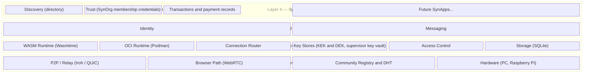
```mermaid
block-beta
  columns 1
  block:L4["Layer 4 — SynApp Layer"]
    block:ROYM["SynApp 1: Roym"]
      R1["Discovery (directory)"]
      R2["Trust (SynOrg membership credentials)"]
      R3["Transactions and payment records"]
    end
    C["Future SynApps..."]
  end
  block:L3["Layer 3 — Shared Substrate Utilities"]
    D["Identity"]
    F["Messaging"]
  end
  block:L2["Layer 2 — Substrate Runtime"]
    I["WASM Runtime (Wasmtime)"]
    J["OCI Runtime (Podman)"]
    RT["Connection Router"]
    K["Key Stores (KEK and DEK, supervisor key vault)"]
    L["Access Control"]
    M["Storage (SQLite)"]
  end
  block:L1["Layer 1 — Infrastructure"]
    N["P2P / Relay (Iroh / QUIC)"]
    W["Browser Path (WebRTC)"]
    O["Community Registry and DHT"]
    Q["Hardware (PC, Raspberry Pi)"]
  end
```

Layer 3 holds two substrate utilities: identity and messaging. Discovery and matching, trust and reputation, and payments are Roym features. They are not substrate components, so the diagram shows them in Roym. The [Layer 3](#layer-3--shared-substrate-utilities) section describes them too.

> **Envisioned.** Not built yet. Replication of service databases, a bootstrap server, a substrate on an Android phone, and a reputation record. Today the built data backup is the Roym archive. Keys have their own backups: `roymctl identity export` and `roymctl supervisor export-master`. A relay is a URL in the config of each substrate, and trust is the signed membership credentials of a SynOrg. The replication design is open: see [PLT-RED](#plt-red-service-redundancy).

### Conceptual Entity Model

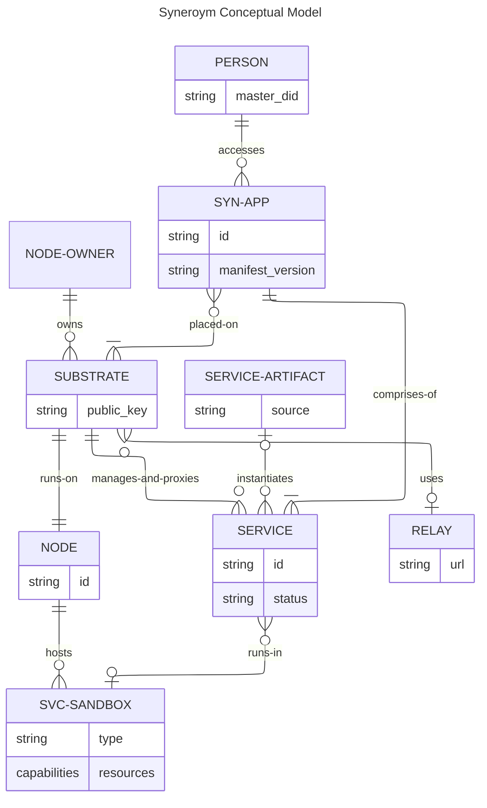
```mermaid
---
title: Syneroym Conceptual Model
config:
    layout: elk
---
erDiagram
    NODE-OWNER ||--o{ SUBSTRATE : owns
    SUBSTRATE ||--|| NODE : runs-on
    SUBSTRATE ||--o{ SERVICE : manages-and-proxies
    SUBSTRATE }o--o| RELAY : uses
    SYN-APP ||--|{ SERVICE : comprises-of
    SYN-APP }o--|{ SUBSTRATE : placed-on
    SERVICE }o--o| SVC-SANDBOX : runs-in
    NODE ||--o{ SVC-SANDBOX : hosts
    SERVICE-ARTIFACT |o--o{ SERVICE : instantiates
    PERSON ||--o{ SYN-APP : accesses

    NODE { string id }
    SUBSTRATE { string public_key }
    SERVICE { string id string status }
    SYN-APP { string id string manifest_version }
    SERVICE-ARTIFACT { string source }
    SVC-SANDBOX { string type capabilities resources }
    RELAY { string url }
    PERSON { string master_did }
```

A SynApp can be placed on several substrates, because each service can name its own substrate. A substrate has at most one configured relay URL. It does not register at the relay. It publishes the URL in its signed record. A WASM service and a container service run in a sandbox. A TCP service and a native-host service run without one. The process of a TCP service runs outside the substrate. A native-host service cannot be named in a deployment plan. A WASM or container service is built from an artifact: a WASM component or an OCI image, named in the `source` field of its service spec. For a container, `image` in `custom_config` replaces `source` when it is set.

Provider and Consumer are not substrate entities. They are the two roles of a person in one Roym transaction. An aggregator is a SynOrg (Syneroym Organization) `directory` service. It aggregates the listings of the providers who publish to it. See [Federation Architecture](#federation-architecture).

> **Envisioned.** Not built yet. Federation between aggregators, and an aggregator that proxies a query to other aggregators. Today a directory answers from its own listings and does not forward a query to another directory.

---

## Layer 1 — Infrastructure

*Reader: a developer or operator who works on how substrates, browsers and relays reach each other.*

### P2P Networking: Iroh

*Note: connectivity works over IP networks: Iroh QUIC between nodes, and WebRTC for browsers. No BLE or LoRa transport exists. See the [Connectivity Substrate](#connectivity-substrate-in-heterogeneous-networks) section.*

A caller dials a node over Iroh QUIC (UDP). Iroh makes first contact through the relay and moves to a direct path when hole punching finds one. A substrate has one configured relay. It publishes the relay URL in its signed record, so a caller knows which relay to use.

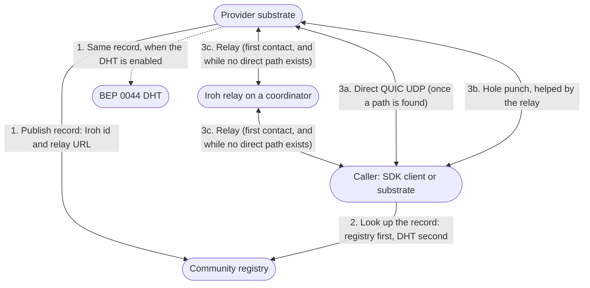
```mermaid
flowchart TD
    A([Provider substrate])
    B([Caller: SDK client or substrate])
    R([Iroh relay on a coordinator])
    REG([Community registry])
    DHT([BEP 0044 DHT])

    A -->|"1. Publish record: Iroh id and relay URL"| REG
    A -.->|"1. Same record, when the DHT is enabled"| DHT
    B -->|"2. Look up the record: registry first, DHT second"| REG

    B <-->|"3a. Direct QUIC UDP (once a path is found)"| A
    B <-->|"3b. Hole punch, helped by the relay"| A
    A <-->|"3c. Relay (first contact, and while no direct path exists)"| R
    R <-->|"3c. Relay (first contact, and while no direct path exists)"| B
```

**Technology:** `iroh` 0.97 (Rust crate) provides QUIC transport, NAT hole punching and relay. Peer discovery is the community registry and the `pkarr` records on the BEP 0044 DHT, not the address lookup of Iroh. See [Discovery](#discovery) and [Registry first, DHT second](#registry-first-dht-second). `webrtc-rs` serves browser clients through WebRTC data channels. See [Browser Path](#browser-path-webrtc-and-websocket-tunnel).

### Relay Node Architecture

A coordinator runs an Iroh relay server when `[roles.coordinator.iroh]` sets `enable_relay = true`. The relay is the `iroh-relay` crate with its `server` feature. It helps two peers hole punch and carries their traffic when no direct path exists. It is open to every Iroh endpoint by default. `[roles.coordinator] access` can list the Iroh endpoint ids that are allowed instead. With `[roles.coordinator.tls]` set, the relay uses that certificate and key, and it also runs QUIC address discovery on `quic_bind_address`. Without that setting it does not run QUIC address discovery. The code gives the HTTPS listener of the relay and its plain HTTP probe listener the same `http_bind_address`. The relay library says these need different ports, so a fixed port may fail with address in use. No test covers relay TLS.

The relay carries QUIC traffic that is already encrypted between the two peers. It does not read it. It still sees which endpoints talk, and the size and timing of the traffic.

A coordinator with `[roles.coordinator.iroh]` always runs the Syneroym endpoint that forwards streams ([Multi-Hop Relay](#multi-hop-relay-federated-coordinator)) and the HTTP `/v1/info` endpoint. The relay server and the Syneroym endpoint are separate parts. The relay server runs too only when `enable_relay = true`.

> **Envisioned.** Not built yet. Today a relay is a URL that an operator writes into the config of each substrate, and no code gives a relay a `*.syneroym.net` name. Nothing runs a TURN server, nothing registers relays at a bootstrap server, and no substrate caches relay names. The design below is the target.

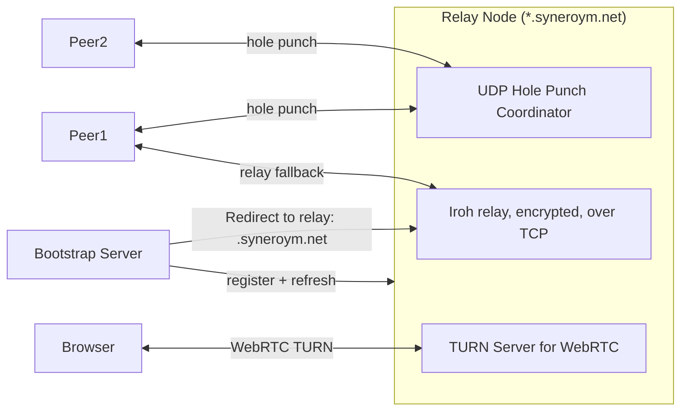
```mermaid
flowchart LR
    subgraph Relay["Relay Node (*.syneroym.net)"]
        HP[UDP Hole Punch Coordinator]
        DR[Iroh relay, encrypted, over TCP]
        TR[TURN Server for WebRTC]
    end

    BS[Bootstrap Server] -->|"register + refresh"| Relay
    BS -->|"Redirect to relay: <relaynodeid>.syneroym.net"| DR
    Peer1 <-->|"hole punch"| HP
    Peer2 <-->|"hole punch"| HP
    Peer1 <-->|"relay fallback"| DR
    Browser <-->|"WebRTC TURN"| TR
```

**Local DNS (Envisioned):** Each substrate caches relay hostname resolutions. This avoids hammering the Bootstrap server for the large number of dynamically rotating relay nodes.

### Multi-Hop Relay (Federated Coordinator)

Next-hop forwarding is done by the connection router (`crates/router`), in the function `relay_to_next_hop` in `route_handler/io.rs`. It is not in `crates/coordinator_iroh`. That crate builds the Iroh endpoint and a router handler in coordinator mode, which has no local services. A substrate runs the same code. When a stream names a service the substrate does not host and the registry resolves that service, the substrate forwards the stream. Coordinators are the intended forwarders.

A substrate on a private network sets `parent_coordinator.iroh.url` to the relay of a coordinator on that network. Its Iroh endpoint uses that relay, and it publishes the Iroh id and the relay URL in its signed record. A caller that looks the record up in the registry dials the substrate through that relay. An Iroh relay is made so that a peer that accepts no inbound connection can still be reached. No test in this repository blocks inbound traffic.

A coordinator is the entry point only when an SDK call names it, or when a caller dials the record of the coordinator itself. The coordinator reads the route preamble, resolves the target service in the registry and dials the next hop. The next hop is the target substrate, not another coordinator. The coordinator then copies bytes in both directions. A coordinator that has a parent uses the relay of that parent as its own relay. No code dials the parent on demand. The coordinator still accepts inbound streams, and it opens a new connection to each target substrate.

> **Envisioned.** Not built yet. A record that names a coordinator as the entry point of a private substrate, so that the registry sends callers there on its own. A record has no entry-point field today.

A stream is end-to-end encrypted between the caller and the serving substrate only when the preamble asks for `enc=ecdh-p256`. The browser page asks for it on the WebSocket tunnel path. On a WebRTC data channel it removes the option, because DTLS already protects that channel. The Rust client (`SyneroymClient`) does not yet. Without it, each Iroh leg is encrypted and a forwarding coordinator holds the bytes in clear. A coordinator always reads the preamble in clear. It sees the target service id. It also sees the `pubkey` field, the delegation certificate and the capability token, when the caller sets them. A relay or coordinator also sees that two endpoints exchanged traffic, and the size and timing of it.

The entities and the step-by-step message flow are in [Appendix: Multi-Hop Relay Walkthrough](#appendix-multi-hop-relay-walkthrough). The handshake is in [Appendix > 5. Data Transfer Characteristics](#5-data-transfer-characteristics).

### Browser Path (WebRTC and WebSocket Tunnel)

A browser cannot open an Iroh connection. The WebRTC coordinator (`crates/coordinator_webrtc`) gives it two paths to a service. The tunnel dials the substrate with the Iroh stream and endpoint code of the router. The data channel path ends in the router of the substrate. The code of the WebRTC coordinator never calls `relay_to_next_hop`, the forwarding function above. A substrate forwards only a stream for a service it does not host.

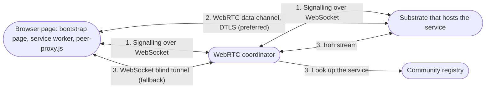
```mermaid
flowchart LR
    BR([Browser page: bootstrap page, service worker, peer-proxy.js])
    CW([WebRTC coordinator])
    S([Substrate that hosts the service])
    REG([Community registry])

    BR <-->|"1. Signalling over WebSocket"| CW
    CW <-->|"1. Signalling over WebSocket"| S
    BR <-->|"2. WebRTC data channel, DTLS (preferred)"| S
    BR <-->|"3. WebSocket blind tunnel (fallback)"| CW
    CW -->|"3. Look up the service"| REG
    CW <-->|"3. Iroh stream"| S
```

- **Bootstrap page.** The coordinator serves a bootstrap page, a service worker (`sw.js`) and `peer-proxy.js` on its bootstrap port (`bootstrap_page_bind_address`). The service worker sends the page's requests to `peer-proxy.js`, which sends them to the service as streams.
- **WebRTC data channel (preferred).** `peer-proxy.js` registers at the signalling server (`/ws`, `signalling_bind_address`) and sends an SDP offer to the target substrate. The substrate registers there under its own id when `parent_coordinator.webrtc` is set. The signalling server only passes each message to the peer named in its `target` field. ICE uses STUN. Each request then gets its own data channel, which DTLS protects. On this path the page removes the `enc=ecdh-p256` option from the preamble.
- **WebSocket blind tunnel (fallback).** When no WebRTC connection is up or a data channel cannot be made, the page opens a WebSocket to `/__syneroym/tunnel` on the coordinator and sends the preamble. The coordinator looks the service up in the registry, dials the hosting substrate over Iroh with its own endpoint, forwards the preamble and copies bytes in both directions. It does not parse them. The tunnel needs a configured registry: without `substrate.registry_url` it closes. On this path the page runs the `enc=ecdh-p256` handshake, so the coordinator cannot read the payload.

> **Envisioned.** Not built yet. A TURN relay for WebRTC. Only STUN is built (a default STUN server is set, see [Relay and Registry Configuration](#relay-and-registry-configuration)). The blind tunnel is the fallback when a direct WebRTC connection fails.

### Relay and Registry Configuration

A substrate is given its relay by a fixed setting. Nothing chooses a relay for it.

| Setting | Default | What it does |
|---|---|---|
| `[parent_coordinator.iroh] url` | The section is absent by default. When the section is present without `url`: `http://localhost:7964`. | The relay of this substrate. A substrate builds an Iroh endpoint only when this section exists and `communication_interfaces` has `iroh`. `run --iroh-relay-url` sets it. |
| `[parent_coordinator.webrtc] signaling_url` | `ws://localhost:7963/ws` | The signalling server where the substrate registers. |
| `[parent_coordinator.webrtc] stun_servers` | `["stun:stun.l.google.com:19302"]` | The STUN servers for WebRTC. The browser page has the same server written in `peer-proxy.js`. |
| `[substrate] communication_interfaces` | `["iroh", "webrtc"]` | The transports the router starts. |
| `[substrate] registry_url` | None. | The community registry of this node. |
| `[substrate] enable_bep0044_dht` | On | Also publish to and look up the Mainline DHT. |
| `[roles.coordinator.iroh] enable_relay` | `false` | Run an Iroh relay server. |
| `[roles.coordinator.iroh] http_bind_address` | `0.0.0.0:7964` | The relay address. |
| `[roles.coordinator.iroh] quic_bind_address` | `0.0.0.0:7965` | QUIC address discovery. It runs only when relay TLS is set. |
| `[roles.coordinator.iroh] info_http_bind_address` | None. The port of `http_bind_address` plus 10. | The `/v1/info` endpoint. |
| `[roles.coordinator.iroh] max_connections` | None (no cap) | A new Syneroym connection above the cap gets `ServiceUnavailable` and is closed. |
| `[roles.coordinator.iroh] community_registry_url`, `share_in_registry` | None, `false` | When both are set, the coordinator registers itself in that registry once at startup. |
| `[roles.coordinator.webrtc] signalling_bind_address` | `0.0.0.0:7963` | The signalling server. |
| `[roles.coordinator.webrtc] bootstrap_page_bind_address` | `0.0.0.0:7962` | The bootstrap page and the blind tunnel. |
| `[roles.coordinator] access`, `tls` | `"everyone"`, none | Who may use the Iroh relay: `"everyone"`, or a list of Iroh endpoint ids. Any other string also means everyone. The certificate and key of the relay. |
| `[roles.community_registry] http_bind_address` | `0.0.0.0:7961` | The HTTP community registry. |

The defaults in the table are the defaults of the config types. With no `--config`, `run` starts a development setup instead. In it `parent_coordinator.iroh` and `parent_coordinator.webrtc` are present, `registry_url` is `http://localhost:7961`, and the Iroh and WebRTC coordinator roles are on, with `enable_relay = true`.

`GET /v1/info` on a coordinator returns its Iroh address and id, its relay URL and parent URL, a status (`healthy` or `at_capacity`), the active connections and the cap, the days until its TLS certificate expires, and whether its relay is on. That TLS information is about `[tls]`. The relay certificate is the separate setting `[roles.coordinator.tls]`. The port plan is in the [developer guide](developer-guide.md#3-port-reference-normalized-796x).

**Default relay.** The router builds an Iroh endpoint from the Iroh `N0` preset: the public relay servers of n0 (the maker of Iroh) and the DNS address lookup of n0, which publishes to and resolves from the DNS server of n0. When a relay URL is given and it parses, the endpoint instead has only that relay and no address lookup. The `N0` preset stays in use when no relay URL is passed, or when the URL does not parse (the code then logs a warning). Two cases pass no URL. A coordinator with no `parent_coordinator.iroh` and `enable_relay = false` has no relay of its own. The WebRTC coordinator with no `parent_coordinator.iroh` builds its Iroh endpoint without one. A substrate with no `[parent_coordinator.iroh]` section builds no Iroh endpoint. The SDK client does not use the preset. It uses the relay URL of the record it dials, if that URL parses. With no relay URL in the record, it sets no relay.

> **Envisioned.** Not built yet. These settings are parsed and no code reads them: `coordinator_discovery_url`, `parent_coordinator.webrtc.bootstrap_url`, `enable_signalling` (Iroh and WebRTC), the WebRTC `enable_relay`, `[roles.coordinator.transport_bridge]`, and `parent_coordinator.ble` and `parent_coordinator.lora`. The WebRTC signalling server and the bootstrap page start when `[roles.coordinator.webrtc]` exists, whatever `enable_signalling` says.

The discovery side of this configuration is in [Registry first, DHT second](#registry-first-dht-second) and [Record freshness](#record-freshness).

### Bootstrap Server & DHT Fallback

Today a substrate finds its relay in its config, and a caller finds a node through the community registry first and the DHT second. A node publishes one `pkarr` signed packet under its own key, with its signed endpoint record: its Iroh id and its relay URL. A record with `is_private` set is not published to the DHT. A lookup asks the HTTP registry first. It asks the DHT when the registry has no answer, and then writes the DHT answer back to the registry. A registry answer that fails verification ends the lookup with no DHT fallback. A DHT lookup needs the full DID. The records are republished every hour. See [Registry first, DHT second](#registry-first-dht-second).

> **Envisioned.** Not built yet. The design below has no code. Today no substrate is assigned a relay, no list of relays exists, and no substrate caches one. No `syneroym-relays` record exists, and no community governance key exists.

**Decentralised Bootstrap Fallback**

The bootstrap server is an operational dependency. To survive its unavailability:

1. The bootstrap server **mirrors its relay registry** as `pkarr` signed packets published to the BitTorrent DHT under a well-known namespace key (`syneroym-relays.<version>`)
2. Substrates **cache** the last-known relay list locally (TTL: 24 hours)
3. On bootstrap unavailability, substrates use the cached list, then fall back to DHT lookup via `pkarr`
4. A community governance key signs the DHT namespace — any sufficiently trusted community member can republish in an emergency

At startup a substrate registers at the bootstrap server. The server assigns it a home relay and a relay list. This replaces the fixed `parent_coordinator.iroh.url` setting.

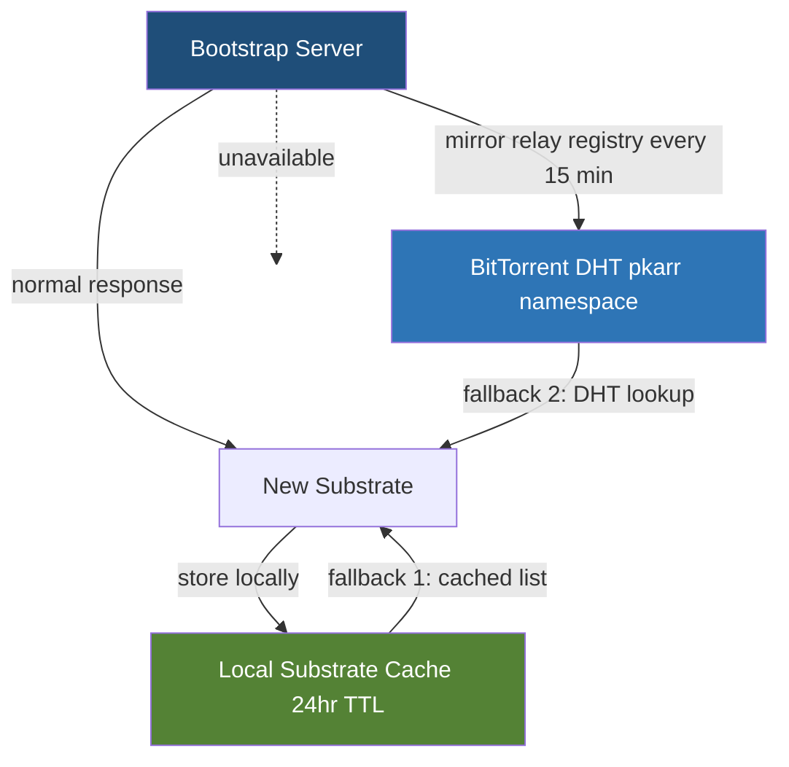
```mermaid
flowchart TD
    BS[Bootstrap Server]
    DHT[BitTorrent DHT pkarr namespace]
    CACHE[Local Substrate Cache 24hr TTL]
    SUB[New Substrate]

    BS -->|"mirror relay registry every 15 min"| DHT
    BS -->|"normal response"| SUB
    SUB -->|"store locally"| CACHE

    BS -. unavailable .-> X[ ]
    CACHE -->|"fallback 1: cached list"| SUB
    DHT -->|"fallback 2: DHT lookup"| SUB

    style X fill:none,stroke:none
    style BS fill:#1F4E79,color:#fff
    style DHT fill:#2E75B6,color:#fff
    style CACHE fill:#548235,color:#fff
```

---

## Layer 2 — Substrate Runtime

*Reader: a developer who works on the substrate, or who deploys an app to it.*

Layer 2 is the program that runs on each node. It accepts connections and checks who the caller is. It runs the services the caller asks for, and it stores their data. This layer has ten parts: the internal architecture, packaging and backup, storage and write rules, multi-host deployment, the API surface, the client gateway and the auth service, failure and shutdown, upgrade and versioning, limits and budgets, and deployment profiles.

Terms used here: a **service** is the unit a caller addresses. It is a native Rust service, a WASM component, or a TCP service. A **guest** is a WASM component that runs in the sandbox. A **SynApp** is a set of services that are deployed together from one manifest. See [TERMINOLOGY.md](TERMINOLOGY.md) for the other project terms.

### Substrate Internal Architecture

The substrate is one binary, `syneroym-substrate` (crate `crates/substrate`). It runs on Tokio. The node config (`SubstrateConfig`) turns each **role** on or off. Cargo features decide which roles are compiled in. A node can run any subset of the roles.

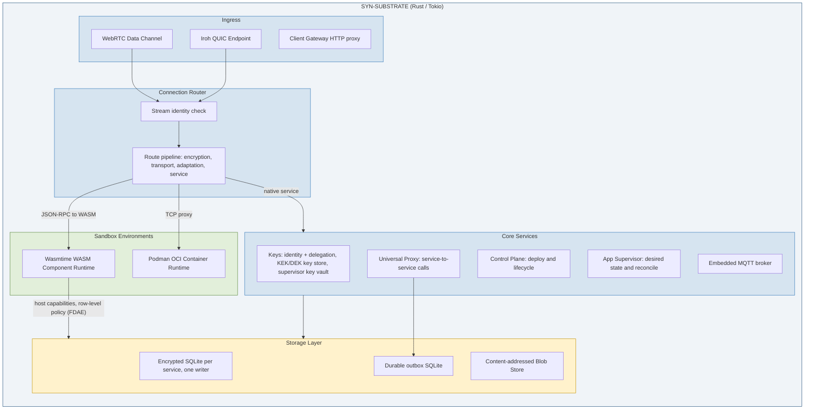
```mermaid
flowchart TD
    subgraph SUBSTRATE["SYN-SUBSTRATE (Rust / Tokio)"]
        direction TB

        subgraph INGRESS["Ingress"]
            QUIC_EP[Iroh QUIC Endpoint]
            WRT[WebRTC Data Channel]
            GW[Client Gateway HTTP proxy]
        end

        subgraph ROUTING["Connection Router"]
            IDENT[Stream identity check]
            PIPE[Route pipeline: encryption, transport, adaptation, service]
        end

        subgraph CORE["Core Services"]
            KM[Keys: identity + delegation, KEK/DEK key store, supervisor key vault]
            ORCH[Control Plane: deploy and lifecycle]
            SUP[App Supervisor: desired state and reconcile]
            PROXY[Universal Proxy: service-to-service calls]
            MQTT[Embedded MQTT broker]
        end

        subgraph SANDBOX["Sandbox Environments"]
            WASM[Wasmtime WASM Component Runtime]
            OCI[Podman OCI Container Runtime]
        end

        subgraph STORAGE["Storage Layer"]
            SQLITE[Encrypted SQLite per service, one writer]
            QUEUE[Durable outbox SQLite]
            BLOB[Content-addressed Blob Store]
        end
    end

    QUIC_EP --> IDENT
    WRT --> IDENT
    IDENT --> PIPE
    PIPE -->|"native service"| CORE
    PIPE -->|"JSON-RPC to WASM"| WASM
    PIPE -->|"TCP proxy"| OCI
    CORE --> STORAGE
    WASM -->|"host capabilities, row-level policy (FDAE)"| STORAGE
    PROXY --> QUEUE

    style SUBSTRATE fill:#f0f4f8,stroke:#1F4E79
    style INGRESS fill:#D6E4F0,stroke:#2E75B6
    style ROUTING fill:#D6E4F0,stroke:#2E75B6
    style CORE fill:#D6E4F0,stroke:#2E75B6
    style SANDBOX fill:#E2EFDA,stroke:#548235
    style STORAGE fill:#FFF2CC,stroke:#BF9000
```

**Roles.** Set them in `SubstrateConfig.roles`.

| Role | What it does |
|---|---|
| `app_sandbox` | Runs WASM components with Wasmtime (crate `syneroym-sandbox-wasm`). |
| `podman_sandbox` | Runs OCI containers by calling the host's `podman` command (crate `syneroym-sandbox-podman`). |
| `client_gateway` | An HTTP proxy. It maps the `Host:` header to a service. It forwards the request to the node of that service as a stream. |
| `community_registry` | Service discovery. It stores signed endpoint records. |
| `coordinator` | Helps two peers find a channel to each other. It relays data when no direct path exists. It has an Iroh part and a WebRTC part. |
| `auth` | Login and session tokens for the client gateway. |
| `observability` | Metrics, health, logging and tracing. |
| `supervisor` | The App Supervisor. It holds the desired state and the master keys of the app instances it manages. It reconciles those instances against their desired state. |
| `roym` | Links the Roym services into the binary (Cargo feature `roym`). |

Two more parts run inside the substrate. The embedded MQTT broker (`rumqttd`, ADR-0010) backs the `syneroym:messaging` interface. The conversation host (crate `syneroym-conversation`) backs `syneroym:conversation`.

**Ingress.** A node accepts streams on two transports: Iroh QUIC (ALPN `syneroym/0.1`) and WebRTC data channels. Each transport hands every stream it accepts to the connection router. A caller connects to a node. A WASM service never accepts connections itself, because the router dispatches each stream to it. Iroh is the peer-to-peer networking library from Layer 1. HTTP/1.1 requests travel inside these streams. The client gateway takes a local HTTP request and sends it to the target node as a stream. Browsers and the CLI send JSON-RPC 2.0 requests this way.

WebSocket is an option for one app. The guest declares an HTTP route with `target = "websocket"`. The router upgrades the connection and hands each frame to the guest. The app defines the frames. They are not JSON-RPC.

**Routing.** Every stream starts with a route preamble: `<scheme>://<interface>.<service_id>[?enc=...]`. The router reads the preamble and checks who the caller is. Then it plans a pipeline of four stages: encryption, transport, adaptation and service. The service stage is one of three things: a native Rust service, a WASM component, or a TCP proxy to a container or another TCP service. The preamble grammar is in `crates/router/src/preamble.rs`.

**Access control.** There are three layers. No single component holds all of them.

1. **Stream identity.** The router builds the caller identity from the route preamble when the stream opens. A caller can send a delegation certificate. A certificate is signed by the caller's master DID (the stable identity of a person or a service member) for a temporary key. When the preamble has a certificate, the router checks the signature, the validity window and the scope (`routing` or `service-instance`) of the certificate. It checks that the temporary key of the certificate is the key named in the preamble. It checks that the master has not revoked that temporary key. When the preamble has a key and no certificate, the router accepts that key as the caller's own master key. When it has neither, the caller is anonymous. The router does not check that the caller holds the private part of the key named in the preamble. A caller can add a signed chain of capability tokens (ADR-0015) to gain more rights.
2. **Per-service admission.** A native service rejects a caller without a verified identity. A service can also admit or refuse each method. A WASM guest may admit anonymous callers. The six Roym services use this to be local-only. Each of them answers the error code `-32013` on `invoke` to a caller that did not arrive through a local dispatch path, that is, from another service of this node or from the node's own machinery. A guest learns this with the `caller` function of the `syneroym:invocation` interface, which answers `internal`, `verified` or `anonymous`. `status` stays open on every service, for the health probe. The `directory` service has one table of four methods that a foreign node may call: `directory.search`, `directory.info` and `directory.standing` admit any caller, and `directory.publish` admits a caller with a verified identity. All other `directory` methods are local-only, including `credential.*`, `revocation.*`, `member.suspend` and `member.lift`.
3. **Row-level policy.** FDAE (Federated Data-Aware Authorization Engine, ADR-0017) compiles a policy into the data-layer query. A caller sees only the rows and fields it may see.

**Node ownership.** A node has one owner, called the controller. The node and the controller both sign a `ControllerAgreement` that names the two DIDs. `roymctl substrate claim --controller <name>` makes it. It must run on the host of the node, because it reads the private key of the node. The controller must be a different identity from the node. By default the agreement is the file `agreement.json` in the data directory of the node, and the substrate reads it at start. The substrate checks the agreement only at start, including its optional expiry. Only an agreement with two valid signatures makes the controller the owner. The router then grants `substrate/admin` to the caller whose verified DID is the controller. This covers every node-wide ability, including deploy, undeploy and status, and the `security` interface (KEK injection). `[iam].admin_ucan_root` is only a fallback for a node with no verified agreement. A node with neither a verified agreement nor `admin_ucan_root` runs unowned: no caller holds a node-wide capability, so nobody can deploy to it. The setting `[iam].grant_resolve_to_node_did` (off by default) gives a caller whose DID is the node's own the ability `supervisor/resolve`, and nothing else. A client gateway or a coordinator on the same node uses it to resolve logical service names.

**Keys.** Three parts hold keys. There is no single key manager.

- `syneroym-identity` holds Ed25519 identities and delegation certificates.
- `syneroym-data-keystore` holds the key encryption key (KEK) of the node and the data encryption key (DEK) of each service.
- The App Supervisor key vault holds the master key of each managed app instance. The operator must back each key up with `export-master`. A supervisor that is rebuilt without these backups mints new master keys. The `supervisor` interface has 17 verbs. See [LFC-MGT](#lfc-mgt-synapp-lifecycle-management-design).

**Deploy and lifecycle.** Three parts share this work.

- The client side (`roymctl`, the SDK) compiles an app manifest into a deployment plan.
- The Control Plane service on each node deploys and removes services.
- The App Supervisor (ADR-0021) reconciles each managed app against its desired state.

**Sandboxes.**

- **Wasmtime** runs WASM components. Limits cover memory, fuel (CPU work) and wall-clock time. The fuel quota schema is in ADR-0005.
- **Podman** runs containers. The substrate calls the host's `podman` command (`podman run -d --network bridge`). Syneroym prefers rootless Podman. It does not check this. The substrate calls the host's `podman` command, so a container is rootless only when Podman on the host is set up that way. Run Podman rootless. See the [developer guide](developer-guide.md#developing-podman-services-locally).

**Not substrate components.** Discovery and matching, reputation and payments are app features. They are not parts of the substrate runtime. See [Layer 3](#layer-3--shared-substrate-utilities). Today Roym provides discovery (the `directory` service) and payment records and signed receipts (the `transaction` service).

### SynApp Packaging & API Pipeline

A developer writes a WIT interface (WebAssembly Interface Types), generates Rust bindings, and builds a WASM component. A manifest names the components. `roymctl app deploy` sends the manifest to the substrate.

**Packaging**


```mermaid
flowchart LR
    WIT[WIT Interface Definition]
    WB[wit-bindgen Code Generator]
    RS[Rust SynApp Source]
    WASM_C[WASM Component .wasm]
    APP_SPEC[App Spec .toml manifest]
    SUB[Substrate Control Plane]
    JRPC[JSON-RPC 2.0 External API]

    WIT -->|generates bindings| WB
    WB --> RS
    RS -->|"cargo component build (wasm32-wasip2)"| WASM_C
    WASM_C --> APP_SPEC
    APP_SPEC -->|"roymctl app deploy"| SUB
    SUB -->|derives automatically| JRPC

    style WIT fill:#1F4E79,color:#fff
    style JRPC fill:#2E75B6,color:#fff
```

The substrate converts between JSON and WIT values at the component boundary. The WIT type of the target function directs the conversion. A developer does not write an API layer by hand.

**Backup and Restore**

Roym has an archive format. `roymctl roym backup create` writes one file. The file holds:

- The master identity of the person, encrypted.
- The data of five Roym services: `profile`, `catalog`, `conversation`, `transaction` and `directory`. Each service exports its own documents through its own interface.

The command seals the data with AES-GCM under a random 32-byte recovery key. It shows the key once and never stores it. The archive header (version, subject DID, time) is authenticated. Each service bundle has a manifest that the person signs. Restore checks the signature.

Restore has two commands. `restore-identity` writes the master key file. `restore-data` replays the bundles into the running Roym services through the gateway. It is safe to run again after an interrupted restore. Restore accepts only archive version 1.

After a restore, the node has new addresses. The person can read old conversations, but they cannot continue. The test `a_provider_transaction_survives_an_encrypted_backup_and_restore` in `crates/substrate/tests/roym_restore_e2e.rs` covers backup and restore of a provider transaction.

`roymctl identity export` and `roymctl identity import` move one local identity as an encrypted file. For the full steps, see [Moving a Substrate to a New Machine](developer-guide.md#moving-a-substrate-to-a-new-machine).

> **Envisioned.** Not built yet. Only Roym has an archive format today. There is no `syneroym` binary and no generic app export.
>
> - **Generic app export.** One command exports any SynApp as a signed archive. The archive holds an SQLite snapshot, the blob store, the App Spec, and optionally the identity keypair. Import checks the signature and replays into a fresh SQLite instance. The archive moves to any substrate with a compatible version.
> - **Replicated backups.** A live copy of a service database, and periodic backups to an S3-compatible store, have no frozen design. [PLT-RED](#plt-red-service-redundancy) proposes shipping WAL frames over Iroh and promoting a secondary by hand. Litestream is another option.

### Storage & Write Arbitration

Structured data lives in one SQLite database per service (`state.db`). The database uses `rusqlite` with SQLCipher (ADR-0006). Encryption is on by default. Set `storage.encryption` to turn it off. Each service has its own data encryption key. The node's KEK wraps it. The KEK must be injected before an encrypted database can open.

Each database has one writer task. It takes every write from a queue and applies the writes one at a time. Reads use a pool of reader connections. One task does all writes, so the storage layer has nothing to merge.

The blob store is content-addressed. The key of a blob is the SHA-256 hash of its plaintext, so the same bytes are stored once. Blobs are encrypted at rest with AES-256-GCM in 256 KiB segments. A key derived from the service key encrypts them. An S3-compatible backend is an optional Cargo feature (`aws`, ADR-0009).

**Durable outbox.** A guest can queue a call to another service. The substrate saves the call in an SQLite outbox that belongs to the calling service. The outbox is a file next to the encrypted database of that service. A worker on the node retries the call with backoff. A call that can never succeed goes to a dead-letter table (ADR-0023). The receiver can fence a call that carries an idempotency key. The call then runs once, even if it is delivered more than once. The receiver refuses a call that has a key but no verified caller.

**Write rules.** The data layer does not decide who wins a race. It only puts the writes in order. The rules below are in the Roym services. Bookings are written on the provider's node only, so a race is two requests that reach one writer.

| Record | Rule | Rationale |
|---|---|---|
| Agreement decision | One decision per agreement. The first claim wins. A later attempt gets the first result back (the code calls this outcome `AlreadyDecided`). | The provider's node is the only writer. |
| Booking slot | Seats are claimed in order with the create fence of the data layer. When no seat is free, the booking opens as `conflict` with the reason `slot-taken`. This is the wire form in the signed `booking-progress` snapshot. The Rust name is `SlotTaken`. | Prevents double-booking. |
| Listing (catalog) | The whole listing is saved with `put`, so the last write wins for the listing. Each version is also kept in a history collection. | The catalog is provider-owned. |
| Message | Append-only log. An entry that is already stored is ignored. | Messages are immutable once sent. |
| Access control policy (FDAE) | The policy is saved as one document per service. A new policy replaces the old one at once. | A tighter policy must take effect immediately (ADR-0017). |

> **Envisioned.** Not built yet. Roym has no order entity and no reputation record, so two rules are not in the code.
>
> - **Order state.** A provider action beats a same-instant consumer action. Otherwise the first request wins. The reason: the provider has operational authority over their service. Today the nearest rule is the agreement decision above.
> - **Reputation record.** The log is append-only, and the issuer signs each record. Today Roym has signed receipts (payment acknowledgement, fulfilment receipt) but no reputation record.

> **Envisioned.** Not built yet. Today there is one database per service and no replica role.
>
> The replication design is open. The [PLT-RED](#plt-red-service-redundancy) proposal says a replica of a service database stays read-only until an operator promotes it. Then there is exactly one writer per service at a time. Litestream stays an option. WAL shipping needs the `state.db` of a service in WAL mode, and the data layer sets no WAL pragma on `state.db` today. A disconnected client (secondary device, mobile app, offline peer) is not a second writer. Its requests queue locally. They replay against the single writer on reconnect, guarded by idempotency keys. See [Multi-Device Sync](#multi-device-sync-and-sharded-deployment).

### Multi-Device Sync and Sharded Deployment

This section covers two needs. The first is apps that work across the devices of a provider. The second is one app that runs on several hosts.

**A) Multi-device sync (primary + secondary provider devices)**

> **Envisioned.** Not built yet. No secondary-device feature exists. The SDK client does not set an idempotency key on its requests, and the durable outbox runs on the node, not on a device.
>
> - A secondary provider device is a client of the primary service. It is not a second writer to the database.
> - Requests made offline queue in the local outbox of the device ([PLT-ASY](#plt-asy-asynchronous-operations--scheduling)). Each request has an idempotency key.
> - On reconnection, the queued requests replay against the single writer.
> - Operational ownership stays deterministic because there is one writer. A merge step is not needed.

**B) One app on several hosts**

The operator keeps a **substrate inventory**: a list of substrates, each with an alias. A manifest names a substrate with `[placement]`. A manifest can set a default, and each service can override it. A deploy resolves every alias and connects to each substrate. Then it sends one deploy call for each service and substrate. The steps are in [Deploying a Multi-Substrate App](developer-guide.md#deploying-a-multi-substrate-app-roymctl-app-deploy).

`replicas = N` on a service makes the compiler emit N members. The topology mode becomes `Redundant`. A call without a routing key goes to the members in turn. A call with a routing key goes to one member, chosen by rendezvous hashing. Each member is a separate service with its own `service_id`, and so with its own database. The members do not share data. Because of this, the manifest check refuses `replicas` above 1 for a service that declares a config `schema` (the JSON Schema for its `custom_config`). The check cannot see a service that uses the data layer without declaring a `schema`. Use `replicas` for stateless services.

Calls between services on different substrates use Iroh QUIC with JSON-RPC. The receiving node checks the identity of the caller when the stream opens. A call to a service that is down fails after the retry policy. A guest can queue a call in the durable outbox, so the substrate retries it later. Other services keep working.

Example placement: the Roym services (`crates/roym_core/app/roym.toml`) are `web`, `profile`, `conversation`, `catalog`, `transaction` and `directory`. Each one can name a substrate.

> **Envisioned.** Not built yet. Today the operator chooses each placement by name. Nothing schedules services.
>
> - **Resource-class scheduling.** The orchestrator places each service by the resource class it declares (`cpu`, `memory`, `gpu`, locality tags). Today the only attribute in the inventory is the list of service types that a substrate can run.
> - **Sharded mode.** The resolver can choose a member by routing key (`Sharded`, with hash or entity-tag sub-strategies). A service spec has a `sharding_strategy` field, and the compiler copies it into the plan. But the compiler never emits `Sharded`, so the field does not turn sharding on.
> - **Queued dependents.** A dependent workflow moves to queued and retry mode by itself while a dependency is down. Today a guest queues a call by choice.

### Substrate API Surfaces

The substrate has one API surface: **JSON-RPC 2.0**. It serves WASM components (through the Universal Proxy), peer substrates (over Iroh QUIC), the CLI, browsers, the provider status UI and third-party integrations. The substrate derives the surface from the WIT definitions. It converts each JSON value to the WIT type of the target function.

> **Envisioned.** Not built yet. Today every call converts between JSON and WIT values. The router reserves the `wrpc://` scheme and answers it with a typed *unsupported protocol* error.
>
> - **wRPC surface.** WASM components, peer substrates (over Iroh QUIC) and the CLI use wRPC, derived from the same WIT definitions. WIT types are kept end to end, with no JSON conversion.
> - **OpenRPC schema.** The JSON-RPC surface is documented as an OpenRPC schema.

### Client Gateway and Auth Service

The client gateway (role `client_gateway`) is the HTTP entry for browsers and tools. It opens a stream to the node of the target service and copies the bytes both ways. The gateway names its own node key in the route preamble of every stream. It does not sign the stream, and the router does not check that the gateway holds the private key. The gateway sets no rule about which machine may connect to it. The identity mode below and the checks at the target node decide what a caller may do.

`identity_mode` under `[roles.client_gateway]` sets who the target node sees as the caller:

| Mode | Caller at the target node |
|---|---|
| `open` (default) | The node DID of the gateway. No certificate is attached. |
| `login` | The same as `open`. In addition, with `connection_auth_gate` on, the gateway answers `401` to a request that has no valid session, unless the request is for the auth service. |
| `fixed` | The master DID in the delegation certificate named by `fixed_delegation`. The gateway attaches that certificate to every stream. The gateway answers `GET /_syneroym/session/whoami` itself, with `fixed_identity_did`. |

The auth service (role `auth`, ADR-0024) turns a login into a session token. It answers six paths under `/_syneroym/session/`: `challenge`, `login`, `methods`, `whoami`, `logout` and `refresh`. The `delegated-key` login works like this:

1. The client asks for a challenge and names its master DID. The service returns a one-time nonce (lifetime `nonce_ttl_secs`, default 60 seconds) and a text that names the node, the nonce and that master DID. A client that does not name a master DID gets the nonce and the node DID only.
2. The client signs that text with its temporary key, or with its master key. It posts the signature, the nonce and a delegation certificate with the scope `session-auth`.
3. The service checks that the nonce is unused and not expired. It checks the certificate and its expiry. It resolves the master anchor and refuses a temporary key that the master has revoked. It checks the signature.
4. The service mints a session token. This is a short-lived UCAN, signed by the key of the auth service. Its lifetime is the shorter of `session_ttl_secs` (default 8 hours) and the remaining life of the certificate. The service sets the cookie `syneroym_session` (`HttpOnly`, `SameSite=Lax`, and `Secure` when `secure_cookies` is on).

A second method, `local`, mints a token for a person key file that sits in `person_identities_dir` on the node. It is off when that setting is not set. It has no proof step: the service mints a token for any key file name in that directory, and refuses only a request that carries an `Origin` header. Use it only on a host you trust. `logout` puts the token on a list that the auth service keeps. The list is in memory only, so a restart clears it. It holds at most 10,000 tokens, and when it is full a new logout is not recorded. The Roym Hub uses the `delegated-key` login with a key that it keeps in the browser.

In the `open` and `login` modes the gateway passes the session cookie on unchanged. The target router replaces the caller with the person in the token. It does this only for an HTTP request whose stream comes from the node's own key with no delegation certificate, that is, from the gateway of the same node. The router does not check that the caller holds the node key. It refuses a token that the auth service has logged out. It refuses every token when the node has no auth service.

### Failure and Shutdown

`RuntimeServices` races all components in one `tokio::select!`. These are the connection router, the community registry, the coordinator, the client gateway, the health and metrics servers, the supervisor loop, the supervisor queue worker, the proxy outbox worker, the conversation outbox worker and the loop that warns about instance certificates near expiry. When any one of them finishes, with success or with an error, the whole substrate shuts down. A component that is not configured never finishes. The health and metrics servers log a bind error and then wait forever, so a failed bind does not stop the substrate.

The shutdown signal is Ctrl-C. The code installs no handler for SIGTERM.

Shutdown runs in this order:

1. The supervisor stops, and shutdown waits for its loop to end.
2. The queue worker, the proxy outbox worker and the conversation outbox worker are cancelled, and their handles are dropped on purpose. Shutdown does not wait for them, because a delivery to an offline peer could block it forever. An item that was in flight comes back after the visibility timeout of its queue (ADR-0023).
3. The client gateway, the coordinator and the community registry shut down.
4. Observability data is flushed, and the connection router shuts down.

### Upgrade and Versioning

A deploy of a WASM service calls the guest's `init()` when the service has no database yet. It calls `migrate()` when the service already has one. A hook runs only if the guest exports it, and a hook that fails makes the deploy fail. A deploy that is identical to the installed, running service (same caller) does nothing, so no hook runs. This holds only after the node has run a full deploy of that service since it started. The substrate takes no snapshot and does not roll back after a failed `migrate()`. A connection uses one fixed protocol identifier, the ALPN `syneroym/0.1`. Persisted and signed formats carry their own version and refuse a version they do not know: the signed record envelope (`ENVELOPE_VERSION`), the identity backup (`IDENTITY_BACKUP_VERSION`), the Master Anchor payload (`master_anchor_v1`) and the Roym archive. The Envisioned snapshot, rollback and protocol negotiation are in [LFC-VER](#lfc-ver-versioning--migration-flow).

### Limits and Budgets

| Limit | Default | Where it is set |
|---|---|---|
| Open streams per service | 8 | `[streaming] max_concurrent_streams_per_service` |
| Time to read a route preamble, before the caller is checked | 5 seconds | Fixed in the router |
| Size of the route preamble line | 256 KiB | Fixed in the router |
| Time to resolve the master anchor of a caller | 5 seconds | Fixed in the router |
| Service-to-service call | 30 seconds | Default of the proxy. A request can set its own time. |
| Size of a call queued in the durable outbox | 256 KiB | Fixed in the router |
| One guest call, wall-clock time | 5 seconds | `[roles.app_sandbox] dispatch_epoch_timeout_secs` |
| One `init()` or `migrate()` hook | 30 seconds | `[roles.app_sandbox] lifecycle_hook_epoch_timeout_secs` |
| Replicas of one service | 16 | Checked when the manifest is validated |
| Scheduled services in one manifest | 16 | Checked when the manifest is validated |
| One scheduled run | 10 seconds. At most 30 seconds. | The `timeout_ms` of the schedule (in milliseconds) |
| SDK connect to one mechanism | 10 seconds | `SyneroymClient::with_connect_timeout` |

A schedule is a cron expression with five fields. The parser also accepts a leading seconds field and a trailing year field. The App Supervisor evaluates it in UTC. The benchmarks and the test report are in [performance-and-robustness-spec.md](performance-and-robustness-spec.md).

### Deployment Profiles

- **Cargo features.** The default build of `syneroym-substrate` has `community_registry`, `coordinator_all` (the Iroh and WebRTC coordinators), `client_gateway`, `auth` and `supervisor`. The `minimal` feature set has `client_gateway` and `auth` only. Other features are `coordinator_iroh` and `coordinator_webrtc` (each turns on the base feature `coordinator`), `aws` (the S3-compatible blob backend) and `roym` (links the Roym services in). `dual_build_fixture` is for tests and must not be in a release build. The router, the sandboxes, the data layer, the MQTT broker, the conversation host and observability are always compiled in. A role also needs its `[roles.*]` section in the config.
- **Profile name.** `profile` (and `run --profile`) is a name that the substrate writes to its log. The `profiles` table in the config is parsed and nothing reads it.
- **Docker image.** One image, built from the `Dockerfile` on `debian:bookworm-slim`, holds `syneroym-substrate` and `roymctl` (ADR-0004). The entry point is `syneroym-substrate` and the default command is `run`. The image exposes the ports 7964, 7965, 7961 and 7960. The port plan is in the [developer guide](developer-guide.md#3-port-reference-normalized-796x).
- **TLS reload.** When `[tls]` has `reload_on_sigusr1 = true`, the HTTPS info server of the Iroh coordinator loads its certificate and key files again when it gets SIGUSR1. This works on Unix only.

---

## Layer 3 — Shared Substrate Utilities

Identity is a substrate utility. Discovery & Matching, Trust & Reputation and Payments describe Roym features built on substrate primitives. Messaging combines the two: the substrate owns the conversation history and its delivery, and Roym decides which messages to accept.

### Identity

The system separates a persistent root identity from the short-lived keys that act every day. Two kinds of key are built:

1. **Master Key (DID):** A persistent `did:key` (Ed25519). It is the identity of a person or of a member service. A person's master key is a key file. The App Supervisor keeps the master keys of the members it manages in its encrypted service vault. An exported identity is encrypted under a recovery key. [Keys: Location, Use, Loss](#keys-location-use-loss) has the details. The master key signs delegation certificates, its master anchor, the endpoint records of its member services and the capability tokens (UCAN) that it grants.
2. **Temporary Key (DID):** A short-lived `did:key` (Ed25519) that a master authorizes with a delegation certificate. The issuer chooses the lifetime. The default is 24 hours for `roymctl session delegate` and `roymctl identity certify-instance`, and 4 hours for an instance certificate that the App Supervisor mints. A temporary key is not the routing index in the DHT and publishes no DHT record. The record of a substrate is signed by the node key, which is also its Iroh key. The record of a member service is signed by the member's master key.

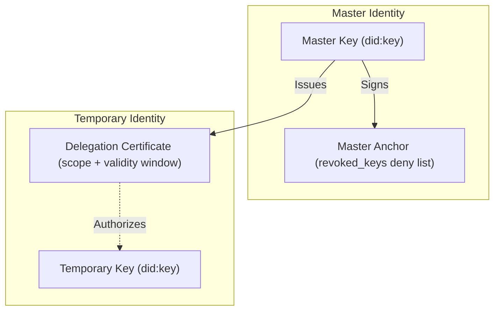
```mermaid
flowchart TD
    subgraph TIER_MASTER["Master Identity"]
        direction LR
        MASTER["Master Key (did:key)"]
        ANCHOR["Master Anchor (revoked_keys deny list)"]
        MASTER -->|Signs| ANCHOR
    end

    subgraph TIER_TEMP["Temporary Identity"]
        direction LR
        TEMP["Temporary Key (did:key)"]
        DEL_CERT["Delegation Certificate (scope + validity window)"]
        MASTER -->|Issues| DEL_CERT
        DEL_CERT -.->|Authorizes| TEMP
    end
```

> **Envisioned.** Not built yet. The master key is a plain key file or a vault entry. No code stores a key in an OS enclave, and no code handles a government identity or a zero-knowledge proof. See Method B below.

#### Cryptographic Delegation (Method A)
For standard operations, the Master Key issues a "Delegation Certificate" to a generated Temporary Key. The certificate holds the master DID, the temporary DID, an issue time, an expiry time and one scope. The master signs these five fields (Ed25519, over canonical JSON). The scope says what the temporary key may do as the master:

- `routing`: route a stream under the master's identity, for example a device key.
- `service-instance`: a key that a substrate derives for a service instance. The member master certifies it, so the instance speaks as that member.
- `session-auth`: log in at the node auth service. The router does not accept it on a stream.
- `record-signing`: sign records under the master's DID (see [Signed Records](#signed-records)). The router does not accept it on a stream.

A verifier names the scopes that it accepts, so a certificate made for one purpose cannot be replayed for another.

When a stream opens, the router (`HandshakeVerifier::verify_preamble`) validates this chain:
1. Did the Master Key authorize this Temporary Key? The router checks the signature, the validity window and the scope (`routing` or `service-instance`) of the certificate, and that the temporary DID in the certificate is the DID of the key in the preamble.
2. Has the Master Key revoked this Temporary Key? The router resolves the master anchor (see below). It refuses the stream if the key is on the `revoked_keys` list, or if the anchor cannot be resolved within 5 seconds.

When the preamble carries no certificate, the router accepts the key in the preamble as the caller's own master key. The optional end-to-end handshake (`enc=ecdh-p256`) is a separate step. It does not use the certificate. See [Encryption at Every Layer](#encryption-at-every-layer).

> **Envisioned.** Not built yet. The router does not check that the caller holds the private part of the temporary key. The preamble carries only the public key, so the key is asserted and not proved. Only the login at the node auth service checks a signature over a nonce. Two more checks are not built:
>
> - **Signed request.** The handshake checks that the Temporary Key signed the active request.
> - **Assurance credential.** The handshake optionally checks that the Master Key is bound to a verified government identity (Method B).

#### Zero-Knowledge Architecture (Method B)

> **Envisioned.** Not built yet. No code handles a government identity, a uniqueness anchor or a zero-knowledge proof.

A person may later attach an optional assurance credential to a master key, for example a government identity. No such credential is required, and none is the root of trust (`[FND-IDT]` in the [requirements](system-requirements-spec.md)). To prove the binding without revealing the DID or the uniqueness anchor, the substrate would use an **Optional ZK Runtime Plugin** (WASM-based). The plugin is an extension point and not a release requirement.
- It would accept the ID file, root signature, Master Key, and Temporary Key (as Public Input) into a proving scheme (e.g., `anon-aadhaar`).
- Verifiers would check the output proof string against public parameters.

#### Signed Records
A signed record is a statement that one identity makes and that any node can check without asking the issuer. The substrate defines one envelope. It holds `envelope_version`, `version`, `record_type`, `issuer`, `subject`, `issued_at_secs`, an optional `expires_at_secs`, an optional `supersedes`, the `payload` (a JSON object), an optional `delegation` (a certificate, as JSON) and the `signature`. The record id is `rec_` followed by the z-base-32 SHA-256 digest of the canonical signed envelope. A correction is a new record that names the id of the record it corrects in `supersedes`. Nothing is edited.

Limits on a record: the `payload` is at most 64 KiB when canonicalized, nests at most 32 deep, and holds integers only (a price is in minor units). The `record_type` is 1 to 64 bytes of lowercase ASCII letters, digits and `-`. The `subject` is at most 256 bytes. The substrate checks the shape of the record type and not its vocabulary. Roym fixes the table of the twelve record types that it produces.

**Signing.** A guest component calls `sign-record` of the `syneroym:signing` interface with a draft. The host builds the envelope and signs it. The component cannot state its own issuer or its own times. No function of the interface returns key material, and no function signs bytes that the caller supplies. The key is the signing key that the node derives for the service. The component picks one of two principals:

- `service`: the issuer is the `did:key` of the signing key.
- `delegated`: the issuer is a master DID. The component supplies a `record-signing` certificate that this master made over the signing key of the service. The host checks the certificate on every call: it must certify the exact key about to sign, carry the scope `record-signing` and be valid now. When the caller arrived as a verified identity, the master of the certificate must be that caller. The envelope then carries the certificate.

An instance that may not sign, such as a read-only after-step instance, gets `permission-denied`.

**Verifying.** The host and the guest run the same code (`syneroym-signed-record`, which also builds for `wasm32-wasip2`). A guest can verify a record. It cannot sign with a key that the node holds. The verifier checks that the envelope version is understood, that the record follows the rules above, that the issuer is the expected one when the caller names one, that the issue time is not more than 300 seconds ahead of the clock, that the record has not expired, and that the signature is valid. When the record carries a certificate, the verifier also checks that the master of the certificate is the issuer, that its scope is accepted (`record-signing` by default), and that the issue time of the record lies inside the validity window of the certificate. It then checks the revocation source that the caller passes for the signing key, the issuer and the record id. The result carries a revocation status. It is `Unknown` when the source has no answer for the signing key, the issuer or the record id. No Roym service passes a revocation source today, so the status is `Unknown`.

#### Identity Resolution & Revocation (The Master Anchor)
The **Master Key acts as the persistent anchor**. It publishes one signed record, the master anchor, as a standard `pkarr` record, so the BEP 44 signature mechanics stay unchanged. The anchor is a **deny list**: it names the temporary keys that the master has revoked. It does not list the active keys of the master. Records that give a route to a node or a service are separate endpoint records (see [Service Record](#service-record) and [Node Record](#node-record)). The key that a record's `service_id` names signs it: the node key for a substrate, and the member's master key for a member service.

**Master Anchor Payload Schema:**
The Master Key payload is stored in the `pkarr` TXT record as a JSON-encoded string:
```json
{
  "schema": "master_anchor_v1",
  "revoked_keys": [
    "did:key:h...",
    "did:key:h..."
  ],
  "timestamp": 1690000000000000
}
```
The `timestamp` is the time of the signed `pkarr` packet in microseconds. The payload may also carry an optional `revoke_list_registry` string. The code carries it forward on each republish and does not read it. The community registry keeps the anchor with the newest timestamp for each master. It refuses an older anchor.

**Secure Resolution Flow:**
1. **Registry Lookup:** A client asks the community registry first, and the DHT second, for a signed endpoint record by DID (see [Registry first, DHT second](#registry-first-dht-second)). An alias works only at the registry, because the DHT needs the full DID. A service record names the substrate in `substrate_id`. A logical service name inside an app is resolved by the App Supervisor, not by the registry.
2. **Routing Lookup:** The client looks up the substrate record of that `substrate_id`. The record holds the mechanisms for reaching the node: an Iroh address and relay URL, or a WebRTC peer.
3. **Revocation Check (at the receiver):** The node that receives a stream with a certificate resolves the anchor of the certificate's master. It asks the registry first and the DHT second. An anchor that the registry returns must carry the master's signature and be less than 24 hours old.

**Passive Revocation:**
The master adds the DID of a temporary key to `revoked_keys` and publishes a new anchor. Today the App Supervisor does this for the instance key of a member service that it manages (`roymctl supervisor revoke-instance`). No `roymctl` command revokes the delegated key of a person. `roymctl identity publish-anchor` writes an anchor with an empty list, so it removes earlier entries. Entries stay in the list, and revoking a key twice does not add a second entry.
- The compromised key's certificate stays valid until it expires, but a receiver refuses it as soon as that receiver sees the new anchor.
- The check runs when a stream opens. Each new stream resolves the anchor again at the receiver.

> **Envisioned.** Not built yet. A way for a person to revoke a temporary key that was compromised, for example a stolen laptop. The router already refuses a listed key. Only the App Supervisor adds keys to the list today, and only for instance keys.

**The anchor is a duty.** An anchor from the HTTP registry stops verifying 24 hours after it was signed. A master must republish it before then. The DHT fallback does not check the age of an anchor today. When a registry URL is configured and the vault is unlocked, the App Supervisor republishes the anchor of each master it manages. The default interval is 12 hours. A person's anchor is published with `roymctl identity publish-anchor`. The community registry keeps anchors in memory only, so after a registry restart it holds no anchor until the master publishes again. If the registry returns an anchor that fails verification, or neither the registry nor the DHT returns an anchor, the router refuses a stream that carries a certificate of that master. See [Keys: Location, Use, Loss](#keys-location-use-loss).

**Capability tokens.** A caller can also present a chain of UCAN capability tokens in the preamble ([ADR-0015](decisions/0015-ucan-capability-model.md)). The router verifies the chain, and for each edge it checks the anchor of the issuer for the audience key. An anchor that cannot be resolved counts as not revoked on this path.

**Master Key Compromise:**

> **Envisioned.** Not built yet. Today a master key is restored from an encrypted identity backup, and the registry compares only the timestamps of the anchors of one master. No flow replaces a compromised master key.

If the Master Key itself is compromised, the user would recover as `[FND-IDT]` describes: rotate the compromised delegates, publish a revocation and keep an auditable chain from the old master to the new one.
- A user who holds an optional assurance credential (Method B) could bind a *new* Master Key to the same credential with a modern timestamp/epoch. Because an attacker holds the digital `did:key` and not the physical identity, the attacker cannot produce a fresh proof.
- The Community Registry and network would then trust the Master Key that provides the most recent valid proof.
- **Orphaned DHT Records:** The attacker's compromised Master Key would still maintain its `pkarr` DHT record. This record becomes orphaned and irrelevant because the higher-level routing layers (e.g., the Community Registry, peer contact lists) update their internal pointers to resolve the Logical Service/Identity to the *new* Master Key. The old DHT entry does not need to be deleted.

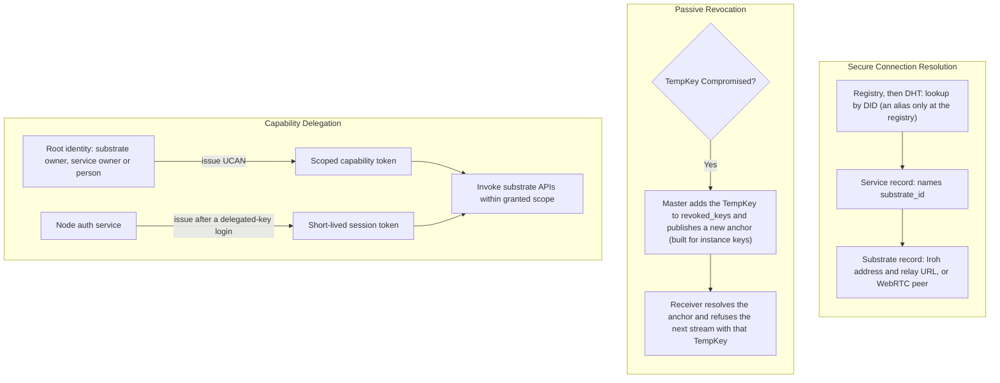
```mermaid
flowchart TD
    subgraph RESOLUTION["Secure Connection Resolution"]
        direction TB
        REG["Registry, then DHT: lookup by DID (an alias only at the registry)"]
        SVC_REC["Service record: names substrate_id"]
        SUB_REC["Substrate record: Iroh address and relay URL, or WebRTC peer"]

        REG --> SVC_REC --> SUB_REC
    end

    subgraph REVOCATION["Passive Revocation"]
        direction TB
        COMP{TempKey Compromised?}
        COMP -->|Yes| UPD["Master adds the TempKey to revoked_keys and publishes a new anchor (built for instance keys)"]
        UPD --> FAIL[Receiver resolves the anchor and refuses the next stream with that TempKey]
    end

    subgraph DELEGATION["Capability Delegation"]
        ROOT["Root identity: substrate owner, service owner or person"] -->|"issue UCAN"| APP[Scoped capability token]
        AUTH["Node auth service"] -->|"issue after a delegated-key login"| CONSUMER_TOK[Short-lived session token]
        APP --> INVOKE[Invoke substrate APIs within granted scope]
        CONSUMER_TOK --> INVOKE
    end
```

### Discovery & Matching

**Relay Discovery:** BEP 0044 Mainline DHT (via `pkarr`) resolves endpoint records and master anchors — identity-to-route lookups, not catalog search. A lookup asks the HTTP community registry first, when one is configured. It falls back to the DHT when the registry has no answer, and then writes the answer back to the registry.

**Catalog Search (a Roym feature).** Matching listings is not a substrate component. It is the `directory` service of Roym. A provider signs a `listing` record and publishes it to a SynOrg directory that the provider chose. A SynOrg (Syneroym Organization) is a local group that runs a `directory` service; see [Trust & Reputation](#trust--reputation). The directory holds the listings published to it. It answers queries by category, area, text and filters. Its answer is a list of candidates and is never a verified answer. Today a provider publishes only the `listing` record to a directory.

The consumer's node asks each directory that the person chose. It then checks every hit itself: the signature, the issue time, the expiry and the delegation window. Each hit also carries a revocation status. Today this status is always `unknown`, because no revocation source is given to the check. A hit that fails the check is kept apart from the others. A withdrawn membership is judged apart, by the standing check (see [Trust & Reputation](#trust--reputation)). Each node that runs the `directory` service keeps its own list of directories and chooses which of them to query. [Cross-Substrate Discovery Flow](#cross-substrate-discovery-flow) gives the full flow and the limits.

> **Envisioned.** Not built yet. A real revocation check on each listing hit. The verifier accepts a revocation source, but the node gives it none, so no hit is checked against a revocation list today.

**Ranking today:** each directory sorts its matching listings by the time of issue of the signed record, newest first. Ties go by `listing_id`. The consumer's node merges the answers of the directories in turn, so no one directory fills the page. No score is computed.

> **Envisioned.** Not built yet. Today a consumer asks the directories that it was given. No routing schema places a listing, no index has shards, and no hit carries a score or an ad boost. The design below is one option for later. It is not the plan. Tag-routed discovery ([P2P-DSC](#p2p-dsc-tag-routed-discovery-routing-mechanics)) is another option.

**Distributed matching (one option):** providers publish signed Publications (listings, intents, capabilities). Today only the `listing` record exists. Indexes are caches and are never authoritative. Clients verify every result — signature, timestamp, expiry — before trusting it.

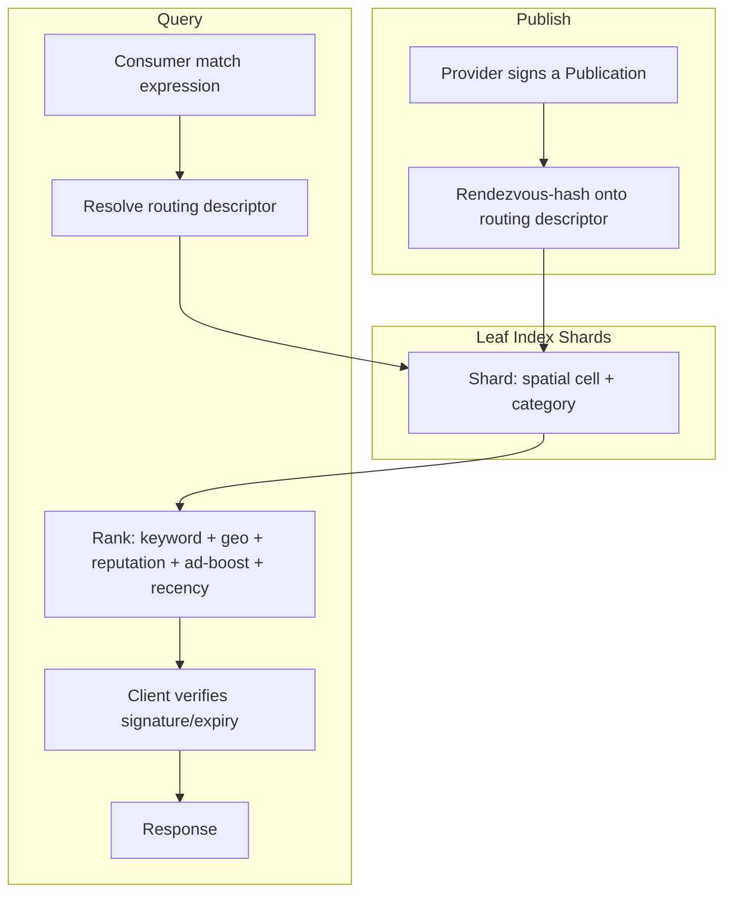
```mermaid
flowchart TD
    subgraph PUB["Publish"]
        P[Provider signs a Publication] --> PLACE[Rendezvous-hash onto routing descriptor]
    end

    subgraph LEAF["Leaf Index Shards"]
        L1[Shard: spatial cell + category]
    end

    subgraph MATCH["Query"]
        Q[Consumer match expression] --> RESOLVE[Resolve routing descriptor]
        RESOLVE --> L1
        L1 --> RANK[Rank: keyword + geo + reputation + ad-boost + recency]
        RANK --> VERIFY[Client verifies signature/expiry]
        VERIFY --> RESP[Response]
    end

    PLACE --> L1
```

**Placement:** a protocol-defined Routing Schema (spatial cell, category, ...) plus rendezvous hashing maps each Publication deterministically onto leaf index shards. Providers compute their own placement; no coordinator needed.

**Ranking:** transparent weighted formula (keyword relevance, geo proximity, reputation, ad-boost, recency). The weights are published open source. The ad-boost has a cap, and row 15 of the [Resolved Architecture TBD Items](#resolved-architecture-tbd-items) gives its value. There is no auction at first (row 17). The reputation signal depends on the reputation design, which is not frozen: see [Trust & Reputation](#trust--reputation). This formula orders the answer to one query. Suggesting items with no query is a separate design: see [Recommendation Algorithm](#recommendation-algorithm).

**Smallest version of this option:** Publications, one or two routing dimensions (spatial + category), flat leaf-shard lookup, client-side verification — enough for cross-cluster federation.

**Additive, later:** a hierarchical synopsis tree and query planner (worth it only once leaf-shard count makes fan-out expensive), composite routing descriptors, cross-shard ranking, adaptive fan-out. None of these require reworking the Publication format or placement contract once the smallest version exists.

### Messaging

Messaging is a substrate capability (`syneroym:conversation`, host crate `syneroym-conversation`). The host owns the history of each conversation: the encrypted log, the outbox, delivery, ordering, search, deletion and export ([ADR-0025](decisions/0025-conversation-capability-owns-history.md)). For each incoming message, the host asks the Roym `conversation` service to accept, hold or drop it.

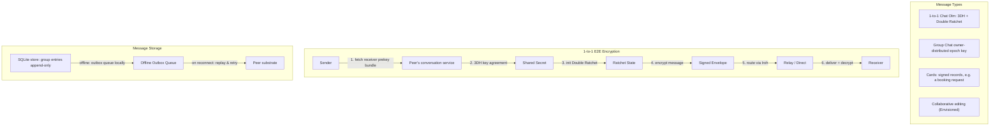
```mermaid
flowchart TD
    subgraph MSG_TYPES["Message Types"]
        direction LR
        M1[1-to-1 Chat Olm: 3DH + Double Ratchet]
        M2[Group Chat owner-distributed epoch key]
        M3["Cards: signed records, e.g. a booking request"]
        M4["Collaborative editing (Envisioned)"]
    end

    subgraph E2E["1-to-1 E2E Encryption"]
        direction LR
        S[Sender] -->|"1. fetch receiver prekey bundle"| PEERSVC[Peer's conversation service]
        PEERSVC -->|"2. 3DH key agreement"| KA[Shared Secret]
        KA -->|"3. init Double Ratchet"| DR[Ratchet State]
        DR -->|"4. encrypt message"| ENV[Signed Envelope]
        ENV -->|"5. route via Iroh"| R_NODE[Relay / Direct]
        R_NODE -->|"6. deliver + decrypt"| REC[Receiver]
    end

    subgraph STORAGE_MSG["Message Storage"]
        CR["SQLite store: group entries append-only"]
        CR -->|"offline: outbox queue locally"| Q2[Offline Outbox Queue]
        Q2 -->|"on reconnect: replay & retry"| PEER[Peer substrate]
    end
```

> **Envisioned.** Not built yet. Message threads and collaborative editing (box M4). The conversation code has neither.

**Libraries:** `vodozemac` for the Olm protocol (a triple Diffie-Hellman key exchange, 3DH, and a Double Ratchet) in 1-to-1 chat. Group chat uses one AES-256-GCM key for each epoch, which the group owner makes and distributes, and Ed25519 signatures on every entry. No `libsignal-protocol-rust` and no `openmls` is used. ADR-0013 Amendment 1 replaced MLS with the owner-distributed key ([ADR-0013](decisions/0013-p2p-messaging-architecture.md)). The key agreement sits behind one interface, so the DAG, the ordering and the storage do not depend on it.

The sender gets the prekey bundle of the receiver with the `prekey-bundle` call to the conversation service of the peer. The peer limits each caller; the default is 20 requests per hour for one peer. A message that cannot be delivered stays in the outbox of the sender and shows `pending` while the peer is not reachable. It becomes `failed` when delivery is refused for good (for example, the peer refuses it, or the sending service has no valid instance certificate), when the delivery attempts run out, or after 30 days (`conversation_max_pending_age_secs`). Delivery has three states: `pending`, `delivered` and `failed`.

**Group chat controls:**
- Only the owner of a group changes its members, and it can hold at most 256 members by default.
- Each join and each removal starts a new epoch with a new random key. The owner sends the key to each member in a message of content type `application/vnd.syneroym.group-key+json`, inside the 1-to-1 encrypted session.
- A membership change is also a signed entry of kind `membership` in the group log. It carries the new epoch and a hash of the member list, so every member sees it.
- The owner also rekeys on a schedule. The default interval is 604 800 seconds (7 days), set by `conversation_group_rekey_secs`.
- The owner makes the key, so the owner can read the group. A removed member cannot read entries of later epochs.

**Safety rules (for messages):**
- First contact is answered per message. The Roym `conversation` service asks the `profile` service, which applies the limit of the recipient on first contacts from one sender. The default is 3 in 24 hours. The recipient can change the window (60 seconds to 30 days) and the count (0 to 1000), and 0 means no first contact at all.
- A message that is over the limit is dropped, and so is a message from a blocked sender. A message of a group that the person has not shown is held.
- The block list and the reports are kept by the `profile` service.
- The limit on listings that one publisher may send to a directory has the same form. The default is 20 in 24 hours.

**Data lifecycle:**
- Deleting a message empties its body, keeps the row with a deletion time and removes it from the search index. The store sets `secure_delete`, and a later scrub step removes the deleted text from the database files.
- Deleting asks the other side to delete too. The request is a message of content type `application/vnd.roym.deletion-request+json`. A receiving store deletes its copy only when the request comes from the author of that message, in the same conversation. This is not cryptographic erasure. In a group, every member already holds the epoch key.
- A group keeps its encrypted log entries and its keys on the node.
- Search is full-text (SQLite FTS5) over accepted text messages that are not deleted.
- The history is exported and imported in pages, and the Roym backup archive carries it (see Backup and Restore in [Layer 2](#layer-2--substrate-runtime)).

### Trust & Reputation

**Principles.** The reputation design is not frozen. It will be frozen later. Only these principles are fixed today. Reputation is decentralized, reliable and transparent. The owner controls what is shared. Reputation is a Roym feature, not a substrate component.

**Built today.** Roym computes no rating, score or vouch. These parts exist:

- **Signed receipts.** A booking has two receipts, the agreement receipt and the fulfilment receipt. Each party signs its own copy, and the two copies are separate records. [P2P-REP](#p2p-rep-satisfaction-signal-mechanics) says more.
- **SynOrg standing.** The owner of a SynOrg signs three kinds of record about a member: a `membership-credential` (it names the categories and the areas that it covers, and lasts at most two years), a `revocation` that withdraws a credential, and a `moderation-decision` (`member.suspend` and `member.lift`). These are Roym records, not W3C Verifiable Credentials. A directory returns a listing only when its publisher has a valid membership. A consumer's node judges the same evidence itself, against the group that it pinned for that directory. The pin is set when the node first learns which group the directory speaks for, and a later reply does not change it. A decision of the group reaches copies that other people hold only when they next check, and the Hub says so. The verbs that issue a credential or a revocation, or suspend or lift a member, are local only. `directory.standing` answers any caller.
- **Rate limits.** The limits on first contact and on publication are described in [Messaging](#messaging).
- **Block list.** A person keeps a local block list in the `profile` service.
- **Moving history.** The nearest to portable history is the Roym backup archive, with a signed manifest.

> **Envisioned.** Not built yet. No vouch, `ReputationRecord`, rating or score exists. The design below is a candidate. The independent halves and the moving average in [P2P-REP](#p2p-rep-satisfaction-signal-mechanics) are another candidate. Neither is final. Of the five layers below, only layer 1 is built, and layers 3 and 5 are built in part (see SynOrg standing above).

**Reputation:** Replaces global average ratings with network-gated trust signals and transactional proofs.

- **Network-Gated Ratings:** A provider's rating is only visible to consumers sharing a trust path in the vouch graph. This prevents rating inflation and fake reviews from strangers, reflecting real-world community trust. (Note: May present a cold-start challenge for consumers with thin networks).
- **Transactional Proof:** Displays verified transaction counts and repeat customer rates instead of subjective ratings. Both parties must sign the transaction record, providing a strong, verifiable signal.

**Trust, vouching, credentials, reputation portability, and anti-gaming**

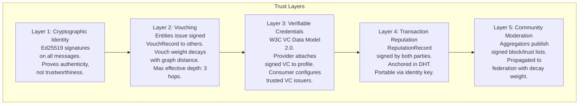
```mermaid
flowchart TD
    subgraph TRUST_LAYERS["Trust Layers"]
        L1["Layer 1: Cryptographic Identity
        Ed25519 signatures on all messages.
        Proves authenticity, not trustworthiness."]

        L2["Layer 2: Vouching
        Entities issue signed VouchRecord to others.
        Vouch weight decays with graph distance.
        Max effective depth: 3 hops."]

        L3["Layer 3: Verifiable Credentials
        W3C VC Data Model 2.0.
        Provider attaches signed VC to profile.
        Consumer configures trusted VC issuers."]

        L4["Layer 4: Transaction Reputation
        ReputationRecord signed by both parties.
        Anchored in DHT. Portable via identity key."]

        L5["Layer 5: Community Moderation
        Aggregators publish signed block/trust lists.
        Propagated to federation with decay weight."]

        L1 --> L2 --> L3 --> L4 --> L5
    end
```

**Vouching mechanics:**

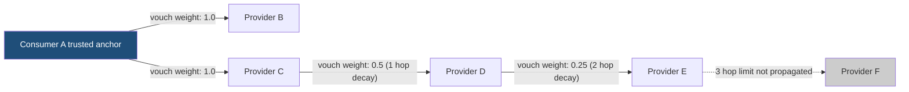
```mermaid
flowchart LR
    A[Consumer A trusted anchor] -->|"vouch weight: 1.0"| B[Provider B]
    A -->|"vouch weight: 1.0"| C[Provider C]
    C -->|"vouch weight: 0.5 (1 hop decay)"| D[Provider D]
    D -->|"vouch weight: 0.25 (2 hop decay)"| E[Provider E]
    E -. "3 hop limit not propagated" .-> F[Provider F]

    style A fill:#1F4E79,color:#fff
    style F fill:#CCCCCC
```

**Vouch weight formula:** `effective_weight = base_weight × decay_factor^hop_count`  
Default `decay_factor = 0.5`. Max effective depth: 3 hops (weight < 0.125 beyond this is ignored).

**Sybil resistance mechanisms:**
1. **Stake requirement:** To issue a vouch with weight > 0.5, the issuer must have ≥ 5 completed transactions with positive reputation in their own history
2. **Rate limiting:** Max 10 new vouches issued per 30-day window per identity
3. **Reputation anchoring:** Reputation records require both-party signatures — a provider cannot self-generate fake transaction history
4. **Community moderation override:** Aggregator block lists can zero out reputation from known Sybil clusters

**Anti-gaming (discovery ranking):**
- Ad boost is capped, so organic signals always dominate (row 15 of the [Resolved Architecture TBD Items](#resolved-architecture-tbd-items) gives the cap)
- Keyword stuffing is mitigated by TF-IDF scoring on index entries (raw keyword count is not used)
- Review bombing detection: reputation score uses a Bayesian average with a prior of 3.5/5.0 and minimum 5 reviews before score is published

**Reputation portability:** A provider migrating substrates republishes their `ReputationRecord` collection (each record is independently signed by both parties) to the DHT under their existing identity key. No loss of history.

### Payments

Payment handling is a Roym feature, not a substrate component. See [Flexible Payment Integration](#3-flexible-payment-integration) in Phase 6.

**Built today.** Payment is out of band by design. Roym does not process a payment or hold money. It does not check that money moved. It records what each side says. It checks only that a payment record uses the agreed amount, currency and method, and it refuses a record that does not. The provider signs a `payment-request` record. Either party signs a `payment-acknowledgement` record that says a payment happened. The acknowledgement is the word of its issuer, and Roym does not see the money move. The Hub shows a notice that says so. The payee text of a card is a link only when it uses `http` or `https`. Any other scheme, such as a UPI link, shows as plain text.

> **Envisioned.** Not built yet. No payment gateway, `PaymentIntent` interface, adapter, mutual credit or coin code exists. The design below is the direction: redirection to external payment flows (for example UPI deep links), and later fully integrated gateways, to keep central dependencies few at the start. Today nothing verifies a payment.

**Payment rails and credit/coin direction**

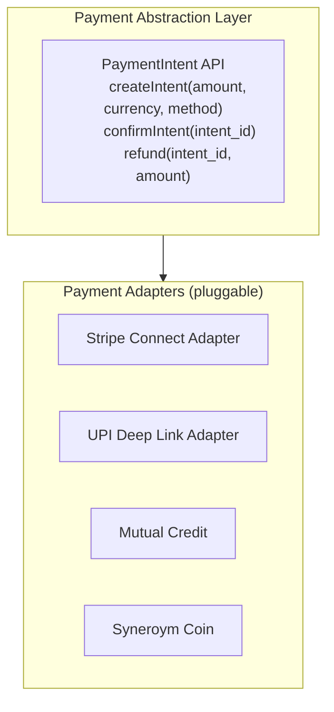
```mermaid
flowchart TD
    subgraph PAY_ABSTRACT["Payment Abstraction Layer"]
        API["PaymentIntent API
        createIntent(amount, currency, method)
        confirmIntent(intent_id)
        refund(intent_id, amount)"]
    end

    subgraph ADAPTERS["Payment Adapters (pluggable)"]
        STRIPE[Stripe Connect Adapter]
        UPI[UPI Deep Link Adapter]
        CREDIT[Mutual Credit]
        COIN[Syneroym Coin]
    end

    PAY_ABSTRACT --> ADAPTERS
```

Escrow and dispute-mediated fund custody are deferred; see [Decentralized Escrow & Dispute Resolution](#6-decentralized-escrow--dispute-resolution).

**Mutual credit (layers onto the Payment Abstraction Layer above; legal review required before rollout):** A bilateral IOU system where providers and consumers issue credits to each other denominated in a local unit. No external currency is required. Each credit line is a signed ledger between two parties; Roym mediates settlement. Regulatory classification varies by jurisdiction.

**Syneroym Coin (layers onto the same abstraction; legal review required before launch):** Internal ledger token (not a cryptocurrency or blockchain-based token) managed by a community governance multi-sig. Used for ecosystem incentives and cross-aggregator settlement.

---

## Layer 4 — SynApp Specifications

### SynApp 1: Roym
Roym is the SynApp built so far. A deal between two people is a chain of signed records that they exchange as cards over their conversation. The chain is `request` (the consumer asks), `quote` (the provider offers), `agreement-receipt` (each side signs one half) and then a booking on the provider's node, whose status travels as `booking-progress` cards. Payment and fulfilment add three more records: `payment-request`, `payment-acknowledgement` and `fulfilment-receipt`. The [Roym spec](roym-integrated-experience-spec.md) describes the product. [Phase 6](#phase-6-high-level-applications-synapps) lists the card types and what is not built.

#### Component Architecture

The manifest of Roym declares six services: `web`, `profile`, `conversation`, `catalog`, `transaction` and `directory`.

| Service | What it does | Declared dependencies |
|---|---|---|
| `web` | Serves the Hub UI and `POST /rpc`. It forwards each method to the service that owns the method prefix. Every method that it forwards, except `profile.policy`, needs a session of the node owner. `session.whoami` is answered without a session. | `conversation`, `profile`, `catalog`, `transaction`, `directory` |
| `profile` | The person's own profile, contacts, block list and reports. | none |
| `conversation` | One-to-one messages and private groups. It uses the conversation interface of the substrate for encryption, the outbox and delivery. | `profile` |
| `catalog` | The provider's listings and availability slots. | `profile` |
| `transaction` | Requests, quotes, agreements, bookings, payments and fulfilments. Booking logic and payment records are code inside this service. A quote that names a slot reads that slot from `catalog`. | `conversation`, `catalog` |
| `directory` | A SynOrg's member list, published listings, search index and membership credentials. On every installation it also keeps that node's own list of directories and its search runs. | `catalog` |

A call to the `invoke` export of a service that does not come from inside the installation is answered with error `-32013`, except for four `directory` methods. `directory.search`, `directory.info` and `directory.standing` accept any caller. `directory.publish` accepts a caller whose identity the router verified. So `transaction` and `catalog` cannot be called by another node. The `status` export stays open on every service, so health checks work. Two nodes talk through the conversation transport of the substrate, which carries the cards (the `prekey-bundle` and `deliver` calls), and through the four `directory` methods. Inside the installation, `web` checks the session before it forwards a call.

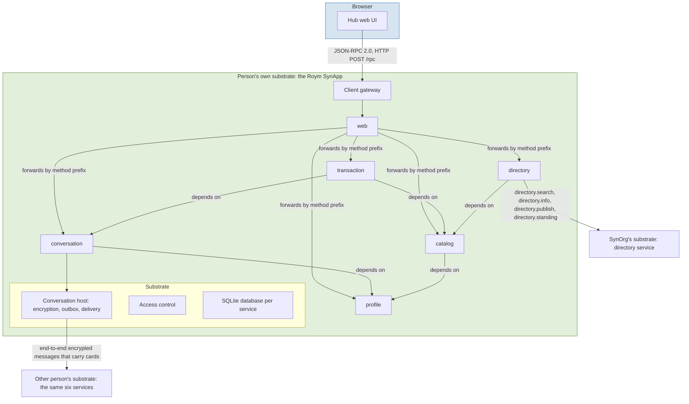
```mermaid
flowchart TD
    subgraph BROWSER["Browser"]
        HUB[Hub web UI]
    end

    subgraph OWN_NODE["Person's own substrate: the Roym SynApp"]
        GW[Client gateway]
        WEB[web]
        PROFILE[profile]
        CONV[conversation]
        CATALOG[catalog]
        TXN[transaction]
        DIR[directory]

        subgraph SUBSTRATE["Substrate"]
            MSG[Conversation host: encryption, outbox, delivery]
            AC[Access control]
            STORE[SQLite database per service]
        end
    end

    PEER["Other person's substrate: the same six services"]
    SYNORG["SynOrg's substrate: directory service"]

    HUB -->|"JSON-RPC 2.0, HTTP POST /rpc"| GW
    GW --> WEB
    WEB -->|"forwards by method prefix"| PROFILE & CONV & CATALOG & TXN & DIR
    CONV -->|"depends on"| PROFILE
    CATALOG -->|"depends on"| PROFILE
    TXN -->|"depends on"| CONV
    TXN -->|"depends on"| CATALOG
    DIR -->|"depends on"| CATALOG
    CONV --> MSG
    MSG -->|"end-to-end encrypted messages that carry cards"| PEER
    DIR -->|"directory.search, directory.info, directory.publish, directory.standing"| SYNORG

    style BROWSER fill:#D6E4F0,stroke:#2E75B6
    style OWN_NODE fill:#E2EFDA,stroke:#548235
```

The Hub calls its own node only. It never calls the provider's node.

> **Envisioned.** Not built yet. A DRM content server (an OCI service for protected media), push notifications, payment adapters for external gateways and a review service. Roym declares no OCI service. Today a card reaches the other person as a message in the conversation, and Roym has no push code, no payment gateway code and no review record. Also Envisioned: wRPC and WebSocket links from the Hub, which uses HTTP today. See [Payments](#payments) and [Trust & Reputation](#trust--reputation).

#### Cards

A card is a signed record sent as a message with content type `application/vnd.roym.card+json`. A card carries the signed envelope and nothing derived from it. The receiving node verifies the envelope and works out what to show. The Hub calls `transaction.sync` when a person opens a conversation. `transaction.sync` reads the conversation and files the cards in it.

| Card | Signed by | Meaning |
|---|---|---|
| `request` | the consumer | The consumer asks for a service. It has a description, and it may name a listing, categories, an area and a time window. |
| `quote` | the provider | An offer. It carries the agreed terms: scope, currency and amount, payment methods, payee, when payment is due, schedule, location, cancellation terms, refund terms and a dispute path as text. It may name one slot of the listing. It has an expiry. |
| `agreement-receipt` | each party signs one half | Each side signs the quote terms. A deal exists when both halves exist. |
| `booking-progress` | the provider's service | A snapshot of the booking. The consumer's node accepts it only when the signer is the one that signed the quote. |
| `payment-request` | the provider | The provider asks to be paid. It carries currency, amount and an optional note. It is optional. |
| `payment-acknowledgement` | either party | A statement about a payment made outside Roym, with an optional method and reference as text. |
| `fulfilment-receipt` | either party | A statement that the work is done. |

The expiry of a quote is set by the provider. It must be from 5 minutes to 90 days. A request has no expiry. The consumer can mark a quote as declined with `quote.decline`. This mark stays on the consumer's own node and sends nothing. It is refused after either half of the agreement is signed. Roym has no method for a provider to reject a request.

#### Booking State Machine

Roym has no single order record. A deal is the record chain above, and the booking that follows it. The provider's node is the only writer of the booking. Every other node reads the signed snapshots of that writer. Each snapshot has a number `seq` that counts up from 1. A snapshot is written with the create fence of the data layer, so two writers of the same `seq` cannot both win. The writer retries a lost write up to three times.

The booking opens on the provider's node once the consumer has accepted. When the consumer's `agreement-receipt` card is filed there and the quote has not expired, the node claims a seat or a decision (see below), opens the booking and countersigns the agreement on its own. This happens when `transaction.sync` runs on the provider's node, for example when the provider opens the conversation in the Hub. The provider can also accept by hand with `agreement.accept`. A quote that names a slot is booked by the acceptance of the consumer. The provider cannot accept such a quote before the consumer.

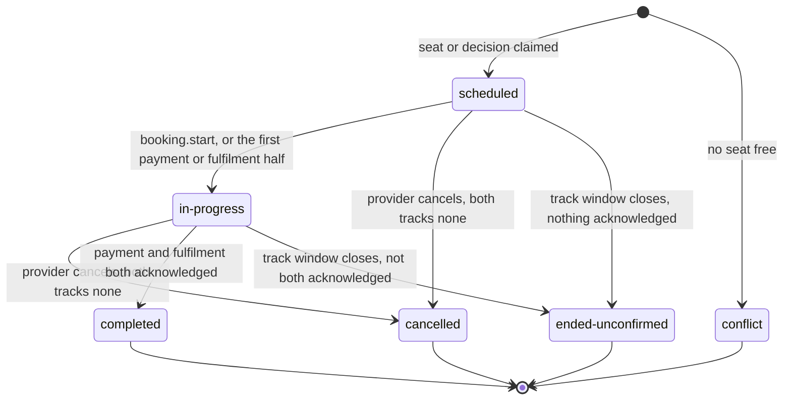
```mermaid
stateDiagram-v2
    state "in-progress" as InProgress
    state "ended-unconfirmed" as EndedUnconfirmed

    [*] --> scheduled : seat or decision claimed
    [*] --> conflict : no seat free

    scheduled --> InProgress : booking.start, or the first payment or fulfilment half
    scheduled --> cancelled : provider cancels, both tracks none
    scheduled --> EndedUnconfirmed : track window closes, nothing acknowledged
    InProgress --> cancelled : provider cancels, both tracks none
    InProgress --> completed : payment and fulfilment both acknowledged
    InProgress --> EndedUnconfirmed : track window closes, not both acknowledged

    completed --> [*]
    cancelled --> [*]
    conflict --> [*]
    EndedUnconfirmed --> [*]
```

The six states are `scheduled`, `in-progress`, `completed`, `cancelled`, `conflict` and `ended-unconfirmed`. The last four are final. A booking opens as `scheduled`, or as `conflict` when no seat is free. A `conflict` booking carries the reason `slot-taken` or `slot-unavailable`. In that case the provider's node does not countersign the agreement.

**Two tracks.** Payment and fulfilment are two separate tracks. They are not states of the booking. Each track is `none`, `claimed`, `acknowledged` or `unconfirmed`. Both parties can write to both tracks.

| Track | Who makes the claim | Who acknowledges |
|---|---|---|
| Payment | The consumer says they paid (`payment-acknowledgement`). | The provider confirms they received the payment (`payment-acknowledgement`). |
| Fulfilment | The provider says the work is done (`fulfilment-receipt`). | The consumer confirms the work is done (`fulfilment-receipt`). |

Money moves outside Roym. Roym records what each side says and cannot confirm that a payment happened. The quote says whether payment is due before or after the work. That term only decides what the Hub suggests next. It never blocks a step.

The rules of the booking:

- **Against interest.** A statement that goes against the interest of the person who signs it moves the track to `acknowledged` at once: the provider's payment half, and the consumer's fulfilment half. A statement in favour of the signer only makes the track `claimed`. A track that is `acknowledged` or `unconfirmed` does not change again. A repeated statement changes nothing.
- **First half.** The first payment or fulfilment half moves `scheduled` to `in-progress`. The provider can also move it with `booking.start`.
- **Completed.** The booking is `completed` only when both tracks are `acknowledged`.
- **Track window.** Each track stays open for 30 days after the end of the quote's schedule. With no schedule, it is 30 days after the booking opens. After that, a track that is `none` or `claimed` becomes `unconfirmed`. When both tracks are final and not both are `acknowledged`, the booking is `ended-unconfirmed`. It holds whatever claims exist.
- **Cancel.** Only the provider can cancel, with `booking.cancel` and a reason. It is possible only while both tracks are `none`. A consumer asks in the conversation. A cancel frees the claimed seat.

**Slot claiming.** One slot of the catalog can have more than one seat, up to 64. The provider's node claims the seats of a slot in order, with the create fence of the data layer. The first claim wins. When every seat is taken, the booking is `conflict` with `slot-taken`. When the slot no longer exists or has no seats, the reason is `slot-unavailable`. A quote with no slot gets one decision per agreement in the same way. A second attempt is answered with the first result.

> **Envisioned.** Not built yet. A dispute workflow, a refund, a review of a completed booking and a cancel by the consumer. Today the cancellation terms, the refund terms and the dispute path are text in the agreed terms, and the Roym `directory` settings carry a dispute path as text. A rule that the provider wins a same-instant cancel from the consumer needs a consumer cancel first, see [Storage & Write Arbitration](#storage--write-arbitration).

#### Consumer Transaction Flow

The consumer's node does the search. It talks to the SynOrg directories that the person chose, and to the provider's node only through the conversation, which carries the cards.

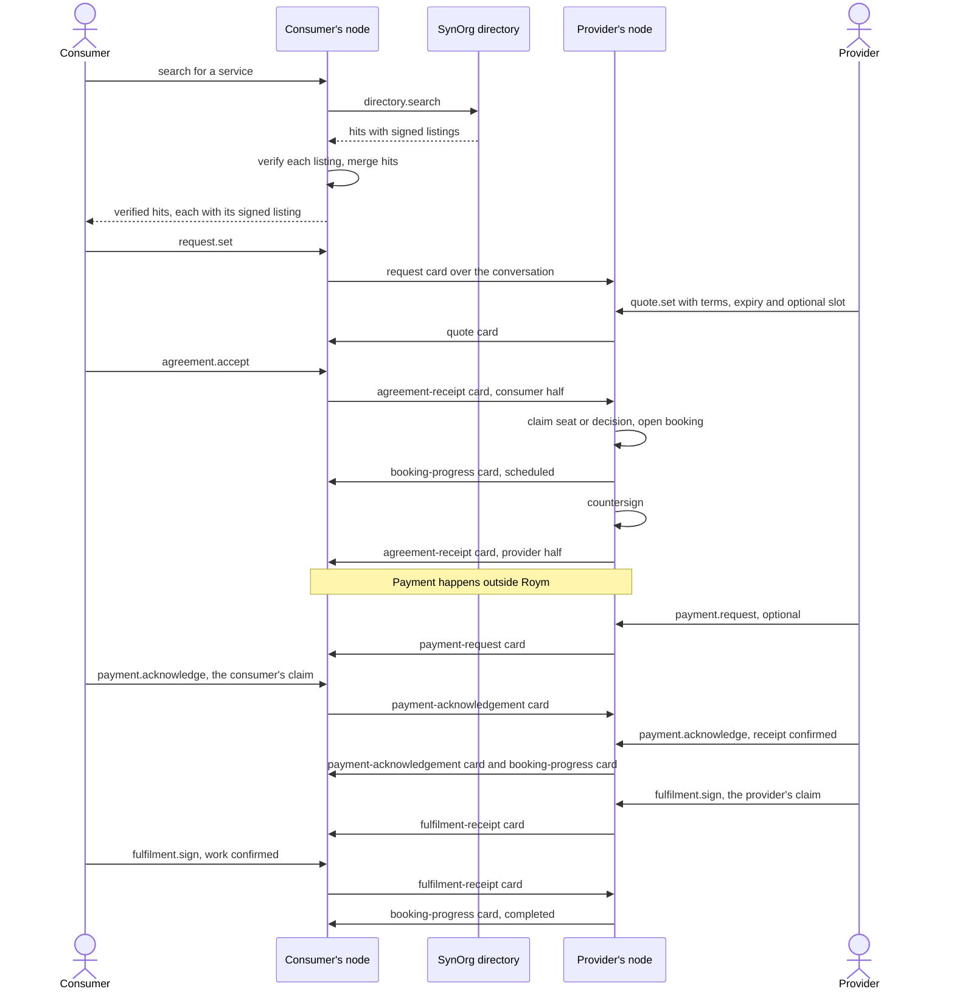
```mermaid
sequenceDiagram
    actor Consumer
    participant CN as Consumer's node
    participant DIR as SynOrg directory
    participant PN as Provider's node
    actor Provider

    Consumer->>CN: search for a service
    CN->>DIR: directory.search
    DIR-->>CN: hits with signed listings
    CN->>CN: verify each listing, merge hits
    CN-->>Consumer: verified hits, each with its signed listing

    Consumer->>CN: request.set
    CN->>PN: request card over the conversation
    Provider->>PN: quote.set with terms, expiry and optional slot
    PN->>CN: quote card
    Consumer->>CN: agreement.accept
    CN->>PN: agreement-receipt card, consumer half
    PN->>PN: claim seat or decision, open booking
    PN->>CN: booking-progress card, scheduled
    PN->>PN: countersign
    PN->>CN: agreement-receipt card, provider half

    Note over CN,PN: Payment happens outside Roym
    Provider->>PN: payment.request, optional
    PN->>CN: payment-request card
    Consumer->>CN: payment.acknowledge, the consumer's claim
    CN->>PN: payment-acknowledgement card
    Provider->>PN: payment.acknowledge, receipt confirmed
    PN->>CN: payment-acknowledgement card and booking-progress card

    Provider->>PN: fulfilment.sign, the provider's claim
    PN->>CN: fulfilment-receipt card
    Consumer->>CN: fulfilment.sign, work confirmed
    CN->>PN: fulfilment-receipt card
    PN->>CN: booking-progress card, completed
```

Notes on the flow:

- **Search.** The hit carries the signed listing, so the consumer needs no call to the provider's catalog. `catalog` refuses a caller from another node. The consumer's node verifies the listing itself. See [Cross-Substrate Discovery Flow](#cross-substrate-discovery-flow).
- **Request and quote.** `request.set` signs the request and sends it in one step. The provider's node files the card when it runs `transaction.sync`, and the provider answers with `quote.set`.
- **Agreement.** The consumer accepts the quote with `agreement.accept`. The provider's node decides the booking and countersigns. If the slot is full, it does not countersign, and the booking is `conflict`.
- **Notices.** Each node shows the card in the conversation. No push notification is sent.
- **Payment.** The provider may send a `payment-request`. The consumer pays outside Roym. Either party then records a `payment-acknowledgement`. The Hub shows a notice that Roym does not see the money move.
- **Fulfilment.** The booking is complete when the payment track and the fulfilment track are both acknowledged. The consumer's confirmation acknowledges the fulfilment track at once, even if the provider has not claimed the work. It takes effect on the provider's node when the card is filed there.

> **Envisioned.** Not built yet. A payment through an external gateway: a Stripe `PaymentIntent`, a client secret, a card confirmed with the Stripe SDK and a webhook that marks the booking as paid. Also a review that the consumer submits after the booking. Roym has no gateway code and no review record. See [Payments](#payments) and [Flexible Payment Integration](#3-flexible-payment-integration).

#### Recommendation Algorithm

**Built today.** Roym has no recommendation feature. It has search. A search sends its query to each directory that the person chose. The query can hold text, categories, an area and filters. Each directory sorts its matching listings by the `issued_at_secs` of the signed record, newest first. Ties go by `listing_id`. The consumer's node then takes hits from the directories in turn, newest first inside each directory. It takes at most 10 hits per directory and 50 per page. No score is computed. A search run is working state. The node deletes runs older than one hour when the next search starts. Beyond those runs, the consumer's node keeps no query history and no list of viewed items. Search ranking is the ordering of the answer to one query. A recommendation would suggest items with no query.

> **Envisioned.** Not built yet. No recommendation, scoring or collaborative-signal code exists. This is the design.
>
> Catalog recommendations are **client-side only**. No consumer query data is sent to third parties by the recommender. A search still sends its query to the directories that the person chose.
>
> ```
> score(item, consumer_context) =
>     0.4 × collaborative_signal     // items frequently co-viewed/co-ordered by similar consumers (local cluster only)
>   + 0.3 × semantic_similarity      // embedding distance between item description and consumer's session query history
>   + 0.2 × provider_reputation      // normalised reputation score of the provider
>   + 0.1 × recency                  // freshness of catalog entry
> ```
>
> Consumer session context (query history, viewed items) is kept **only in local app storage**, never transmitted. Collaborative signals are computed from **aggregate anonymised counts** published by the provider substrate. No individual consumer data leaves their device. The reputation design is not frozen, see [Trust & Reputation](#trust--reputation).

### Local Producer-Distributor Mesh

> **Envisioned.** Not built yet. This is the second Roym vertical, for food and small retail. Roym has no delivery component, no tracking component and no delivery state today.
>
> The design differs from the Professional Services Guild in two ways:
> - It adds `delivery-engine` and `tracking-service` components.
> - The `in-progress` state of the booking has sub-states `PREPARING`, `OUT_FOR_DELIVERY` and `DELIVERED`.

---

## Federation Architecture

### Cross-Substrate Discovery Flow

**Built today.** Discovery is what the Roym `directory` service does. Each substrate decides for itself what it asks and whom it asks. A provider signs a `listing` record and publishes it to a SynOrg directory that the provider chose (`directory.publish`, or `directory.publish-to-source` from the provider's own node). A SynOrg runs the `directory` service on its own substrate. The directory holds a member list, the listings published to it and a search index, and it answers from those. It does not forward a query to another directory. `directory.search` accepts any caller, including a stranger. `directory.publish` accepts only a caller whose identity the router has verified.

A consumer's own node runs the search. It keeps a list of up to 8 directories that the person added. The Hub starts a search run on its own node. For each directory the Hub asks the node to send `directory.search`. The node reports a limit of 3 requests in flight, and the Hub keeps to it. The node does not enforce that limit. It has its own limit of `max_concurrent_guest_http_per_service` requests in flight for each service (default 4). If the node is busy, it refuses to start a request, and the Hub retries that directory once. The node verifies the signed envelope of every listing itself. A directory's own answer never counts as verification. It keeps hits that fail verification apart from the others. It merges the verified hits by taking one from each directory in turn, with at most 10 hits per directory and 50 per page. It deletes search runs older than one hour when the next search starts, and keeps no index cache.

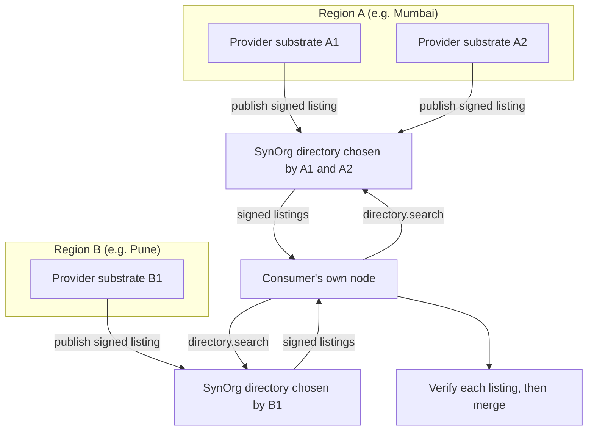
```mermaid
flowchart TD
    subgraph REGION_A["Region A (e.g. Mumbai)"]
        SA1[Provider substrate A1]
        SA2[Provider substrate A2]
    end

    subgraph REGION_B["Region B (e.g. Pune)"]
        SB1[Provider substrate B1]
    end

    DIR_A[SynOrg directory chosen by A1 and A2]
    DIR_B[SynOrg directory chosen by B1]
    CONSUMER3[Consumer's own node]

    SA1 -->|"publish signed listing"| DIR_A
    SA2 -->|"publish signed listing"| DIR_A
    SB1 -->|"publish signed listing"| DIR_B

    CONSUMER3 -->|"directory.search"| DIR_A
    CONSUMER3 -->|"directory.search"| DIR_B
    DIR_A -->|"signed listings"| CONSUMER3
    DIR_B -->|"signed listings"| CONSUMER3
    CONSUMER3 --> VERIFY[Verify each listing, then merge]
```

An aggregator is a SynOrg `directory` service that gathers the listings of many providers. The `directory` service has a client half on every installation, so any node, whether a consumer's node or a SynOrg's, keeps its own list of directories and chooses which of them to query.

> **Envisioned.** Not built yet. Today a directory does not query other directories. Envisioned: federation between aggregators, and an aggregator that proxies a query to other aggregators. Also Envisioned, as options and not the plan: leaf index shards, where a protocol Routing Schema and rendezvous hashing place each signed Publication and the consumer keeps a local index cache (see [Discovery & Matching](#discovery--matching)), and tag-routed discovery ([P2P-DSC](#p2p-dsc-tag-routed-discovery-routing-mechanics)).

### Minimum Federation Contract

A third-party SynApp is federation-compatible if it implements:

1. **Identity:** Ed25519 keypair and a `did:key` identity. Roym persons are `did:key` identities with Ed25519 keys. The DHT holds a signed endpoint record for each hosted service and the Master Anchor revocation record.
2. **Discovery:** Publishes signed records that conform to a shared schema. Roym publishes the signed `listing` record, which has a version and a fixed record-type table.
3. **Messaging:** Exchanges structured messages with its peers. Roym peers exchange end-to-end encrypted conversation messages over JSON-RPC, after a `prekey-bundle` handshake. Structured payloads are signed records sent as cards with content type `application/vnd.roym.card+json`. WIT interfaces are the boundary between a guest and its host, not between peers.
4. **Reputation:** Generates a `ReputationRecord` that conforms to a shared schema on transaction completion. See the Envisioned note below.
5. **Portability:** Exports data as a Roym archive.

> **Envisioned.** Not built yet. Today Roym has no `ReputationRecord`, and the reputation design is not frozen: see [P2P-REP](#p2p-rep-satisfaction-signal-mechanics). Also Envisioned: an identity document in the DHT, a shared Routing Schema that places each signed record (see the Envisioned note above), a generic archive format for third-party SynApps, and one check of every record against `RECORD_TYPES` before the verifiers run.

No central coordinator is required — these are convention-based contracts enforced by schema validation. Each Roym verifier that accepts a record from another party checks that the record has the type and version it expects, and refuses any other. Code that re-reads a record this node signed itself does not check the type again. The table `RECORD_TYPES` lists the twelve record types and their versions. The code does not read this table when it verifies. The `booking-progress` record is signed by the provider's service and is not in the table.


---

## Consumer Experience Architecture

### Consumer App Architecture

**Built today.** The consumer app is the Roym Hub, a web UI written in TypeScript and built with Vite. The `web` service serves it from the person's own substrate, so the person opens it in a browser. Each consumer runs their own substrate ("Option A" below). The Hub has no native shell, no Tauri project and no mobile project.

The Hub holds little state. It keeps the session token in `sessionStorage` and a delegated key in IndexedDB, as a non-extractable WebCrypto key. It has no local database. All data is in the person's own node, in its SQLite databases. The node encrypts them when encryption is enabled. The master key never enters the browser. The Hub logs in with a delegated key: it signs a challenge from the node's auth service, which has its own origin ([ADR-0024](decisions/0024-client-gateway-identity-and-auth-service.md)). A short-lived delegation certificate for that key comes from `roymctl session delegate`.

The Hub does no message crypto. Message encryption and the key ratchet run in the `conversation` service of the substrate, with `vodozemac` ([ADR-0013](decisions/0013-p2p-messaging-architecture.md)). There is no `libsignal`.

The Hub talks to its own node only. It sends JSON-RPC 2.0 over HTTP `POST /rpc` with the session token as a Bearer header. The node talks to the provider's node with the route preamble on an Iroh stream. Node-to-node calls do not use WebRTC today. Separately, a browser can reach a node through the WebRTC bootstrap page. That page registers a service worker and carries the page's HTTP requests over a WebRTC data channel. This path is tested with a sample web app, not with the Hub.

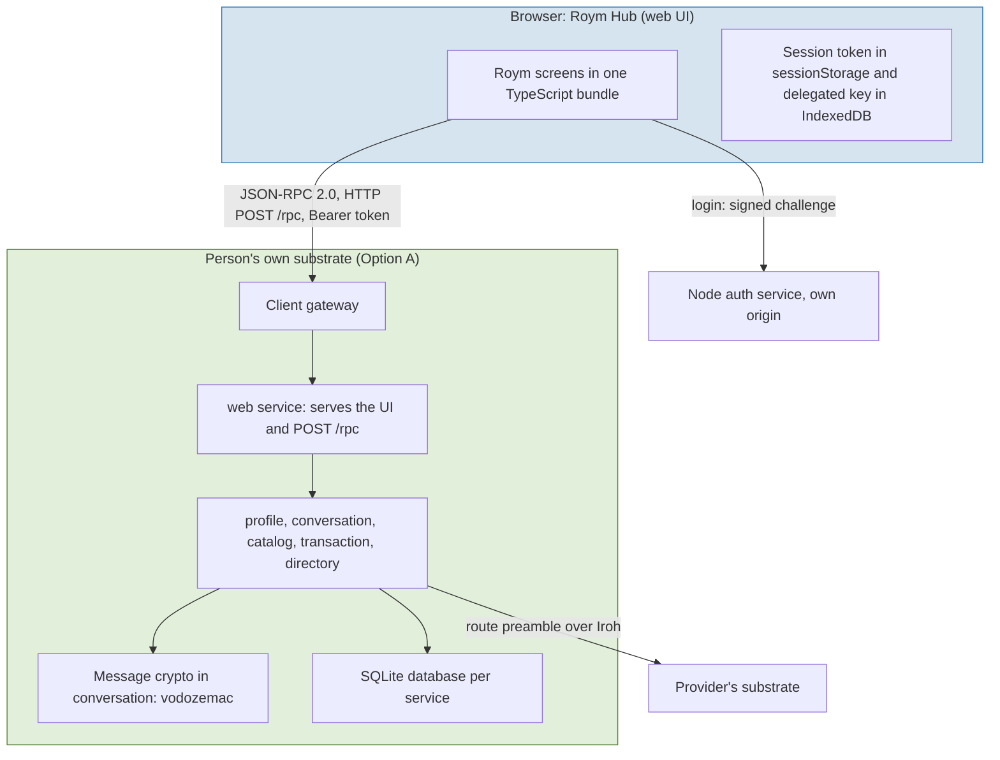
```mermaid
flowchart TD
    subgraph BROWSER["Browser: Roym Hub (web UI)"]
        UI[Roym screens in one TypeScript bundle]
        SESSION[Session token in sessionStorage and delegated key in IndexedDB]
    end

    subgraph OWN_NODE["Person's own substrate (Option A)"]
        GW[Client gateway]
        WEB[web service: serves the UI and POST /rpc]
        SERVICES[profile, conversation, catalog, transaction, directory]
        CRYPTO[Message crypto in conversation: vodozemac]
        DATA[SQLite database per service]
    end

    AUTH[Node auth service, own origin]
    PROVIDER_NODE[Provider's substrate]

    UI -->|"JSON-RPC 2.0, HTTP POST /rpc, Bearer token"| GW
    UI -->|"login: signed challenge"| AUTH
    GW --> WEB --> SERVICES
    SERVICES --> CRYPTO
    SERVICES --> DATA
    SERVICES -->|"route preamble over Iroh"| PROVIDER_NODE

    style BROWSER fill:#D6E4F0,stroke:#2E75B6
    style OWN_NODE fill:#E2EFDA,stroke:#548235
```

**Consumer identity options.** Option A is built. Options B and C are Envisioned.

- **Option A: self-hosted substrate on the person's own machine.** Every Roym participant runs a substrate. The consumer's own node holds the consumer's data and runs the search.

> **Envisioned.** Not built yet. Option B: a trusted aggregator hosts the consumer, and the consumer can migrate. Option C: a guest can browse with no account and no history. A substrate on a phone is also Envisioned. Today a substrate can hold a delegated instance key for a member it hosts, and Roym has export and import. Every Hub method that `web` forwards, except `profile.policy`, needs an owner session. `session.whoami` is answered without a session.

> **Envisioned.** Not built yet. The Hub runs in a browser today. Envisioned: a Tauri desktop app and a native mobile app. Also Envisioned: a native shell with a WebView that loads the UIs of other SynApps, native crypto bindings, an FFI connection manager, a client-side SQLite or CoreData store and a WebSocket link from the client. Today the Hub is Roym's own fixed screens. The `web` service declares a `/ws` route, but its handlers do nothing. The mobile case is in [Phase 7](#phase-7-edge-expansion).

---

## Observability Architecture

**Built today.** The substrate gives operators and developers these signals: structured log events, a plain-text health endpoint, a JSON snapshot of in-memory metrics, and health polling with alerts for apps that the control plane manages. The provider-facing part is not built: the plain-language status page, the `health-narrator` component and the tiered stack. Each block of that design is marked Envisioned. Text without a marker is built.

### Design Philosophy

Observability in Syneroym is meant for two audiences: **non-technical providers** (business health) and **support staff/developers** (technical diagnostics). Today only the second audience has signals. The provider-facing design is in [Provider-Facing Observability](#provider-facing-observability).

The substrate provides **instrumentation primitives, not bundled observability stacks**. It writes logs as JSON when configured to, and serves metrics as a JSON snapshot on a pull endpoint. No external observability service is required to operate a substrate. Routing signals to Prometheus, VictoriaMetrics or an OTLP collector is Envisioned.

### Instrumentation Layer

All instrumentation is in-process and based on open facades:

- **Tracing:** `tracing` crate (Rust). Structured events (`info!`, `warn!`, `error!`, `debug!`) in the components. The code defines no span.
- **Metrics:** `metrics` crate facade. The substrate emits these metric families:
    - `substrate.request.total`, `substrate.request.errors` and `substrate.request.duration_ms` for requests the router dispatches.
    - `substrate.connections.active` for open connections.
    - `substrate.proxy.*` for Universal Proxy calls, retries, call de-duplication, the outbox and sagas.
    - `substrate.wasm.*` for active instances, component cache size, instantiation and execution time.
    - `substrate.fdae.*` for row-level authorization (`abac_ms`, `abac_rows_denied`).
    - `substrate.conversation.outbox.dead_lettered` for messages the conversation outbox gave up on.
    - `substrate.conversation.admission.stuck` for a message that is still undecided after many re-asks (every 20th failed re-ask).
    - `substrate.system.rss_bytes`, `substrate.system.cpu_percent`, `substrate.system.open_fds` and `substrate.tokio.active_tasks`. A sampler task updates these once a second.

  Backend: an in-memory recorder (`MemoryRecorder`). A counter or gauge keeps one value. A histogram keeps every sample in a list that is never trimmed, so memory grows with the number of samples. A snapshot lists the counters, the gauges and, for each histogram, its count, sum, minimum, maximum, p50, p95 and p99.
- **Logs:** `tracing-subscriber`. The format is JSON or pretty (default pretty). The target is stdout or a file (default stdout). The file target rolls daily, in files whose names start with `syneroym.log` in the app log directory. No external sink exists.
- **Endpoints:** The `[roles.observability]` config has `health`, `metrics` and `tracing` sub-tables. `health` and `metrics` each have `enabled`, `bind_address` and `endpoint`. Each enabled one runs on its own listener. The health endpoint answers the plain text `OK` and does not inspect substrate state. The metrics endpoint answers the JSON snapshot. When no config file is given, the substrate runs in dev mode and enables both: health on `0.0.0.0:7966` at `/health`, metrics on `0.0.0.0:7967` at `/metrics`. The `tracing` sub-table (`enabled`, `service_name`, `otlp`, `sampling`) is parsed and nothing reads it, so no OTLP export exists.

### Control-Plane Health and Alerts

This is the built way to see that a managed app has failed. `roymctl app health <instance-id>` polls every substrate that hosts a service of the app instance and asks each one for the status of those services. It polls once, or repeats every N seconds with `--watch`. It records alerts unless `--no-record` is passed. It exits non-zero when a service reports a fault. A service the substrate could not decide about is not fatal unless `--strict` is passed. `roymctl app alerts <instance-id>` shows the alerts, and `--all` includes the cleared ones.

Alerts live in an alert store, the SQLite table `alerts`. `roymctl` keeps it in `alerts.db` beside the deployment journal by default. The App Supervisor keeps the same store in its own database (`supervisor.db` by default), runs the same health check in its resident loop, and serves the alerts through its `alerts` verb. It also publishes each newly opened alert, unretained, to the topic `<alert_topic>/<app_instance_id>` (`supervisor/alerts` by default) of its messaging broker. The broker keeps the topic as `svc/supervisor/<alert_topic>/<app_instance_id>`. A subscriber to the `supervisor` service gives the short form. A subscriber from any other service must give the full name that starts with `svc/`. The store holds one active row for each instance, service, substrate and kind. A repeated signal refreshes the row. A cleared signal that comes back opens a new row.

The alert kinds are `SubstrateUnreachable`, `InstanceNotRunning`, `ProbeFailing`, `CertificateNearExpiry`, `CertificateExpired`, `SupervisorSuperseded`, `RemediationExhausted`, `BindingConflict`, `PlacementChangeRefused`, `OrphanedService`, `VaultLocked`, `InstanceRevoked`, `RotationRestartPending`, `DeliveryExhausted`, `ScheduledRunFailed` and `AppIdentityMismatch`. See [LFC-MGT](#lfc-mgt-synapp-lifecycle-management-design).

### Provider-Facing Observability

> **Envisioned.** Not built yet. Today there is no `health-narrator`, no status page, no `HealthState`, no diagnostic bundle, no ring buffer, no notification dispatcher and no `syneroym observability enable` command. The signals above are what exists.

The Phase 4 design [`[ADV-OBS]`](#adv-obs-observability-enhancements) is a second unbuilt design for metrics. It keeps them in a SQLite file, `metrics.db`. This design keeps recent spans and metric snapshots in memory. The two disagree on where metrics are kept. Today metrics live only in the in-memory recorder.

#### Instrumentation Not Built Yet

- **Spans:** structured spans at every component boundary, substrate hop and async I/O point.
- **Trace id:** a correlation `trace_id` generated at the client app flows through every JSON-RPC call, queue entry, and cross-substrate message, enabling full reconstruction of any user action across nodes.
- **Signals:** order state transitions, queue depth and age, relay connection stability, merge conflict rate, component restart count.
- **External backends:** operators attach Prometheus or VictoriaMetrics by configuration. Today `/metrics` answers a JSON snapshot, not the Prometheus text format.
- **In-process ring buffer:** retains the last N spans and metric snapshots in memory. Queryable via the substrate health API without any external tool. The primary observability interface for Tier 1 nodes.

#### The `health-narrator` Component

The translation layer between raw instrumentation and provider-facing experience. A lightweight WASM component deployed as part of the substrate core that:

- Subscribes to the substrate event stream
- Maintains a rolling 7-day **plain-language event timeline** in SQLite — human-readable records generated from structured log events via templates (e.g. *"Order #47 confirmed"*, *"Connection to relay lost"*)
- Evaluates a small set of health rules producing a simple `HealthState`: Connection / Payments / Sync — each Good, Degraded, or Offline with a plain-language explanation
- Sends proactive alerts via the notification dispatcher when health degrades
- Generates **diagnostic bundles** on demand: a signed, sanitized snapshot of recent timeline events, metric snapshots, substrate version and configuration — formatted for handoff to support staff

#### Provider-Facing Status UI

Built into the substrate's own HTTP server as a static HTML page (assets bundled into the binary, no external process). Reached at the `/admin` path. Shows:

- A single honest top-level status: *Your shop is open and reachable*
- Last booking time and today's order counts — business-level signals, not technical ones
- Three plain-language health indicators: Connection / Payments / Sync
- Proactive alert banners with plain-language explanations and suggested actions
- A **Get Help** button that generates and sends a diagnostic bundle to the provider's support contact via the substrate messaging layer — one tap, no technical knowledge required

```mermaid
flowchart TD
    subgraph SUBSTRATE["Substrate (single process)"]
        INSTR["Instrumentation Layer
        tracing + metrics facades
        in-process ring buffer"]

        HN["health-narrator WASM component
        Plain-language event timeline
        Health rule evaluation
        Diagnostic bundle generation"]

        HTTP["Built-in HTTP Server
        /admin  → Provider status UI
        /health → Structured JSON API
        /metrics → JSON metrics snapshot"]
    end

    subgraph PROVIDER_UI["Provider Experience"]
        UI["Status Screen
        Shop open or closed
        Connection · Payments · Sync
        Plain-language alerts"]
        HELP["Get Help button
        sends diagnostic bundle
        via substrate messaging"]
    end

    subgraph SUPPORT["Support Staff"]
        AGG["Aggregator console
        or Syneroym support team"]
    end

    INSTR -->|event stream| HN
    HN -->|HealthState + timeline| HTTP
    HTTP --> UI
    HELP -->|diagnostic bundle over substrate messaging| AGG

    style SUBSTRATE fill:#f0f4f8,stroke:#1F4E79
    style PROVIDER_UI fill:#E2EFDA,stroke:#548235
    style SUPPORT fill:#FCE4D6,stroke:#C55A11
```

The diagram shows the target design. Today `/health` and `/metrics` are two separate listeners, and there is no `/admin` route.

#### Tiered Observability Stack

Today there is one level: the instrumentation, endpoints and logs in [Instrumentation Layer](#instrumentation-layer). The substrate does not choose a level by hardware.

| Tier | What Ships | Notes |
|---|---|---|
| **Tier 1** — Mobile / RPi | In-process instrumentation + ring buffer + health-narrator + built-in HTML status UI | No external process; zero additional footprint |
| **Tier 2** — Standard node | All of Tier 1 + optional bundled OCI stack | One-command enable; auto-profile selection based on hardware tier |
| **Tier 3** — Distributed / Aggregator | All of Tier 2 + Tempo traces + support console + managed-node aggregation | Full stack; primary interface for support staff |

**Bundled OCI stack (Tier 2+, disabled by default):** Grafana OSS + VictoriaMetrics + Loki + Promtail. All single binaries, self-hosted, low-resource. Enabled via `syneroym observability enable`. Pre-built Syneroym dashboard JSON for core substrate and SynApp metrics provisioned automatically on enable.

**Aggregator as support console:** The aggregator's Grafana instance is the primary diagnostic tool for support staff. Diagnostic bundles from managed providers arrive via substrate messaging as structured reports. Deeper diagnostics can be pulled from any managed node with provider consent, enforced by access-control policy.

**Tier 1 under aggregator:** A mobile or RPi node operating under an aggregator forwards its metrics scrape endpoint and log stream to the aggregator's bundled stack. The provider gets full dashboard visibility via the aggregator without running any stack locally.

### Simulation Testing and Replay Validation

> **Envisioned.** Not built yet. The code has no multi-node simulation harness and no property-based tests. Multi-node behavior is tested today with substrate integration and end-to-end tests.

The substrate gets a **multi-node simulation harness** for development and CI:

- Runs N substrate instances in a single test binary with a controllable fake network
- Induces partitions, delays, and node restarts deterministically
- Each write rule in [Storage & Write Arbitration](#storage--write-arbitration) gets a scenario that checks the outcome. No such simulation scenario exists today. Ordinary tests check some write rules, for example the booking slot conflict in `crates/roym_web/tests/dual_build_parity/booking.rs`.
- Property-based tests (`proptest`) verify outbox replay is idempotent for arbitrary request orderings and retries
- Simulation output carries the same `trace_id` correlation used in production — failures are immediately diagnosable from the trace

The harness is the primary validation tool for offline and reconnect behavior before it reaches a real provider's device.

## Security Architecture

### Encryption at Every Layer

```mermaid
flowchart TD
    subgraph TRANSPORT["Transport Encryption"]
        T1[Node-to-node: QUIC TLS 1.3 via Iroh]
        T2[Optional end-to-end stream layer: enc=ecdh-p256, ECDH-P256 + AES-256-GCM, any transport]
        T3[Browser-to-service: WebRTC data channel, DTLS. Signaling over WebSocket]
    end

    subgraph MESSAGING_ENC["Messaging Encryption"]
        M1["1-to-1 chat: Olm (3DH + Double Ratchet) via vodozemac"]
        M2[Group chat: owner-distributed AES-256-GCM epoch key]
        M3[Messages carried by the conversation service: signed with Ed25519, then encrypted]
    end

    subgraph AT_REST["Data at Rest"]
        R1[Service database: SQLCipher under a per-service key when storage.encryption is on. Secrets: AES-256-GCM vault rows]
        R2[Replicated backups: encrypted with provider key before upload. Envisioned]
        R3[Blob store: content-addressed optionally encrypted]
    end
```

> **Envisioned.** Not built yet. Box R2 (replicated backups) only: no replication or backup of service databases exists today, and the design is open: Litestream and Iroh WAL shipping ([PLT-RED](#plt-red-service-redundancy)) are both options. The built backup is the Roym archive, which is encrypted with AES-256-GCM under a random recovery key.

**Messaging encryption (boxes M1 to M3).** The conversation service holds the keys for each service. See [Layer 3 > Messaging](#messaging) for the feature.

- **1-to-1 chat** uses the Olm protocol: a Double Ratchet with a triple Diffie-Hellman (3DH) key exchange. The `vodozemac` crate implements it. A service has a `vodozemac` account for the ratchet and a separate Ed25519 key for signing.
- **Group chat** uses one AES-256-GCM key for each epoch. The group owner makes the key and distributes it, and starts a rekey on a schedule. Each group entry is signed by its author, and its body is sealed with the epoch key. The owner is a single point of trust for key distribution ([ADR-0013](decisions/0013-p2p-messaging-architecture.md), Amendment 1).
- **Signed messages.** A 1-to-1 message is a `DeliveryPayload`. The sender signs it with its Ed25519 conversation key, and then the ratchet session encrypts it.
- The code uses neither `libsignal` nor MLS (`openmls`). ADR-0013 Amendment 1 replaced MLS with the owner-distributed key.

**Optional end-to-end stream layer (box T2).** A caller turns it on with `enc=ecdh-p256` in the route preamble. The router then runs the handshake on any transport. The handshake is described in [Appendix > 5. Data Transfer Characteristics](#5-data-transfer-characteristics).

- **Who uses it.** The browser bootstrap page (`peer-proxy.js`) sets it on the WebSocket tunnel path. On a WebRTC data channel the page removes it, because DTLS already protects that channel. The Rust client (`SyneroymClient`) does not. Nothing else in the SDK or the gateway sets it.
- **Only the node is authenticated.** The node signs both ephemeral keys with its identity key. The caller's ephemeral key is not signed.
- **No key derivation step.** The ECDH shared secret is used as the AES-256-GCM key as it is. There is no KDF.
- **One field, two uses.** The preamble field `pubkey` is the caller's P-256 key for this handshake. The identity check reads the same field as an Ed25519 key. A stream that sets `enc=ecdh-p256` therefore cannot carry a delegation certificate, because the router rejects it. Without a certificate the caller has no verified identity.

> **Envisioned.** Not built yet. Today the handshake authenticates the node only and the shared secret is the key itself. A handshake that signs the caller's key too, a key derivation step, and separate fields for the identity key and the encryption key are not built.

### Keys: Location, Use, Loss

This table lists each key, where it lives, what it is for, and what happens when it is lost. Three parts hold keys (see Layer 2 [Substrate Internal Architecture](#substrate-internal-architecture)).

| Key | Where it lives | What it does | If it is lost |
| --- | --- | --- | --- |
| Node identity key (Ed25519) | The file `substrate.key` in the app data directory, or the path in `[identity].key`. | Gives the node its `did:key`. Signs the node's side of the `enc=ecdh-p256` handshake. | The substrate makes a new key at the next start. The node then has a new DID. |
| Person master key (Ed25519) | The file `identities/<name>.key` in the `roymctl` directory. | Is the identity of a person. Signs delegation certificates and the master anchor. | Restore it from an identity backup with `roymctl identity import` and the recovery key. |
| Temporary key and delegation certificate | Made by the caller. `roymctl session delegate` makes a key pair and a `session-auth` certificate for the Hub login. `roymctl identity delegate --scope routing` makes a `routing` certificate for a temporary DID that the caller already has. The Hub keeps its private key in the browser as a non-extractable WebCrypto key in IndexedDB. | Lets a device or a session act under the master's identity until the certificate expires. The router accepts only a `routing` or `service-instance` certificate on a stream. A `session-auth` certificate is for the login of the auth service. | Make a new pair with the master key. The router rejects a key that the master lists in `revoked_keys` of its master anchor. `roymctl` has no command that adds a person's key to that list: `roymctl identity publish-anchor` publishes an empty list. The App Supervisor can revoke the instance keys it manages. A stolen session key stops working when its certificate expires (24 hours by default for `roymctl session delegate`). |
| Node key encryption key (KEK, 32 bytes) | In node memory only. The node owner injects it with `roymctl kek inject`. | Is the root of the data keys. `roymctl kek rotate` re-wraps every DEK under a new KEK. | After a restart, no encrypted service database opens until the owner injects the KEK again. If the owner no longer has the KEK value, the wrapped DEKs cannot be opened. |
| Per-instance KEK | Not stored. HKDF-SHA256 of the node KEK with the info `syneroym:kek:v1:<service_id>` derives it when needed. | Wraps the DEK of one service. | Derived again from the node KEK. |
| Per-service data encryption key (DEK, 32 bytes) | The table `dek_store` in `substrate.db`, wrapped with AES-256-GCM under the per-instance KEK. Never in plaintext on disk. | Is the SQLCipher key of the service database. Encrypts the `_vault` rows of the service. When `storage.encryption` is off, no SQLCipher key is set and the vault rows are sealed with an all-zero key, so secrets are not protected. HKDF-SHA256 derives from it the keys for the service's blobs. | Without its `dek_store` row, or without the KEK that wraps it, the service data cannot be opened. |
| Master keys of managed app instances | The App Supervisor's own encrypted service vault. The entries are named `member-<app_instance_id>#<service_name>-<index>` and `app-<app_instance_id>`. | Are the master of each member service and of the app instance. No key leaves the supervisor in a response. | Restore them with `import-master` from the `export-master` backup. Import a member key before the first `submit`, and the app instance key before `adopt`. Without the backup, a new supervisor mints new master keys. |
| Recovery key (32 bytes) | Shown to the person once. Syneroym never keeps a copy. The option `--recovery-key-out` of `roymctl identity export` and `roymctl roym backup create` writes it to a file that the person chooses. | Encrypts the identity backup and the Roym archive (HKDF-SHA256, then AES-256-GCM). | The backup cannot be opened. |

**Certificate scopes.** A delegation certificate has one scope: `routing`, `session-auth`, `service-instance` or `record-signing`. The router accepts only `routing` and `service-instance` on a stream. A `record-signing` certificate is never accepted as a connection identity.

**The master anchor is a duty.** A master anchor is a signed record. It lists the temporary keys that the master revoked. A client that gets an anchor from the HTTP registry rejects it when it is older than 24 hours after its signing time. An anchor that comes from the DHT fallback is not checked for age today. The router rejects a stream that carries a delegation certificate when it cannot resolve a valid anchor of the master. When a registry URL is configured and the vault is unlocked, the App Supervisor republishes the anchor of each master it manages. The default interval is 12 hours. A person's master anchor is published with `roymctl identity publish-anchor`.

**What the router checks about a caller.** When the preamble carries a delegation certificate, the router checks the signature, the validity window and the scope of the certificate, that its temporary key is the key in the preamble, and that the master has not revoked that key. It does not check that the caller holds the private part of the temporary key: the preamble carries only the public key. [FND-IAM](#fnd-iam-access-control) has the details.

> **Envisioned.** Not built yet. Today the key in the preamble is asserted and is not proved. The router could check that the caller holds the temporary key, for example with a signed challenge. Only the login of the auth service checks a signature over a nonce today.

### Substrate Integrity & Remote Attestation

> **Envisioned.** Not built yet. Today the node owner injects the key encryption key by hand with `roymctl kek inject`, and the substrate makes no hardware check.

The word "attestation" in this subsection means hardware proof that a substrate runs the expected binary. It does not mean the signed attestation records of Roym, where each party signs the terms it accepted (see the [Roym spec](roym-integrated-experience-spec.md)).

In the "uncontrolled cloud" model, ensuring that a substrate is running the expected, uncompromised binary is achieved using **Remote Attestation**. Because the ecosystem spans different hardware tiers, the substrate abstracts hardware differences via a unified native RPC endpoint.

#### The Universal Attestation Endpoint
The Substrate exposes a core native endpoint (e.g., `substrate.attest(nonce)`) over its JSON-RPC interface. Depending on the physical hardware, it returns a polymorphic **Attestation Quote**:
- **`Tpm20`**: For Linux/Windows PCs and Raspberry Pis equipped with a TPM 2.0 module. Contains a hardware-signed quote of the OS Measurement Log (e.g., Linux IMA).
- **`AndroidKeyAttestation`**: For Android phones. Uses ARM TrustZone or Titan M chips to provide a Google-signed certificate chain that includes the hardware-verified hash of the Syneroym APK.
- **`AppleAppAttest`**: For iOS/Mac devices. Uses the Secure Enclave to cryptographically prove it is a genuine Apple device running an untampered version of the Syneroym App.

#### Verification Flow
1. **The Challenge**: When the Service Deployer (or Service Owner) deploys a service or is asked to unlock the database upon a node restart, they send a cryptographically secure random `nonce` to the `substrate.attest` endpoint.
2. **The Quote**: The substrate determines its hardware type, asks the local security chip to sign the `nonce` and the current software state, and returns the appropriate Quote type.
3. **Verification & Key Release**: The deployer receives the Quote, checks the type, and runs the corresponding verification logic (verifying the TPM PCRs, or the Google/Apple certificate chains). Only if the hardware mathematically proves the correct, unmodified Syneroym binary is running does the deployer release the encryption key over the network.
4. **Periodic Auditing**: The deployer can periodically re-challenge the substrate with a new `nonce` to continuously verify the node has not been tampered with while running.

### Isolation Guarantees

```mermaid
flowchart TD
    subgraph NODE2["NODE (physical machine)"]
        subgraph APP1["SynApp 1 (WASM sandbox)"]
            W1[WASM Component WASI capability-limited]
            DB1[(SQLite: one database per service)]
        end

        subgraph APP2["SynApp 2 (Podman container)"]
            P1[OCI Container run by the host's Podman. The substrate can keep its state.db outside the container]
        end

        subgraph APP3["SynApp 2 (WASM sandbox)"]
            W2[WASM Component WASI capability-limited]
            DB2[(SQLite: one database per service)]
        end

        subgraph SUBSTRATE_CORE["Substrate Core"]
            AC3[Access control in three layers: stream identity, per-service admission, row policy]
            MSG4[Proxy router: refuses a guest call to another service's native capabilities]
        end
    end

    APP1 <-->|"cross-app calls through the substrate proxy, subject to access control"| APP3
    APP1 <-->|"explicit substrate-mediated API calls only"| SUBSTRATE_CORE
    APP2 <-->|"deployed and managed by the substrate, isolation is Podman's"| SUBSTRATE_CORE
    APP1 -. "no direct access" .-> APP2
    APP2 -. "no direct access" .-> APP1

    style APP1 fill:#E2EFDA,stroke:#548235
    style APP2 fill:#FCE4D6,stroke:#C55A11
    style APP3 fill:#E2EFDA,stroke:#548235
    style SUBSTRATE_CORE fill:#D6E4F0,stroke:#2E75B6
```

**How a service is confined today.**

- **WASM guest.**
    - Instances come from a Wasmtime pooling allocator, and the store caps the memory of one guest.
    - A guest runs under an epoch deadline (wall-clock time). It also runs under a fuel limit when the service has an instruction quota.
    - The guest's `WasiCtx` is empty: no preopened directories, no environment variables and no sockets.
    - The linker holds only WASI and the Syneroym host interfaces. A guest reaches the world through these.
- **Calls between services.** A guest's outbound call goes through the Universal Proxy.
    - A guest may call a declared interface of another service. The callee decides whether to admit the caller (see Layer 2 [access control](#substrate-internal-architecture)).
    - A guest may call a native capability (`data-layer`, `vault`, `app-config`, `blob-store`, `messaging`, `http-native`, `conversation`, `signing`) only on its own service. The proxy refuses the same call on another service.
    - A guest may never reach the node-level interfaces `orchestrator` and `security` through the proxy.
- **Row policy.** FDAE filters the rows a caller may see, and can remove fields and run a per-row check. See [FND-IAM](#fnd-iam-access-control).
- **Databases.** Each service has its own database, never one shared with another service.
- **Container.** A container service still gets the native endpoints `data-layer`, `vault`, `app-config` and `blob-store`. The substrate keeps its `state.db` outside the container, and the `podman run` arguments carry no database path. The substrate calls the host's `podman` command with the bridge network and the volumes and ports of the manifest. The substrate does not check whether Podman is rootless. Run the substrate as a non-root user so that Podman is rootless (operator advice).

---

## Resolved Architecture TBD Items

This section lists the design decisions for the open items of the architecture, one row each. The Status column follows the status legend at the top of this document. **Built** means implemented. **Envisioned** means not built yet. A row that is built in part says which part is Envisioned.

| # | Item | Resolution | Section | Status |
|---|---|---|---|---|
| 1 | Migration protocol | Roym archive: encrypted under a recovery key, with person-signed service manifests (`roymctl roym backup`). A generic SynApp export (SQLite snapshot, blob store, App Spec) is Envisioned. | [SynApp Packaging & API Pipeline](#synapp-packaging--api-pipeline) | Built. The generic export is Envisioned. |
| 2 | Backup mechanism | Roym archive on demand. Continuous replication and S3-compatible backups are Envisioned: [PLT-RED](#plt-red-service-redundancy) | [SynApp Packaging & API Pipeline](#synapp-packaging--api-pipeline) | Built. Replication and S3-compatible backups are Envisioned. |
| 3 | Storage conflict model | Single writer task per service database (SQLite); write rules per record type in the Roym services, not CRDT merge | [Storage & Write Arbitration](#storage--write-arbitration) | Built |
| 4 | Conflict resolution rules per entity type | Write rules per record type (agreement decision, booking slot, listing, message, policy). The order-state rule that favours provider authority is Envisioned. | [Storage & Write Arbitration](#storage--write-arbitration) | Built. The order-state rule is Envisioned. |
| 5 | Vouching mechanics and weighting | Candidate design, not final: signed VouchRecord; weight = `base × 0.5^hops`; max depth 3; stake requirement for high-weight vouches. The reputation design is not frozen: see [P2P-REP](#p2p-rep-satisfaction-signal-mechanics). | [Trust & Reputation](#trust--reputation) | Envisioned |
| 6 | Credential format and verification | Built: a SynOrg issues a signed Roym `membership-credential` record and withdraws it with a signed revocation. Envisioned: W3C VC Data Model 2.0; the `ssi` library for issuance/verification; consumer configures trusted issuers. | [Trust & Reputation](#trust--reputation) | Built in part. W3C VC Data Model 2.0 with `ssi` is Envisioned. |
| 7 | Reputation portability mechanism | Candidate design, not final: both-party signed `ReputationRecord` anchored in DHT; portable by republishing under same identity key. The reputation design is not frozen: see [P2P-REP](#p2p-rep-satisfaction-signal-mechanics). | [Trust & Reputation](#trust--reputation) | Envisioned |
| 8 | Propagation protocol (community moderation) | Built: a SynOrg signs `member.suspend` and `member.lift` decisions about its own members. Envisioned: signed block/trust lists; propagated via DHT with decay weight; aggregators are authoritative for their cluster. | [Trust & Reputation](#trust--reputation) | Built in part. Propagation by DHT is Envisioned. |
| 9 | Anti-gaming mechanisms | Bayesian reputation average; ad boost cap (see row 15); TF-IDF keyword scoring; review bomb detection | [Trust & Reputation](#trust--reputation) | Envisioned |
| 10 | Sybil resistance | Built: rate limits on first contact (default 3 in 24 hours for one sender) and on publication to a directory (default 20 in 24 hours). Envisioned: stake requirement for vouching; rate limiting of vouches; both-party signature on reputation records. | [Trust & Reputation](#trust--reputation) | Built in part. Stake, vouch limits and reputation signatures are Envisioned. |
| 11 | Payment rails and escrow | Built: out-of-band settlement. Roym records a payment that happens outside the system, with signed `payment-request` and `payment-acknowledgement` records, and does not process it. Envisioned: UPI redirection; pluggable adapter pattern extends it without rework; escrow. | [Payments](#payments) | Built in part. UPI redirection, adapters and escrow are Envisioned. |
| 12 | Coin and mutual credit mechanics | Bilateral signed IOU ledger and Syneroym internal ledger token, sequenced after core payments; no blockchain; both need legal review before launch | [Payments](#payments) | Envisioned |
| 13 | Recommendation algorithm | Client-side scoring formula; no consumer data transmitted; collaborative signals from anonymised aggregates. It suggests items without a query, and is separate from search ranking (row 15). | [Recommendation Algorithm](#recommendation-algorithm) | Envisioned |
| 14 | Discovery partitioning and consistency model | Built: the consumer's node asks the directories that the person chose, merges the answers and verifies every listing itself. Envisioned, as one option and not the plan: publications placed via protocol routing schema + rendezvous hashing onto leaf index shards; cache-only indexes. | [Discovery & Matching](#discovery--matching) | Built in part. Leaf index shards are Envisioned. |
| 15 | Discovery ranking algorithm | Transparent weighted formula (5 signals); ad boost capped at 0.3; formula published open-source. Today there is no formula: a directory orders hits by the time of issue, newest first. | [Discovery & Matching](#discovery--matching) | Envisioned |
| 16 | Decentralised bootstrap fallback | Built: `pkarr` signed packets carry the signed endpoint record of each node to the BitTorrent DHT (BEP 0044), and the community registry is asked first. Envisioned: the bootstrap server mirrors its relay list as `pkarr` signed packets on the BitTorrent DHT; 24h local cache; community governance key. | [Bootstrap Server & DHT Fallback](#bootstrap-server--dht-fallback) | Built in part. The relay list mirror is Envisioned. |
| 17 | Ad auction mechanics and placement limits | Ad boost is a float on the Publication, from 0.0 up to the cap in row 15; no auction at first; elevated placement within local cluster only | [Discovery & Matching](#discovery--matching) | Envisioned |

---

## Appendix: Multi-Hop Relay Walkthrough

Full detail behind [Multi-Hop Relay (Federated Coordinator)](#multi-hop-relay-federated-coordinator), kept here for implementers working on the coordinator; the summary there is enough for everyone else.

Next-hop forwarding is the function `relay_to_next_hop` in `crates/router/src/route_handler/io.rs`. A coordinator runs it with no local services. A substrate runs the same code: when a stream names a service the substrate does not host, and the registry resolves that service, the substrate forwards the stream. This needs an Iroh endpoint. A substrate with none returns the error "No Iroh endpoint configured for relay forwarding".

#### Scenario Entities

*   **Public Infrastructure (Internet)**
    *   **C**: Global Coordinator (an Iroh relay server, and next-hop forwarding in the connection router).
    *   **R**: Global Registry (community registry). A node also publishes its public records to the BEP 0044 DHT when `enable_bep0044_dht` is on. When a registry is configured, the DHT publish runs only after the registry accepted the record.
*   **Public/External Edge**
    *   **Sx**: Substrate with outbound internet access.
    *   **Ax**: Synapp deployed on **Sx**.
*   **Private Subnetwork Infrastructure**
    *   **Cp**: Private Coordinator (local relay). Runs next-hop forwarding for callers that dial it.
    *   **Rp**: Private Registry (community registry). Connects outbound to **R** to forward the public records it accepts.
    *   **Sz**: Hidden Substrate. Resides purely in the private network with no external internet access.
    *   **Az**: Synapp deployed on **Sz**.

#### 1. Startup and Configuration

1.  **Public Infrastructure Starts**: Coordinator **C** and Registry **R** are brought online on the public internet.
2.  **Private Infrastructure Starts**: 
    *   Coordinator **Cp** and Registry **Rp** are brought online within the private subnetwork.
    *   **Cp** exposes a lightweight HTTP discovery endpoint (e.g., `/v1/info`) that serves its Iroh Node ID and relay configuration.
    *   **Cp** makes no call to its parent coordinator. When it has a parent (`parent_coordinator.iroh.url`), its Iroh endpoint uses the parent's relay as its home relay. With or without a parent, **Cp** waits up to 30 seconds at startup for the endpoint to come online. If the wait ends, it logs a warning and continues. The code builds the endpoint at startup, not on demand.
    *   **Rp** is configured with **R** as its parent registry (`parent_registry_url`) so it can forward the public records it accepts upward.
3.  **External Substrate (Sx) Starts**: 
    *   **Sx** uses Coordinator **C** as its Iroh relay (`parent_coordinator.iroh.url`) and registers its own record in Registry **R** (`substrate.registry_url`). 
4.  **Hidden Substrate (Sz) Starts**: 
    *   **Sz** starts in the private network and connects to its local Registry (**Rp**, set by `substrate.registry_url`).
    *   Its Iroh endpoint uses the relay named by its `parent_coordinator.iroh.url` setting. A substrate has an Iroh endpoint, and so can forward a stream, only when `communication_interfaces` has `iroh` and `parent_coordinator.iroh` is set.

> **Envisioned.** Not built yet. Today a substrate is given its relay by the fixed setting `parent_coordinator.iroh.url`. The key `coordinator_discovery_url` is declared in the config and no code reads it, and no code lists, selects or caches coordinators.

*   To find a local coordinator, **Sz** first checks its config for a direct `discovery_url` (fetching the Iroh connection details via HTTP). If not provided, it queries its local Registry **Rp** (which forwards the lookup to **R**) to discover available coordinators. It dynamically selects one (e.g., **Cp**) and caches its Iroh details.

#### 2. Registry Entries at Deployment

1.  **Ax Deployment**: 
    *   Synapp **Ax** is deployed on **Sx**. 
    *   The deployer of **Ax** (using `SyneroymClient::deploy_svc_wasm_with_options`, with a public `Publication` in the options) signs a service record and passes it to **Sx** in the deploy call. **Sx** stores the record and publishes it to its configured registry (**R** in this scenario), at deploy time and on every heartbeat.
2.  **Az and Sz Deployment**: 
    *   Synapp **Az** is deployed on the hidden substrate **Sz**.
    *   The substrate **Sz** registers itself with the local Registry **Rp**. It also replays the stored record of each service that was deployed with one (**Az**). A service deployed without a record is not registered.
3.  **Cp Registration**: 
    *   When its configuration switch (`share_in_registry`) is set and a `community_registry_url` is given, the private Coordinator **Cp** registers its Iroh key and connection details (like relay endpoints) into the global Registry (**R**). It does this once at startup, with retries if the call fails. **Cp** does not register again. The registry deletes an entry that is not refreshed within 2 hours, and the record of **Cp** has no `ttl` of its own, so this record is gone from the registry about 2 hours after **Cp** starts.
4.  **Upward Forwarding**: 
    *   **Rp** forwards the registration of each public record it accepts, here both **Az** and **Sz**, upward to the global Registry **R**. One HTTP request goes to its single parent registry for each record. Records deployed as `Internal` (private) stay on **Rp**.
5.  **Global Record State**: 
    *   The global Registry **R** now holds public records for **Az** and **Sz**. 
    *   The record of **Az** names **Sz** as its hosting substrate (`substrate_id`). The record of **Sz** is its own signed endpoint record. It carries **Sz**'s Iroh endpoint id and the relay URL **Sz** is bound to. A caller dials **Sz** through that relay.

> **Envisioned.** Not built yet. Today the record of **Cp** is an ordinary substrate-type record with the nickname `coordinator-<first 8 characters of its node id>`, and a record has no entry-point field and no topology data.

*   A coordinator registration that makes the Iroh endpoint of **Cp** dynamically discoverable for substrates relying on registry lookups.
*   A record that states that to reach **Sz**, a caller must route to the entry point **Cp**. The record also copies over the private topology, allowing **Cp** to use a registry lookup to find the specific connection details for **Sz** when transferring data.

#### 3. Communication Flow: Ax connecting to Az (Inbound to Private)

1.  **Packet Transmission**: Synapp **Ax** calls **Az** through the Universal Proxy on **Sx**. A caller outside a substrate uses the `SyneroymClient`. The caller connects to the next hop.
2.  **Global Resolution**: The caller queries its configured registry for **Az**. In this scenario that is the global Registry **R**.
3.  **Discovery**: Registry **R** responds with the record of **Az**. It names **Sz** as the hosting substrate. The lookup follows it to the record of **Sz**, which gives the Iroh endpoint id of **Sz** and the relay URL **Sz** is bound to.
4.  **Connection to Sz**: 
    *   The caller dials **Sz** through that relay (transparently using the Iroh SDK).
    *   The caller opens a stream and directly sends a connection preamble to **Sz**, containing the target service id (**Az**) and the caller's public key (`pubkey`). The preamble may also carry a delegation certificate (`delegation`) or a capability token (`ucan`).
5.  **Target Dispatch (Sz)**: 
    *   **Sz** receives the stream and reads the preamble to recognize the target is its local Synapp **Az**.
    *   If the preamble asks for `enc=ecdh-p256`, **Sz** and the caller complete an End-to-End Diffie-Hellman handshake inside the stream (see [5. Data Transfer Characteristics](#5-data-transfer-characteristics)).
    *   **Sz** dispatches the application payload to **Az**.

A caller that is given the address of a coordinator (for example **C** or **Cp**) dials that coordinator instead of **Sz**. It sends the same preamble. Then:

6.  **Routing (coordinator to Sz)**: 
    *   The coordinator receives the stream and reads the preamble.
    *   Its own endpoint registry holds no local services, so the local lookup misses. The coordinator then performs a registry lookup to find the connection details for the target service (no in-memory routing table caches are used).
    *   The next hop is the target substrate **Sz**, not another coordinator. The coordinator establishes an Iroh connection to **Sz** (with retries), forwards the preamble, and copies bytes both ways (`relay_to_next_hop`).
    *   **Sz** then handles the stream as in step 5.

> **Envisioned.** Not built yet. Today a caller reaches a coordinator only when it is given the coordinator's address. The record of a service has no entry-point field.

*   Registry **R** responds with the routing information: target entry point is **Cp** (whose public connection details are also provided). The client then connects to **Cp** first.

#### 4. Communication Flow: Az connecting to Ax (Outbound to Public)

1.  **Packet Transmission**: Synapp **Az** asks its host substrate **Sz** to send a packet to **Ax**.
2.  **Resolution**: The client on **Sz** queries the local Registry **Rp**. **Rp** answers from its own records. It returns a not-found answer for a service it has no record of. It does not ask its parent, the global Registry **R**.
3.  **Outbound Call**: When the lookup returns a record for **Ax**, **Sz** dials the Iroh address in that record with its own Iroh endpoint (the Universal Proxy). It does not send the stream to a coordinator first. If the lookup finds no record in the registry or in the DHT, the call fails with a service-not-found error. The DHT is asked only when `enable_bep0044_dht` is on, which is the default.
4.  **Forwarding by a Coordinator**: A client in the private network that is given the address of **Cp** sends the preamble for **Ax** (including its public key) to **Cp**. **Cp** reads the preamble, resolves the target through the registry, and connects outbound to deliver the stream to **Sx** (potentially via relay **C**). Because **Cp** opens a new *outbound* Iroh connection for each forwarded stream, it natively bypasses the inbound reachability limitations (NATs/Firewalls) that constrain the Ax -> Az flow.

> **Envisioned.** Not built yet. Today a substrate dials its target itself, and nothing sends a substrate's own outbound call through a coordinator. A registry does not forward a lookup to its parent.

*   **Rp** does not have a local record for **Ax**, so it queries its parent, the global Registry **R**. **R** returns **Ax**'s location (reachable directly via **Sx** on the public internet).
*   Because **Sz** has no outbound internet access, it cannot connect to **Sx** directly. It uses the **Cp** Iroh connection details it retrieved at startup (either via HTTP discovery or via the **Rp** -> **R** registry lookup), and routes the connection request through **Cp**.
*   **Sz** connects to **Cp** and sends the preamble for **Ax** (including **Sz**'s public key or an ephemeral public key). **Cp** reads the preamble, realizes the target is on the public network, and connects outbound to deliver the stream to **Sx** (potentially via relay **C**).

#### 5. Data Transfer Characteristics

1.  **End-to-End (E2E) Encryption Handshake (optional)**:
    *   Each Iroh leg is protected by the transport (QUIC, ALPN `syneroym/0.1`). A coordinator reads the preamble in clear to route the stream.
    *   The handshake runs only when the caller asks for it with `enc=ecdh-p256` in the preamble. The Rust client (`SyneroymClient`) never sets it. The browser page sets it on the WebSocket tunnel path (`crates/coordinator_webrtc/templates/peer-proxy.js`). On a WebRTC data channel the page removes it before it sends the preamble, because DTLS already protects that channel.
    *   When it is set, the endpoint that serves the service (**Sz**) and the caller perform an ECDH P-256 key exchange inside the established stream. The caller sends its ephemeral P-256 key in the preamble field `pubkey`. **Sz** replies with its own ephemeral key and an Ed25519 signature, made with its permanent identity key, over both ephemeral keys. The caller checks that signature. Both sides then use AES-256-GCM. The server side is in `crates/router/src/route_handler/encryption.rs`. The browser side is `verifyAndDeriveSharedSecret` in `peer-proxy.js`.
    *   Only the server is authenticated by this step. The caller's ephemeral key is not signed.
2.  **Opaque Forwarding**: 
    *   When the handshake ran, the application payload is encrypted at the caller and decrypted only at **Sz** (or vice versa). For a JSON-RPC route the payload is JSON-RPC 2.0 frames. wRPC is not implemented.
    *   The Coordinator **Cp** copies the bytes back and forth between streams (`copy_bidirectional`) and does not parse them after the preamble. It cannot read an encrypted payload. When the caller did not ask for `enc=ecdh-p256`, only the Iroh legs are encrypted, and **Cp** holds the bytes in clear.
3.  **Teardown**: 
    *   Once the communication finishes, either endpoint closes the stream. 
    *   Each hop independently closes its respective stream segment.

> **Envisioned.** Not built yet. Today only the server signs its ephemeral key. The planned behavior is mutual authentication: both endpoints sign their ephemeral keys with their permanent Ed25519 identity keys, so the handshake itself authenticates both ends.

---

## Consolidated Technology Stack

### Core Infrastructure & Substrate

| Layer / Concern | Technology | Notes |
|---|---|---|
| Substrate language | **Rust** (2024 edition, stable) | Memory safety; WASM compilation target; strong async ecosystem |
| Async runtime | **Tokio** 1.x | Industry standard; required by Iroh |
| P2P / relay | **Iroh** 0.97 (`iroh`, `iroh-base`, `iroh-relay`) | QUIC, NAT hole punching, Iroh relay |
| WebRTC (browser) | **webrtc-rs** (`webrtc` 0.17) | Browser-to-service via Data Channels |
| WASM runtime | **Wasmtime** 46.x (WASI 0.2) | Bytecode Alliance; component model support |
| Container runtime | **Podman** (the host's `podman` command) | No daemon; Docker-compatible CLI. Rootless use is operator advice: the engine checks neither the Podman version nor the rootless mode |
| API IDL | **WIT** (Component Model, WASI 0.2) | Single source for the host and guest component interfaces. The wire surface is separate: the route preamble and the Roym JSON envelope |
| External API | **JSON-RPC 2.0** over HTTP/1.1 and framed Iroh/WebRTC streams | Types come from WIT. Method dispatch is written by hand. WebSocket is an optional route for one app |
| Inter-component calls | **JSON-RPC 2.0** through the Universal Proxy | Local, or over Iroh QUIC to another node |
| Local storage | **SQLite** (`rusqlite` + `sqlcipher`) | Single writer per service; see Storage & Write Arbitration |
| DHT / registry | **pkarr** 6.0 + BEP 0044 DHT | Community registry first, DHT second. The bootstrap server is Envisioned: see Layer 1 |
| Observability | **`tracing`** (logs), **`metrics`** (in-process `MemoryRecorder`) | The recorder is served as a JSON snapshot on a configured endpoint |
| Configuration | **TOML** (`toml` 1.0) | Parsed into typed Rust structs and checked at startup |

> **Envisioned.** Not built yet. Calls between components use JSON-RPC 2.0 today. The goal is **wRPC**, for high-performance streaming between components.

> **Envisioned.** Not built yet. Export of traces, metrics and logs with **OpenTelemetry** (OTLP), and Grafana/Prometheus exporters. Today the configuration has `OtlpConfig` types, and the observability engine sets up logging, the recorder and a sampler.

> **Envisioned.** Not built yet. Backup and replication of service databases do not exist today. The design is open. Option 1 is **Litestream**: WAL streaming to an S3-compatible store or a peer. Option 2 is Iroh WAL shipping ([PLT-RED](#plt-red-service-redundancy)).

### SynApp & Crypto Libraries

| Concern | Technology | Notes |
|---|---|---|
| SynApp component language | **Rust → WASM** (wit-bindgen 0.57) | Primary path. The Roym services are built with `cargo component build --target wasm32-wasip2` |
| OCI services | **Any OCI image** | For services that can't target WASM. The Podman engine runs the image that the manifest names |
| 1-to-1 messaging crypto | **vodozemac** 0.10 | Olm: 3DH key exchange + Double Ratchet |
| Group messaging crypto | Owner-distributed **AES-256-GCM** group key, one key per epoch | The group owner distributes the key. There is no MLS ([ADR-0013](decisions/0013-p2p-messaging-architecture.md), Amendment 1) |
| Signed records | **Signed Roym records** (`signed_record` envelope) | Built: for example the membership credentials that a SynOrg issues |
| Payment records | **Signed Roym payment records** | Built: `payment-request` and `payment-acknowledgement`. Roym records a payment that happens outside the system and does not process it |
| Verifiable Credentials | **ssi** (Rust) | **Envisioned.** W3C VC Data Model 2.0. Not built yet |
| DRM video | **Shaka Player** | **Envisioned.** Digital content delivery. Not built yet |
| Payment processing | **Stripe Connect SDK** + UPI deep links | **Envisioned.** Pluggable adapter. Not built yet |

> **Envisioned.** Not built yet. The rows marked Envisioned name libraries that are in no `Cargo.toml` or `package.json` today.

### Consumer Frontend

| Concern | Technology |
|---|---|
| Hub UI | **HTML/CSS/TypeScript web app** (Vite), served by the `web` service from its asset bundle and opened in a browser |
| Shell / Core | **Envisioned.** **Native (SwiftUI / Jetpack Compose / Tauri)** — embedding the substrate for robust background execution |
| Mini-App UI | **HTML/CSS/JS (Web App)**. **Envisioned.** Loaded dynamically inside a native **WebView** |
| Client-side crypto | Built: browser WebCrypto (P-256 ECDH, Ed25519 verify) for the end-to-end handshake on the WebSocket tunnel path. A WebRTC data channel does not run it. **Envisioned.** Native bindings (mobile) / WASM bindings (desktop) |

> **Envisioned.** Not built yet. The native shell and the WebView host do not exist. `apps/` has only `roymctl`. The Hub is a web app that the browser opens today. Messaging crypto runs on the substrate.

### Developer Toolchain

| Tool | Purpose |
|---|---|
| Rust `stable` and `nightly-2026-04-06` | `stable` builds and tests. The pinned nightly runs `rustfmt` |
| `cargo` + `cargo-component` 0.21 | Build Rust → WASM components |
| `wit-bindgen` crate (0.57) | The macro generates host/guest bindings from WIT at build time. No `wit-bindgen` CLI is installed. Most `test-components` guests pin 0.55.0. `dual-build-fixture` uses the workspace version |
| `wasm-tools` | Installed by `mise`. No task calls it. It is available for inspecting components by hand |
| `deploy/docker-compose.community.yml` | Deploys the substrate image for a community node. It is not a local multi-service development stack |
| `cargo-nextest` | Test runner for the workspace suite |
| `cargo-audit`, `cargo-deny` | Known-vulnerability and licence checks |
| `cargo-llvm-cov` | Coverage |
| `cargo-dupes` 0.2.1 | Duplicate-code detector behind the duplication check |
| `cargo-sweep` | Prune stale `target/` artifacts |
| Node 20 | Builds and tests the Hub UI and the end-to-end tests |
| Playwright 1.60.0 (TypeScript 5.9.3) | WebRTC end-to-end tests in `crates/substrate/tests/e2e` |
| Vite, Vitest | Build and test the Hub UI (`crates/roym_web/ui`) |
| `mise run verify` (`cargo xtask verify`) | The completion gate: fmt, clippy, six xtask checks (file lengths, lint suppressions, module layout, change docs, duplication, Roym service crate dependencies), the Python planning-refs script, nextest, doctests, audit, license check and the end-to-end tests. When only docs change, it skips nextest, doctests and the end-to-end tests |
| `roymctl` CLI | Deploy and manage apps (`app`) and services (`svc`), local identities, the KEK and secrets, the App Supervisor, registry entries, sessions, aliases and short hashes, the substrate (`substrate`, alias `node`) and the Roym product commands (`roym`: record-signing enrolment and status, the service address, `directory`, `transaction`, `group` and backups) |

> **Envisioned.** Not built yet. `otelcol`, a local OpenTelemetry collector for a local observability stack. No tool list or collector configuration names it today.

> **Envisioned.** Not built yet. If the replication design uses Litestream, the toolchain adds the `litestream` CLI for backup and restore testing.

---


## Connectivity Substrate In Heterogeneous networks

**Built today.** Connectivity works over IP networks. A caller finds a service in the community registry first and in the Mainline DHT second. The SDK client needs a registry URL for this, or the mechanisms of a record that it was given. It then dials the hosting node over Iroh, which does direct QUIC, hole punching and relay. Each stream starts with a route preamble that names the protocol. The node's router accepts inbound streams from Iroh and from WebRTC and hands them to the service. The rest of this section is a general design that is not built: attachment points, BLE and LoRa gateways, ranked connection strategies, trying the next mechanism after a failed dial, protocol negotiation and the wRPC adapter. Each of these sits in a block marked Envisioned. Text without a marker is built.

---

### Overview

The system provides a **connectivity substrate** that enables application services to communicate across IP networks as if they were directly connected. The substrate hides network complexity such as NAT traversal and relays.

A caller uses the SDK client (`SyneroymClient`) to connect to a service. The client does discovery and dials the node. The node's router accepts the stream, and the node handles transport establishment and protocol adaptation. See [Application Interface](#application-interface).

The design intentionally avoids creating a global overlay routing protocol. A node that receives a stream for a service it does not host looks the service up in the registry and forwards the stream over Iroh. See [Multi-Hop Relay (Federated Coordinator)](#multi-hop-relay-federated-coordinator).

> **Envisioned.** Not built yet. A record lists `mechanisms` (Iroh or WebRTC) and not attachment points. No BLE or LoRa transport exists. The config types `parent_coordinator.ble`, `parent_coordinator.lora` and `[roles.coordinator.transport_bridge]` are parsed, and no code reads them.
>
> - **Attachment points.** Nodes expose attachment points that indicate how they can be reached.
> - **Constrained networks.** Routing inside constrained networks (e.g., BLE or LoRa meshes) is handled by gateway nodes responsible for those network domains.
> - **Transport differences.** The substrate hides the differences between these transports from the application.

---

### Identity Model

Two decentralized identifiers (DIDs) are used. Both are `did:key` identifiers: `did:key:h` followed by the z-base-32 encoding of the two bytes `0xed 0x01` and then the 32 bytes of an Ed25519 public key.

#### Node DID

Represents a **node runtime instance** responsible for networking and connectivity.

Example:

```

did:key:h<z-base-32 public key>

```

Node responsibilities include:

- discovery participation
- connection establishment
- transport management
- protocol adaptation
- hosting services

Nodes may also expose **management endpoints** for runtime operations.

---

#### Service DID

Represents a **service endpoint** running behind a node.

Example:

```

did:key:h<z-base-32 public key>

```

Applications connect to services using their service DID. A caller may also give a short alias (the nickname and a short hash of the service DID). The community registry resolves an alias. The DHT cannot, because a DHT lookup needs the full DID.

Service resolution maps a service DID to the node hosting that service. The record names the node in `substrate_id`.

```

Service DID → Node DID

```

The node's router routes incoming connections to the correct service.

---

### Discovery

Discovery uses a community registry and **BEP-0044 mutable records** stored in a distributed hash table (DHT). A caller asks the registry first and the DHT second.

BEP-0044 records have a **1000-byte value limit**, so records contain only minimal reachability information. The `pkarr` library rejects a signed packet that is larger. A record is one JSON text record inside a `pkarr` signed packet. The node publishes only its own node id in the Iroh address, and leaves out its direct addresses, to stay under the limit.

There is one record format, `EndpointInfo`. Its `endpoint_type` field gives two record types:

- Service records (`service`)
- Node records (`substrate`)

---

#### Service Record

Key: the Ed25519 public key that `service_id` names (the `pkarr` key). The DHT hashes it itself.

Value example:

```json
{
  "service_id": "did:key:h<service key>",
  "substrate_id": "did:key:h<node key>",
  "endpoint_type": "service",
  "mechanisms": [],
  "is_private": false,
  "not_after": 1790000000,
  "generation": 0
}
```

Purpose:

* identify which node hosts a service (`substrate_id`)

The record of a deployed service has an empty `mechanisms` list. A lookup that follows the service to its node copies the `mechanisms` from the node record. See [Connection Establishment](#connection-establishment).

> **Envisioned.** Not built yet. `EndpointInfo` has no `protocols` field. The caller names the protocol in the route preamble, and the router checks it against a fixed table.
>
> - A service record advertises the application protocols the service supports (for example `"protocols": ["jsonrpc"]`).

---

#### Node Record

Key: the Ed25519 public key that the node's `service_id` names. For a node record, `substrate_id` is the same as `service_id`.

Node records advertise the **mechanisms** by which the node can be reached.

Example:

```json
{
  "service_id": "did:key:h<node key>",
  "substrate_id": "did:key:h<node key>",
  "endpoint_type": "substrate",
  "mechanisms": [
    { "iroh": { "endpoint_addr_bytes": "<hex>", "relay_url": "https://relay.example.net" } }
  ],
  "is_private": false,
  "not_after": 1790000000,
  "generation": 0
}
```

Mechanism types (`EndpointMechanism`):

| Variant  | Meaning                                                                                  |
| -------- | ---------------------------------------------------------------------------------------- |
| `Iroh`   | Reachable over Iroh. It holds the Iroh address of the node and an optional relay URL.    |
| `WebRtc` | Reachable over a WebRTC peer (`peer_id`). The Rust SDK client does not dial this mechanism. |

No node publishes a `WebRtc` mechanism today. The variant is only defined.

Direct QUIC is part of the `Iroh` mechanism. The record keeps only the node id, not direct addresses, together with the optional relay URL. Iroh finds a direct path itself.

> **Envisioned.** Not built yet. Records have no typed attachment points and no gateway mechanism.
>
> Node records advertise **attachment points** where the node can be reached.
>
> ```
> nodeA
> attachments:
>   i:abc123
>   g:gw1:ble
> ```
>
> | Prefix | Meaning                              |
> | ------ | ------------------------------------ |
> | `i`    | Iroh relay/home node                 |
> | `g`    | gateway node responsible for routing |
>
> Example interpretation:
>
> * reachable via Iroh relay
> * reachable via BLE gateway `gw1`
>
> Gateway nodes publish their own node records.

---

#### Registry first, DHT second

A node publishes its record to its community registry (`POST /register`). When the DHT is enabled (`enable_bep0044_dht`), it also publishes the same signed packet to the Mainline DHT in the background. If a registry is configured and refuses the record, the publish fails.

A lookup asks the registry first (`GET /lookup/<id>`). It asks the DHT only if the registry gave no record or no registry is configured. A record that came from the DHT is then written back to the registry, so the next lookup finds it there.

A lookup checks every record it gets:

- The record must be signed by the key that its `service_id` names, and its `not_after` must not have passed.
- If the caller asked for a full DID, the registry's answer must be the record for that DID.
- A registry answer that fails these checks ends the lookup. The lookup does not fall back to the DHT.

The community registry may have a parent registry (`parent_registry_url`). A registry passes each public record on to its parent.

A coordinator that sets `share_in_registry` and `community_registry_url` registers itself once at startup, with retries. It has no republish loop.

---

#### Record freshness

- **Republish.** A substrate republishes its own record and the stored record of every service it hosts every hour. It replays the stored records as they are, because it holds no key that could sign them again. An operator can force a republish.
- **Registry expiry.** The registry removes an entry after the record's `ttl`, or after 2 hours when the record has none. A sweep runs every 15 minutes.
- **Record lifetime.** The `not_after` field is a Unix time. A node record is signed with a `not_after` 30 days ahead. A reader treats a record whose `not_after` has passed as absent. A substrate warns when a stored service record is within 7 days of its `not_after`.
- **Last writer wins.** A newer record from the same signer replaces an older one. The registry compares the `pkarr` timestamp of the signed packet and refuses an older record. It accepts a record with the same timestamp only if the bytes are identical, and then it treats the record as a refresh. The DHT applies its own sequence-number rule.
- **Generation.** The `generation` field is a counter that a reader uses to tell two records for one service apart. The registry does not enforce it.

---

#### Record visibility

A service is deployed with one of three visibility values (`Private`, `Internal`, `Public`). It decides who can learn that the service exists. `Private` is the default.

| Visibility | Record                                                  | Where it goes                                                               |
| ---------- | ------------------------------------------------------- | --------------------------------------------------------------------------- |
| `Private`  | None in a registry. `roymctl svc deploy --record-out` can write a signed record file with `is_private` set to `true`. | Nowhere. The deployer gives the record file to the callers. |
| `Internal` | `is_private` is `true`.                                 | The local registry only. It is not sent to a parent registry or to the DHT. |
| `Public`   | `is_private` is `false`.                                | The local registry, then the parent registry and the DHT.                   |

A caller reaches a `Private` service through a signed record file that the deployer gives out. `SyneroymClient::new_with_record` checks the record. If the record has no `mechanisms`, `connect()` looks up the hosting node under `substrate_id`, because a node publishes its own record to its registry and, when the DHT is on, also to the DHT. See [ADR-0018](decisions/0018-service-record-visibility.md).

---

### Node Runtime

Every host runs a substrate. A client that is not a host needs no substrate. It uses the SDK client, which builds its own Iroh endpoint.

Responsibilities of a substrate include:

* discovery: the registry client (`RegistryClient`) publishes records and looks them up
* endpoint/service registry: a local `EndpointRegistry` of the services it hosts, and, in the community registry role, the HTTP registry
* transport management: the `ConnectionRouter` accepts inbound streams
* connection establishment: it dials the next hop over Iroh, with retries, when it forwards a stream
* protocol adaptation: the router picks a fixed adaptation stage for each route

Nodes may host multiple services.

---

### Application Interface

Callers connect with the SDK client. `SyneroymClient::connect` looks the service up and dials the hosting node. `request` sends a JSON-RPC call built from a method name and parameters. `request_raw` sends a JSON-RPC request that the caller built and returns the JSON-RPC response. `passthrough` copies bytes both ways between a local TCP stream and a stream to the service.

A WASM service has no listen or accept call. The node accepts inbound streams on each transport (Iroh QUIC and WebRTC) and hands every stream to the router. The router reads the route preamble and passes the stream to the service. A TCP or container service runs its own TCP listener, and the `TcpProxy` stage connects to it. A server-side `listen` and `accept` interface is not part of the design.

Connections are byte streams. `IrohStream` and `WebRTCStream` implement `AsyncRead` and `AsyncWrite`.

On a `raw://` stream to a TCP service, the node copies bytes both ways and does not interpret or modify them. On a `raw://` stream to a WASM component, the node reads one framed first message and the `dir` parameter, then hands the stream to the guest. A `json-rpc://` route is parsed as JSON-RPC and gets the adaptation stage of its target. An `http://` route to a WASM or native service is parsed as HTTP: the node serves blobs, assets and declared routes, and treats the rest as JSON-RPC. An `http://` route to a TCP service is copied as bytes.

---

### Transport Layer

Transport adapters provide network connectivity. Two are built:

* Iroh: QUIC with NAT hole punching and relay
* WebRTC data channels, used on the browser path

TCP is not a transport here. `TcpProxy` is a service stage that forwards a stream to a TCP host and port, for container services.

Each transport accepts inbound streams and hands them to the router. A caller connects out. A WASM service never accepts connections itself. A TCP or container service runs its own TCP listener, and the `TcpProxy` stage connects to it.

The SDK client goes through the `mechanisms` of a record in order. It dials only `Iroh` mechanisms. It skips a `WebRtc` mechanism.

> **Envisioned.** Not built yet. The SDK client has no choice logic beyond the record order, and no third transport exists.
>
> - Transports are selected dynamically based on node reachability information.
> - Additional transports (for example BLE and LoRa) are added with no change to the core.

---

### Path Construction

Today the SDK client does not build connection strategies. It takes the `mechanisms` of the record and dials the first `Iroh` one. The SDK builds its Iroh endpoint with no relay and no address lookup. It uses a relay only when the record carries a `relay_url`. The record holds the node id and that relay URL, so without a `relay_url` the SDK has no address to dial. Iroh itself chooses between a direct path and the relay.

> **Envisioned.** Not built yet. No code builds or ranks strategies.
>
> The **caller node runtime** constructs connection strategies after discovery.
>
> Inputs:
>
> * local node capabilities
> * remote node attachments
> * available transport adapters
>
> Output:
>
> * candidate connection strategies
>
> Example strategies:
>
> Iroh Connectivity:
>
> ```
> strategy: iroh_connect
> iroh_node: abc123
> ```
>
> Gateway Route:
>
> ```
> strategy: gateway
> gateway_node: gw1
> target_node: nodeA
> ```
>
> Strategies are ranked by preference:
>
> ```
> direct > hole punching > relay > gateway
> ```
>
> Today Iroh orders the first three inside its library. A path represents a **connection strategy**, not a full hop list.

---

### Gateway Nodes

> **Envisioned.** Not built yet. Today a node that does not host a service forwards the stream over Iroh to the next hop (`relay_to_next_hop`). It does not bridge to BLE or LoRa.
>
> Gateway nodes bridge constrained networks such as BLE or LoRa.
>
> Example topology:
>
> ```
> Client Node
>    │
> Internet
>    │
> Gateway
>    │
> BLE Mesh
>    │
> Target Node
> ```
>
> Gateway responsibilities include:
>
> * transport bridging
> * local network routing
> * connection forwarding
>
> Caller nodes connect to a gateway and request forwarding to a target node.
>
> Example gateway request:
>
> ```
> CONNECT nodeA service svc123
> ```
>
> Routing inside the constrained network is handled entirely by the gateway.

---

### Connection Establishment

Connection establishment proceeds as follows. The SDK client (`SyneroymClient::connect`) runs these steps. The router uses the same lookup when it forwards a stream. The client needs a registry URL or a list of mechanisms that it was given. With neither, `connect` fails at once. The DHT is only a second step after a registry that is set.

Resolve service:

```
service_record = lookup(service_id)    // registry first, DHT second
```

This returns the service record. It names the node that hosts the service in `substrate_id`.

Resolve node:

```
node_record = lookup(service_record.substrate_id)
```

The client asks for this second lookup (`resolve = true`). The lookup runs only when the first record is a service record (`endpoint_type` `Service`). It copies the `mechanisms` of the node record into the result. A call to a node DID makes one lookup.

Attempt connection. The client goes through `mechanisms` in order:

- For an `Iroh` mechanism, it dials with `endpoint.connect(addr, "syneroym/0.1")`. The dial has a timeout (10 seconds by default).
- It skips a `WebRtc` mechanism.
- If the Iroh dial fails or times out, the client returns that error. It does not try another mechanism.
- If no mechanism can be dialed, the client returns "No supported communication mechanism found".

> **Envisioned.** Not built yet. The SDK client returns the first failed Iroh dial error and skips the other mechanisms.
>
> - **Try each path until one connects.** The client builds candidate paths and tries them in order until one succeeds.
>
>   ```
>   1 iroh_connect
>   2 gateway_route
>   ```
>
>   ```
>   for path in paths:
>       conn = try_connect(path)
>       if success:
>           break
>   ```

---

### Protocol Negotiation

The first line of every stream is the route preamble:

```
<scheme>://<interface>.<service_id>[?enc=...]
```

The scheme names the protocol: `json-rpc://`, `http://` and `raw://`. The scheme `wrpc://` is reserved. The node's router checks the scheme against a fixed table. It answers an unsupported protocol with a typed error.

The router picks an adaptation stage from the scheme and the kind of target service. See [Protocol Adaptation](#protocol-adaptation).

> **Envisioned.** Not built yet. No handshake exchanges protocol lists. A planned design is in [LFC-VER](#lfc-ver-versioning--migration-flow).
>
> - **Negotiation.** The client declares the intended protocol. The server checks whether the service supports it. If the protocols differ, a compatible **protocol adapter** may be selected.

---

### Protocol Adaptation

Protocol adapters allow interoperability between different application protocols. The router has three adaptation stages (`AdaptationStage`):

- `None`: the payload already matches what the service expects.
- `JsonRpcToWasm`: JSON-RPC is turned into a typed call to a function of a WASM component, and the result goes back as JSON-RPC.
- `JsonRpcToWrpc`: reserved for wRPC. The router never picks it today. A `wrpc://` stream to a WASM or native service gets the unsupported-protocol error (`-32091`).

Connection pipeline:

```
Client Application
   │
JSON-RPC
   │
Transport
   │
Server Node Runtime
   │
JSON-RPC → WASM Adapter
   │
WASM component function
```

Adapters operate at the application protocol level and do not interact with transport logic.

Adapters are deployed on the **server side** to keep clients simple.

> **Envisioned.** Not built yet. The wRPC protocol is not implemented. JSON-RPC is the only RPC wire protocol.
>
> - **JSON-RPC to wRPC adapter.** A JSON-RPC client calls a wRPC service.
>
>   ```
>   Client Application
>      │
>   JSON-RPC
>      │
>   Transport
>      │
>   Server Node Runtime
>      │
>   JSONRPC → wRPC Adapter
>      │
>   wRPC
>      │
>   Service
>   ```

---

### Connection Handling Logic

Runtime flow of a call from the SDK client:

```
look up the service record (registry first, DHT second)
look up the node record named by substrate_id, take its mechanisms
dial the first Iroh mechanism
send the route preamble
the node's router plans the pipeline (transport, encryption, adaptation, service stage)
return the stream or the response to the application
```

The router also checks the caller's identity, ends the end-to-end encryption when the preamble asks for it, and dispatches to the service.

> **Envisioned.** Not built yet. No code builds candidate paths or attaches an adapter on a protocol mismatch.
>
> ```
> resolve service DID
> resolve node DID
> build candidate paths
> establish transport connection
>
> if client_protocol != server_protocol:
>     attach protocol adapter
>
> return connection to application
> ```

---

### Routing Model

The architecture avoids global routing.

Responsibilities are separated as follows:

| Component    | Responsibility                                 |
| ------------ | ---------------------------------------------- |
| Caller node  | pick a mechanism from the record (the first `Iroh` one) |
| Transport    | carry bytes                                    |

Discovery only exposes **network entry points**, not complete network paths.

> **Envisioned.** Not built yet. No node role routes inside a BLE or LoRa network. (The `client_gateway` role is a different thing: an HTTP proxy.)
>
> | Component    | Responsibility                |
> | ------------ | ----------------------------- |
> | Gateway node | perform local network routing |

---

### Minimal Initial Implementation

The implementation includes:

Discovery:

* community registry first, BEP-0044 DHT second

Transports:

* direct QUIC, through Iroh
* Iroh NAT traversal
* Iroh relay and WebRTC relay

Protocol adaptation:

* JSON-RPC → WASM component call

Application API (SDK client):

```
connect
request / request_raw / passthrough
```

Additional transports, gateways, and protocol adapters can be added later without changing the core architecture.

---

## Target Designs (Addendum)

### Syneroym: Substrate Feature Implementation Design

This part gives the design detail for the features in the [Feature Specification](system-requirements-spec.md#post-dd864a1-target-specifications-addendum). The Layer 1 to 4 sections above are the canonical definition of the layers. Each Phase section below adds the detail for one group of topics.

> **Note:** Only sections with complex architectural considerations are expanded here. Trivial mappings are omitted.
>
> **The phases are targets.** A phase is a planned group of work, not a record that the work is done. Each Phase section has built parts and Envisioned parts. Text with no marker is built. Text under the Envisioned marker is not built. The [traceability matrix](planning/traceability-matrix.md) gives the status of each requirement.

---

## Phase 0: Core Architecture Implementation

### [TOP-PRM] Core Primitives (`SynSvc`) vs. Control Plane Overlay (`SynApp`)

*   **Manifest Compiler & Orchestrator Boundary:**
    *   **Design:** `SynApp` is redefined as an immutable `DeploymentPlan` generated from a versioned `SynAppManifest`. The `app_orchestration` crate (`crates/app_orchestration`) acts as the compiler. It parses TOML/JSON manifests, resolves topological constraints, and enforces cycle detection. It does not deploy: `roymctl` runs the compiler, the Control Plane service on each node deploys the plan, and the App Supervisor reconciles it (see [Layer 2](#layer-2--substrate-runtime), Deploy and lifecycle).
    *   **Domain Models:** Introduces strongly typed definitions for `AppBlueprintId`, `AppInstanceId`, `LogicalServiceName`, `ServiceId` (the Explicit physical ID, a `did:key:...` string), `LogicalServiceRef`, and `InterfaceName` to firmly decouple roles from execution instances. Three more types serve the resolver: `AppDid` (the app instance's own master DID), `AppScope` (`Local(AppInstanceId)` or `Foreign(AppDid)`) and `TopologyKey` (an `AppScope` plus a `LogicalServiceName`).
    *   **Dependency Resolution (ManifestCatalog):** To avoid network/filesystem I/O inside the pure planning phase, dependency resolution relies on a `ManifestCatalog` trait. `SynApp` dependencies use explicit `Spawn` (inline instantiation) or `Bind` (reference an existing `AppInstanceId`) modes.

### [TOP-ADR] Service Addressing and Resolution Topology

*   **Logical Resolution Integration (Above the Router):**
    *   **Design:** Logical resolution sits strictly *above* the physical network router. The router continues to rely on explicit `ServiceId`s (DID-keys). The resolver translates a `LogicalServiceRef` to an explicit `ServiceId` via the App Registry.
    *   **Selection Topology:** The Resolver/Selector has three modes:
        *   **Singleton:** Returns the sole eligible member.
        *   **Redundant:** Uses round-robin selection for unkeyed calls; rendezvous selection for keyed calls.
        *   **Sharded:** Selects a member by routing key. The compiler never emits it today: see the Envisioned note below this list.
    *   **Rendezvous Determinism:** Keyed `Redundant` calls, and the hash and entity-tag strategies of `Sharded`, rely on strict deterministic rendezvous hashing (used as the consistent-hashing strategy) using BLAKE3. The input is strictly length-prefixed to prevent collision vectors: `hash(len(domain_separator)||domain_separator || len(service_name)||service_name || len(routing_key)||routing_key || len(service_id)||service_id)`, where lengths are encoded as `u64` big-endian. The `domain_separator` is the `AppInstanceId` for a `Local` app and the `AppDid` for a `Foreign` app. Selection is determined by an unsigned lexicographic comparison of the 32-byte digest outputs (highest wins). In the event of a hash collision, a lexical sort of the canonical `ServiceId` bytes selects the highest value as the tie-breaker.
    *   **Scatter-Gather (Execution Pattern):** Global, cross-entity multi-range queries are unsupported natively at the routing layer. If a service requires a global range query spanning multiple chunks, the Substrate Resolver provides a `resolve_all()` method returning `{ topology_epoch, members: [ServiceId] }`. This ensures the calling application operates on an epoch-consistent snapshot. The caller is responsible for broadcasting the query, gathering results, handling partial failures, managing timeouts, and ordering/paginating the aggregated results.
    *   **Caching and Invalidation:** The resolver caches the `ResolvedTopology` (the full member set and epoch, not the selected member), keyed by `TopologyKey`. An entry is dropped when its `cache_ttl` has passed, when its `not_after` time has passed (it then fails to resolve and is not served stale), or when a caller calls `register` or `invalidate`. A cache hit does not compare epochs against the registry. There is no second, route-level cache: the proxy resolves again on each call.
    *   **Callers Outside the App:** A caller that is not part of the app instance names the app by its `AppDid`. The resolver then uses `AppScope::Foreign` and an entry that comes from a verified, signed topology document, not one that the supervisor pushed. The two-tier lookup is in [Logical Discovery for Callers Outside the App](#4-logical-discovery-for-callers-outside-the-app) ([ADR-0022](decisions/0022-two-tier-logical-service-discovery.md)).

> **Envisioned.** Not built yet. The resolver can already select a member in `Sharded` mode, but the compiler never emits `Sharded`, so nothing chooses it.
>
> - **Sharded:** Supports dynamic sub-strategies declared in the manifest. Today a manifest can declare a `sharding_strategy` and the compiler copies it into the plan, but nothing reads it to choose `Sharded`. **Important Disclaimer:** The routing layer is stateless; it determines the *target ServiceId* but does not manage data placement. Stateful sharded applications must rely on underlying replication and/or migration coordinated by ownership epochs to ensure the selected target actually holds the requested state.
> - **Hash Sharding (Pure Hash):** Uses deterministic rendezvous hashing over the entire `routing_key`. This provides statistically uniform key distribution (though not necessarily even request load, due to data skew). **Use Case:** Compute-oriented workloads or strictly point-lookup KV stores.
> - **Entity-Tag Sharding (Data Locality):** The routing key is a strict typed contract: `{ partition_key: byte[], item_key: byte[] }`. Today the routing key is plain bytes, and the resolver applies rendezvous hashing *only* to the bytes before the first `0x00`, which it treats as the `partition_key` (e.g., a tenant ID). This guarantees that requests for a specific logical entity consistently *resolve* to the same eligible `ServiceId` within a given epoch. **Use Case:** Multi-tenant SaaS or entity-bound time-series. **Caveat (Tenant Skew):** A massive entity can create a severe hotspot; apps must implement sub-sharding via a composite partition structure (e.g., `{ tenant_id: byte[], shard_id: byte[] }`) if an entity exceeds a single instance's capacity.
> - **Range Sharding (Ordered Key Space):** Maps contiguous, non-overlapping ranges of the routing key space to specific `ServiceId`s. The resolver validates the range table each time it selects a member: the chunks must be contiguous and completely cover the key space from `-inf` to `+inf` (no gaps or overlaps are allowed). It then looks up the incoming routing key in the sorted table using byte-lexicographical ordering. A manifest cannot declare `range_sharding`, because the manifest cannot name members that do not exist yet. The key space partitioning is meant to be configured dynamically via a range routing table, which is not built. **Use Case:** Stateful services (databases/KV stores) requiring ordered scan support.
> - **Weighted rendezvous hashing:** Future revisions may incorporate weighted rendezvous hashing to account for unequal service instance capacities.

### [TOP-REG] Types of Registries in the Ecosystem

*   **Contextual App Registry & Topology Resolver:**
    *   **Design:** A registry abstraction (`AppRegistry` trait) resides outside the router to manage topology state, while a separate Selector routes requests. This keeps mutable state out of the resolution path.
    *   **Persistence:** The registry holds one record for each `TopologyKey`. A record has the topology mode, the member `ServiceId`s, an optional sharding strategy, the `topology_epoch`, the `cache_ttl` and an optional `not_after` time. A record has no health, eligibility or lease field. The only implementation, `StaticInventory`, keeps the records in memory. When the substrate starts, it rebuilds them from the `service_bindings` table of `endpoints.db`.
    *   **How the registry is populated:** `StaticInventory` is the only mode. Resolved bindings are injected directly into service config — by `roymctl` in standalone mode, and by the App Supervisor on every membership change once an app instance is supervised. There is deliberately **no live registry backend that services query at runtime**; see [ADR-0021](decisions/0021-binding-propagation-and-app-supervisor.md). Selection (round-robin, rendezvous hashing, sharding) stays local to the caller, because the pushed value is the full member list, so `Redundant` and `Sharded` topologies work unchanged under push.

### [TOP-DSC] Discovery Mechanisms and Inventory

*   **Journaled Standalone Orchestration (`roymctl`):**
    *   **Design:** `roymctl` manages static inventory deployments with a Crash Consistency Deployment Journal. A deployment record has one of these states: `PLANNED`, `APPLYING`, `ACTIVE`, `DEGRADED`, `ROLLING_BACK` and `ROLLED_BACK`. A deploy writes `PLANNED`, then `APPLYING`, then `ACTIVE`, or `DEGRADED` when some services were not applied.
    *   **Crash Consistency:** If a deployment fails midway, the journal record stays `APPLYING` or `DEGRADED`. `roymctl app reconcile` computes and prints the actions that are still to do. When the app is `ACTIVE` and the caller gives a manifest, it prints the difference between the manifest and the active deployment. Running `roymctl app deploy` again with the same plan resumes the record and retries only the services that are not yet applied. Nothing rolls a deployment back, because rolling back a stateful service is itself destructive ([ADR-0021](decisions/0021-binding-propagation-and-app-supervisor.md) §5): no code writes `ROLLING_BACK` or `ROLLED_BACK`. The manifest check refuses `replicas > 1` on a service that declares a config `schema`. It treats that field as a sign of a service that holds state, because each member has its own database and the data would split. It cannot see a service that uses the data layer without a `schema`. The check also refuses a `sharding_strategy` on a service with one member, and `range_sharding`.
*   **Master Anchor Resolution:**
    *   **Design:** The router tells the Master Key from the Temporary Key. When a connection carries a delegation certificate, the router resolves the Master Anchor of the certificate's master: a signed record that lists the temporary keys the master has revoked (`revoked_keys`). It asks the community registry first and the Mainline DHT second. The router refuses the connection if the temporary key is on that list, or if the anchor lookup fails or takes more than 5 seconds. The Master Anchor is a deny list, not a list of allowed keys. An anchor that the registry returns must carry the master's signature and be less than 24 hours old. See [Identity Resolution & Revocation](#identity-resolution--revocation-the-master-anchor).
*   **Finding Providers and Listings:**
    *   **Design:** Discovery is what the Roym `directory` service does today. A node keeps its own list of directories (at most 8) and queries those. See [P2P-DSC](#p2p-dsc-tag-routed-discovery-routing-mechanics) for what is built and what is not.

### [TOP-ROB] Network & Connection Robustness

*   **Connection Handling:**
    *   **Design:** The Iroh coordinator crate keeps no connection cache of its own. A node that dials another node over Iroh calls `endpoint.connect()` and opens a new QUIC connection for each call. This holds for a proxied call (`IrohHop`) and for the router forwarding a stream to the next hop. The WebRTC bootstrap keeps a `connection_cache` of Iroh connections to peers, behind a lock, because concurrent `connect()` calls to the same peer failed without it. The client gateway and the SDK client also keep a connection between calls (see Reactive Eviction below).
*   **Retry Logic Integration:** 
    *   **Design:** Connection establishment can be wrapped in a standard asynchronous retry loop. If `endpoint.connect()` fails, it enters a backoff loop. One node-wide `retry` policy sets the limits: `max_attempts` (default 3), a first backoff of 100 ms, a multiplier of 2, a maximum backoff of 30 s, and a jitter of 10% either way. The router uses this loop when it forwards a stream to the next hop, and the coordinator uses it when it registers itself in the registry. The Universal Proxy works differently: it allows one connect attempt for each try and retries the whole call, but only when the call is idempotent or carries an idempotency key. The WebRTC bootstrap tunnel connects once and does not retry. This handles scenarios where the Iroh relay or direct peer is momentarily unreachable.
*   **Reactive Eviction & Fault Tolerance:**
    *   **Design:** Connections are not proactively monitored. Two components keep connections between requests. The WebRTC bootstrap keeps a `connection_cache`. It drops a cached connection that has a close reason before it reuses it, and removes the entry when `open_bi()` fails. The client gateway keeps one SDK client for each service and reuses its connection. It does not check that connection and does not evict it. A failed proxied call is retried only when the call is idempotent or carries an idempotency key. Stream-level errors (like an abruptly closed stream) will fail that specific stream without tearing down the underlying Iroh `Connection`, allowing subsequent multiplexed streams to succeed.
    *   **Rationale (Discarded Alternative):** We deliberately *do not* implement application-level ping/pong heartbeats to validate connection health. Standard transport-level timeouts (QUIC idle timeouts, WebRTC SCTP timeouts) are sufficient. "Evict when found out" (reactive eviction) saves bandwidth, reduces battery drain on mobile devices, and avoids the complexity of managing parallel heartbeat tasks.

> **Envisioned.** Not built yet. Today a node opens a new QUIC connection for each proxied call and each forwarded stream. The WebRTC bootstrap and the client gateway reuse connections. The SDK client keeps one connection and opens a new stream for each call.
>
> - **Connection reuse for outbound calls:** A node reuses an open connection to a peer, so a call does not pay for a new handshake. How to do this is not decided.

---

## Phase 1: Foundation & Core Infrastructure

### [FND-SEC] Substrate Security
The Substrate relies on multiple cryptographic and operating-system-level techniques to guarantee a zero-trust environment.

*   **Data at Rest & Envelope Encryption:** 
    *   **Design:** Per-service SQLite database files and blob objects are encrypted using Data Encryption Keys (DEKs). A Master Key (KEK) is injected into RAM after the substrate starts, by the node owner (`roymctl kek inject`), to unlock the DEKs, ensuring instant key rotation without massive re-encryption.
    *   **The "Unlock" Model:** DEKs are scoped to individual services. The KEK is substrate-global ([ADR-0006](decisions/0006-sqlite-encryption-sqlcipher.md)). A per-SynApp-Instance KEK is *derived* from the injected master (HKDF-SHA256, scoped by `service_id`) and wraps that service's DEK. A leaked derived key exposes neither the master nor a sibling instance's key, but the master itself still derives every instance's key, so this is defense-in-depth, not tenant isolation. Keys are *never* stored on the substrate's disk in plaintext: each DEK is stored encrypted (AES-256-GCM) in the `dek_store` table of `substrate.db`, and the KEK lives only in RAM. After a node restart, no encrypted service database opens until the node owner injects the KEK again.
    *   **Secret Vault:** Service secrets are stored as encrypted vault rows in the `_vault` table of the service's own database (`state.db`), encrypted with the service's DEK. The `reveal` host function returns the value to the calling guest. The native `vault` interface also answers `reveal`, but only for the service itself and for the owner recorded for that service. The vault never writes secret values to files or environment variables.
*   **Memory Protection & RAM Dumping Mitigations:** 
    *   **Design:** Perfectly securing a key in RAM from a determined root-level attacker is theoretically impossible without hardware enclaves, but the substrate raises the bar significantly. On Unix systems the Substrate uses OS-level memory locking (`mlock`) to prevent swapping to disk, and on Linux `madvise(MADV_DONTDUMP)` to exclude the key from core dumps. This covers identity signing keys and the KEK. If a call fails, the substrate logs a warning and continues.

> **Envisioned.** Not built yet. Today one master KEK, injected by the node owner, unlocks every service by derivation. The Podman engine passes configuration values only, and the KEK is held in memory as one value.
>
> - **IAM-gated per-instance provisioning:** A distinct, separately-injected KEK per instance (per-service as the eventual target), so one instance's KEK grants no access to another's. This is the target the derived KEK narrows toward. Per [ADR-0006](decisions/0006-sqlite-encryption-sqlcipher.md)'s Amendments, production multi-tenant-at-rest security is gated on it. Once that provisioning channel ships, a service will remain locked upon node restart until its owner provisions its own KEK into RAM through an authenticated management channel, optionally after attestation. No attestation code exists today.
> - **Podman secret injection:** A legacy Podman compatibility mode where the orchestrator injects a secret through an environment variable or an ephemeral `tmpfs` file, only when the manifest explicitly allows this degraded path.
> - **Key splitting:** Keys can be obfuscated or split in the `zeroize` memory vault when not actively executing queries, making naive RAM scraping harder. This is a mitigation, not a formal boundary against a compromised kernel or root-level attacker.

### [FND-CFG] Service Configuration

*   **Versioned Configuration Store:** On each deploy that changes something, the orchestrator flattens the `custom_config` of the `SynSvc` into a map of text keys and values (nested names are joined with `.`, array items get `[i]`) and saves it as a new configuration generation in the `config_generations` table of `substrate.db`. If the manifest declares a JSON `schema` and sets `custom_config`, the deploy checks `custom_config` against the schema first and fails on a violation. A deploy that is identical to the installed, running service (same caller) is a no-op and saves no new generation, once the node has run a full deploy of that service since it started. Running invocations keep the generation they started with; new WASM invocations read the newest generation.
*   **Dual-Target Configuration Delivery:** Configuration defined in the SynApp/Endpoint manifest is delivered differently for each execution environment:
    *   **WASM:** The path is the typed host function `syneroym:app-config`. `get` returns the value of one key and `get-section` returns every key-value pair whose key starts with a prefix. It returns non-secret configuration on demand.
    *   **Podman:** The orchestrator flattens non-secret configuration into environment variables (`-e KEY=value`). An `env` entry in the manifest overrides the same key. A volume that carries manifest-supplied files is mounted read-only.
*   **Secret Delivery:** Secrets are resolved from the Vault when a service asks for them.
    *   **WASM:** Services call `syneroym:vault/reveal` and receive the value in the calling guest. The secret is never written to the filesystem or environment.
*   **Cold Restarts & State:** WASM component instances are disposable, but service state lives in host-managed storage. The `SessionContext` (containing UCAN capabilities and claims) is tied to the incoming request and held securely within the Wasmtime host's `Store`. Applying a new configuration generation is safe for new invocations.

> **Envisioned.** Not built yet. The WASI context of a guest is empty today, and the Podman engine passes configuration values only.
>
> - **WASM compatibility shims:** WASI `environment` variables or pre-opened read-only files, as compatibility shims only for non-secret values.
> - **Podman secret delivery:** See the Podman secret injection item under [FND-SEC](#fnd-sec-substrate-security).
> - **Long-running tasks:** Long-running tasks follow the `[PLT-ASY]` restart or compensation rules when a new configuration generation is applied. No long-running task registry exists today.

### [FND-IAM] Access Control
The Access Control architecture relies on the Federated Data-Aware Authorization Engine (FDAE, [ADR-0017](decisions/0017-fdae-policy-schema-and-compilation.md)) to combine cryptographic capabilities with massive-scale relational data filtering.

*   **SynSvc Access (Host Function):**
    *   **Design:** WASM applications do not query databases directly. The WASM linker exposes the data-layer as a strictly typed WIT import (`import syneroym:data-layer/store;`).
    *   **Identity Injection:** The host function takes the caller identity from the call context that the router built. A guest cannot set it: a write carries no creator field. A write is attributed (`creator_id`) to the caller's anchor DID, or to the caller's subject DID when there is no anchor. A call that the substrate makes itself (a system, elevated or read-only local call) is attributed to the service id. The string `synapp:<app_instance_id>:svc:<service_id>` is the resource that a capability names, not the caller identity.
    *   **Execution:** It dynamically compiles the FDAE ReBAC policies directly into the SQL query before execution, and scopes all operations to the service's own database.
*   **Caller Identity at the Router:** The router builds the caller identity from the route preamble. When the preamble carries a delegation certificate, the router checks the certificate's signature, validity window and scope (`routing` or `service-instance`), checks that the certificate's temporary key is the key named in the preamble, and checks that the master has not revoked that temporary key. When it carries no certificate, the key in the preamble is accepted as the caller's own master key. The router does not check that the caller holds the private part of the key in the preamble.
*   **Comprehensive Schema Specification (Structured Policy Model):**
    *   **Design:** To eliminate runtime string lexers in the Wasm host framework, the policy language is written as a JSON document (version `fdae/v1`). An embedded JSON Schema checks it, and deserializing it produces a typed policy model for the query planner.
    *   **Registry:** Maps each object type under `definitions` to one `table` of the service's own SQLite database. Data held by another service is reached through a relation that names that `service`, not through a host extension.
    *   **Hierarchies:** Maps graph pathways (e.g., `management_chain`) with a `recursive` relation (`from_key`, `to_key`). A path has at most 32 hops, and a recursive self-join has a depth limit of 64.
    *   **Definitions:** Defines objects, data joins (`relations`), and boolean permission paths (e.g., a `union` of direct ownership vs transitive manager chain checks). A permission combines its `paths` with `union`, `intersection` or `exclusion`, and can add `conditions` that compare a caller claim with a row column.
    *   **Column Masks and Caveats:** A permission can list `fields.deny`: top-level payload keys that are removed from every row a read returns. A capability can add its own `caveats.fields.deny` and a `caveats.where` filter. The `where` filter is added with AND to the compiled row filter. A policy that declares `fields.allow`, or a dotted (nested) name in `fields.deny`, is refused when it is parsed.
    *   **Stage-4 ABAC After-Step:** A permission can set `authorize_rows` ([ADR-0017](decisions/0017-fdae-policy-schema-and-compilation.md) §7). A read that this permission admits is then passed to the service's exported `authorize-rows` function, which answers allow, deny or redact (a list of fields) for each candidate row. The function can only remove or redact rows that the SQL filter already admitted. If the service has no such export, or the function fails, answers in a wrong shape, or gets a batch above the size limit, the read is refused and returns no rows.
*   **Engine Evaluation Steps & The Pushdown Sieve:**
    *   **SQL Generation (The Pushdown):** The engine compiles each permission path with local relations into a correlated `EXISTS` subquery, nested for a chain of local relations. A path with no relation becomes a direct column comparison. When the last relation of a path is remote, the path ends in an `IN (...)` check against the fetched ids. When the last relation of a path is recursive, it merges the last two hops into one cycle-protected `EXISTS (WITH RECURSIVE ...)` block. A `union` becomes SQL `OR`.
    *   **Cross-Service Parameter Fetch:** If a path crosses a boundary (a relation that names a `service`), the engine does not run the SQL at once. It returns the pending query and a list of remote fetches. For each fetch, the caller asks the other service over the Universal Proxy for a signed `RelationshipProof` (timeout 15 s), and checks that the proof is signed by the `expected_asserter_did` of the relation. The engine then puts the returned ids into the query, and the SQL runs once. A fetch that fails or a proof that does not verify gives a permission-denied error.
*   **Dual-Mode Capability:**
    *   **Mode A (Point-In-Time Evaluation):** When verifying a specific resource handle ("Can Alice view document 12?"), the engine appends an absolute constraint (`WHERE documents.id = ?`).
    *   **Mode B (Relational Data Filtering):** When requesting a dashboard index ("Show me all documents I can see"), the engine wraps the user's base command in the compiled `WHERE EXISTS` security block as a global subquery. This forces SQLite to perform index-level pruning before the data ever reaches the Wasm guest.
*   **Performance Safeguards & Security:**
    *   **Strict Parameter Isolation:** The query compiler strictly uses native parameterized binding (`?` or `:name`) to prevent SQL injection.
    *   **Deterministic Cycle Protections:** Every recursive configuration block carries a path string (`seen`) that lists the ids already visited, and skips an id that is already in it, to break execution if cyclic loops are introduced in the user data. A depth limit of 64 is a second bound.
    *   **Instruction Watchdogs:** Generated queries execute alongside an active instruction cycle watchdog (`sqlite3_progress_handler`). If execution exceeds a fixed budget of 50,000,000 SQLite virtual-machine instructions, the statement is interrupted and the call fails with an error. The budget is a constant in the code, not a policy or node setting.

> **Envisioned.** Not built yet. Today the router does not check that the caller holds the temporary key, the watchdog budget is a fixed instruction count, and the engine runs no lookahead pass.
>
> - **Proof of possession:** The router checks that the caller holds the private part of the temporary key, for example with a signed challenge. Today the preamble carries only the public key.
> - **Policy-configurable time budget:** The watchdog budget is a time budget that the policy sets. The default must be conservative but not hard-coded into the architecture.
> - **Lookahead Optimization:** The engine reviews the permission block. If nodes share the same physical SQLite storage driver, it flags them for "Join Tree Collapse".
> - **Global Logic Short-Circuiting:** If a path evaluates to a true state (e.g., under a `union` operator), the engine instantly returns an Allowed state, bypassing further external checks.

---

## Phase 2: Core Platform Capabilities

### [PLT-DAT] Data Layer

The Data Layer provides a complete foundation for distributed application state and communication, securely accessed via typed host functions.

#### 1. Structured Data Service (Document API)
A platform-managed persistent store that `SynSvcs` use via typed host functions or RPC APIs.

*   **Unified Storage, Tailored Query ([PLT-DAT]):** To avoid data consistency or stale-data issues, the underlying physical data layer is *always* SQLite. We provide build profiles (`syneroym-oltp` vs `syneroym-olap`), but currently both rely entirely on standard SQLite for their queries. The two Cargo features exist and gate no code yet.
*   **Database Isolation (One DB per Service):** Instead of a monolithic combined database, every service gets its own independent SQLite `.db` file (`state.db`). The substrate also maintains its own separate database (`substrate.db`).
    *   *Benefits:* Each service database has its own writer task, so writes to different services do not wait for each other. It isolates failure blast radiuses. It would also let one service be replicated on its own (see [PLT-RED](#plt-red-service-redundancy)).
*   **Concurrency Architecture (Actor/Pool Model):** To handle high concurrency within a single service's database without hitting `SQLITE_BUSY` contention in Tokio, the platform uses **`rusqlite`** combined with **`deadpool-sqlite`**:
    *   *Why `rusqlite`:* The data layer requires raw access to the SQLite C API for dynamic query generation and progress handlers (they stop a query that runs more than 50,000,000 SQLite instructions, on a query under an access policy, on `aggregate` and on `query-raw`). These use cases reduce the value of `sqlx`'s compile-time query macros. Extension loading (e.g. `sqlite-vec`), WAL inspection hooks and explicit checkpoint control are further reasons, but nothing uses them yet.
    *   *Reader Pool:* Read queries (e.g., `GET`, `LIST`) are dispatched across a `deadpool-sqlite` connection pool. This enables parallel, non-blocking reads and seamlessly bridges synchronous `rusqlite` calls into the Tokio runtime via `spawn_blocking`.
    *   *Single Writer Thread:* All mutations (`PUT`, `DELETE`) are routed via an `mpsc` channel to a single, dedicated background task holding an exclusive `rusqlite` write connection. This follows SQLite's single-writer model and removes write-lock contention inside the service. A guest groups writes with `batch-mutate`, which runs in one SQLite transaction.
*   **Resource Model:**  
    *   **Collection:** A named set of records within one service database, declared with a lightweight schema. The schema is the name of the collection plus a list of indexes. Each index names a JSON field and a declared type (`string`, `numeric` or `boolean`).
    *   **Record:** One JSON object identified by a caller-supplied string `id`.
    *   **`creator_id`:** A first-class field on every record, set automatically by the service at write time (spoof-proof).
    *   **Schema & Indexing:** Declares indexed fields explicitly. The host does not use the declared type today. Every index is a SQLite expression index, `json_extract(payload, '$.field')`. A write is checked only to be valid UTF-8 JSON: unknown fields are accepted and field types are not checked. *Constraint:* In SQLite, `CREATE INDEX` requires an exclusive write lock. For very large collections, background schema evolution will temporarily block the single writer thread for that specific service, though read pools remain unaffected.
*   **CRUD & Batch Operations:** Operations include `create-collection`, `drop-collection`, `put` (upsert), `patch` (merge), `get`, `query` (list), `aggregate`, `delete` and `delete-many`. `create` inserts rows only when none of their ids exists yet, so it is a fence for two calls that must not both succeed. `batch-mutate` performs atomic, multi-record mutations within a single SQLite transaction. `check-access` asks whether the policy allows an operation on a record. `execute-ddl` and `query-raw` are privileged and are described below.
*   **Query & Aggregation Model:** Queries use a MongoDB-style JSON filter document (e.g., `{"age": {"$gt": 18}}`) rather than raw SQL text or a typed WIT variant — see [ADR-0007](decisions/0007-data-layer-wit-interface.md). The host compiles this to parameterized SQLite internally with cursor-based pagination; the engine is always SQLite, and "MongoDB-style" describes only the JSON wire syntax and operator vocabulary (chosen because it doubles as a common REST filter convention *and* gives the platform a mature, versioned spec to grow aggregation expressivity into). `aggregate` takes a JSON aggregation document with the stages `$match`, `$group`, `$having`, `$project`, `$sort`, `$limit` and `$skip`. It translates them onto SQL constructs (`GROUP BY`, `HAVING`) rather than inventing a parallel syntax, and it targets physical collections only. `aggregate` is refused with permission-denied when the policy masks fields or has a stage-4 ABAC after-step, because a sum or an average could leak a masked or denied value. Trusted services needing expressivity beyond the JSON filter DSL (arbitrary joins, window functions, CTEs) use a separate privileged raw-SQL escape hatch gated to the same trust boundary as DDL — see [ADR-0011](decisions/0011-privileged-raw-sql-query.md).
*   **Schema Initialization (DDL Lifecycle Hooks):**
    *   *Design:* Each stateful `SynSvc` exports `init()` (invoked on first deploy, fresh DB) and `migrate()` (invoked on re-deploy, existing DB) lifecycle hooks. Within these hooks the guest runs standard SQLite DDL (`CREATE TABLE`, `CREATE VIEW`, `CREATE INDEX`, `ALTER TABLE`) through the `execute-ddl` host function, which needs the `data-layer/admin` capability on the service's own resource. The lifecycle `init` and `migrate` calls carry it. A normal invocation does not, and is rejected — see [ADR-0007](decisions/0007-data-layer-wit-interface.md).
    *   *Safety:* Plain SQL is safe to start with because each service has its own fully isolated `.db` file. A buggy or malicious DDL statement can only affect the service's own database, which is already gated by IAM access control.
    *   *Views in Init:* `CREATE VIEW` statements in the init DDL are instantaneous (zero write-lock penalty). `aggregate` does not accept a view yet.
*   **Logical Names and Public Aliases:** 
    *   **Problem:** Service IDs are DIDs. Manifests and policies need human-readable role names.
    *   **Design:** The app-context registry maps logical names (for example, `org-service`) to explicit service IDs inside a `SynApp Instance`. Resolution order is: `manifest pin → app-context registry/cache`, and for an app known only by its DID, the signed topology document of [ADR-0022](decisions/0022-two-tier-logical-service-discovery.md) (see [LFC-MGT](#lfc-mgt-synapp-lifecycle-management-design)). The app-context step involves **no remote query**: its entries are pushed into the service's own configuration and resolved in process ([ADR-0021](decisions/0021-binding-propagation-and-app-supervisor.md)). The community registry also derives a short alias, `<nickname>-<short hash of the DID>`, from the nickname in the signed endpoint record of a service. That alias is a discovery hint, not a replacement for manifest-pinned dependency resolution.
*   **Object Service (Blob Store):** 
    *   **Design:** Blob content is addressed by SHA-256 hash. The node sets one blob quota in its `storage.blob_store` configuration and applies it to each service: a size limit per blob (default 100 MiB) and an optional total per service. Individual services store blob hashes as ordinary fields in structured records.
    *   **Durability:** The durable backend is configurable: a local directory, or S3-compatible object storage (the optional `aws` Cargo feature). With an S3-compatible backend the provider is responsible for redundancy. Blob durability is never guaranteed by SQLite WAL replication, which would only cover structured record state.

> **Envisioned.** Not built yet. Today a service has one state database (`state.db`) on one node. The data layer sets no WAL pragma on `state.db`, so SQLite's default journal mode is in use. Only the per-service queue file `async.db` runs in WAL mode.
>
> - **Logical Data Services ([PLT-DAP-01]):** The data service acts as a logical router. Rather than tightly coupling a dataset to a single physical SQLite database, the `SynApp` defines a dataset that can be physically sharded across multiple Substrate nodes transparently. *(Design TBD: How the Orchestrator discovers which node holds which shard, and how data routing tables are maintained).*
> - **DuckDB:** Using **DuckDB** in the `olap` profile via its SQLite-scanner extension is explicitly deferred to Future Product Phases.
> - **WAL mode and tuning:** Running the `state.db` of a service in WAL mode, with WAL inspection hooks, explicit checkpoint control, extension loading (e.g. `sqlite-vec`) and other SQLite tuning. Replication by WAL shipping would also need WAL mode (see [PLT-RED](#plt-red-service-redundancy)).
> - **Aggregation over views:** `aggregate` over the logical views that init DDL defines. Today it targets physical collections only.
> - **Structured data model:** A structured `data-model` alternative to raw SQL is reserved for when the platform is opened to untrusted third-party developers who should not be permitted to run arbitrary DDL. At that point, raw-SQL DDL can be restricted via IAM policy.
> - **Peer-to-peer blob replication:** In a pure peer-to-peer deployment with no S3-compatible backend configured, Syneroym's own peer-to-peer blob replication across Substrate nodes (see [PLT-RED](#plt-red-service-redundancy)). Content-addressing makes this simpler than WAL/log replication: no ordering or sequence invariants, just ensuring a verified copy of each hash exists on the configured number of peer nodes.

#### 2. Messaging: Pub/Sub and Bidirectional Streaming ([PLT-DAP-04], [PLT-DAP-06])
To provide decoupled event routing and generic point-to-point streaming without relying on heavy external infrastructure, the Substrate exposes both under a single `syneroym:messaging` WIT package, following an Inversion-of-Control (IoC) pattern: the guest is purely synchronous business logic; the host owns every Tokio task, QUIC stream, and MQTT route. The guest registers intent (subscribe to a topic, register a stream protocol) and the host *pushes* events into the guest; where the guest must produce a large output (a stream of bytes), it hands the host a stateful resource that the host *pulls* from in a loop, rather than returning an async stream itself (WASI async streams are not yet stable across runtimes — see [ADR-0010](decisions/0010-mqtt-broker-rumqttd.md)).

*   **Embedded Broker (Pub/Sub):** The Substrate runs one in-process `rumqttd` MQTT broker ([ADR-0010](decisions/0010-mqtt-broker-rumqttd.md)). It is *not* a classical centralized TCP broker: it binds no network listener, and the only way in or out is an in-process link. It provides the semantic decoupling of MQTT, optimized for UI updates and IoT telemetry. The guest interface exposes `publish`, `subscribe` and `unsubscribe` with a topic and a payload. QoS settings and retained messages are not part of it.
*   **Topic Namespace:** Every topic is prefixed with `svc/<service_id>/`, using the service id of the caller. A subscribe that names a full `svc/<other_service>/...` topic is used as written, which is an explicit cross-service opt-in. A publish always gets the caller's own prefix, even when the topic already starts with `svc/`, so a caller cannot publish into the namespace of another service.
*   **Protocol Bridge Design:** The Syneroym Rust host embeds the messaging capability natively, as its own crate (`syneroym-mqtt-broker`). The router of the broker runs on its own OS thread, and the forwarding tasks are Tokio tasks. External clients (via JSON-RPC or the HTTP bridge below), internal host tasks, and WASM components can all trigger publish, subscribe, or stream-protocol registration.
*   **The WASM Boundary (WIT):** For WASM applications, interaction with the messaging system occurs via a lightweight host boundary, split into host-imported triggers, a guest-exported push surface, and a pair of stateful, **guest-implemented** resources — a pull-direction iterator for guest-produced streams and a push-direction sink for guest-consumed streams. `stream-types` is exported (not imported) by the guest world specifically because the host calls methods *on* an instance the guest returns, the reverse of `blob-store`'s host-implemented `blob-writer`/`blob-reader` — see [ADR-0014](decisions/0014-quic-stream-protocol-routing.md) "Resource Mechanics":
    ```wit
    interface host-api {
        variant messaging-error { permission-denied, internal(string) }
        publish: func(topic: string, payload: list<u8>) -> result<_, messaging-error>;
        subscribe: func(topic: string) -> result<_, messaging-error>;
        unsubscribe: func(topic: string) -> result<_, messaging-error>;
        register-stream-protocol: func(protocol: string) -> result<_, messaging-error>;
    }
    interface stream-types {
        resource stream-cursor {
            // Ok(Some(chunk)) per chunk, Ok(None) on clean EOF, Err aborts.
            next-chunk: func() -> result<option<list<u8>>, string>;
        }
        resource stream-sink {
            push-chunk: func(data: list<u8>) -> result<_, string>;
            finalize: func() -> result<_, string>;
        }
    }
    interface guest-api {
        use stream-types.{stream-cursor, stream-sink};
        handle-message: func(topic: string, payload: list<u8>) -> result<_, string>;
        // `protocol` disambiguates which of this service's (possibly several)
        // registered protocols the request is for — ADR-0014 deviation 1.
        handle-stream-request: func(protocol: string, peer-id: string, request-data: list<u8>) -> result<stream-cursor, string>;
        accept-stream-upload: func(protocol: string, peer-id: string, metadata: string) -> result<stream-sink, string>;
    }
    world messaging-guest {
        import host-api;
        export stream-types;
        export guest-api;
    }
    ```
*   **Pub/Sub Execution Flow:** When a caller (such as a WASM component calling `host-api::publish`) triggers a publish event, the host routes it to the broker. The broker is a local in-process `rumqttd` task ([ADR-0010](decisions/0010-mqtt-broker-rumqttd.md)), owned by whichever node hosts the target service. A caller on a different physical node reaches it the same way it reaches any other cross-node host-function call, via the standard RPC/native-dispatch routing (JSON-RPC 2.0), exactly as a cross-node `data-layer` call is routed to wherever that service's SQLite file lives; there is nothing pub/sub-specific about this. Subscriptions of a WASM service are persisted by the host (the `messaging_subscriptions` table in `substrate.db`, replayed on startup). The subscriptions of a natively linked app are not persisted and do not survive a restart. When delivering to a WASM component, it invokes the guest-exported `guest-api::handle-message` through the normal Wasmtime invocation path; a component that doesn't export it has its subscription registered but messages are discarded, with only a debug log. A native (non-WASM) subscriber gets push delivery over its own live connection instead — see `SyneroymClient::subscribe` / `MessageStream`.
*   **Streaming Out Execution Flow — Guest as Source:** A guest calls `host-api::register-stream-protocol` to declare interest in direct, 1-to-1 streams on a protocol namespace (persisted via the existing `EndpointRegistry`, not a separate table — ADR-0014 deviation 2). When a remote peer opens a QUIC stream against that namespace requesting data, the host routes the request to `guest-api::handle-stream-request(protocol, peer-id, request-data)`. If the guest wants to fulfil it, it allocates its own internal cursor state (e.g. a file offset) and returns a `stream-cursor` resource; the host then loops `next-chunk()` in an async Tokio task, transmitting each chunk over the Iroh QUIC stream until the guest returns `Ok(None)` (EOF) or `Err` (abort), at which point the host drops the handle and closes the stream. This direction mirrors the `blob-writer`/`blob-reader` resource pair from the blob-store WIT, but is guest- rather than host-implemented.
*   **Streaming In Execution Flow — Guest as Sink:** The reverse direction, for a remote peer *sending* a large upload (e.g. an HTTP `PUT` bridged onto messaging, or a peer-to-peer file push). The host accepts the inbound QUIC stream and calls `guest-api::accept-stream-upload(protocol, peer-id, metadata)` to ask the guest whether it wants the data. If yes, the guest allocates its own sink state (e.g. an open file handle or a `data-layer`/`blob-store` write session) and returns a `stream-sink` resource. The host then runs an async Tokio loop reading off the QUIC stream: for each chunk that arrives, it synchronously calls `stream-sink::push-chunk(data)`, and when the QUIC stream closes, it calls `stream-sink::finalize()` so the guest can commit and release its state. A guest that declines (`Err` from `accept-stream-upload`) causes the host to close the incoming stream without ever creating a sink; `push-chunk` returning `Err` mid-upload aborts without ever calling `finalize`.
*   **HTTP Passthrough:** The target node's own hyper server (`RouteHandler::handle_http_stream`, `crates/router/src/route_handler/http.rs` — not `client_gateway`, which is a byte tunnel that only sniffs the `Host:` header) bridges conventional HTTP verbs onto the same native-dispatch surface used above, per a per-service `http_routes` table declared in `ServiceConfig.custom_config`: `GET`/`POST`/`PUT`/`PATCH` map onto `data-layer` and `messaging::publish`; `GET /blobs/{hash}?svc=&exp=&sig=` resolves `blob-store`'s signed-URL scheme over a live streaming response body; `GET` with `Accept: text/event-stream` on a topic-mapped route subscribes via the same `MqttBroker::subscribe` the native push-delivery path above uses, re-emitting each message as an SSE frame; a chunked `PUT` drives the stream-protocol machinery from the previous bullet (`accept-stream-upload`/`stream-sink`) directly, with no separate blob-writer upload path. A `guest` target hands the request to the deployed component's own `syneroym:http/incoming-handler#handle-request` export — reached by calling the sandbox engine directly, since an `http-native` connection always resolves to a `NativeService` pipeline and can never reach a guest through the JSON-RPC bridge. A `websocket` target upgrades the connection and hands each frame to the guest; the app defines the frames. All bodies share one streaming-response-body type (`UnsyncBoxBody<Bytes, Infallible>`) so SSE, large blob `GET`s, and chunked uploads reuse the same infrastructure.
*   **Caller Identity on the Bridge:** The `data-layer` targets and `messaging` `publish` require a verified caller identity before dispatch: `HandshakeVerifier::verify_preamble` is mandatory, an anonymous caller is rejected before the native service is invoked (bridged routes return HTTP 401), and `creator_id` is the caller's DID, not the callee service. The `messaging` `subscribe-sse` operation and the `stream` target do not go through that check. `subscribe-sse` subscribes to the broker with no caller gate, and `stream` reaches guest code directly (a known gap, tracked in `deferred-backlog.md`). The `guest` and `websocket` targets are authenticated by default. They reach guest code with no verified caller only when the route explicitly sets `public: true`. `public` gates only a direct anonymous connection (WebRTC, or raw QUIC presenting no usable pubkey and no delegation). Nothing reached through the local client gateway or any `SyneroymClient` is anonymous, because both always self-assert a pubkey, so `caller` is `Some` there and the 401 never fires. `public: false` therefore separates "no identity at all" from "some self-asserted identity", and is not itself authentication.

> **Envisioned.** Not built yet. The broker has no replication. Its topic log would be synchronised to peer nodes by pull-based log replication over Iroh QUIC streams, rather than raw TCP, so that the state of the broker survives the loss of its hosting node. This would share its replication primitive with the database replication proposal in [PLT-RED](#plt-red-service-redundancy). It is a redundancy and failover feature, not a prerequisite for cross-node pub/sub to function.

#### 3. Universal Proxy (Inter-Component RPC)
The Substrate provides strictly typed networking between services. Static composition can be zero-overhead; dynamic proxying adds host and transport overhead by design.

A component calls another service, local or remote, through an **explicit** guest-facing WIT interface, `syneroym:proxy/proxy::call(target, interface, method, params, options)` (`crates/wit_interfaces/wit/proxy/proxy.wit`). The target is a DID or a declared dependency name. The host resolves a dependency name against the component's own app instance **per call** rather than baking the route in at instantiation ([ADR-0021](decisions/0021-binding-propagation-and-app-supervisor.md) §2). A rebinding pushed by the App Supervisor therefore takes effect on the next call without recycling the component, and a guest never holds a target DID of its own, so it cannot go stale against one. Routing is over **JSON-RPC 2.0**, the one call surface of the substrate. A call to the native capabilities (`data-layer`, `vault`, ...) of *another* service is refused with `permission-denied`: a component reaches its own through its host imports. Idempotent and keyed calls are retried with exponential backoff (`ProxyRouter::invoke_remote_at`, `crates/router/src/proxy/router.rs`). Each try makes one connect attempt (`crates/router/src/proxy/hop.rs`). A keyed call from a guest that fails is dead-lettered in the cases listed in [PLT-ASY](#plt-asy-asynchronous-operations--scheduling). When the substrate itself makes the call (a native origin), the signed identity proof of the caller forwards across a cross-node hop and is re-verified at the destination (ADR-0016 §6). A call made by a guest never forwards the proof of its caller. It presents the instance certificate of the guest service when the service holds a valid one and has a recorded owner. Otherwise the target sees an anonymous caller. Capabilities themselves never cross the wire.

> **Envisioned.** Not built yet. The design below intercepts generic WIT imports and uses wRPC as the wire. Today the call is explicit and the wire is JSON-RPC 2.0. Static composition is not built either.

*   **Protocol Translation Architecture:**
    *   **WIT Interception and Late Binding:** Dependencies are declared as generic WIT imports (e.g., `import acme:booking/service;`). At instantiation, the Substrate satisfies these imports by injecting dynamically generated proxy host functions. When the WASM component invokes the import, execution traps to the host proxy. The developer codes against generic contracts; the Substrate handles disambiguated instance routing.
    *   **Design:** Once trapped, if the target is another native WASM component, the target design serializes the call into **wRPC** (a highly efficient binary streaming protocol) and transmits it over encrypted **Iroh QUIC** streams to the correct instance. Until the wRPC surface is implemented, this path remains an explicit future target and JSON-RPC remains the available bridge.
    *   **Native Host Service Proxying:** If the target is a native host service (e.g., the `syneroym:data-layer/store` WIT import) mapped to a remote instance, the Substrate behaves identically. It proxies the call via wRPC to the remote Substrate, which receives the call and executes its *own* native host service implementation (e.g., executing against its local SQLite file).
    *   **Static Composition Bypass:** If the component and its dependency are statically composed into a single `.wasm` binary prior to deployment (e.g., via `wasm-tools compose`), the import is satisfied internally. The Substrate never sees the import, no proxy is injected, and the call executes entirely within the WebAssembly sandbox with zero-overhead.

#### 4. Data Pipeline Streams (`syneroym:data/stream`) ([PLT-DAP-05])
> **Envisioned.** Not built yet. The code has no `syneroym:data/stream` interface and no Arrow dependency.

> **Not the same as `syneroym:messaging`'s bidirectional streaming ([PLT-DAP-06], §2 above).** This interface is Arrow/Substrait-specific and reserved for the DataFusion pushdown pipeline; it is not a general-purpose byte stream and guests never register or handle it directly the way they do `syneroym:messaging`.
*   **Design:** Distinct from the decoupled MQTT API, this transport is purely the I/O channel for structured, direct, point-to-point data shuffling between network nodes (e.g., during map-reduce or federated query execution). It passes structured record batches (like Apache Arrow). Note that relational operators (like `filter`, `project`, `sort`) are not part of this stream interface; they are executed by the embedded DataFusion engine processing the Substrait plan (via `syneroym:data/transform`), which then pushes its final outputs into this transport stream.
    *   *WIT Sketch:* `interface stream { pull-batch: func(handle: stream-handle) -> result<record-batch, error>; push-batch: func(handle: stream-handle, batch: record-batch) -> result<_, error>; }`
*   **Flow Control:** It utilizes structured, multiplexed Iroh QUIC streams with strict credit-based flow control (backpressure). If a downstream node is overwhelmed, it natively pauses the upstream sender. This allows processing massive datasets (e.g., Parquet partitions) safely.

#### 5. Federated Query Execution & Active Storage Pushdown ([PLT-DAP-02])
> **Envisioned.** Not built yet. The code has no DataFusion or Substrait dependency and no `syneroym:data/transform` interface.

*   **Operator Graph (ELT vs ETL):** The system supports both ELT (pushing logic near data) and ETL (pulling streams centrally).
*   **The Planner:** The Orchestrator `SynApp` leverages the Apache DataFusion logical planner, using custom `TableProvider`s to map logical SQL tables to Syneroym Data Services.
*   **The Optimizer & Distributor:** The optimizer decides which operations (e.g., `WHERE` clauses, aggregations) can be pushed to the edge. It serializes these plan fragments using the **Substrait** specification and distributes them over the network.
*   **Active Storage Pushdown:** Edge nodes receive the Substrait plan and execute their slice of the graph using WASM drop-in functions via the `syneroym:data/transform` WIT interfaces. Filtered results are streamed back using `syneroym:data/stream` to the Orchestrator for final merge/sort.
    *   *WIT Sketch:* `interface transform { execute: func(plan: list<u8>) -> result<stream-handle, error>; }`

### [PLT-ASY] Asynchronous Operations & Scheduling

The Substrate handles offline behavior, long-running execution, and periodic scheduling uniformly by delegating explicit workflow management to the business logic, rather than attempting to build complex infrastructure-level "durable execution". See [ADR-0023](decisions/0023-durable-async-primitives.md) for the decisions behind this section.

*   **Resilient RPC & Dead Letter Queues (DLQ):**
    *   **Design:** The Universal Proxy retries a call to another service only when the failure is in the transport, and a timeout counts as one. A reply from the callee, even an error, is final and is never retried. A call is retried only when the caller sets `idempotent` or supplies an `idempotency-key`. Every other call makes one attempt. Retries use exponential backoff with jitter.
    *   **Configuration:** The retry limits are one node-wide `retry` policy (`max_attempts`, default 3; first backoff 100 ms, doubled each time, at most 30 s). Per call, a guest sets `idempotent`, `idempotency-key` and `timeout-ms` (default 30 s). A call has no retry limit of its own. The outbox does not use this `retry` policy. It has its own attempt budget in `roles.app_sandbox`: `queue_max_attempts` (default 54) and a backoff ceiling `queue_max_backoff_secs` (default 900 s).
    *   **DLQ:** When the call fails, it fails to the caller directly. If a guest service made the call and it carried an idempotency key, the proxy also writes a dead letter to a local SQLite-backed DLQ for later analysis or replay. This happens when the target was reached or should have been reached: a transport failure after the retries, a timeout, a target that is not found, or an error answer from the callee. A refusal made before the call (permission denied, unsupported target or protocol, internal error) writes none. The dedup codes `-32094` and `-32095` write none either. A call with no key is never dead-lettered, because a replay of it could run the target twice. A dead letter is a row in the `dead_letters` table of the calling service's own `async.db` file. An outbox item that fails for good, or uses up its attempt budget, also becomes a dead letter.
*   **The Outbox & Fire-and-Forget Semantics:**
    *   **Design:** Offline-capable calls are strictly opt-in. A guest calls `syneroym:proxy/proxy::enqueue`. The call is tried at once, and the first try has a 2 s limit. If the target cannot be reached for now, the call goes into the outbox of the calling service. That means a transport failure, a timeout, a target that is not found, an internal error, or the answer `-32094` (the target still runs the same call). Any other error from the target goes back to the caller, and nothing is queued. The answer `-32095` counts as delivered. The outbox is an SQLite file (`async.db`) beside the service's own database, under the same encryption key. A worker on the node retries the call with backoff until its attempt budget is used. When the guest names a declared dependency, the outbox stores that name, not a resolved address, and resolves it again on every attempt. When the guest names a DID, the outbox stores the DID. `enqueue` requires an `idempotency-key`. A queued call (the whole stored record, parameters included) is at most 256 KiB, and a service can have at most 10,000 calls waiting. Success means "accepted for delivery", not "delivered": the caller never sees the result.
    *   **Client IDs:** To support stateless offline creation, the Data Layer's CRUD operations support client-generated UUIDs (rather than strictly database-generated serial IDs): the caller chooses the record `id`, and `create` refuses an id that already exists.
*   **Receiver-Side Idempotency (`call_dedup`):**
    *   **Design:** A target node remembers every call that carries an idempotency key, per caller and key, in the target service's own `async.db` file. While a record lives, a duplicate is answered from the stored outcome, and the target does not run again. While the first call is still running, a duplicate is refused with the reserved JSON-RPC code `-32094`, and a queued sender retries on that code. If the result of the first call was too large to keep, a duplicate gets `-32095`, and the target still does not run again. A record expires after a time derived from the sender's retry window. Each caller has a row cap (10,000 records by default) in the store of each service. Delivery is at least once: a call that is still running when its claim window (twice the call budget) ends, or whose record has expired or been pruned, can run again.
    *   **Fail closed:** If the dedup store cannot be opened, the node refuses the keyed call instead of running it with no fence. A call from a service on this node and a call that arrives over the wire use the same guard.
*   **Periodic & Scheduled Tasks (App Supervisor Scheduler):**
    *   **Design:** A manifest declares a `schedule` on a logical service: a cron expression evaluated in UTC (the standard form has five fields, and the parser also accepts a leading seconds field and a trailing year field), the interface and method to call, optional JSON params and a time budget (default 10 s, at most 30 s). A manifest may declare at most 16 scheduled services. The App Supervisor evaluates the schedules on its own reconcile pass. No lease and no Registry take part.
    *   **Execution:** For each due tick the supervisor calls the method on one healthy member of the service, taking the members in turn. A tick with no healthy member is skipped, and a schedule does not fire for a time before the supervisor first saw it. The run is awaited inside the reconcile pass, which holds the lock of the app instance, so two runs for one app instance do not overlap.
*   **Saga Compensations (`saga-undo-<operation>` endpoints):**
    *   **Design:** A guest service that drives a multi-service workflow opens a saga with `syneroym:proxy/saga` (`begin`, `step`, `commit`, `compensate` and `status`) and takes each forward step through `step`. The intent of a step is written to the service's durable log before the forward call, and the outcome after it. Services that take part expose `saga-undo-<operation>` functions in their WIT boundary. The prefix `saga-undo-` is reserved, so the platform can tell a compensation from a business function such as `undo-last-update`.
    *   **Execution:** The substrate walks the recorded steps backwards when the guest calls `compensate`, or when the deadline of the saga expires (a node default, bounded by a node ceiling). For each step it calls `saga-undo-<operation>` on the target of that step, under an idempotency key it makes itself. The undo receives the parameters of the forward call and, when there was one, the result of the forward call as a trailing `forward-result`. Because the intent is logged first, an undo may be called for an operation that never happened, so a `saga-undo-<operation>` must tolerate that. `compensate` returns when the saga is marked, not when it is undone: poll `status`.

> **Envisioned.** Not built yet. Two items in this section are not in the code.
>
> - **Client-held outbox.** A client uses its own outbox queue and sends a fire-and-forget message, marking the operation as optimistically successful in its local UI. Today a service on a node has an outbox, and so does the App Supervisor (for its binding writes). A client has none, and the SDK client sets no idempotency key.
> - **Long-running tasks (in-memory execution).** Long-running workflows run as native asynchronous Tokio tasks executing WASM guest functions. The platform guarantees the *intent* to run is recorded durably, but the active WASM memory state is ephemeral. If the substrate crashes, the task is aborted. On recovery it restarts only when declared idempotent/restartable; otherwise it fails and triggers compensations. This avoids the massive engineering overhead of building event-sourced deterministic memory snapshotting.

### [PLT-RED] Service Redundancy

Today a service has one database on one node. There is no replica role, no database replication and no failover. A manifest can ask for several `replicas` of a stateless service. The compiler then gives the service the `Redundant` topology mode, and the caller picks a member itself (see `[TOP-ADR]`). The manifest check refuses more than one replica when the service declares a config `schema`, because the code treats that field as the marker of a service that holds state. The check cannot see a service that uses the data layer without a `schema`.

*   **Control Plane vs Data Plane Isolation:** If the App Supervisor fails, the Control Plane freezes (no new deployments and no binding changes), while the data plane is unaffected: services hold their bindings in their own configuration and resolve endpoints through the community registry, neither of which involves the supervisor ([ADR-0021](decisions/0021-binding-propagation-and-app-supervisor.md)). Requests to failed routes still fail normally; no new topology decision is made, and no binding change propagates, until the supervisor returns.

> **Envisioned.** Not built yet. The redundancy design below is one proposal and is not frozen. Litestream is another option for database replication. Today the manifest has no primary or replica role: the topology modes are `Singleton`, `Redundant` and `Sharded`.

*   **Declarative Replication Topology ([PLT-DAP-03]):** The `DeploymentPlan` declaratively controls replication topologies (e.g., Primary, Read-Replica, Cold Backup). The orchestrator enforces this topology dynamically.
*   **Database Replication Mechanism (proposal: Iroh WAL Shipping):** The data layer uses this configurable topology for SQLite state. One proposal is to use the native Iroh transport for low-latency replication, instead of relying on Litestream or FUSE-dependent LiteFS for the live node-to-node path, while keeping SQLite file invariants intact. The proposal is not frozen, and Litestream stays an option. WAL shipping needs the `state.db` of a service in WAL mode. `state.db` does not use WAL mode today.
    *   **The Shipper (Primary):** A background Rust task receives committed WAL/frame notifications from SQLite, derives the frame size from the database page size, validates ordering/checksums, and streams ordered frame batches over a persistent **Iroh multiplexed stream**. The stream format carries a database identity, epoch, frame sequence, page size, salts, checksums, and checkpoint markers so the secondary can reject torn or stale data.
    *   **The Applier (Secondary):** The Secondary receives ordered frame batches and applies them through a SQLite-safe applier path. It must not directly mutate a live SQLite connection's `-wal` or `-shm` files. Acceptable approaches include applying frames while the database is closed to readers, publishing read-only snapshots after a verified checkpoint, or using a well-tested SQLite extension/API path that preserves WAL-index invariants. Readers observe a new state only after the applier publishes a consistent snapshot.
*   **Disaster Recovery:** If live, low-latency replication uses Iroh (the proposal above), periodic full backups and WAL segments are still asynchronously pushed to an external S3-compatible object store using a library like `wal-backup` for cold starts and disaster recovery.
*   **Pub/Sub Log Replication ([PLT-DAP-04]):** The in-process `rumqttd` broker's topic log is synchronised to peer nodes using the same Iroh multiplexed-stream, ordered/checksummed frame-shipping primitive as the Database Replication Mechanism above — the payload is MQTT topic-log entries instead of SQLite WAL frames, but the transport, ordering, and pull/ack model are shared. This is a redundancy/failover feature for the broker's own state, exactly parallel to WAL replication for a service's DB — it is **not** what enables cross-node pub/sub access; that already works via the standard RPC/native-dispatch routing to whichever node hosts the target service, the same way cross-node `data-layer` calls do. See [§2 Messaging](#2-messaging-pubsub-and-bidirectional-streaming-plt-dap-04-plt-dap-06).
*   **Blob Replication:** For deployments with a configured S3-compatible backend, the provider is responsible for blob redundancy — Syneroym does not re-replicate. For pure peer-to-peer deployments (no S3-compatible backend), Syneroym replicates blobs across Substrate nodes under the same `DeploymentPlan` topology, verifying that each blob's SHA-256 hash has a valid copy on the configured number of peer nodes. Content-addressing means this needs no ordering or sequence invariants, unlike WAL or pub/sub log replication.
*   **Registry & Coordination Model:** The App Supervisor, not a separate registry service, would act as the authoritative control plane for membership and topology.
    *   **Node States:** Nodes progress through strict states: `ACTIVE` → `SUSPECT` (communication issues) → `QUARANTINED` (no data-plane work/traffic, but management allowed) → `RETIRED`. Quarantine is an App Supervisor decision for a topology epoch, not a local node guess.
    *   **Routing-Level Fencing:** Split-brain mitigation is handled purely at the network/routing layer. When a primary is deposed due to failure, the App Supervisor marks it `QUARANTINED` and propagates this topology update to all clients and routers.
        *   *Ingress Protection:* Clients and upstream services clear their caches and stop routing writes to the deposed primary.
        *   *Egress Protection:* Even if the deposed primary is network-partitioned but still alive, any outbound requests or I/O it attempts to make to other services are rejected because its Node ID is verified against the cluster-wide denylist.
    *   **Failure Philosophy (CP > AP):** Syneroym strictly prioritizes Consistency over Availability. There is no automatic failover. The promotion workflow requires an operator to manually quarantine the failed node in the App Supervisor, wait for the topology update to propagate across the cluster, and then manually promote an existing Secondary to `ACTIVE` Primary. Finally, the operator provisions a replacement node to restore the desired redundancy level defined in the manifest.

## Phase 3: Substrate & Application Lifecycle

### [LFC-MGT] SynApp Lifecycle Management Design
This section details the internal mechanics of the dual-mode Orchestration and Lifecycle Management system.

#### 1. Control Plane Architecture & Bootstrapping
Syneroym supports both a decentralized CLI workflow and an optional stateful App Supervisor for a specific owner or cluster.
*   **CLI Standalone (`roymctl`)**: Acts as a thick client. It parses the SynApp manifest, for its deployment commands, directly initiates connections to target substrates over Iroh, using the substrate's JSON-RPC control plane service. Most of its `roym` and `session` commands call the client gateway over HTTP. `roym address` reads the service list from the node over Iroh. `session delegate` works on local files and the registry. `registry` calls the community registry over HTTP.
*   **App Supervisor (Active Control Plane)**: A long-running component that holds an app's desired state across substrates and keeps it true — deploy-time checks and retries, health monitoring, bounded remediation, alerting, and pushing dependency bindings into constituent services. It exposes one interface, `supervisor`, consumed by `roymctl` — including an operator-facing read surface for status, alerts, and binding convergence. The client gateway and the WebRTC coordinator call only its `resolve` verb, and cache the answer (see 4 below). What it does **not** have is a service-facing directory interface: no constituent service resolves anything by calling it, and no call between the services of an app goes through it ([ADR-0021](decisions/0021-binding-propagation-and-app-supervisor.md)). Its one `resolve` verb answers callers outside the app with a signed topology document (see 4 below). It runs as a substrate role rather than as a WASM `SynApp`, because it must hold delegated deploy capabilities for *other* substrates, reach them directly, and own durable storage — the same reasons the coordinator and community-registry components are substrate roles.
*   **Supervisor verbs**: The `supervisor` interface has 17 verbs.
    *   Take and give up management of an app instance: `submit` (new or changed desired state), `adopt` (claim management at the next generation), `release` (hand the instance back to manual operation; it does not undeploy) and `retire` (stop managing; deliberately not a teardown).
    *   Control the resident loop: `pause`, `resume` and `force-reconcile`.
    *   Keys: `export-master`, `import-master` and `revoke-instance` (revoke the derived key of one placed member).
    *   Read and repair: `status`, `alerts`, `outbox` and `dead-letters` (the supervisor's own queue of binding writes), `replay` (put a dead letter back in the queue) and `schedules`.
    *   `resolve`: see 4 below.
*   **Generations**: Each managed app instance has a generation number. `adopt` reads the generation that each target substrate holds and writes the next one. A substrate refuses a lower generation, and a second writer at the same generation, on deploy, binding writes, undeploy, restart, scheduled runs, certificate renewal, and the claim and release of an app instance. When two supervisors claim one app instance, the one with the lower generation loses ([ADR-0021](decisions/0021-binding-propagation-and-app-supervisor.md)).
*   **Key custody**: The supervisor mints the master key of each member service and of the app instance itself, and keeps them in its own encrypted vault. No key leaves the supervisor in a response. `export-master` writes a key to the operator-declared backup directory on the supervisor's host, and the operator must take this backup. `import-master` adopts a key from that directory.
*   **Bootstrapping**: The supervisor runs on a substrate the operator controls when the `[roles.supervisor]` section is set and the substrate is built with the `supervisor` Cargo feature (on by default; the `minimal` feature set leaves it out); the user then points `roymctl` at it rather than pushing to substrates directly. Direct `roymctl`-to-substrate deployment is **permanent**, not a transitional mode: it is the unmanaged path, and the recovery path when a supervisor is unavailable.

#### 2. State Management (SQLite)
Both operational modes rely on an identical set of core orchestration libraries and use SQLite for state tracking, but with different semantics:
*   **Local Installation Trace (`roymctl`)**: In CLI mode, the local SQLite database acts merely as an installation trace. It records what was deployed, where, and when. This allows subsequent `roymctl app reconcile` commands to compute the diff between the manifest and the known deployments, but there is no background monitoring. `roymctl app health` polls the substrates once (or repeats in the foreground with `--watch`) and records alerts in a local alert store, which `roymctl app alerts` shows.
*   **Authoritative Ledger (App Supervisor)**: The supervisor's SQLite database stores the Desired State (the compiled plan and the substrate inventory of each managed instance), the binding epoch last written to each dependent, the restart counters for bounded remediation, the deployment journal, the alerts and the outbox of binding writes. The current health of each service is read from the substrates on each pass of its continuous background reconciliation loop and is not stored. Alerts raised from it are stored. It is designed to be **rebuildable** — from the manifests the operator holds — rather than assumed durable, because replication is not built (see [PLT-RED](#plt-red-service-redundancy)). Until then, losing the supervisor's node costs a rebuild, not the app. A rebuild is manual: the operator runs `submit` again for each manifest, then `adopt`, which reads the generation that each target substrate holds. A rebuild needs the master-key backups made with `export-master`. A new supervisor runs `import-master` for each member key before the first `submit`, because `submit` mints any member key it does not find. It runs `import-master` for the app instance key before `adopt`. Without the backups, the supervisor mints new master keys.

> **Envisioned.** Not built yet. A sweep of the target substrates that rebuilds the desired state on its own. Today `adopt` reads only the generation of each substrate.

#### 3. Service Discovery & Logical Routing Resolution
A critical function of Lifecycle Management is translating Explicit Bindings defined in the manifest into physical, routable identities (e.g., Iroh Pubkeys or DIDs) for inter-service communication.
Resolution happens in two independent steps, and conflating them is what previously made this look harder than it is:

*   **Logical service name → master DID** — application-scoped, and **pushed**. `roymctl` (standalone) or the App Supervisor (supervised) writes the current member set into each dependent's configuration. Because a service's master DID is stable across relocation and restart ([ADR-0020](decisions/0020-stable-logical-service-identity.md)), this mapping changes only on a genuine membership change — scale out or in, replacement, or a topology-mode change — not every time a service moves.
*   **Master DID → endpoint** — network-scoped, already live, and already resolved **per call** through the community registry. Relocating a service changes only this mapping, so it needs no application-level propagation at all.

Consequently there is no runtime registry query on the data path, and no dynamic-pull mode. Push failure is the cost: a dependent unreachable at the moment its dependency changed holds a stale binding until the supervisor's retry reaches it, where a pull model would have self-healed on the next fetch. Binding writes are guarded by a per-dependent binding epoch so an out-of-order retry cannot regress a mapping, and delivery is tracked ([ADR-0021](decisions/0021-binding-propagation-and-app-supervisor.md)). The substrate compares the incoming epoch with the one it holds, and gives one of four answers: a higher epoch is applied; the same epoch and the same membership is a no-op; the same epoch with a different membership is a conflict (two writers disagree); a lower epoch is stale and the mapping does not change. Dynamic load balancing and auto-discovery of newly scaled instances still work — the pushed value is the full member set and selection is local to the caller. None of this implies automatic primary failover for stateful services; `[PLT-RED]` still requires manual promotion.

#### 4. Logical Discovery for Callers Outside the App
A service inside an app instance reads its pushed bindings (step 3). A caller outside the app instance finds a logical service through two tiers of lookup, and then the registry lookup of step 3 ([ADR-0022](decisions/0022-two-tier-logical-service-discovery.md)). The resolver tells the two cases apart by scope: `AppScope::Local` for an app instance's own services, `AppScope::Foreign` for an app known only by its DID.
*   **Tier 1: app DID → supervisor.** The app instance has its own master DID, minted at `adopt`. The key delegates nothing. It signs a community registry record that maps the app DID to the substrate that runs the supervisor.
*   **Tier 2: topology document.** The caller asks that supervisor to `resolve` an app DID and a logical service name. The supervisor answers with a topology document signed by the app instance's master key. It holds the service name, the mode (`singleton`, `redundant` or `sharded`), the member master DIDs (never addresses), the epoch, the generation, a validity time and a suggested cache time. A reader checks the signature against the app DID, not against the connection it arrived on, so any party may relay the document. The supervisor answers with the full member set or refuses; it never returns a part of the set. An unknown app, a retired instance and a caller without the `supervisor/resolve` grant on the app get the same refusal, so a caller cannot probe which apps exist. A service that the app declares with `topology_visibility = "open"` needs no grant. The Roym `directory` service is declared this way. A paused instance still answers; a retired one is refused.
*   **Master DID → endpoint.** This is the per-call registry lookup described in step 3. It is unchanged.

`roymctl app resolve <app-did> <service-name>` runs Tier 1 and Tier 2, verifies the document against the app DID, and prints the members.

### [LFC-VER] Versioning & Migration Flow

#### 1. WASM Component Database Migration Lifecycle
To handle data schema evolution securely, the system uses a lifecycle hook within the WASM component, executed with elevated capabilities.

When a WASM service is deployed, the substrate calls a hook that the guest exports. It calls `init()` when the service has no database yet (a first deploy) and `migrate()` when the service already has one (a re-deploy). A deploy that is identical to the installed, running service (same caller) does nothing, so no hook runs. This holds only after the node has run a full deploy of that service since it started. A component that does not export the hook is skipped. If the hook returns an error, the deploy fails with that error.

*   **Elevated Init Execution**: The Substrate loads the new version of the WASM binary and invokes its exported `init()` or `migrate()` lifecycle hook. Importantly, the Substrate injects an elevated capability (`data-layer/admin` on the service's own resource) into this execution context.
*   **DDL and Transformation**: Within the hook, the WASM code uses generic data-layer host functions (e.g., `execute-ddl`) to perform its schema changes (DDL) and any necessary data transformations. The elevated capability allows the execution of DDL, whereas standard REST/RPC invocations are sandboxed to restricted CRUD operations.

> **Envisioned.** Not built yet. The substrate does not pause traffic, take a snapshot, restore one or record a replication epoch. After a failed `migrate()`, the database is left as the hook left it.

*   **Pause & Snapshot** (before the hook): When an upgrade is initiated, the Substrate pauses traffic to the specific `SynSvc` endpoint. The internal router temporarily buffers requests or returns a `503 Service Unavailable`. The Substrate takes a filesystem-level snapshot of the component's underlying SQLite database.
    *   For replicated services, the primary first records a replication epoch and waits for configured secondaries to acknowledge the latest safe frame, or the operator explicitly accepts an upgrade with degraded redundancy. This depends on `[PLT-RED]`, which is not built.
*   **Commit or Rollback** (after the hook):
    *   If the hook returns `Ok`, the Substrate considers the upgrade successful, drops the old database snapshot, and resumes routing traffic to the new component.
    *   If the hook returns `Err` (or panics), the Substrate aborts the upgrade, unloads the new WASM module, restores the SQLite database from the snapshot, and resumes routing traffic to the previous WASM binary.

#### 2. Network Protocol Handshake & Capability Matrix
Today a connection uses one fixed protocol identifier, `syneroym/0.1`. The route preamble names the application protocol of each stream. A callee that does not speak the named protocol answers with a typed `unsupported-protocol` error. No list of protocols is exchanged. Some persisted and signed formats carry their own version and refuse a version they do not know: the signed record envelope (`ENVELOPE_VERSION`), the identity backup (`IDENTITY_BACKUP_VERSION`) and the Master Anchor payload (`master_anchor_v1`).

> **Envisioned.** Not built yet. No node exchanges protocol profiles or picks a shared protocol.

To avoid rigid (and brittle) version matching across a decentralized network, Substrates negotiate network capabilities dynamically.

*   **1. Handshake Negotiation**: During the initial connection phase over Iroh, node A and node B exchange a list of their supported protocol profiles (e.g., `["syneroym/rpc/v1", "syneroym/rpc/v2"]`).
*   **2. Capability Resolution**: The routing layer inspects the shared protocols and establishes communication using the most capable, mutually understood protocol. If the intersection is empty, the connection is cleanly rejected.
*   **3. Case-by-Case Deprecation**: Rather than an automatic sliding-window (N-x) deprecation policy, the core team removes older protocol handlers from the Substrate binary on a deliberate, case-by-case basis as the network matures.

## Phase 4: Advanced Services & Tooling

### [ADV-OBS] Observability enhancements

**Built today.** Components count requests and errors through the `metrics` facade. A lock-based in-memory recorder holds the counters, gauges and histograms. The substrate can serve a JSON snapshot of the recorder over HTTP when the metrics endpoint is enabled. The `ObservabilityEngine` sets up logging, installs the recorder and samples system use once a second. See [Observability Architecture](#observability-architecture) for the signals that exist and for the provider-facing design.

> **Envisioned.** Not built yet. No `metrics.db`, no channel pipeline, no byte counters per stream and no metrics RPC exist. This design keeps metrics in a SQLite file. The Envisioned design in [Provider-Facing Observability](#provider-facing-observability) keeps recent spans and metric snapshots in memory. The two disagree on where metrics are kept. Neither is built. Today metrics live only in the in-memory recorder. The design below calls its background task the `Metrics Pipeline` so it does not clash with the built `ObservabilityEngine`.

#### 1. Observability Pipeline & Non-Blocking Emission
To prevent observability from adding latency to the hot paths (WASM execution and Iroh/WebRTC network routing), the metrics pipeline relies on an asynchronous, decoupled architecture:
*   **Event Emitters**: The core components (Router, WASM runtime, and Gateway) emit raw metrics as lightweight data structs. Today the Router and the WASM runtime emit counters and gauges through the `metrics` facade, and the Gateway emits none.
*   **MPSC Channels**: These structs are sent over non-blocking `tokio::sync::mpsc` channels to a dedicated, low-priority `Metrics Pipeline` background task running within the Substrate.
*   **Buffering**: The channel buffers smooth out high-throughput spikes, preventing hot-path execution delays even during heavy load.

#### 2. Dedicated Time-Series Storage (metrics.db)
Observability data is high-volume and append-heavy. To prevent these operations from contending with the critical operational state of the node (the per-service `state.db` files and `substrate.db`), metrics are directed to a dedicated embedded database:
*   **File Isolation**: A separate `metrics.db` SQLite database is maintained.
*   **Rollup Engine (Cron Task)**: A background Tokio cron task wakes up periodically (e.g., every 5 minutes) to perform aggregations. It selects raw events older than a certain threshold, aggregates them into 1-hour buckets, inserts the buckets into a `metrics_1h` table, and prunes the raw events to reclaim space.
*   **Extensible Schema**: The tables (`metrics_raw`, `metrics_1h`) feature an extensible JSON or BLOB column (`metadata`) to dynamically accommodate new attributes like AI/LLM token usage, GPU execution metrics, and future billing parameters ("agreed rates") without requiring strict schema migrations.

#### 3. Metering & Relays
For multi-hop scenarios and standard data routing, measuring data transfer is crucial:
*   **Stream Counting**: The routing proxy layer maintains byte counters (`bytes_tx`, `bytes_rx`) for every active stream.
*   **Identity Tagging**: These counters are strongly associated with the authenticated Peer IDs (DIDs) of the connection.
*   **Periodic Flush**: Counts are flushed to the `Metrics Pipeline` when a stream closes or at set intervals for long-lived streams. Cryptographic receipts are intentionally excluded in this phase to maintain simplicity; logging the attested counts provides sufficient baseline trust for standard metering.

#### 4. Authorized Access
Accessing the `metrics.db` is securely gatekept by the unified authorization engine (FDAE, [ADR-0017](decisions/0017-fdae-policy-schema-and-compilation.md)) via standard RPC endpoints:
*   **Root Capabilities**: The Substrate owner uses an administrative UCAN, resulting in queries running without restrictions against `metrics.db`.
*   **Scoped Capabilities**: SynApp/SynSvc owners invoking the metrics RPC present a UCAN bound to their identity. The engine transparently injects a `WHERE service_owner_did = ?` clause into the underlying SQL query.
*   **Data Consumption**: The Metrics Pipeline does not host its own visualizations. (The small provider status page in [Provider-Facing Observability](#provider-facing-observability) is a separate design.) Instead, the metric data is consumed by standalone SynApps or dedicated BI tools acting as external clients.

### [ADV-AI] Advanced AI & Agentic Workflows

> **Envisioned.** Not built yet. No inference wrapper, agent service, `rig-core` dependency or vector store exists. The Universal Proxy that the design relies on does exist ([Universal Proxy](#3-universal-proxy-inter-component-rpc)). The Roym product has no AI assistant.

*   **Local Inference Engine Wrapper (Ollama / Candle):**
    *   **Design:** The substrate provides a lightweight wrapper service that orchestrates the underlying AI engine (e.g., **Ollama** as a managed process). This wrapper is responsible for ordering the AI engine to download/install base models (strictly gated by a node-operator-defined allow-list to prevent bandwidth/storage exhaustion) and transparently proxying inference calls from agents to the correct model combination. Alternatively, for tighter integration without external daemons, HuggingFace's **Candle** framework could be embedded directly into a Rust host extension for in-process inference of GGUF models.
    *   **Hardware Capability Gating & Decoupled Architecture:** The ability to download, install, and serve models locally is dynamically gated by automatic hardware capability checks (e.g., detecting GPU/NPU presence, system RAM capacity) combined with explicit owner configuration override flags during substrate startup. If the hardware lacks the requisite capabilities or the feature is manually disabled, the local inference wrapper is deactivated. Because the Agent logic (WASM) and LLM Inference (GPU) are fully decoupled, a node can still execute local Concierge Agents while routing their raw inference requests via the Universal Proxy to designated remote LLM providers. Alternatively, a node can outsource the entire agent-and-LLM stack remotely. Importantly, to prevent the core substrate from depending on application-layer discovery mechanisms, these remote fallback endpoints are explicitly set within the proxy agent service configuration.
*   **The Concierge Agent Architecture:**
    *   **Design:** A native WASM `SynSvc` built using **`rig-core`**. Importantly, `rig-core` remains the foundational bedrock for *all* agentic workflows. It provides the core abstractions for communicating with LLMs, generating embeddings, and defining MCP tools in Rust. The different "Architectures" below are simply routing logic built *on top* of `rig-core`'s completion API.
    *   **WASM Component Compilation:** To compile `rig-core` to `wasm32-wasip2` without relying on disallowed host socket networking (like `reqwest`), Syneroym implements a custom `SyneroymModel` struct that fulfills `rig-core`'s `CompletionModel` and `EmbeddingModel` traits. This custom implementation routes all LLM requests through the **Universal Proxy's WIT interface** instead of over standard HTTP, maintaining strict WASM sandbox compliance while retaining the full ergonomic power of `rig-core`.
        *   **Implementation Pointers for WASM Targeting:**
            1.  **Disable Default Features:** When importing `rig-core` in `Cargo.toml`, strictly use `default-features = false` to avoid pulling in `reqwest`, `tokio` multi-threading, or platform-specific TLS libraries that will fail to compile or link under `wasm32-wasip2`.
            2.  **Custom Trait Implementation:** The custom `SyneroymModel` must implement `rig::completion::CompletionModel`. Inside the `completion()` async function, construct a WIT RPC payload using the generated bindings (e.g., `syneroym::rpc::invoke(...)`) targeting the local LLM inference `SynSvc`.
            3.  **JSON Serialization:** Rely on `serde_json` to marshal `rig-core`'s `Prompt` structs into byte arrays before sending them over the WIT boundary, and to deserialize the raw proxy response back into `rig-core`'s `CompletionResponse`.
            4.  **Async Execution Limits:** `wasm32-wasip2` components execute asynchronously via WASI event loops. Ensure internal agent loops yield correctly without relying on heavy multi-threaded runtimes (like `tokio::spawn` with work-stealing), which are incompatible with the single-threaded WASM component model.
            5.  **Adapter Crate (`syneroym-rig-adapter`):** To abstract this complexity from SynApp developers, the platform will provide a lightweight `syneroym-rig-adapter` crate. This crate will pre-configure `rig-core` with the correct WASM-compatible flags and automatically inject the `SyneroymModel` proxy bridge, allowing developers to write agent logic without fighting the WASM compilation toolchain.
    *   **Workflow Architectures (Hybrid Approach):**
        *   **1. Plan-and-Solve (Generic Fallback):** For open-ended queries, the agent uses `rig-core` to generate a sequential plan, then executes a generic loop against that plan.
        *   **2. Finite State Machines (FSM):** For critical workflows (e.g., "Checkout Process"), developers define explicit stages. The Concierge Agent uses `rig-core` to execute the specific prompt and tool bindings for the active stage, guaranteeing safe recovery points.
        *   **3. Multi-Agent Delegation:** For highly compartmentalized tasks, the Concierge Agent uses `rig-core` to spin up and orchestrate specialized sub-agents.
        *   **4. Orchestrated Loopcraft & Nested Sub-Agents:** To move beyond brittle single-agent loops, the architecture embraces "Loopcraft." Using `rig-core`, developers define primitives (specialized sub-agents and tool loops). Importantly, these specialized loops are packaged as standard WASM `SynSvc` components and expose their entry points via WIT interfaces. During execution, the Concierge Agent acts as a stateful orchestrator, conditionally routing work to these nested WASM components via the Universal Proxy. If it drafts an Action Card, it yields to a strict "Verification Loop" component to check FDAE constraints. Because each loop is a distinct WASM component, it natively inherits Syneroym's zero-trust isolation, access controls, and observability metrics.
*   **Retrieval Augmented Tool Discovery:**
    *   **Execution:** The agent provides a `search_tools` function. When called, it searches `sqlite-vec`, dynamically appends matching MCP definitions to the LLM's context array, and prompts the LLM to continue.
*   **Human-in-the-Loop & Execution Validation:**
    *   **Design:** HITL and observability are strictly configuration-driven. If a tool schema or capability policy explicitly defines `requires_consent=true`, the agent suspends its Tokio task and pushes a consent request. Progress events expose tool traces, requested capabilities, and validation outcomes rather than raw private model reasoning.
*   **Agent-to-Agent Delegation Protocol:**
    *   **Design:** Agents utilize the Universal Proxy and Community Identity/Endpoint Registry to establish encrypted Iroh streams and exchange structured negotiation intents.
*   **Vector Database & Long-Term Memory (sqlite-vec):**
    *   **Design:** The Ecosystem Vector Directory and Long-Term Memory are backed by **`sqlite-vec`**, integrating seamlessly with the existing SQLite infrastructure.

### [ADV-DEV] SynApp Developer Tooling & SDKs

*   **Transparent Developer Experience Design:**
    *   **Architecture:** Avoid introducing custom opaque CLI wrappers for compilation. Instead, the ecosystem relies on `cargo-component` to compile `wasm32-wasip2` targets. This design guarantees that `rust-analyzer` and AI IDEs continue to work perfectly, as they understand standard `Cargo.toml` dependencies and macros.
*   **Local Substrate Integration:**
    *   **Architecture:** The core design philosophy is to use the actual Syneroym Substrate node for local development and end-to-end testing, rather than building a redundant "Dev Host" environment. Because SynApps are decoupled from the Substrate via WASM WIT imports, the WASM build needs no compile-time host integration. Developers simply deploy their compiled `.wasm` to a local substrate with `roymctl app deploy`. WASM is the general path. Roym also has a second, native build: the same source tree links into the substrate behind the `roym` Cargo feature, through the `syneroym-app-host` traits and the in-process `syneroym-app-host-native` implementation.
*   **Saga Primitive for Guests:**
    *   **Architecture:** A guest service that drives a workflow across several services can record each step as a saga step. When the guest gives up, or the deadline of the saga passes, the substrate walks the steps backwards and calls the matching compensation ([ADR-0023](decisions/0023-durable-async-primitives.md)).

> **Envisioned.** Not built yet. No `cargo generate` template repository and no `syneroym-dev-sdk` crate exist. Today the `test-components/` folder holds minimal example guests, and tests start the real substrate.

*   **Project Template:**
    *   **Architecture:** We provide boilerplate generators like `cargo generate --git syneroym/synapp-template`.
*   **Pure Unit Testing Mocks (`syneroym-dev-sdk`):**
    *   **Architecture:** For fast, isolated unit testing, we provide a lightweight mock SDK. This library contains pure, in-memory implementations of the WIT interfaces (e.g., a `HashMap`-backed key-value store instead of real SQLite). It does not embed any complex host execution logic. Developers link these mocks in their test configuration, allowing them to verify their core WASM application logic instantly without spinning up a node.

## Phase 5: Peer-to-Peer Community Primitives

### [P2P-DSC] Tag-Routed Discovery Routing Mechanics

**Built today.** Discovery is what the Roym `directory` service does. A SynOrg runs a `directory` service. Providers publish listings to it. Any caller can ask it to search by category, area, text and filters, because `directory.search` is open on the wire. A consumer's node keeps a list of directories that the person chose, at most 8. It sends the query to each of them directly. It runs at most 3 calls at once, gives each call 2 seconds, and merges the answers round-robin, so no one directory fills the page. The consumer's node verifies every listing itself and does not trust the directory's word. Each client chooses which directories it queries. No node forwards a query for another node. See [Search](roym-integrated-experience-spec.md#search) in the Roym spec.

> **Envisioned.** Not built yet. No query carries tags or a hop limit (TTL), and no node forwards a query to its peers. A SynOrg, a directory or an aggregator does not query other directories, so federation between aggregators does not exist. The tag routing below is one option for later. It is not the plan. The leaf index shards in [Discovery & Matching](#discovery--matching) are another option.

**Design Approach (one option):**
*   **Routing Execution:** Discovery intents are formatted as standard RPC messages containing a payload and a set of `Hierarchical Tags` (e.g., `["community", "tech", "rust-devs"]`). When a node receives an intent, it checks its local registries. If a match is found, it returns the explicit ID.
*   **Query Forwarding & Hop-Limits:** If no local match exists, the node evaluates its active connections for peers that match the requested hierarchical tags. It forwards the intent to those peers. To prevent infinite loops and network flooding, every intent includes a strict `Time-To-Live (TTL)` counter that decrements on each hop.
*   **Aggregator Integration:** If a node configures a known Aggregator as a "super-peer", it simply maps a broad hierarchical tag (like `["global"]`) to that Aggregator's explicit ID, naturally routing unmatched queries to the heavy index without requiring custom substrate logic.

### [P2P-REP] Satisfaction Signal Mechanics

**Principles.** The reputation design is not frozen. It will be frozen later. Only these principles are fixed today. Reputation is decentralized, reliable and transparent. The owner controls what is shared.

**Built today.** Roym computes no rating or score. It keeps two kinds of signed receipt for a booking: the agreement receipt and the fulfilment receipt. Each party signs its own copy. Neither copy refers to the other, and no signature depends on the other one. A receipt is complete when a copy from each party exists. The record id of each receipt is a content digest.

> **Envisioned.** Not built yet. No satisfaction signal, score, moving average or reputation log exists. The design below is a candidate. The one record signed by both parties, with vouching, in [Trust & Reputation](#trust--reputation) is another candidate. Neither is final.

**Design Approach (candidate, not final):**
*   **Signal Payload Structure:** A valid satisfaction signal consists of:
    *   `interaction_receipt`: A cryptographic hash pointing to a receipt that both parties signed, each in its own copy (see Independent, Owned Attestation below).
    *   `score`: An integer strictly bounded to `0`, `1`, or `2`.
    *   `note`: An optional, short text description.
*   **Time-Decay Algorithm:** The app maintains a rolling Exponential Moving Average (EMA). The formula anchors to `1.0`. As signals age past defined thresholds (e.g., 30 days, 90 days), their weight in the EMA computation approaches 0, pulling the provider's overall score back to `1.0`.
*   **Incremental Rolling Summaries:** Instead of recalculating summaries from scratch, the app triggers a background task upon receiving a new signal. It updates simple counters (e.g., `total_ratings`, `moving_average`) and maintains 3 small text fields (e.g., `summary_last_30_days`, `summary_all_time`). This bounded approach guarantees O(1) performance for reputation queries.
*   **Independent, Owned Attestation:** Each party signs and stores its own copy of the `interaction_receipt` in its own single-writer ledger — never a jointly-written shared record. Each signature stands alone. A record is complete when both signatures exist. Validity is a read-time check that both independently-created, matching signatures exist — not a live signing ceremony or a merge.
*   **Provider-Hosted Presentation:** When Consumer A evaluates Provider B, B's app serves its own single-writer reputation log — an append-only log of received signals, same as any other append-only entity — directly to A. Consumer A's app mathematically verifies the `interaction_receipt` signatures against the network. If valid, Consumer A's local AI (`[ADV-AI]`) reads the pre-computed rolling summaries and presents them to the user.

## Phase 6: High-Level Applications (SynApps)

Roym is the one SynApp built so far. It has six services: `web`, `profile`, `conversation`, `catalog`, `transaction` and `directory`. The product is described in the [Roym spec](roym-integrated-experience-spec.md). Each item below says what is built today and marks the rest as Envisioned.

### 0. Core Client Architecture (The Syneroym Hub)
*Addresses the architecture of the universal UI shell.*

**Built today.** The Hub is a thin web UI, written in TypeScript with standard web technologies. The `web` service of Roym serves it, so deploying Roym gives the UI. The master key never enters the browser: the Hub logs in with a delegated key ([ADR-0024](decisions/0024-client-gateway-identity-and-auth-service.md)). The Hub does not own authoritative database state. It reads and writes state through JSON-RPC 2.0 over HTTP (`POST /rpc`) and sends a session token as a Bearer header. See the [Client contract](roym-integrated-experience-spec.md#client-contract).

> **Envisioned.** Not built yet. The Hub runs in a browser. No desktop shell, mobile shell or local agent exists.

**Design Approach:**
To achieve the "Hybrid Headless Substrate" vision, the Syneroym Hub is designed as a "dumb" cross-platform frontend using standard web technologies (HTML/CSS/JS). Because the UI is a thin client that renders signed records as cards, this stack ensures rapid, unified development across all multi-surface views.
- **Desktop (Tauri):** We use Tauri because its native Rust backend can embed the substrate runtime library or supervise a local substrate daemon, while using the OS's native webview for an incredibly lightweight footprint. `roymctl` remains the CLI/control surface rather than the long-running daemon itself.
- **Mobile (Native WebView Wrapper):** We use a thin native shell (Swift/Kotlin or Capacitor) wrapping a WebView. This allows HTML/CSS/JS to handle the dynamic UI, while the native layer handles heavy background tasks like P2P networking, cryptography, and SQLite replication.
- **Data Isolation:** The UI shell may cache presentation data and outbox state for responsiveness.
- **Surface Rendering & Intent Translation:** When a user interacts with a Trusted Room or the Agentic Concierge, the UI simply renders the Action Cards or relays raw text/audio to the Substrate's local Rig-core agent, which handles translation into API calls.

### 1. Service Bundling & Sub-Workflow Composition
*Addresses the Consumer activity of combining multiple services (e.g., Food + Delivery).*

> **Envisioned.** Not built yet. No Roym service composes services of several providers. The building block exists: a guest service can open a saga, and the substrate walks the compensations backwards when the guest gives up or the deadline of the saga passes ([ADR-0023](decisions/0023-durable-async-primitives.md)).

**Design Approach:** 
Syneroym has no central coordinator. To execute distributed sagas across independent providers, we employ a loosely coupled "State-Channel" approach. The consumer's local node acts as the orchestrator. It holds a composite intent state machine. When sub-task A (Food prep) signals completion via the messaging layer, the consumer's local node automatically triggers the next state transition, issuing an event to Provider B (Delivery). If a sub-task fails, the consumer's node executes compensating logic (e.g., requesting a refund via Escrow).

### 2. Action Card Architecture
*Addresses the interactive widgets (Quotes, Payment Requests, Receipts) dropped into Trusted Rooms.*

**Design Approach:** 
Action Cards are typed JSON documents, rather than arbitrary portable WASM components. This prevents malicious UI execution on the client device. A card carries a signed record and nothing derived from it. The client template for the card type and version decides the layout and the buttons. When a user taps a button, the Hub calls a Roym JSON-RPC method, for example `agreement.accept` on a quote.

Roym has seven card types: `request`, `quote`, `agreement-receipt`, `booking-progress`, `payment-request`, `payment-acknowledgement` and `fulfilment-receipt`. The list is fixed. A card of an unlisted type or version shows as a neutral "unknown" block. See [Cards](roym-integrated-experience-spec.md#cards).

### 3. Flexible Payment Integration
*Addresses integrating external gateways (Stripe/UPI) alongside the internal Mutual Credit ledger.*

**Built today.** Roym does not process payments or hold money. It does not check that money moved. It records what each side says. It checks only that a payment record uses the agreed amount, currency and method, and it refuses a record that does not. The agreed terms in a quote list the accepted payment methods, the amount and the currency. The provider sends a `payment-request` card (currency, amount and an optional note). Either party can send a `payment-acknowledgement` card that says a payment happened, with an optional method and a reference as text. The Hub shows a notice that Roym does not see the money move.

> **Envisioned.** Not built yet. No `PaymentIntent` interface, no payment gateway code and no Dynamic Ledger Network (DLN, the mutual credit ledger) exists.

**Design Approach:** 
The substrate defines an abstract `PaymentIntent` interface for Invoice Cards. An Invoice Card payload contains an array of acceptable settlement methods.
- **Native Mutual Credit:** Payload contains the exact DLN multi-sig hash to be counter-signed.
- **External Gateway:** Payload contains a standard Web2 webhook/checkout URL (e.g., a Stripe session ID or UPI deep link). Upon external completion, the client submits the resulting receipt token back into the chat as proof. The provider's node verifies the receipt against the external API before updating local state.

### 4. Portable Data & Reputation Envelopes
*Addresses taking service history and reputation across hosting platforms.*

**Built today.** The Roym backup archive moves a person and their Roym data to a new node (see Backup and Restore in [Layer 2](#layer-2--substrate-runtime)). A signed Roym record carries its issuer and its signature. If a delegated key signed it, the record also carries the delegation certificate. Any node verifies it with the same code, without contacting the issuer.

> **Envisioned.** Not built yet. No Verifiable Credential, JSON-LD or IPFS code exists. The import of a service history into a new data homebase, and the proof of reputation to a new Aggregator, are not built.

**Design Approach:**
Data portability is achieved via standardized Export/Import Envelopes. A provider compiles a user's service history into an archive of Verifiable Credentials (signed JSON-LD) or pkarr-signed IPFS blobs. The user imports this envelope into their new data homebase. When interacting with a new Aggregator, the user cryptographically proves their past reputation by submitting these pre-signed blobs, which the new node verifies against the original provider's public key without needing to contact the original provider.

### 5. Staked Messaging & Spam Deterrence (Digital Stamps)
*Addresses the Provider activity of paying a refundable stamp to send promotional offers.*

**Built today.** The spam control is a limit on first contact. A recipient sets how many first-contact attempts one sender may make in a time window. The default is 3 in 24 hours. A recipient can also block a sender. See [Safety and operations](roym-integrated-experience-spec.md#safety-and-operations).

> **Envisioned.** Not built yet. No stamp, lock or slash code exists.

**Design Approach:**
Without a public blockchain, staking relies on the mutual-credit DLN. A provider initiates a "locked" multi-sig transaction representing the micro-credit stamp. This intent is attached to the cold-message payload. 
- If the consumer accepts the message, they counter-sign the intent, claiming the credit.
- If the consumer reports it as spam, the consumer signs a "slash" transaction, destroying the locked credit and creating a signed negative reputation signal. That signal is stored in the relevant participant or provider-hosted reputation log and can be shared with aggregators or peers; it is not written to a global public DHT.

### 6. Decentralized Escrow & Dispute Resolution
*Addresses the Facilitator activity of holding funds or arbitrating.*

> **Envisioned.** Not built yet. Roym holds no money and runs no escrow. It has no dispute workflow. The agreed terms of a quote carry a dispute path as free text only.

**Design Approach:**
The designated Facilitator's own single-writer ledger service is the custodian holding the pending funds/credits — not a jointly-written shared ledger. A 2-of-3 Multi-Signature scheme gates release: an Invoice Intent requires signatures from any two of the three parties (Consumer, Provider, Facilitator) before the custodian's single writer executes the release.
- **Happy Path:** Consumer and Provider both sign the completion state; the custodian releases funds on receiving both.
- **Dispute Path:** If they disagree, the Arbitrator reviews the case off-chain or via chat logs, and signs a final settling transaction alongside the winning party; the custodian applies it as an ordinary single-writer state transition — no merge involved.

### 7. Aggregator Fuel Quotas
*Addresses how Aggregators prevent spam when indexing catalogs.*

**Built today.** An aggregator is a SynOrg (Syneroym Organization) `directory` service. It aggregates provider data. The `directory` service limits how often one publisher can call `directory.publish`. The default is 20 in 24 hours, and the limit is a setting of the directory.

> **Envisioned.** Not built yet. No fuel quota table exists. Federation between aggregators and the proxying of queries to other aggregators are not built.

**Design Approach:**
In the design, an aggregator is a SynOrg `directory` service, and can federate with other aggregators and proxy queries to them. It uses the same internal SQLite ledger to track API consumption. A provider establishes a DID-based session with the Aggregator. The Aggregator maintains an internal table mapping the DID to an integer "fuel quota". Every incoming `directory.publish` or `directory.search` API request is processed by middleware that atomically decrements the fuel quota in the local SQLite DB, rejecting requests when the balance hits zero. Providers top up fuel via standard Flexible Payment integrations.

## Phase 7: Edge Expansion

### 1. Mobile Operation Limitations (EDG-MOB)
*Addresses how to maintain true P2P functionality under strict mobile OS resource constraints.*

> **Envisioned.** Not built yet. There is no mobile build, no push wake-up and no OS key-store bridge. Two parts exist on the node: the durable outbox with retries ([PLT-ASY](#plt-asy-asynchronous-operations--scheduling)), and the `syneroym:signing` interface, which signs records and returns no key material.

**Design Approach:**
- **Network Throttling Strategies**: 
  - Avoid persistent background services (aggressively killed by iOS).
  - Rely on `[PLT-ASY]` outbox and retry semantics as the default mechanism for reaching offline mobile nodes.
  - Use APN/FCM push notifications as an optional trigger to wake a mobile node for urgent incoming requests.
  - **Deferred Responses**: When woken by a push notification, the mobile app processes the request locally but defers the network response transmission until its next OS-scheduled background window. The sender fetches this response via its continuous `[PLT-ASY]` retries.
- **Hardware Enclave Abstraction**:
  - The Substrate exposes a platform-agnostic `SecureStorage` and `KeyManagement` WIT interface.
  - The native Rust host bridges this to the specific OS API (Android StrongBox Keystore, iOS Secure Enclave, Linux TPM 2.0).
  - This allows a single SynApp (WASM) binary to perform secure cryptographic operations across all platforms natively.

## Open Questions & Recommendations

> **Envisioned.** Not built yet. This table lists open questions and the direction we prefer for each. Where a row says "Built today", that part exists in the code. OQ-1 is settled.

| # | Question | Priority | Recommendation / Direction |
|---|---|---|---|
| OQ-1 | **DHT implementation choice:** libp2p Kademlia vs BEP 0044. | High | **Resolved: `pkarr` over BEP 0044.** The DHT records are signed `pkarr` packets published to the mainline DHT. There is no libp2p dependency. Iroh stays the peer transport and relay. |
| OQ-2 | **Consumer identity for non-self-hosters:** SLA and migration. | High | **Delegated device key.** Built today: the person's master key never enters the browser. `roymctl session delegate` makes a temporary key pair and a delegation certificate. The Hub imports them once and keeps the private key in IndexedDB as a non-extractable WebCrypto key ([ADR-0024](decisions/0024-client-gateway-identity-and-auth-service.md)). Envisioned: encrypted state and keys for multi-device sync, stored as opaque blobs on Syneroym/Aggregator storage. |
| OQ-3 | **Bootstrap governance:** operations and funding. | High | **Consortium Model.** Major aggregators (e.g., Guilds, Meshes) form a non-profit consortium to share hosting costs of distributed bootstrap nodes, with DHT fallback ensuring network survival. |
| OQ-4 | **Minimum federation contract:** WIT versioning. | Medium | **RFC Process for WIT Interfaces.** Establish `syneroym/core-interfaces`. Use Wasmtime adapter components to translate between versions (e.g., `v1` to `v2`) during deprecation periods. |
| OQ-5 | **Aggregator accountability:** legal and operational obligations. | Medium | **Layer 3/4 Trust Mechanisms.** An aggregator is a SynOrg (Syneroym Organization) `directory` service. Built today: a SynOrg issues signed membership credentials and withdraws them with signed revocation and moderation records. These are Roym records, not W3C Verifiable Credentials. Envisioned: if a SynOrg is malicious, providers move with the Roym archive, drop the bad credential, and get a new one from a trusted SynOrg. |
| OQ-6 | **Infrastructure Provider SLA:** formal guarantees. | Medium | **Substrate Uptime Proofs.** Substrates broadcast encrypted heartbeats to Provider Apps. If SLA drops (e.g., < 99%), UI prompts provider to move to another node using the Roym archive. Built today: a substrate republishes its endpoint records every hour. This is not an uptime proof. |
| OQ-7 | **Consumer UX ownership:** Consumer App governance. | Medium | **Reference Open-Source Apps.** Built today: the Hub, a web UI, is the one reference client. Envisioned: Syneroym builds and open-sources native mobile and Tauri desktop reference apps. Aggregators fork and brand them, hardcoding their bootstrap nodes and tuning local discovery weights. |
| OQ-8 | **Payment rail expansion:** cross-border, smart-contract escrow. | Low | Sequenced after core payments; evaluate based on initial adoption metrics. |
| OQ-9 | **Regulatory review:** mutual credit and Syneroym coin in target markets. | Low | Required before either ships; needs legal counsel engagement. |
| OQ-10 | **AI-assisted workflow synthesis:** scope, integration, privacy. | Low | Sequenced after the core platform; workflows stay manual until then. |

---

## Glossary

| Term | Definition |
|---|---|
| **SynApp** | A composed set of services that together implement a business application |
| **SYN-SUBSTRATE** | The core runtime layer on a NODE; manages deployment, messaging, discovery, and access control |
| **NODE** | A physical or virtual machine running one SUBSTRATE instance |
| **WIT** | WebAssembly Interface Types — the IDL used for all component interfaces |
| **ABAC** | Attribute-Based Access Control — stage 4 of the data-access pipeline: a guest-exported `authorize-rows` function that checks candidate rows (see [ADR-0017](decisions/0017-fdae-policy-schema-and-compilation.md) §7) |
| **pkarr** | Public-Key Addressable Resource Records — DHT records signed by an Ed25519 key |
| **UCAN** | User Controlled Authorization Networks — capability token standard used for delegation |
| **LWW** | Last-Write-Wins — the most recent write to a record persists (`put` replaces the whole payload); trivial with one writer per service, no merge algorithm needed |

> **Envisioned.** Not built yet. The router reserves the `wrpc://` scheme and answers it with a typed *unsupported protocol* error. JSON-RPC 2.0 is the only RPC wire protocol today.
>
> - **wRPC.** WIT-native RPC for streaming calls between WASM components, and between peer substrates over Iroh QUIC.

---
