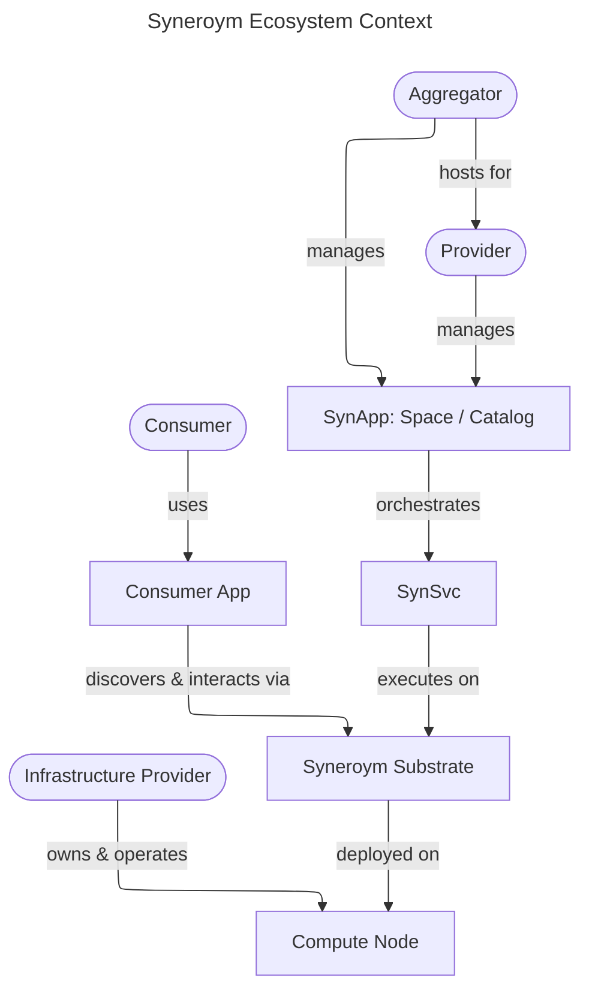
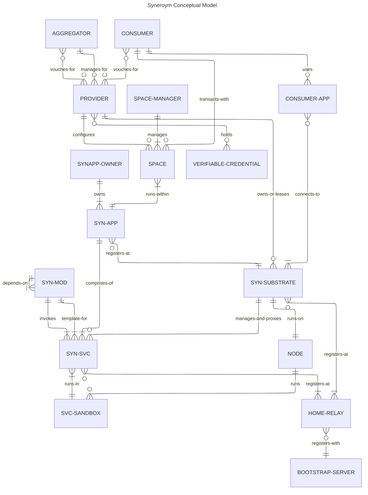

# Syneroym Ecosystem Requirements Specification

The [thesis](../THESIS.md) states the core bet: a truly peer-to-peer foundation for group communication and trust, on which independent mini-apps (SynApps) — chat, marketplace, social, AI — plug in and work together as one experience, with no central server in the middle. No blockchains or cryptocurrency.

Our flagship experience and reference application is **Roym** — mini-apps sharing one identity, one contact list, one set of groups, one trust model. Its first vertical is the Professional Services Guild, built entirely on the Syneroym substrate.

**Status:** Draft product baseline

**Last product review:** 2026-06-22

**Companion documents:** [Thesis](../THESIS.md) · [Vision](./VISION.md) · [Architecture](./system-architecture.md)

This document is the canonical statement of **who Syneroym serves, what outcomes
it must enable, and which constraints a conforming implementation must honour**.
It expands the vision of *autonomous SynApps cooperating over a common
technology substrate* into testable product and ecosystem requirements.

### Requirement conventions

- **Must** denotes a release or conformance requirement.
- **Should** denotes an important default that may be deferred with a documented
  product or operational reason.
- **May** denotes an optional capability.
- Product releases are vertical, end-to-end increments. Capability backlog
  phases are engineering sequencing bands and do not independently constitute a
  usable product release.
- Open questions are tracked as milestone decision gates in the
  implementation plan and resolved before the milestone that needs them
  starts.
This requirements spec is structured as follows:

- Philosophy & Design Constraints
- Product Outcomes, Guardrails, and Release Scope
- Requirements Overview
- Personas
- Glossary / Terminology
- Common Requirements
- Trust Model
- Conceptual Model
- Substrate Functionality
- Shared Utilities and Services
- SynApp Specs:
    - Reference Application: Business, Professional, and Retail Spaces (covering Home Services and Small Retail)
- Post-DD864A1 Specifications

---

## Philosophy & Design Constraints

Providers and consumers cluster locally; global reach from one source is not required. Reach grows instead through federation across autonomous clusters — cooperation between independently owned peer clusters over shared protocols, not server federation; no server sits between participants. The system keeps the benefits and sheds the drawbacks of large platforms listed in [VISION.md](./VISION.md#background), and goes after the open problem stated in the [thesis](../THESIS.md): rich group activity at real scale, with no central server, where no participant's device needs to fully trust any other.

### Design Principles

The following principles guide design decisions throughout the system:

**Locality-first.** The system is optimised for scenarios where providers and consumers are geographically proximate. Federation between local clusters is important; undifferentiated global reach is not an initial goal.

**Progressive decentralisation.** A provider starts with a single device and no federation. Complexity is introduced incrementally as their needs grow. The system does not require full federation to be useful.

**Data sovereignty.** Authoritative private provider data lives on infrastructure
the provider controls or has explicitly chosen. Public listings and records the
provider deliberately shares may be cached or replicated under disclosed
retention rules. Syneroym-operated infrastructure receives no special right to
store or monetise provider data.

**Transparency over opaqueness.** Ranking, discovery, and reputation algorithms are either open source or provider-auditable. No hidden algorithmic black boxes determining outcomes for providers.

**Interoperability by convention.** SynApps cooperate through shared substrate primitives and open protocols. No SynApp requires a central coordinator to interoperate with another.

**Human-operable by default.** A provider must be able to start small, understand
the system's current state, recover from common failures, and leave without
specialist assistance. Decentralisation that only experts can operate does not
satisfy the product goal.

**User agency over ecosystem purity.** Self-hosting is always available, but
managed hosting, familiar payment rails, and lightweight consumer identities are
valid adoption paths when their trade-offs are explicit and exit remains
possible.

**End-to-end slices before platform breadth.** New substrate capabilities are
validated through a real provider-consumer workflow before adjacent generality
is added.

**Additive evolution.** Nothing is shelved. Payments/ledger primitives, AI
assistance, attestation, and stronger identity tiers are sequenced, not
deferred — each lands in its turn and composes with shipped contracts without redesigning them.

---

## Product Outcomes, Guardrails, and Release Scope

### Product outcomes

Syneroym succeeds when it creates a credible third option between a large
centralised marketplace and running an isolated website or messaging account.
The product must deliver these outcomes:

1. **Provider autonomy without an operations burden.** A small provider or guild
   can publish, transact, retain its customer relationships, and change operators
   without rebuilding its digital business.
2. **A coherent consumer experience across independent operators.** A consumer
   can discover, assess, contact, agree with, and later return to providers
   without understanding substrates, relays, or federation.
3. **Cooperation without surrendering control.** Independent providers can share
   discovery, referrals, infrastructure, and composed workflows while retaining
   their own identity, data, policies, and right to exit.
4. **Useful operation under real local constraints.** Core workflows tolerate
   intermittent connectivity, modest hardware, and varying technical skill.
5. **An ecosystem developers can safely extend.** Stable contracts, conformance
   tests, capability negotiation, and transparent governance allow third parties
   to build interoperable SynApps without privileged access.

---

## Requirements Overview

High-level requirement highlights:

- Providers either self-host on commodity hardware or choose a managed operator,
  without requiring a cloud account or deep technical expertise.
- Providers federate with others to share infrastructure and improve resilience and discovery reach.
- Consumers discover and transact with providers through a unified experience regardless of which substrate hosts the provider.
- Consumers can participate with a lightweight device-bound identity; running a
  personal substrate is an optional upgrade path, not an entry requirement.
- The substrate provides shared contracts for identity, messaging, discovery,
  agreements, receipts, trust signals, and data portability. Payment execution
  remains pluggable and outside the system trust boundary.
- The system degrades gracefully under network partition — queuing, offline-first storage, and async workflows keep transactions progressing.
- All provider participants retain the ability to exit — migrating data and services to a different infrastructure provider or running independently.
- Ecosystem protocols are open, versioned, testable, and governed through a
  published process that does not privilege Syneroym-operated services.

---|---|---|
| **PRD-AUT** | Provider identity, data, policy, and operator choice remain under provider control. | Delegation-revocation and operator-migration journeys. |
| **PRD-CUX** | Consumers complete the reference journey without understanding hosting or federation. | Moderated task-success test and accessibility audit. |
| **PRD-FED** | Independent implementations interoperate without a mandatory central data-plane or authority. | Two-node federation and bootstrap-outage tests. |
| **PRD-OFF** | Safe workflows remain intelligible and converge after disconnection; unsafe retries fail explicitly. | Fault-injection, idempotency, and state-model tests. |
| **PRD-POR** | Participants can export, verify, and restore in-scope identity-linked data through versioned open formats. | Clean-node export/import drill and cross-version fixtures. |
| **PRD-TRU** | Trust evidence is sourced, scoped, fresh, explainable, and correctable; uncertainty remains visible. | Trust-display, revocation, omission, and abuse cases. |
| **PRD-OPS** | A non-specialist can install or join, understand health, recover, update, and exit within the declared operating profile. | Timed onboarding and incident-recovery exercises. |
| **PRD-EXT** | Third-party SynApps can declare capabilities and pass public compatibility tests. | Package inspection and protocol conformance suite. |
| **PRD-SAF** | Consent, data lifecycle, moderation boundaries, and responsible parties are explicit throughout a transaction. | Policy-version, grant, report, dispute, and deletion scenarios. |

---

## Personas in the Syneroym Ecosystem

The following are key personas. A single person or organisation may play
multiple roles, but the product must make the active role and its powers clear.

| Persona | Primary job to be done | Adoption constraint |
|---|---|---|
| **Individual Service Provider** | Publish an offering, receive qualified local work, serve repeat customers, and retain business history. | Limited time and technical skill; may have only a phone and intermittent connectivity. |
| **Self-hosting Provider / Node Owner** | Run the provider's digital business without dependence on an aggregator. | Needs safe defaults, understandable health, backups, and recovery—not a miniature SRE role. |
| **Guild or Provider Aggregator** | Onboard and support multiple providers, provide local discovery and trust context, and operate shared services. | Must earn trust without acquiring irrevocable control over provider identity or data. |
| **Infrastructure Provider** | Offer bounded compute, storage, and connectivity with auditable usage and responsibilities. | Needs isolation, quotas, abuse controls, and an explicit service agreement. |
| **Consumer** | Find a suitable provider, understand why they are trustworthy, agree terms, communicate, pay, and keep records. | Will not install infrastructure or learn federation concepts before receiving value. |
| **SynApp Developer** | Build once against stable contracts, test locally, distribute safely, and interoperate with other apps. | Needs concise contracts, compatibility signals, examples, and conformance tooling. |
| **Space Manager** | Configure a provider or guild presence, policies, catalog, availability, and staff access. | Needs delegated permissions and an audit trail without access to unrelated provider data. |
| **Facilitator** | Offer an optional bounded service such as delivery, payment gateway, credential issuance, backup, or dispute handling. | Must disclose terms and authority; cannot become an implicit mandatory intermediary. |

---

## Glossary / Terminology

**Aggregator.** Takes responsibility for managing online services for multiple providers. E.g. a plumber cooperative.

**App Developer.** A person or organisation that builds SynApps and publishes them for others to deploy. Does not necessarily host or operate any infrastructure.

**Bootstrap Server.** A Syneroym-operated service that is a registry of active services and Relays, and handles other system management responsibilities.

**Consumer / General User.** Uses the Syneroym ecosystem to discover and purchase services or products, or to interact with other entities.

**Federation.** The process by which independent providers and infrastructure nodes interoperate to share discovery, reputation, and messaging capabilities without a central authority.

**Home Relay.** A Relay assigned to a Substrate or SYN-SVC as its primary connectivity point.

**Infrastructure Provider.** A person or organisation that makes hardware or virtual infrastructure available for Service Providers to host applications on a leased basis.

**Operator.** The person or organisation responsible for administering a
Substrate or managed SynApp Instance. An Operator may also be a Provider,
Aggregator, or Infrastructure Provider, but those roles confer different duties.

**Node.** A physical or virtual machine running one Substrate instance. May run multiple SVC-Sandboxes.

**P2P.** Peer-to-peer. To denote direct interaction between 2 entities without any intermediate broker service.

**Provider.** Short for *Service Provider*. Provides a service to others — e.g. plumber, photographer, consultant. May self-host or use an Aggregator.

**Relay.** A service that provides connectivity for SUBSTRATEs and SVCs that cannot accept inbound connections directly (e.g. behind NAT or firewall). Coordinates direct connectivity, occasionally relays encrypted traffic where direct connectivity does not work.

**Space.** A named, provider-configured business context within a SynApp (e.g. a plumber's catalog and booking page).

**Space Manager.** The person (often the Provider or Aggregator) responsible for configuring and operating a Space: catalog, branding, access control, and operational policies.

**Substrate (SYN-SUBSTRATE).** The core runtime layer on a NODE. Manages service deployment, lifecycle, discovery registration, messaging, and access control on behalf of the NODE-OWNER.

**Service Sandbox (SVC-SANDBOX).** The execution environment for a SYN-SVC. May be a WASM runtime instance, a Podman container, or equivalent. Provides isolation between services sharing a NODE.

**SynApp (SYN-APP, Syneroym Application).** A deployment manifest and control plane overlay that defines a cohesive graph of SYN-SVCs. It acts as a blueprint to deploy, update, and manage capabilities, quotas, and namespaces. It is not an execution boundary.

**SynApp Instance.** One deployment of a SynApp blueprint, with its own stable
instance identifier, namespace, bindings, policy grants, configuration, and
accounting context.

**SynApp Owner.** The provider who deploys a SynApp to provide services to their clients. Distinct from the Developer who develops it.

**Syneroym Module (SYN-MOD).** A reusable, independently deployable unit of business logic. Packaged as a WASM component or OCI image.

**Syneroym Service (SYN-SVC).** A running instance of a module, executing within a SVC-SANDBOX on a Node. It is the absolute foundational zero-trust execution primitive of the Syneroym Substrate. Managed and proxied by the Substrate.

**Verifiable Credential.** A cryptographically signed attestation issued by a third party (e.g. a trade authority, government body, or community organisation) and attached to a Provider's profile. The consuming party decides which credential issuers they trust.

**Vouching.** A trust mechanism where entities issue signed endorsements for other entities within their network, creating a verifiable web of trust.

---

## Ecosystem & Domain Model

The following diagram shows the high-level business entities in the Syneroym ecosystem and how they interact.

*(Note: For the lower-level technical architecture diagram detailing modules, services, and sandboxes, please refer to the Architecture Design Document).*

---

## Common Requirements

These requirements apply across all business domains and SynApps.

### Infrastructure & Hosting

- Service Providers run business applications on supported commodity computers
  they control, or on infrastructure operated under an explicit agreement, even
  when the host is behind NAT or a firewall.
- Infrastructure Providers make hardware (old PCs, cloud VMs, etc.) available for Service Providers to host applications or application components on a leased basis.
- Service Providers see a plain-language service status and receive actionable
  notification when their intervention is required. Routine managed operation
  must not require shell access.
- Infrastructure Providers monitor infrastructure health and resource usage,
  control node access, and see which obligations are affected by an incident.
- App Developers package SynApps (e.g. as WASM modules or OCI images), and Providers deploy them to matching container infrastructure (WASM runtime, Podman/Docker).
- Consumers access Provider services through options the Provider makes available: app UI, browser, API, or command-line tools.
- Service Providers export and restore all in-scope data, configuration, grants,
  and signed history using documented, versioned, non-proprietary formats. An
  export includes a manifest and completeness report; secrets may require a
  separately protected transfer.
- Every production profile supports encrypted backup and tested restore. Backup
  destination is operator-selectable; peer backup pools are optional and must
  not be required for portability.
- The system reports recovery-point and recovery-time expectations before a
  provider chooses a hosting profile. Backup success is never inferred merely
  from upload success; restorability is tested.
- Multi-device clients may work offline using local caches and outboxes. Running
  independent writable copies of the same authoritative service state is a later
  capability and must not be implied by the baseline requirement.
- Sharding and multi-node service placement are optional scale capabilities.
  They must not complicate the single-node deployment or portability contract.

### Connectivity & Offline Behaviour

- The substrate supports direct peer-to-peer connections wherever possible, and falls back to relay-mediated encrypted connections when NAT or firewall constraints prevent direct connectivity.
- **Offline outbox and retry queue:** Operations explicitly declared safe for
  deferred delivery are stored durably, expose `pending`, `delivered`, or
  `failed` status to the user, and retry when connectivity returns. The UI must
  not present `pending` as final success.
- Automatic retries require an idempotency contract. The system must not replay
  a non-idempotent operation merely because a connection failed.
- Each transactional entity defines permitted state transitions, authority,
  expiry, idempotency, and conflict behaviour. Reconnection either reaches the
  same valid final state for all parties or exposes a conflict requiring a named
  party's decision; silent last-write-wins is not acceptable for agreements,
  payments, fulfilment, or access grants. A single writer per service resolves
  this by replaying queued requests through per-entity arbitration rules — no
  multi-master merge is needed for these entities.
- Users can cancel a still-pending operation when doing so is safe, and can see
  when cancellation is no longer guaranteed because delivery may have occurred.

### Messaging & Data Sharing

- Providers, Consumers, and Services exchange messages only within an explicit
  conversation or capability context and subject to owner-approved access
  policy.
- The system supports one-to-one text, attachments, and structured service cards
  for requests, quotes, agreements, status, receipts, and grants. Group chat,
  audio/video, social feeds, and collaborative editing are optional later
  SynApps, not substrate conformance requirements.
- A structured message has a stable type, schema version, sender, intended
  recipients, creation time, idempotency identifier where applicable, and
  verification status. Clients render unknown types safely without executing
  arbitrary sender code.
- The product states which message content and metadata are end-to-end encrypted,
  which operator can observe remaining metadata, and why. Transport encryption
  alone must not be described to users as end-to-end message privacy.
- Unsolicited contact is rate-limited and user-controlled. Recipients can block,
  report, and leave a conversation without surrendering their transaction
  records.

### Non-Functional Requirements

Unless superseded by a stricter vertical requirement, the reference client uses these
measurable baselines. Test profiles and measurement methods belong in the
Architecture and test plans.

| Quality | Requirement |
|---|---|
| **Security** | All inter-node and client-node traffic is encrypted in transit. Sensitive production data and backups are encrypted at rest by default. No default credential is shared across installations. Critical actions are authenticated, authorised, and audit-recorded. |
| **Identity security** | Routine key rotation and device loss do not require a new public identity. Revocation freshness, recovery authority, and the consequence of losing every recovery factor are shown to the owner. Government identity is optional, never the universal root of participation. |
| **Availability** | Local and cached reads remain available during temporary bootstrap or relay loss. Already-known peers continue the reference flow during the 24-hour bootstrap outage test when a viable direct or cached relay route exists. |
| **Durability** | The disconnect/reconnect and process-restart suites lose no acknowledged in-scope transaction message. Backup restore is verified on a clean node before initial release. |
| **Performance** | On the documented standard-node and mobile-network profiles, local UI actions reach p95 under 1 second and remote browse, search, message acknowledgement, and request submission reach p95 under 3 seconds, excluding an offline peer or external payment provider. |
| **Operability** | Health output identifies the affected user capability, likely cause, and safe next action. Updates are reversible; failed migrations automatically preserve or restore the last known-good state. |
| **Interoperability** | A claimed protocol version passes published conformance tests. Unknown optional capabilities fail gracefully; incompatible mandatory capabilities are rejected before a workflow begins. |
| **Privacy** | The system minimises observable metadata, documents every operator-visible category, and provides purpose, retention, export, and deletion behaviour for personal data. Telemetry is off or local by default unless the operator or user knowingly enables export. |
| **Portability** | Export/import formats and identity-linked history are documented, versioned, integrity-checked, and covered by cross-version fixtures. |

---

## User Experience, Agency, and Accountability

### Onboarding and recovery

- A provider can choose a managed-guild path or a self-hosted path. The product
  explains control, cost, availability, privacy, and support trade-offs before
  the choice is committed.
- Joining a guild must not transfer ownership of the provider's root identity,
  signed history, or export rights to the guild. Delegated administration is
  scoped, visible, revocable, and audit-recorded.
- Consumer onboarding creates or imports a lightweight identity on the consumer's
  device. Backup is strongly prompted after first value, not made a blocker to
  browsing. The recovery model does not claim self-sovereignty if an operator can
  unilaterally recover or impersonate the consumer.
- Destructive actions state their scope and recovery consequences. Common
  recovery flows are available through a guided UI as well as an expert CLI.

### Data rights and lifecycle

- Every durable record has a documented owner or controller, permitted writers,
  retention policy, export representation, and deletion or tombstone behaviour.
- Shared records such as agreements, receipts, reviews, and revocations cannot be
  unilaterally rewritten. A participant may remove its local copy or personal
  presentation where law permits, while the protocol preserves the other party's
  legitimate signed record and records later corrections separately.
- Access grants are purpose- and scope-limited, expire by default for sensitive
  data, and can be revoked. The UI shows who currently has access and what
  revocation can and cannot retract from already-received data.
- Export and account deletion are distinct actions. Deletion identifies data
  held by the provider, operator, backup destination, peers, and legally required
  records; the product must not promise deletion it cannot enforce.

### Safety, support, and disputes

- Before production use, the system has a reviewed threat model and privacy data
  inventory covering malicious packages, peers, clients and operators;
  compromised keys; metadata leakage; denial of service; backup exposure; and
  recovery abuse. Residual risks and unsupported deployment profiles are stated.
- Syneroym supplies evidence and workflow primitives; it does not imply that
  every listed provider, guild, credential issuer, or facilitator has been vetted
  by the Syneroym project.
- Provider terms, price, cancellation rules, data use, payment method, and named
  dispute path are captured before agreement. A material change requires renewed
  consent and produces a new version.
- Users can report impersonation, fraud, harassment, unsafe service, and illegal
  content to the relevant operator or community. Reports have a status, an
  appeal or correction path where appropriate, and safeguards against publicising
  unverified allegations as fact.
- Emergency response, guaranteed refunds, insurance, professional licensing, and
  legal arbitration are not implied platform services. A guild or facilitator
  offering them must state jurisdiction, limits, and responsible legal entity.

---

## Ecosystem Contracts and Governance

- The minimum federation contract consists of versioned identity resolution,
  endpoint discovery, provider/catalog publication, service request, agreement,
  receipt, trust-signal, capability negotiation, and export schemas plus their
  security and error semantics.
- Each normative contract has a stable identifier, compatibility policy, test
  vectors, and an executable conformance suite. A third-party implementation can
  verify compatibility without contacting a privileged Syneroym service.
- Protocol changes follow a public proposal process with rationale, security and
  privacy impact, migration plan, reference fixtures, and a defined review
  period. Urgent security changes may be expedited but are documented afterward.
- No public Syneroym-operated bootstrap, relay, registry, app store, model
  service, or certificate authority is the sole permitted implementation of its
  role. Defaults may be convenient; replacement and export remain supported.
- Compatibility claims are capability-specific (for example, "Guild Requests
  v1") rather than a blanket "Syneroym compatible" label. Certification does not
  imply provider quality, legal compliance, or financial safety.
- SynApp packages are content-addressed or signed, declare publisher, requested
  capabilities, data migrations, supported interfaces, resource bounds, and
  update policy. Owners approve material capability expansion before update.
- The project's sustainable business model may charge for hosting, support,
  certification, or optional services, but protocol participation and data exit
  cannot depend on paying a mandatory Syneroym toll.
- The project publishes a vulnerability-reporting channel, supported-version
  policy, security advisory format, package revocation mechanism, and emergency
  update/rollback procedure before the public production launch.

---

## Trust Model

Centralized platforms derive consumer trust from brand, legal accountability, and aggregated reviews. A truly peer-to-peer system — where no participant's device needs to fully trust any other — needs explicit mechanisms to establish equivalent trust without central authority.

### The Trust Problem

When a consumer discovers a provider through Syneroym, they have no prior relationship with either the provider or the infrastructure operator. The system gives the consumer sufficient signal to decide whether to transact. Conversely, providers have signal that consumers are not fraudulent.

Minimum requirement at transaction time:

- Before accepting an agreement, the consumer can inspect the provider's stable
  identity, the provenance and freshness of available trust signals, material
  policy terms, payment recipient, and dispute/cancellation path. Absence of a
  trust signal is shown as unknown, never converted into a positive default.
- Providers can configure proportionate consumer-side requirements for higher
  risk work, such as a verified contact method, prior receipt, deposit, or named
  facilitator. The product avoids collecting stronger identity than the risk
  warrants.
- Trust displays separate facts (credential, completed interaction, vouch,
  report, recency) rather than hiding them behind one universal score. Any
  summary or ranking is explainable and can be recalculated from disclosed input
  categories.

### Trust Layers

Trust in the Syneroym ecosystem operates at multiple levels:

**Layer 1: Cryptographic continuity.** A stable, issuer-neutral identity delegates
to rotatable device and routing keys. Hardware protection, social recovery, or a
government credential may strengthen recovery or identity assurance, but none is
required universally. Cryptographic continuity proves control of keys—not a
person's legal name, quality, or honesty.

**Layer 2: Referral and vouching.** Entities issue signed, scoped, expiring
statements about other entities. A guild may attest membership or a consumer may
recommend a completed service. The display preserves who said what and in which
context; a vouch is not silently treated as objective verification.

**Layer 3: Verifiable credentials.** Providers attach credentials such as a trade
licence or certification. Verification checks signature, issuer, scope, expiry,
and revocation. The consuming party or community decides which issuers it trusts;
the UI does not reduce "valid signature" to "trusted claim".

**Layer 4: Interaction receipts and feedback.** Completed interactions can produce
mutually signed receipts and separately signed feedback. A receipt proves that
the parties acknowledged a workflow event, not that every off-system claim is
true. Portable bundles preserve provenance and allow selective disclosure.

**Layer 5: Community moderation.** Guilds and communities maintain their own
policies and signed block, warning, or trust lists. Reports are scoped and do not
automatically propagate as global truth. Consumers see the policy source; people
affected by a published decision have a correction or appeal mechanism where
safety and law permit.

Trust mechanisms must be evaluated against collusion, selective omission,
replay, identity farming, review coercion, compromised keys, malicious issuers,
and discriminatory community policies. Tying feedback to a signed interaction
reduces casual spam but does not by itself solve Sybil attacks or collusion.

### Legal Liability Boundary

The system does not provide legal shielding in the way centralised platforms do — that shielding derives from the platform's legal personhood and terms of service. Syneroym infrastructure operators bear their own legal responsibility for services they host under applicable local law. The requirements are:

- The substrate makes it straightforward for a Provider or Aggregator to display their own terms of service to consumers.
- The substrate does not create an implicit representation to consumers that a federated node has been vetted by Syneroym.
- A separate document will outline recommended legal structures for Provider Aggregators operating at scale. [Legal guidance: Out of scope for this spec]

---

## Conceptual Model

The following ER diagram shows the formal entity model for the Syneroym
ecosystem, with full relationship cardinalities. See the
[Glossary](#glossary--terminology) for definitions of all entities. See the
[Ecosystem & Domain Model](#ecosystem--domain-model) diagram for a higher-level
overview.

---

## Substrate Functionality

Description of the core Syneroym substrate functionality, key protocols, and important flows.

### Substrate Setup

- Node owner installs the substrate on a node.
- Substrate creates a protected initial administrator credential on first run and
  requires the owner to establish a tested recovery method before production
  use. Routine administration uses revocable delegated credentials rather than
  exposing a root key.
- Substrate registers with a Relay:
    - Contacts a bootstrap service to obtain a home relay assignment.
    - Publishes its node public key and associated relay routing information to a distributed registry or p2p network (used for the node's control plane, e.g. SYN-SVC deploy/remove).
    - Starts a secure communication server listening via the assigned relay and/or direct peer-to-peer interfaces.
- Substrate identifies its capabilities (sandbox/container types, quota configurability). Node owner configures capability limits (CPU, GPU, memory, disk, other capabilities) available to hosted Services.
- Access control setup:
    - If the node owner has a primary substrate, this substrate's pubkey is registered with it.
    - Necessary substrate access is granted to the owner's primary key.
    - SYN-APP owner pubkeys are granted access to substrate management APIs (deploy, remove, observe) with associated quotas.

### Substrate Managing Services

- Substrate provides a secure end-to-end communication channel between clients and the services it manages.
- Substrate supports WASM and Podman sandbox environments at minimum.
- Substrate attempts direct client-service communication wherever possible; it falls back to external relay (DERP) when intermediate network infrastructure does not permit direct connections.
- On mobile platforms, if the substrate and embedded services are throttled by the OS, requests are sent as offline notifications. The service response is triggered when the substrate application is next active.

### Core Substrate Services

**Messaging.** The substrate supplies secure, typed, durable delivery primitives.
Conversation products such as chat, groups, feeds, and collaboration remain
SynApps built on those primitives.

**Discovery.** The substrate exposes capability and endpoint discovery. Guild
directories, referrals, federated catalogs, and ranking are replaceable SynApps
or services that implement the common publication and query contracts; no one
global index is required.

**Identity.** The substrate manages protected key storage, rotation, revocation,
recovery, and delegation while separating stable identity from ephemeral routing
keys. Optional credential and privacy-preserving proof systems plug into this
issuer-neutral foundation.

**Access Control.** The substrate enforces deny-by-default policy on inter-service
and client-service communication. The product accurately documents the
infrastructure operator's technical powers; policy enforcement alone must not be
presented as protection from a fully compromised host. Sensitive deployments may
require owner-held encryption keys or attested hardware.

---

## Supporting Ecosystem Entities

### Relay

- On startup, a relay may apply to register as a community relay with the Syneroym bootstrap server (refreshed periodically).
- On successful registration, it is reachable as `<relaynodeid>.syneroym.net`.
- Acts as a coordination server for direct connections between peers using UDP hole punching.
- Acts as an encrypted TCP data relay when direct connection is not possible (no UDP, symmetric NAT, CGNAT).
- Acts as a TURN relay for WebRTC when browsers access services behind NAT.

### Bootstrap

- Accepts NodeId registration offers; with associated relay details as applicable.
- Maintains a list of officially operated relays with capability metadata (TCP relay, TURN, etc.).
- Accepts community relay registration offers; verifies capability claims (offline or real-time checks).
- Registers DNS entries for community relays under its domain e.g. `*.syneroym.xyz`.
- Returns a weighted random set of relays from the registry based on requested capability and relay capacity.
- Periodically audits registered relays and expires stale entries.
- For node ID lookups, checks internal cache or DHT fallback and returns the relay. For HTTP URL lookups from browsers, finds the relay and issues an HTTP redirect.

> **Single point of failure note.** A default bootstrap service is a governance
> and availability dependency. Its signed records must be exportable and
> publishable through alternative operators or discovery mechanisms. Known peers
> and cached routes must satisfy the bootstrap outage release gate; one
> Syneroym-controlled service must not be required to authorise continued use.

### Consumer-Facing Aggregation

> This section addresses a gap in the prior spec. Centralised platforms provide consumers a single app. In Syneroym, providers may run on different substrates operated by different entities. The consumer experience remains coherent.

- A Consumer App (web or mobile) allows consumers to discover, browse, and transact with providers across multiple substrates and SynApps from a single interface.
- The Consumer App can query one or more community directories, follow referrals
  and direct links, and merge results with visible source and ranking provenance;
  it does not need to know which substrate hosts a provider.
- A consumer's identity, signed receipts, grants, and preferences are portable
  and controlled from the consumer's device or a store the consumer has
  explicitly designated. Running a personal substrate is optional.
- The Consumer App is itself a thin client; business logic runs on provider substrates. The Consumer App is not a privileged participant in the ecosystem.

---

## SynApp Lifecycle

### Development

- Developers build encapsulated components (e.g. using WebAssembly or standard container images) that define clear, strongly-typed interfaces for inter-component communication.
- The system supports automatically deriving external-facing APIs (e.g., JSON-RPC or HTTP/REST) from these internal component interfaces to support diverse clients like web browsers.
- Components are packaged into standard distribution formats suitable for the target substrate execution environment.

### Deployment

- An Application Specification composes components into a SynApp and declares dependencies, resource requirements, and configuration schema.
- The specification declares package identity and signature, supported protocol
  versions, requested capabilities, data classifications, migrations, backup
  expectations, health checks, and rollback behaviour.
- Provider applies the Application Specification to chosen substrate(s).
- Before deployment, the substrate validates resource availability,
  compatibility, access permissions, and capability expansion and presents a
  comprehensible approval summary.
- A partially failed deployment is recoverable or rolled back without leaving
  undeclared services or grants. Installation state is inspectable and exportable.

### Monitoring

- Substrate monitors the application and provides health information,
  notifications, and policy-controlled restart or redeploy on failure.
- Providers receive alerts through UI, CLI, or webhook integrations of their choice.
- Updates preserve a last known-good package and state snapshot until health and
  migration checks pass. A capability increase requires renewed owner approval.

---

## Reference Vertical Contracts

The two reference SynApps validate common ecosystem contracts without forcing
unrelated domains into one generic application. They may share modules and
schemas, but each has its own language, workflow, policy, and usability tests.

### Home Services Guild

#### Provider and guild setup

- A guild operator deploys a signed release profile and creates a guild with
  public identity, service area, membership policy, support contact, dispute
  path, directory policy, and data retention policy.
- A provider joins through an invitation or application, controls a stable
  provider identity, and grants the guild only the administration rights needed
  for the chosen managed service.
- A provider publishes name, description, service categories, service area,
  availability or response expectation, price style (fixed, range, or quote),
  cancellation policy, supported payment rails, and trust evidence. Required
  fields and provenance are machine-readable.
- One operator can manage multiple provider Spaces without obtaining undeclared
  read access across their private conversations or histories.

#### Consumer-provider workflow

- **Discover.** Consumers reach a provider by direct link, referral, or one or
  more guild directories. Results show source, freshness, filters, and the reason
  for ordering; paid placement is absent from the initial release.
- **Assess.** Consumers see relevant services, price basis, availability,
  provider identity continuity, trust evidence, guild relationship, and material
  policies before sharing personal details.
- **Request and clarify.** A request captures category, description, approximate
  area, preferred window, attachments, and a data-use notice. Exact address is
  disclosed only when needed. Parties can clarify in the linked conversation.
- **Quote and agree.** A versioned quote states scope, price, taxes or fees,
  schedule, location, payment method, cancellation/refund terms, expiry, and
  dispute path. Both parties' acceptance produces a signed agreement receipt.
- **Fulfil.** Permitted states and actors are explicit. State changes are
  idempotent and append-only in the audit history; corrections do not rewrite
  previously signed facts.
- **Settle.** The system opens or records an external or out-of-band payment and
  captures acknowledgement. It never presents an unverified return from a
  payment app as final settlement.
- **Close and return.** Completion produces a portable receipt. Feedback is
  optional, tied to the receipt, and remains distinct from guild membership or
  platform ranking. Either party can start a repeat request without re-entering
  information it still consents to retain.

### Service Variation Dimensions

The system accommodates the following variation axes across workflows:

**Booking:** Event slots, consulting time slots, open-ended job requests.

**Payment:** One-time; pre- or post-delivery; multi-part; negotiated; subscription. Escrow, system coins, and mutual credit systems are deferred variation axes — see [Appendix: Later-Phase Additions](#appendix-later-phase-additions) and the [Dynamic Ledger Network Specification](https://github.com/syneroym/foundation/blob/main/ideas/commitment-network.md) for mutual credit mechanics.

**Product type:** Time-bound (e.g. prepared food), digital content, physical goods.

**Service type:** Time-slot service, job-completion-based service, location-based service.

**Location:** Fixed location, provider-proximate, consumer-proximate, remote/digital.

**Relationship type:** One-time, recurring, long-term with continuous shared history (e.g. doctor-patient).

**Service record:** Long-term (doctor-patient), engagement-specific (courses), tracking-required (delivery).

---

## Post-DD864A1 Specifications

Features after commit `dd864a1`. The rest of this document covers the shipped walking-skeleton baseline; this section sequences what comes next.

### Tag Legend
To ensure stable cross-referencing across commits and PRs, features are prefixed with category tags:
- **`[TOP]`**: **Topology** (Core Architecture Primitives)
- **`[FND]`**: **Foundation** (Core Infrastructure & Security)
- **`[PLT]`**: **Platform** (Data Layer & Resilience)
- **`[LFC]`**: **Lifecycle** (Substrate & Application Management)
- **`[ADV]`**: **Advanced** (Advanced Services & Tooling)
- **`[P2P]`**: **Peer-to-Peer** (Community Primitives)
- **`[APP]`**: **Applications** (High-Level SynApps)
- **`[EDG]`**: **Edge** (Edge Expansion & Mobile)

## Phase 0: Core Architecture Implementation (SynApp & Topology)

This phase implements the architectural boundary between Syneroym Applications (`SynApp`) and Syneroym Services (`SynSvc`), and the pending addressing and registry systems required for robust service discovery.
*(Current baseline: the codebase already has DID-key service identities, a community endpoint registry client backed by HTTP/pkarr, and an in-process local `EndpointRegistry`. This phase adds app-instance namespaces, topology-aware logical names, and orchestration on top of those primitives.)*

### [TOP-PRM] Core Primitives (`SynSvc`) vs. Control Plane Overlay (`SynApp`)

#### `SynSvc` (The Execution Primitive)
The `SynSvc` is the absolute foundational primitive of the Syneroym Substrate. 
*   **Zero-Trust Execution:** Represents an isolated, zero-trust execution boundary (often a WASM component, but could also be a Podman container or a native OS service sitting behind a platform gatekeeper). It does not implicitly trust other services, even those deployed alongside it.
*   **State & Capabilities:** It owns its state and enforces capability-based security (FDAE ReBAC policies and UCANs) on all incoming requests.

#### `SynApp` (The Control Plane Overlay)
`SynApp` is removed as a runtime execution boundary and is redefined as a **Deployment Manifest and Control Plane Overlay**.
*   **Lifecycle Management:** Acts as a blueprint to deploy, update, and remove a cohesive graph of `SynSvcs` as a single unit.
*   **Capability Bootstrapping:** Orchestrates the initial injection of permissions (ReBAC relations/policies) that allow internal services within the app to communicate.
*   **Resource Accounting:** Serves as a logical grouping for tracking quotas, billing, and telemetry across a designated graph of services.
*   **SynApp Instances:** Unlike Erlang applications (which are singletons), deploying a `SynApp` manifest creates a unique **SynApp Instance** with an isolated namespace. A single substrate can host multiple distinct instances of the same `SynApp` (e.g., Personal Task Manager vs. Work Task Manager).
*   **UI Decoupling:** User Interfaces are simply specialized `SynSvcs` or external clients. A `SynApp` may contain zero UIs (headless processes), one UI, or multiple specialized UIs (Admin, Storefront, Mobile Gateway).
*   **Terminology Reconciliation:** Older docs sometimes say a `SynApp` "runs on" a substrate. In this model, only `SynSvcs` execute. A `SynApp Instance` is the manifest, namespace, capability bootstrap, dependency graph, and accounting context for those executing services.

#### Composable SynApps (App Dependencies)
Similar to Erlang OTP applications, `SynApps` are highly composable. A `SynApp` manifest is not restricted to explicitly declaring raw `SynSvcs`; it can declare dependencies on other `SynApps`.
*   **Dependency Resolution:** If `SynApp: Retail Store` depends on `SynApp: Identity Core`, the Orchestrator evaluates the dependency graph during deployment. It will ensure `Identity Core` is instantiated (or bind to an existing instance) before deploying the `Retail Store` instance.
*   **Instance Mapping:** This maintains the crucial App (Blueprint) vs. App Instance distinction. A higher-level SynApp can compose multiple foundational SynApps into a unified, deployed ecosystem, passing necessary capabilities down the dependency tree.

---

### [TOP-ADR] Service Addressing and Resolution Topology

Services communicate using a multi-tiered addressing model to support mobility, redundancy, and explicit targeting.

#### Addressing Types
1.  **Explicit Service ID (Physical ID):** 
    *   A stable cryptographic identifier for a deployed `SynSvc` instance. The current implementation uses DID-key identities derived from Ed25519 public keys; future encodings may wrap that in a shorter service identifier for ergonomics.
    *   Provider ownership of the service is proven via the service identity and its signed endpoint records, UCANs, or deployment certificates. The route to that service may change without changing the service identity.
    *   Used for stateful interactions, direct replies, and underlying substrate routing.
2.  **Logical Service Name:** 
    *   A human-readable or contextual identifier (e.g., `profile-svc`, `ledger-primary`) representing a *role* within a `SynApp Instance` namespace.
    *   Used by developers in code to ensure high availability, load balancing, and decoupling.

#### Service Topologies
When registering a Logical Service Name, the local registry tracks its underlying topology:
*   **Singleton:** Maps to exactly one Explicit ID.
*   **Redundant (Load Balanced):** Maps to an array of Explicit IDs. The resolver returns the eligible set and the caller/proxy selects a target using the manifest's policy.
*   **Sharded:** Maps to multiple Explicit IDs based on a stable routing key (for example, consistent hashing on `user_id`).

---

### [TOP-REG] Types of Registries in the Ecosystem

Rather than a strictly monolithic system, service discovery naturally emerges across different registry scopes:

1.  **Community Identity/Endpoint Registry (HTTP + pkarr/DHT):** Resolves top-level Provider, Node, and public Service identities to signed endpoint records (for example, Iroh endpoint addresses, WebRTC peer hints, or public gateway URLs).
2.  **Contextual/App Registry:** Resolves Logical Service Names to Explicit Service IDs within a specific `SynApp Instance` overlay context or shared node namespace.
3.  **Endpoint/Router Registry:** The internal substrate routing table. Maps an Explicit Service ID and interface to actual execution boundaries (for example, local WASM channels, native host functions, Podman sockets, TCP host/ports, or remote network sockets).

---

### [TOP-DSC] Discovery Mechanisms and Inventory

#### The `syneroym-core/registry` Default Service
To provide "batteries-included" service discovery, the platform provides a canonical Registry capability. It may run as a native substrate service or as an isolated Registry `SynSvc`, but it is distinct from the in-process local `EndpointRegistry`.
*   **Purpose:** Acts as the local source of truth for service inventory, logical-to-physical mapping, and health tracking.
*   **Manifest Configuration:** A `SynApp` manifest dictates how the Orchestrator handles this:
    1.  **Spawn:** Boot a dedicated, isolated instance of the Registry `SynSvc` exclusively for this app. To handle this correctly, the `SynApp` manifest must support a service dependency graph (either explicitly declared or inferred via references) so the Orchestrator boots the registry *before* the services that depend on it.
    2.  **Bind:** Register the app's services with a pre-existing, shared node-level Registry `SynSvc` (saving resources).
*   **Client Caching (Refresh-on-Failure):** Service clients query the registry to resolve a logical name, **cache** the resulting Explicit ID locally, and communicate directly with the Explicit ID. Cache entries carry a topology epoch or TTL and are refreshed on connection failure, registry update notifications, or expiry.
*   **Master Anchor Resolution (Revocation Handling):** To maintain secure identity revocation without breaking standard DHT signatures, the ecosystem enforces the **Master Anchor** pattern:
    *   Registries map Logical Service Names exclusively to the **Master Key**.
    *   The Master Key maintains a single `pkarr` DHT record containing an array of currently authorized **Temporary Keys** (the actual routing `NodeId`s).
    *   **Passive Revocation:** If a Temporary Key is compromised, the Master Key simply updates its DHT array to drop the compromised key. The registry and DHT mechanics themselves do not change.
    *   Dependent clients cache the route. Upon a connection failure (or periodically), they perform a "Refresh-on-Failure" by looking up the Master Key's DHT record again, instantly dropping the compromised key since it is no longer authorized.
    *   *(Note: Phase 0 delivers the Master Anchor endpoint-resolution contract, but defers production Master Anchor DHT authorization to Phase 1 `[FND-IDT]`.)*

#### Static Deployment Inventory (`roymctl`)
Not all apps require a live, queryable registry at runtime (e.g., trivial background cron jobs or standalone static UIs).
*   For these trivial apps, the orchestrator/CLI (`roymctl`) maintains a static, local state file (or local host DB).
*   It records the mapping of `SynApp Instance ID / logical role > Explicit Service ID(s)` at deploy time.
*   This static inventory is sufficient for lifecycle management (listing, stopping, uninstalling) without the overhead of spinning up a live Registry `SynSvc`.

---

### [TOP-ROB] Network & Connection Robustness

This defines the baseline resilience required for underlying node-to-node and client-to-node transport links, ensuring Syneroym handles transient network partitions gracefully before falling back to application-layer offline queues.

- **Transport Resilience & Retries:** 
  - The system must gracefully handle transient network drops. Any failed connection attempt must not immediately fail the higher-level request.
  - Implement automatic retries for establishing connections. The retry count should be configurable per service dependency or manifest default, defaulting to 3 retries with a simple exponential backoff.
  - Automatic request retries are only safe for connection setup, idempotent operations, or calls explicitly marked retryable with idempotency keys. Non-idempotent calls must surface failure or enter an opt-in outbox workflow.
- **Reactive Connection Management:**
  - Standard transport-level timeouts (e.g., QUIC idle timeouts, WebRTC SCTP timeouts) are used to detect dropped peers. We do not implement custom application-level ping/pong heartbeats to save bandwidth and complexity.
  - Stale connections are handled reactively: "evict when found out." If a read or write operation fails due to a disconnected peer, the connection is instantly marked as dead and retried or surfaced as an error.
- **Transport Modalities (Events vs Data):**
  - *(See `[PLT-DAP-04]` and `[PLT-DAP-05]` for decoupled event routing and data pipeline streams.)*

---

## Phase 1: Foundation & Core Infrastructure

### [FND-DEP] Deployment/Operations
- **Cloud-Agnostic Bare-Metal Deployment:** Single Rust binary deployed to a standard Linux instance (e.g., AWS Lightsail) using native `systemd` to minimize virtualization overhead.
- **In-Repo Provisioning & Deployment:** `scripts/deploy/setup_linux.sh` handles initial machine setup (certbot, limits, systemd), while `scripts/deploy/deploy.sh` handles local compilation and rsync transfer. GitHub Actions (`.github/workflows/deploy.yml`) acts merely as a trigger to run the local deploy script.
- **Native TLS:** Direct or systemd-socket-activated binding to port 443 within the Syneroym substrate using `rustls`. Certificates are fetched/renewed via an OS-level `certbot` timer. The substrate restarts or reloads configuration to pick up renewed certificates.
- **Resource Protection:** Configuration parameters for connection caps and cache limits ensure the node gracefully refuses excess traffic instead of crashing (OOM).
- **Operator Experience:** SSH, `journalctl`, and local health endpoints remain
  expert diagnostic tools. Production operation additionally requires guided install, plain-language health, backup/restore, update/rollback, and actionable incident notifications through a local or securely delegated admin surface.
- **Cross-Platform Distribution:** Automated build pipelines to compile and release Syneroym binaries for different architectures (Linux, macOS, Windows).
- **Dockerized Substrate:** Provide official Docker images of the Syneroym substrate for the community, pre-configured to point their local registries and coordinators to the public `syneroym.xyz` node.
- **Smoke Testing:** Automated integration/smoke tests that run against release candidates (binaries and Docker images) to verify they can successfully connect to and interact with the deployed coordinator and registry at `syneroym.xyz`.

### [FND-SEC] Substrate Security
- **Data at Rest Encryption (Envelope Encryption):** 
  - To prevent catastrophic re-encryption of gigabytes of data during key rotation, the substrate uses Envelope Encryption. Unique Data Encryption Keys (DEKs) are generated to encrypt the actual blobs and SQLite databases (via SQLCipher — see [ADR-0006](decisions/0006-sqlite-encryption-sqlcipher.md)).
  - The service owner negotiates and injects a Master Key (Key Encryption Key or KEK) securely into substrate RAM at startup. The KEK only encrypts the tiny DEKs stored on disk. Key rotation is instantaneous as only the DEKs are re-encrypted with the new KEK. KEK scope narrows progressively: substrate-global first (M3), then per-SynApp-Instance (M4, gated on IAM), with per-service scoping as the eventual target; DEKs are per-service from day one.
  - **Secret Vault:** Application secrets (API keys, credentials) are stored securely inside a dedicated Vault table within the encrypted per-service SQLite database, rather than as vulnerable flat files on disk. Non-secret configuration may share the same encrypted store for convenience, but it is not treated as a secret unless marked as such.
  - Production profiles default local databases and all remote backups to
    encryption. Opt-out is limited to explicitly marked non-sensitive
    development profiles and produces a persistent insecure-state warning.
  - Remote backups (e.g., WAL frames or object snapshots) are streamed to S3-compatible stores or peer backup substrates and are encrypted locally before transit when configured.
- **Hardware Attestation (optional; layers on without changing the security model):**
  - The substrate exposes a `substrate.attest(nonce)` API to the network.
  - The App Deployer/Owner externally challenges the node (at deployment or periodically) and mathematically verifies the hardware quote (TPM, KeyAttestation, AppAttest).
  - The deployer alone decides whether to deploy the service in a degraded trust environment or halt execution if attestation fails. 
- **Memory Protection & Key Splitting:**
  - OS-level memory locking (e.g., `mlock`) prevents injected cryptographic keys from being swapped to disk.
  - The `zeroize` crate is used to explicitly wipe sensitive variables from RAM when dropped.
  - Key fragmentation may be investigated as defence in depth but is not treated
    as a security guarantee or release requirement. The threat model assumes a
    fully compromised host can observe plaintext while it is in use unless
    stronger hardware isolation is proven.
- **Resource Exhaustion & Quotas:**
  - Network edge protection: Strict connection and payload limits at the Iroh/QUIC boundary.
  - Runtime execution limits: The substrate enforces the physical capabilities of the host alongside strict quotas defined in the `SynApp` manifest (e.g., `max_memory`, `max_instructions`). Wasmtime's fuel metering deterministically traps components exceeding their gas limits without stalling the node.
- **Supply Chain Integrity:**
  - Released binaries and SynApp packages are signed and verifiable offline.
    Trust-root rotation, compromise recovery, publisher identity, provenance,
    and rollback protection are documented; one permanently hardcoded project
    key must not be the ecosystem's unrecoverable trust root.

> **Implementation Design:** For technical details covering Envelope Encryption and Memory Protection, see [Feature Design: FND-SEC](system-architecture.md#fnd-sec-substrate-security).

### [FND-IDT] Cryptographic Identity Primitives
- **Issuer-Neutral Key Hierarchy:** Implement stable owner-controlled identity
  anchors that delegate rotatable device and routing keys. Government IDs,
  community credentials, hardware keys, and social recovery are optional
  assurance or recovery methods; none is the universal Tier 1 root.
- **Identity Export & Recovery:** Securely export or recover identity authority
  without silently granting an operator impersonation power. Recovery rotates
  compromised delegates, publishes revocation, preserves an auditable continuity
  chain, and tells the user when continuity cannot be proven.
- **Lightweight Consumer Identity:** Support device-bound consumer keys and an
  encrypted backup/import path without requiring a personal substrate.
- **Privacy-Preserving Credential Plugins:** A sandboxed extension point may load
  proof schemes such as `anon-aadhaar` when a vertical and jurisdiction justify
  them. This is not release-blocking and must not enlarge the default trust base.

### [FND-CFG] Service Configuration

Given that Syneroym supports both native WASM components and legacy Podman containers, configuration and secret management use a dual-target approach:

- **Configuration Delivery**:
  - **WASM (Native)**: Services retrieve their hierarchical configuration on-demand via a standard host function (e.g., `syneroym:app-config/get`). WASI environment variables or pre-opened files may be exposed only as an explicit compatibility mode for non-secret values.
  - **Podman (Legacy)**: Because third-party containers expect specific formats, the `SynApp` manifest dictates how the orchestrator exposes the config. The orchestrator will either flatten the config into standard environment variables or serialize nested configurations (JSON/TOML/YAML) into temporary files and mount them read-only into the container.
- **Secret Management**:
  - **WASM (Native)**: Strictly adheres to `[FND-SEC]`. The service pulls secrets directly into locked RAM via `syneroym:vault/reveal`. Secrets never touch the filesystem or environment variables.
  - **Podman (Legacy)**: The orchestrator resolves the secret from the Vault at deployment and injects it as an environment variable or via an ephemeral `tmpfs` mount. This accepts a degraded security posture (secrets visible in process lists) as a necessary tradeoff for running legacy software.
- **Dynamic Updates & Restarts**: Configuration is versioned and immutable for a running invocation. For WASM, a new configuration generation applies to the next component invocation; already-running invocations continue with the generation they started with. For Podman, the orchestrator must gracefully restart/recreate the long-lived container to apply the new configuration or secrets.
- **App Composition (Bind vs. Spawn)**: When a parent `SynApp` depends on another app, the configuration resolves based on the dependency mode:
  - **Spawn**: If the dependency must be spun up alongside the parent, `roymctl` inlines the child manifest into the parent at deploy-time, creating a single flattened deployment graph.
  - **Bind**: If the parent depends on an *already running* app instance, the parent manifest references it. The orchestrator resolves the target's Explicit Service IDs via the App Registry and injects those connection details into the parent's configuration, rather than spawning new instances.
- **Schema Validation & Defaults**: To prevent runtime crashes, `SynSvc` manifests can define a schema (e.g., JSON Schema) for their expected configuration. `roymctl` and the Orchestrator validate the user-provided configuration against this schema at deploy-time, catching missing keys or type mismatches early.
- **Out-of-Band Secret Rotation**: While regular configuration changes happen via explicit manifest deployments (which naturally trigger a restart), secrets live independently in the Vault. If a secret is rotated *out-of-band* by an admin, the manifest's `rotation_policy` dictates whether the orchestrator automatically restarts the affected service or waits for the next manual deployment.
- **Anti-Goal: "Helm-ification"**: The `SynApp` manifest is strictly a "dumb", fully-resolved document. Syneroym rejects complex in-manifest templating (like Helm). If developers need environment-specific overrides, they should use external tools (like `cue`, `ytt`, or simple scripts) to generate a static manifest *before* passing it to `roymctl deploy`. The only dynamic variables supported are standard host parameters (e.g., `SYNEROYM_NODE_IP`) that the orchestrator inherently injects at runtime.

> **Implementation Design:** For technical details regarding the dual-target configuration delivery and cold restart behavior, see [Feature Design: FND-CFG](system-architecture.md#fnd-cfg-service-configuration).

### [FND-IAM] Access Control
- **FDAE (Federated Data-Aware Authorization Engine):** Adopts the FDAE architecture, which decouples the authorization specification (the "What") from the environment-specific execution (the "How"). It avoids the traditional PBAC vs. ReBAC dilemma by acting as an intelligent, distributed routing engine. It utilizes a declarative, Zanzibar-style structured configuration (e.g., YAML/JSON) to map relationship chains across fragmented data sources. The Substrate directly deserializes this configuration into a typed policy model, avoiding custom string parsers while still giving the query planner a structured representation to execute.
- **Data-Centric Authorization (RLS/CLS):** As data becomes distributed across shards and replicas, security policies dictate access. Row-Level Security (RLS) and Column-Level Security are enforced at query execution time via the FDAE pushdown, preventing unauthorized rows from ever reaching the guest application. *(Note: Database replication itself relies on node-level authorization rather than row-level UCANs inside the WAL stream).*
- **Solving the Data Fetching Problem (Pushdown Sieve):** For local contiguous relationships, FDAE collapses the graph into a single, deeply nested query. By compiling ReBAC policies directly into SQL `WHERE EXISTS` clauses, the SQLite engine performs massive-scale relationship filtering at the C-level, handing only authorized rows back to the WASM guest.
- **Dual-Mode Execution:** FDAE natively handles both **Point-In-Time Evaluation** (returning a swift Allowed/Denied flag for a specific resource check) and **Relational Data Filtering** (applying the security policies as a global subquery to prune index-level datasets before they ever reach the Wasm guest).
- **UCAN Integration (Normalized Claims, Capabilities, Scopes):** Access control is a robust synthesis of cryptographic capabilities and relational data state.
  - **Context Initialization:** When a request arrives, the gateway mathematically verifies the UCAN chain, normalizing external authentications (OIDC, DIDs, WebAuthn) into internal DIDs. It extracts the proven **claims**, **capabilities**, and **scopes**.
  - **Relational Verification:** The SQL Compiler uses these normalized UCAN scopes and claims as bound parameters (`?`) for its query.
- **The Extensible 4-Stage Hybrid Pipeline (Federated + SQL + WASM):** The authorization pipeline handles complex cross-boundary logic seamlessly:
  1. **Pre-Step (Context & UCAN Verification):** The substrate verifies the UCAN chain into a secure execution context.
  2. **Cross-Service Parameter Fetch:** If a relationship step crosses an asset boundary (e.g., requires data from a centralized security or org-service), the engine pauses, triggers an RPC/Wasm host function to fetch the remote relationship proofs or parameters, and injects them into the local evaluation context.
  3. **SQL Execution (The Relational Sieve):** SQLite natively filters candidate rows based on the ReBAC policies, UCAN context, and any parameters fetched during the cross-service fetch.
  4. **After-Step (ABAC & Override Filter):** An optional custom WASM function performs fine-grained, non-relational ABAC checks on the candidate rows.

> **Implementation Design:** For technical details regarding the FDAE architecture and the 4-stage hybrid pipeline, see [Feature Design: FND-IAM](system-architecture.md#fnd-iam-access-control).

## Phase 2: Core Platform Capabilities

### [PLT-DAP] Distributed Data Topology
The substrate models data as a distributed, programmable topology rather than isolated object state.
- **[PLT-DAP-01] Logical Data Services:** The system MUST support logical data wrappers that abstract physical sharding across multiple substrates, allowing a single dataset definition to span nodes transparently.
- **[PLT-DAP-02] Active Storage Pushdown:** The system SHOULD provide WIT interfaces (e.g., `syneroym:data/transform`) for deploying WASM modules directly to the data layer. This enables controlled ETL/ELT logic execution directly where the data lives. *(Sequenced as a bounded spike after M5's core data layer ships, so it adds on rather than reworking the data layer.)*
- **[PLT-DAP-03] Declarative Replication:** The `DeploymentPlan` MUST support a declarative topology mechanism to define replication states (e.g., Primary, Read-Replica, Cold Backup).
- **[PLT-DAP-04] Decentralized Pub/Sub:** The system MUST support an MQTT-like API for decoupled event routing. Cross-node access to `publish`/`subscribe` works the same way any cross-node host-function call does — routed to whichever node hosts the target service via the standard RPC/native-dispatch path (JSON-RPC bridge today; wRPC once `[PLT-DAT]` Universal Proxy ships in M4) — no different from a cross-node `data-layer` call. Separately, the broker's own topic-log state is made redundant via peer nodes synchronising it through pull-based log replication over QUIC, purely for durability/failover if the hosting node is lost; this ships in M7 alongside database and blob replication, as they share the same replication primitive (see `[PLT-RED]`).
- **[PLT-DAP-05] Data Pipeline Streams:** The system MUST provide a distinct `syneroym:data/stream` interface for direct, high-throughput, point-to-point QUIC streams with native credit-based flow control (backpressure) for heavy data shuffling.
- **[PLT-DAP-06] Generic Bidirectional Streaming:** The system MUST provide a `syneroym:messaging` host boundary allowing a WASM guest to register interest in a stream protocol namespace and handle both directions of a peer-initiated stream: as source, hand the host a stateful iterator (`stream-cursor`) resource that the host pulls from asynchronously (e.g., file download); as sink, hand the host a stateful sink (`stream-sink`) resource that the host pushes chunks into asynchronously (e.g., file upload). Distinct from `[PLT-DAP-05]`, which is Arrow/Substrait-specific and reserved for the DataFusion pushdown pipeline.

### [PLT-DAT] Data Layer
The Data Layer provides a complete foundation for distributed application state and communication, securely accessed via typed host functions or APIs without exposing raw database engines to the applications.

- **Structured Data Service (Document Database):**
  - **Single Source of Truth (SQLite):** To prevent stale-data consistency issues, the underlying physical data layer is *always* SQLite. We do not maintain separate duplicate copies of databases (e.g., one for OLTP and one for OLAP).
  - **Build-Time Profiles (OLTP vs OLAP):** The system provides Cargo feature gates to compile nodes with tailored weight. Currently, both `syneroym-oltp` and `syneroym-olap` profiles utilize standard SQLite for operations and querying. (Note: Embedding heavier analytical engines like DuckDB via SQLite-scanner for the OLAP profile is explicitly deferred to the Future Backlog).
  - **Database Isolation (One DB per Service):** The canonical primitive for structured state (backed by SQLite). Instead of a monolithic combined database, every stateful `SynSvc` gets a fully isolated, separate SQLite database file (and WAL). The substrate also maintains its own separate database. This guarantees true concurrent write scaling across services, allows selective WAL replication, and isolates failure domains.
  - **Concurrency Model:** Designed for high throughput using a Single-Writer Thread / Multiple-Reader Pool architecture per database. This perfectly aligns with SQLite's WAL mode, eliminating `SQLITE_BUSY` lock contention and maximizing performance in asynchronous Rust.
  - **Resource Model:** Collections with lightweight schemas (loose enforcement of types, explicit indexed fields) containing JSON records. The data layer automatically injects a spoof-proof `creator_id` into every record.
  - **Schema Initialization (DDL):** Stateful `SynSvcs` export `init()` (first deploy) and `migrate()` (re-deploy) lifecycle hooks; within these hooks the guest runs plain SQL DDL (e.g., `CREATE TABLE`, `CREATE VIEW`, `CREATE INDEX`) through the gated `execute-ddl` host function — see [ADR-0007](decisions/0007-data-layer-wit-interface.md). A structured data-model alternative is reserved for the future, when untrusted third-party developers must be restricted from arbitrary DDL. Starting with plain SQL is safe for trusted services because each service owns an isolated database, and access is gated by IAM. Views defined during init are instantaneous (no write-lock penalty, unlike index creation) and can be targeted by the `AggregationPipeline` at runtime.
  - **Operations & Queries:** Full CRUD operations (`create_collection`, `put`, `patch`, `get`, `delete`, `delete_many`). It also supports `batch_mutate` for atomic transactions across multiple records. The query engine translates a MongoDB-style JSON filter document (equality, `$gt`/`$gte`/`$lt`/`$lte`/`$ne`, `$in`/`$nin`, `$regex`, `$and`/`$or`/`$not`, dot-notation paths — see [ADR-0007](decisions/0007-data-layer-wit-interface.md)) and an `AggregationPipeline` (for projections, `$group`, `$having`) into parameterized SQL queries with cursor-based pagination. Aggregations can target both physical collections and logical views. Full-text search operators are future backlog.
  - **WASM Serialization & WIT Boundary:** Expand the `syneroym:data-layer/store` WIT boundary to support robust nested record serialization/deserialization. Currently, only basic types are supported; this enables seamless passing of complex JSON object graphs between WASM components and the host.

- **Object Service (Content-Addressed Blobs):**
  - **S3-Compatible Storage:** Dedicated blob storage for large media and software artifacts, natively content-addressed (keyed by SHA-256).
  - **Data Integration:** Blob hashes are stored as standard string fields in the Structured Data Service records.
  - **HTTP File Serving:** Built-in HTTP serving of public/private objects (with signed URLs), supporting static website hosting and CDN-friendly delivery directly from the blob store.

- **MQTT Event Service (Asynchronous Coordination):**
  - **Decentralized P2P Log:** Handles asynchronous communication, state propagation, and device workflows without a central broker.
  - **Features:** Supports MQTT semantics (wildcard topics, retained messages) and real-time change notifications mapped over decentralized log replication to trigger workflows or invalidate caches.

- **Universal Proxy (Inter-Component RPC):**
  - **Typed Interactions:** Developers use strongly typed WIT imports (`import acme:booking/service;`) rather than generic untyped APIs.
  - **Interception & Instance Mapping:** The Substrate injects a proxy host function during component instantiation to satisfy the WIT import. It resolves the generic import to a specific running `service_id` by consulting the application manifest and Orchestrator Registry.
  - **Protocol Translation:** The substrate traps the WASM call and dynamically proxies it to the specific instance. The target design serializes native WASM-to-WASM calls into fast, binary **wRPC** over Iroh QUIC. Until the wRPC surface is implemented, JSON-RPC remains the available external bridge. Legacy Podman containers and external clients use universal **JSON-RPC** over HTTP/WebSocket unless an adapter provides a richer interface.
  - **Static Composition Bypass:** Dependencies can be statically composed (e.g., via `wasm-tools compose`) into a single binary before deployment. In this case, imports are satisfied internally, the Substrate is completely bypassed, and execution occurs with zero overhead within the sandbox.

> **Implementation Design:** For technical details regarding the embedded MQTT broker and the wRPC Universal Proxy architecture, see [Feature Design: PLT-DAT](system-architecture.md#plt-dat-data-layer).

### [PLT-ASY] Asynchronous Operations & Scheduling

The Asynchronous Operations component ensures reliable execution of offline interactions, long-running workflows, and periodic tasks, even in the presence of network partitions or transient service failures.

- **Resilient RPC & Retries:**
  - **Configurable Policies:** Retry policies (e.g., exponential backoff, maximum attempts) are defined at the service level by default, but can be overridden per-request.
  - **Dead Letter Queue (DLQ):** When the maximum retry limit is reached, retryable or outbox-backed messages are routed to a Dead Letter Queue for auditing, manual intervention, or later replay, preventing silent data loss. Non-idempotent synchronous calls fail directly unless the caller supplied an idempotency key and opted into queuing.

- **Offline Message Semantics & Outbox:**
  - **Optimistic Local Execution (Fire-and-Forget):** Clients can trigger operations using a fire-and-forget flag (or wrapper API) indicating it is "ok to send later". The client UI treats the request as optimistically successful. 
  - **Return Value Constraints:** Offline-capable calls cannot synchronously return data (e.g., a server-generated ID). Applications must rely on client-generated identifiers (e.g., UUIDs) or design the interaction to not require immediate server responses.
  - **Outbox Queue:** Offline requests are durably stored in an outbox queue and periodically synced when connectivity is restored.

- **Long-Running Tasks:**
  - **Uniform Execution:** Long-running tasks composed of multiple compute and service calls are supported uniformly (e.g., executed as standard Wasm functions).
  - **In-Memory State Management:** The request to start the task is durably recorded, but the active execution state resides in the asynchronous engine's memory. If the process is interrupted, the task restarts from the beginning only when the task is idempotent or explicitly restartable; otherwise it fails and runs compensations rather than resuming from a mid-execution disk snapshot.

- **Periodic & Scheduled Tasks:**
  - **Lease-Based Scheduler:** To prevent load skew and overlapping executions in a clustered environment, cron/periodic triggers use an execution lease mechanism backed by the Registry.
  - **Delegated Execution:** The node that wins the lease acts only as the "Orchestrator" for that tick. It selects a target worker node (e.g., randomly or via load metrics) and dispatches the actual execution command to it.
  - **Overlap Prevention:** The lease is held in the Registry until the executing node completes the work. If the task exceeds its cron interval, subsequent timer ticks across the cluster will fail to acquire the lease and safely skip the run.
  - **Registry Availability:** Cluster-wide lease acquisition is a control-plane dependency. If the Registry is unavailable, new clustered schedule ticks pause or skip safely; single-node schedules may continue using local leases if the manifest permits.

- **Compensating Transactions (Saga Pattern):**
  - **Undo Interfaces:** To handle permanent failures in distributed scenarios without leaving the system in an inconsistent state, services can expose `undo_<operation>()` endpoints in their WIT interfaces.
  - **Automated Rollback:** If a step in a multi-stage workflow fails permanently, the orchestrator executes the corresponding compensating functions for the previously completed steps to rollback changes.

> **Design Rationale:** 
> - **Offline vs Pessimistic:** Not all operations make sense offline. Pessimistic locking (synchronous execution waiting for connection) remains the standard path. The fire-and-forget outbox is strictly an opt-in pattern for offline-capable operations.
> - **In-Memory vs Durable Execution:** While "Durable Execution" (saving the exact intermediate execution state to a DB, like Temporal) assists with idempotency, it is highly complex to implement within the Wasm host and still fails if there are strict time constraints between I/O steps. We instead trade platform complexity for explicit workflow definition—our in-memory approach requires that if a process crashes mid-task, the task is fully aborted and compensated (via `undo`) rather than resumed.
> - **Saga Arguments:** The compensating `undo` functions generally accept the identical arguments as the original forward operation (along with the generated resource ID) to precisely reverse the specific action.

### [PLT-RED] Service Redundancy
This feature guarantees data durability, service continuity, and split-brain prevention for the Syneroym network, strictly prioritizing Consistency over Availability (CP) during network partitions.

This is a **P1 hardening track**, not a production Release 1 prerequisite beyond
encrypted backup/restore and an operator-run node replacement drill. Before a
replicated profile is offered, it declares measured RPO, RTO, quorum/control-plane
dependencies, promotion authority, and the user-visible behaviour during loss of
the primary.

**Database Redundancy**
- **Configurable Stateful Replication:** The replication factor (e.g., N=1, N=2, N=3) is configurable at service deployment time via the application manifest. For replicated setups (N>=2), there is exactly one Primary accepting write operations, while the Secondaries maintain an identical read-only state. The Registry reflects the topology defined by the manifest.
- **Low-Latency Streaming:** Replication must be near-instantaneous. Changes committed to the Primary must be streamed directly to the Secondary without relying on high-latency batching or third-party storage intermediaries for the live replication path.
- **SQLite-Safe Application:** The replication layer must respect SQLite WAL and shared-memory invariants. It must not depend on ad hoc mutation of another live SQLite process's `-wal` or `-shm` files.
- **Disaster Recovery:** In addition to live node-to-node replication, the system must support periodic asynchronous backups to external object storage (S3-compatible) to enable cold starts and disaster recovery.

**Pub/Sub Log Redundancy**
- The `syneroym:messaging` pub/sub broker's topic log is replicated to peer
  nodes using the same pull-based log-replication primitive as Database
  Redundancy above (ordered, checksummed frame streaming over an Iroh
  multiplexed stream; payload is MQTT topic-log entries rather than SQLite
  WAL frames). This is purely a durability/failover feature — if the node
  hosting the broker for a topic namespace is lost, a replica has an
  up-to-date copy of the topic log and retained messages. It is not what
  makes cross-node pub/sub *access* possible in the first place; that
  already works via the standard RPC/native-dispatch routing to whichever
  node hosts the target service, exactly like cross-node `data-layer`
  access — see `[PLT-DAP-04]`. M3B ships a single-node in-process broker;
  this redundancy requirement is met in M7.

**Blob Storage Redundancy**
- When a deployment configures an external, configurable S3-compatible
  storage backend, that backend is responsible for the redundancy of its
  blobs — Syneroym does not re-replicate blob content it already delegated
  to S3-compatible storage.
- When no S3-compatible backend is configured (a pure peer-to-peer
  deployment), the platform performs its own peer-to-peer blob replication
  across Substrate nodes, controlled by the same declarative `DeploymentPlan`
  topology as Database Redundancy. Content-addressing (SHA-256) simplifies
  this relative to WAL/log replication: there is no ordering or sequence
  invariant to preserve, only ensuring a verified copy of each blob hash
  exists on the configured number of peer nodes.

**Registry & Topology Management**
- **Single Source of Truth:** The Registry Service is the authoritative control plane for all cluster membership and routing topology.
- **Manual Promotion (CP Focus):** To prevent split-brain scenarios, there is strictly no automatic failover. If a Primary fails, the system deliberately drops its redundancy level (Availability impact) to preserve data Consistency. Promoting a Secondary to Primary requires explicit operator intervention via the Registry.
- **Strict Quarantining:** When a failed node is deposed, the Registry must mark its Node ID as `QUARANTINED` for the current topology epoch. It cannot rejoin data-plane service under the same identity until an explicit operator re-provisioning or retirement workflow clears the condition.
- **Routing-Level Fencing:** The system must enforce split-brain prevention at the routing layer. `QUARANTINED` nodes must be completely isolated:
    - *Ingress:* All other nodes and clients must clear their routing caches and immediately cease sending requests to the quarantined node.
    - *Egress:* Any outbound requests originating from a quarantined node (e.g., if it is merely network-partitioned) must be strictly rejected by all receiving services.

**Control Plane vs Data Plane Isolation**
- The Data Plane must be fully decoupled from the availability of the Control Plane for already-known healthy routes. If the Registry service goes offline, existing data plane routing, MQTT message flows, and HTTP access continue using the last known cached topology until the control plane is restored. New deployments, promotions, quarantine decisions, and clustered scheduler leases pause or fail closed while the Registry is unavailable.

> **Implementation Design:** For technical details regarding the Iroh-based WAL replication and routing-level fencing, see [Feature Design: PLT-RED](system-architecture.md#plt-red-service-redundancy).

## Phase 3: Substrate & Application Lifecycle

### [LFC-MGT] SynApp Lifecycle Management
- Orchestrates the deployment, configuration, and monitoring of SynApps and their constituent SynSvcs across a decentralized network of substrates.
- **Application Manifests**: A SynApp is defined by a declarative manifest containing:
  - A list of required `SynSvc` instances (WASM components, Podman containers, native host services, or external TCP/HTTP services).
  - Explicit configurations for each service, including resource quotas and limits.
  - **Explicit Bindings**: First-class declarations of logical network dependencies (e.g., `requires: backend_api`). The orchestrator uses these to construct a dependency graph and resolve physical addresses *before* injecting them into the service's configuration.
- **Substrate Inventory**: The control plane maintains a user-defined inventory of target substrates, tracking their known capabilities to facilitate intelligent deployment scheduling. Target substrates enforce access control to ensure only authorized deployments are accepted.
- **Operational Modes**: Lifecycle management is supported via two distinct operational modes utilizing a shared set of core orchestration libraries:
  1. **CLI Standalone Mode (roymctl)**: Designed for **one-shot decentralized deployment**. The CLI reads a manifest, synchronously deploys services to available online substrates, and records an installation trace in a local SQLite database. It does not queue tasks for offline substrates. Drift from the desired state is resolved manually via a single-pass `reconcile` command.
  2. **Active Control Plane Mode (Server SynApp)**: An optional controller `SynApp Instance` deployed onto an owner or cluster's network. Its control services run as ordinary `SynSvcs`. It accepts manifests via an API, stores the desired state in its replicated SQLite database, and runs a continuous background reconciliation loop to watch the actual state of services and trigger deployments/undeployments automatically. It is not a global central coordinator.

### [LFC-VER] Versioning support overall
- **Substrate Upgrades**: Substrate binaries are updated via conscious, operator-driven actions rather than automatic, unverified polling. The system must support rollback to previous binaries (e.g., via `roymctl revert`) in case an upgrade introduces instability or fails health checks.
- **SynApp/SynSvc Compatibility**: SynApp compatibility is based on WASM interface capabilities rather than rigid Substrate versions. While a SynApp manifest may list Substrate versions as advisory "tested-on" metadata (similar to browser compatibility), the Substrate ultimately decides to accept deployment based on whether it can satisfy the required WIT host interfaces.
- **Service Upgrades & Migrations**: SynSvcs (WASM components) require automatic, state-safe upgrades. The system must support automatic filesystem-level snapshotting of service state (SQLite) before an upgrade. If the new service version fails to initialize or migrate its schema, the Substrate must automatically rollback to the snapshot and the previous WASM binary.
- **Network Compatibility**: Multi-substrate communication relies on a dynamic Capabilities/Protocol Matrix. During the connection handshake, nodes negotiate their supported protocols (e.g., `["syneroym/rpc/v1", "syneroym/rpc/v2"]`). The core team deprecates older protocols deliberately on a case-by-case basis, avoiding the brittleness of a rigid sliding-window (N-x) policy.

## Phase 4: Advanced Services & Tooling

### [ADV-OBS] Observability enhancements
- **Comprehensive Metric Types**: Beyond system-level resources, track Application Metrics (SynSvc call counts, error rates, response times) and Network Metering (bytes transferred, connection durations, relayed byte amounts for multi-hop routing). The metric pipeline is extensible to support future infrastructure additions like GPU usage, LLM token counts, or specific AI service utilization.
- **Granularity & Retention**: Implement automatic data rollups to balance storage costs. The system defaults to storing raw events for 24 hours, which then roll up directly into 1-hour buckets retained for 30 days (skipping minute-level granularity for simplicity and storage efficiency).
- **Data Mashups & Flexible Metadata**: Metrics are tagged with Substrate ID, Service Owner ID (DID), and Datetime. The underlying format incorporates extensible JSON properties to support dynamic metadata, allowing for future additions such as applying "agreed rates" for billing without rigid schema coupling.
- **Access Control Enforcement**: 
  - Substrate owners have root access to all metrics on their node.
  - Service owners are restricted to viewing metrics exclusively for their deployed SynApps/SynSvcs.
  - Relay providers have access to routing byte counts to log charges against source/destination nodes.
- **External API Strategy**: Substrates do not render internal dashboards. Instead, metric data is exposed securely via an access-controlled RPC endpoint, designed to be consumed by external visualization SynApps or dedicated metering applications.

### [ADV-AI] Advanced AI & Agentic Workflows
- **Local Model Inference Service:** A lightweight wrapper service within the substrate that manages the underlying AI engine (e.g., Ollama). It orders the engine to install/download specific base models from a strict allow-list defined by the node operator, and proxies inference calls to the desired agent/model combination. Supports dynamic model loading within the permitted list and is accessible by other `SynApp` services via the Universal Proxy.
- **Hardware-Gated Capabilities & Decoupling:** Local model installation and inference are strictly gated by automatic hardware detection (e.g., GPU/NPU availability, RAM capacity) and explicit owner configuration overrides. Crucially, the Agent logic (lightweight WASM) and the LLM inference (heavy compute) are fully decoupled. If the local node lacks hardware for LLMs, it can still run the Concierge Agent locally while routing just the LLM inference requests to capable remote substrates. Alternatively, it can outsource both the Agent and the LLM entirely. The proxy agent service explicitly configures these upstream/remote endpoints to avoid any inverted dependency on application-layer aggregators.
- **The Concierge Agent (Rig-core):** The core agentic `SynSvc` running natively on the substrate. Frontend clients (like Trusted Rooms) send natural language intent directly to this agent.
- **Dynamic Tool Retrieval Loop:** The agent uses a dynamic "Retrieval Augmented Tool" approach to avoid context bloat:
  1. The loop starts by giving the LLM exactly **one** meta-tool: `search_ecosystem_tools`.
  2. The LLM calls `search_ecosystem_tools(query)`.
  3. The Concierge Agent executes a semantic search against its local Ecosystem Vector Directory.
  4. The agent dynamically injects matching tool schemas into the LLM's context.
  5. The LLM selects the best tool and generates the execution command.
  6. The agent invokes the target service via the Universal Proxy, returning **Action Cards**.
- **Human-in-the-Loop (HITL) Consent:** For high-stakes tool calls, the Concierge Agent pauses execution and yields a "Proposal Card" to the Trusted Room. The user must cryptographically sign (consent) before the loop resumes. This is configured natively via tool arguments.
- **Agent Observability (Progress Streaming):** Configurable progress streaming where the Concierge Agent broadcasts structured status, tool calls, citations, and validation events back to the UI. Raw private model reasoning is not exposed as an application contract.
- **MCP Gateway:** A headless gateway layer that exposes the substrate's local capabilities to *external* desktop clients using the Model Context Protocol (MCP).
- **Agent-to-Agent Delegation:** The capability for a user's Concierge Agent to autonomously negotiate with external provider agents across the Syneroym substrate.
- **Ecosystem Vector Directory & Memory:** A specialized local data store (`sqlite-vec`) indexing available tools and storing episodic memory.
- **Orchestrated Loopcraft (Nested Agentic Loops):** To ensure high reliability on complex tasks, the Concierge Agent employs the "Loopcraft" methodology. Rather than executing a single, flat ReAct loop, the agent network utilizes pre-defined, specialized loops (e.g., a "Data Gathering Loop," a "Synthesis Loop," or a "Verification Loop"). These specialized loops are compiled and deployed as independent native WASM components (`SynSvcs`). The core Concierge Agent conditionally routes tasks through these stacked loops via the Universal Proxy based on the problem state. For instance, drafting an Action Card for a financial transaction will strictly route through a Verification Loop (a Critic sub-agent) before presenting it to the user. This orchestrated nesting allows for deep, self-correcting reasoning while maintaining strict zero-trust isolation between loops.

### [ADV-DEV] SynApp Developer Tooling & SDKs
- **Transparent Developer Experience**: Rather than providing a rigid CLI wrapper, Syneroym development embraces transparent, standard Rust tooling. Project templates (via `cargo generate`) are provided to set up standard `Cargo.toml` files and build scripts. This ensures compatibility with existing IDEs, Language Servers (LSP/rust-analyzer), and agentic coding tools.
- **Local Substrate for Integration & Dev**: To ensure zero-drift execution, developers use an actual local Syneroym node (e.g., `roymctl dev`) for local integration testing and development. This completely avoids the massive engineering effort of duplicating the WASMTIME host, SQLite, and network logic into a standalone developer SDK. The SynApp couples to the Substrate entirely through standard WIT interfaces, not compile-time bindings.
- **Pure Mock SDK for Unit Testing**: We provide a minimal `syneroym-dev-sdk` intended exclusively for isolated unit testing. This SDK provides simple, purely in-memory mock implementations of the Substrate interfaces (Data, Blobs, AI). Developers can write `#[test]` functions that link against these mocks for fast, offline verification of application logic without needing to spawn a real Substrate node.

## Phase 5: Peer-to-Peer Community Primitives

Because Syneroym can be utilized as a general open cloud, this dedicated phase separates purely foundational low-level network connectivity (`[TOP]`) from higher-level community-driven peer networking primitives.

### [P2P-DSC] Distributed Matching Fabric
- **Publications, not a global index:** Providers, consumers, and services publish signed Publications (listings, intents, capabilities). Indexes are distributed caches, never authoritative; every result is client-verified (signature, timestamp, expiry) before use.
- **Deterministic placement:** A protocol-defined Routing Schema (spatial cell, category, ...) plus rendezvous hashing maps each Publication onto leaf index shards. Providers compute their own placement; no coordinator required.
- **Aggregators as index nodes:** Directory applications ("Aggregators") can opt in as leaf index shards, but from the substrate's perspective they present the identical standard interface as any other peer. No aggregator is a required or privileged intermediary.
- **Additive, sequenced later:** a hierarchical synopsis tree and query planner (once leaf-shard count makes flat lookup expensive), composite routing descriptors, and cross-shard ranking layer on top without reworking the Publication or placement contract.

### [P2P-REP] Peer Reputation & Trust
- **Coarse-Grained Satisfaction Signal:** Reputation is implemented as a low-resolution scale (e.g., 0=Poor, 1=Decent, 2=Great) to minimize cognitive load and mathematical complexity.
- **Cryptographic Tying:** To reduce unsolicited review spam, a verified-
  interaction satisfaction signal references a mutually signed interaction
  receipt. Other feedback is labelled separately. Receipt tying does not prevent
  collusion, coercion, selective disclosure, or identity farming.
- **Time-Decay:** A peer's reputation naturally decays to the center ("decent") over time, prioritizing recent interactions over historical legacy.
- **Incremental Rolling Summaries:** The substrate runs continuous, compute-light incremental aggregations (e.g., updating total user counts, moving averages, and maintaining a small, tiered summary paragraph based on timeframes). This avoids the need to process heavy LLM summarization on massive blocks of raw text.
- **Portable Reputation Evidence:** Signals are not pushed to one global public
  DHT. Providers may serve signed evidence, but clients preserve provenance,
  detect gaps where possible, and may compare guild, consumer-held, or other
  authorised sources. Provider hosting must not imply that the presented set is
  complete.

## Phase 6: High-Level Applications (SynApps)
*In this phase, individual mini-apps (Chat, Ledger, Marketplace, Aggregator) are unified into seamless, actor-centric activities executing across a multi-surface UX.*

### The Syneroym Hub (Core Client Application)
*The universal, multi-surface shell that connects the user to their local substrate and orchestrates all ecosystem activities.* Details in [Multi-Surface Matching Fabric UX](https://github.com/syneroym/foundation/blob/main/ideas/multi-surface-matching-fabric-ux.md)
- **The Personal Data Homebase:** A secure vault interface managing the user's digital identity, portable service history, and active FDAE access grants.
- **The Trusted Room Inbox:** A unified messaging view combining human-to-human social chats, professional guild groups, and interactive business-to-consumer service threads.
- **The Agentic Concierge (optional):** A text/voice interface powered by a local
  or user-chosen AI service. It remains subordinate to deterministic workflows,
  explicit consent, and a fully usable non-AI path.
- **The Opportunity & Discovery Radar:** A visual, map-based interface to browse local mesh networks, assess neighborhood trust proximity, and consume localized opportunity streams.
- **The Headless Native Shell:** A cross-platform UI containing zero core business logic, acting purely as a thin renderer for JSON Action Cards securely pushed by the underlying local Substrate node.

### Everyday Users (Consumers)
*Activities focused on social connection, discovering services, secure negotiation, and seamless payment.*
- **Social & Group Messaging:** Chat with friends, family, or local community groups using a simple, WhatsApp-style interface to share messages, media, and provider recommendations.
- **AI-Assisted Discovery:** Ask a personal AI assistant to find local services (like a plumber or doctor) by automatically searching community directories and understanding what each provider offers.
- **Service Bundling:** Combine multiple services into a single request (e.g., ordering food from a restaurant and requesting a separate delivery driver to pick it up).
- **Interactive Negotiation:** Chat directly with service providers in secure rooms to discuss details, negotiate prices, and instantly approve interactive "Quote Cards" dropped into the chat.
- **Flexible Payments:** Finalize services by approving a versioned Invoice Card.
  External or out-of-band rails remain the default until a separately validated
  ledger product is approved; every method identifies the responsible payment
  or settlement provider.
- **Portable Data & Privacy:** Securely share personal information (like medical records or delivery addresses) with a provider for a limited time, and seamlessly take your service history with you if you switch providers.
- **Trust Context:** Inspect sourced credentials, referrals, receipts, feedback,
  and community context without exposing private social graphs or implying a
  universal objective score.

### Service Creators (Primary Providers)
*Activities focused on setting up shop, generating leads, and delivering services.*
- **Digital Storefront Setup:** Create a business profile and publish menus, service catalogs, and availability calendars to local discovery directories.
- **Advertising & Outreach (evidence-gated):** Any cold outreach or paid placement
  requires recipient controls, rate limits, disclosure, and community policy.
  Digital stamps are one later hypothesis, not the default solution.
- **Lead Engagement:** Browse a live feed of local customer requests and respond by dropping interactive forms, booking widgets, or quotes directly into the customer's chat.
- **Service Delivery & Billing:** Execute the contracted service and instantly push an invoice into the chat. The invoice can feed directly into the network's automated debt-clearing ledger or route through traditional payment gateways depending on your business configuration.
- **Professional Guilds:** Join private group chats with other professionals in your industry to share excess work, refer clients, and team up on large projects.
- **Reputation Building:** Collect portable, receipt-linked feedback and other
  signed trust evidence that preserves provenance when hosting changes.

### Network Enablers (Aggregators & Facilitators)
*Activities focused on making the market run smoothly, providing infrastructure, and resolving disputes.*
- **Discovery Directories (Aggregator):** Run high-performance search engines and community noticeboards that collect user requests and provider listings, making it easy for everyone to find each other.
- **Spam Prevention (Aggregator):** Enforce disclosed publication and contact
  limits. Fuel quotas or economic costs are optional mechanisms and do not
  replace blocking, abuse response, or anti-collusion controls.
- **Trust Summaries (Aggregator):** Publish explainable, sourced summaries under a
  declared community policy. An aggregator's output is an opinion or computation,
  not a guaranteed reliable truth score.

- **Financial Gateways (Facilitator):** Provide specialized financial services, like converting digital network credits into traditional fiat currency (bank money), or automating tax and accounting records by plugging directly into a provider's local ledger.

## Phase 7: Edge Expansion

### [EDG-MOB] Mobile operation 
- **Platform Support**: Mobile-friendly consumer and provider clients are
  release-blocking. Native Syneroym Substrate execution on Android and iOS is a
  separate, later hosting profile and must first prove acceptable reliability,
  battery use, background behaviour, and key recovery on supported OS versions.
- **Background Execution & Throttling**:
  - Baseline communication relies on `[PLT-ASY]` outbox and retry semantics where remote clients continuously retry connecting to the mobile node.
  - For urgent requests, clients can optionally send an out-of-band push notification (APN/FCM) to silently wake the suspended mobile app.
  - The woken app processes requests locally but defers outbound network responses until the mobile OS schedules a background task window.
- **Hardware Security (TPM 2.0 Equivalent)**:
  - Unified `SecureStorage` and `KeyManagement` WIT abstractions for SynApps.
  - Host implementations map these to Android StrongBox, iOS Secure Enclave, and Linux TPM 2.0.

---

## Appendix: Later-Phase Additions

Sequenced after the baseline, pending detailed specs. Each must add on without reworking shipped contracts.

### Accessibility and Localisation

- **Accessibility:** Base substrate capability flows (onboarding, recovery, Hub UI) must target a baseline standard (e.g., WCAG 2.1 AA) to ensure independent operation by disabled users.
- **Localisation:** Base architecture must be internationalisation-ready (i18n) to support local community clusters, even if initial releases populate only the English locale.

### Non-IP Mesh Transport Interconnectivity

- **IoT and Edge Networking:** Support for seamlessly integrating non-IP mesh networks (e.g., Zigbee, Thread, Bluetooth Low Energy (BLE)) into the existing IP-based topology.

### Escrow, System Coins, and Mutual Credit

- **Escrow:** Third-party or multi-signature custody of funds pending service completion or dispute resolution. Not part of the MVP payment surface; external or out-of-band settlement is the default until this is separately specced and legally reviewed.
- **System coins and mutual credit:** A native ledger token (not a cryptocurrency or blockchain-based token) and bilateral IOU system layered onto the Payment Abstraction Layer. Requires legal review before launch. See the [Dynamic Ledger Network Specification](https://github.com/syneroym/foundation/blob/main/ideas/commitment-network.md).

## Appendix: Substrate Feature Coverage Matrix
*(Ensuring core platform primitives are battle-tested across the application suite)*

| Substrate Capability | Primary App | How it is exercised |
| :--- | :--- | :--- |
| **[PLT-DAT] Pub/Sub** | **Chat** | Real-time message delivery and typing presence. |
| **[PLT-DAT] S3 Blobs** | **Marketplace** | Storing and serving high-res images/videos for listings. |
| **[PLT-DAT] Content Addressed** | **Ledger** | Storing immutable blocks and transaction receipts. |
| **[PLT-ASY] Offline Operation** | **Chat** | Outbox message queuing and syncing upon reconnection. |
| **[APP-AGI] AI (Agents/Vector Store)** | **Chat** | AI participants with long-term memory in group chats. |
| **[FND-IAM] Access Control (FDAE/Consent)** | **Chat** | Enforcing read/write rules for trusted rooms and AI delegation. |
| **[PLT-RED] Service Redundancy (Sharding)** | **Ledger** | High availability and partition tolerance for the credit network. |
| **[FND-SEC] Security (TPM 2.0)** | **Ledger** | Hardware-backed multi-party signing for high-value settlements. |
| **[FND-VER] Versioning & Migrations** | **Ledger** | Upgrading complex, stateful settlement rules without downtime. |
| **[FND-LEA] Substrate Lease & Quotas** | **Marketplace** | Dynamically leasing external nodes to handle flash-sale traffic spikes. |
| **[FND-OBS] Observability (Metering)** | **Marketplace** | Tracking exact resource utilization to bill storefront owners. |
| **[FND-CFG] Service Config (Secrets)** | **Marketplace** | Dynamically pulling external API keys (shipping/fiat gateways) from the vault. |
| **[TOP-*] Routing & Relays** | **Substrate Core** | Establishing secure p2p connections across NATs and resolving cryptographic node IDs. |
| **[FND-IDT/IAM] Identity & Access** | **Hub / Admin** | Generating root keypairs and enforcing role-based access for Space Managers. |
| **[FND-DEP] App Deployment** | **roymctl** | Safely deploying the WASM Marketplace component into a sandboxed environment. |
| **[P2P-DSC] Matching Fabric** | **Aggregator App** | Placing and resolving signed Publications across the mesh to find local service providers. |
| **[P2P-REP] Peer Reputation** | **Marketplace** | Generating cryptographically tied interaction receipts and rendering trust summaries. |
| **[LFC-*] Lifecycle & Updates** | **Node Admin** | Safely rolling back a failed Marketplace version update. |
| **[EDG-MOB] Mobile Operation** | **Mobile Hub** | Waking a suspended iOS client via out-of-band push to receive an incoming quote. |
