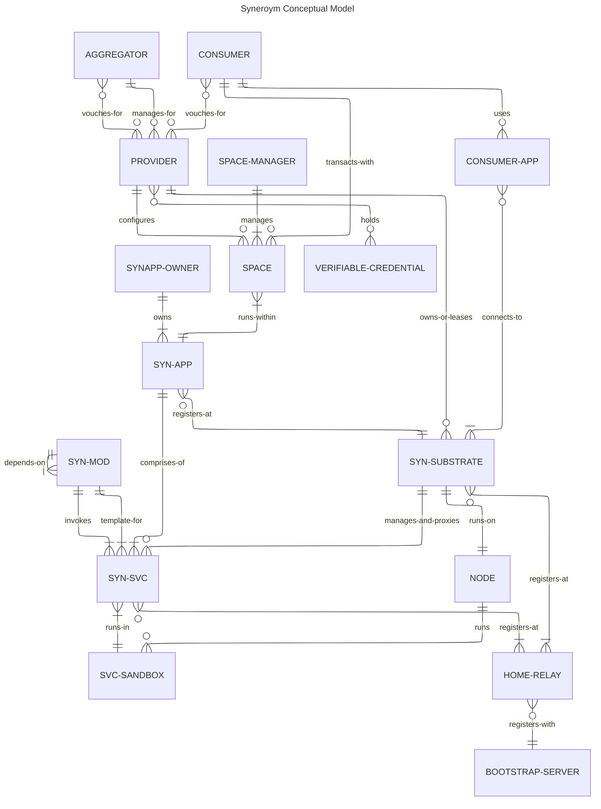

# Syneroym Ecosystem Requirements Specification [WIP]

> **Migration Note:** The architectural roadmap and target specifications have been significantly updated post-dd864a1. See the **Post-DD864A1 Target Specifications (Addendum)** at the bottom of this document for the canonical Phase 0-7 breakdown and feature details.
This document expands on the vision described [here](./VISION.md). Please go through that to understand the bigger picture. Following from there, our objective is to build a technology substrate that enables diverse classes of provider ecosystems to emerge through `Autonomous SynApps (Mini-apps) Cooperating over a common technology substrate`. We also build initial SynApps that kickstart these new ecosystems and demonstrate various interaction patterns.

> **Document scope note:** This is a *requirements* document. It specifies *what* the system does and *why*, not *how*. Sections marked `[Architecture TBD]` indicate areas where the approach is intentionally deferred to a separate Architecture Design Document. These include: reputation mechanisms, federated discoverability, coin/credit systems, DHT design, CRDT merge semantics, and relay topology.

This requirements spec is structured as follows:

- Philosophy & Design Constraints
- Requirements Overview
- Personas
- Glossary / Terminology
- Common Requirements
- Trust Model
- Conceptual Model
- Substrate Functionality
- Shared Utilities and Services
- SynApp Specs:
    - Reference Application: Business, Professional, and Retail Spaces (covering Home Services and Small Retail)
- Open Questions

---

## Philosophy & Design Constraints

A key difference in the newly envisioned provider ecosystem compared to large-scale consumer platforms is the (often geographical) clustering of service providers and consumers. Global reach and scale from a single embedding source is not a fundamental requirement. Reach and scale are improved instead by pre-established collaboration and coordination patterns across clusters of autonomous participants. Given this differentiator, we need to preserve benefits and reduce the drawbacks of large-scale consumer platforms like those listed in the [vision document](./VISION.md#background).

### Preserving Benefits

- Technology enablement of business without managed infrastructure
- Massive discovery & distribution
- Streamlining, standardization of interaction patterns
- Institutional trust
- Security at scale
- Fault tolerance
- Legal shielding
- Reputation aggregation
- Economies of scale
- Network effects

### Reducing Drawbacks

- Non-availability in constrained geographies, power/network/technology scenarios
- Vendor lock-in
- Governance asymmetry — less freedom (but less decision-making hassle) for participants
- Inflexibility to customise for localised scenarios
- Data ownership loss
- Sudden policy risk leading to unhappy participants
- No transparency of how internal systems/algorithms work
- Strategic dependency
- Not friendly to building deep provider-client relationships; mostly transactional

### Design Principles

The following principles guide design decisions throughout the system:

**Locality-first.** The system is optimised for scenarios where providers and consumers are geographically proximate. Federation beyond local clusters is a secondary concern.

**Progressive decentralisation.** A provider starts with a single device and no federation. Complexity is introduced incrementally as their needs grow. The system does not require full federation to be useful.

**Data sovereignty.** All provider data lives on infrastructure the provider controls or has explicitly chosen to lease. No provider data is stored on Syneroym-operated infrastructure except transiently for routing.

**Transparency over opaqueness.** Ranking, discovery, and reputation algorithms are either open source or provider-auditable. No hidden algorithmic black boxes determining outcomes for providers.

**Interoperability by convention.** SynApps cooperate through shared substrate primitives and open protocols. No SynApp requires a central coordinator to interoperate with another.

---

## Requirements Overview

High-level requirement highlights:

- Providers self-host business applications on commodity hardware (PCs, phones, Raspberry Pi) without requiring cloud accounts or deep technical expertise.
- Providers federate with others to share infrastructure and improve resilience and discovery reach.
- Consumers discover and transact with providers through a unified experience regardless of which substrate hosts the provider.
- The substrate provides shared primitives (identity, messaging, discovery, payments, reputation) that SynApps build on rather than re-implement.
- The system degrades gracefully under network partition — queuing, offline-first storage, and async workflows keep transactions progressing.
- All provider participants retain the ability to exit — migrating data and services to a different infrastructure provider or running independently.

## MVP Boundary (Phase 1)

*The historical MVP Boundary has been superseded. Please see the **Post-DD864A1 Target Specifications (Addendum)** section at the bottom of this document for the comprehensive Phase 0 through Phase 7 roadmap and acceptance criteria.*

---

## Personas in the Syneroym Ecosystem

The following are key personas. A single person or organisation may play multiple roles simultaneously.

**Individual Service Provider.** Provides a service to others — e.g. plumber, photographer, consultant. Or even supporting providers like logistics, warehouse, insurance, finance. May self-host or use a Provider Aggregator.

**Self-hosted Service Provider.** A provider who hosts their own online services on hardware they control.

**Service Provider Aggregator.** Takes responsibility for managing online services for multiple providers. E.g. a plumber cooperative that manages booking for all its members.

**Infrastructure Provider.** Makes hardware infrastructure available for others to use or lease. E.g. an individual with a spare PC or a small hosting co-op.

**Consumer / General User.** Uses the Syneroym ecosystem to discover and purchase services or products, or to interact with other entities (chat, follow, collaborate).

**App Developer.** Builds business SynApps and makes them available for others to deploy on their infrastructure.

**Space Manager.** A persona within a SynApp — the person (often the provider or aggregator) responsible for configuring and managing a Space, its catalog, branding, and operational policies.

---

## Glossary / Terminology

**Aggregator.** Takes responsibility for managing online services for multiple providers. E.g. a plumber cooperative.

**App Developer.** A person or organisation that builds SynApps and publishes them for others to deploy. Does not necessarily host or operate any infrastructure.

**Bootstrap Server.** A Syneroym-operated service that is a registry of active services and Relays, and handles other system management responsibilities.

**Consumer / General User.** Uses the Syneroym ecosystem to discover and purchase services or products, or to interact with other entities.

**Federation.** The process by which independent providers and infrastructure nodes interoperate to share discovery, reputation, and messaging capabilities without a central authority.

**Home Relay.** A Relay assigned to a Substrate or SYN-SVC as its primary connectivity point.

**Infrastructure Provider.** A person or organisation that makes hardware or virtual infrastructure available for Service Providers to host applications on a leased basis.

**Node.** A physical or virtual machine running one Substrate instance. May run multiple SVC-Sandboxes.

**P2P.** Peer-to-peer. To denote direct interaction between 2 entities without any intermediate broker service.

**Provider.** Short for *Service Provider*. Provides a service to others — e.g. plumber, photographer, consultant. May self-host or use an Aggregator.

**Relay.** A service that provides connectivity for SUBSTRATEs and SVCs that cannot accept inbound connections directly (e.g. behind NAT or firewall). Coordinates direct connectivity, occasionally relays encrypted traffic where direct connectivity does not work.

**Space.** A named, provider-configured business context within a SynApp (e.g. a plumber's catalog and booking page).

**Space Manager.** The person (often the Provider or Aggregator) responsible for configuring and operating a Space: catalog, branding, access control, and operational policies.

**Substrate (SYN-SUBSTRATE).** The core runtime layer on a NODE. Manages service deployment, lifecycle, discovery registration, messaging, and access control on behalf of the NODE-OWNER.

**Service Sandbox (SVC-SANDBOX).** The execution environment for a SYN-SVC. May be a WASM runtime instance, a Podman container, or equivalent. Provides isolation between services sharing a NODE.

**SynApp (SYN-APP, Syneroym Application).** A deployment manifest and control plane overlay that defines a cohesive graph of SYN-SVCs. It acts as a blueprint to deploy, update, and manage capabilities, quotas, and namespaces. It is not an execution boundary.

**SynApp Owner.** The provider who deploys a SynApp to provide services to their clients. Distinct from the Developer who develops it.

**Syneroym Module (SYN-MOD)).** A reusable, independently deployable unit of business logic. Packaged as a WASM component or OCI image.

**Syneroym Service (SYN-SVC).** A running instance of a module, executing within a SVC-SANDBOX on a Node. It is the absolute foundational zero-trust execution primitive of the Syneroym Substrate. Managed and proxied by the Substrate.

**Verifiable Credential.** A cryptographically signed attestation issued by a third party (e.g. a trade authority, government body, or community organisation) and attached to a Provider's profile. The consuming party decides which credential issuers they trust.

**Vouching.** A trust mechanism where entities issue signed endorsements for other entities within their network, creating a verifiable web of trust.

---

## Ecosystem & Domain Model

The following diagram shows the high-level business entities in the Syneroym ecosystem and how they interact.

*(Note: For the lower-level technical architecture diagram detailing modules, services, and sandboxes, please refer to the Architecture Design Document).*

---

## Common Requirements

These requirements apply across all business domains and SynApps.

### Infrastructure & Hosting

- Service Providers run business applications on PCs or mobiles they control, even when those machines are not reachable on the external internet or are behind network firewalls.
- Infrastructure Providers make hardware (old PCs, cloud VMs, etc.) available for Service Providers to host applications or application components on a leased basis.
- Service Providers monitor online service health and react to notifications about service status through UI, CLI, or other tools that leverage substrate-provided hooks.
- Infrastructure Providers monitor infrastructure health, control access to nodes, and react to notifications about infrastructure status through similar tooling.
- App Developers package SynApps (e.g. as WASM modules or OCI images), and Providers deploy them to matching container infrastructure (WASM runtime, Podman/Docker).
- Consumers access Provider services through options the Provider makes available: app UI, browser, API, or command-line tools.
- Service Providers move services and data across Infrastructure Providers without restriction. [Migration protocol: Architecture TBD]
- Service Providers back up and restore app data. The system supports a "Backup Substrate" model (a mutual backup pool) where nodes provide storage for others' encrypted backups in exchange for having their own backups hosted, extending local resilience into active failover. [Backup mechanism: Architecture TBD — Litestream is a candidate]
- Service Providers install the same app on multiple secondary devices. The app works independently on those devices when disconnected, and synchronises state with the primary device when reconnected. [CRDT merge semantics: Architecture TBD]
- Service Providers install an app such that parts (shards) of it are hosted on different hosts, each managing a subset of load.

### Connectivity & Offline Behaviour

- The substrate supports direct peer-to-peer connections wherever possible, and falls back to relay-mediated encrypted connections when NAT or firewall constraints prevent direct connectivity.
- **Offline Outbox & Retry Queue:** If a substrate, peer, or embedded service is offline (or throttled by a mobile OS), inbound and outbound requests are held in a persistent outbox queue. The system degrades gracefully under network partitions and automatically retries queued messages once reconnected.
- For transactional workflows (order → payment → fulfilment), offline behaviour is explicitly defined: actions taken while offline are queued; conflicting state changes made by both parties during a disconnected period are resolved deterministically on reconnection. [Conflict resolution rules per entity type: Architecture TBD]

### Messaging & Data Sharing

- All entities (Providers, Consumers, Services) exchange messages with each other, subject to access control policies set by the entity owner.
- Message types include: one-to-one multimedia chat, group chat, discussion threads around a pivot context (e.g. a blog post, a project), structured service messages (e.g. booking requests, record access grants), and collaborative content editing.
- Examples:
    - A provider and consumer text/audio/video chat, or exchange structured booking messages.
    - A medical provider shares patient records with the patient, or grants access to another provider with patient consent.
    - Two substrate owners chat or share media.
    - Multiple entities participate in a discussion thread around a shared context.
    - Multiple entities collaborate over shared content (e.g. collective project artifact editing).

### Non-Functional Requirements

- **Security:** All inter-node and client-node traffic is encrypted in transit. Sensitive data at rest supports encryption with keys controlled by the data owner or designated operator.
- **Identity Security:** Key rotation and key revocation are supported without requiring complete account recreation. Temporary active keys have a configurable expiration (defaulting to several months) and are supported by a decentralized revocation registry (e.g., via DHT or Gossip) for rapid invalidation if compromised.
- **Availability:** The substrate continues serving read operations during temporary relay or bootstrap unavailability when cached or local data is sufficient.
- **Durability:** Provider data backups are restorable to a new node without proprietary dependencies.
- **Observability:** Substrate and SynApps expose health status, structured logs, and basic metrics suitable for UI and CLI monitoring.
- **Performance:** Normal user actions (discover, browse, message send, order submit) complete within acceptable interactive latency on consumer broadband/mobile networks; exact SLO values are defined in architecture and test plans.
- **Interoperability:** SynApps claiming federation compatibility implement the shared interoperability schemas and version negotiation rules.
- **Portability:** Export/import formats for identity-linked service history are documented and versioned to avoid lock-in.

---

## Trust Model

Centralized platforms derive consumer trust from brand, legal accountability, and aggregated reviews. A federated system needs explicit mechanisms to establish equivalent trust without central authority.

### The Trust Problem

When a consumer discovers a provider through Syneroym, they have no prior relationship with either the provider or the infrastructure operator. The system gives the consumer sufficient signal to decide whether to transact. Conversely, providers have signal that consumers are not fraudulent.

Minimum requirement at transaction time:

- Before payment confirmation, the consumer inspects provider identity, at least one trust signal (credential, vouch, or verified transaction history), policy terms, and dispute/cancellation policy.
- Before accepting high-risk orders, providers require consumer-side trust signals (verified identity level, prior transaction history, or escrow commitment).

### Trust Layers

Trust in the Syneroym ecosystem operates at multiple levels:

**Layer 1: Cryptographic Identity.** The system uses a decoupled keypair hierarchy allowing day-to-day ephemeral routing while anchoring ultimate trust to an offline or hardware-backed root (e.g., a physical Government ID card). 
*Note: See `[FND-IDT]` in the Phase 1 Addendum and the `Identity Resolution` section in the Architecture Design document for the explicit "Three-Tier Architecture" and "Master Anchor" compromise fallback mechanisms.*

**Layer 2: Referral and Vouching.** Entities vouch for other entities within their network. A consumer who transacts with a provider vouches for them. A provider aggregator vouches for the providers it manages. Vouching creates a web of trust that consumers and automated systems traverse. [Vouching mechanics and weighting: Architecture TBD]

**Layer 3: Verifiable Credentials.** Providers attach verifiable credentials to their profile — e.g. a trade licence, a government ID, a certification. The system supports attaching and displaying such credentials without requiring a central verifier. The consuming party decides which credential issuers they trust. [Credential format and verification: Architecture TBD]

**Layer 4: Transaction History and Reputation.** Completed transactions generate a reputation record that is portable across the ecosystem. A provider's reputation is not locked to a single platform. [Reputation portability mechanism: Architecture TBD]

**Layer 5: Community Moderation.** Provider Aggregators and local communities maintain their own block/trust lists. Bad actor reports propagate across the federation with appropriate weighting. [Propagation protocol: Architecture TBD]

### Legal Liability Boundary

The system does not provide legal shielding in the way centralised platforms do — that shielding derives from the platform's legal personhood and terms of service. Syneroym infrastructure operators bear their own legal responsibility for services they host under applicable local law. The requirements are:

- The substrate makes it straightforward for a Provider or Aggregator to display their own terms of service to consumers.
- The substrate does not create an implicit representation to consumers that a federated node has been vetted by Syneroym.
- A separate document will outline recommended legal structures for Provider Aggregators operating at scale. [Legal guidance: Out of scope for this spec]

---

## Conceptual Model

The following ER diagram shows the formal entity model for the Syneroym ecosystem, with full relationship cardinalities. See the [Glossary](#glossary) for definitions of all entities. See the [Ecosystem Orientation](#ecosystem-orientation) diagram for a higher-level overview.

---

## Substrate Functionality

Description of the core Syneroym substrate functionality, key protocols, and important flows.

### Substrate Setup

- Node owner installs the substrate on a node.
- Substrate generates admin keypair on first run. Private key never leaves the node.
- Substrate registers with a Relay:
    - Contacts a bootstrap service to obtain a home relay assignment.
    - Publishes its node public key and associated relay routing information to a distributed registry or p2p network (used for the node's control plane, e.g. SYN-SVC deploy/remove).
    - Starts a secure communication server listening via the assigned relay and/or direct peer-to-peer interfaces.
- Substrate identifies its capabilities (sandbox/container types, quota configurability). Node owner configures capability limits (CPU, GPU, memory, disk, other capabilities) available to hosted Services.
- Access control setup:
    - If the node owner has a primary substrate, this substrate's pubkey is registered with it.
    - Necessary substrate access is granted to the owner's primary key.
    - SYN-APP owner pubkeys are granted access to substrate management APIs (deploy, remove, observe) with associated quotas.

### Substrate Managing Services

- Substrate provides a secure end-to-end communication channel between clients and the services it manages.
- Substrate supports WASM and Podman sandbox environments at minimum.
- Substrate attempts direct client-service communication wherever possible; it falls back to external relay (DERP) when intermediate network infrastructure does not permit direct connections.
- On mobile platforms, if the substrate and embedded services are throttled by the OS, requests are sent as offline notifications. The service response is triggered when the substrate application is next active.

### Core Substrate Services

**Messaging.** Substrate enables general messaging and data sharing across all entities, pivoted around a specific context — one-to-one multimedia chat, group chat, discussion threads around a pivot context (blog, post), social media follow/subscribe, browsing content.

**Discovery.** Nodes store a partition of a distributed search index to aid federated service discovery. [Partitioning and consistency model: Architecture TBD]

**Identity.** The substrate manages key storage, rotation, and delegation. It isolates long-term identity anchors from ephemeral routing keys and supports dynamic WASM plugins for Zero-Knowledge (ZK) proofs. *(See `[FND-IDT]` in the Addendum for explicit implementation tasks)*.

**Access Control.** The substrate enforces access control policies on all inter-service and client-service communication. Policies are owned by the entity owner and are not overridable by the infrastructure provider.

---

## Supporting Ecosystem Entities

### Relay

- On startup, a relay may apply to register as a community relay with the Syneroym bootstrap server (refreshed periodically).
- On successful registration, it is reachable as `<relaynodeid>.syneroym.net`.
- Acts as a coordination server for direct connections between peers using UDP hole punching.
- Acts as an encrypted TCP data relay when direct connection is not possible (no UDP, symmetric NAT, CGNAT).
- Acts as a TURN relay for WebRTC when browsers access services behind NAT.

### Bootstrap

- Accepts NodeId registration offers; with associated relay details as applicable.
- Maintains a list of officially operated relays with capability metadata (TCP relay, TURN, etc.).
- Accepts community relay registration offers; verifies capability claims (offline or real-time checks).
- Registers DNS entries for community relays under its domain e.g. `*.syneroym.xyz`.
- Returns a weighted random set of relays from the registry based on requested capability and relay capacity.
- Periodically audits registered relays and expires stale entries.
- For node ID lookups, checks internal cache or DHT fallback and returns the relay. For HTTP URL lookups from browsers, finds the relay and issues an HTTP redirect.

> **Single point of failure note.** The bootstrap server is a governance and availability dependency. Requirement: the bootstrap server's registry is exportable to a decentralised alternative (e.g. a well-known DHT namespace) so the ecosystem can survive bootstrap server unavailability. [Decentralised bootstrap fallback: Architecture TBD]

### Consumer-Facing Aggregation

> This section addresses a gap in the prior spec. Centralised platforms provide consumers a single app. In Syneroym, providers may run on different substrates operated by different entities. The consumer experience remains coherent.

- A Consumer App (web or mobile) allows consumers to discover, browse, and transact with providers across multiple substrates and SynApps from a single interface.
- The Consumer App queries the distributed discovery index; it does not need to know which substrate hosts a given provider.
- A consumer's identity, transaction history, and preferences are portable and self-owned — stored on a substrate the consumer controls or has designated.
- The Consumer App is itself a thin client; business logic runs on provider substrates. The Consumer App is not a privileged participant in the ecosystem.

---

## SynApp Lifecycle

### Development

- Developers build encapsulated components (e.g. using WebAssembly or standard container images) that define clear, strongly-typed interfaces for inter-component communication.
- The system supports automatically deriving external-facing APIs (e.g., JSON-RPC or HTTP/REST) from these internal component interfaces to support diverse clients like web browsers.
- Components are packaged into standard distribution formats suitable for the target substrate execution environment.

### Deployment

- An Application Specification composes components into a SynApp and declares dependencies, resource requirements, and configuration schema.
- Provider applies the Application Specification to chosen substrate(s).
- Substrate validates resource availability and access permissions before deploying.

### Monitoring

- Substrate monitors the application and provides health information, notifications, and automated redeploy on failure.
- Providers receive alerts through UI, CLI, or webhook integrations of their choice.

---

## SynApp 1: Business, Professional, and Retail Spaces

*Covers Home Services Guild and Food & Small Retailer Mesh*

### Setup and Configuration

- The Small Retail & Services SynApp is available as a deployable package for Service Providers or Aggregators.
- Provider configures deployment parameters and deploys the SynApp on chosen infrastructure.
- Provider creates one or more online Spaces. (Aggregators typically create one Space per managed provider.)
- Space Manager sets up access controls for who can manage the Space.
- Space Manager configures common Space settings: branding, payment method setup, cancellation policy defaults.
- Space Manager sets up the catalog schema and populates the service or product catalog:
    - Per-item info: title, description, images, pricing, cancellation policy.
    - Order-to-fulfilment workflow configuration: select and compose from available workflow types.
- Space Manager ingests digital content corresponding to catalog items where applicable (movies, courses, books, etc.).

### Consumer-Provider Transaction Flow

- **Discovery.** Consumer discovers provider Space through the distributed index, direct link, or referral.
- **Browsing.** Consumer browses catalog. Space may offer contextual recommendations. [Recommendation algorithm: Architecture TBD]
- **Terms and Pricing.** Consumer selects from available options; negotiation protocols allow price tuning within provider-configured bounds.
- **Order Confirmation.** Pickup/delivery location, time window, and any service-specific parameters are agreed.
- **Payment.** Payment is processed per the agreed model. [Payment rails and escrow: Architecture TBD]
- **Fulfilment.** Digital content is delivered via DRM-respecting players where applicable; physical or in-person services proceed per agreement.
- **Cancellation, Return, Refund.** Handled per Space-configured policy and applicable workflow rules.
- **Sub-workflow composition.** Complex orders (e.g. food + delivery) are handled by composing multiple sub-workflows.

### Service Variation Dimensions

The system accommodates the following variation axes across workflows:

**Booking:** Event slots, consulting time slots, open-ended job requests.

**Payment:** One-time; pre- or post-delivery; multi-part; negotiated; subscription; escrow; system coins; mutual credit systems. [See the Dynamic Ledger Network Specification](./dynamic-ledger-network-spec.md) for mutual credit mechanics.

**Product type:** Time-bound (e.g. prepared food), digital content, physical goods.

**Service type:** Time-slot service, job-completion-based service, location-based service.

**Location:** Fixed location, provider-proximate, consumer-proximate, remote/digital.

**Relationship type:** One-time, recurring, long-term with continuous shared history (e.g. doctor-patient).

**Service record:** Long-term (doctor-patient), engagement-specific (courses), tracking-required (delivery).

### Data and History

- Service record history is maintained per provider-consumer pair, with configurable expiry.
- Data sharing across providers and users leverages substrate primitives for structured sharing and access control. Provider and consumer both consent to and control what is shared with whom.
- Long-term relationship data (e.g. medical records, job history) is provider-hosted but consumer-portable on request.

### Discovery

- Entities discover other entities via keyword search, attribute-value point search, and interval/range search.
- Discovery results are drawn from the distributed index maintained by participating substrate nodes.
- Discovery ranking is transparent and configurable by the Space Manager within published bounds. [Discovery ranking algorithm: Architecture TBD]

### Reputation

- Consumers leave reviews and ratings for completed transactions.
- Reputation scores are portable — a provider's reputation is not lost if they move substrates.
- Referral-based reputation mechanisms allow trusted community members to amplify or contextualise reputation signals.
- [Reputation portability protocol, visibility, anti-gaming mechanisms, Sybil resistance: Architecture TBD]

### Advertising

- Contextual advertising is matched client-side: the consumer's device evaluates ad relevance against the local index without sending consumer query data to a third party.
- Elevated placement in discovery results is available to Space Managers within their local cluster. Placement weighting is disclosed to consumers.
- [Ad auction mechanics and placement limits: Architecture TBD]

---

## Post-DD864A1 Target Specifications (Addendum)
This document describes the pending features for Syneroym post git commit hash `dd864a18902bb8e71da0ff56bba4523688ad8ba1`.

This is a forward-looking target specification. It refines the older
[system requirements](system-requirements-spec.md) and
[architecture design](system-architecture-design.md) documents, but the older
documents still describe broader product context and several implemented
walking-skeleton choices. Where this document differs from those older docs,
the intent is to capture the next architecture to implement and then reconcile
the older docs after implementation.

### Tag Legend
To ensure stable cross-referencing across commits and PRs, features are prefixed with category tags:
- **`[TOP]`**: **Topology** (Core Architecture Primitives)
- **`[FND]`**: **Foundation** (Core Infrastructure & Security)
- **`[PLT]`**: **Platform** (Data Layer & Resilience)
- **`[LFC]`**: **Lifecycle** (Substrate & Application Management)
- **`[ADV]`**: **Advanced** (Advanced Services & Tooling)
- **`[P2P]`**: **Peer-to-Peer** (Community Primitives)
- **`[APP]`**: **Applications** (High-Level SynApps)
- **`[EDG]`**: **Edge** (Edge Expansion & Mobile)

## Phase 0: Core Architecture Implementation (SynApp & Topology)

This phase implements the architectural boundary between Syneroym Applications (`SynApp`) and Syneroym Services (`SynSvc`), and the pending addressing and registry systems required for robust service discovery.
*(Current baseline: the codebase already has DID-key service identities, a community endpoint registry client backed by HTTP/pkarr, and an in-process local `EndpointRegistry`. This phase adds app-instance namespaces, topology-aware logical names, and orchestration on top of those primitives.)*

### [TOP-PRM] Core Primitives (`SynSvc`) vs. Control Plane Overlay (`SynApp`)

#### `SynSvc` (The Execution Primitive)
The `SynSvc` is the absolute foundational primitive of the Syneroym Substrate. 
*   **Zero-Trust Execution:** Represents an isolated, zero-trust execution boundary (often a WASM component, but could also be a Podman container or a native OS service sitting behind a platform gatekeeper). It does not implicitly trust other services, even those deployed alongside it.
*   **State & Capabilities:** It owns its state and enforces capability-based security (FDAE ReBAC policies and UCANs) on all incoming requests.

#### `SynApp` (The Control Plane Overlay)
`SynApp` is removed as a runtime execution boundary and is redefined as a **Deployment Manifest and Control Plane Overlay**.
*   **Lifecycle Management:** Acts as a blueprint to deploy, update, and remove a cohesive graph of `SynSvcs` as a single unit.
*   **Capability Bootstrapping:** Orchestrates the initial injection of permissions (ReBAC relations/policies) that allow internal services within the app to communicate.
*   **Resource Accounting:** Serves as a logical grouping for tracking quotas, billing, and telemetry across a designated graph of services.
*   **SynApp Instances:** Unlike Erlang applications (which are singletons), deploying a `SynApp` manifest creates a unique **SynApp Instance** with an isolated namespace. A single substrate can host multiple distinct instances of the same `SynApp` (e.g., Personal Task Manager vs. Work Task Manager).
*   **UI Decoupling:** User Interfaces are simply specialized `SynSvcs` or external clients. A `SynApp` may contain zero UIs (headless processes), one UI, or multiple specialized UIs (Admin, Storefront, Mobile Gateway).
*   **Terminology Reconciliation:** Older docs sometimes say a `SynApp` "runs on" a substrate. In this model, only `SynSvcs` execute. A `SynApp Instance` is the manifest, namespace, capability bootstrap, dependency graph, and accounting context for those executing services.

#### Composable SynApps (App Dependencies)
Similar to Erlang OTP applications, `SynApps` are highly composable. A `SynApp` manifest is not restricted to explicitly declaring raw `SynSvcs`; it can declare dependencies on other `SynApps`.
*   **Dependency Resolution:** If `SynApp: Retail Store` depends on `SynApp: Identity Core`, the Orchestrator evaluates the dependency graph during deployment. It will ensure `Identity Core` is instantiated (or bind to an existing instance) before deploying the `Retail Store` instance.
*   **Instance Mapping:** This maintains the crucial App (Blueprint) vs. App Instance distinction. A higher-level SynApp can compose multiple foundational SynApps into a unified, deployed ecosystem, passing necessary capabilities down the dependency tree.

---

### [TOP-ADR] Service Addressing and Resolution Topology

Services communicate using a multi-tiered addressing model to support mobility, redundancy, and explicit targeting.

#### Addressing Types
1.  **Explicit Service ID (Physical ID):** 
    *   A stable cryptographic identifier for a deployed `SynSvc` instance. The current implementation uses DID-key identities derived from Ed25519 public keys; future encodings may wrap that in a shorter service identifier for ergonomics.
    *   Provider ownership of the service is proven via the service identity and its signed endpoint records, UCANs, or deployment certificates. The route to that service may change without changing the service identity.
    *   Used for stateful interactions, direct replies, and underlying substrate routing.
2.  **Logical Service Name:** 
    *   A human-readable or contextual identifier (e.g., `profile-svc`, `ledger-primary`) representing a *role* within a `SynApp Instance` namespace.
    *   Used by developers in code to ensure high availability, load balancing, and decoupling.

#### Service Topologies
When registering a Logical Service Name, the local registry tracks its underlying topology:
*   **Singleton:** Maps to exactly one Explicit ID.
*   **Redundant (Load Balanced):** Maps to an array of Explicit IDs. The resolver returns the eligible set and the caller/proxy selects a target using the manifest's policy.
*   **Sharded:** Maps to multiple Explicit IDs based on a stable routing key (for example, consistent hashing on `user_id`).

---

### [TOP-REG] Types of Registries in the Ecosystem

Rather than a strictly monolithic system, service discovery naturally emerges across different registry scopes:

1.  **Community Identity/Endpoint Registry (HTTP + pkarr/DHT):** Resolves top-level Provider, Node, and public Service identities to signed endpoint records (for example, Iroh endpoint addresses, WebRTC peer hints, or public gateway URLs).
2.  **Contextual/App Registry:** Resolves Logical Service Names to Explicit Service IDs within a specific `SynApp Instance` overlay context or shared node namespace.
3.  **Endpoint/Router Registry:** The internal substrate routing table. Maps an Explicit Service ID and interface to actual execution boundaries (for example, local WASM channels, native host functions, Podman sockets, TCP host/ports, or remote network sockets).

---

### [TOP-DSC] Discovery Mechanisms and Inventory

#### The `syneroym-core/registry` Default Service
To provide "batteries-included" service discovery, the platform provides a canonical Registry capability. It may run as a native substrate service or as an isolated Registry `SynSvc`, but it is distinct from the in-process local `EndpointRegistry`.
*   **Purpose:** Acts as the local source of truth for service inventory, logical-to-physical mapping, and health tracking.
*   **Manifest Configuration:** A `SynApp` manifest dictates how the Orchestrator handles this:
    1.  **Spawn:** Boot a dedicated, isolated instance of the Registry `SynSvc` exclusively for this app. To handle this correctly, the `SynApp` manifest must support a service dependency graph (either explicitly declared or inferred via references) so the Orchestrator boots the registry *before* the services that depend on it.
    2.  **Bind:** Register the app's services with a pre-existing, shared node-level Registry `SynSvc` (saving resources).
*   **Client Caching (Refresh-on-Failure):** Service clients query the registry to resolve a logical name, **cache** the resulting Explicit ID locally, and communicate directly with the Explicit ID. Cache entries carry a topology epoch or TTL and are refreshed on connection failure, registry update notifications, or expiry.
*   **Master Anchor Resolution (Revocation Handling):** To maintain secure identity revocation without breaking standard DHT signatures, the ecosystem enforces the **Master Anchor** pattern:
    *   Registries map Logical Service Names exclusively to the **Master Key**.
    *   The Master Key maintains a single `pkarr` DHT record containing an array of currently authorized **Temporary Keys** (the actual routing `NodeId`s).
    *   **Passive Revocation:** If a Temporary Key is compromised, the Master Key simply updates its DHT array to drop the compromised key. The registry and DHT mechanics themselves do not change.
    *   Dependent clients cache the route. Upon a connection failure (or periodically), they perform a "Refresh-on-Failure" by looking up the Master Key's DHT record again, instantly dropping the compromised key since it is no longer authorized.
    *   *(Note: Phase 0 delivers the Master Anchor endpoint-resolution contract, but defers production Master Anchor DHT authorization to Phase 1 `[FND-IDT]`.)*

#### Static Deployment Inventory (`roymctl`)
Not all apps require a live, queryable registry at runtime (e.g., trivial background cron jobs or standalone static UIs).
*   For these trivial apps, the orchestrator/CLI (`roymctl`) maintains a static, local state file (or local host DB).
*   It records the mapping of `SynApp Instance ID / logical role > Explicit Service ID(s)` at deploy time.
*   This static inventory is sufficient for lifecycle management (listing, stopping, uninstalling) without the overhead of spinning up a live Registry `SynSvc`.

---

### [TOP-ROB] Network & Connection Robustness

This defines the baseline resilience required for underlying node-to-node and client-to-node transport links, ensuring Syneroym handles transient network partitions gracefully before falling back to application-layer offline queues.

- **Transport Resilience & Retries:** 
  - The system must gracefully handle transient network drops. Any failed connection attempt must not immediately fail the higher-level request.
  - Implement automatic retries for establishing connections. The retry count should be configurable per service dependency or manifest default, defaulting to 3 retries with a simple exponential backoff.
  - Automatic request retries are only safe for connection setup, idempotent operations, or calls explicitly marked retryable with idempotency keys. Non-idempotent calls must surface failure or enter an opt-in outbox workflow.
- **Reactive Connection Management:**
  - Standard transport-level timeouts (e.g., QUIC idle timeouts, WebRTC SCTP timeouts) are used to detect dropped peers. We do not implement custom application-level ping/pong heartbeats to save bandwidth and complexity.
  - Stale connections are handled reactively: "evict when found out." If a read or write operation fails due to a disconnected peer, the connection is instantly marked as dead and retried or surfaced as an error.

---

## Phase 1: Foundation & Core Infrastructure

### [FND-DEP] Deployment/Operations
- **Cloud-Agnostic Bare-Metal Deployment:** Single Rust binary deployed to a standard Linux instance (e.g., AWS Lightsail) using native `systemd` to minimize virtualization overhead.
- **In-Repo Provisioning & Deployment:** `scripts/deploy/setup_linux.sh` handles initial machine setup (certbot, limits, systemd), while `scripts/deploy/deploy.sh` handles local compilation and rsync transfer. GitHub Actions (`.github/workflows/deploy.yml`) acts merely as a trigger to run the local deploy script.
- **Native TLS:** Direct or systemd-socket-activated binding to port 443 within the Syneroym substrate using `rustls`. Certificates are fetched/renewed via an OS-level `certbot` timer. The substrate restarts or reloads configuration to pick up renewed certificates.
- **Resource Protection:** Configuration parameters for connection caps and cache limits ensure the node gracefully refuses excess traffic instead of crashing (OOM).
- **Observability:** Phase 1 relies purely on SSH access. Operators monitor via `journalctl -u syneroym -f` and local `curl` requests against built-in endpoints (e.g., Iroh relay metrics).
- **Cross-Platform Distribution:** Automated build pipelines to compile and release Syneroym binaries for different architectures (Linux, macOS, Windows).
- **Dockerized Substrate:** Provide official Docker images of the Syneroym substrate for the community, pre-configured to point their local registries and coordinators to the public `syneroym.xyz` node.
- **Smoke Testing:** Automated integration/smoke tests that run against release candidates (binaries and Docker images) to verify they can successfully connect to and interact with the deployed coordinator and registry at `syneroym.xyz`.

### [FND-SEC] Substrate Security
- **Data at Rest Encryption (Envelope Encryption):** 
  - To prevent catastrophic re-encryption of gigabytes of data during key rotation, the substrate uses Envelope Encryption. Unique Data Encryption Keys (DEKs) are generated to encrypt the actual blobs and `cr-sqlite` databases.
  - The service owner negotiates and injects a Master Key (Key Encryption Key or KEK) securely into substrate RAM at startup. The KEK only encrypts the tiny DEKs stored on disk. Key rotation is instantaneous as only the DEKs are re-encrypted with the new KEK.
  - **Secret Vault:** Application secrets (API keys, credentials) are stored securely inside a dedicated Vault table within the encrypted per-service SQLite/`cr-sqlite` database, rather than as vulnerable flat files on disk. Non-secret configuration may share the same encrypted store for convenience, but it is not treated as a secret unless marked as such.
  - The `SynApp` manifest includes configuration flags (e.g., `encrypt_local_db: true`, `encrypt_backups: true`) to allow explicit opt-out only for non-sensitive development or performance-sensitive deployments where the owner accepts the risk.
  - Remote backups (e.g., WAL frames or object snapshots) are streamed to S3-compatible stores or peer backup substrates and are encrypted locally before transit when configured.
- **Hardware Attestation (Deployer-Led):** 
  - The substrate exposes a `substrate.attest(nonce)` API to the network.
  - The App Deployer/Owner externally challenges the node (at deployment or periodically) and mathematically verifies the hardware quote (TPM, KeyAttestation, AppAttest).
  - The deployer alone decides whether to deploy the service in a degraded trust environment or halt execution if attestation fails. 
- **Memory Protection & Key Splitting:**
  - OS-level memory locking (e.g., `mlock`) prevents injected cryptographic keys from being swapped to disk.
  - The `zeroize` crate is used to explicitly wipe sensitive variables from RAM when dropped.
  - Keys in substrate memory are split or fragmented as a best-effort mitigation against naive RAM scraping or buffer over-read vulnerabilities. This does not replace hardware-backed key protection.
- **Resource Exhaustion & Quotas:**
  - Network edge protection: Strict connection and payload limits at the Iroh/QUIC boundary.
  - Runtime execution limits: The substrate enforces the physical capabilities of the host alongside strict quotas defined in the `SynApp` manifest (e.g., `max_memory`, `max_instructions`). Wasmtime's fuel metering deterministically traps components exceeding their gas limits without stalling the node.
- **Supply Chain Integrity:**
  - Syneroym binaries are distributed with simple, native Ed25519 signatures. The public key is hardcoded, and the auto-updater mathematically verifies the signature before applying any new binary.

> **Implementation Design:** For technical details covering Envelope Encryption and Memory Protection, see [Feature Design: FND-SEC](system-architecture-design.md#fnd-sec-substrate-security).

### [FND-IDT] Cryptographic Identity Primitives
- **Three-Tier Key Management:** Implement the core library for managing the Three-Tier Identity Architecture (Government ID -> Master Key -> Temporary Key).
  - The substrate must securely generate and manage local Master Keys (`did:key`) and enforce the Master Anchor pattern, where Master Keys delegate Temporary Keys for daily routing.
- **Master Key Export & Recovery:** Implement the ability to securely export the Master Key (encrypted at rest) for multi-device synchronization. Implement the **Tier 1 Fallback** mechanism, ensuring the system can process and broadcast new ZK Proofs to override compromised Master Keys.
- **ZK Plugin Interface (Method B):** Implement a WASM extension point that allows the substrate to dynamically load Zero-Knowledge Proof schemes (e.g., `anon-aadhaar`) on demand for identity verification without bloating the core binary.

### [FND-CFG] Service Configuration

Given that Syneroym supports both native WASM components and legacy Podman containers, configuration and secret management use a dual-target approach:

- **Configuration Delivery**:
  - **WASM (Native)**: Services retrieve their hierarchical configuration on-demand via a standard host function (e.g., `syneroym:config/get`). WASI environment variables or pre-opened files may be exposed only as an explicit compatibility mode for non-secret values.
  - **Podman (Legacy)**: Because third-party containers expect specific formats, the `SynApp` manifest dictates how the orchestrator exposes the config. The orchestrator will either flatten the config into standard environment variables or serialize nested configurations (JSON/TOML/YAML) into temporary files and mount them read-only into the container.
- **Secret Management**:
  - **WASM (Native)**: Strictly adheres to `[FND-SEC]`. The service pulls secrets directly into locked RAM via `syneroym:vault/reveal`. Secrets never touch the filesystem or environment variables.
  - **Podman (Legacy)**: The orchestrator resolves the secret from the Vault at deployment and injects it as an environment variable or via an ephemeral `tmpfs` mount. This accepts a degraded security posture (secrets visible in process lists) as a necessary tradeoff for running legacy software.
- **Dynamic Updates & Restarts**: Configuration is versioned and immutable for a running invocation. For WASM, a new configuration generation applies to the next component invocation; already-running invocations continue with the generation they started with. For Podman, the orchestrator must gracefully restart/recreate the long-lived container to apply the new configuration or secrets.
- **App Composition (Bind vs. Spawn)**: When a parent `SynApp` depends on another app, the configuration resolves based on the dependency mode:
  - **Spawn**: If the dependency must be spun up alongside the parent, `roymctl` inlines the child manifest into the parent at deploy-time, creating a single flattened deployment graph.
  - **Bind**: If the parent depends on an *already running* app instance, the parent manifest references it. The orchestrator resolves the target's Explicit Service IDs via the App Registry and injects those connection details into the parent's configuration, rather than spawning new instances.
- **Schema Validation & Defaults**: To prevent runtime crashes, `SynSvc` manifests can define a schema (e.g., JSON Schema) for their expected configuration. `roymctl` and the Orchestrator validate the user-provided configuration against this schema at deploy-time, catching missing keys or type mismatches early.
- **Out-of-Band Secret Rotation**: While regular configuration changes happen via explicit manifest deployments (which naturally trigger a restart), secrets live independently in the Vault. If a secret is rotated *out-of-band* by an admin, the manifest's `rotation_policy` dictates whether the orchestrator automatically restarts the affected service or waits for the next manual deployment.
- **Anti-Goal: "Helm-ification"**: The `SynApp` manifest is strictly a "dumb", fully-resolved document. Syneroym rejects complex in-manifest templating (like Helm). If developers need environment-specific overrides, they should use external tools (like `cue`, `ytt`, or simple scripts) to generate a static manifest *before* passing it to `roymctl deploy`. The only dynamic variables supported are standard host parameters (e.g., `SYNEROYM_NODE_IP`) that the orchestrator inherently injects at runtime.

> **Implementation Design:** For technical details regarding the dual-target configuration delivery and cold restart behavior, see [Feature Design: FND-CFG](system-architecture-design.md#fnd-cfg-service-configuration).

### [FND-IAM] Access Control
- **FDAE (Federated Data-Aware Authorization Engine):** Adopts the FDAE architecture, which decouples the authorization specification (the "What") from the environment-specific execution (the "How"). It avoids the traditional PBAC vs. ReBAC dilemma by acting as an intelligent, distributed routing engine. It utilizes a declarative, Zanzibar-style structured configuration (e.g., YAML/JSON) to map relationship chains across fragmented data sources. The Substrate directly deserializes this configuration into a typed policy model, avoiding custom string parsers while still giving the query planner a structured representation to execute.
- **Solving the Data Fetching Problem (Pushdown Sieve):** For local contiguous relationships, FDAE collapses the graph into a single, deeply nested query. By compiling ReBAC policies directly into SQL `WHERE EXISTS` clauses, the SQLite engine performs massive-scale relationship filtering at the C-level, handing only authorized rows back to the WASM guest.
- **Dual-Mode Execution:** FDAE natively handles both **Point-In-Time Evaluation** (returning a swift Allowed/Denied flag for a specific resource check) and **Relational Data Filtering** (applying the security policies as a global subquery to prune index-level datasets before they ever reach the Wasm guest).
- **UCAN Integration (Normalized Claims, Capabilities, Scopes):** Access control is a robust synthesis of cryptographic capabilities and relational data state.
  - **Context Initialization:** When a request arrives, the gateway mathematically verifies the UCAN chain, normalizing external authentications (OIDC, DIDs, WebAuthn) into internal DIDs. It extracts the proven **claims**, **capabilities**, and **scopes**.
  - **Relational Verification:** The SQL Compiler uses these normalized UCAN scopes and claims as bound parameters (`?`) for its query.
- **The Extensible 4-Stage Hybrid Pipeline (Federated + SQL + WASM):** The authorization pipeline handles complex cross-boundary logic seamlessly:
  1. **Pre-Step (Context & UCAN Verification):** The substrate verifies the UCAN chain into a secure execution context.
  2. **Cross-Service Parameter Fetch:** If a relationship step crosses an asset boundary (e.g., requires data from a centralized security or org-service), the engine pauses, triggers an RPC/Wasm host function to fetch the remote relationship proofs or parameters, and injects them into the local evaluation context.
  3. **SQL Execution (The Relational Sieve):** SQLite natively filters candidate rows based on the ReBAC policies, UCAN context, and any parameters fetched during the cross-service fetch.
  4. **After-Step (ABAC & Override Filter):** An optional custom WASM function performs fine-grained, non-relational ABAC checks on the candidate rows.

> **Implementation Design:** For technical details regarding the FDAE architecture and the 4-stage hybrid pipeline, see [Feature Design: FND-IAM](system-architecture-design.md#fnd-iam-access-control).

## Phase 2: Core Platform Capabilities

### [PLT-DAT] Data Layer
The Data Layer provides a complete foundation for distributed application state and communication, securely accessed via typed host functions or APIs without exposing raw database engines to the applications.

- **Structured Data Service (Document Database):**
  - **Database Isolation (One DB per Service):** The canonical primitive for structured state (backed by SQLite). Instead of a monolithic combined database, every stateful `SynSvc` gets a fully isolated, separate SQLite database file (and WAL). The substrate also maintains its own separate database. This guarantees true concurrent write scaling across services, allows selective WAL replication, and isolates failure domains.
  - **Concurrency Model:** Designed for high throughput using a Single-Writer Thread / Multiple-Reader Pool architecture per database. This perfectly aligns with SQLite's WAL mode, eliminating `SQLITE_BUSY` lock contention and maximizing performance in asynchronous Rust.
  - **Resource Model:** Collections with lightweight schemas (loose enforcement of types, explicit indexed fields) containing JSON records. The data layer automatically injects a spoof-proof `creator_id` into every record.
  - **Schema Initialization (DDL):** During the `init` phase of deployment, `SynSvc` manifests supply DDL as a variant collected by the `SynApp` manifest: initially plain SQL strings (e.g., `CREATE TABLE`, `CREATE VIEW`, `CREATE INDEX`) and, in the future, a structured data model object. Starting with plain SQL is safe for trusted services because each service owns an isolated database, and access is gated by IAM. Views defined during init are instantaneous (no write-lock penalty, unlike index creation) and can be targeted by the `AggregationPipeline` at runtime.
  - **Operations & Queries:** Full CRUD operations (`create_collection`, `put`, `patch`, `get`, `delete`, `delete_many`). It also supports `batch_mutate` for atomic transactions across multiple records. The query engine translates an abstract `FilterExpr` (supporting `Eq`, `In`, `Contains` for full-text, etc.) and `AggregationPipeline` (for projections, `group_by`, `having`) into parameterized SQL queries with cursor-based pagination. Aggregations can target both physical collections and logical views.
  - **WASM Serialization & WIT Boundary:** Expand the `syneroym:data-layer/store` WIT boundary to support robust nested record serialization/deserialization. Currently, only basic types are supported; this enables seamless passing of complex JSON object graphs between WASM components and the host.

- **Object Service (Content-Addressed Blobs):**
  - **S3-Compatible Storage:** Dedicated blob storage for large media and software artifacts, natively content-addressed (keyed by SHA-256).
  - **Data Integration:** Blob hashes are stored as standard string fields in the Structured Data Service records.
  - **HTTP File Serving:** Built-in HTTP serving of public/private objects (with signed URLs), supporting static website hosting and CDN-friendly delivery directly from the blob store.

- **MQTT Event Service (Asynchronous Coordination):**
  - **Pub/Sub Broker:** Handles asynchronous communication, state propagation, and device workflows.
  - **Features:** Supports wildcard topics, retained messages, and real-time change notifications to trigger workflows or invalidate caches.

- **Universal Proxy (Inter-Component RPC):**
  - **Typed Interactions:** Developers use strongly typed WIT imports (`import acme:booking/service;`) rather than generic untyped APIs.
  - **Interception & Instance Mapping:** The Substrate injects a proxy host function during component instantiation to satisfy the WIT import. It resolves the generic import to a specific running `service_id` by consulting the application manifest and Orchestrator Registry.
  - **Protocol Translation:** The substrate traps the WASM call and dynamically proxies it to the specific instance. The target design serializes native WASM-to-WASM calls into fast, binary **wRPC** over Iroh QUIC. Until the wRPC surface is implemented, JSON-RPC remains the available external bridge. Legacy Podman containers and external clients use universal **JSON-RPC** over HTTP/WebSocket unless an adapter provides a richer interface.
  - **Static Composition Bypass:** Dependencies can be statically composed (e.g., via `wasm-tools compose`) into a single binary before deployment. In this case, imports are satisfied internally, the Substrate is completely bypassed, and execution occurs with zero overhead within the sandbox.

> **Implementation Design:** For technical details regarding the embedded MQTT broker and the wRPC Universal Proxy architecture, see [Feature Design: PLT-DAT](system-architecture-design.md#plt-dat-data-layer).

### [PLT-ASY] Asynchronous Operations & Scheduling

The Asynchronous Operations component ensures reliable execution of offline interactions, long-running workflows, and periodic tasks, even in the presence of network partitions or transient service failures.

- **Resilient RPC & Retries:**
  - **Configurable Policies:** Retry policies (e.g., exponential backoff, maximum attempts) are defined at the service level by default, but can be overridden per-request.
  - **Dead Letter Queue (DLQ):** When the maximum retry limit is reached, retryable or outbox-backed messages are routed to a Dead Letter Queue for auditing, manual intervention, or later replay, preventing silent data loss. Non-idempotent synchronous calls fail directly unless the caller supplied an idempotency key and opted into queuing.

- **Offline Message Semantics & Outbox:**
  - **Optimistic Local Execution (Fire-and-Forget):** Clients can trigger operations using a fire-and-forget flag (or wrapper API) indicating it is "ok to send later". The client UI treats the request as optimistically successful. 
  - **Return Value Constraints:** Offline-capable calls cannot synchronously return data (e.g., a server-generated ID). Applications must rely on client-generated identifiers (e.g., UUIDs) or design the interaction to not require immediate server responses.
  - **Outbox Queue:** Offline requests are durably stored in an outbox queue and periodically synced when connectivity is restored.

- **Long-Running Tasks:**
  - **Uniform Execution:** Long-running tasks composed of multiple compute and service calls are supported uniformly (e.g., executed as standard Wasm functions).
  - **In-Memory State Management:** The request to start the task is durably recorded, but the active execution state resides in the asynchronous engine's memory. If the process is interrupted, the task restarts from the beginning only when the task is idempotent or explicitly restartable; otherwise it fails and runs compensations rather than resuming from a mid-execution disk snapshot.

- **Periodic & Scheduled Tasks:**
  - **Lease-Based Scheduler:** To prevent load skew and overlapping executions in a clustered environment, cron/periodic triggers use an execution lease mechanism backed by the Registry.
  - **Delegated Execution:** The node that wins the lease acts only as the "Orchestrator" for that tick. It selects a target worker node (e.g., randomly or via load metrics) and dispatches the actual execution command to it.
  - **Overlap Prevention:** The lease is held in the Registry until the executing node completes the work. If the task exceeds its cron interval, subsequent timer ticks across the cluster will fail to acquire the lease and safely skip the run.
  - **Registry Availability:** Cluster-wide lease acquisition is a control-plane dependency. If the Registry is unavailable, new clustered schedule ticks pause or skip safely; single-node schedules may continue using local leases if the manifest permits.

- **Compensating Transactions (Saga Pattern):**
  - **Undo Interfaces:** To handle permanent failures in distributed scenarios without leaving the system in an inconsistent state, services can expose `undo_<operation>()` endpoints in their WIT interfaces.
  - **Automated Rollback:** If a step in a multi-stage workflow fails permanently, the orchestrator executes the corresponding compensating functions for the previously completed steps to rollback changes.

> **Design Rationale:** 
> - **Offline vs Pessimistic:** Not all operations make sense offline. Pessimistic locking (synchronous execution waiting for connection) remains the standard path. The fire-and-forget outbox is strictly an opt-in pattern for offline-capable operations.
> - **In-Memory vs Durable Execution:** While "Durable Execution" (saving the exact intermediate execution state to a DB, like Temporal) assists with idempotency, it is highly complex to implement within the Wasm host and still fails if there are strict time constraints between I/O steps. We instead trade platform complexity for explicit workflow definition—our in-memory approach requires that if a process crashes mid-task, the task is fully aborted and compensated (via `undo`) rather than resumed.
> - **Saga Arguments:** The compensating `undo` functions generally accept the identical arguments as the original forward operation (along with the generated resource ID) to precisely reverse the specific action.

### [PLT-RED] Service Redundancy
This feature guarantees data durability, service continuity, and split-brain prevention for the Syneroym network, strictly prioritizing Consistency over Availability (CP) during network partitions.

**Database Redundancy**
- **Configurable Stateful Replication:** The replication factor (e.g., N=1, N=2, N=3) is configurable at service deployment time via the application manifest. For replicated setups (N>=2), there is exactly one Primary accepting write operations, while the Secondaries maintain an identical read-only state. The Registry reflects the topology defined by the manifest.
- **Low-Latency Streaming:** Replication must be near-instantaneous. Changes committed to the Primary must be streamed directly to the Secondary without relying on high-latency batching or third-party storage intermediaries for the live replication path.
- **SQLite-Safe Application:** The replication layer must respect SQLite WAL and shared-memory invariants. It must not depend on ad hoc mutation of another live SQLite process's `-wal` or `-shm` files.
- **Disaster Recovery:** In addition to live node-to-node replication, the system must support periodic asynchronous backups to external object storage (S3-compatible) to enable cold starts and disaster recovery.

**Blob Storage Redundancy**
- Large files and blobs are not replicated via SQLite. Instead, the platform relies on external, configurable S3-compatible storage backends. The underlying S3 provider is responsible for ensuring the redundancy of these blobs.

**Registry & Topology Management**
- **Single Source of Truth:** The Registry Service is the authoritative control plane for all cluster membership and routing topology.
- **Manual Promotion (CP Focus):** To prevent split-brain scenarios, there is strictly no automatic failover. If a Primary fails, the system deliberately drops its redundancy level (Availability impact) to preserve data Consistency. Promoting a Secondary to Primary requires explicit operator intervention via the Registry.
- **Strict Quarantining:** When a failed node is deposed, the Registry must mark its Node ID as `QUARANTINED` for the current topology epoch. It cannot rejoin data-plane service under the same identity until an explicit operator re-provisioning or retirement workflow clears the condition.
- **Routing-Level Fencing:** The system must enforce split-brain prevention at the routing layer. `QUARANTINED` nodes must be completely isolated:
    - *Ingress:* All other nodes and clients must clear their routing caches and immediately cease sending requests to the quarantined node.
    - *Egress:* Any outbound requests originating from a quarantined node (e.g., if it is merely network-partitioned) must be strictly rejected by all receiving services.

**Control Plane vs Data Plane Isolation**
- The Data Plane must be fully decoupled from the availability of the Control Plane for already-known healthy routes. If the Registry service goes offline, existing data plane routing, MQTT message flows, and HTTP access continue using the last known cached topology until the control plane is restored. New deployments, promotions, quarantine decisions, and clustered scheduler leases pause or fail closed while the Registry is unavailable.

> **Implementation Design:** For technical details regarding the Iroh-based WAL replication and routing-level fencing, see [Feature Design: PLT-RED](system-architecture-design.md#plt-red-service-redundancy).

## Phase 3: Substrate & Application Lifecycle

### [LFC-MGT] SynApp Lifecycle Management
- Orchestrates the deployment, configuration, and monitoring of SynApps and their constituent SynSvcs across a decentralized network of substrates.
- **Application Manifests**: A SynApp is defined by a declarative manifest containing:
  - A list of required `SynSvc` instances (WASM components, Podman containers, native host services, or external TCP/HTTP services).
  - Explicit configurations for each service, including resource quotas and limits.
  - **Explicit Bindings**: First-class declarations of logical network dependencies (e.g., `requires: backend_api`). The orchestrator uses these to construct a dependency graph and resolve physical addresses *before* injecting them into the service's configuration.
- **Substrate Inventory**: The control plane maintains a user-defined inventory of target substrates, tracking their known capabilities to facilitate intelligent deployment scheduling. Target substrates enforce access control to ensure only authorized deployments are accepted.
- **Operational Modes**: Lifecycle management is supported via two distinct operational modes utilizing a shared set of core orchestration libraries:
  1. **CLI Standalone Mode (roymctl)**: Designed for **one-shot decentralized deployment**. The CLI reads a manifest, synchronously deploys services to available online substrates, and records an installation trace in a local SQLite database. It does not queue tasks for offline substrates. Drift from the desired state is resolved manually via a single-pass `reconcile` command.
  2. **Active Control Plane Mode (Server SynApp)**: An optional controller `SynApp Instance` deployed onto an owner or cluster's network. Its control services run as ordinary `SynSvcs`. It accepts manifests via an API, stores the desired state in its replicated SQLite database, and runs a continuous background reconciliation loop to watch the actual state of services and trigger deployments/undeployments automatically. It is not a global central coordinator.

### [LFC-VER] Versioning support overall
- **Substrate Upgrades**: Substrate binaries are updated via conscious, operator-driven actions rather than automatic, unverified polling. The system must support rollback to previous binaries (e.g., via `roymctl revert`) in case an upgrade introduces instability or fails health checks.
- **SynApp/SynSvc Compatibility**: SynApp compatibility is based on WASM interface capabilities rather than rigid Substrate versions. While a SynApp manifest may list Substrate versions as advisory "tested-on" metadata (similar to browser compatibility), the Substrate ultimately decides to accept deployment based on whether it can satisfy the required WIT host interfaces.
- **Service Upgrades & Migrations**: SynSvcs (WASM components) require automatic, state-safe upgrades. The system must support automatic filesystem-level snapshotting of service state (SQLite) before an upgrade. If the new service version fails to initialize or migrate its schema, the Substrate must automatically rollback to the snapshot and the previous WASM binary.
- **Network Compatibility**: Multi-substrate communication relies on a dynamic Capabilities/Protocol Matrix. During the connection handshake, nodes negotiate their supported protocols (e.g., `["syneroym/rpc/v1", "syneroym/rpc/v2"]`). The core team deprecates older protocols deliberately on a case-by-case basis, avoiding the brittleness of a rigid sliding-window (N-x) policy.

## Phase 4: Advanced Services & Tooling

### [ADV-OBS] Observability enhancements
- **Comprehensive Metric Types**: Beyond system-level resources, track Application Metrics (SynSvc call counts, error rates, response times) and Network Metering (bytes transferred, connection durations, relayed byte amounts for multi-hop routing). The metric pipeline is extensible to support future infrastructure additions like GPU usage, LLM token counts, or specific AI service utilization.
- **Granularity & Retention**: Implement automatic data rollups to balance storage costs. The system defaults to storing raw events for 24 hours, which then roll up directly into 1-hour buckets retained for 30 days (skipping minute-level granularity for simplicity and storage efficiency).
- **Data Mashups & Flexible Metadata**: Metrics are tagged with Substrate ID, Service Owner ID (DID), and Datetime. The underlying format incorporates extensible JSON properties to support dynamic metadata, allowing for future additions such as applying "agreed rates" for billing without rigid schema coupling.
- **Access Control Enforcement**: 
  - Substrate owners have root access to all metrics on their node.
  - Service owners are restricted to viewing metrics exclusively for their deployed SynApps/SynSvcs.
  - Relay providers have access to routing byte counts to log charges against source/destination nodes.
- **External API Strategy**: Substrates do not render internal dashboards. Instead, metric data is exposed securely via an access-controlled RPC endpoint, designed to be consumed by external visualization SynApps or dedicated metering applications.

### [ADV-AI] Advanced AI & Agentic Workflows
- **Local Model Inference Service:** A lightweight wrapper service within the substrate that manages the underlying AI engine (e.g., Ollama). It orders the engine to install/download specific base models from a strict allow-list defined by the node operator, and proxies inference calls to the desired agent/model combination. Supports dynamic model loading within the permitted list and is accessible by other `SynApp` services via the Universal Proxy.
- **Hardware-Gated Capabilities & Decoupling:** Local model installation and inference are strictly gated by automatic hardware detection (e.g., GPU/NPU availability, RAM capacity) and explicit owner configuration overrides. Crucially, the Agent logic (lightweight WASM) and the LLM inference (heavy compute) are fully decoupled. If the local node lacks hardware for LLMs, it can still run the Concierge Agent locally while routing just the LLM inference requests to capable remote substrates. Alternatively, it can outsource both the Agent and the LLM entirely. The proxy agent service explicitly configures these upstream/remote endpoints to avoid any inverted dependency on application-layer aggregators.
- **The Concierge Agent (Rig-core):** The core agentic `SynSvc` running natively on the substrate. Frontend clients (like Trusted Rooms) send natural language intent directly to this agent.
- **Dynamic Tool Retrieval Loop:** The agent uses a dynamic "Retrieval Augmented Tool" approach to avoid context bloat:
  1. The loop starts by giving the LLM exactly **one** meta-tool: `search_ecosystem_tools`.
  2. The LLM calls `search_ecosystem_tools(query)`.
  3. The Concierge Agent executes a semantic search against its local Ecosystem Vector Directory.
  4. The agent dynamically injects matching tool schemas into the LLM's context.
  5. The LLM selects the best tool and generates the execution command.
  6. The agent invokes the target service via the Universal Proxy, returning **Action Cards**.
- **Human-in-the-Loop (HITL) Consent:** For high-stakes tool calls, the Concierge Agent pauses execution and yields a "Proposal Card" to the Trusted Room. The user must cryptographically sign (consent) before the loop resumes. This is configured natively via tool arguments.
- **Agent Observability (Progress Streaming):** Configurable progress streaming where the Concierge Agent broadcasts structured status, tool calls, citations, and validation events back to the UI. Raw private model reasoning is not exposed as an application contract.
- **MCP Gateway:** A headless gateway layer that exposes the substrate's local capabilities to *external* desktop clients using the Model Context Protocol (MCP).
- **Agent-to-Agent Delegation:** The capability for a user's Concierge Agent to autonomously negotiate with external provider agents across the Syneroym substrate.
- **Ecosystem Vector Directory & Memory:** A specialized local data store (`sqlite-vec`) indexing available tools and storing episodic memory.
- **Orchestrated Loopcraft (Nested Agentic Loops):** To ensure high reliability on complex tasks, the Concierge Agent employs the "Loopcraft" methodology. Rather than executing a single, flat ReAct loop, the agent network utilizes pre-defined, specialized loops (e.g., a "Data Gathering Loop," a "Synthesis Loop," or a "Verification Loop"). These specialized loops are compiled and deployed as independent native WASM components (`SynSvcs`). The core Concierge Agent conditionally routes tasks through these stacked loops via the Universal Proxy based on the problem state. For instance, drafting an Action Card for a financial transaction will strictly route through a Verification Loop (a Critic sub-agent) before presenting it to the user. This orchestrated nesting allows for deep, self-correcting reasoning while maintaining strict zero-trust isolation between loops.

### [ADV-DEV] SynApp Developer Tooling & SDKs
- **Transparent Developer Experience**: Rather than providing a rigid CLI wrapper, Syneroym development embraces transparent, standard Rust tooling. Project templates (via `cargo generate`) are provided to set up standard `Cargo.toml` files and build scripts. This ensures compatibility with existing IDEs, Language Servers (LSP/rust-analyzer), and agentic coding tools.
- **Local Substrate for Integration & Dev**: To ensure zero-drift execution, developers use an actual local Syneroym node (e.g., `roymctl dev`) for local integration testing and development. This completely avoids the massive engineering effort of duplicating the WASMTIME host, SQLite, and network logic into a standalone developer SDK. The SynApp couples to the Substrate entirely through standard WIT interfaces, not compile-time bindings.
- **Pure Mock SDK for Unit Testing**: We provide a minimal `syneroym-dev-sdk` intended exclusively for isolated unit testing. This SDK provides simple, purely in-memory mock implementations of the Substrate interfaces (Data, Blobs, AI). Developers can write `#[test]` functions that link against these mocks for fast, offline verification of application logic without needing to spawn a real Substrate node.

## Phase 5: Peer-to-Peer Community Primitives

Because Syneroym can be utilized as a general open cloud, this dedicated phase separates purely foundational low-level network connectivity (`[TOP]`) from higher-level community-driven peer networking primitives.

### [P2P-DSC] Federated Tag-Routed Discovery
- **Native P2P Message-Passing Graph:** High-level discovery is built directly into a federated routing graph. Nodes send discovery intents to their direct peers. If a peer cannot fulfill the request locally, it forwards the intent.
- **Hierarchical Tags:** Intents are routed using hierarchical tags representing composed logical groups (e.g., `#close-friends`, `#office-network`). Queries are pushed only to relevant active connections matching the tag, which uniformly encompass both individual peers and service substrates.
- **Aggregators as Super-Peers:** Directory applications ("Aggregators") are supported, but from the substrate's perspective, they simply present the identical standard interface as any other peer. The Syneroym community registry can point to default aggregators, which individual substrates can optionally configure as default "super-peers" to enhance discovery performance.

### [P2P-REP] Peer Reputation & Trust
- **Coarse-Grained Satisfaction Signal:** Reputation is implemented as a low-resolution scale (e.g., 0=Poor, 1=Decent, 2=Great) to minimize cognitive load and mathematical complexity.
- **Cryptographic Tying:** To prevent Sybil attacks and gaming, a satisfaction signal can only be submitted if strictly tied to a mutually signed interaction receipt (leveraging the Dynamic Ledger Network mechanics).
- **Time-Decay:** A peer's reputation naturally decays to the center ("decent") over time, prioritizing recent interactions over historical legacy.
- **Incremental Rolling Summaries:** The substrate runs continuous, compute-light incremental aggregations (e.g., updating total user counts, moving averages, and maintaining a small, tiered summary paragraph based on timeframes). This avoids the need to process heavy LLM summarization on massive blocks of raw text.
- **Provider-Hosted Reputation Graph:** Signals are *not* pushed to a global, public DHT. They are appended to the Provider's local immutable CRDT ledger. Providers share their verified, signed reputation graph directly with consumers upon request.

## Phase 6: High-Level Applications (SynApps)
*In this phase, individual mini-apps (Chat, Ledger, Marketplace, Aggregator) are unified into seamless, actor-centric activities executing across a multi-surface UX.*

Phase 6 assumes post-MVP platform primitives such as the Dynamic Ledger Network where explicitly referenced. The MVP boundary in the system requirements still treats native mutual credit and fully integrated escrow as out of scope.

### The Syneroym Hub (Core Client Application)
*The universal, multi-surface shell that connects the user to their local substrate and orchestrates all ecosystem activities.*
- **The Personal Data Homebase:** A secure vault interface managing the user's digital identity, portable service history, and active FDAE access grants.
- **The Trusted Room Inbox:** A unified messaging view combining human-to-human social chats, professional guild groups, and interactive business-to-consumer service threads.
- **The Agentic Concierge:** A persistent text/voice interface powered by the local AI agent, allowing users to parse natural language into complex, multi-provider API workflows.
- **The Opportunity & Discovery Radar:** A visual, map-based interface to browse local mesh networks, assess neighborhood trust proximity, and consume localized opportunity streams.
- **The Headless Native Shell:** A cross-platform UI containing zero core business logic, acting purely as a thin renderer for JSON Action Cards securely pushed by the underlying local Substrate node.

### Everyday Users (Consumers)
*Activities focused on social connection, discovering services, secure negotiation, and seamless payment.*
- **Social & Group Messaging:** Chat with friends, family, or local community groups using a simple, WhatsApp-style interface to share messages, media, and provider recommendations.
- **AI-Assisted Discovery:** Ask a personal AI assistant to find local services (like a plumber or doctor) by automatically searching community directories and understanding what each provider offers.
- **Service Bundling:** Combine multiple services into a single request (e.g., ordering food from a restaurant and requesting a separate delivery driver to pick it up).
- **Interactive Negotiation:** Chat directly with service providers in secure rooms to discuss details, negotiate prices, and instantly approve interactive "Quote Cards" dropped into the chat.
- **Flexible Payments:** Finalize services by approving an interactive "Invoice Card". Payments primarily route through the network's built-in digital ledger to clear debts automatically, but can seamlessly integrate with external payment gateways (like Stripe, UPI, or crypto) when needed.
- **Portable Data & Privacy:** Securely share personal information (like medical records or delivery addresses) with a provider for a limited time, and seamlessly take your service history with you if you switch providers.
- **Trust Radar:** Check a visual neighborhood map to see which providers are trusted and highly rated by your direct friends and community connections before hiring them.

### Service Creators (Primary Providers)
*Activities focused on setting up shop, generating leads, and delivering services.*
- **Digital Storefront Setup:** Create a business profile and publish menus, service catalogs, and availability calendars to local discovery directories.
- **Advertising & Outreach:** Pay a small, refundable "digital stamp" to send promotional offers to new customers without spamming them, or pay for elevated placement on local community noticeboards.
- **Lead Engagement:** Browse a live feed of local customer requests and respond by dropping interactive forms, booking widgets, or quotes directly into the customer's chat.
- **Service Delivery & Billing:** Execute the contracted service and instantly push an invoice into the chat. The invoice can feed directly into the network's automated debt-clearing ledger or route through traditional payment gateways depending on your business configuration.
- **Professional Guilds:** Join private group chats with other professionals in your industry to share excess work, refer clients, and team up on large projects.
- **Reputation Building:** Collect verified reviews from completed jobs to build a portable, public reputation score that stays with you even if you change hosting platforms.

### Network Enablers (Aggregators & Facilitators)
*Activities focused on making the market run smoothly, providing infrastructure, and resolving disputes.*
- **Discovery Directories (Aggregator):** Run high-performance search engines and community noticeboards that collect user requests and provider listings, making it easy for everyone to find each other.
- **Spam Prevention (Aggregator):** Manage the "fuel" system, deducting small amounts of digital quota from providers when they publish new listings or send cold messages, to ensure the network remains spam-free.
- **Reputation Computation (Aggregator):** Analyze the history of successful payments and interactions to calculate and publish reliable trust scores for the community.
- **Escrow & Dispute Resolution (Facilitator):** Act as a neutral third party that temporarily holds funds or digital credits during a transaction, releasing them only when both parties are satisfied, or stepping in to arbitrate if a refund or cancellation policy is disputed.
- **Financial Gateways (Facilitator):** Provide specialized financial services, like converting digital network credits into traditional fiat currency (bank money), or automating tax and accounting records by plugging directly into a provider's local ledger.

## Phase 7: Edge Expansion

### [EDG-MOB] Mobile operation 
- **Platform Support**: Native Syneroym Substrate execution on Android and iOS.
- **Background Execution & Throttling**:
  - Baseline communication relies on `[PLT-ASY]` outbox and retry semantics where remote clients continuously retry connecting to the mobile node.
  - For urgent requests, clients can optionally send an out-of-band push notification (APN/FCM) to silently wake the suspended mobile app.
  - The woken app processes requests locally but defers outbound network responses until the mobile OS schedules a background task window.
- **Hardware Security (TPM 2.0 Equivalent)**:
  - Unified `SecureStorage` and `KeyManagement` WIT abstractions for SynApps.
  - Host implementations map these to Android StrongBox, iOS Secure Enclave, and Linux TPM 2.0.

---

## Substrate Feature Coverage Matrix
*(Ensuring core platform primitives are battle-tested across the application suite)*

| Substrate Capability | Primary App | How it is exercised |
| :--- | :--- | :--- |
| **Data Layer: Pub/Sub** | **Chat** | Real-time message delivery and typing presence. |
| **Data Layer: S3 Blobs** | **Marketplace** | Storing and serving high-res images/videos for listings. |
| **Data Layer: Content Addressed** | **Ledger** | Storing immutable blocks and transaction receipts. |
| **Offline Operation** | **Chat** | Outbox message queuing and syncing upon reconnection. |
| **AI (Agents/Vector Store)** | **Chat** | AI participants with long-term memory in group chats. |
| **Access Control (FDAE/Consent)** | **Chat** | Enforcing read/write rules for trusted rooms and AI delegation. |
| **Service Redundancy (Sharding)** | **Ledger** | High availability and partition tolerance for the credit network. |
| **Security (TPM 2.0)** | **Ledger** | Hardware-backed multi-party signing for high-value settlements. |
| **Versioning & Migrations** | **Ledger** | Upgrading complex, stateful settlement rules without downtime. |
| **Substrate Lease & Quotas** | **Marketplace** | Dynamically leasing external nodes to handle flash-sale traffic spikes. |
| **Observability (Metering)** | **Marketplace** | Tracking exact resource utilization to bill storefront owners. |
| **Service Config (Secrets)** | **Marketplace** | Dynamically pulling external API keys (shipping/fiat gateways) from the vault. |

## Open Questions

The following questions require decisions before or during detailed architecture design:

1. **Governance of shared protocols.** Who maintains the interoperability protocols and schema versions that SynApps implement to federate? What is the process for evolving them? How are breaking changes managed?

2. **Bootstrap server continuity.** Who operates and funds the bootstrap server long-term? What is the fallback if the Syneroym organisation cannot maintain it?

3. **Consumer identity and wallet.** Does a consumer need to run their own substrate to have a self-sovereign identity and history? Or is there a lightweight identity option for consumers who cannot or will not self-host?

4. **Payment rail selection.** Which payment rails are supported at launch? How are cross-border payments handled? Is escrow centralised (a trusted third party) or implemented via smart contract or protocol?

5. **Coin and mutual credit system.** Is this a cryptocurrency, an internal ledger, or a mutual credit protocol? What are the regulatory implications in target markets? *(Note: The [Dynamic Ledger Network Specification](./dynamic-ledger-network-spec.md) outlines the core mechanics for a peer-to-peer, cashless offset network without public blockchain tokens).*

6. **Aggregator accountability.** What obligations does a Provider Aggregator take on toward the providers it manages? How are disputes between an aggregator and a provider resolved?

7. **Infrastructure Provider SLA.** What guarantees, if any, might an Infrastructure Provider make to a Service Provider? How is breach of those guarantees resolved?

8. **Minimum viable federation.** What is the minimum a third-party developer implements to build a compliant SynApp that federates with existing Syneroym SynApps?

9. **Consumer UX ownership.** Who builds and maintains the consumer-facing aggregation app? Is it open source and community-maintained, or Syneroym-operated?

10. **Multi-tenancy security boundary.** What are the formal isolation guarantees between SynApps sharing a substrate node? Can a malicious SynApp exfiltrate data from another co-hosted SynApp?
