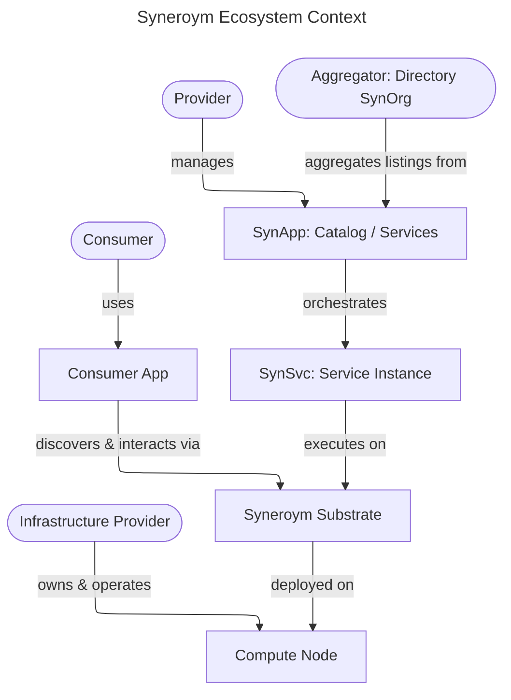
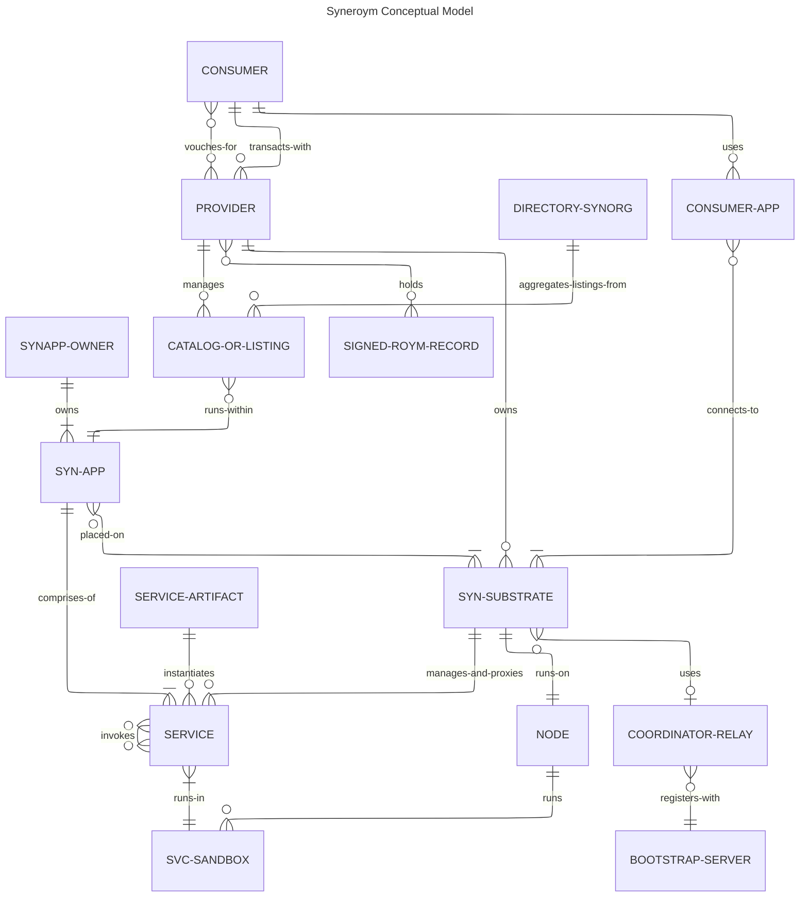

# Syneroym Ecosystem Requirements Specification

*Reader: developers and system architects.*

The [thesis](../THESIS.md) states the core foundation: a peer-to-peer system for group communication and trust. Independent mini-apps (SynApps) — such as chat, marketplace, social, and AI — connect and operate together in a single user experience. The system requires no central server, no blockchains, and no cryptocurrency.

The flagship experience and reference application is **Roym**. Roym mini-apps share one identity, one contact list, one set of groups, and one trust model. Its first vertical is the Professional Services Guild, built entirely on the Syneroym substrate.

**Status:** Draft product baseline

**Companion documents:** [Thesis](../THESIS.md) · [Vision](./VISION.md) · [Architecture](./system-architecture.md)

This document is the canonical statement of **who Syneroym serves, what outcomes it must enable, and which constraints a conforming implementation must honour**. It expands the vision of *autonomous SynApps cooperating over a common technology substrate* into testable product and ecosystem requirements.

### Requirement conventions

- **Must** denotes a release or conformance requirement.
- **Should** denotes an important default. Teams may defer a **Should** requirement only with a documented product or operational reason.
- **May** denotes an optional capability.
- Product releases are vertical, end-to-end increments. Capability backlog phases organize engineering sequences. Backlog phases do not form a usable product release by themselves.
- Open questions are tracked as architecture decision records (ADRs) or design questions.

This requirements specification contains the following sections:

- Philosophy & Design Constraints
- Product Outcomes, Guardrails, and Release Scope
- Requirements Overview
- Personas
- Glossary / Terminology
- Common Requirements
- Trust Model
- Conceptual Model
- Substrate Functionality
- Shared Utilities and Services
- SynApp Specs:
    - Reference Application: Business, Professional, and Retail Services (covering Home Services and Small Retail)
- Target Designs (Addendum)

---

## Philosophy & Design Constraints

Providers and consumers cluster locally. The system does not require global reach from a single central source. Reach grows through federation across autonomous clusters. Independent peer clusters cooperate over shared open protocols rather than central server federation. Direct peer-to-peer connections require no intermediary server. Relays and coordinators provide fallback connectivity when direct paths fail. The system retains the benefits of large platforms while avoiding their drawbacks ([VISION.md](./VISION.md#background)). It solves the open problem described in the [thesis](../THESIS.md): rich group activity at scale without a central server, where no participant device needs to trust any other device fully.

### Design Principles

The following principles guide design decisions throughout the system:

**Locality-first.** The system is optimized for scenarios where providers and consumers are geographically close. Federation between local clusters is important. Undifferentiated global reach is not an initial goal.

**Progressive decentralisation.** A provider starts with a single device and no federation. The system introduces complexity gradually as provider needs grow. The system is useful without requiring full federation.

**Data sovereignty.** Authoritative private provider data resides on infrastructure that the provider controls or explicitly chooses. Caches or replicas may store public listings and records that the provider shares deliberately, under disclosed retention rules. Syneroym-operated infrastructure receives no special right to store or monetize provider data.

**Transparency over opaqueness.** Ranking, discovery, and reputation algorithms are either open source or auditable by providers. No hidden algorithms decide outcomes for providers.

**Interoperability by convention.** SynApps cooperate through shared substrate primitives and open protocols. No SynApp requires a central coordinator to interoperate with another SynApp.

**Human-operable by default.** A provider must be able to start with minimal resources, understand current system state, recover from common failures, and leave without specialist assistance. Decentralization that only technical experts can operate does not satisfy the product goal.

**User agency over ecosystem purity.** Self-hosting is always available. Managed hosting, familiar payment rails, and lightweight consumer identities are valid adoption paths when their trade-offs are explicit and providers can exit freely.

**End-to-end slices before platform breadth.** Developers validate new substrate capabilities through a real provider-consumer workflow before adding adjacent general features.

**Additive evolution.** Core contracts evolve without breaking existing deployments. Advanced capabilities — external payment rails, ledger primitives, AI assistance, hardware attestation, and government identity assurance — are Envisioned capabilities tracked in the deferred backlog (`docs/planning/deferred-backlog.md`). Teams sequence each capability to compose with shipped contracts without redesigning existing contracts.

---

## Product Outcomes, Guardrails, and Release Scope

### Product outcomes

Syneroym succeeds when it provides a viable third option between a large centralized marketplace and an isolated website or messaging account. The product must deliver these outcomes:

1. **Provider autonomy without an operations burden.** A small provider or guild can publish offerings, transact, retain customer relationships, and change operators without rebuilding its digital business.
2. **A coherent consumer experience across independent operators.** A consumer can discover, assess, contact, agree with, and return to providers without understanding substrates, relays, or federation.
3. **Cooperation without surrendering control.** Independent providers can share discovery, referrals, infrastructure, and composed workflows while retaining their own identity, data, policies, and right to exit.
4. **Useful operation under real local constraints.** Core workflows tolerate intermittent connectivity, modest hardware, and varying technical skill.
5. **An ecosystem developers can safely extend.** Stable contracts, conformance tests, capability negotiation, and transparent governance allow third parties to build interoperable SynApps without privileged access.

---

## Requirements Overview

High-level requirement highlights:

- Providers either self-host on commodity hardware or choose a managed operator, without requiring a cloud account or deep technical expertise.
- Providers federate with other providers to share infrastructure, increase resilience, and expand discovery reach.
- Consumers discover and transact with providers through a unified experience, regardless of which substrate hosts the provider.
- Consumers can participate using a lightweight device-bound identity. Running a personal substrate is an optional upgrade path, not an entry requirement.
- The substrate provides shared contracts for identity, messaging, discovery, agreements, receipts, trust signals, and data portability. Payment execution remains pluggable and stays outside the system trust boundary.
- The system degrades gracefully during network partitions. Message queuing, offline-first storage, and asynchronous workflows keep transactions progressing.
- All provider participants retain the ability to exit. They can migrate data and services to a different infrastructure provider or run independently.
- Ecosystem protocols are open, versioned, testable, and governed through a published process that does not give special privilege to Syneroym-operated services.

| Requirement | Outcome | Primary Acceptance Evidence |
|---|---|---|
| **PRD-AUT** | Provider identity, data, policy, and operator choice remain under provider control. | Delegation-revocation and operator-migration journeys. |
| **PRD-CUX** | Consumers complete the reference journey without understanding hosting or federation. | Moderated task-success test and accessibility audit. |
| **PRD-FED** | Independent implementations interoperate without a mandatory central data plane or authority. | Two-node federation and bootstrap-outage tests. |
| **PRD-OFF** | Safe workflows remain intelligible and converge after disconnection; unsafe retries fail explicitly. | Fault-injection, idempotency, and state-model tests. |
| **PRD-POR** | Participants can export, verify, and restore in-scope identity-linked data through versioned open formats. | Clean-node export/import drill and cross-version fixtures. |
| **PRD-TRU** | Trust evidence is sourced, scoped, fresh, explainable, and correctable; uncertainty remains visible. | Trust-display, revocation, omission, and abuse cases. |
| **PRD-OPS** | A non-specialist can install or join, understand health, recover, update, and exit within the declared operating profile. | Timed onboarding and incident-recovery exercises. |
| **PRD-EXT** | Third-party SynApps can declare capabilities and pass public compatibility tests. | Package inspection and protocol conformance suite. |
| **PRD-SAF** | Consent, data lifecycle, moderation boundaries, and responsible parties are explicit throughout a transaction. | Policy-version, grant, report, dispute, and deletion scenarios. |

### [GTW-IDT] Client Gateway Identity Modes & Session Authentication

The Client Gateway MUST provide configurable identity operating modes and session authentication for browser and external clients that access substrate services.

- **Identity Operating Modes:** The client gateway MUST support three distinct operating modes (`crates/core/src/config/roles.rs:364`, `crates/client_gateway/src/gateway.rs:59`):
  - `Open`: Proxies client requests without authentication headers.
  - `Login`: Validates caller session tokens against an authentication service. The gateway optionally enforces an HTTP 401 connection gate (`connection_auth_gate`) when the caller presents no valid session (`crates/client_gateway/src/gateway.rs:115`).
  - `Fixed`: Injects a preconfigured person master DID (`fixed_identity_did`) and delegation certificate (`fixed_delegation`) onto all proxied requests (`crates/client_gateway/src/gateway.rs:117`).
- **Node Authentication Service:** The substrate MUST provide an authentication service. This service issues short-lived, cryptographically signed session tokens via nonce challenge-response (`/challenge`, `/login`) for local and delegated keys (`crates/auth/src/service.rs:37`).
- **Session Cookie Ingress:** The client gateway and router MUST extract sessions from `syneroym_session` HTTP cookies or `Authorization` headers. They MUST verify token validity and expiration, and MUST enforce revocation denylists (`crates/router/src/route_handler/http/auth.rs:55`, `crates/substrate/tests/gateway_session_e2e.rs:50`).

### [IDT-BAK] Encrypted Identity Backup & Clean-Node Restore Archive

The identity system MUST support exporting person master keys as versioned, authenticated encrypted backups. It MUST support packaging these backups for disaster recovery on a clean node.

- **Versioned Encrypted Master Key Backup:** Master identity keys MUST export as versioned `IdentityBackup` payloads (`IDENTITY_BACKUP_VERSION = 1`). The system encrypts the backup under a 32-byte z-base-32 recovery key using HKDF-SHA256 and AES-256-GCM (`crates/identity/src/backup.rs:22`).
- **Cryptographic Binding:** The public person DID MUST be authenticated as additional authenticated data (AAD) in the AEAD cipher. This binding prevents relabeling or tampering without causing decryption failure (`crates/identity/src/backup.rs:37`).
- **Sealed Disaster Recovery Archives:** Applications and operator tools (`roymctl roym backup`) MUST package application databases alongside the encrypted identity backup into sealed archives (`RoymArchive`). The system MUST verify complete data restoration on clean substrate nodes (`crates/roym_directory/src/app/backup.rs:25`, `apps/roymctl/src/commands/roym/backup.rs:37`, `crates/substrate/tests/roym_restore_e2e.rs:49`).

---

## Personas in the Syneroym Ecosystem

The following table lists key personas in the Syneroym ecosystem. A single person or organization may play multiple roles. The product must make the active role and its powers clear.

| Persona | Primary job to be done | Adoption constraint |
|---|---|---|
| **Individual Service Provider** | Publish an offering, receive qualified local work, serve repeat customers, and retain business history. | Limited time and technical skill; intermittent connectivity. (Note: mobile phone substrate operation is an Envisioned capability; today substrates execute on desktop and server platforms, while phone users participate via web browsers or client gateways). |
| **Self-hosting Provider / Node Owner** | Run the provider digital business without depending on an aggregator. | Needs safe defaults, understandable health, backups, and recovery. Must not require specialized site reliability engineering skills. |
| **Guild or Provider Aggregator** | Operate a directory-type SynOrg to aggregate provider listings, offer local discovery, and curate community trust signals. | Must earn trust without acquiring irrevocable control over provider identity, data, or hosting infrastructure. |
| **Infrastructure Provider** | Offer bounded compute, storage, and connectivity with auditable usage and responsibilities. | Needs isolation, quotas, abuse controls, and an explicit service agreement. |
| **Consumer** | Find a suitable provider, understand why they are trustworthy, agree on terms, communicate, pay, and keep records. | Will not install infrastructure or learn federation concepts before receiving value. |
| **SynApp Developer** | Build once against stable contracts, test locally, distribute safely, and interoperate with other apps. | Needs concise contracts, compatibility signals, examples, and conformance tooling. |
| **SynApp Owner / Provider Manager** | Configure a provider or guild presence, policies, catalog, availability, and staff access. | Needs delegated permissions and an audit trail without access to unrelated provider data. |
| **Facilitator** | Offer an optional bounded service such as delivery, payment gateway, credential issuance, backup, or dispute handling. | Must disclose terms and authority. Cannot become an implicit mandatory intermediary. |

---

## Glossary / Terminology

**Aggregator.** A directory-type SynOrg service that aggregates provider listings and credentials. It does not host or control provider infrastructure (such as a guild directory or trade cooperative).

**App Developer.** A person or organization that builds SynApps and publishes them for others to deploy. An App Developer does not necessarily host or operate any infrastructure.

**Bootstrap Server.** An envisioned centralized registry service that coordinates active services and relays.
> **Envisioned.** Not built yet. Centralized bootstrap servers (`*.syneroym.xyz`) are not built. Today substrate nodes configure static parent coordinator relay URLs (`parent_coordinator.iroh.url`) and publish endpoints to local Community Registries and Mainline DHT.

**Consumer / General User.** A user who discovers and purchases services or products, or interacts with other entities in the Syneroym ecosystem.

**Federation.** The process by which independent providers and infrastructure nodes interoperate. They share discovery, reputation, and messaging capabilities without a central authority.

**Home Relay / Coordinator Relay.** A coordinator relay endpoint configured at the substrate node level (`parent_coordinator.iroh.url`). It provides fallback connectivity when direct peer-to-peer connections fail. Hosted services inherit the relay connectivity of the substrate node rather than binding to individual relays.

**Infrastructure Provider.** A person or organization that provides hardware or virtual infrastructure for Service Providers to host applications on a lease.

**Operator.** The person or organization responsible for administering a Substrate or a managed SynApp Instance. An Operator may also be a Provider, Aggregator, or Infrastructure Provider, but each role carries distinct duties.

**Node.** A physical or virtual machine that runs one Substrate instance. A Node may run multiple SVC-Sandboxes.

**P2P.** Peer-to-peer. Denotes direct interaction between two entities without an intermediate broker service.

**Provider.** Short for *Service Provider*. A person or business providing services to others (such as a plumber, photographer, or consultant). A provider may self-host infrastructure or publish listings through an Aggregator directory.

**Relay.** A service or coordinator node that provides encrypted transport fallback for substrates and services that cannot accept inbound connections directly (such as nodes behind symmetric NAT or firewalls). The relay coordinates direct P2P connectivity when possible, and forwards encrypted traffic when direct connections fail.

**SynApp Instance / Catalog.** A named, provider-configured business context within a SynApp deployment (such as a plumber catalog and booking service).

**SynApp Owner / Operator.** The person or provider responsible for configuring and operating a SynApp instance. Responsibilities include the catalog, branding, access control, and operational policies.

**Substrate (SYN-SUBSTRATE).** The core runtime layer on a Node. The Substrate manages service deployment, lifecycle, discovery registration, messaging, and access control on behalf of the Node owner.

**Service Sandbox (SVC-SANDBOX).** The execution environment for a SYN-SVC. The sandbox may be a Wasm runtime instance (`crates/sandbox_wasm`), a Podman container (`crates/sandbox_podman`), or a native host binary dispatch (`crates/app_host_native`). The sandbox isolates services that share a Node.

**SynApp (SYN-APP, Syneroym Application).** A deployment manifest and control plane overlay that defines a cohesive graph of SYN-SVCs. It acts as a blueprint to deploy, update, and manage capabilities, quotas, and namespaces. A SynApp is not an execution boundary.

**SynApp Instance.** One deployment of a SynApp blueprint. Each instance has its own stable instance identifier, namespace, bindings, policy grants, configuration, and accounting context.

**SynApp Owner.** The provider who deploys a SynApp to deliver services to clients. Distinct from the App Developer who writes the code.

**Service Artifact.** A reusable, independently deployable unit of business logic. Packaged as a Wasm component (`wasm32-wasip2`) or native binary.

**Syneroym Service (SYN-SVC).** A running instance of a module executing within a SVC-SANDBOX on a Node. It is the foundational zero-trust execution primitive of the Syneroym Substrate. The Substrate manages and proxies the service.

**Verifiable Credential / Signed Record.** A cryptographically signed attestation issued by an entity (such as a provider, trade authority, or community directory) using canonical signed Roym record envelopes (`crates/signed_record/`). The consuming party decides which credential issuers they trust.
> **Envisioned.** Not built yet. Generic W3C VC 2.0 envelope schemas and SSI wallet integration. Today credentials use canonical JSON signed records with Ed25519 signatures.

**Vouching.** A trust mechanism where entities issue signed endorsements for other entities in their network, creating a verifiable web of trust.

---

## Ecosystem & Domain Model

*Reader: developers and system architects.*

This diagram shows the main business entities in the Syneroym ecosystem and their interactions.

```mermaid
---
title: Syneroym Ecosystem Context
config:
    layout: elk
---
flowchart TD
    Consumer([Consumer])
    Provider([Provider])
    Aggregator([Aggregator: Directory SynOrg])
    InfraProv([Infrastructure Provider])
    
    ConsumerApp[Consumer App]
    SynApp[SynApp: Catalog / Services]
    SynSvc[SynSvc: Service Instance]
    Substrate[Syneroym Substrate]
    Node[Compute Node]

    Consumer -->|uses| ConsumerApp
    ConsumerApp -->|discovers & interacts via| Substrate
    
    Provider -->|manages| SynApp
    Aggregator -->|aggregates listings from| SynApp
    
    SynSvc -->|executes on| Substrate
    SynApp -->|orchestrates| SynSvc
    Substrate -->|deployed on| Node
    InfraProv -->|owns & operates| Node
```

*(Note: For the technical architecture diagram of service components, services, and sandboxes, see the Architecture Design Document).*

---

## Common Requirements

*Reader: developers and system architects.*

These requirements apply to all business domains and SynApps.

### Infrastructure & Hosting

- Service Providers run business applications on supported commodity computers that they control. They can also run applications on infrastructure operated under an explicit agreement (`crates/identity/src/substrate.rs:48`). This works even when the host is behind NAT or a firewall (`crates/router/src/net_iroh.rs:94`).
- Infrastructure Providers make hardware (such as older personal computers or cloud virtual machines) available to Service Providers. Service Providers use this hardware to host applications or application components under explicit node agreements (`crates/identity/src/substrate.rs:48`).
  > **Envisioned.** Not built yet. Commercial leased hosting accounting and automated compute marketplaces. Today infrastructure nodes are claimed and authorized via ControllerAgreement and roymctl.
- Service Providers can view service status in plain language (`crates/coordinator_iroh/src/info_endpoint.rs:104`). They manage routine operations through a web user interface or command-line interface without shell access (`crates/roym_web/ui/`).
  > **Envisioned.** Not built yet. Automated push notifications when provider intervention is required. Today operators inspect status via /v1/info endpoints and the Roym Hub web UI.
- Infrastructure Providers monitor infrastructure health and resource use (`crates/observability/src/recorder.rs`). They control node access with Admin DIDs and UCAN delegation (`crates/control_plane/src/service/orchestration.rs:200`).
  > **Envisioned.** Not built yet. Incident-to-obligation impact mapping and automated SLA tracking during outages. Today health metrics are recorded in memory and node access is governed by UCAN delegation.
- App Developers package SynApps as WASM modules or OCI images (`crates/app_orchestration/src/models/manifest.rs:16`). Providers deploy these SynApps to matching container infrastructure, such as a WASM runtime or Podman/Docker (`crates/sandbox_wasm/src/engine.rs:84`, `crates/sandbox_podman/src/engine.rs:238`).
- Consumers access Provider services through options that the Provider makes available: an application user interface, a web browser, an API, or command-line tools (`crates/roym_web/ui/`, `crates/client_gateway/src/gateway.rs:73`, `apps/roymctl/src/commands/`).
- Service Providers export and restore all in-scope data, configuration, grants, and signed history using documented, versioned formats (`ARCHIVE_VERSION = 1`). Each export contains a manifest and a completeness report. Secrets transfer inside encrypted archives (`crates/roym_directory/src/app/backup.rs:25`).
  > **Envisioned.** Not built yet. Cross-version migration test fixtures for exported data archives. Today same-version export and clean-node restore are verified by automated tests.
- Every production profile supports encrypted backup and verified restore. The operator selects the backup destination. Peer backup pools are optional. The system must not require peer backup pools for portability (`apps/roymctl/src/commands/roym/backup.rs:25`).
- The system must never treat an upload success as proof of a successful backup. Automated integration test suites verify data restoration on clean nodes (`crates/substrate/tests/roym_restore_e2e.rs:49`).
  > **Envisioned.** Not built yet. Automated reporting of recovery-point and recovery-time expectations before choosing a hosting profile. Today clean-node backup restore is verified in test harnesses.
- Multi-device clients may work offline using local caches and outboxes (`crates/async_queue/src/lib.rs:1`, `crates/substrate/tests/roym_group_offline_e2e.rs`). Running independent writable copies of the same authoritative service state is a later capability. The baseline requirement does not include writable replicas. Single-writer serialization per service resolves this state requirement (`crates/data_db/src/sqlite/provider.rs:281`).
- Sharding and multi-node service placement are optional scaling capabilities (`crates/app_supervisor/src/lib.rs`). They must not complicate single-node deployment or the portability contract (`crates/substrate/src/main.rs:178`).

### Connectivity & Offline Behaviour

- The substrate supports direct peer-to-peer connections without intermediary servers whenever a direct network path exists (`crates/router/src/net_iroh.rs:94`). When NAT or firewall rules block direct connectivity, the substrate falls back to encrypted connections through coordinator relays (`crates/coordinator_iroh/src/coordinator.rs:180`, `crates/router/src/route_handler/io.rs:471`).
- **Offline outbox and retry queue:** The system durably stores operations that are explicitly marked safe for deferred delivery (`crates/async_queue/src/queue.rs:50`). The system presents `pending`, `delivered`, or `failed` status to the user (`crates/conversation/src/store.rs:127`). The system retries queued operations when network connectivity returns. The user interface must not show `pending` as a final success.
- Automatic retries require an idempotency contract (ADR-0023 §4). The system must not replay a non-idempotent operation simply because a connection failed.
- Each transactional entity defines valid state transitions, authority rules, expiration times, idempotency keys, and conflict handling (`crates/roym_core/src/transaction.rs:86`). After reconnecting, all parties either reach the same valid final state or see a conflict that requires a named party to decide. The system must not use silent last-write-wins rules for agreements, payments, fulfilment, or access grants. A single writer per service resolves updates by replaying queued requests through entity arbitration rules. These entities do not require a multi-master merge (`crates/data_db/src/sqlite/provider.rs:281`).
- Users can cancel a pending message or booking operation when cancellation is safe (`crates/conversation/src/host_impl.rs:333`, `crates/roym_transaction/src/app/booking_ops.rs:358`). The user interface shows when cancellation is no longer guaranteed because delivery may have already occurred.
  > **Envisioned.** Not built yet. Generic user interface cancellation of arbitrary queued substrate outbox operations. Today message and booking cancellations are supported specifically.

### [WEB-PRX] Peer-Proxy Browser Fallback Tunneling

When browser clients lack native QUIC or WebRTC direct peer connectivity, the system MUST provide a service worker fallback proxy and a WebSocket blind tunnel to communicate with substrate nodes.

- **Bootstrap Assets & Service Worker:** WebRTC and gateway coordinators serve browser bootstrap assets (`peer-proxy.js`, `/sw.js`). These assets intercept outbound application network requests and proxy them over client WebSockets (`crates/coordinator_webrtc/src/bootstrap.rs:113`).
- **Opaque WebSocket Blind Tunneling:** Coordinators expose an opaque WebSocket blind tunnel endpoint (`/__syneroym/tunnel`). This endpoint reads the initial route preamble, resolves destination Iroh node endpoints through community registry lookups, and forwards raw binary frames in both directions between the browser Service Worker and target Iroh substrate nodes without inspecting decrypted payloads (`crates/coordinator_webrtc/src/bootstrap/tunnel.rs:11`).
- **Preamble and Endpoint Resolution:** The blind tunnel forwards the route preamble to the destination substrate node. This preserves complete stream encapsulation and end-to-end transport encryption between the browser client and destination service (`crates/coordinator_webrtc/src/bootstrap/tunnel.rs:37`).

### Messaging & Data Sharing

- Providers, Consumers, and Services exchange messages only within an explicit conversation or capability context. All message exchanges follow owner-approved access policy (`crates/conversation/src/lib.rs:56`, `crates/ucan/src/token.rs`).
- The system supports one-to-one text, attachments, private group chat, and structured service cards. Supported cards include requests, quotes, agreements, status updates, receipts, and grants (`crates/roym_conversation`, `crates/conversation/src/dag.rs`).
  > **Envisioned.** Not built yet. Audio/video calls, social feeds, and collaborative editing. Today 1:1 messaging, structured cards, and group chat are supported.
- A structured message has a stable type, schema version, sender, intended recipients, creation timestamp, idempotency identifier when applicable, and verification status (`crates/conversation/src/store.rs:116`). Clients render unknown message types safely without executing sender code.
- The product documentation states which message content and metadata are end-to-end encrypted. End-to-end encryption uses `vodozemac` (X3DH and Double Ratchet) and owner-distributed epoch keys (`crates/conversation/src/crypto.rs:233`, `crates/conversation/src/dag.rs`). The documentation also identifies which operators can observe remaining metadata and explains why. The system must not describe transport encryption alone to users as end-to-end message privacy.
- Unsolicited contact is rate-limited and controlled by users. Recipients can block senders, report abuse, and leave a conversation without losing their transaction records (`crates/roym_profile/src/app/safety_ops.rs:50`, `crates/roym_core/src/safety.rs:20`).
  > **Envisioned.** Not built yet. Sender-side visibility of inbound rate-limit refusal reasons. Today recipient nodes enforce local contact blocks and rate limits silently.

### Non-Functional Requirements

The reference client uses these measurable baselines unless a vertical requirement defines a stricter baseline. Test profiles and measurement methods are defined in the Architecture and test plans.

- **Security:** The system encrypts all traffic between nodes and between clients and nodes in transit (`crates/router/src/net_iroh.rs:94`). Sensitive production data and backups are encrypted at rest by default using SQLCipher KEK/DEK envelope encryption (`crates/data_keystore/src/key_store.rs:29`). The system never shares default credentials across installations. The system authenticates, authorizes, and audits critical actions.
- **Identity security:** Routine key rotation and device loss do not require a new public identity. The system shows revocation freshness, recovery authority, and the consequences of losing all recovery factors to the owner (`crates/identity/src/delegation.rs:62`, `crates/core/src/dht_registry/master_anchor.rs:24`). Government identity is optional. Government identity is never the universal root of participation.
- **Availability:** Local and cached reads remain available during temporary bootstrap or relay loss (`crates/data_db/src/sqlite/provider.rs:281`). Substrates configure static parent coordinator relay URLs (`parent_coordinator.iroh.url`) and publish endpoints to the community registry (`crates/community_registry`).
  > **Envisioned.** Not built yet. A 24-hour bootstrap outage test. Today substrates configure static parent coordinator relay URLs and publish to community registries.
- **Durability:** Test suites for disconnect/reconnect and process restart must lose zero acknowledged in-scope transaction messages (`crates/substrate/tests/saga_e2e.rs`, `crates/substrate/tests/roym_group_offline_e2e.rs`). Backup restore is verified on a clean node before initial release (`crates/substrate/tests/roym_restore_e2e.rs:49`).
- **Performance:** On documented standard-node profiles, local user interface actions must reach a p95 latency under 1 second. Remote browse, search, message acknowledgement, and request submission must reach a p95 latency under 3 seconds, excluding delays from an offline peer or external payment provider (`crates/observability/src/recorder.rs:136`).
  > **Envisioned.** Not built yet. Mobile-network performance profile testing and automated mobile latency benchmarks. Today performance metrics are recorded in memory on desktop and server platforms.
- **Operability:** Health output identifies the affected user capability, the likely cause, and the safe next action (`crates/coordinator_iroh/src/info_endpoint.rs:104`). Database schema migrations execute inside transactions and roll back automatically on failure (`crates/data_db/src/sqlite/provider.rs:51`).
  > **Envisioned.** Not built yet. Automated binary update rollback across failed upgrades. Today schema migrations roll back within SQL transactions on failure.
- **Interoperability:** WIT interfaces define versioned semver contracts (`crates/wit_interfaces/wit/`). The network handshake rejects unsupported protocol versions. Unknown optional capabilities fail gracefully. The system rejects incompatible mandatory capabilities before a workflow begins.
  > **Envisioned.** Not built yet. Published public protocol conformance test suites. Today interface compatibility is verified through Cargo test suites and WIT interface definitions.
- **Privacy:** The system minimises observable metadata and documents every operator-visible data category (`crates/fdae/src/policy.rs`). The system defines purpose, retention, export, and deletion rules for personal data. Telemetry is stored locally in memory by default (`crates/observability/src/recorder.rs`).
- **Portability:** Export and import formats and identity-linked history are documented, versioned, and verified for integrity (`crates/roym_directory/src/app/backup.rs`, `apps/roymctl/src/commands/roym/backup.rs`).
  > **Envisioned.** Not built yet. Cross-version migration test fixtures for data archives. Today same-version export and clean-node restore are verified by automated tests.

### [TST-PRT] Dynamic Port Allocation Contract in Test Harnesses

Integration and end-to-end test harnesses MUST dynamically allocate network ports instead of using static or hardcoded port numbers. This rule guarantees collision-free parallel test execution across test binaries.

- **Dynamic Port Reservation:** Test suites probe and allocate verified-free TCP and UDP ports below the OS ephemeral range (`18_000`–`32_768`) with `alloc_ports::<N>()` before starting substrate nodes or gateway listeners (`crates/substrate/tests/common/mod.rs:109`).
- **Complete Listener Port Coverage:** For every spawned substrate node, test harnesses MUST allocate distinct ports for all bound network listeners. This includes the Iroh HTTP relay, community registry, client gateway, and QUIC transport endpoint (`crates/substrate/tests/common/node.rs:55`).
- **Ephemeral Port Enforcement:** Integration test suites MUST NOT use port literals in the OS ephemeral range (`32_768`–`60_999`). A static test syntax check verifies this rule (`crates/substrate/tests/no_ephemeral_port_literals.rs:1`).

---

## User Experience, Agency, and Accountability

*Reader: developers and system architects.*

### Onboarding and recovery

- A provider can choose a managed-guild path or a self-hosted path. Providers initialize self-hosted substrates with `roymctl substrate init` or connect to managed controllers through a `ControllerAgreement` (`apps/roymctl/src/commands/substrate.rs:65`).
  > **Envisioned.** Not built yet. A guided onboarding wizard comparing control, cost, availability, privacy, and support trade-offs before committing. Today substrate initialization and management run via roymctl CLI commands.
- Joining a guild must not transfer ownership of the provider's root identity, signed history, or export rights to the guild. Joining a guild does not delegate administration through a `DelegationCertificate`. Providers use signed membership credentials instead (`crates/roym_core/src/membership.rs`). Root key backup protects master keys (`crates/identity/src/backup.rs`). Any delegated administration is scoped (`crates/identity/src/delegation.rs:25`), visible, revocable through Master Anchor deny lists, and audit-recorded through FDAE `DecisionTrace`.
- Consumer onboarding creates or imports a lightweight device-bound Ed25519 identity on the consumer's device. This identity maps to short-lived session tokens (`crates/client_gateway/src/gateway.rs`). Users export encrypted identity backups (`crates/identity/src/backup.rs`) to protect master keys. The recovery model does not claim self-sovereignty if an operator can unilaterally recover or impersonate the consumer. Root keys are self-sovereign Ed25519 master DIDs.
  > **Envisioned.** Not built yet. Automated post-transaction backup prompts in the UI and optional government identity assurance credentials. Today consumers manage device-bound session keys and export encrypted backups on demand.
- Destructive actions state their scope and recovery consequences. Common recovery flows are available through an expert CLI (`roymctl roym backup restore`) with warnings on destructive actions.
  > **Envisioned.** Not built yet. A guided graphical UI recovery wizard for identity and database restore. Today disaster recovery flows execute through the roymctl CLI.

### Data rights and lifecycle

- Every durable record has a documented owner or controller, permitted writers, retention policy, export representation, and deletion or tombstone behaviour. FDAE policies enforce permissions (`crates/fdae/src/policy.rs`). Directory publications enforce retention pruning (`crates/roym_directory/src/app/publication_ops.rs`). Deleted messages leave tombstones in the conversation DAG (`crates/conversation/src/host_impl.rs:333`).
- A single party cannot rewrite shared records such as agreements, receipts, and revocations. These records are tamper-proof canonical signed Roym records (`crates/signed_record/`). A participant may remove their local copy or personal display when law permits. The protocol preserves the other party's signed record and stores later corrections separately.
  > **Envisioned.** Not built yet. Public consumer reviews, reputation ratings, and generic W3C Verifiable Credentials 2.0 envelopes. Today shared records use canonical signed Roym records and bilateral agreement receipts.
- Access grants have limited purpose and scope. Grants expire by default for sensitive data. Grants can be revoked through UCAN tokens (`crates/ucan/src/token.rs`), delegation certificates (`crates/identity/src/delegation.rs`), and Master Anchor deny lists (`crates/core/src/dht_registry/master_anchor.rs`).
  > **Envisioned.** Not built yet. A graphical UI dashboard displaying active access grants and explaining what revocation can and cannot retract from already-received data. Today capability grants and revocations are enforced cryptographically via UCAN tokens and Master Anchor deny lists.
- Export and account deletion are separate actions. Deletion identifies data held by the provider, operator, backup destination, peers, and legally required records. The product must not promise deletion that it cannot enforce. Users export data through sealed backup archives (`roymctl roym backup create`). Message deletion removes readable bodies locally and leaves DAG tombstones (`crates/roym_profile/src/app/profile_ops.rs:25`).
  > **Envisioned.** Not built yet. Comprehensive multi-party account deletion coordinating erasure across providers, hosting operators, backup destinations, and peer nodes. Today users export data via backup archives and delete local message content via tombstones.

### Safety, support, and disputes

- Before production use, the system must have a reviewed threat model and privacy data inventory. These documents cover malicious packages, peers, clients, and operators. They also cover compromised keys, metadata leakage, denial of service, backup exposure, and recovery abuse. Documentation states residual risks and unsupported deployment profiles.
  > **Envisioned.** Not built yet. Formal reviewed threat model documents and privacy data inventories. Today technical protections include Wasmtime fuel limits, mlock memory protection, TLS 1.3 QUIC transports, and Double Ratchet messaging encryption.
- Syneroym supplies evidence and workflow primitives. The system does not imply that the Syneroym project has vetted every listed provider, guild, credential issuer, or facilitator.
- Provider terms, price, cancellation rules, data use, payment method, and named dispute paths are recorded before agreement in `AgreedTerms` (`crates/roym_core/src/transaction.rs:116`). Any material change requires renewed consent and produces a new version.
- Users can report impersonation, fraud, harassment, unsafe service, and illegal content to the relevant operator or community. Reports include a status, an appeal or correction path when appropriate, and safeguards against publishing unverified allegations as fact. Submitting nodes store reports locally and track report status (`crates/roym_profile/src/app/moderation.rs:188`).
  > **Envisioned.** Not built yet. Community-level appeal, dispute arbitration, and public correction workflows. Today moderation reports are stored locally with status tracked on the submitting node.
- Emergency response, guaranteed refunds, insurance, professional licensing, and legal arbitration are not platform services. When a guild or facilitator offers these services, it must state the jurisdiction, limits, and responsible legal entity in `AgreedTerms`.
  > **Envisioned.** Not built yet. Decentralized dispute resolution, independent arbiter panels, and smart-contract escrow custody. Today agreements capture a named dispute path as a text policy term within AgreedTerms.

---

## Ecosystem Contracts and Governance

*Reader: developers and system architects.*

- The minimum federation contract includes versioned identity resolution, endpoint discovery, provider and catalog publication, service requests, agreements, receipts, trust signals, and backup archive export schemas (`crates/roym_directory/src/app/backup.rs`).
  > **Envisioned.** Not built yet. Dynamic protocol capability negotiation and cross-vendor federation testing suites. Today protocols bind fixed ALPN `syneroym/0.1` and typed WIT interface packages.
- Normative contracts use stable identifiers in versioned WIT interface packages (`crates/wit_interfaces/wit/`) and dual-build parity tests.
  > **Envisioned.** Not built yet. Standalone third-party test vectors and an executable public conformance test suite. Today compatibility is verified via cargo test suites and dual-build parity tests.
- Developers document architectural decisions and protocol changes in Architecture Decision Records (ADRs). ADRs explain the rationale, security impacts, and migration plans.
  > **Envisioned.** Not built yet. A formal external public proposal process with scheduled community review periods. Today architectural changes are proposed and tracked through internal ADRs.
- No public Syneroym-operated bootstrap, relay, registry, app store, model service, or certificate authority is the only permitted implementation of its role. Substrates configure custom parent coordinator relay URLs (`parent_coordinator.iroh.url`), publish to self-hosted community registries, use self-sovereign Ed25519 keys, and support full local data export.
- Compatibility claims apply to specific capabilities. Versioned WIT packages and manifest interface requirements enforce these claims.
  > **Envisioned.** Not built yet. A formal third-party capability certification and labeling program. Today compatibility is verified against versioned WIT package definitions.
- SynApp manifests declare the publisher, interfaces, dependencies, resource limits, FDAE policies, and lifecycle hooks. Deployment requires owner UCAN authorization.
  > **Envisioned.** Not built yet. Standalone publisher-signed package distribution archives and interactive UI prompts for capability expansion during updates. Today SynApp components deploy via manifests and roymctl.
- SynOrgs operate as single-owner root entities. They manage membership credentials, directory listings, and revocation lists (`crates/roym_directory/src/app.rs`).
  > **Envisioned.** Not built yet. Multi-signature voting, token governance, and weighted community consensus. Today SynOrgs operate under single-owner cryptographic controller authority.
- The business model may charge fees for hosting, support, certification, or optional services. However, protocol participation and data export must not require a mandatory Syneroym fee. Substrate runtime execution, P2P networking, and SQLite storage run locally with zero licensing checks and zero network fees.
- The project provides a private vulnerability reporting channel through GitHub Security Advisories (`SECURITY.md`). Cryptographic key revocations publish to Master Anchor deny lists.
  > **Envisioned.** Not built yet. Published supported-version policies, standardized security advisory formats, package-level revocations, and automated emergency update procedures. Today vulnerabilities are reported via GitHub Security Advisories and keys are revoked via Master Anchor deny lists.

### [DIR-SYN] SynOrg Directory Credential Management & Pinned Sources

A SynOrg directory service MUST manage signed membership credentials, suspensions, and revocations for community members. This provides authoritative standing verification over public wire protocols.

- **Credential and Revocation Lifecycle:** The SynOrg host issues canonical signed `MembershipCredential` records. These records carry subject DIDs, authorized categories, and expiration timestamps (`credential.issue`). The host publishes signed revocation records (`revocation.issue`) when membership terminates or suspends. Clients MUST be able to query stored credentials and revocations through wire RPC methods (`directory.standing`, `directory.info`).
- **Publication Admission Gating:** A directory MUST accept service publications (`directory.publish`) only from verified members. These members must hold an unexpired, unrevoked membership credential issued by the directory's owning SynOrg.
- **Pinned Directory Sources:** Consumer and provider nodes MUST maintain an explicit list of trusted directory sources (`SourceRow`). Nodes pin the directory DID and the issuing SynOrg DID on first contact (`issuer_did`) to prevent directory spoofing. Client discovery queries MUST query only configured sources. Clients MUST verify returned listing credentials against pinned directory issuers.

---

## Trust Model

*Reader: developers and system architects.*

Centralized platforms build consumer trust from brand recognition, legal accountability, and aggregated reviews. A peer-to-peer system needs explicit mechanisms to build trust without a central authority. In this system, no device needs to trust another device completely.

### The Trust Problem

When a consumer discovers a provider through Syneroym, they have no existing relationship with the provider or the infrastructure operator. The system gives the consumer clear signals to decide whether to transact. The system also gives providers signals that consumers are not fraudulent.

Minimum requirements at transaction time:

- Before accepting an agreement, the consumer can inspect the provider's stable identity, the provenance and freshness of trust signals, material terms in `AgreedTerms`, the payment recipient, and dispute or cancellation paths. The system displays missing trust signals as unknown. It never converts a missing signal into a positive default.
- The product avoids collecting stronger identity details than risk warrants. Consumers use lightweight device-bound Ed25519 session keys. Providers configure contact rate limits and block lists (`crates/roym_core/src/safety.rs`).
  > **Envisioned.** Not built yet. Dynamic provider configuration of consumer-side gates (mandatory deposits, required prior receipts, verified external contacts, or named facilitators). Today consumers use lightweight session identities with recipient-configurable rate limits and block lists.
- Trust displays present separate facts (credentials, receipts from completed interactions, recency) rather than hiding facts behind a single score. Directory search ranking uses open, explainable deterministic recency and round-robin merging (`crates/roym_directory/src/app/client_merge.rs`).
  > **Envisioned.** Not built yet. Joint DHT reputation records, exponential moving average (EMA) score formulas, and consumer vouch graphs are unbuilt. Today trust relies on independent credentials and bilateral receipts without numerical reputation scores.

### Trust Layers

Trust in the Syneroym ecosystem operates across multiple layers:

**Layer 1: Cryptographic continuity.** A stable root identity (a self-sovereign Ed25519 master DID) delegates authority to rotatable device and routing keys with signed `DelegationCertificate` credentials. The system publishes key revocations to Master Anchor deny lists on the DHT and community registry. Cryptographic continuity proves control of keys. It does not prove a person's legal name, quality, or honesty.

> **Envisioned.** Not built yet. Hardware protection (TPM or secure enclave), social recovery, and government identity credentials are unbuilt optional assurance mechanisms. Today root keys are self-sovereign Ed25519 keypairs delegating via software delegation certificates.

**Layer 2: Referral and vouching.** Guild entities issue signed, scoped, and expiring statements about members (`MembershipCredential`). The display preserves who issued the statement and in what context. The system does not treat an issued credential as objective proof of quality.

> **Envisioned.** Not built yet. Consumer referral vouches, recommendation statements, web-of-trust vouching graphs, and vouch decay formulas are unbuilt. Today trust relies on signed SynOrg membership credentials and revocations.

**Layer 3: Verifiable credentials.** Providers attach credentials (such as guild membership or trade certification) packaged as canonical signed Roym records (`crates/signed_record/`). Verification checks Ed25519 signatures, the issuer DID, scope, expiration timestamps, and issuer revocation lists (`crates/roym_directory/src/app/credential_ops.rs`). The consuming party or community decides which issuers to trust. The user interface does not reduce a valid signature to a trusted claim.

> **Envisioned.** Not built yet. Generic W3C Verifiable Credentials 2.0 envelopes and external credential library integrations are unbuilt. Today all credentials use canonical signed Roym records.

**Layer 4: Interaction receipts and feedback.** Completed commercial interactions create bilateral agreement receipts (`AgreementReceiptPayload`) and fulfilment receipts (`FulfilmentRecord`). Each party signs and stores these receipts independently. A receipt proves that both parties agreed to a workflow event under identical terms. It does not prove that every real-world claim is true. Export archives preserve record provenance with signed manifests.

> **Envisioned.** Not built yet. Separately signed consumer feedback, public reviews, and selective disclosure (redactable zero-knowledge or field-level disclosure) are unbuilt. Today interactions produce bilateral independent agreement and fulfilment receipts.

**Layer 5: Community moderation.** Guilds and communities maintain signed membership revocation and suspension records (`crates/roym_core/src/membership.rs`). Abuse reports submitted by users stay on recipient nodes (`crates/roym_profile/src/app/moderation.rs`). The system does not broadcast reports as global truth. Consumers can see the source of moderation policies.

> **Envisioned.** Not built yet. Published community warning lists and formal automated correction or appeal workflows are unbuilt. Today guilds publish signed revocation lists and nodes store local abuse reports.

Trust mechanisms enforce anti-replay protections with monotonic sequence numbers and timestamps (`crates/signed_record/`). They enforce key revocation through Master Anchor deny lists (`crates/core/src/dht_registry/master_anchor.rs`). They also tie receipts directly to signed agreements. Tying receipts to signed interactions reduces casual spam, but it does not stop Sybil attacks or collusion.

> **Envisioned.** Not built yet. Comprehensive Sybil attack mitigation, collusion defenses, and formal evaluation frameworks are unbuilt. Today anti-replay timestamps and Master Anchor key revocations protect against basic replay and compromised keys.

### Legal Liability Boundary

The system does not provide legal liability protection like centralized platforms. That protection comes from corporate legal status and terms of service. Syneroym infrastructure operators hold their own legal responsibility for services that they host under local laws.

Requirements:

- The substrate allows a Provider or Aggregator (directory-type SynOrg) to show terms of service, cancellation policies, and refund rules to consumers through `AgreedTerms` structures.
- The substrate must not state or imply to consumers that the Syneroym project vetted a federated node.
- A separate document will outline recommended legal structures for Directory SynOrgs and Aggregators operating at scale. [Legal guidance: Out of scope for this spec]

---

## Conceptual Model

*Reader: developers and system architects.*

The ER diagram below shows the formal entity model for the Syneroym ecosystem with relationship cardinalities. See the [Glossary](#glossary--terminology) for entity definitions. See the [Ecosystem & Domain Model](#ecosystem--domain-model) diagram for a high-level overview.

```mermaid
---
title: Syneroym Conceptual Model
config:
    layout: elk
---
erDiagram
    direction TB

    %% --- Module & Service structure ---
    SERVICE-ARTIFACT ||--o{ SERVICE : instantiates
    SERVICE }o--o{ SERVICE : invokes
    SYNAPP ||--|{ SERVICE : comprises-of
    SERVICE }|--|| SVC-SB : runs-in
    NODE ||--o{ SVC-SB : runs
    SUBSTRATE ||--|| NODE : runs-on
    SUBSTRATE ||--o{ SERVICE : manages-and-proxies

    %% --- Ownership & Placement ---
    PROVIDER ||--o{ SUBSTRATE : owns
    SYNAPP-OWNER ||--|{ SYNAPP : owns
    SYNAPP }o--|{ SUBSTRATE : placed-on

    %% --- Connectivity ---
    SUBSTRATE }o--o| RELAY : uses
    RELAY }o--|| BOOTSTRAP : registers-with

    %% --- Application & Commercial entities ---
    PROVIDER ||--o{ CATALOG : manages
    CATALOG }o--|| SYNAPP : runs-within
    AGGREGATOR ||--o{ CATALOG : aggregates-listings-from

    %% --- Consumer side ---
    CONSUMER ||--o{ CONSUMER-APP : uses
    CONSUMER-APP }o--|{ SUBSTRATE : connects-to
    CONSUMER ||--o{ PROVIDER : transacts-with

    %% --- Trust & Credentials ---
    PROVIDER }o--o{ VERIFIABLE-CRED : holds
    CONSUMER }o--o{ PROVIDER : vouches-for

    SERVICE-ARTIFACT[SERVICE-ARTIFACT]{}
    SERVICE[SERVICE]{}
    SYNAPP[SYN-APP]{}
    SYNAPP-OWNER[SYNAPP-OWNER]{}
    SUBSTRATE[SYN-SUBSTRATE]{}
    SVC-SB[SVC-SANDBOX]{}
    NODE[NODE]{}
    RELAY[COORDINATOR-RELAY]{}
    BOOTSTRAP[BOOTSTRAP-SERVER]{}
    PROVIDER[PROVIDER]{}
    AGGREGATOR[DIRECTORY-SYNORG]{}
    CATALOG[CATALOG-OR-LISTING]{}
    CONSUMER[CONSUMER]{}
    CONSUMER-APP[CONSUMER-APP]{}
    VERIFIABLE-CRED[SIGNED-ROYM-RECORD]{}
```

Operators place a SynApp on one or more substrates. Each service inside a SynApp defines its own execution artifact (`ServiceDefinition::source`, such as a WebAssembly component or container image). The service runs inside a sandbox or native host runner. Stale entity concepts (`SYN-MOD`, `Space`, and `Space Manager`) do not exist in code. Services manage catalogs and listings directly. Providers transact with consumers through structured quote and booking workflows.

An Aggregator is a directory-type SynOrg service (`crates/roym_directory/src/app.rs`) that aggregates provider listings and credentials. Aggregators do not manage infrastructure or host services for providers. Node operators claim substrate ownership through a mutually signed `ControllerAgreement`.

Substrates connect to configured coordinator relays (`parent_coordinator.iroh.url`). They publish signed endpoint records to the Community Registry and the Mainline DHT. Trust evidence uses canonical signed Roym records (such as guild membership credentials and bilateral agreement receipts). Trust evidence does not use centralized reputation scores or generic W3C VC 2.0 envelopes.

> **Envisioned.** Not built yet. Centralized bootstrap servers, dynamic relay DNS assignment, and consumer-to-provider vouching graphs. Today nodes configure static coordinator relays and trust relies on signed SynOrg membership credentials.

---

## Substrate Functionality

*Reader: developers and system architects.*

This section describes core Syneroym substrate functionality, key protocols, and main workflows.

### Substrate Setup

- The node owner installs and initializes the substrate on a node (`roymctl substrate init`).
- The substrate creates a protected node key on first run. Administrative ownership requires an offline claim step that produces a mutually signed `ControllerAgreement`. Routine administration uses revocable delegated credentials (`DelegationCertificate`, UCAN tokens) instead of exposing a root key.
  > **Envisioned.** Not built yet. Tested recovery method wizard before production use. Today initial node keys are initialized at boot and claimed offline.
- The substrate connects to a relay:
  - The substrate configures a static coordinator Iroh relay URL (`parent_coordinator.iroh.url`).
    > **Envisioned.** Not built yet. Dynamic home relay assignment via bootstrap service.
  - The substrate publishes signed endpoint information (`SignedEndpointInfo`) to the Community Registry and Mainline DHT via pkarr. This record contains its public key and relay routing details. The control plane and service deployment use this record.
  - The substrate starts a secure communication server. The server listens through the assigned coordinator relay and direct peer-to-peer interfaces (Iroh QUIC).
- The substrate identifies its capabilities (sandbox types and quota configurability). The node owner configures capability limits (CPU, memory, instruction fuel) for hosted services.
  > **Envisioned.** Not built yet. GPU allocation and dynamic disk quota enforcement.
- Access control setup:
  - The substrate grants access to the controller master DID through `ControllerAgreement`.
  - SynApp owner master DIDs sign UCAN capability tokens. These tokens grant deployment, removal, and status observation access (`orchestrator/{deploy,undeploy,status}`) with assigned quotas.
  > **Envisioned.** Not built yet. Automated multi-substrate peering registration protocol.

### [OPS-CLM] Substrate Node Claiming & Ownership Binding

Substrate nodes boot in an unowned state. They fail closed on privileged operations until an operator claims the node with `roymctl substrate claim` to establish cryptographic controller authority.

- **Initial Unowned State:** A newly initialized substrate generates a local Ed25519 node keypair (`did:key:...`). Until claimed, the node rejects remote administrative operations (`substrate/admin`) over the wire. This prevents unauthorized adoption.
- **Mutual Controller Agreement:** An operator claims the node by running `roymctl substrate claim`. This command creates a `ControllerAgreement` record. The node private key and the controller master key both sign this record. The record binds the node DID to the controller DID.
- **Fail-Closed Authorization:** The substrate router verifies the controller DID on all privileged interfaces (including deployment, service orchestration, and security administration). The router rejects requests that lack a matching controller signature or a valid delegated UCAN capability.

### Substrate Managing Services

- The substrate provides a secure end-to-end communication channel between clients and managed services through the Universal Proxy and Client Gateway.
- The substrate supports WebAssembly (Wasmtime) and Podman sandbox environments at minimum.
- The substrate attempts direct client-service communication when possible. It falls back to an external coordinator relay when network conditions block direct connections.
- On mobile platforms:
  > **Envisioned.** Not built yet. Mobile platform background execution, OS throttling handlers, and push notification dispatch. Today offline operations rely on substrate SQLite durable outbox queuing and idempotent replay.

### Core Substrate Services

**Messaging.** The substrate supplies secure, typed, and durable delivery primitives through an embedded MQTT broker (`crates/mqtt_broker`). It also supplies Double Ratchet end-to-end encrypted conversation primitives (`crates/conversation/`, ADR-0013). Chat, groups, and conversation products are SynApps built on these primitives.
> **Envisioned.** Not built yet. Social feeds and collaborative editing SynApps.

**Discovery.** The substrate provides capability and endpoint discovery through the Community Registry and pkarr Mainline DHT. Guild directories, referrals, and ranking are replaceable SynApps or services (`crates/roym_directory`). They implement shared publication and query contracts with client-side merging. The system does not require a single global index.

**Identity.** The substrate manages protected key storage (SQLCipher and `mlock` KEK protection), key rotation, key revocation, and delegation. It separates stable master DIDs from ephemeral routing keys (ADR-0020). Master Anchor DHT records publish cryptographic revocation deny lists. Credentials use canonical signed Roym records.

**Access Control.** The substrate enforces deny-by-default access on inter-service and client-service communication. It uses Fine-grained Data Access Engine (FDAE) compiled ReBAC policies (`crates/fdae/`, ADR-0017) and UCAN capability tokens. Documentation accurately describes the technical powers of an infrastructure operator. Access policy enforcement alone does not protect against a fully compromised host. Sensitive deployments may require owner-held encryption keys.
> **Envisioned.** Not built yet. Hardware attestation (TPM/SEV). Today substrate integrity relies on software signature validation.

---

## Supporting Ecosystem Entities

*Reader: developers and system architects.*

### Relay

- Acts as a coordination server for direct peer connections using UDP hole punching.
- Acts as an encrypted TCP data relay through embedded `iroh-relay` when direct connections fail (due to blocked UDP, symmetric NAT, or CGNAT).
- Substrates connect to a statically configured coordinator relay URL (`parent_coordinator.iroh.url`). They publish signed endpoint records to the Community Registry or Mainline DHT via pkarr. Hosted services inherit this relay connectivity from their substrate.
  > **Envisioned.** Not built yet. A WebRTC TURN relay server, dynamic bootstrap relay registration, and `<relaynodeid>.syneroym.net` DNS subdomains. Today relays do not provide TURN; browser clients connect through the Client Gateway HTTP proxy or WebRTC data channels with HTTP/WebSocket signaling.

### Bootstrap

- Accepts NodeId registration offers with associated relay details.
- Maintains a list of officially operated relays with capability metadata (such as TCP relay and TURN).
- Accepts community relay registration offers and verifies capability claims with offline or real-time checks.
- Registers DNS entries for community relays under its domain (such as `*.syneroym.xyz`).
- Returns a weighted random set of relays from the registry based on requested capabilities and relay capacity.
- Audits registered relays periodically and expires stale entries.
- Checks internal cache or DHT fallback for node ID lookups to return the relay. For browser HTTP URL lookups, it locates the relay and issues an HTTP redirect.
  > **Envisioned.** Not built yet. Centralized bootstrap servers and dynamic HTTP redirects. Today substrates configure a static coordinator relay URL (`parent_coordinator.iroh.url`) and publish signed endpoint records to the Community Registry (`crates/community_registry`) and pkarr BEP-0044 Mainline DHT (`crates/core/src/dht_registry`).

> **Single point of failure note.** A default bootstrap service is a governance and availability dependency. Its signed records must be exportable and publishable through alternative operators or discovery mechanisms. Known peers and cached routes must satisfy the bootstrap outage release gate. Continued operation must not require authorization from a single Syneroym-controlled service. Today nodes operate independently without central authorization.

### Consumer-Facing Aggregation

> This section clarifies consumer aggregation. Centralized platforms give consumers a single app. In Syneroym, providers run on different substrates run by different entities. The consumer experience remains coherent.

- An Aggregator is a directory-type SynOrg service (`crates/roym_directory/src/app.rs`) that aggregates provider listings and credentials. Aggregators do not manage hosting or infrastructure for providers.
- A Consumer App (such as the Roym Hub browser web application) allows consumers to discover, browse, and transact with providers across multiple substrates and SynApps from a single interface.
- The Consumer App queries one or more community directories. It merges results with deterministic round-robin client-side merging (`crates/roym_directory/src/app/client_merge.rs`). Results display clear source attribution, freshness timestamps, and refusal reasons.
  > **Envisioned.** Not built yet. Peer referral links and vouching graphs. Today consumers discover providers via direct listing IDs or directory queries.
- A consumer controls portable identity keys, signed receipts, grants, and preferences from their own device or designated store. Running a personal substrate is optional. Consumers can connect through the Client Gateway.
- The Consumer App is a thin client. Business logic runs on provider substrates. The Consumer App is not a privileged participant in the ecosystem.

### [GTW-PRX] Client Gateway Multi-Substrate Ingress Proxy

The Client Gateway bridges HTTP and WebSocket traffic from web browsers and external clients to internal and remote substrate RPC handlers.

- **Ingress Protocol Translation:** The gateway listens on port 7960 (configurable). It translates browser HTTP requests (`POST /rpc`, `GET /metrics`, `GET /blobs/*`) and WebSocket connections (`/__syneroym/tunnel`, `/__syneroym/ws`) into substrate router calls.
- **Session Identity Propagation:** The gateway extracts caller credentials from session cookies (`syneroym_session`) or Authorization headers. It validates credentials against the Node Auth Service and injects verified caller DIDs into requests.
- **Multi-Substrate Routing:** Inbound requests for foreign substrate services route across the Iroh network overlay using local static inventories or registry lookups. Web browsers do not need native QUIC connections.
- **Static Asset Delivery:** Static user interface assets and application bundles stream directly from the filesystem or content-addressed blob storage. The gateway does not instantiate guest WebAssembly components for static assets.

---

## SynApp Lifecycle

*Reader: developers and system architects.*

### Development

- Developers build encapsulated components with WebAssembly components or Podman container images. These components define typed interfaces for communication.
- The Universal Proxy automatically derives external APIs (such as JSON-RPC or HTTP passthrough) from internal component interfaces to support web browsers and other clients.
- Manifests reference compiled `.wasm` binaries or OCI container images in `ServiceDefinition::source`. Static web assets are bundled into `AssetBundle` records stored in content-addressed blob storage. Dual-build execution compiles SynApps either as sandboxed `wasm32-wasip2` components or as statically linked native binaries (`syneroym-app-host-native`).
  > **Envisioned.** Not built yet. Standalone signed package bundle distribution format and public OCI registry distribution. Today deployment bundles are supplied as local file paths or artifact bundles.

### [APP-AST] Zero-Runtime Static Asset Passthrough

Service deployment packages bundle static web assets (`AssetBundle`). The HTTP proxy streams these assets directly from blob storage without instantiating or running guest WebAssembly components.

- **Asset Bundle Manifest Declaration:** Service manifests declare an optional `AssetBundle` that specifies an archive location, an optional content hash, and a visibility setting (`Visibility::Public` or `Visibility::Private`).
- **Blob Store Ingestion:** During deployment, the control plane registers and unpacks asset bundles into the substrate content-addressed blob store.
- **Direct HTTP Streaming:** Inbound HTTP requests for static routes stream asset bytes directly from the blob store through the Universal Proxy. The substrate serves static assets with low latency and allocates no WebAssembly instance fuel or memory.

### Deployment

- An Application Specification (`SynAppManifest`) composes components into a SynApp. It declares dependencies, resource limits (CPU and memory), and configuration schemas.
- The specification declares service identifiers, versions, requested capabilities, permissions (FDAE policies), and migration lifecycle hooks (`init` and `migrate`).
  > **Envisioned.** Not built yet. Standalone package signatures, formal data classifications, automated backup declarations, and declarative rollback behaviour.
- A provider or operator applies the Application Specification to selected substrates using `roymctl app deploy` or the App Supervisor.
- Before deployment, the substrate validates UCAN deploy permissions, semver constraints, and configuration schemas.
  > **Envisioned.** Not built yet. Pre-deploy node-level resource capacity checks and interactive capability-expansion approval summaries.
- The SQLite deployment journal cleans up partially failed deployments. It tracks reconciliation actions and rolls back partially registered services. Operators inspect installation state through `roymctl app status`.

### Monitoring

- The substrate monitors applications and reports health information through the resident reconcile loop of the App Supervisor and HTTP health endpoints (`/health`, `/v1/info`). It publishes failure alerts to MQTT topics.
  > **Envisioned.** Not built yet. Outbound push notifications to external notification services.
- Providers receive alerts through CLI inspection (`roymctl app status`, `roymctl app alerts`) and supervisor JSON-RPC `alerts` queries.
  > **Envisioned.** Not built yet. Webhook dispatch and real-time UI push alert notifications.
- Updates require valid controller UCAN signatures. The substrate versions configuration generations in `config_generations`.
  > **Envisioned.** Not built yet. Automated snapshot and rollback to last known-good packages on post-update health check failure.

---

## Reference Vertical Contracts

*Reader: developers and system architects.*

Reference SynApps validate shared ecosystem contracts without forcing different domains into one generic application. Applications can share modules and schemas, but each vertical maintains its own language, workflow, policy, and usability tests. Roym implements the primary reference vertical: the Professional and Home Services Guild.

> **Envisioned.** Not built yet. The second reference vertical (local producer-distributor or food and small retailer mesh). Today Roym is the single built reference SynApp.

### Home Services Guild

#### Provider and guild setup

- A guild operator deploys a signed release profile. The operator creates a guild with public identity, service area, membership policy, support contact, dispute path, directory policy, and data retention policy.
- A provider controls a stable provider master DID. The provider proves guild membership and standing with signed credentials (`crates/roym_core/src/membership.rs`). The provider does not grant guild administration rights through a `DelegationCertificate`.
  > **Envisioned.** Not built yet. Interactive invitation and application vetting workflows. Today operators manage members directly via roster administration.
- A provider publishes name, description, service categories, service area, availability, price style (fixed, range, or quote), cancellation policy, supported payment rails, and trust evidence. Required fields and provenance information are machine-readable.
- One operator can manage multiple provider service instances without getting undeclared read access to private conversations or records. Conversations use Double Ratchet end-to-end encryption. Databases use derived per-instance encryption keys.
  > **Envisioned.** Not built yet. Externally provisioned per-instance Key Encryption Keys (Model B) protecting against an operator with host memory access.

#### Consumer-provider workflow

- **Discover.** Consumers find a provider through a direct link or guild directory queries with client-side deterministic merging. Results display data source, freshness, and active filters. Paid placement is absent.
  > **Envisioned.** Not built yet. Peer referral links and vouching graphs. Today consumers discover providers via direct listing IDs or directory queries.
- **Assess.** Consumers review services, price basis, availability, provider identity continuity, trust evidence, guild relationship, and material policies before sharing personal details.
- **Request and clarify.** A request captures category, description, approximate area, preferred window, attachments, and a data-use notice. Machine-readable policy withholds exact address disclosure until both parties agree to a quote. Parties clarify details in the linked conversation.
- **Quote and agree.** A versioned quote states scope, price, taxes or fees, schedule, location, payment method, cancellation/refund terms, expiration time, and dispute path. When both parties accept, the system creates a signed agreement receipt.
- **Fulfil `[VRT-SRV]`.** Permitted states and actors are explicit. Bookings follow discrete state tracks (`Scheduled`, `InProgress`, `Completed`, `Cancelled`, `Conflict`, `EndedUnconfirmed`). Transitions enforce actor roles: only the provider can cancel a booking, and only before any track has moved. Completed bookings require mutual confirmation on two independent tracks (`payment` and `fulfilment`). State changes produce append-only signed progress records (`BookingProgressPayload`). State changes supersede previous envelopes idempotently and never rewrite signed history.
  > **Envisioned.** Not built yet. Consumer-initiated cancellation and automated dispute arbiters. Today cancellation is provider-only and dispute resolution is handled out-of-band.
- **Settle `[VRT-PAY]`.** Payments use signed out-of-band payment records (`PaymentRequestPayload` and `PaymentAcknowledgementPayload`). Providers request payment stating currency and minor-unit amount. Both parties independently record signed payment acknowledgements. The system does not process funds directly. The system never treats an unverified return from a third-party payment app as final settlement.
  > **Envisioned.** Not built yet. Integrated payment processors (such as Stripe Connect SDK), in-app escrow custody, system coins, and mutual credit rails. Today transactions record signed out-of-band payment notices only.
- **Close and return.** Workflow completion produces portable signed receipts (`InteractionReceipt` and `FulfilmentRecord`). Either party can start a repeat request in the existing conversation without re-entering consented information.
  > **Envisioned.** Not built yet. Consumer feedback and review submissions tied to receipts.

### [ROY-ADM] Application-Tier Local-Only Ingress Firewall

Private SynApp services enforce an application-tier admission firewall on all inbound calls. This firewall prevents unauthorized remote network access to private data and APIs.

- **Caller Origin Inspection:** Inbound method dispatch inspects caller origin through the invocation host interface (`syneroym:invocation/invocation`). Calls originating from inside the local substrate installation resolve to `CallerOrigin::Internal`.
- **Fail-Closed Rejection (`NOT_LOCAL`):** The firewall rejects inbound calls from remote nodes (`CallerOrigin::Verified` or `CallerOrigin::Anonymous`) with JSON-RPC error code `-32013` (`NOT_LOCAL`: "this method is reachable only from inside this installation"). This refusal reveals no internal service identifiers or caller DIDs to unauthorized callers.
- **Explicit Wire Exceptions:** Public directory services define explicit wire exception tables (`WireRule`) for foreign callers:
  - `WireRule::Open`: Permits unauthenticated foreign callers for public read operations (`directory.search`, `directory.info`, `directory.standing`).
  - `WireRule::VerifiedOnly`: Permits remote callers whose identity was verified by the router for authenticated operations (`directory.publish`).
- **Default Isolation:** Services without explicit wire exception tables (such as `profile`, `catalog`, and `transaction`) remain internal and reject all off-node calls.

### [TXN-SLT] First-Claim Slot Reservation Concurrency Fence

When multiple consumers accept quotes for the same limited provider availability slot, the transaction ledger enforces single-writer arbitration to prevent double booking.

- **Atomic Seat Claims:** The provider transaction service arbitrates accepted quotes against catalog availability. For slot-based bookings, the service checks slot existence and remaining capacity, bounded by `MAX_SLOT_CAPACITY = 64`. The service attempts to write an atomic seat record (`seat:<slot_id>:<seat_number>`) into the ledger.
- **First-Claim Decision:** Exactly one consumer claim succeeds for an available seat. That booking transitions to `Scheduled` with a signed initial progress snapshot (`BookingProgressPayload`).
- **Typed Conflict Refusal:** If all seats for the quoted slot are already claimed, or if the slot no longer exists, the competing booking transitions to `Conflict` with a machine-readable reason (`ConflictReason::SlotTaken` or `ConflictReason::SlotUnavailable`). The provider does not countersign conflicting bookings.
- **Idempotent Retry:** Repeated quote acceptance or sync requests for an already decided booking return cached results (`AlreadyDecided` or `already-accepted`). These retries do not alter committed seats or create duplicate records.

### Service Variation Dimensions

The reference SynApp implements variation dimensions across workflows using seven strongly typed, optional named blocks in `ListingPayload`:

- **Booking (`BookingTerms`):** Event slots, consulting time slots, and open-ended job requests, modeled by `BookingMode` (`Slots`, `Order`, `Enquiry`). Slot bookings enforce capacity limits (`MAX_SLOT_CAPACITY = 64`) and first-claim concurrency fences.
- **Payment (`PaymentTerms`):** One-time quote-based payments with pre-delivery or post-delivery timing. This block is modeled by `PaymentModel` (`Fixed`, `PerHour`, `PerUnit`, `QuoteOnly`), currency, and minor-unit amounts.
  > **Envisioned.** Not built yet. Multi-part payments, subscriptions, decentralized escrow, system coins, and mutual credit networks. Today quotes support single out-of-band payments only.
- **Product type (`ProductDetail`):** Physical goods with unit, pack size, SKU, and condition (`New`, `Used`, `Refurbished`).
  > **Envisioned.** Not built yet. Time-bound prepared food spoilage timers and digital content streaming or DRM pipelines.
- **Service type (`ServiceDetail`):** Time-slot services, job-completion services, and location-based services with declared durations, inclusions, exclusions, and prerequisites.
- **Location (`LocationTerms`):** Fixed provider locations, customer locations, and remote digital services (`ServiceLocation`). This block includes bounding service areas and machine-readable address disclosure policies (`AddressDisclosure::OnAgreement` and `AddressDisclosure::Public`).
- **Relationship type (`RelationshipTerms`):** Eligibility controls (`Anyone`, `Members`, `Referral`, `ExistingCustomers`) and guild membership requirements. Durable conversation threads preserve shared history across engagements.
  > **Envisioned.** Not built yet. Automated recurring relationship agreements and retainer schedules.
- **Service record (`ServiceRecordTerms`):** Portable completion receipts, stated warranty durations, and declared record retention windows.
  > **Envisioned.** Not built yet. Real-time active GPS and delivery telemetry tracking feeds.

---

## Target Designs (Addendum)

*Reader: developers and system architects.*

This section defines target specifications for the substrate and applications across functional areas. Preceding sections define the system foundation. Each phase section below details specific target capabilities.

> **The phases are targets.** A phase is a planned group of work, not a record that the work is done. Each phase section has built parts and Envisioned parts. Text with no marker is built. Text under the Envisioned marker is not built. The [traceability matrix](planning/traceability-matrix.md) gives the status of each requirement.

### Tag Legend
To provide stable cross-references across commits and PRs, features use category tag prefixes:
- **`[TOP]`**: **Topology** (Core Architecture Primitives)
- **`[FND]`**: **Foundation** (Core Infrastructure & Security)
- **`[PLT]`**: **Platform** (Data Layer & Resilience)
- **`[LFC]`**: **Lifecycle** (Substrate & Application Management)
- **`[ADV]`**: **Advanced** (Advanced Services & Tooling)
- **`[P2P]`**: **Peer-to-Peer** (Community Primitives)
- **`[APP]`**: **Applications** (High-Level SynApps)
- **`[EDG]`**: **Edge** (Edge Expansion & Mobile)

## Phase 0: Core Architecture Implementation (SynApp & Topology)

*Reader: developers and system architects.*

This phase defines the architectural boundary between Syneroym Applications (`SynApp`) and Syneroym Services (`SynSvc`). It also specifies addressing and registry systems for service discovery.
*(Current baseline: the codebase already has DID-key service identities, a community endpoint registry client backed by HTTP/pkarr, and an in-process local `EndpointRegistry`. This phase adds app-instance namespaces, topology-aware logical names, and orchestration on top of those primitives.)*

### [TOP-PRM] Core Primitives (`SynSvc`) vs. Control Plane Overlay (`SynApp`)

#### `SynSvc` (The Execution Primitive)
A `SynSvc` is the core execution primitive of the Syneroym Substrate.
- **Zero-Trust Execution:** Isolate execution boundaries using zero-trust rules. A service is usually a WASM component, a Podman container, or a native OS service behind a platform gatekeeper. A service does not implicitly trust other services, even when they run on the same node.
- **State & Capabilities:** Manage service state independently. The service enforces capability-based security (FDAE ReBAC policies and UCANs) on all incoming requests.
- **Protocol Compatibility & Fixed ALPN:** Bind peer-to-peer connections to a fixed ALPN identifier (`syneroym/0.1`). Stream route preambles negotiate protocol and interface dispatch for each stream. Unsupported protocols fail fast with typed errors.
    > **Envisioned.** Not built yet. Protocol capability negotiation matrix and dynamic HELLO handshake exchanges. Today peer-to-peer connections bind fixed ALPN (`syneroym/0.1`), and unsupported protocols immediately fail fast on preamble parsing.
    >
    > Multi-substrate connections establish a capability matrix and negotiate supported protocol versions dynamically during transport connection establishment.

#### `SynApp` (The Control Plane Overlay)
A `SynApp` is not a runtime execution boundary. It is a **Deployment Manifest and Control Plane Overlay**.
- **Lifecycle Management:** Deploy, update, and remove a connected graph of `SynSvcs` as a single unit using the app manifest as a blueprint.
- **Capability Bootstrapping:** Inject initial permissions (ReBAC relations and policies) so that internal services within the app can communicate with each other.
- **Resource Accounting:** Track quotas, billing, and telemetry across a designated service graph using a shared logical group.
- **SynApp Instances:** Create a unique **SynApp Instance** with an isolated namespace whenever deploying a `SynApp` manifest. Unlike Erlang applications (which are singletons), a single substrate can host multiple distinct instances of the same `SynApp` (such as a Personal Task Manager and a Work Task Manager).
- **UI Decoupling:** Implement user interfaces as specialized `SynSvcs` or external clients. A `SynApp` can contain zero UIs (headless processes), one UI, or multiple specialized UIs (such as Admin, Storefront, or Mobile Gateway).
- **Terminology Reconciliation:** Older documents sometimes say a `SynApp` "runs on" a substrate. In this architecture, only `SynSvcs` execute. A `SynApp Instance` provides the manifest, namespace, capability bootstrap, dependency graph, and accounting context for those executing services.

#### Composable SynApps (App Dependencies)
Compose `SynApps` like Erlang OTP applications. A `SynApp` manifest can declare dependencies on other `SynApps` in addition to raw `SynSvcs`.
- **Dependency Resolution:** Evaluate the application dependency graph during deployment. For example, if `SynApp: Retail Store` depends on `SynApp: Identity Core`, the Orchestrator verifies that `Identity Core` is instantiated (or binds to an existing instance) before deploying the `Retail Store` instance.
- **Instance Mapping:** Preserve the separation between an App blueprint and an App Instance. A higher-level SynApp can compose multiple foundational SynApps into a unified deployment and pass required capabilities down the dependency tree.

---

### [NET-PRM] Preamble Routing Tokens & Delegation Verification

Transmit a structured route preamble before payload data on inbound transport streams. The router reads this preamble to establish caller identity, check delegation, and configure streaming pipelines before dispatching the payload to destination services.

- **Preamble Wire Format:** Format stream preambles using the grammar `<scheme>://<interface>.<service_id>[?query]`, terminated by a newline. The scheme specifies wire transport (`binary`, `http`, `raw`) and application protocol (`json-rpc`, `wrpc`, `raw`). Preamble lines enforce a maximum size limit (`MAX_PREAMBLE_LINE_BYTES = 256 KiB`) and a pre-authentication timeout (`PRE_AUTH_READ_TIMEOUT = 5s`) to prevent unauthenticated resource exhaustion.
- **Transport Security & E2EE Query Parameters:** Configure transport options using orthogonal query parameters:
  - `enc` and `pubkey`: Trigger an ephemeral ECDH-P256 key exchange encrypted with AES-256-GCM before payload forwarding.
  - `dir`: Specify stream direction (`upload` or `download`) for raw streaming protocols.
- **Delegation Certificate Verification:** Include a hex-encoded `DelegationCertificate` (`?delegation=<hex>`) when routing with a delegated identity. The router verifies that the certificate's temporary DID matches the preamble public key. It checks validity timestamps, confirms that the scope covers transport permissions, and verifies that the audience key is not revoked in the issuer's Master Anchor DHT record.
- **UCAN Capability Token Verification:** Supply an optional hex-encoded UCAN capability token (`?ucan=<hex>`). The router validates the token chain into `SessionContext` capabilities and checks each chain link against issuer Master Anchor revocations. Unauthenticated or invalid UCAN tokens fail closed on native capability interfaces.

---

### [TOP-ADR] Service Addressing and Resolution Topology

Address services using a multi-tiered model to support mobility, redundancy, and explicit targeting.

#### Addressing Types
1.  **Explicit Service ID (Physical ID):** 
    - Identify a deployed `SynSvc` instance with a stable cryptographic identifier. Current implementations use DID-key identities derived from Ed25519 public keys. Future encodings may wrap that in a shorter service identifier for ergonomics.
    - Prove service ownership using the service identity together with signed endpoint records, UCANs, or deployment certificates. The route to that service may change without changing the service identity.
    - Use this identifier for stateful interactions, direct replies, and low-level substrate routing.
2.  **Logical Service Name:** 
    - Identify a service role within a `SynApp Instance` namespace using a human-readable or contextual name (such as `profile-svc` or `ledger-primary`).
    - Use this name in application code to enable high availability, load balancing, and decoupling.

#### Service Topologies
Track the underlying topology when registering a Logical Service Name in the local registry:
- **Singleton:** Maps to exactly one Explicit ID.
- **Redundant (Load Balanced):** Maps to an array of Explicit IDs. The resolver returns the eligible set, and the caller or proxy selects a target using the manifest policy.
- **Sharded:** Maps to multiple Explicit IDs based on a stable routing key (for example, consistent hashing on `user_id`). The runtime resolver supports sharded topology selection using range sharding and BLAKE3 rendezvous hashing.
    > **Envisioned.** Not built yet. Manifest compiler emission of Sharded topologies. Today manifests compile replicas greater than one to Redundant mode, and Sharded manifest syntax is not yet exposed in service manifests.

---

### [TOP-REG] Types of Registries in the Ecosystem

Discover services across three registry scopes rather than a single monolithic registry:

1.  **Community Identity/Endpoint Registry (HTTP + pkarr/DHT):** Resolves top-level Provider, Node, and public Service identities to signed endpoint records (such as Iroh endpoint addresses, WebRTC peer hints, or public gateway URLs).
2.  **Contextual/App Registry:** Resolves Logical Service Names to Explicit Service IDs within a specific `SynApp Instance` overlay context or shared node namespace. The App Supervisor or `roymctl` **pushes this mapping into each service's configuration** at deploy time, rather than serving queries at runtime (see [ADR-0021](decisions/0021-binding-propagation-and-app-supervisor.md)).
3.  **Endpoint/Router Registry:** Stores the internal substrate routing table. It maps an Explicit Service ID and interface to actual execution boundaries (such as local WASM channels, native host functions, Podman sockets, TCP host and port endpoints, or remote network sockets).

---

### [TOP-DSC] Discovery Mechanisms and Inventory

#### Service Inventory and Resolution Architecture
Do not use a queryable runtime registry service for intra-application discovery (see [ADR-0021](decisions/0021-binding-propagation-and-app-supervisor.md)). Instead, manage service inventory and resolution through configuration push and signed documents:
- **Intra-App Binding Propagation:** Push resolved logical-to-physical service bindings into each service configuration at deploy time using the App Supervisor or `roymctl`. Services load these bindings into an in-memory `StaticInventory` and resolve local dependencies without runtime network lookups.
- **Health Tracking & Reconciliation:** Perform health tracking and readiness checks in the App Supervisor reconciliation loop rather than in a runtime registry service.
- **Inter-App Discovery:** Discover external applications using signed `TopologyDocument` records issued by the target application's App Supervisor (see `[TOP-DOC]`) and published endpoint records from community registries or Mainline DHT.
- **Client Caching (Refresh-on-Failure):** Cache resolved topologies in memory (`TopologyCache`) with an epoch or TTL. When a connection fails or an epoch changes, refresh the cached entry on failure instead of polling continuously.
- **Master Anchor Resolution (Revocation Handling):** Enforce the **Master Anchor** pattern to handle identity revocation securely without breaking standard DHT signatures:
    - Map Logical Service Names in registries exclusively to the **Master Key** (DID).
    - Publish a `master_anchor_v1` record to pkarr DHT from the Master Key. This record contains a cryptographic **revocation deny list** (`revoked_keys: Vec<String>`). Temporary routing keys prove authorization through signed delegation certificates (`DelegationCertificate`), not through an allowlist array in DHT.
    - **Passive Revocation:** When a temporary key is compromised or rotated, publish that key to the DHT `revoked_keys` deny list under the Master Key.
    - Cache routes and delegations on dependent clients and routers. During connection setup, ingress routers and handshakes verify that the temporary routing key is not in the issuer's Master Anchor deny list, and reject revoked keys immediately.

#### Static Deployment Inventory (`roymctl`)
Simple applications do not require a live, queryable registry at runtime (for example, simple background cron jobs or standalone static UIs).
- Maintain a static, local state file or local host database using the orchestrator CLI (`roymctl`).
- Record the mapping of `SynApp Instance ID / logical role > Explicit Service ID(s)` at deploy time.
- Manage the application lifecycle (listing, stopping, uninstalling) using this static inventory without running a live registry `SynSvc`.

---

### [TOP-ROB] Network & Connection Robustness

Handle transient network partitions gracefully across node-to-node and client-to-node transport links before falling back to application-layer offline queues.

- **Transport Resilience & Retries:** 
  - Handle transient network drops gracefully. A failed connection attempt must not immediately fail the higher-level request.
  - Retry connection attempts automatically. Configure the retry limit per service dependency or manifest default, defaulting to 3 retries with simple exponential backoff.
  - Limit automatic request retries to connection setup, idempotent operations, or calls marked retryable with idempotency keys. Surface failures for non-idempotent calls immediately, or route them through an opt-in outbox workflow.
- **Reactive Connection Management:**
  - Detect dropped peers using transport timeouts (such as QUIC idle timeouts and WebRTC SCTP timeouts). The system avoids custom application-level heartbeat pings to save bandwidth and reduce complexity.
  - Evict stale connections reactively when an operation discovers them ("evict when found out"). If a read or write operation fails because a peer disconnected, mark the connection dead immediately, then retry or return an error.
- **Transport Modalities (Events vs Data):**
  - *(See `[PLT-DAP-04]` and `[PLT-DAP-05]` for decoupled event routing and data pipeline streams.)*

---

## Phase 1: Foundation & Core Infrastructure

*Reader: developers and system architects.*

### [FND-DEP] Deployment/Operations
- **Cloud-Agnostic Bare-Metal Deployment:** Deploy a single Rust binary to a standard Linux instance (such as AWS Lightsail) to minimize virtualization overhead.
- **Packaging & Deployment:** Provision and deploy nodes using multi-stage container images (`Dockerfile`), pre-configured community compose definitions (`deploy/docker-compose.community.yml`), and automated GitHub Actions release pipelines (`.github/workflows/release.yml`). These pipelines compile and publish multi-architecture binaries and Docker images.
- **Native TLS:** Bind port 443 directly inside the Syneroym substrate using `rustls`. Fetch and renew certificates using `certbot`. Reload certificates from disk using `SIGUSR1` signal handling without restarting the process.
- **Resource Protection:** Set configuration parameters for connection caps and cache limits. The node rejects excess traffic gracefully instead of running out of memory (OOM) and crashing.
- **Operator Experience:** Diagnose nodes using SSH, `journalctl`, and local health endpoints (`/v1/info`). Manage encrypted backup and restore using `roymctl`. The App Supervisor reports active health alerts.
  > **Envisioned.** Not built yet. Interactive guided install and automated update/rollback CLI workflows. Today operations rely on standard CLI verbs and container lifecycle management.
- **Cross-Platform Distribution:** Compile and release Syneroym binaries for multiple architectures (Linux, macOS, Windows) using automated build pipelines.
- **Dockerized Substrate:** Provide official Docker images of the Syneroym substrate for the community. Pre-configure images to point local registries and coordinators to the public `syneroym.xyz` node.
- **Smoke Testing:** Verify release candidates (binaries and Docker images) using automated integration and smoke tests. Tests verify that nodes connect to and interact with the deployed coordinator and registry at `syneroym.xyz`.

### [FND-SEC] Substrate Security
- **Data at Rest Encryption (Envelope Encryption):** 
  - Encrypt stored data using envelope encryption. This avoids re-encrypting gigabytes of data during key rotation. The substrate generates unique Data Encryption Keys (DEKs) to encrypt blobs and SQLite databases using SQLCipher (see [ADR-0006](decisions/0006-sqlite-encryption-sqlcipher.md)).
  - Inject a Master Key (Key Encryption Key or KEK) into substrate RAM at startup. The service owner negotiates and injects this key. The KEK encrypts only the small DEKs stored on disk. Key rotation is fast because the substrate re-encrypts only the DEKs with the new KEK. KEK scope narrows over time: a per-SynApp-Instance KEK *derived* from the master KEK provides defense in depth (not tenant isolation); IAM-gated per-instance and per-service *provisioning* (a distinct KEK injected separately per instance, gating production multi-tenant security at rest per [ADR-0006](decisions/0006-sqlite-encryption-sqlcipher.md)) remains the eventual target. DEKs are per-service from day one.
  - **Secret Vault:** Store application secrets (such as API keys and credentials) in a dedicated Vault table within the encrypted per-service SQLite database. Do not store secrets in flat files on disk. Non-secret configuration may share this encrypted database for convenience, but the substrate treats values as secrets only when explicitly marked.
  - Encrypt local databases and remote backups by default in production profiles. Only explicitly marked non-sensitive development profiles may disable encryption. Disabling encryption produces a persistent warning about the insecure state.
  - **Remote Backups:** Encrypt local backup archives locally before storage or transit (see `[IDT-BAK]`).
    > **Envisioned.** Not built yet. Streaming live WAL frames or object snapshots to S3-compatible stores or peer backup substrates. Today backups are created as sealed encrypted archive files.
- **Hardware Attestation (optional; layers on without changing the security model):**
  > **Envisioned.** Not built yet. Substrate integrity relies on software signature validation.
  >
  > The substrate exposes a `substrate.attest(nonce)` API to the network. The App Deployer/Owner externally challenges the node (at deployment or periodically) and mathematically verifies the hardware quote (TPM, KeyAttestation, AppAttest). The deployer alone decides whether to deploy the service in a degraded trust environment or halt execution if attestation fails.
- **Memory Protection & Key Splitting:**
  - Prevent cryptographic keys from swapping to disk using OS-level memory locking (such as `mlock`).
  - Clear sensitive variables from RAM on drop using the `zeroize` crate.
  - Key fragmentation remains an area for investigation as defense in depth, not a security guarantee or release requirement. The threat model assumes a compromised host can observe plaintext during use unless hardware isolation proves otherwise.
- **Resource Exhaustion & Quotas:**
  - Network edge protection: Enforce strict connection and payload limits at the Iroh and QUIC boundary.
  - Runtime execution limits: Enforce host hardware limits and strict quotas declared in the `SynApp` manifest (such as `max_memory` and `max_instructions`). Wasmtime fuel metering deterministically traps components that exceed their instruction limit without stalling the node.
- **Supply Chain Integrity:**
  Verify binary releases using SHA-256 checksums, and verify SynApp packages using SHA-256 content hashes.
  > **Envisioned.** Not built yet. Offline cryptographic signing of binaries and SynApp packages, trust-root rotation, and verifiable publisher provenance. Today integrity verification relies on release SHA-256 checksums and content-addressed hashes.
  >
  > Released binaries and SynApp packages are signed and verifiable offline. Trust-root rotation, compromise recovery, publisher identity, provenance, and rollback protection are documented; one permanently hardcoded project key must not be the ecosystem's unrecoverable trust root.

> **Implementation Design:** For technical details covering Envelope Encryption and Memory Protection, see [Feature Design: FND-SEC](system-architecture.md#fnd-sec-substrate-security).

### [SEC-SGN] Host-Only Signing Isolation
Keep private cryptographic signing keys in substrate host memory. Guest WebAssembly components never access raw private keys. This prevents key exfiltration.

- **Host Signing Boundary (`syneroym:signing`):** Guest components sign records only through the host WIT interface (`syneroym:signing`). The host provides no general "sign these bytes" interface and never returns private keys.
- **Envelope Creation & Draft Validation:** The host wraps the guest record draft (`record-draft`) in a canonical JSON signed record envelope (`ENVELOPE_VERSION = 1`). The host validates the draft structure, adds the issuance timestamp, and sets the verified issuer DID. Guests cannot create timestamps or falsify record issuers.
- **Principal Modes:** Signing supports two principal modes:
  - `service`: Signs with the derived signing key of the service. Uses that key's `did:key` as the issuer.
  - `delegated`: Signs on behalf of another master DID (such as an organization or person). Requires a signed `DelegationCertificate` scoped for `record-signing`. The host verifies the certificate on every call. The host rejects certificates that do not certify the service's signing key.

### [SEC-ISO] Wasmtime Sandbox Isolation & Resource Limits
Run guest WebAssembly components inside Wasmtime sandboxes with strict resource boundaries and capability limits.

- **Pooling Allocator:** Use a pre-allocated instance pooling allocator (`InstanceAllocationStrategy::Pooling`) with copy-on-write memory initialization (`memory_init_cow`) in Wasmtime. Bound total component instances, core instances, memories, and tables at substrate startup. This prevents memory exhaustion.
- **Deterministic Fuel Metering:** Consume fuel (`consume_fuel(true)`) on each executed instruction. Component invocations receive an instruction limit from the service manifest (`max_instructions`) or the substrate default. When a component exhausts its fuel, the host halts execution without blocking the runtime.
- **Epoch-Based Interruption:** Advance a periodic clock using an engine epoch ticker. Invocations bind epoch deadlines for request dispatch, lifecycle hooks, and ABAC evaluation (`dispatch_epoch_ticks`, `lifecycle_hook_epoch_ticks`, `abac_epoch_ticks`). Reaching the deadline interrupts execution.
- **Empty WASI Context:** Initialize sandboxes with an empty `WasiCtx` (`WasiCtx::builder().build()`). Components have no access to host filesystems, environment variables, network sockets, or system clocks. Components perform all platform operations through explicit `syneroym:*` WIT host capability imports.

### [FND-IDT] Cryptographic Identity Primitives
- **Issuer-Neutral Key Hierarchy:** Provide stable, owner-controlled identity anchors that delegate rotatable device and routing keys. Government IDs, community credentials, hardware keys, and social recovery serve as optional assurance or recovery methods. No external identity system serves as the universal Tier 1 root.
- **Identity Export & Recovery:** Export or recover identity authority securely without granting impersonation power to node operators. Identity recovery rotates compromised delegates, publishes revocations, preserves an auditable continuity chain, and warns the user when continuity cannot be proven.
- **Lightweight Consumer Identity:** Support device-bound consumer keys and an encrypted backup and import path. Consumers do not need a personal substrate.
- **Privacy-Preserving Credential Plugins:**
  > **Envisioned.** Not built yet. Sandboxed extension points for zero-knowledge or external credential proof schemes.
  >
  > A sandboxed extension point may load proof schemes such as `anon-aadhaar` when a vertical and jurisdiction justify them. This is not release-blocking and must not enlarge the default trust base.

### [FND-CFG] Service Configuration

Support both native WebAssembly components and legacy Podman containers using a dual-target approach for configuration and secrets:

- **Configuration Delivery**:
  - **WASM (Native)**: Services fetch hierarchical configuration on demand using a host function (such as `syneroym:app-config/get`). WASI environment variables or pre-opened files are available only in an explicit compatibility mode for non-secret values.
  - **Podman (Legacy)**: Third-party containers require standard configuration formats. The `SynApp` manifest specifies how the orchestrator delivers configuration. The orchestrator flattens configuration into environment variables or writes structured files (JSON, TOML, or YAML) to temporary read-only container mounts.
- **Secret Management**:
  - **WASM (Native)**: Enforce `[FND-SEC]` rules. The service loads secrets directly into locked RAM using `syneroym:vault/reveal`. Secrets never touch filesystems or environment variables.
  - **Podman (Legacy)**: The orchestrator reads secrets from the Vault at deployment. It injects them as environment variables or mounts them using an ephemeral `tmpfs`. This accepts a weaker security posture (secrets visible in process listings) to support legacy software.
- **Dynamic Updates & Restarts**: Configuration is versioned and immutable for any running invocation. For WASM components, a new configuration generation takes effect on the next invocation. In-flight invocations continue using their original configuration generation. For Podman containers, the orchestrator gracefully restarts or recreates the container to apply updated configuration or secrets.
- **App Composition (Bind vs. Spawn)**: When a parent `SynApp` depends on another application, configuration resolves by dependency mode:
  - **Spawn**: When a dependency must run alongside the parent, `roymctl` inlines the child manifest into the parent manifest at deployment time. This creates a single flattened deployment graph.
  - **Bind**: When a parent depends on an existing running application instance, the parent manifest references it. Deployment tools resolve Explicit Service IDs and inject them into parent configuration instead of launching new instances. A bound service identity persists across moves and restarts ([ADR-0020](decisions/0020-stable-logical-service-identity.md)). The binding breaks only if that service is replaced; the parent owner handles that change. The App Supervisor health-checks bound external dependencies on its standard poll loop, raising alerts before user-facing failures occur.
- **Schema Validation & Defaults**: `SynSvc` manifests can declare a configuration schema (such as JSON Schema) to prevent runtime failures. `roymctl` and the orchestrator validate user configuration against this schema at deployment time. This catches missing keys or type mismatches early.
- **Out-of-Band Secret Rotation**: Secrets reside in the Vault independently of application manifests. Normal configuration updates deploy new manifests and trigger restarts. When an administrator rotates a secret out-of-band in the Vault, the manifest `rotation_policy` determines whether the orchestrator restarts the affected service immediately or waits for the next manual deployment.
- **Anti-Goal: "Helm-ification"**: The `SynApp` manifest is a static, fully resolved document. Syneroym rejects complex template processing inside manifests (such as Helm). Developers generate environment-specific manifests before deployment using external tools (such as `cue`, `ytt`, or custom scripts). Manifests must be static and fully resolved before submission to `roymctl deploy`.

> **Implementation Design:** For technical details regarding the dual-target configuration delivery and cold restart behavior, see [Feature Design: FND-CFG](system-architecture.md#fnd-cfg-service-configuration).

### [FND-IAM] Access Control
- **FDAE (Federated Data-Aware Authorization Engine):** Use the FDAE architecture to decouple authorization policies (what is allowed) from environment execution (how checks run). FDAE routes authorization checks across distributed systems without forcing a choice between PBAC and ReBAC. It uses declarative Zanzibar-style structured configuration (YAML or JSON) to trace relationship chains across fragmented data sources. The substrate deserializes this configuration directly into a typed policy model, avoiding custom string parsers and providing structured input to the query planner.
- **Data-Centric Authorization (RLS/CLS):** Enforce access policies as data distributes across shards and replicas. Enforce Row-Level Security (RLS) and Column-Level Security (CLS) during query execution through FDAE pushdown. This prevents unauthorized rows from reaching guest applications. *(Note: Database replication relies on node-level authorization rather than row-level UCANs inside the WAL stream).*
- **Solving the Data Fetching Problem (Pushdown Sieve):** Collapse local relationship graphs into a single nested query. By compiling ReBAC policies into SQL `WHERE EXISTS` clauses, the SQLite engine filters relationships at the C level. It returns only authorized rows to the WebAssembly guest.
- **Dual-Mode Execution:** FDAE supports two execution modes:
  - **Point-In-Time Evaluation:** Returns an immediate allow or deny decision for a specific resource check.
  - **Relational Data Filtering:** Applies security policies as a global SQL subquery to filter indexed datasets before rows reach the WebAssembly guest.
- **UCAN Integration (Normalized Claims, Capabilities, Scopes):** Combine cryptographic capabilities with relational database state for access control.
  - **Context Initialization:** When a request arrives, the substrate cryptographically verifies the UCAN chain. It normalizes external identities (OIDC, DIDs, WebAuthn) into internal DIDs. It extracts verified **claims**, **capabilities**, and **scopes**.
  - **Relational Verification:** The SQL compiler passes these normalized UCAN scopes and claims into queries as bound parameters (`?`).
- **The Extensible 4-Stage Hybrid Pipeline (Federated + SQL + WASM):** Evaluate cross-boundary access checks through a structured four-stage pipeline:
  1. **Pre-Step (Context & UCAN Verification):** The substrate verifies the incoming UCAN chain into a secure execution context.
  2. **Cross-Service Parameter Fetch:** When a relationship crosses a service boundary (such as fetching data from an identity or organization service), the engine pauses. It calls an RPC or WebAssembly host function to retrieve remote proofs or parameters, then injects them into the local evaluation context.
  3. **SQL Execution (The Relational Sieve):** SQLite filters candidate rows using compiled ReBAC policies, UCAN context, and parameters retrieved in the previous step.
  4. **After-Step (ABAC & Override Filter):** An optional custom WebAssembly function performs attribute-based access checks (ABAC) on the candidate rows.

> **Implementation Design:** For technical details regarding the FDAE architecture and the 4-stage hybrid pipeline, see [Feature Design: FND-IAM](system-architecture.md#fnd-iam-access-control).

### [SEC-ABAC] Row-Level Authorization via ABAC Evaluation
Enforce row-level attribute-based access control (ABAC) on candidate data rows in the data layer using a stage-4 post-filter evaluation.

- **Post-Filter Evaluation Hook (`authorize-rows`):** When an FDAE security policy requires ABAC checks on a data collection, candidate rows from the relational SQL filter pass to stage 4 before reaching the caller. The host invokes the guest export `syneroym:data-layer/authorizer#authorize-rows`.
- **Context Injection & Candidate Rows:** The host supplies an `auth-context` with the verified caller DID, session attributes, tenant parameters, and operation metadata alongside candidate rows. The hook returns row-level decisions (`allow`, `deny`, or field redaction masks).
- **Fail-Closed Verification:** If a policy requires stage-4 ABAC checks but the target component does not export `authorize-rows`, the substrate denies all read access to that collection.
- **Epoch Limits:** Stage-4 evaluation runs under dedicated epoch limits (`abac_epoch_ticks`). This prevents slow guest authorization logic from blocking queries.

## Phase 2: Core Platform Capabilities

*Reader: developers and system architects.*

### [PLT-DAP] / [PLT-WEB] Static Web Assets, Guest HTTP & WebSockets
Model data as a distributed, programmable topology instead of isolated object state.

- **[PLT-DAP-04] Decentralized Pub/Sub:** The system MUST support an MQTT-compatible API for decoupled event routing. Cross-node calls to `publish` and `subscribe` route to the node hosting the target service via standard JSON-RPC dispatch, matching cross-node data-layer calls.
  > **Envisioned.** Not built yet. Broker topic-log pull-based replication over QUIC. Today event routing runs through a single-node in-process MQTT broker without multi-node log synchronization (see `[PLT-RED]`).
- **[PLT-DAP-06] Generic Bidirectional Streaming:** The system MUST provide a `syneroym:messaging` host boundary. This boundary lets a WebAssembly guest register interest in a stream protocol namespace and handle both directions of a peer-initiated stream. As a source, the guest returns a stateful iterator resource (`stream-cursor`) that the host pulls from asynchronously (such as for file downloads). As a sink, the guest returns a stateful sink resource (`stream-sink`) that the host pushes chunks into asynchronously (such as for file uploads). This interface is distinct from `[PLT-DAP-05]`, which is Arrow and Substrait specific and reserved for the DataFusion pushdown pipeline.

- **[PLT-DAP-01] Logical Data Services:**
  > **Envisioned.** Not built yet. Logical data wrappers that abstract physical sharding across multiple substrates. Today each stateful service connects to an isolated, single-node SQLite database.
  >
  > The system MUST support logical data wrappers that abstract physical sharding across multiple substrates, allowing a single dataset definition to span nodes transparently.
- **[PLT-DAP-02] Active Storage Pushdown:**
  > **Envisioned.** Not built yet. WIT interfaces for deploying WASM modules directly to the data layer. Today data access occurs through host functions in `syneroym:data-layer`.
  >
  > The system SHOULD provide WIT interfaces (e.g., `syneroym:data/transform`) for deploying WASM modules directly to the data layer to enable controlled ETL/ELT logic execution directly where the data lives.
- **[PLT-DAP-03] Declarative Replication:**
  > **Envisioned.** Not built yet. Declarative replication states in deployment plans. Today manifests reject replica counts greater than one for stateful services (see `[PLT-RED]`).
  >
  > The `DeploymentPlan` MUST support a declarative topology mechanism to define replication states (e.g., Primary, Read-Replica, Cold Backup).
- **[PLT-DAP-05] Data Pipeline Streams:**
  > **Envisioned.** Not built yet. Point-to-point QUIC data pipeline streams with credit-based flow control. Today bulk data transfers use chunk transfers over stream resources or HTTP endpoints.
  >
  > The system MUST provide a distinct `syneroym:data/stream` interface for direct, high-throughput, point-to-point QUIC streams with native credit-based flow control (backpressure) for heavy data shuffling.

### [PLT-DAT] Data Layer
The Data Layer provides distributed application state and messaging. Applications access this layer securely through typed host functions or APIs without direct access to raw database engines.

- **Structured Data Service (Document Database):**
  - **Single Source of Truth (SQLite):** Use SQLite as the physical data layer for all records. This prevents data divergence. The system does not maintain separate duplicate database copies for OLTP and OLAP.
  - **Build-Time Profiles (OLTP vs OLAP):** Provide Cargo feature gates to compile nodes with specific binary weights. Currently, both the `syneroym-oltp` and `syneroym-olap` profiles use standard SQLite for operations and queries.
    > **Envisioned.** Not built yet. Embedding analytical query engines like DuckDB via SQLite-scanner for analytical profiles. Today both `syneroym-oltp` and `syneroym-olap` execute on standard SQLite.
  - **Database Isolation (One DB per Service):** Provide an isolated SQLite database file (`<service_id>.db`) for each stateful `SynSvc`. The substrate also keeps a dedicated database (`substrate.db`). This separates failure domains, enables concurrent write scaling across services, and allows independent data lifecycles.
  - **Concurrency Model:** Deliver high throughput using a single-writer thread and a multiple-reader pool per database. A dedicated background writer task runs mutations sequentially from an in-memory queue. Concurrent readers execute queries in parallel across a connection pool.
    > **Envisioned.** Not built yet. SQLite WAL mode and advanced pragma tuning for per-service databases. Today per-service SQLite connections operate with a single background writer task without setting `PRAGMA journal_mode = WAL`.
  - **Resource Model:** Store JSON records in collections with lightweight schemas (loose type checking and explicit index fields). The data layer injects a verified `creator_id` into every record to prevent spoofing.
  - **Schema Initialization (DDL):** Stateful `SynSvcs` export `init()` (for initial deployment) and `migrate()` (for re-deployment) lifecycle hooks. Within these hooks, the guest executes plain SQL DDL (such as `CREATE TABLE`, `CREATE VIEW`, and `CREATE INDEX`) through the gated `execute-ddl` host function (see [ADR-0007](decisions/0007-data-layer-wit-interface.md)). Plain SQL is safe for trusted services because each service owns an isolated database and IAM gates access. Views created during `init` take effect immediately without write locks.
    > **Envisioned.** Not built yet. Structured declarative data-model alternative restricting arbitrary DDL for untrusted third parties. Today services execute plain SQL DDL via the `execute-ddl` host function.
  - **Operations & Queries:** Support full CRUD operations (`create_collection`, `put`, `patch`, `get`, `delete`, `delete_many`). Support `batch_mutate` for atomic transactions across multiple records. The query engine translates MongoDB-style JSON filter documents (equality, `$gt`/`$gte`/`$lt`/`$lte`/`$ne`, `$in`/`$nin`, `$regex`, `$and`/`$or`/`$not`, dot-notation paths — see [ADR-0007](decisions/0007-data-layer-wit-interface.md)) and an `AggregationPipeline` (for projections, `$group`, `$having`) into parameterized SQL queries with cursor pagination.
    > **Envisioned.** Not built yet. Native full-text search operators and aggregation pipelines over logical views. Today queries support structured JSON filters, and aggregation targets physical collections only.
  - **WASM Serialization & WIT Boundary:** Serialize and deserialize nested records across the `syneroym:data-layer/store` WIT boundary. This transfers complex JSON object graphs between WebAssembly components and the host.

- **Object Service (Content-Addressed Blobs):**
  - **S3-Compatible Storage:** Store large media files and software artifacts in dedicated blob storage keyed by SHA-256 content hashes.
  - **Data Integration:** Save blob hashes as standard string fields in Structured Data Service records.
  - **HTTP File Serving:** Serve public and private objects directly over HTTP (using signed URLs for private objects). This supports static website hosting and CDN distribution from blob storage.

- **MQTT Event Service (Asynchronous Coordination):**
  - **Embedded Event Broker:** Embed an in-process MQTT broker (`rumqttd`) supporting standard MQTT semantics (wildcard topics `+` and `#`, and retained messages) for asynchronous messaging and device workflows.
    > **Envisioned.** Not built yet. Decentralized peer-to-peer MQTT topic-log replication and change notifications across nodes. Today event dispatch runs through the local in-process broker without multi-node log synchronization.

- **Universal Proxy (Inter-Component RPC):**
  - **Typed Interactions:** Call services using strongly typed WIT imports (such as `import acme:booking/service;`) instead of untyped APIs.
  - **Interception & Instance Mapping:** Inject a proxy host function during component instantiation to satisfy WIT imports. The substrate maps the generic import to a running `service_id` using dependency bindings supplied by the App Supervisor ([ADR-0021](decisions/0021-binding-propagation-and-app-supervisor.md)).
  - **Protocol Translation:** Intercept the WebAssembly call and proxy it to the target instance using JSON-RPC 2.0 over HTTP or WebSockets.
    > **Envisioned.** Not built yet. Binary wRPC serialization over Iroh QUIC streams. Today inter-service and external calls use JSON-RPC 2.0.
  - **Static Composition Bypass:**
    > **Envisioned.** Not built yet. Automatic static component composition bypassing substrate proxy interception. Today dependencies route through the Universal Proxy.

> **Implementation Design:** For technical details regarding the embedded MQTT broker and the Universal Proxy architecture, see [Feature Design: PLT-DAT](system-architecture.md#plt-dat-data-layer).

### [MSG-TOP] Scoped MQTT Pub/Sub Topic Namespace
Isolate topic namespaces in the embedded MQTT broker by prefixing topics with the calling service identifier (`svc/<service_id>/`).

- **Publish Isolation:** Prefix outbound publish requests with the calling service identity (`svc/<service_id>/<topic>`). This prevents services from publishing into another service's namespace or spoofing message origins.
- **Subscription Scoping:** Scope inbound subscriptions to the caller's namespace by default (`svc/<service_id>/<topic>`). Allow cross-service subscriptions only when the caller specifies a fully qualified topic (`svc/<other_service>/<topic>`). This prevents unintended message access across services.

### [PLT-ASY] Asynchronous Operations & Scheduling

The Asynchronous Operations component executes offline interactions, long-running workflows, and periodic tasks reliably during network partitions or transient failures.

- **Resilient RPC & Retries:**
  - **Configurable Policies:** Define retry policies (such as exponential backoff and maximum attempts) at the service level. Callers can override these policies per request.
  - **Dead Letter Queue (DLQ):** Route retryable or outbox-backed messages to a Dead Letter Queue when retries exceed the limit. This allows auditing, manual intervention, and replay, preventing silent data loss. Non-idempotent synchronous calls fail immediately unless the caller provides an idempotency key and opts into queueing.

- **Offline Message Semantics & Outbox:**
  - **Substrate Durable Outbox Queue:** Store offline requests in an owner-local SQLite outbox queue on the substrate. Flush the queue periodically when network connectivity returns ([ADR-0023](decisions/0023-durable-async-primitives.md)).
  - **Return Value Constraints:** Offline-capable calls cannot return synchronous data (such as server-generated IDs). Applications must generate identifiers on the client (such as UUIDs) or design operations that do not require an immediate server response.
  - **Optimistic Local Execution (Fire-and-Forget):**
    > **Envisioned.** Not built yet. Client-side outbox queue and optimistic offline UI execution in browser clients. Today the durable outbox is substrate-side, and client calls execute synchronously over HTTP or WebSocket sessions.
    >
    > Clients can trigger operations using a fire-and-forget flag (or wrapper API) indicating it is "ok to send later". The client UI treats the request as optimistically successful.

- **Long-Running Tasks:**
  > **Envisioned.** Not built yet. Uniform execution and in-memory state management for long-running workflows composed of multi-stage compute tasks. Today Wasm guest functions run within bounded dispatch timeouts, and long-running task restart or compensation rules are not implemented.
  >
  > - **Uniform Execution:** Support long-running tasks composed of multiple compute and service calls uniformly (such as execution as standard Wasm functions).
  > - **In-Memory State Management:** Record the initial task request durably, but keep active execution state in the memory of the asynchronous engine. If the process stops, restart the task from the beginning only when it is idempotent or explicitly marked restartable. Otherwise, fail the task and execute compensations instead of restoring mid-execution snapshots from disk.

- **Periodic & Scheduled Tasks:**
  - **Supervisor Local Overlap Guards:** Run cron and periodic schedules through the App Supervisor during its periodic reconciliation pass ([ADR-0023](decisions/0023-durable-async-primitives.md) §6). The supervisor picks runnable member instances using health reports. It enforces local execution overlap guards without distributed leases or Registry calls.
  - **Delegated Task Dispatch:** Dispatch execution commands to the selected healthy member on its host substrate when a schedule becomes due.

- **Compensating Transactions (Saga Pattern):**
  - **Saga Compensation Interfaces:** Expose compensating functions named `saga-undo-<operation>` in service WIT interfaces to handle permanent failures in distributed flows ([ADR-0023](decisions/0023-durable-async-primitives.md) §7). Compensating functions take the original parameters of the forward call plus its return value. Because the system writes step logs before forward calls execute, an undo function can run for an operation that never completed.
  - **Automated Rollback & Triggers:** Run compensating functions in reverse order for completed steps when a multi-stage step fails permanently or expires. Compensations run only upon an explicit guest request or an expired saga deadline, never from a queued task.

> **Design Rationale:** 
> - **Offline vs Pessimistic:** Not all operations can run offline. Synchronous execution waiting for connectivity (pessimistic locking) remains the standard path. The fire-and-forget outbox is strictly an opt-in mechanism for offline-capable operations.
> - **In-Memory vs Durable Execution:** Saving intermediate execution state to a database (such as Temporal) helps idempotency, but adding it to the Wasm host introduces high complexity. It also fails when I/O steps have strict timing constraints. We trade platform complexity for explicit workflow definitions: if a process crashes mid-task, the system aborts and compensates the task (using `saga-undo-<operation>`) rather than resuming it.
> - **Saga Arguments:** The compensating `saga-undo-<operation>` functions take the same arguments as the original forward operation along with its return value to reverse that specific action accurately.

### [PLT-RED] Service Redundancy
Guarantee data durability, service continuity, and split-brain prevention across the Syneroym network. The network prioritizes Consistency over Availability (CP) during network partitions.

Today each service runs on a single substrate with an isolated database. Stateless services support redundant replica placement. Application manifests reject replica counts greater than one for stateful services. The system provides manual encrypted backup and restore, local in-process MQTT messaging, and S3-compatible blob storage.

- **Control Plane vs Data Plane Isolation:** The Data Plane must operate independently from the availability of the Control Plane for known healthy routes. The architecture enforces this separation structurally rather than through cache expiration rules. Services store dependency bindings in local configuration and resolve endpoints through the community registry. No data-plane call consults the App Supervisor ([ADR-0021](decisions/0021-binding-propagation-and-app-supervisor.md)). While the supervisor is offline, existing data-plane routing, MQTT message delivery, and HTTP access continue without interruption. New deployments, promotions, quarantine actions, and dependency updates pause or fail closed until the supervisor returns.

> **Envisioned.** Not built yet. Multi-node database replication, broker topic-log replication, peer-to-peer blob replication, and quorum-based failover are not built. Today stateful services run as single instances with manual backup and restore, and manifests reject replica counts above one for stateful services. Both Litestream and Iroh WAL shipping remain open options for stateful replication.

- **Configurable Stateful Replication:** Configure the replication factor (such as N=1, N=2, or N=3) at deployment time in the application manifest. In replicated setups (N>=2), exactly one Primary accepts write operations, and Secondaries maintain an identical read-only replica.
- **Low-Latency Streaming Replication:** Stream committed database changes directly from the Primary to Secondaries without high-latency batching or third-party storage intermediaries on the live path. Both Iroh multiplexed stream WAL shipping and Litestream remain open options for replication architecture. The replication layer must preserve SQLite file and shared-memory invariants without modifying live `-wal` or `-shm` files out of band.
- **Automated Disaster Recovery Backups:** Stream periodic asynchronous backups to external S3-compatible object storage alongside live node replication. This supports cold starts and disaster recovery.
- **Pub/Sub Log Redundancy:** Replicate the `syneroym:messaging` pub/sub topic log to peer nodes using pull-based log replication over multiplexed streams. A replica maintains an up-to-date copy of the topic log and retained messages for durability and failover. Cross-node pub/sub calls route independently through standard RPC and native dispatch to the node hosting the target service.
- **Peer-to-Peer Blob Storage Redundancy:** Manage blob redundancy in configured external S3-compatible storage. In peer-to-peer deployments without external storage, replicate content-addressed blobs across peer substrate nodes according to manifest topology.
- **App Supervisor Topology Management & Manual Promotion:** Maintain cluster membership and application topology through the App Supervisor as the authoritative control plane. To avoid split-brain states, the system does not use automatic failover: when a Primary fails, an operator manually deposes the primary and promotes an active Secondary using the App Supervisor.
- **Strict Quarantining & Routing-Level Fencing:** When an operator deposes a failed node, the App Supervisor marks that Node ID as `QUARANTINED` for the current topology epoch. Quarantined nodes cannot rejoin data-plane traffic under that identity until an operator explicitly clears the quarantine state. Ingress routing drops incoming requests for quarantined nodes, and egress routing rejects outbound requests from quarantined nodes.

> **Implementation Design:** For technical details regarding the redundancy architecture and routing-level fencing, see [Feature Design: PLT-RED](system-architecture.md#plt-red-service-redundancy).

## Phase 3: Substrate & Application Lifecycle

*Reader: developers and system architects.*

### [LFC-MGT] SynApp Lifecycle Management
- Orchestrate deployment, configuration, and monitoring for SynApps and their constituent SynSvcs across a decentralized network of substrates.
- **Application Manifests**: Define each SynApp through a declarative manifest containing:
  - A list of required `SynSvc` instances (WebAssembly components, Podman containers, native host services, or external TCP/HTTP services).
  - Explicit configurations for each service, including resource quotas and limits.
  - **Explicit Bindings**: Declarations of logical network dependencies (such as `requires: backend_api`). The orchestrator builds a dependency graph and resolves physical addresses *before* injecting them into service configuration.
- **Substrate Inventory**: Maintain a user-defined inventory of target substrates and their capabilities to assist deployment scheduling. Target substrates enforce access control so that only authorized deployments run.
- **Operational Modes**: Manage application lifecycles through two operational modes that share core orchestration libraries:
  1. **CLI Standalone Mode (roymctl)**: Use `roymctl` for **one-shot decentralized deployment**. The CLI reads a manifest, deploys services synchronously to online substrates, and writes an installation trace to a local SQLite database. It does not queue tasks for offline substrates. Operators reconcile configuration drift manually using a single-pass `reconcile` command.
  2. **Active Control Plane Mode (App Supervisor)**: Run an optional long-running supervisor role on an owner or cluster network. The supervisor receives manifests through an API (the `supervisor` interface, which also provides operator status and alert queries). It stores desired state in a dedicated SQLite database and runs a continuous background reconciliation loop. This loop monitors actual service states across multiple substrates, retries deployment failures, tracks health, applies bounded remediation, raises alerts, and pushes updated dependency bindings to constituent services. The supervisor is not a global coordinator and does not sit on the data path; no service queries it during normal calls. Direct deployment from `roymctl` to a substrate remains permanently supported. It provides the initial bootstrap path for supervisors and the recovery path when a supervisor is offline.

### [TOP-DOC] Two-Tier Logical Name Resolution & Topology Documents

Resolve logical service names in multi-substrate deployments through a two-tier overlay. Tier 1 resolves the application instance master DID through the registry or DHT. Tier 2 fetches a canonical `TopologyDocument` signed by the application-instance master key from the App Supervisor (`supervisor.resolve`).

- **Topology Document Structure:** The signed `TopologyDocument` specifies the application instance DID (`app_did`), logical service name, topology mode (`singleton`, `redundant`, or `sharded`), ordered member service master DIDs, sharding strategy (such as range sharding or rendezvous hashing), topology epoch, generation, issuance timestamp, validity window (`not_after`), and suggested cache TTL (`cache_ttl_ms`).
- **Signature Verification & Caching:** Callers outside the application instance verify the document signature against the application master DID. Callers then route requests to member service DIDs. Member service DIDs resolve to transport endpoints through community registry lookups on each call. Any node can relay the signed document, and recipients cache it until `not_after`.
- **Authorization & Visibility:** The App Supervisor verifies caller capabilities (`supervisor/resolve`) before returning a topology document for private or internal services. Requests to unpublished services without valid authorization fail closed without disclosing whether the application exists. Services that declare open visibility (`topology_visibility = "open"`, such as public directory services) are resolvable without capability grants.

### [APP-DUL] Dual-Build Application Execution Model

Compile SynApps from a single Rust codebase into either sandboxed `wasm32-wasip2` WebAssembly components running inside Wasmtime or statically linked native binaries inside the substrate (`syneroym-app-host-native`). Both execution modes maintain identical behavior.

- **Unified Host Trait Abstraction:** Define host capabilities—including structured data storage, blob storage, conversation streams, HTTP routing, cryptographic signing, and service configuration—as traits in `syneroym-app-host`.
- **Runtime Dual Targets:** The WebAssembly guest target implements host traits using `wit-bindgen` bindings to host WIT interfaces (`syneroym-wit-interfaces`). The native target (`syneroym-app-host-native`) implements the same traits by calling substrate host engines directly (`HostState`). This removes WebAssembly sandboxing overhead for embedded services.
- **Behavioral Parity Testing:** Dual-build integration test suites run application workflows against both WebAssembly components and native shims. The tests verify that execution outcomes match across both runtimes.

### [LFC-VER] Versioning support overall

- **Substrate Upgrades:** Update substrate binaries through deliberate, operator-driven actions instead of automatic background polling. Manage binary rollbacks using operating system service managers or container tags. The CLI does not provide an automated binary rollback command.
- **SynApp/SynSvc Compatibility:** Evaluate SynApp compatibility by checking required WebAssembly interface capabilities rather than fixed substrate version numbers. A SynApp manifest may list substrate versions as advisory "tested-on" metadata (similar to browser compatibility). The substrate accepts deployment only if it satisfies all required WIT host interfaces.
- **Service Upgrades & Migrations:** Stateful WebAssembly services export `init()` (for initial deployment) and `migrate()` (for re-deployment) lifecycle hooks. The substrate runs these hooks before accepting traffic, providing elevated data-layer capabilities (`data-layer/admin`) for SQL DDL execution. If deployment fails, the control plane rolls back configuration generations, static asset bundles, and FDAE policies.
  > **Envisioned.** Not built yet. Automatic filesystem-level SQLite database snapshotting and automatic schema rollback. Today stateful services export init and migrate hooks without automatic database snapshots or rollback, and failed migrations require manual operator intervention.
  >
  > The system must support automatic filesystem-level snapshotting of service state (SQLite) before an upgrade. If the new service version fails to initialize or migrate its schema, the Substrate must automatically rollback to the snapshot and the previous WASM binary.
- **Network Compatibility:** Establish substrate peer-to-peer connections using fixed ALPN `syneroym/0.1`. Route preambles declare target service and protocol identifiers. Callee nodes return typed unsupported-protocol errors when a requested protocol is not recognized. Persisted and signed formats carry explicit version fields.
  > **Envisioned.** Not built yet. Dynamic Capabilities/Protocol Matrix negotiation during connection handshakes. Today connections use fixed ALPN (syneroym/0.1) without dynamic protocol profile exchange.
  >
  > Multi-substrate communication relies on a dynamic Capabilities/Protocol Matrix. During the connection handshake, nodes negotiate their supported protocols (e.g., `["syneroym/rpc/v1", "syneroym/rpc/v2"]`). The core team deprecates older protocols deliberately on a case-by-case basis, avoiding the brittleness of a rigid sliding-window (N-x) policy.

## Phase 4: Advanced Services & Tooling

*Reader: developers and system architects.*

### [ADV-OBS] Observability enhancements

The substrate records in-memory counters, gauges, and latency histograms using a thread-safe `MemoryRecorder` (`syneroym-observability`). It exposes a JSON snapshot over HTTP `GET /metrics`. Dedicated SQLite metric storage, automated data rollups, and multi-tenant access control are envisioned.

- **Comprehensive Metric Types:** The system tracks application metrics (service call counts, error rates, and response times) in an in-memory metrics recorder, in addition to system-level resources.
  > **Envisioned.** Not built yet. Network byte metering, connection duration tracking, relayed byte accounting, and GPU or LLM token counters. Today the substrate tracks in-memory counters, gauges, and latency histograms without per-stream byte counters or external token metering.
  >
  > The system tracks network metering (bytes transferred, connection durations, and relayed byte amounts for multi-hop routing). The metric pipeline extends to support future infrastructure additions such as GPU usage, LLM token counts, or specific AI service utilization.
- **Granularity & Retention:**
  > **Envisioned.** Not built yet. Persistent SQLite `metrics.db`, raw event logging, and automatic data rollups. Today metrics are stored strictly in memory and reset upon process restart.
  >
  > The system performs automatic data rollups to balance storage costs. The system stores raw events for 24 hours by default. These events roll up directly into 1-hour buckets retained for 30 days. The system skips minute-level granularity for simplicity and storage efficiency.
- **Data Mashups & Flexible Metadata:**
  > **Envisioned.** Not built yet. Structured metadata tagging with Substrate ID, Service Owner DID, and dynamic JSON billing metadata. Today in-memory metric keys use plain metric names without DID tagging or dynamic billing schemas.
  >
  > The system tags metrics with Substrate ID, Service Owner ID (DID), and Datetime. The format includes extensible JSON properties to support dynamic metadata. This allows future additions, such as applying "agreed rates" for billing without rigid schema coupling.
- **Access Control Enforcement:**
  > **Envisioned.** Not built yet. Role-based metrics access control, per-service owner scoping, and relay billing logs. Today the metrics HTTP endpoint is unauthenticated and serves all recorded metrics.
  >
  > Substrate owners have root access to all metrics on their node. Service owners can view metrics only for their deployed SynApps and SynSvcs. Relay providers have access to routing byte counts to log charges against source and destination nodes.
- **External API Strategy:** Substrates do not render internal dashboards. Instead, the substrate exposes metric data as a JSON snapshot over HTTP `GET /metrics`.
  > **Envisioned.** Not built yet. Access-controlled RPC metric endpoints and dedicated metering visualization applications. Today the substrate exposes an unauthenticated local HTTP endpoint returning JSON metrics snapshots.
  >
  > The substrate exposes metric data securely through an access-controlled RPC endpoint. External visualization SynApps or dedicated metering applications consume this endpoint.

### [OBS-ALT] Control-Plane Health Sweep & Alert Store

The substrate App Supervisor and operator tools maintain an isolated SQLite `AlertStore` (`alerts.db`). This store tracks discrete health failure modes (`AlertKind`).

- **Failure Mode Classification (`AlertKind`):** The store tracks distinct failure signals without collapsing them into generic errors:
  - `SubstrateUnreachable`: Target substrate failed to respond to the health poll.
  - `InstanceNotRunning`: Target substrate answered, but the service instance is down or absent.
  - `ProbeFailing`: The declared readiness probe for the service fails.
  - `CertificateNearExpiry`: Instance certificate is within 25% of its expiration window.
  - `CertificateExpired`: Instance certificate validity window has expired.
  - `SupervisorSuperseded`: A managed substrate reports a generation higher than this supervisor holds.
  - `RemediationExhausted`: Bounded restart-in-place exhausted maximum restart attempts without becoming healthy.
  - `BindingConflict`: A binding write arrived at the current epoch with conflicting content.
  - `PlacementChangeRefused`: A plan update attempted to relocate an existing service to a different substrate.
  - `OrphanedService`: A service continues running despite removal from the stored plan.
  - `VaultLocked`: Supervisor vault lacks the Key Encryption Key (KEK) needed to reissue instance certificates.
  - `InstanceRevoked`: An operator revoked the placement's instance key.
  - `RotationRestartPending`: Certificate renewal succeeded, but the subsequent instance restart failed.
  - `DeliveryExhausted`: A queued binding write exhausted its delivery attempt budget.
  - `ScheduledRunFailed`: A scheduled cron tick failed or timed out.
  - `AppIdentityMismatch`: Vault app master key does not derive the expected application DID.
- **Lifecycle Tracking:** Alert records persist `first_seen_at`, `last_seen_at`, and `cleared_at` timestamps. Alerts remain active while failure conditions persist. They transition to cleared once the underlying fault resolves.

### [OBS-PRB] Diagnostic Health Probes & Operator Health CLI

The SDK and operator CLI provide read-only multi-substrate status polling and alert reporting without modifying deployment state.

- **Status Queries (`StatusQuery`):** The substrate client implements the `StatusQuery` trait (`crates/sdk/src/health.rs`) to query service statuses across target substrates. It reports instance phases, probe results, and node facts.
- **Operator Health CLI (`roymctl app health`):** Operators audit application instance health with `roymctl app health --instance-id <id>`. The command polls target nodes, evaluates readiness probes and certificate lifetimes, records active alerts in `alerts.db`, and exits non-zero if any service reports a fault. The `--watch <secs>` option enables periodic polling. The `--no-record` option allows read-only inspection without persisting alert rows.
- **Alert Inspection (`roymctl app alerts`):** Operators inspect recorded alerts for an application instance with `roymctl app alerts --instance-id <id>`. The command displays active alerts. Operators can include cleared alerts with `--all`.

### [ADV-AI] Advanced AI & Agentic Workflows

The project defers all advanced AI capabilities and concierge agent workflows to `docs/planning/deferred-backlog.md`. No AI engine, local inference service, MCP gateway, or vector database exists in the codebase today.

- **Local Model Inference Service:**
  > **Envisioned.** Not built yet. Local model inference service and Ollama runtime management. Today the substrate runs WASM services and native services without AI engine wrappers.
  >
  > A lightweight wrapper service runs inside the substrate to manage the underlying AI engine (such as Ollama). The service directs the engine to download and install specific base models from an allow-list defined by the node operator. It proxies inference calls to the selected agent and model combination. The service supports dynamic model loading within the permitted list. Other `SynApp` services can access it through the Universal Proxy.
- **Hardware-Gated Capabilities & Decoupling:**
  > **Envisioned.** Not built yet. GPU/NPU hardware detection gating and decoupled remote LLM inference routing. Today the substrate samples basic host CPU and RAM in `crates/observability/src/engine.rs`.
  >
  > Automatic hardware detection (such as GPU/NPU availability and RAM capacity) and owner configuration overrides gate local model installation and inference. Agent logic (lightweight WASM) and LLM inference (heavy compute) are fully decoupled. If the local node lacks hardware for LLMs, it can still run the Concierge Agent locally while routing LLM inference requests to capable remote substrates. Alternatively, the node can outsource both the Agent and the LLM entirely. The proxy agent service explicitly configures these remote endpoints to avoid dependencies on application-layer aggregators.
- **The Concierge Agent (Rig-core):**
  > **Envisioned.** Not built yet. Native concierge agent and natural language intent pipeline. Today user interaction uses structured UI screens and Action Cards.
  >
  > A core agentic `SynSvc` runs natively on the substrate. Frontend clients (such as Trusted Rooms) send natural language intent directly to this agent.
- **Dynamic Tool Retrieval Loop:**
  > **Envisioned.** Not built yet. Dynamic tool retrieval loop with `search_ecosystem_tools` and semantic vector search. Today services are discovered via directory listings and explicit RPC method calls.
  >
  > The agent uses dynamic tool retrieval to avoid large context sizes:
  > 1. The loop starts by giving the LLM one meta-tool: `search_ecosystem_tools`.
  > 2. The LLM calls `search_ecosystem_tools(query)`.
  > 3. The Concierge Agent executes a semantic search against its local Ecosystem Vector Directory.
  > 4. The agent injects matching tool schemas dynamically into the LLM context.
  > 5. The LLM selects the best tool and generates the execution command.
  > 6. The agent calls the target service through the Universal Proxy and returns **Action Cards**.
- **Human-in-the-Loop (HITL) Consent:**
  > **Envisioned.** Not built yet. Proposal Cards and agent execution pause-and-yield loops. Today user consent occurs via interactive UI screens and form submissions.
  >
  > For high-stakes tool calls, the Concierge Agent pauses execution and sends a "Proposal Card" to the Trusted Room. The user must sign with a cryptographic key before the loop resumes. Tool arguments configure this behavior natively.
- **Agent Observability (Progress Streaming):**
  > **Envisioned.** Not built yet. Agent progress streaming and citation broadcasting. Today observability captures operational metrics and control-plane alerts.
  >
  > The Concierge Agent supports progress streaming. It broadcasts structured status updates, tool calls, citations, and validation events back to the UI. Raw private model reasoning is not part of the application contract.
- **MCP Gateway:**
  > **Envisioned.** Not built yet. Model Context Protocol (MCP) server or gateway. Today external clients interact through JSON-RPC and HTTP endpoints.
  >
  > A headless gateway exposes local substrate capabilities to external desktop clients using the Model Context Protocol (MCP).
- **Agent-to-Agent Delegation:**
  > **Envisioned.** Not built yet. Autonomous agent-to-agent negotiation protocol. Today inter-service communication uses typed WIT interfaces and RPC routing.
  >
  > A user's Concierge Agent can autonomously negotiate with external provider agents across the Syneroym substrate.
- **Ecosystem Vector Directory & Memory:**
  > **Envisioned.** Not built yet. Local `sqlite-vec` vector database and episodic agent memory. Today SQLite stores relational service records and deployment metadata.
  >
  > A local data store (`sqlite-vec`) indexes available tools and stores episodic memory.
- **Orchestrated Loopcraft (Nested Agentic Loops):**
  > **Envisioned.** Not built yet. Nested Loopcraft agent methodology and specialized WASM critic sub-agents. Today WASM services execute single-invocation request/response and event workflows.
  >
  > To achieve high reliability on complex tasks, the Concierge Agent uses the "Loopcraft" methodology. The agent network uses predefined, specialized loops (such as a "Data Gathering Loop," a "Synthesis Loop," or a "Verification Loop") instead of a single flat ReAct loop. Developers compile and deploy these specialized loops as independent native WASM components (`SynSvcs`). The core Concierge Agent routes tasks through these stacked loops via the Universal Proxy based on problem state. For example, drafting an Action Card for a financial transaction routes through a Verification Loop (a Critic sub-agent) before showing it to the user. This nested structure enables deep, self-correcting reasoning while maintaining strict zero-trust isolation between loops.

### [ADV-DEV] SynApp Developer Tooling & SDKs
- **Transparent Developer Experience**: Syneroym uses standard Rust tooling rather than a custom CLI wrapper. Project templates (using `cargo generate`) create standard `Cargo.toml` files and build scripts. This design works with existing IDEs, language servers (such as `rust-analyzer`), and agentic coding tools.
- **Local Substrate for Integration & Dev**: Developers use a local Syneroym node for integration testing and development to ensure identical behavior with production. Developer workflows use existing `roymctl` subcommands (`claim`, `app`, `kek`, `supervisor`, `substrate`, and `svc`). This approach avoids duplicating Wasmtime host, SQLite, and network logic in a separate developer SDK. SynApps connect to the substrate through standard WIT interfaces rather than compile-time bindings.
- **Pure Mock SDK for Unit Testing**:
  > **Envisioned.** Not built yet. A standalone mock SDK (`syneroym-dev-sdk`) for offline unit testing. Today tests link against integration test harnesses and local substrate test contexts.
  >
  > A minimal mock SDK providing in-memory mock implementations of substrate interfaces for isolated unit testing.

## Phase 5: Peer-to-Peer Community Primitives

*Reader: developers and system architects.*

Syneroym can serve as a general open cloud. This section separates foundational low-level network connectivity (`[TOP]`) from higher-level community peer networking primitives.

### [P2P-DSC] Distributed Matching Fabric
Discovery uses directory services (`syneroym-roym-directory`). Clients, SynOrgs, and directories choose what they query and publish. Providers publish signed publication records (listings and profiles) to selected directories. Clients fan out queries across designated directory sources, then merge and verify results locally.

- **Publications, not a global index:** Providers, consumers, and services publish signed publication records (`SignedRecord` envelopes carrying listings, profiles, and intents). Client applications query designated directory services with bounded fan-out. Clients merge results and verify cryptographic signatures, timestamps, and validity windows before use.
  > **Envisioned.** Not built yet. Fully decentralized P2P index caches across arbitrary peer nodes. Today discovery uses client queries fanned out across designated directory SynOrgs, with client-side verification and merging.
  >
  > Distributed index caches match records across peer substrates. These indexes act as distributed non-authoritative caches. Clients verify every result before use.
- **Deterministic placement:**
  > **Envisioned.** Not built yet. Deterministic routing schema and rendezvous hashing onto leaf index shards. Today providers publish directly to chosen directory SynOrg services.
  >
  > A protocol-defined Routing Schema (spatial cell, category, and attributes) and rendezvous hashing map each publication onto leaf index shards. Providers compute their own placement without coordinators.
- **Aggregators as directory services:** Directory applications ("Aggregators") operate as directory-type SynOrgs (`syneroym-roym-directory`). They index provider listings and credentials without privileged substrate status. No aggregator is a required or privileged intermediary.
  > **Envisioned.** Not built yet. Leaf index shard opt-in and federation protocol. Today directory services run as standard SynApps, and clients configure which directory sources they query.
  >
  > Directory applications can join as leaf index shards in a decentralized matching fabric. They present the same standard interface as any other peer.
- **Hierarchical synopsis trees and query planning:**
  > **Envisioned.** Not built yet. Hierarchical synopsis trees, query planners, and cross-shard ranking. Today directories execute local SQL searches and clients merge results.
  >
  > The system can add hierarchical synopsis trees and query planners when high shard counts make flat lookups slow. Composite routing descriptors and cross-shard ranking layer on top without changing the publication or placement contract.

### [P2P-REP] Peer Reputation & Trust

**Principles.** The reputation design is not frozen yet. It will be frozen later. Only these principles are fixed today: reputation is decentralized, reliable, transparent, and under the owner's control of what is shared.

**Built today.** Trust evidence uses portable signed records and bilateral independent interaction receipts rather than public ratings or reputation scores. Commercial transactions generate signed agreement receipts and fulfilment receipts. Each party signs its own attestation without requiring a joint multi-party transaction.

- **Coarse-Grained Satisfaction Signal:**
  > **Envisioned.** Not built yet. Coarse-grained numerical satisfaction scoring (0=Poor, 1=Decent, 2=Great). Today Roym produces no public numerical ratings or scores.
  >
  > The system uses a low-resolution scale for reputation (such as 0=Poor, 1=Decent, 2=Great) to minimize mental effort and mathematical complexity.
- **Cryptographic Tying & Bilateral Receipts:** Interaction agreements produce bilateral receipts (`AgreementReceiptPayload` and `FulfilmentReceiptPayload`). Each party signs and stores its own attestation in its own ledger without joint multi-party ceremonies.
  > **Envisioned.** Not built yet. Satisfaction signals referencing interaction receipts. Today bilateral receipts record completed agreements and fulfilments without attached review signals.
  >
  > To reduce unsolicited review spam, a verified satisfaction signal references a mutually signed interaction receipt. The system labels other feedback separately. Receipt tying does not prevent collusion, coercion, selective disclosure, or identity farming.
- **Time-Decay:**
  > **Envisioned.** Not built yet. Time-decay algorithms and Exponential Moving Average (EMA) scoring formulas. Today no score calculations or decay mechanisms exist.
  >
  > Peer reputation decays toward the center ("decent") over time. This prioritizes recent interactions over older history.
- **Incremental Rolling Summaries:**
  > **Envisioned.** Not built yet. Substrate-side rolling summary aggregations and moving averages. Today client nodes inspect individual signed records and credentials directly.
  >
  > The substrate runs continuous, low-compute aggregations. For example, it updates total user counts, moving averages, and short summary text across timeframes. This avoids running heavy LLM summarization on large blocks of raw text.
- **Portable Trust Evidence:** Trust evidence is not stored on a global public DHT. Providers and SynOrgs serve portable signed records (membership credentials, revocations, and bilateral receipts). Client applications preserve provenance and verify signatures against pinned group sources. A provider that hosts records does not guarantee that the set is complete.
  > **Envisioned.** Not built yet. Joint DHT reputation records and public reputation score distribution. Today trust evidence consists of individual signed records and receipts verified by the recipient.
  >
  > Nodes share reputation signals and evidence without a global public DHT. This allows clients to compare sources from guilds, consumers, or other authorized parties.

## Phase 6: High-Level Applications (SynApps) — [APP-ROY]

*Reader: developers and system architects.*

Roym is the only SynApp built so far. It combines directory discovery, catalog listings, bookings, encrypted messaging, professional guilds, and trust verification into actor-focused workflows. The system does not build separate standalone mini-apps (such as independent Ledger or Marketplace applications).

### The Syneroym Hub (Core Client Application)
*The universal shell connects the user to their local substrate and coordinates all ecosystem activities.* The Hub runs as a browser web application and progressive web application (`crates/roym_web/ui`). The client gateway serves it over HTTP and JSON-RPC (`POST /rpc`).

- **The Personal Data Homebase:** An interface to manage the user's digital identity session and transaction history. The web UI exports application data as JSON. Operators create encrypted backups using `roymctl roym backup create`.
  > **Envisioned.** Not built yet. Active FDAE access grant management interface. Today identity sessions and JSON data exports run via the web UI, while encrypted backup creation is performed via `roymctl roym backup create`.
  >
  > A secure vault interface manages digital identity, portable service history, and active FDAE access grants.
- **The Trusted Room Inbox:** A unified messaging view that combines person-to-person chats, professional guild groups, and interactive customer service threads.
- **The Agentic Concierge (optional):**
  > **Envisioned.** Not built yet. Text or voice AI concierge. Today all Hub interactions use deterministic UI workflows without AI models.
  >
  > A text or voice interface powered by a local or user-selected AI service. It remains subordinate to deterministic workflows, explicit user consent, and a fully functional non-AI path.
- **The Opportunity & Discovery Radar:** Directory search supports geographic radius filtering (`--near`) to discover local providers and listings.
  > **Envisioned.** Not built yet. Visual map-based radar, mesh network browsing, and real-time opportunity streams. Today discovery uses directory search with text and radius parameters.
  >
  > A visual map interface allows users to browse local mesh networks, check neighborhood trust proximity, and view localized opportunity streams.
- **The Web Client and Action Card Renderer (`[HUB-APP]`):** A lightweight client runs in a browser without business logic or private keys. It renders versioned JSON Action Cards and communicates with the substrate over JSON-RPC.
  > **Envisioned.** Not built yet. Desktop native shells (e.g. Tauri) and native mobile shells. Today the Hub runs as a web application served by the substrate client gateway.
  >
  > A cross-platform native shell contains no core business logic. It serves purely as a thin renderer for JSON Action Cards pushed by the local substrate node.

### Everyday Users (Consumers)
*User activities for social connection, service discovery, secure negotiation, and payments.*
- **Social & Group Messaging:** Users chat with friends, family, or local community groups using an encrypted messaging interface to share messages, media, and recommendations.
- **AI-Assisted Discovery:**
  > **Envisioned.** Not built yet. AI assistant searching community directories. Today consumers search directories directly through text queries and location radius filters.
  >
  > A personal AI assistant finds local services (such as a plumber or doctor) by searching community directories and matching provider offerings.
- **Service Bundling:**
  > **Envisioned.** Not built yet. Multi-service bundling into a single coordinated request. Today each service request is created and agreed independently.
  >
  > The user combines multiple services into one request (such as ordering food from a restaurant and booking a delivery driver).
- **Interactive Negotiation:** Users chat directly with service providers in secure rooms to discuss details, negotiate prices, and approve interactive Quote Cards in chat.
- **Flexible Payments:** Users complete services by approving versioned payment requests and acknowledgement cards. External or out-of-band payment rails remain the default until an approved ledger product exists. Every payment method identifies the responsible payment or settlement provider.
- **Portable Data & Privacy:** Users export and import encrypted identity and service history archives when switching devices or providers.
  > **Envisioned.** Not built yet. Time-limited selective record sharing through consumer FDAE interfaces. Today full encrypted backups can be exported and restored.
  >
  > Users can share personal information (such as medical records or delivery addresses) with a provider for a limited time. Users can take service history to another provider.
- **Trust Context:** Users inspect credentials, referrals, receipts, and community context without exposing private social graphs or creating a universal score.

### Service Creators (Primary Providers)
*Provider activities for setting up shop, generating leads, and delivering services.*
- **Digital Storefront Setup:** Providers create a business profile and publish service listings and catalogs to discovery directories.
- **Advertising & Outreach (evidence-gated):** Any cold outreach or paid placement requires recipient controls, rate limits, disclosure, and community policy. Digital stamps remain an idea for later evaluation, not a default mechanism.
- **Lead Engagement:** Providers receive customer requests and reply by sending interactive quote Action Cards into the customer chat.
  > **Envisioned.** Not built yet. Network-wide live feed of public customer requests. Today providers receive requests sent directly to them by consumers.
  >
  > Providers browse a live feed of local customer requests. They reply by sending interactive forms, booking widgets, or quotes into customer chat.
- **Service Delivery & Billing:** Providers deliver services and send payment request cards into chat.
  > **Envisioned.** Not built yet. Automated debt-clearing ledgers and integrated external payment gateways. Today payment requests identify accepted settlement methods, and payments settle out-of-band.
  >
  > Invoices can feed into an automated debt-clearing ledger or route through external payment gateways based on business configuration.
- **Professional Guilds:** Professionals join private group chats with industry peers to share work, refer clients, and coordinate projects.
- **Reputation Building:** Providers collect portable signed agreement receipts, fulfilment receipts, and SynOrg membership credentials that preserve provenance.
  > **Envisioned.** Not built yet. Public feedback collection and review systems. Today trust evidence consists of cryptographic receipts and membership credentials.
  >
  > Providers collect portable, receipt-linked feedback and signed trust evidence that preserve provenance across hosts.

### Network Enablers (Aggregators & Facilitators)
*Participant activities for market operation, infrastructure, and dispute handling.* An Aggregator is a directory-type SynOrg service (`syneroym-roym-directory`) that aggregates provider listings and credentials. It does not provide hosting.

- **Discovery Directories (Aggregator):** Operators run search services and community directories that collect and index provider listings. This helps users discover services.
- **Spam Prevention (Aggregator):** Operators enforce declared publication rate limits, recipient block controls, and abuse response policies. Fuel quotas and economic costs remain optional mechanisms.
- **Trust Summaries (Aggregator):** Directory services serve sourced membership credentials and verify trust records under a declared community policy.
  > **Envisioned.** Not built yet. Computed opinion scores and automated trust summary ratings. Today directory services return verified membership credentials and revocations without computing numerical scores.
  >
  > An aggregator output is an opinion or calculation, not a guaranteed objective truth score.
- **Financial Gateways (Facilitator):**
  > **Envisioned.** Not built yet. Specialized financial services converting digital credits to fiat currency or integrating automated tax and accounting ledgers. Today payments are recorded out-of-band between parties.
  >
  > Facilitators provide specialized financial services, such as converting digital network credits into fiat currency or updating tax and accounting records in a local ledger.

## Phase 7: Edge Expansion

*Reader: developers and system architects.*

### [EDG-MOB] Mobile operation
- **Platform Support:** Consumer and provider interfaces provide responsive web access for mobile viewports. Substrate binaries target Linux, macOS, and Windows.
  > **Envisioned.** Not built yet. Native Syneroym Substrate execution on Android and iOS. Today mobile devices access substrate services through the web client in a browser.
  >
  > Native substrate execution on Android and iOS must prove acceptable reliability, battery use, background behaviour, and key recovery on supported OS versions.
- **Background Execution & Throttling:** Substrate communication handles intermittent connectivity through durable outbox queues and retry mechanisms.
  > **Envisioned.** Not built yet. Silent push wake-ups (APN/FCM) and mobile OS background window scheduling. Today the client gateway and substrate communicate over active HTTP/WebSocket sessions.
  >
  > Clients can send an out-of-band push notification (APN/FCM) for urgent requests to wake a suspended mobile app silently. The woken app processes requests locally. It defers outbound network responses until the mobile OS schedules a background task window.
- **Hardware Security (TPM 2.0 Equivalent):** The substrate stores cryptographic keys in encrypted software keystores with memory protection. Guest components access signing only through host WIT calls (`syneroym:signing`).
  > **Envisioned.** Not built yet. Unified `SecureStorage` and `KeyManagement` WIT abstractions and host bridges to Android StrongBox, iOS Secure Enclave, and Linux TPM 2.0. Today cryptographic operations use software Ed25519 keys managed by the substrate host.
  >
  > Host implementations will map unified `SecureStorage` and `KeyManagement` WIT abstractions for SynApps to Android StrongBox, iOS Secure Enclave, and Linux TPM 2.0.

---

## Appendix: Later-Phase Additions

*Reader: developers and system architects.*

This appendix defines envisioned extensions to substrate and application contracts. The running list is tracked in [deferred-backlog.md](planning/deferred-backlog.md).

### [APP-A11Y] Accessibility and Localisation

- **Localisation:** `ProfilePayload` supports an optional `locale` field (`Option<String>`). The default value is None.

> **Envisioned.** Not built yet. Complete internationalisation (i18n) translation frameworks, resource bundles, and non-English UI translations. Today the Roym Hub UI contains hardcoded English text.
>
> The architecture must support internationalisation (i18n). This allows local community clusters to use translated interfaces.

- **Accessibility:**

> **Envisioned.** Not built yet. The Roym Hub UI has no ARIA markup, no screen reader testing, and no WCAG 2.1 AA audit.
>
> Base substrate capability flows (onboarding, recovery, Hub UI) must target WCAG 2.1 AA. This standard ensures that disabled users can operate the system independently.

### [APP-IOT] Non-IP Mesh Transport Interconnectivity

- **IoT and Edge Networking:**

> **Envisioned.** Not built yet. Configuration fields `parent_coordinator.ble` and `parent_coordinator.lora` exist in `crates/core/src/config/base.rs` as stubs, but no network transport reads them.
>
> The system must support non-IP mesh networks, including Zigbee, Thread, Bluetooth Low Energy (BLE), and LoRa. It must integrate these networks into the IP-based topology.

### [APP-ESC] Escrow, System Coins, and Mutual Credit

- **Payment Records:** The system records payments through signed out-of-band payment requests and acknowledgements (`crates/roym_core/src/payment.rs`).
- **Escrow:**

> **Envisioned.** Not built yet. External or out-of-band settlement is the only payment mechanism today. No escrow custody or dispute hold exists.
>
> Third-party or multi-signature custody holds funds pending service completion or dispute resolution.

- **System Coins and Mutual Credit:**

> **Envisioned.** Not built yet. Syneroym has no blockchain token, cryptocurrency, or ledger coin.
>
> The system will provide a native ledger token and a bilateral IOU mutual credit system layered onto the Payment Abstraction Layer.

## Appendix: Substrate Feature Coverage Matrix

*Reader: developers and system architects.*
*(Validating core platform primitives across the Roym application suite and substrate runtime)*

| Substrate Capability | Primary App | How it is exercised |
| :--- | :--- | :--- |
| **[TOP-*] Routing & Relays** | **Substrate Core** | Establishes secure P2P connections across NATs and resolves cryptographic node IDs (`crates/router`, `crates/coordinator_iroh`). |
| **[PLT-ASY] Offline Operation** | **Roym Conversation** | Queues outbox messages offline and syncs causal DAG state upon reconnection (`crates/conversation`, `crates/roym_conversation`). |
| **[PLT-DAT] Conversation DAG** | **Roym Conversation** | Delivers end-to-end encrypted messages with Double Ratchet and causal DAG ordering via `syneroym:conversation` (`crates/conversation`). |
| **[PLT-DAT] Pub/Sub** | **Substrate Event Bridges** | Delivers event notifications through the embedded MQTT broker (`crates/mqtt_broker`). |
| **[PLT-DAT] S3 Blobs** | **Roym Catalog** | Stores and retrieves content-addressed blobs via `blob-store` WIT capability and `crates/data_blob`. |
| **[FND-IDT/IAM] Identity & Access** | **roymctl / Substrate Identity** | Generates root keypairs and enforces authorization via `ControllerAgreement`, App Supervisors, and UCAN / FDAE policies (`crates/identity`, `crates/fdae`). |
| **[FND-CFG] Service Config (Secrets)** | **Roym Services** | Retrieves secrets dynamically from the encrypted vault via `syneroym:vault/reveal` (`crates/sandbox_wasm`). |
| **[FND-DEP] App Deployment** | **roymctl** | Compiles and deploys WASM SynApp components into the sandboxed Wasmtime runtime (`apps/roymctl`, `crates/app_orchestration`). |
| **[FND-VER] Schema Migrations** | **Substrate Runtime** | Executes stateful `init()` and `migrate()` SQL DDL lifecycle hooks (`crates/sandbox_wasm/src/engine/lifecycle.rs`). |
| **[P2P-DSC] Directory Search** | **Roym Directory** | Publishes signed listing records and resolves local service providers via directory queries and deterministic client-side merging (`crates/roym_directory`). |
| **[P2P-REP] Bilateral Receipts** | **Roym Transaction** | Generates signed bilateral agreement and fulfilment receipts and renders credential trust summaries in Roym Hub (`crates/roym_core/src/transaction.rs`, `crates/roym_web/ui`). |
| **[FND-OBS] Metrics Recording** | **Substrate Core** | Records in-memory metrics with `MemoryRecorder` and exposes them over HTTP `/metrics` (`crates/observability`). |
| **[LFC-*] Deploy Rollback** | **Control Plane** | Rolls back configuration generations, asset bundles, and FDAE policies atomically upon deployment failure (`crates/control_plane`). |

> **Envisioned.** Not built yet. The following matrix targets describe planned capabilities not implemented in code:
>
> - **Typing Presence:** Ephemeral typing presence indicators in Roym Conversation. Today conversation delivers durable, causal messages only.
> - **Listing Media Blobs:** Storing and streaming high-resolution images and videos for catalog listings. Today listings store structured JSON text in SQLite.
> - **Immutable Ledger Blocks:** Native ledger application, immutable blocks, and content-addressed transaction receipts (`[PLT-DAT]`). Today transaction receipts are stored in service SQLite tables.
> - **AI Chat Participants:** AI participants with long-term memory and vector stores in group chats (`[APP-AGI]`). Today Roym has no AI runtime or vector store.
> - **AI Delegation & Trusted Rooms:** FDAE-governed AI delegation and room-level policy enforcement in conversation (`[FND-IAM]`). Today chat security uses symmetric epoch keys and DAG membership.
> - **Credit Network Sharding:** High availability and partition tolerance for decentralized credit networks (`[PLT-RED]`). Today multi-node database and broker replication are deferred.
> - **TPM 2.0 Hardware Signing:** Hardware-backed multi-party signing for high-value settlements (`[FND-SEC]`). Today all signing uses host software Ed25519 keys.
> - **Zero-Downtime Settlement Upgrades:** Zero-downtime stateful settlement rule upgrades (`[FND-VER]`). Today migrations execute SQL DDL hooks during deployment.
> - **Dynamic Node Leasing:** Dynamically leasing external substrate nodes to handle flash traffic spikes (`[FND-LEA]`). Today substrate resources use static local host configurations.
> - **Resource Utilization Billing:** Tracking exact resource utilization to bill storefront owners (`[FND-OBS]`). Today metrics record in-memory operational counters without billing logs.
> - **External Gateway Secret Integrations:** Dynamically fetching third-party shipping and fiat payment gateway API keys from the vault (`[FND-CFG]`). Today services retrieve internal service credentials only.
> - **Mesh Matching Fabric:** Placing and resolving signed publications across a rendezvous-hashed leaf shard mesh (`[P2P-DSC]`). Today discovery uses direct queries to directory SynOrgs.
> - **Peer Reputation Scoring:** Peer reputation scoring algorithms, time decay formulas, and rolling trust summaries (`[P2P-REP]`). Today trust is verified via signed SynOrg credentials and bilateral receipts.
> - **Automated Version Rollback:** Automated rollback of failed application version updates and SQLite filesystem snapshots (`[LFC-*]`). Today rollback is limited to control-plane deploy-time metadata.
> - **Mobile Push Wakeups:** Waking suspended iOS or Android clients via out-of-band push (APN/FCM) to receive incoming quotes (`[EDG-MOB]`). Today the Hub is a web application running in a browser.
