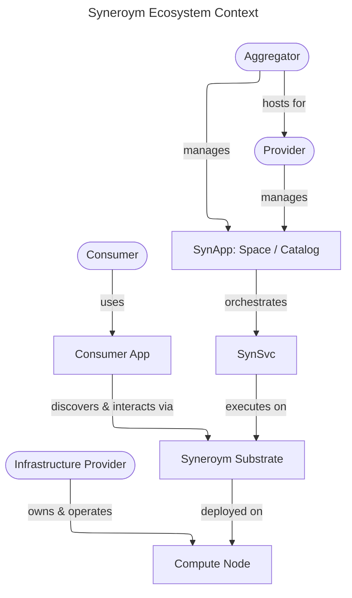
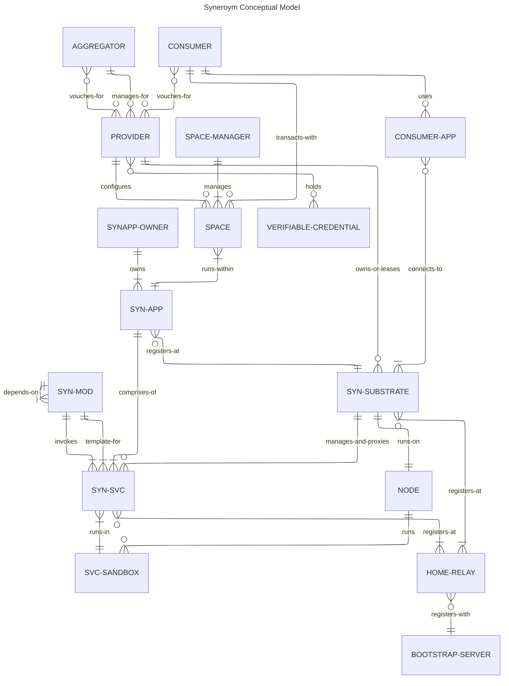

# Syneroym Ecosystem Requirements Specification

The [thesis](../THESIS.md) states the core bet: a truly peer-to-peer foundation for group communication and trust, on which independent mini-apps (SynApps) — chat, marketplace, social, AI — plug in and work together as one experience, with no central server in the middle. No blockchains or cryptocurrency.

Our flagship experience and reference application is **Roym** — mini-apps sharing one identity, one contact list, one set of groups, one trust model. Its first vertical is the Professional Services Guild, built entirely on the Syneroym substrate.

**Status:** Draft product baseline

**Last product review:** 2026-06-22

**Companion documents:** [Thesis](../THESIS.md) · [Vision](./VISION.md) · [Architecture](./system-architecture.md)

This document is the canonical statement of **who Syneroym serves, what outcomes
it must enable, and which constraints a conforming implementation must honour**.
It expands the vision of *autonomous SynApps cooperating over a common
technology substrate* into testable product and ecosystem requirements.

### Requirement conventions

- **Must** denotes a release or conformance requirement.
- **Should** denotes an important default that may be deferred with a documented
  product or operational reason.
- **May** denotes an optional capability.
- Product releases are vertical, end-to-end increments. Capability backlog
  phases are engineering sequencing bands and do not independently constitute a
  usable product release.
- Open questions are tracked as milestone decision gates in the
  implementation plan and resolved before the milestone that needs them
  starts.
This requirements spec is structured as follows:

- Philosophy & Design Constraints
- Product Outcomes, Guardrails, and Release Scope
- Requirements Overview
- Personas
- Glossary / Terminology
- Common Requirements
- Trust Model
- Conceptual Model
- Substrate Functionality
- Shared Utilities and Services
- SynApp Specs:
    - Reference Application: Business, Professional, and Retail Spaces (covering Home Services and Small Retail)
- Post-DD864A1 Specifications

---

## Philosophy & Design Constraints

Providers and consumers cluster locally; global reach from one source is not required. Reach grows instead through federation across autonomous clusters — cooperation between independently owned peer clusters over shared protocols, not server federation; no server sits between participants. The system keeps the benefits and sheds the drawbacks of large platforms listed in [VISION.md](./VISION.md#background), and goes after the open problem stated in the [thesis](../THESIS.md): rich group activity at real scale, with no central server, where no participant's device needs to fully trust any other.

### Design Principles

The following principles guide design decisions throughout the system:

**Locality-first.** The system is optimised for scenarios where providers and consumers are geographically proximate. Federation between local clusters is important; undifferentiated global reach is not an initial goal.

**Progressive decentralisation.** A provider starts with a single device and no federation. Complexity is introduced incrementally as their needs grow. The system does not require full federation to be useful.

**Data sovereignty.** Authoritative private provider data lives on infrastructure
the provider controls or has explicitly chosen. Public listings and records the
provider deliberately shares may be cached or replicated under disclosed
retention rules. Syneroym-operated infrastructure receives no special right to
store or monetise provider data.

**Transparency over opaqueness.** Ranking, discovery, and reputation algorithms are either open source or provider-auditable. No hidden algorithmic black boxes determining outcomes for providers.

**Interoperability by convention.** SynApps cooperate through shared substrate primitives and open protocols. No SynApp requires a central coordinator to interoperate with another.

**Human-operable by default.** A provider must be able to start small, understand
the system's current state, recover from common failures, and leave without
specialist assistance. Decentralisation that only experts can operate does not
satisfy the product goal.

**User agency over ecosystem purity.** Self-hosting is always available, but
managed hosting, familiar payment rails, and lightweight consumer identities are
valid adoption paths when their trade-offs are explicit and exit remains
possible.

**End-to-end slices before platform breadth.** New substrate capabilities are
validated through a real provider-consumer workflow before adjacent generality
is added.

**Additive evolution.** Nothing is shelved. Payments/ledger primitives, AI
assistance, attestation, and stronger identity tiers are sequenced, not
deferred — each lands in its turn and composes with shipped contracts without redesigning them.

---

## Product Outcomes, Guardrails, and Release Scope

### Product outcomes

Syneroym succeeds when it creates a credible third option between a large
centralised marketplace and running an isolated website or messaging account.
The product must deliver these outcomes:

1. **Provider autonomy without an operations burden.** A small provider or guild
   can publish, transact, retain its customer relationships, and change operators
   without rebuilding its digital business.
2. **A coherent consumer experience across independent operators.** A consumer
   can discover, assess, contact, agree with, and later return to providers
   without understanding substrates, relays, or federation.
3. **Cooperation without surrendering control.** Independent providers can share
   discovery, referrals, infrastructure, and composed workflows while retaining
   their own identity, data, policies, and right to exit.
4. **Useful operation under real local constraints.** Core workflows tolerate
   intermittent connectivity, modest hardware, and varying technical skill.
5. **An ecosystem developers can safely extend.** Stable contracts, conformance
   tests, capability negotiation, and transparent governance allow third parties
   to build interoperable SynApps without privileged access.

---

## Requirements Overview

High-level requirement highlights:

- Providers either self-host on commodity hardware or choose a managed operator,
  without requiring a cloud account or deep technical expertise.
- Providers federate with others to share infrastructure and improve resilience and discovery reach.
- Consumers discover and transact with providers through a unified experience regardless of which substrate hosts the provider.
- Consumers can participate with a lightweight device-bound identity; running a
  personal substrate is an optional upgrade path, not an entry requirement.
- The substrate provides shared contracts for identity, messaging, discovery,
  agreements, receipts, trust signals, and data portability. Payment execution
  remains pluggable and outside the system trust boundary.
- The system degrades gracefully under network partition — queuing, offline-first storage, and async workflows keep transactions progressing.
- All provider participants retain the ability to exit — migrating data and services to a different infrastructure provider or running independently.
- Ecosystem protocols are open, versioned, testable, and governed through a
  published process that does not privilege Syneroym-operated services.

---|---|---|
| **PRD-AUT** | Provider identity, data, policy, and operator choice remain under provider control. | Delegation-revocation and operator-migration journeys. |
| **PRD-CUX** | Consumers complete the reference journey without understanding hosting or federation. | Moderated task-success test and accessibility audit. |
| **PRD-FED** | Independent implementations interoperate without a mandatory central data-plane or authority. | Two-node federation and bootstrap-outage tests. |
| **PRD-OFF** | Safe workflows remain intelligible and converge after disconnection; unsafe retries fail explicitly. | Fault-injection, idempotency, and state-model tests. |
| **PRD-POR** | Participants can export, verify, and restore in-scope identity-linked data through versioned open formats. | Clean-node export/import drill and cross-version fixtures. |
| **PRD-TRU** | Trust evidence is sourced, scoped, fresh, explainable, and correctable; uncertainty remains visible. | Trust-display, revocation, omission, and abuse cases. |
| **PRD-OPS** | A non-specialist can install or join, understand health, recover, update, and exit within the declared operating profile. | Timed onboarding and incident-recovery exercises. |
| **PRD-EXT** | Third-party SynApps can declare capabilities and pass public compatibility tests. | Package inspection and protocol conformance suite. |
| **PRD-SAF** | Consent, data lifecycle, moderation boundaries, and responsible parties are explicit throughout a transaction. | Policy-version, grant, report, dispute, and deletion scenarios. |

---

## Personas in the Syneroym Ecosystem

The following are key personas. A single person or organisation may play
multiple roles, but the product must make the active role and its powers clear.

| Persona | Primary job to be done | Adoption constraint |
|---|---|---|
| **Individual Service Provider** | Publish an offering, receive qualified local work, serve repeat customers, and retain business history. | Limited time and technical skill; may have only a phone and intermittent connectivity. |
| **Self-hosting Provider / Node Owner** | Run the provider's digital business without dependence on an aggregator. | Needs safe defaults, understandable health, backups, and recovery—not a miniature SRE role. |
| **Guild or Provider Aggregator** | Onboard and support multiple providers, provide local discovery and trust context, and operate shared services. | Must earn trust without acquiring irrevocable control over provider identity or data. |
| **Infrastructure Provider** | Offer bounded compute, storage, and connectivity with auditable usage and responsibilities. | Needs isolation, quotas, abuse controls, and an explicit service agreement. |
| **Consumer** | Find a suitable provider, understand why they are trustworthy, agree terms, communicate, pay, and keep records. | Will not install infrastructure or learn federation concepts before receiving value. |
| **SynApp Developer** | Build once against stable contracts, test locally, distribute safely, and interoperate with other apps. | Needs concise contracts, compatibility signals, examples, and conformance tooling. |
| **Space Manager** | Configure a provider or guild presence, policies, catalog, availability, and staff access. | Needs delegated permissions and an audit trail without access to unrelated provider data. |
| **Facilitator** | Offer an optional bounded service such as delivery, payment gateway, credential issuance, backup, or dispute handling. | Must disclose terms and authority; cannot become an implicit mandatory intermediary. |

---

## Glossary / Terminology

**Aggregator.** Takes responsibility for managing online services for multiple providers. E.g. a plumber cooperative.

**App Developer.** A person or organisation that builds SynApps and publishes them for others to deploy. Does not necessarily host or operate any infrastructure.

**Bootstrap Server.** A Syneroym-operated service that is a registry of active services and Relays, and handles other system management responsibilities.

**Consumer / General User.** Uses the Syneroym ecosystem to discover and purchase services or products, or to interact with other entities.

**Federation.** The process by which independent providers and infrastructure nodes interoperate to share discovery, reputation, and messaging capabilities without a central authority.

**Home Relay.** A Relay assigned to a Substrate or SYN-SVC as its primary connectivity point.

**Infrastructure Provider.** A person or organisation that makes hardware or virtual infrastructure available for Service Providers to host applications on a leased basis.

**Operator.** The person or organisation responsible for administering a
Substrate or managed SynApp Instance. An Operator may also be a Provider,
Aggregator, or Infrastructure Provider, but those roles confer different duties.

**Node.** A physical or virtual machine running one Substrate instance. May run multiple SVC-Sandboxes.

**P2P.** Peer-to-peer. To denote direct interaction between 2 entities without any intermediate broker service.

**Provider.** Short for *Service Provider*. Provides a service to others — e.g. plumber, photographer, consultant. May self-host or use an Aggregator.

**Relay.** A service that provides connectivity for SUBSTRATEs and SVCs that cannot accept inbound connections directly (e.g. behind NAT or firewall). Coordinates direct connectivity, occasionally relays encrypted traffic where direct connectivity does not work.

**Space.** A named, provider-configured business context within a SynApp (e.g. a plumber's catalog and booking page).

**Space Manager.** The person (often the Provider or Aggregator) responsible for configuring and operating a Space: catalog, branding, access control, and operational policies.

**Substrate (SYN-SUBSTRATE).** The core runtime layer on a NODE. Manages service deployment, lifecycle, discovery registration, messaging, and access control on behalf of the NODE-OWNER.

**Service Sandbox (SVC-SANDBOX).** The execution environment for a SYN-SVC. May be a WASM runtime instance, a Podman container, or equivalent. Provides isolation between services sharing a NODE.

**SynApp (SYN-APP, Syneroym Application).** A deployment manifest and control plane overlay that defines a cohesive graph of SYN-SVCs. It acts as a blueprint to deploy, update, and manage capabilities, quotas, and namespaces. It is not an execution boundary.

**SynApp Instance.** One deployment of a SynApp blueprint, with its own stable
instance identifier, namespace, bindings, policy grants, configuration, and
accounting context.

**SynApp Owner.** The provider who deploys a SynApp to provide services to their clients. Distinct from the Developer who develops it.

**Syneroym Module (SYN-MOD).** A reusable, independently deployable unit of business logic. Packaged as a WASM component or OCI image.

**Syneroym Service (SYN-SVC).** A running instance of a module, executing within a SVC-SANDBOX on a Node. It is the absolute foundational zero-trust execution primitive of the Syneroym Substrate. Managed and proxied by the Substrate.

**Verifiable Credential.** A cryptographically signed attestation issued by a third party (e.g. a trade authority, government body, or community organisation) and attached to a Provider's profile. The consuming party decides which credential issuers they trust.

**Vouching.** A trust mechanism where entities issue signed endorsements for other entities within their network, creating a verifiable web of trust.

---

## Ecosystem & Domain Model

The following diagram shows the high-level business entities in the Syneroym ecosystem and how they interact.

```mermaid
---
title: Syneroym Ecosystem Context
config:
    layout: elk
---
flowchart TD
    Consumer([Consumer])
    Provider([Provider])
    Aggregator([Aggregator])
    InfraProv([Infrastructure Provider])
    
    ConsumerApp[Consumer App]
    SynApp[SynApp: Space / Catalog]
    Substrate[Syneroym Substrate]
    Node[Compute Node]

    Consumer -->|uses| ConsumerApp
    ConsumerApp -->|discovers & interacts via| Substrate
    
    Provider -->|manages| SynApp
    Aggregator -->|hosts for| Provider
    Aggregator -->|manages| SynApp
    
    SynSvc -->|executes on| Substrate
    SynApp -->|orchestrates| SynSvc
    Substrate -->|deployed on| Node
    InfraProv -->|owns & operates| Node
```

*(Note: For the lower-level technical architecture diagram detailing modules, services, and sandboxes, please refer to the Architecture Design Document).*

---

## Common Requirements

These requirements apply across all business domains and SynApps.

### Infrastructure & Hosting

- Service Providers run business applications on supported commodity computers
  they control, or on infrastructure operated under an explicit agreement, even
  when the host is behind NAT or a firewall.
- Infrastructure Providers make hardware (old PCs, cloud VMs, etc.) available for Service Providers to host applications or application components on a leased basis.
- Service Providers see a plain-language service status and receive actionable
  notification when their intervention is required. Routine managed operation
  must not require shell access.
- Infrastructure Providers monitor infrastructure health and resource usage,
  control node access, and see which obligations are affected by an incident.
- App Developers package SynApps (e.g. as WASM modules or OCI images), and Providers deploy them to matching container infrastructure (WASM runtime, Podman/Docker).
- Consumers access Provider services through options the Provider makes available: app UI, browser, API, or command-line tools.
- Service Providers export and restore all in-scope data, configuration, grants,
  and signed history using documented, versioned, non-proprietary formats. An
  export includes a manifest and completeness report; secrets may require a
  separately protected transfer.
- Every production profile supports encrypted backup and tested restore. Backup
  destination is operator-selectable; peer backup pools are optional and must
  not be required for portability.
- The system reports recovery-point and recovery-time expectations before a
  provider chooses a hosting profile. Backup success is never inferred merely
  from upload success; restorability is tested.
- Multi-device clients may work offline using local caches and outboxes. Running
  independent writable copies of the same authoritative service state is a later
  capability and must not be implied by the baseline requirement.
- Sharding and multi-node service placement are optional scale capabilities.
  They must not complicate the single-node deployment or portability contract.

### Connectivity & Offline Behaviour

- The substrate supports direct peer-to-peer connections wherever possible, and falls back to relay-mediated encrypted connections when NAT or firewall constraints prevent direct connectivity.
- **Offline outbox and retry queue:** Operations explicitly declared safe for
  deferred delivery are stored durably, expose `pending`, `delivered`, or
  `failed` status to the user, and retry when connectivity returns. The UI must
  not present `pending` as final success.
- Automatic retries require an idempotency contract. The system must not replay
  a non-idempotent operation merely because a connection failed.
- Each transactional entity defines permitted state transitions, authority,
  expiry, idempotency, and conflict behaviour. Reconnection either reaches the
  same valid final state for all parties or exposes a conflict requiring a named
  party's decision; silent last-write-wins is not acceptable for agreements,
  payments, fulfilment, or access grants. A single writer per service resolves
  this by replaying queued requests through per-entity arbitration rules — no
  multi-master merge is needed for these entities.
- Users can cancel a still-pending operation when doing so is safe, and can see
  when cancellation is no longer guaranteed because delivery may have occurred.

### Messaging & Data Sharing

- Providers, Consumers, and Services exchange messages only within an explicit
  conversation or capability context and subject to owner-approved access
  policy.
- The system supports one-to-one text, attachments, and structured service cards
  for requests, quotes, agreements, status, receipts, and grants. Group chat,
  audio/video, social feeds, and collaborative editing are optional later
  SynApps, not substrate conformance requirements.
- A structured message has a stable type, schema version, sender, intended
  recipients, creation time, idempotency identifier where applicable, and
  verification status. Clients render unknown types safely without executing
  arbitrary sender code.
- The product states which message content and metadata are end-to-end encrypted,
  which operator can observe remaining metadata, and why. Transport encryption
  alone must not be described to users as end-to-end message privacy.
- Unsolicited contact is rate-limited and user-controlled. Recipients can block,
  report, and leave a conversation without surrendering their transaction
  records.

### Non-Functional Requirements

Unless superseded by a stricter vertical requirement, the reference client uses these
measurable baselines. Test profiles and measurement methods belong in the
Architecture and test plans.

| Quality | Requirement |
|---|---|
| **Security** | All inter-node and client-node traffic is encrypted in transit. Sensitive production data and backups are encrypted at rest by default. No default credential is shared across installations. Critical actions are authenticated, authorised, and audit-recorded. |
| **Identity security** | Routine key rotation and device loss do not require a new public identity. Revocation freshness, recovery authority, and the consequence of losing every recovery factor are shown to the owner. Government identity is optional, never the universal root of participation. |
| **Availability** | Local and cached reads remain available during temporary bootstrap or relay loss. Already-known peers continue the reference flow during the 24-hour bootstrap outage test when a viable direct or cached relay route exists. |
| **Durability** | The disconnect/reconnect and process-restart suites lose no acknowledged in-scope transaction message. Backup restore is verified on a clean node before initial release. |
| **Performance** | On the documented standard-node and mobile-network profiles, local UI actions reach p95 under 1 second and remote browse, search, message acknowledgement, and request submission reach p95 under 3 seconds, excluding an offline peer or external payment provider. |
| **Operability** | Health output identifies the affected user capability, likely cause, and safe next action. Updates are reversible; failed migrations automatically preserve or restore the last known-good state. |
| **Interoperability** | A claimed protocol version passes published conformance tests. Unknown optional capabilities fail gracefully; incompatible mandatory capabilities are rejected before a workflow begins. |
| **Privacy** | The system minimises observable metadata, documents every operator-visible category, and provides purpose, retention, export, and deletion behaviour for personal data. Telemetry is off or local by default unless the operator or user knowingly enables export. |
| **Portability** | Export/import formats and identity-linked history are documented, versioned, integrity-checked, and covered by cross-version fixtures. |

---

## User Experience, Agency, and Accountability

### Onboarding and recovery

- A provider can choose a managed-guild path or a self-hosted path. The product
  explains control, cost, availability, privacy, and support trade-offs before
  the choice is committed.
- Joining a guild must not transfer ownership of the provider's root identity,
  signed history, or export rights to the guild. Delegated administration is
  scoped, visible, revocable, and audit-recorded.
- Consumer onboarding creates or imports a lightweight identity on the consumer's
  device. Backup is strongly prompted after first value, not made a blocker to
  browsing. The recovery model does not claim self-sovereignty if an operator can
  unilaterally recover or impersonate the consumer.
- Destructive actions state their scope and recovery consequences. Common
  recovery flows are available through a guided UI as well as an expert CLI.

### Data rights and lifecycle

- Every durable record has a documented owner or controller, permitted writers,
  retention policy, export representation, and deletion or tombstone behaviour.
- Shared records such as agreements, receipts, reviews, and revocations cannot be
  unilaterally rewritten. A participant may remove its local copy or personal
  presentation where law permits, while the protocol preserves the other party's
  legitimate signed record and records later corrections separately.
- Access grants are purpose- and scope-limited, expire by default for sensitive
  data, and can be revoked. The UI shows who currently has access and what
  revocation can and cannot retract from already-received data.
- Export and account deletion are distinct actions. Deletion identifies data
  held by the provider, operator, backup destination, peers, and legally required
  records; the product must not promise deletion it cannot enforce.

### Safety, support, and disputes

- Before production use, the system has a reviewed threat model and privacy data
  inventory covering malicious packages, peers, clients and operators;
  compromised keys; metadata leakage; denial of service; backup exposure; and
  recovery abuse. Residual risks and unsupported deployment profiles are stated.
- Syneroym supplies evidence and workflow primitives; it does not imply that
  every listed provider, guild, credential issuer, or facilitator has been vetted
  by the Syneroym project.
- Provider terms, price, cancellation rules, data use, payment method, and named
  dispute path are captured before agreement. A material change requires renewed
  consent and produces a new version.
- Users can report impersonation, fraud, harassment, unsafe service, and illegal
  content to the relevant operator or community. Reports have a status, an
  appeal or correction path where appropriate, and safeguards against publicising
  unverified allegations as fact.
- Emergency response, guaranteed refunds, insurance, professional licensing, and
  legal arbitration are not implied platform services. A guild or facilitator
  offering them must state jurisdiction, limits, and responsible legal entity.

---

## Ecosystem Contracts and Governance

- The minimum federation contract consists of versioned identity resolution,
  endpoint discovery, provider/catalog publication, service request, agreement,
  receipt, trust-signal, capability negotiation, and export schemas plus their
  security and error semantics.
- Each normative contract has a stable identifier, compatibility policy, test
  vectors, and an executable conformance suite. A third-party implementation can
  verify compatibility without contacting a privileged Syneroym service.
- Protocol changes follow a public proposal process with rationale, security and
  privacy impact, migration plan, reference fixtures, and a defined review
  period. Urgent security changes may be expedited but are documented afterward.
- No public Syneroym-operated bootstrap, relay, registry, app store, model
  service, or certificate authority is the sole permitted implementation of its
  role. Defaults may be convenient; replacement and export remain supported.
- Compatibility claims are capability-specific (for example, "Guild Requests
  v1") rather than a blanket "Syneroym compatible" label. Certification does not
  imply provider quality, legal compliance, or financial safety.
- SynApp packages are content-addressed or signed, declare publisher, requested
  capabilities, data migrations, supported interfaces, resource bounds, and
  update policy. Owners approve material capability expansion before update.
- The project's sustainable business model may charge for hosting, support,
  certification, or optional services, but protocol participation and data exit
  cannot depend on paying a mandatory Syneroym toll.
- The project publishes a vulnerability-reporting channel, supported-version
  policy, security advisory format, package revocation mechanism, and emergency
  update/rollback procedure before the public production launch.

---

## Trust Model

Centralized platforms derive consumer trust from brand, legal accountability, and aggregated reviews. A truly peer-to-peer system — where no participant's device needs to fully trust any other — needs explicit mechanisms to establish equivalent trust without central authority.

### The Trust Problem

When a consumer discovers a provider through Syneroym, they have no prior relationship with either the provider or the infrastructure operator. The system gives the consumer sufficient signal to decide whether to transact. Conversely, providers have signal that consumers are not fraudulent.

Minimum requirement at transaction time:

- Before accepting an agreement, the consumer can inspect the provider's stable
  identity, the provenance and freshness of available trust signals, material
  policy terms, payment recipient, and dispute/cancellation path. Absence of a
  trust signal is shown as unknown, never converted into a positive default.
- Providers can configure proportionate consumer-side requirements for higher
  risk work, such as a verified contact method, prior receipt, deposit, or named
  facilitator. The product avoids collecting stronger identity than the risk
  warrants.
- Trust displays separate facts (credential, completed interaction, vouch,
  report, recency) rather than hiding them behind one universal score. Any
  summary or ranking is explainable and can be recalculated from disclosed input
  categories.

### Trust Layers

Trust in the Syneroym ecosystem operates at multiple levels:

**Layer 1: Cryptographic continuity.** A stable, issuer-neutral identity delegates
to rotatable device and routing keys. Hardware protection, social recovery, or a
government credential may strengthen recovery or identity assurance, but none is
required universally. Cryptographic continuity proves control of keys—not a
person's legal name, quality, or honesty.

**Layer 2: Referral and vouching.** Entities issue signed, scoped, expiring
statements about other entities. A guild may attest membership or a consumer may
recommend a completed service. The display preserves who said what and in which
context; a vouch is not silently treated as objective verification.

**Layer 3: Verifiable credentials.** Providers attach credentials such as a trade
licence or certification. Verification checks signature, issuer, scope, expiry,
and revocation. The consuming party or community decides which issuers it trusts;
the UI does not reduce "valid signature" to "trusted claim".

**Layer 4: Interaction receipts and feedback.** Completed interactions can produce
mutually signed receipts and separately signed feedback. A receipt proves that
the parties acknowledged a workflow event, not that every off-system claim is
true. Portable bundles preserve provenance and allow selective disclosure.

**Layer 5: Community moderation.** Guilds and communities maintain their own
policies and signed block, warning, or trust lists. Reports are scoped and do not
automatically propagate as global truth. Consumers see the policy source; people
affected by a published decision have a correction or appeal mechanism where
safety and law permit.

Trust mechanisms must be evaluated against collusion, selective omission,
replay, identity farming, review coercion, compromised keys, malicious issuers,
and discriminatory community policies. Tying feedback to a signed interaction
reduces casual spam but does not by itself solve Sybil attacks or collusion.

### Legal Liability Boundary

The system does not provide legal shielding in the way centralised platforms do — that shielding derives from the platform's legal personhood and terms of service. Syneroym infrastructure operators bear their own legal responsibility for services they host under applicable local law. The requirements are:

- The substrate makes it straightforward for a Provider or Aggregator to display their own terms of service to consumers.
- The substrate does not create an implicit representation to consumers that a federated node has been vetted by Syneroym.
- A separate document will outline recommended legal structures for Provider Aggregators operating at scale. [Legal guidance: Out of scope for this spec]

---

## Conceptual Model

The following ER diagram shows the formal entity model for the Syneroym
ecosystem, with full relationship cardinalities. See the
[Glossary](#glossary--terminology) for definitions of all entities. See the
[Ecosystem & Domain Model](#ecosystem--domain-model) diagram for a higher-level
overview.

```mermaid
---
title: Syneroym Conceptual Model
config:
    layout: elk
---
erDiagram
    direction TB

    %% --- Module & Service structure ---
    MOD ||--|{ MOD : depends-on
    MOD ||--|{ SVC : invokes
    MOD ||--|{ SVC : template-for
    SYNAPP ||--|{ SVC : comprises-of
    SVC }|--|| SVC-SB : runs-in
    NODE ||--o{ SVC-SB : runs
    SUBSTRATE ||--|| NODE : runs-on
    SUBSTRATE ||--o{ SVC : manages-and-proxies

    %% --- Ownership ---
    PROVIDER ||--o{ SUBSTRATE : owns-or-leases
    SYNAPP-OWNER ||--|{ SYNAPP : owns
    SYNAPP }o--|| SUBSTRATE : registers-at
    AGGREGATOR ||--o{ PROVIDER : manages-for

    %% --- Connectivity ---
    SVC }o--|{ HOME_RELAY : registers-at
    SUBSTRATE }o--|{ HOME_RELAY : registers-at
    HOME_RELAY }o--|| BOOTSTRAP : registers-with

    %% --- SynApp-level entities ---
    PROVIDER ||--o{ SPACE : configures
    SPACE }|--|| SYNAPP : runs-within
    SPACE-MGR ||--|{ SPACE : manages

    %% --- Consumer side ---
    CONSUMER ||--o{ CONSUMER-APP : uses
    CONSUMER-APP }o--|{ SUBSTRATE : connects-to
    CONSUMER ||--o{ SPACE : transacts-with

    %% --- Trust ---
    PROVIDER }o--o{ VERIFIABLE-CRED : holds
    CONSUMER }o--o{ PROVIDER : vouches-for
    AGGREGATOR }o--o{ PROVIDER : vouches-for

    MOD[SYN-MOD]{}
    SVC[SYN-SVC]{}
    SYNAPP[SYN-APP]{}
    SYNAPP-OWNER[SYNAPP-OWNER]{}
    SUBSTRATE[SYN-SUBSTRATE]{}
    SVC-SB[SVC-SANDBOX]{}
    NODE[NODE]{}
    HOME_RELAY[HOME-RELAY]{}
    BOOTSTRAP[BOOTSTRAP-SERVER]{}
    PROVIDER[PROVIDER]{}
    AGGREGATOR[AGGREGATOR]{}
    SPACE[SPACE]{}
    SPACE-MGR[SPACE-MANAGER]{}
    CONSUMER[CONSUMER]{}
    CONSUMER-APP[CONSUMER-APP]{}
    VERIFIABLE-CRED[VERIFIABLE-CREDENTIAL]{}
```

---

## Substrate Functionality

Description of the core Syneroym substrate functionality, key protocols, and important flows.

### Substrate Setup

- Node owner installs the substrate on a node.
- Substrate creates a protected initial administrator credential on first run and
  requires the owner to establish a tested recovery method before production
  use. Routine administration uses revocable delegated credentials rather than
  exposing a root key.
- Substrate registers with a Relay:
    - Contacts a bootstrap service to obtain a home relay assignment.
    - Publishes its node public key and associated relay routing information to a distributed registry or p2p network (used for the node's control plane, e.g. SYN-SVC deploy/remove).
    - Starts a secure communication server listening via the assigned relay and/or direct peer-to-peer interfaces.
- Substrate identifies its capabilities (sandbox/container types, quota configurability). Node owner configures capability limits (CPU, GPU, memory, disk, other capabilities) available to hosted Services.
- Access control setup:
    - If the node owner has a primary substrate, this substrate's pubkey is registered with it.
    - Necessary substrate access is granted to the owner's primary key.
    - SYN-APP owner pubkeys are granted access to substrate management APIs (deploy, remove, observe) with associated quotas.

### Substrate Managing Services

- Substrate provides a secure end-to-end communication channel between clients and the services it manages.
- Substrate supports WASM and Podman sandbox environments at minimum.
- Substrate attempts direct client-service communication wherever possible; it falls back to external relay (DERP) when intermediate network infrastructure does not permit direct connections.
- On mobile platforms, if the substrate and embedded services are throttled by the OS, requests are sent as offline notifications. The service response is triggered when the substrate application is next active.

### Core Substrate Services

**Messaging.** The substrate supplies secure, typed, durable delivery primitives.
Conversation products such as chat, groups, feeds, and collaboration remain
SynApps built on those primitives.

**Discovery.** The substrate exposes capability and endpoint discovery. Guild
directories, referrals, federated catalogs, and ranking are replaceable SynApps
or services that implement the common publication and query contracts; no one
global index is required.

**Identity.** The substrate manages protected key storage, rotation, revocation,
recovery, and delegation while separating stable identity from ephemeral routing
keys. Optional credential and privacy-preserving proof systems plug into this
issuer-neutral foundation.

**Access Control.** The substrate enforces deny-by-default policy on inter-service
and client-service communication. The product accurately documents the
infrastructure operator's technical powers; policy enforcement alone must not be
presented as protection from a fully compromised host. Sensitive deployments may
require owner-held encryption keys or attested hardware.

---

## Supporting Ecosystem Entities

### Relay

- On startup, a relay may apply to register as a community relay with the Syneroym bootstrap server (refreshed periodically).
- On successful registration, it is reachable as `<relaynodeid>.syneroym.net`.
- Acts as a coordination server for direct connections between peers using UDP hole punching.
- Acts as an encrypted TCP data relay when direct connection is not possible (no UDP, symmetric NAT, CGNAT).
- Acts as a TURN relay for WebRTC when browsers access services behind NAT.

### Bootstrap

- Accepts NodeId registration offers; with associated relay details as applicable.
- Maintains a list of officially operated relays with capability metadata (TCP relay, TURN, etc.).
- Accepts community relay registration offers; verifies capability claims (offline or real-time checks).
- Registers DNS entries for community relays under its domain e.g. `*.syneroym.xyz`.
- Returns a weighted random set of relays from the registry based on requested capability and relay capacity.
- Periodically audits registered relays and expires stale entries.
- For node ID lookups, checks internal cache or DHT fallback and returns the relay. For HTTP URL lookups from browsers, finds the relay and issues an HTTP redirect.

> **Single point of failure note.** A default bootstrap service is a governance
> and availability dependency. Its signed records must be exportable and
> publishable through alternative operators or discovery mechanisms. Known peers
> and cached routes must satisfy the bootstrap outage release gate; one
> Syneroym-controlled service must not be required to authorise continued use.

### Consumer-Facing Aggregation

> This section addresses a gap in the prior spec. Centralised platforms provide consumers a single app. In Syneroym, providers may run on different substrates operated by different entities. The consumer experience remains coherent.

- A Consumer App (web or mobile) allows consumers to discover, browse, and transact with providers across multiple substrates and SynApps from a single interface.
- The Consumer App can query one or more community directories, follow referrals
  and direct links, and merge results with visible source and ranking provenance;
  it does not need to know which substrate hosts a provider.
- A consumer's identity, signed receipts, grants, and preferences are portable
  and controlled from the consumer's device or a store the consumer has
  explicitly designated. Running a personal substrate is optional.
- The Consumer App is itself a thin client; business logic runs on provider substrates. The Consumer App is not a privileged participant in the ecosystem.

---

## SynApp Lifecycle

### Development

- Developers build encapsulated components (e.g. using WebAssembly or standard container images) that define clear, strongly-typed interfaces for inter-component communication.
- The system supports automatically deriving external-facing APIs (e.g., JSON-RPC or HTTP/REST) from these internal component interfaces to support diverse clients like web browsers.
- Components are packaged into standard distribution formats suitable for the target substrate execution environment.

### Deployment

- An Application Specification composes components into a SynApp and declares dependencies, resource requirements, and configuration schema.
- The specification declares package identity and signature, supported protocol
  versions, requested capabilities, data classifications, migrations, backup
  expectations, health checks, and rollback behaviour.
- Provider applies the Application Specification to chosen substrate(s).
- Before deployment, the substrate validates resource availability,
  compatibility, access permissions, and capability expansion and presents a
  comprehensible approval summary.
- A partially failed deployment is recoverable or rolled back without leaving
  undeclared services or grants. Installation state is inspectable and exportable.

### Monitoring

- Substrate monitors the application and provides health information,
  notifications, and policy-controlled restart or redeploy on failure.
- Providers receive alerts through UI, CLI, or webhook integrations of their choice.
- Updates preserve a last known-good package and state snapshot until health and
  migration checks pass. A capability increase requires renewed owner approval.

---

## Reference Vertical Contracts

The two reference SynApps validate common ecosystem contracts without forcing
unrelated domains into one generic application. They may share modules and
schemas, but each has its own language, workflow, policy, and usability tests.

### Home Services Guild

#### Provider and guild setup

- A guild operator deploys a signed release profile and creates a guild with
  public identity, service area, membership policy, support contact, dispute
  path, directory policy, and data retention policy.
- A provider joins through an invitation or application, controls a stable
  provider identity, and grants the guild only the administration rights needed
  for the chosen managed service.
- A provider publishes name, description, service categories, service area,
  availability or response expectation, price style (fixed, range, or quote),
  cancellation policy, supported payment rails, and trust evidence. Required
  fields and provenance are machine-readable.
- One operator can manage multiple provider Spaces without obtaining undeclared
  read access across their private conversations or histories.

#### Consumer-provider workflow

- **Discover.** Consumers reach a provider by direct link, referral, or one or
  more guild directories. Results show source, freshness, filters, and the reason
  for ordering; paid placement is absent from the initial release.
- **Assess.** Consumers see relevant services, price basis, availability,
  provider identity continuity, trust evidence, guild relationship, and material
  policies before sharing personal details.
- **Request and clarify.** A request captures category, description, approximate
  area, preferred window, attachments, and a data-use notice. Exact address is
  disclosed only when needed. Parties can clarify in the linked conversation.
- **Quote and agree.** A versioned quote states scope, price, taxes or fees,
  schedule, location, payment method, cancellation/refund terms, expiry, and
  dispute path. Both parties' acceptance produces a signed agreement receipt.
- **Fulfil.** Permitted states and actors are explicit. State changes are
  idempotent and append-only in the audit history; corrections do not rewrite
  previously signed facts.
- **Settle.** The system opens or records an external or out-of-band payment and
  captures acknowledgement. It never presents an unverified return from a
  payment app as final settlement.
- **Close and return.** Completion produces a portable receipt. Feedback is
  optional, tied to the receipt, and remains distinct from guild membership or
  platform ranking. Either party can start a repeat request without re-entering
  information it still consents to retain.

### Service Variation Dimensions

The system accommodates the following variation axes across workflows:

**Booking:** Event slots, consulting time slots, open-ended job requests.

**Payment:** One-time; pre- or post-delivery; multi-part; negotiated; subscription. Escrow, system coins, and mutual credit systems are deferred variation axes — see [Appendix: Later-Phase Additions](#appendix-later-phase-additions) and the [Dynamic Ledger Network Specification](https://github.com/syneroym/foundation/blob/main/ideas/commitment-network.md) for mutual credit mechanics.

**Product type:** Time-bound (e.g. prepared food), digital content, physical goods.

**Service type:** Time-slot service, job-completion-based service, location-based service.

**Location:** Fixed location, provider-proximate, consumer-proximate, remote/digital.

**Relationship type:** One-time, recurring, long-term with continuous shared history (e.g. doctor-patient).

**Service record:** Long-term (doctor-patient), engagement-specific (courses), tracking-required (delivery).

---

## Post-DD864A1 Specifications

Features after commit `dd864a1`. The rest of this document covers the shipped walking-skeleton baseline; this section sequences what comes next.

### Tag Legend
To ensure stable cross-referencing across commits and PRs, features are prefixed with category tags:
- **`[TOP]`**: **Topology** (Core Architecture Primitives)
- **`[FND]`**: **Foundation** (Core Infrastructure & Security)
- **`[PLT]`**: **Platform** (Data Layer & Resilience)
- **`[LFC]`**: **Lifecycle** (Substrate & Application Management)
- **`[ADV]`**: **Advanced** (Advanced Services & Tooling)
- **`[P2P]`**: **Peer-to-Peer** (Community Primitives)
- **`[APP]`**: **Applications** (High-Level SynApps)
- **`[EDG]`**: **Edge** (Edge Expansion & Mobile)

## Phase 0: Core Architecture Implementation (SynApp & Topology)

This phase implements the architectural boundary between Syneroym Applications (`SynApp`) and Syneroym Services (`SynSvc`), and the pending addressing and registry systems required for robust service discovery.
*(Current baseline: the codebase already has DID-key service identities, a community endpoint registry client backed by HTTP/pkarr, and an in-process local `EndpointRegistry`. This phase adds app-instance namespaces, topology-aware logical names, and orchestration on top of those primitives.)*

### [TOP-PRM] Core Primitives (`SynSvc`) vs. Control Plane Overlay (`SynApp`)

#### `SynSvc` (The Execution Primitive)
The `SynSvc` is the absolute foundational primitive of the Syneroym Substrate. 
*   **Zero-Trust Execution:** Represents an isolated, zero-trust execution boundary (often a WASM component, but could also be a Podman container or a native OS service sitting behind a platform gatekeeper). It does not implicitly trust other services, even those deployed alongside it.
*   **State & Capabilities:** It owns its state and enforces capability-based security (FDAE ReBAC policies and UCANs) on all incoming requests.

#### `SynApp` (The Control Plane Overlay)
`SynApp` is removed as a runtime execution boundary and is redefined as a **Deployment Manifest and Control Plane Overlay**.
*   **Lifecycle Management:** Acts as a blueprint to deploy, update, and remove a cohesive graph of `SynSvcs` as a single unit.
*   **Capability Bootstrapping:** Orchestrates the initial injection of permissions (ReBAC relations/policies) that allow internal services within the app to communicate.
*   **Resource Accounting:** Serves as a logical grouping for tracking quotas, billing, and telemetry across a designated graph of services.
*   **SynApp Instances:** Unlike Erlang applications (which are singletons), deploying a `SynApp` manifest creates a unique **SynApp Instance** with an isolated namespace. A single substrate can host multiple distinct instances of the same `SynApp` (e.g., Personal Task Manager vs. Work Task Manager).
*   **UI Decoupling:** User Interfaces are simply specialized `SynSvcs` or external clients. A `SynApp` may contain zero UIs (headless processes), one UI, or multiple specialized UIs (Admin, Storefront, Mobile Gateway).
*   **Terminology Reconciliation:** Older docs sometimes say a `SynApp` "runs on" a substrate. In this model, only `SynSvcs` execute. A `SynApp Instance` is the manifest, namespace, capability bootstrap, dependency graph, and accounting context for those executing services.

#### Composable SynApps (App Dependencies)
Similar to Erlang OTP applications, `SynApps` are highly composable. A `SynApp` manifest is not restricted to explicitly declaring raw `SynSvcs`; it can declare dependencies on other `SynApps`.
*   **Dependency Resolution:** If `SynApp: Retail Store` depends on `SynApp: Identity Core`, the Orchestrator evaluates the dependency graph during deployment. It will ensure `Identity Core` is instantiated (or bind to an existing instance) before deploying the `Retail Store` instance.
*   **Instance Mapping:** This maintains the crucial App (Blueprint) vs. App Instance distinction. A higher-level SynApp can compose multiple foundational SynApps into a unified, deployed ecosystem, passing necessary capabilities down the dependency tree.

---

### [TOP-ADR] Service Addressing and Resolution Topology

Services communicate using a multi-tiered addressing model to support mobility, redundancy, and explicit targeting.

#### Addressing Types
1.  **Explicit Service ID (Physical ID):** 
    *   A stable cryptographic identifier for a deployed `SynSvc` instance. The current implementation uses DID-key identities derived from Ed25519 public keys; future encodings may wrap that in a shorter service identifier for ergonomics.
    *   Provider ownership of the service is proven via the service identity and its signed endpoint records, UCANs, or deployment certificates. The route to that service may change without changing the service identity.
    *   Used for stateful interactions, direct replies, and underlying substrate routing.
2.  **Logical Service Name:** 
    *   A human-readable or contextual identifier (e.g., `profile-svc`, `ledger-primary`) representing a *role* within a `SynApp Instance` namespace.
    *   Used by developers in code to ensure high availability, load balancing, and decoupling.

#### Service Topologies
When registering a Logical Service Name, the local registry tracks its underlying topology:
*   **Singleton:** Maps to exactly one Explicit ID.
*   **Redundant (Load Balanced):** Maps to an array of Explicit IDs. The resolver returns the eligible set and the caller/proxy selects a target using the manifest's policy.
*   **Sharded:** Maps to multiple Explicit IDs based on a stable routing key (for example, consistent hashing on `user_id`).

---

### [TOP-REG] Types of Registries in the Ecosystem

Rather than a strictly monolithic system, service discovery naturally emerges across different registry scopes:

1.  **Community Identity/Endpoint Registry (HTTP + pkarr/DHT):** Resolves top-level Provider, Node, and public Service identities to signed endpoint records (for example, Iroh endpoint addresses, WebRTC peer hints, or public gateway URLs).
2.  **Contextual/App Registry:** Resolves Logical Service Names to Explicit Service IDs within a specific `SynApp Instance` overlay context or shared node namespace. This mapping is **pushed into each service's configuration** by `roymctl` or the App Supervisor, not served by a queryable registry that services call at runtime — see [ADR-0021](decisions/0021-binding-propagation-and-app-supervisor.md).
3.  **Endpoint/Router Registry:** The internal substrate routing table. Maps an Explicit Service ID and interface to actual execution boundaries (for example, local WASM channels, native host functions, Podman sockets, TCP host/ports, or remote network sockets).

---

### [TOP-DSC] Discovery Mechanisms and Inventory

#### The `syneroym-core/registry` Default Service
To provide "batteries-included" service discovery, the platform provides a canonical Registry capability. It may run as a native substrate service or as an isolated Registry `SynSvc`, but it is distinct from the in-process local `EndpointRegistry`.
*   **Purpose:** Acts as the local source of truth for service inventory, logical-to-physical mapping, and health tracking.
*   **Manifest Configuration:** A `SynApp` manifest dictates how the Orchestrator handles this:
    1.  **Spawn:** Boot a dedicated, isolated instance of the Registry `SynSvc` exclusively for this app. To handle this correctly, the `SynApp` manifest must support a service dependency graph (either explicitly declared or inferred via references) so the Orchestrator boots the registry *before* the services that depend on it.
    2.  **Bind:** Register the app's services with a pre-existing, shared node-level Registry `SynSvc` (saving resources).
*   **Client Caching (Refresh-on-Failure):** Service clients query the registry to resolve a logical name, **cache** the resulting Explicit ID locally, and communicate directly with the Explicit ID. Cache entries carry a topology epoch or TTL and are refreshed on connection failure, registry update notifications, or expiry.
*   **Master Anchor Resolution (Revocation Handling):** To maintain secure identity revocation without breaking standard DHT signatures, the ecosystem enforces the **Master Anchor** pattern:
    *   Registries map Logical Service Names exclusively to the **Master Key**.
    *   The Master Key maintains a single `pkarr` DHT record containing an array of currently authorized **Temporary Keys** (the actual routing `NodeId`s).
    *   **Passive Revocation:** If a Temporary Key is compromised, the Master Key simply updates its DHT array to drop the compromised key. The registry and DHT mechanics themselves do not change.
    *   Dependent clients cache the route. Upon a connection failure (or periodically), they perform a "Refresh-on-Failure" by looking up the Master Key's DHT record again, instantly dropping the compromised key since it is no longer authorized.
    *   *(Note: Phase 0 delivers the Master Anchor endpoint-resolution contract, but defers production Master Anchor DHT authorization to Phase 1 `[FND-IDT]`.)*

#### Static Deployment Inventory (`roymctl`)
Not all apps require a live, queryable registry at runtime (e.g., trivial background cron jobs or standalone static UIs).
*   For these trivial apps, the orchestrator/CLI (`roymctl`) maintains a static, local state file (or local host DB).
*   It records the mapping of `SynApp Instance ID / logical role > Explicit Service ID(s)` at deploy time.
*   This static inventory is sufficient for lifecycle management (listing, stopping, uninstalling) without the overhead of spinning up a live Registry `SynSvc`.

---

### [TOP-ROB] Network & Connection Robustness

This defines the baseline resilience required for underlying node-to-node and client-to-node transport links, ensuring Syneroym handles transient network partitions gracefully before falling back to application-layer offline queues.

- **Transport Resilience & Retries:** 
  - The system must gracefully handle transient network drops. Any failed connection attempt must not immediately fail the higher-level request.
  - Implement automatic retries for establishing connections. The retry count should be configurable per service dependency or manifest default, defaulting to 3 retries with a simple exponential backoff.
  - Automatic request retries are only safe for connection setup, idempotent operations, or calls explicitly marked retryable with idempotency keys. Non-idempotent calls must surface failure or enter an opt-in outbox workflow.
- **Reactive Connection Management:**
  - Standard transport-level timeouts (e.g., QUIC idle timeouts, WebRTC SCTP timeouts) are used to detect dropped peers. We do not implement custom application-level ping/pong heartbeats to save bandwidth and complexity.
  - Stale connections are handled reactively: "evict when found out." If a read or write operation fails due to a disconnected peer, the connection is instantly marked as dead and retried or surfaced as an error.
- **Transport Modalities (Events vs Data):**
  - *(See `[PLT-DAP-04]` and `[PLT-DAP-05]` for decoupled event routing and data pipeline streams.)*

---

## Phase 1: Foundation & Core Infrastructure

### [FND-DEP] Deployment/Operations
- **Cloud-Agnostic Bare-Metal Deployment:** Single Rust binary deployed to a standard Linux instance (e.g., AWS Lightsail) to minimize virtualization overhead.
- **Packaging & Deployment:** Provisioning and deployment rely on multi-stage container images (`Dockerfile`), pre-configured community compose definitions (`deploy/docker-compose.community.yml`), and automated GitHub Actions release pipelines (`.github/workflows/release.yml`) compiling and publishing multi-architecture binaries and Docker images.
- **Native TLS:** Direct binding to port 443 within the Syneroym substrate using `rustls`. Certificates are fetched and renewed via `certbot`, and reloaded from disk via `SIGUSR1` signal handling without restarting the process.
- **Resource Protection:** Configuration parameters for connection caps and cache limits ensure the node gracefully refuses excess traffic instead of crashing (OOM).
- **Operator Experience:** SSH, `journalctl`, and local health endpoints (`/v1/info`) remain expert diagnostic tools. Encrypted backup and restore is managed via `roymctl`, and the App Supervisor reports active health alerts.
  > **Envisioned.** Not built yet. Interactive guided install and automated update/rollback CLI workflows. Today operations rely on standard CLI verbs and container lifecycle management.
- **Cross-Platform Distribution:** Automated build pipelines to compile and release Syneroym binaries for different architectures (Linux, macOS, Windows).
- **Dockerized Substrate:** Provide official Docker images of the Syneroym substrate for the community, pre-configured to point their local registries and coordinators to the public `syneroym.xyz` node.
- **Smoke Testing:** Automated integration/smoke tests that run against release candidates (binaries and Docker images) to verify they can successfully connect to and interact with the deployed coordinator and registry at `syneroym.xyz`.

### [FND-SEC] Substrate Security
- **Data at Rest Encryption (Envelope Encryption):** 
  - To prevent catastrophic re-encryption of gigabytes of data during key rotation, the substrate uses Envelope Encryption. Unique Data Encryption Keys (DEKs) are generated to encrypt the actual blobs and SQLite databases (via SQLCipher — see [ADR-0006](decisions/0006-sqlite-encryption-sqlcipher.md)).
  - The service owner negotiates and injects a Master Key (Key Encryption Key or KEK) securely into substrate RAM at startup. The KEK only encrypts the tiny DEKs stored on disk. Key rotation is instantaneous as only the DEKs are re-encrypted with the new KEK. KEK scope narrows progressively: a per-SynApp-Instance KEK *derived* from the master KEK (defense-in-depth, not tenant isolation), with IAM-gated per-instance/per-service *provisioning* (a distinct, separately-injected KEK per instance, gating production multi-tenant-at-rest security per [ADR-0006](decisions/0006-sqlite-encryption-sqlcipher.md)) as the still-outstanding eventual target; DEKs are per-service from day one.
  - **Secret Vault:** Application secrets (API keys, credentials) are stored securely inside a dedicated Vault table within the encrypted per-service SQLite database, rather than as vulnerable flat files on disk. Non-secret configuration may share the same encrypted store for convenience, but it is not treated as a secret unless marked as such.
  - Production profiles default local databases and all remote backups to
    encryption. Opt-out is limited to explicitly marked non-sensitive
    development profiles and produces a persistent insecure-state warning.
  - **Remote Backups:** Local backup archives are encrypted locally before storage or transit (see `[IDT-BAK]`).
    > **Envisioned.** Not built yet. Streaming live WAL frames or object snapshots to S3-compatible stores or peer backup substrates. Today backups are created as sealed encrypted archive files.
- **Hardware Attestation (optional; layers on without changing the security model):**
  > **Envisioned.** Not built yet. Substrate integrity relies on software signature validation.
  >
  > The substrate exposes a `substrate.attest(nonce)` API to the network. The App Deployer/Owner externally challenges the node (at deployment or periodically) and mathematically verifies the hardware quote (TPM, KeyAttestation, AppAttest). The deployer alone decides whether to deploy the service in a degraded trust environment or halt execution if attestation fails.
- **Memory Protection & Key Splitting:**
  - OS-level memory locking (e.g., `mlock`) prevents injected cryptographic keys from being swapped to disk.
  - The `zeroize` crate is used to explicitly wipe sensitive variables from RAM when dropped.
  - Key fragmentation may be investigated as defence in depth but is not treated
    as a security guarantee or release requirement. The threat model assumes a
    fully compromised host can observe plaintext while it is in use unless
    stronger hardware isolation is proven.
- **Resource Exhaustion & Quotas:**
  - Network edge protection: Strict connection and payload limits at the Iroh/QUIC boundary.
  - Runtime execution limits: The substrate enforces the physical capabilities of the host alongside strict quotas defined in the `SynApp` manifest (e.g., `max_memory`, `max_instructions`). Wasmtime's fuel metering deterministically traps components exceeding their gas limits without stalling the node.
- **Supply Chain Integrity:**
  Binary releases produce verifiable SHA-256 checksums, and SynApp packages use SHA-256 content hashes.
  > **Envisioned.** Not built yet. Offline cryptographic signing of binaries and SynApp packages, trust-root rotation, and verifiable publisher provenance. Today integrity verification relies on release SHA-256 checksums and content-addressed hashes.
  >
  > Released binaries and SynApp packages are signed and verifiable offline. Trust-root rotation, compromise recovery, publisher identity, provenance, and rollback protection are documented; one permanently hardcoded project key must not be the ecosystem's unrecoverable trust root.

> **Implementation Design:** For technical details covering Envelope Encryption and Memory Protection, see [Feature Design: FND-SEC](system-architecture.md#fnd-sec-substrate-security).

### [SEC-SGN] Host-Only Signing Isolation
Private cryptographic signing keys stay in substrate host memory. Guest WebAssembly components never access raw private keys, preventing key exfiltration.

- **Host Signing Boundary (`syneroym:signing`):** Guest components sign records only through the host WIT interface (`syneroym:signing`). The host provides no general "sign these bytes" interface and returns no private keys.
- **Envelope Creation & Draft Validation:** The host builds the canonical JSON signed record envelope (`ENVELOPE_VERSION = 1`) around the guest's record draft (`record-draft`). The host validates the draft structure, supplies the issuance timestamp, and sets the verified issuer DID. Guests cannot create timestamps or fake record issuers.
- **Principal Modes:** Signing supports two principal modes:
  - `service`: Signs with the service's derived signing key, using that key's `did:key` as the issuer.
  - `delegated`: Signs on behalf of another master DID (such as an organization or person) proven by a signed `DelegationCertificate` scoped for `record-signing`. The host checks the certificate on every call and rejects certificates that do not certify the service's signing key.

### [SEC-ISO] Wasmtime Sandbox Isolation & Resource Limits
Substrates run guest WebAssembly components inside Wasmtime sandboxes with strict resource boundaries and capability limits.

- **Pooling Allocator:** The Wasmtime engine uses a pre-allocated instance pooling allocator (`InstanceAllocationStrategy::Pooling`) with copy-on-write memory initialization (`memory_init_cow`). Total component instances, core instances, memories, and tables are bounded at substrate initialization to prevent memory exhaustion.
- **Deterministic Fuel Metering:** Wasmtime consumes fuel (`consume_fuel(true)`) on each executed instruction. Component invocations receive an instruction limit from the service manifest (`max_instructions`) or substrate default. If a component uses all its fuel, the host halts execution without blocking the runtime.
- **Epoch-Based Interruption:** An engine epoch ticker advances a periodic clock. Invocations bind epoch deadlines for request dispatch, lifecycle hooks, and ABAC evaluation (`dispatch_epoch_ticks`, `lifecycle_hook_epoch_ticks`, `abac_epoch_ticks`). Passing the deadline interrupts execution.
- **Empty WASI Context:** Sandboxes initialize with an empty `WasiCtx` (`WasiCtx::builder().build()`). Components have no access to host filesystems, environment variables, network sockets, or system clocks. All platform operations occur through explicit `syneroym:*` WIT host capability imports.

### [FND-IDT] Cryptographic Identity Primitives
- **Issuer-Neutral Key Hierarchy:** Implement stable owner-controlled identity
  anchors that delegate rotatable device and routing keys. Government IDs,
  community credentials, hardware keys, and social recovery are optional
  assurance or recovery methods; none is the universal Tier 1 root.
- **Identity Export & Recovery:** Securely export or recover identity authority
  without silently granting an operator impersonation power. Recovery rotates
  compromised delegates, publishes revocation, preserves an auditable continuity
  chain, and tells the user when continuity cannot be proven.
- **Lightweight Consumer Identity:** Support device-bound consumer keys and an
  encrypted backup/import path without requiring a personal substrate.
- **Privacy-Preserving Credential Plugins:**
  > **Envisioned.** Not built yet. Sandboxed extension points for zero-knowledge or external credential proof schemes.
  >
  > A sandboxed extension point may load proof schemes such as `anon-aadhaar` when a vertical and jurisdiction justify them. This is not release-blocking and must not enlarge the default trust base.

### [FND-CFG] Service Configuration

Given that Syneroym supports both native WASM components and legacy Podman containers, configuration and secret management use a dual-target approach:

- **Configuration Delivery**:
  - **WASM (Native)**: Services retrieve their hierarchical configuration on-demand via a standard host function (e.g., `syneroym:app-config/get`). WASI environment variables or pre-opened files may be exposed only as an explicit compatibility mode for non-secret values.
  - **Podman (Legacy)**: Because third-party containers expect specific formats, the `SynApp` manifest dictates how the orchestrator exposes the config. The orchestrator will either flatten the config into standard environment variables or serialize nested configurations (JSON/TOML/YAML) into temporary files and mount them read-only into the container.
- **Secret Management**:
  - **WASM (Native)**: Strictly adheres to `[FND-SEC]`. The service pulls secrets directly into locked RAM via `syneroym:vault/reveal`. Secrets never touch the filesystem or environment variables.
  - **Podman (Legacy)**: The orchestrator resolves the secret from the Vault at deployment and injects it as an environment variable or via an ephemeral `tmpfs` mount. This accepts a degraded security posture (secrets visible in process lists) as a necessary tradeoff for running legacy software.
- **Dynamic Updates & Restarts**: Configuration is versioned and immutable for a running invocation. For WASM, a new configuration generation applies to the next component invocation; already-running invocations continue with the generation they started with. For Podman, the orchestrator must gracefully restart/recreate the long-lived container to apply the new configuration or secrets.
- **App Composition (Bind vs. Spawn)**: When a parent `SynApp` depends on another app, the configuration resolves based on the dependency mode:
  - **Spawn**: If the dependency must be spun up alongside the parent, `roymctl` inlines the child manifest into the parent at deploy-time, creating a single flattened deployment graph.
  - **Bind**: If the parent depends on an *already running* app instance, the parent manifest references it. The target's Explicit Service IDs are resolved at deploy time and injected into the parent's configuration, rather than spawning new instances. A bound dependency's identity survives relocation and restart ([ADR-0020](decisions/0020-stable-logical-service-identity.md)), so it breaks only if that service is genuinely replaced — at which point the parent's owner owns the consequence. The parent's App Supervisor health-probes bound external dependencies on its normal poll loop so such a break surfaces as an alert rather than as user-visible failure.
- **Schema Validation & Defaults**: To prevent runtime crashes, `SynSvc` manifests can define a schema (e.g., JSON Schema) for their expected configuration. `roymctl` and the Orchestrator validate the user-provided configuration against this schema at deploy-time, catching missing keys or type mismatches early.
- **Out-of-Band Secret Rotation**: While regular configuration changes happen via explicit manifest deployments (which naturally trigger a restart), secrets live independently in the Vault. If a secret is rotated *out-of-band* by an admin, the manifest's `rotation_policy` dictates whether the orchestrator automatically restarts the affected service or waits for the next manual deployment.
- **Anti-Goal: "Helm-ification"**: The `SynApp` manifest is strictly a "dumb", fully-resolved document. Syneroym rejects complex in-manifest templating (like Helm). If developers need environment-specific overrides, they should use external tools (like `cue`, `ytt`, or simple scripts) to generate a static manifest *before* passing it to `roymctl deploy`. Manifests are strictly static and fully resolved before deployment.

> **Implementation Design:** For technical details regarding the dual-target configuration delivery and cold restart behavior, see [Feature Design: FND-CFG](system-architecture.md#fnd-cfg-service-configuration).

### [FND-IAM] Access Control
- **FDAE (Federated Data-Aware Authorization Engine):** Adopts the FDAE architecture, which decouples the authorization specification (the "What") from the environment-specific execution (the "How"). It avoids the traditional PBAC vs. ReBAC dilemma by acting as an intelligent, distributed routing engine. It utilizes a declarative, Zanzibar-style structured configuration (e.g., YAML/JSON) to map relationship chains across fragmented data sources. The Substrate directly deserializes this configuration into a typed policy model, avoiding custom string parsers while still giving the query planner a structured representation to execute.
- **Data-Centric Authorization (RLS/CLS):** As data becomes distributed across shards and replicas, security policies dictate access. Row-Level Security (RLS) and Column-Level Security are enforced at query execution time via the FDAE pushdown, preventing unauthorized rows from ever reaching the guest application. *(Note: Database replication itself relies on node-level authorization rather than row-level UCANs inside the WAL stream).*
- **Solving the Data Fetching Problem (Pushdown Sieve):** For local contiguous relationships, FDAE collapses the graph into a single, deeply nested query. By compiling ReBAC policies directly into SQL `WHERE EXISTS` clauses, the SQLite engine performs massive-scale relationship filtering at the C-level, handing only authorized rows back to the WASM guest.
- **Dual-Mode Execution:** FDAE natively handles both **Point-In-Time Evaluation** (returning a swift Allowed/Denied flag for a specific resource check) and **Relational Data Filtering** (applying the security policies as a global subquery to prune index-level datasets before they ever reach the Wasm guest).
- **UCAN Integration (Normalized Claims, Capabilities, Scopes):** Access control is a robust synthesis of cryptographic capabilities and relational data state.
  - **Context Initialization:** When a request arrives, the substrate mathematically verifies the UCAN chain, normalizing external authentications (OIDC, DIDs, WebAuthn) into internal DIDs. It extracts the proven **claims**, **capabilities**, and **scopes**.
  - **Relational Verification:** The SQL Compiler uses these normalized UCAN scopes and claims as bound parameters (`?`) for its query.
- **The Extensible 4-Stage Hybrid Pipeline (Federated + SQL + WASM):** The authorization pipeline handles complex cross-boundary logic seamlessly:
  1. **Pre-Step (Context & UCAN Verification):** The substrate verifies the UCAN chain into a secure execution context.
  2. **Cross-Service Parameter Fetch:** If a relationship step crosses an asset boundary (e.g., requires data from a centralized security or org-service), the engine pauses, triggers an RPC/Wasm host function to fetch the remote relationship proofs or parameters, and injects them into the local evaluation context.
  3. **SQL Execution (The Relational Sieve):** SQLite natively filters candidate rows based on the ReBAC policies, UCAN context, and any parameters fetched during the cross-service fetch.
  4. **After-Step (ABAC & Override Filter):** An optional custom WASM function performs fine-grained, non-relational ABAC checks on the candidate rows.

> **Implementation Design:** For technical details regarding the FDAE architecture and the 4-stage hybrid pipeline, see [Feature Design: FND-IAM](system-architecture.md#fnd-iam-access-control).

### [SEC-ABAC] Row-Level Authorization via ABAC Evaluation
The substrate data layer enforces row-level attribute-based access control (ABAC) on candidate data rows through a stage-4 post-filter evaluation.

- **Post-Filter Evaluation Hook (`authorize-rows`):** When an FDAE security policy declares ABAC permissions on a data collection, candidate rows that pass the relational SQL sieve pass to a stage-4 post-filter before reaching the caller. The host invokes the guest's exported `syneroym:data-layer/authorizer#authorize-rows` function.
- **Context Injection & Candidate Rows:** The host supplies an `auth-context` containing the verified caller DID, session attributes, tenant parameters, and operation metadata alongside candidate rows. The hook returns row-level decisions (`allow`, `deny`, or field redaction masks).
- **Fail-Closed Verification:** If a policy requires stage-4 ABAC evaluation but the target component does not export the `authorize-rows` interface, the substrate denies all read access to the protected collection.
- **Epoch Limits:** Stage-4 evaluation runs under dedicated epoch limits (`abac_epoch_ticks`) to prevent slow guest authorization logic from stalling queries.

## Phase 2: Core Platform Capabilities

### [PLT-DAP] Distributed Data Topology
The substrate models data as a distributed, programmable topology rather than isolated object state.

- **[PLT-DAP-04] Decentralized Pub/Sub:** The system MUST support an MQTT-compatible API for decoupled event routing. Cross-node access to `publish` and `subscribe` routes to whichever node hosts the target service via standard JSON-RPC dispatch, matching cross-node data-layer calls.
  > **Envisioned.** Not built yet. Broker topic-log pull-based replication over QUIC. Today event routing runs through a single-node in-process MQTT broker without multi-node log synchronization (see `[PLT-RED]`).
- **[PLT-DAP-06] Generic Bidirectional Streaming:** The system MUST provide a `syneroym:messaging` host boundary allowing a WASM guest to register interest in a stream protocol namespace and handle both directions of a peer-initiated stream: as source, handing the host a stateful iterator (`stream-cursor`) resource that the host pulls from asynchronously (e.g., file download); as sink, handing the host a stateful sink (`stream-sink`) resource that the host pushes chunks into asynchronously (e.g., file upload). Distinct from `[PLT-DAP-05]`, which is Arrow/Substrait-specific and reserved for the DataFusion pushdown pipeline.

- **[PLT-DAP-01] Logical Data Services:**
  > **Envisioned.** Not built yet. Logical data wrappers that abstract physical sharding across multiple substrates. Today each stateful service connects to an isolated, single-node SQLite database.
  >
  > The system MUST support logical data wrappers that abstract physical sharding across multiple substrates, allowing a single dataset definition to span nodes transparently.
- **[PLT-DAP-02] Active Storage Pushdown:**
  > **Envisioned.** Not built yet. WIT interfaces for deploying WASM modules directly to the data layer. Today data access occurs through host functions in `syneroym:data-layer`.
  >
  > The system SHOULD provide WIT interfaces (e.g., `syneroym:data/transform`) for deploying WASM modules directly to the data layer to enable controlled ETL/ELT logic execution directly where the data lives.
- **[PLT-DAP-03] Declarative Replication:**
  > **Envisioned.** Not built yet. Declarative replication states in deployment plans. Today manifests reject replica counts greater than one for stateful services (see `[PLT-RED]`).
  >
  > The `DeploymentPlan` MUST support a declarative topology mechanism to define replication states (e.g., Primary, Read-Replica, Cold Backup).
- **[PLT-DAP-05] Data Pipeline Streams:**
  > **Envisioned.** Not built yet. Point-to-point QUIC data pipeline streams with credit-based flow control. Today bulk data transfers use chunk transfers over stream resources or HTTP endpoints.
  >
  > The system MUST provide a distinct `syneroym:data/stream` interface for direct, high-throughput, point-to-point QUIC streams with native credit-based flow control (backpressure) for heavy data shuffling.

### [PLT-DAT] Data Layer
The Data Layer provides a complete foundation for distributed application state and communication, securely accessed via typed host functions or APIs without exposing raw database engines to the applications.

- **Structured Data Service (Document Database):**
  - **Single Source of Truth (SQLite):** To prevent stale-data consistency issues, the underlying physical data layer is *always* SQLite. We do not maintain separate duplicate copies of databases (e.g., one for OLTP and one for OLAP).
  - **Build-Time Profiles (OLTP vs OLAP):** The system provides Cargo feature gates to compile nodes with tailored weight. Currently, both `syneroym-oltp` and `syneroym-olap` profiles utilize standard SQLite for operations and querying.
    > **Envisioned.** Not built yet. Embedding analytical query engines like DuckDB via SQLite-scanner for analytical profiles. Today both `syneroym-oltp` and `syneroym-olap` execute on standard SQLite.
  - **Database Isolation (One DB per Service):** The canonical primitive for structured state (backed by SQLite). Instead of a monolithic combined database, every stateful `SynSvc` gets a fully isolated, separate SQLite database file (`<service_id>.db`). The substrate also maintains its own separate database (`substrate.db`). This guarantees true concurrent write scaling across services, isolates failure domains, and allows per-service data lifecycles.
  - **Concurrency Model:** Designed for high throughput using a Single-Writer Thread / Multiple-Reader Pool architecture per database. A dedicated background writer task processes mutations sequentially from an in-memory queue, while concurrent readers execute in parallel across a connection pool.
    > **Envisioned.** Not built yet. SQLite WAL mode and advanced pragma tuning for per-service databases. Today per-service SQLite connections operate with a single background writer task without setting `PRAGMA journal_mode = WAL`.
  - **Resource Model:** Collections with lightweight schemas (loose enforcement of types, explicit indexed fields) containing JSON records. The data layer automatically injects a spoof-proof `creator_id` into every record.
  - **Schema Initialization (DDL):** Stateful `SynSvcs` export `init()` (first deploy) and `migrate()` (re-deploy) lifecycle hooks; within these hooks the guest runs plain SQL DDL (e.g., `CREATE TABLE`, `CREATE VIEW`, `CREATE INDEX`) through the gated `execute-ddl` host function — see [ADR-0007](decisions/0007-data-layer-wit-interface.md). Starting with plain SQL is safe for trusted services because each service owns an isolated database, and access is gated by IAM. Views defined during init are instantaneous (no write-lock penalty, unlike index creation).
    > **Envisioned.** Not built yet. Structured declarative data-model alternative restricting arbitrary DDL for untrusted third parties. Today services execute plain SQL DDL via the `execute-ddl` host function.
  - **Operations & Queries:** Full CRUD operations (`create_collection`, `put`, `patch`, `get`, `delete`, `delete_many`). It also supports `batch_mutate` for atomic transactions across multiple records. The query engine translates a MongoDB-style JSON filter document (equality, `$gt`/`$gte`/`$lt`/`$lte`/`$ne`, `$in`/`$nin`, `$regex`, `$and`/`$or`/`$not`, dot-notation paths — see [ADR-0007](decisions/0007-data-layer-wit-interface.md)) and an `AggregationPipeline` (for projections, `$group`, `$having`) into parameterized SQL queries with cursor-based pagination.
    > **Envisioned.** Not built yet. Native full-text search operators and aggregation pipelines over logical views. Today queries support structured JSON filters, and aggregation targets physical collections only.
  - **WASM Serialization & WIT Boundary:** The `syneroym:data-layer/store` WIT boundary supports nested record serialization and deserialization, passing complex JSON object graphs between WASM components and the host.

- **Object Service (Content-Addressed Blobs):**
  - **S3-Compatible Storage:** Dedicated blob storage for large media and software artifacts, natively content-addressed (keyed by SHA-256).
  - **Data Integration:** Blob hashes are stored as standard string fields in the Structured Data Service records.
  - **HTTP File Serving:** Built-in HTTP serving of public/private objects (with signed URLs), supporting static website hosting and CDN-friendly delivery directly from the blob store.

- **MQTT Event Service (Asynchronous Coordination):**
  - **Embedded Event Broker:** The substrate embeds an in-process MQTT broker (`rumqttd`) supporting standard MQTT semantics (wildcard topics `+` and `#`, retained messages) for asynchronous communication and device workflows.
    > **Envisioned.** Not built yet. Decentralized peer-to-peer MQTT topic-log replication and change notifications across nodes. Today event dispatch runs through the local in-process broker without multi-node log synchronization.

- **Universal Proxy (Inter-Component RPC):**
  - **Typed Interactions:** Developers use strongly typed WIT imports (`import acme:booking/service;`) rather than generic untyped APIs.
  - **Interception & Instance Mapping:** The Substrate injects a proxy host function during component instantiation to satisfy the WIT import. It resolves the generic import to a specific running `service_id` using dependency bindings pushed into service configuration by the App Supervisor ([ADR-0021](decisions/0021-binding-propagation-and-app-supervisor.md)).
  - **Protocol Translation:** The substrate traps the WASM call and dynamically proxies it to the target instance using JSON-RPC 2.0 over HTTP or WebSockets.
    > **Envisioned.** Not built yet. Binary wRPC serialization over Iroh QUIC streams. Today inter-service and external calls use JSON-RPC 2.0.
  - **Static Composition Bypass:**
    > **Envisioned.** Not built yet. Automatic static component composition bypassing substrate proxy interception. Today dependencies route through the Universal Proxy.

> **Implementation Design:** For technical details regarding the embedded MQTT broker and the Universal Proxy architecture, see [Feature Design: PLT-DAT](system-architecture.md#plt-dat-data-layer).

### [MSG-TOP] Scoped MQTT Pub/Sub Topic Namespace
The embedded MQTT broker strictly isolates topic namespaces by prefixing topics with the calling service's identifier (`svc/<service_id>/`).

- **Publish Isolation:** Outbound publish requests unconditionally prefix the calling service identity (`svc/<service_id>/<topic>`), blocking any service from publishing into another service's namespace or spoofing topic origins.
- **Subscription Scoping:** Inbound subscribe requests default to the calling service's namespace (`svc/<service_id>/<topic>`). Subscriptions support explicit cross-service opt-in only when the caller specifies a fully-qualified topic (`svc/<other_service>/<topic>`), preventing unintended message snooping.

### [PLT-ASY] Asynchronous Operations & Scheduling

The Asynchronous Operations component ensures reliable execution of offline interactions, long-running workflows, and periodic tasks, even in the presence of network partitions or transient service failures.

- **Resilient RPC & Retries:**
  - **Configurable Policies:** Retry policies (e.g., exponential backoff, maximum attempts) are defined at the service level by default, but can be overridden per-request.
  - **Dead Letter Queue (DLQ):** When the maximum retry limit is reached, retryable or outbox-backed messages are routed to a Dead Letter Queue for auditing, manual intervention, or later replay, preventing silent data loss. Non-idempotent synchronous calls fail directly unless the caller supplied an idempotency key and opted into queuing.

- **Offline Message Semantics & Outbox:**
  - **Substrate Durable Outbox Queue:** Offline requests are durably stored in an owner-local SQLite outbox queue on the substrate and periodically flushed when connectivity is restored ([ADR-0023](decisions/0023-durable-async-primitives.md)).
  - **Return Value Constraints:** Offline-capable calls cannot synchronously return data (e.g., a server-generated ID). Applications must rely on client-generated identifiers (e.g., UUIDs) or design the interaction to not require immediate server responses.
  - **Optimistic Local Execution (Fire-and-Forget):**
    > **Envisioned.** Not built yet. Client-side outbox queue and optimistic offline UI execution in browser clients. Today the durable outbox is substrate-side, and client calls execute synchronously over HTTP or WebSocket sessions.
    >
    > Clients can trigger operations using a fire-and-forget flag (or wrapper API) indicating it is "ok to send later". The client UI treats the request as optimistically successful.

- **Long-Running Tasks:**
  > **Envisioned.** Not built yet. Uniform execution and in-memory state management for long-running workflows composed of multi-stage compute tasks. Today Wasm guest functions run within bounded dispatch timeouts, and long-running task restart or compensation rules are not implemented.
  >
  > - **Uniform Execution:** Long-running tasks composed of multiple compute and service calls are supported uniformly (e.g., executed as standard Wasm functions).
  > - **In-Memory State Management:** The request to start the task is durably recorded, but the active execution state resides in the asynchronous engine's memory. If the process is interrupted, the task restarts from the beginning only when the task is idempotent or explicitly restartable; otherwise it fails and runs compensations rather than resuming from a mid-execution disk snapshot.

- **Periodic & Scheduled Tasks:**
  - **Supervisor Local Overlap Guards:** Cron and periodic triggers execute through the App Supervisor on its resident reconciliation pass ([ADR-0023](decisions/0023-durable-async-primitives.md) §6). The supervisor selects runnable target member instances based on health sweep reports and enforces local execution overlap guards without distributed leases or Registry calls.
  - **Delegated Task Dispatch:** When a schedule is due, the supervisor dispatches the execution command to the selected healthy member on its host substrate.

- **Compensating Transactions (Saga Pattern):**
  - **Saga Compensation Interfaces:** To handle permanent failures in distributed scenarios without leaving the system in an inconsistent state, services expose compensating functions prefixed with `saga-undo-<operation>` in their WIT interfaces ([ADR-0023](decisions/0023-durable-async-primitives.md) §7). Compensating functions take the forward call's original parameters plus its return value. Because step logs are written before forward calls execute, an undo may run for an operation that never completed.
  - **Automated Rollback & Triggers:** If a step in a multi-stage workflow fails permanently or exceeds its deadline, the orchestrator executes the corresponding compensating functions in reverse order for previously completed steps. Compensations fire only from an explicit guest request or an expired saga deadline, never from a queued task.

> **Design Rationale:** 
> - **Offline vs Pessimistic:** Not all operations make sense offline. Pessimistic locking (synchronous execution waiting for connection) remains the standard path. The fire-and-forget outbox is strictly an opt-in pattern for offline-capable operations.
> - **In-Memory vs Durable Execution:** While "Durable Execution" (saving the exact intermediate execution state to a DB, like Temporal) assists with idempotency, it is highly complex to implement within the Wasm host and still fails if there are strict time constraints between I/O steps. We instead trade platform complexity for explicit workflow definition—our in-memory approach requires that if a process crashes mid-task, the task is fully aborted and compensated (via `saga-undo-<operation>`) rather than resumed.
> - **Saga Arguments:** The compensating `saga-undo-<operation>` functions accept the identical arguments as the original forward operation along with the forward call's return value to precisely reverse the specific action.

### [PLT-RED] Service Redundancy
Service redundancy guarantees data durability, service continuity, and split-brain prevention for the Syneroym network, strictly prioritizing Consistency over Availability (CP) during network partitions.

Today a service runs on a single substrate with an isolated database. Stateless services support redundant replica placement, while application manifests reject replica configurations greater than one for stateful services. The system provides manual encrypted backup and restore, local in-process MQTT messaging, and S3-compatible blob storage.

- **Control Plane vs Data Plane Isolation:** The Data Plane must be fully decoupled from the availability of the Control Plane for already-known healthy routes. This is satisfied structurally rather than by cache-staleness rules: services hold their dependency bindings in their own configuration and resolve endpoints through the community registry, so no data-plane call consults the App Supervisor at all ([ADR-0021](decisions/0021-binding-propagation-and-app-supervisor.md)). While the supervisor is unavailable, existing data-plane routing, MQTT message flows, and HTTP access are unaffected; new deployments, promotions, quarantine decisions, and the propagation of binding changes pause or fail closed until it returns.

> **Envisioned.** Not built yet. Multi-node database replication, broker topic-log replication, peer-to-peer blob replication, and quorum-based failover are not built. Today stateful services run as single instances with manual backup and restore, and manifests reject replica counts above one for stateful services. Both Litestream and Iroh WAL shipping remain open options for stateful replication.

- **Configurable Stateful Replication:** The replication factor (e.g., N=1, N=2, N=3) is configurable at service deployment time via the application manifest. For replicated setups (N>=2), there is exactly one Primary accepting write operations, while Secondaries maintain an identical read-only state.
- **Low-Latency Streaming Replication:** Replication streams committed database changes directly from the Primary to Secondaries without relying on high-latency batching or third-party storage intermediaries for the live replication path. Both Iroh multiplexed stream WAL shipping and Litestream remain open replication architecture options. The replication layer must respect SQLite file and shared-memory invariants without mutating live `-wal` or `-shm` files out of band.
- **Automated Disaster Recovery Backups:** In addition to live node-to-node replication, the system periodically streams asynchronous backups to external S3-compatible object storage to enable cold starts and disaster recovery.
- **Pub/Sub Log Redundancy:** The `syneroym:messaging` pub/sub broker's topic log replicates to peer nodes using pull-based log replication over multiplexed streams. A replica maintains an up-to-date copy of the topic log and retained messages for durability and failover. Cross-node pub/sub access operates independently through standard RPC and native-dispatch routing to whichever node hosts the target service.
- **Peer-to-Peer Blob Storage Redundancy:** When an external S3-compatible backend is configured, the backend manages blob redundancy. In pure peer-to-peer deployments without external storage, the substrate replicates content-addressed blobs across peer substrate nodes according to manifest topology.
- **App Supervisor Topology Management & Manual Promotion:** The App Supervisor acts as the authoritative control plane for cluster membership and application topology. To prevent split-brain scenarios, the system avoids automatic failover: if a Primary fails, an operator manually deposes the primary and promotes an active Secondary via the App Supervisor.
- **Strict Quarantining & Routing-Level Fencing:** When a failed node is deposed, the App Supervisor marks its Node ID as `QUARANTINED` for the current topology epoch. Quarantined nodes cannot rejoin data-plane service under the same identity until an explicit operator recovery clears the condition. Ingress routing drops requests to quarantined nodes, and egress routing rejects outbound requests originating from quarantined nodes.

> **Implementation Design:** For technical details regarding the redundancy architecture and routing-level fencing, see [Feature Design: PLT-RED](system-architecture.md#plt-red-service-redundancy).

## Phase 3: Substrate & Application Lifecycle

### [LFC-MGT] SynApp Lifecycle Management
- Orchestrates the deployment, configuration, and monitoring of SynApps and their constituent SynSvcs across a decentralized network of substrates.
- **Application Manifests**: A SynApp is defined by a declarative manifest containing:
  - A list of required `SynSvc` instances (WASM components, Podman containers, native host services, or external TCP/HTTP services).
  - Explicit configurations for each service, including resource quotas and limits.
  - **Explicit Bindings**: First-class declarations of logical network dependencies (e.g., `requires: backend_api`). The orchestrator uses these to construct a dependency graph and resolve physical addresses *before* injecting them into the service's configuration.
- **Substrate Inventory**: The control plane maintains a user-defined inventory of target substrates, tracking their known capabilities to facilitate intelligent deployment scheduling. Target substrates enforce access control to ensure only authorized deployments are accepted.
- **Operational Modes**: Lifecycle management is supported via two distinct operational modes utilizing a shared set of core orchestration libraries:
  1. **CLI Standalone Mode (roymctl)**: Designed for **one-shot decentralized deployment**. The CLI reads a manifest, synchronously deploys services to available online substrates, and records an installation trace in a local SQLite database. It does not queue tasks for offline substrates. Drift from the desired state is resolved manually via a single-pass `reconcile` command.
  2. **Active Control Plane Mode (App Supervisor)**: An optional long-running component enabled as a substrate role on an owner or cluster's network. It accepts manifests via an API (the `supervisor` interface, which also carries the operator-facing status/alert read surface), stores desired state in its own SQLite database, and runs a continuous background reconciliation loop that watches the actual state of services across **multiple** substrates, retries deploy-time failures, monitors health, applies bounded remediation, raises alerts, and pushes updated dependency bindings into constituent services. It is not a global central coordinator, and it is not on the data path: nothing queries it to make a call. Direct `roymctl`-to-substrate deployment remains permanently supported — it is how a supervisor is stood up and the recovery path when one is unavailable.

### [TOP-DOC] Two-Tier Logical Name Resolution & Topology Documents

Multi-substrate application deployments resolve logical service names through a two-tier overlay: Tier 1 resolves the application instance master DID via the registry or DHT; Tier 2 fetches a canonical `TopologyDocument` signed by the application-instance master key from the App Supervisor (`supervisor.resolve`).

- **Topology Document Structure:** The signed `TopologyDocument` specifies the application instance DID (`app_did`), logical service name, topology mode (`singleton`, `redundant`, or `sharded`), ordered member service master DIDs, sharding strategy (such as range sharding or rendezvous hashing), topology epoch, generation, issuance timestamp, validity window (`not_after`), and suggested cache TTL (`cache_ttl_ms`).
- **Signature Verification & Caching:** Callers outside the application instance verify the document signature against the application master DID and route requests to member service DIDs. Member service DIDs resolve to transport endpoints via per-call community registry lookups. Any node may relay the signed document, and recipients cache it until `not_after`.
- **Authorization & Visibility:** The App Supervisor verifies caller capabilities (`supervisor/resolve`) before returning a topology document for private or internal services. Requests to unpublished services without valid authorization fail closed without disclosing whether the application exists. Services declaring open topology visibility (`topology_visibility = "open"`, such as public directory services) are resolvable without prior capability grants.

### [APP-DUL] Dual-Build Application Execution Model

SynApps support compiling from a single Rust codebase into either sandboxed `wasm32-wasip2` WebAssembly components executing within Wasmtime or statically linked native binaries in the substrate (`syneroym-app-host-native`), maintaining identical behavioral semantics across both execution modes.

- **Unified Host Trait Abstraction:** Host capabilities—including structured data storage, blob storage, conversation streams, HTTP routing, cryptographic signing, and service configuration—are defined as traits in `syneroym-app-host`.
- **Runtime Dual Targets:** The WebAssembly guest target implements host traits via `wit-bindgen` bindings to host WIT interfaces (`syneroym-wit-interfaces`). The native target (`syneroym-app-host-native`) implements the identical traits by dispatching directly to substrate host engines (`HostState`), eliminating WebAssembly sandboxing overhead for embedded services.
- **Behavioral Parity Testing:** Dual-build integration test suites execute application flows against both WASM components and native shims, asserting identical execution results across both runtimes.

### [LFC-VER] Versioning support overall

- **Substrate Upgrades:** Substrate binaries are updated via conscious, operator-driven actions rather than automatic, unverified polling. Binary rollback is managed via operating system service managers or container tags; the CLI does not provide an automated binary rollback command.
- **SynApp/SynSvc Compatibility:** SynApp compatibility is based on WASM interface capabilities rather than rigid Substrate versions. While a SynApp manifest may list Substrate versions as advisory "tested-on" metadata (similar to browser compatibility), the Substrate ultimately decides to accept deployment based on whether it can satisfy the required WIT host interfaces.
- **Service Upgrades & Migrations:** Stateful WASM services export `init()` (on first deployment) and `migrate()` (on re-deployment) lifecycle hooks executed before accepting traffic. The substrate executes these hooks with elevated data-layer capabilities (`data-layer/admin`) allowing SQL DDL schema execution. If a deployment fails, the control plane rolls back configuration generations, static asset bundles, and FDAE policies.
  > **Envisioned.** Not built yet. Automatic filesystem-level SQLite database snapshotting and automatic schema rollback. Today stateful services export init and migrate hooks without automatic database snapshots or rollback, and failed migrations require manual operator intervention.
  >
  > The system must support automatic filesystem-level snapshotting of service state (SQLite) before an upgrade. If the new service version fails to initialize or migrate its schema, the Substrate must automatically rollback to the snapshot and the previous WASM binary.
- **Network Compatibility:** Substrate peer-to-peer connections use fixed ALPN `syneroym/0.1`. Route preambles specify target service and protocol identifiers; callee nodes return typed unsupported-protocol errors when a requested protocol is not recognized. Persisted and signed formats carry explicit version fields.
  > **Envisioned.** Not built yet. Dynamic Capabilities/Protocol Matrix negotiation during connection handshakes. Today connections use fixed ALPN (syneroym/0.1) without dynamic protocol profile exchange.
  >
  > Multi-substrate communication relies on a dynamic Capabilities/Protocol Matrix. During the connection handshake, nodes negotiate their supported protocols (e.g., `["syneroym/rpc/v1", "syneroym/rpc/v2"]`). The core team deprecates older protocols deliberately on a case-by-case basis, avoiding the brittleness of a rigid sliding-window (N-x) policy.

## Phase 4: Advanced Services & Tooling

### [ADV-OBS] Observability enhancements

The substrate captures in-memory counters, gauges, and latency histograms via a thread-safe `MemoryRecorder` (`syneroym-observability`) and exposes a JSON snapshot over HTTP `GET /metrics`. Dedicated SQLite metric storage, automated data rollups, and multi-tenant access control are envisioned.

- **Comprehensive Metric Types:** Beyond system-level resources, track application metrics (service call counts, error rates, response times) in an in-memory metrics recorder.
  > **Envisioned.** Not built yet. Network byte metering, connection duration tracking, relayed byte accounting, and GPU or LLM token counters. Today the substrate tracks in-memory counters, gauges, and latency histograms without per-stream byte counters or external token metering.
  >
  > Track Network Metering (bytes transferred, connection durations, relayed byte amounts for multi-hop routing). The metric pipeline is extensible to support future infrastructure additions like GPU usage, LLM token counts, or specific AI service utilization.
- **Granularity & Retention:**
  > **Envisioned.** Not built yet. Persistent SQLite `metrics.db`, raw event logging, and automatic data rollups. Today metrics are stored strictly in memory and reset upon process restart.
  >
  > Implement automatic data rollups to balance storage costs. The system defaults to storing raw events for 24 hours, which then roll up directly into 1-hour buckets retained for 30 days (skipping minute-level granularity for simplicity and storage efficiency).
- **Data Mashups & Flexible Metadata:**
  > **Envisioned.** Not built yet. Structured metadata tagging with Substrate ID, Service Owner DID, and dynamic JSON billing metadata. Today in-memory metric keys use plain metric names without DID tagging or dynamic billing schemas.
  >
  > Metrics are tagged with Substrate ID, Service Owner ID (DID), and Datetime. The underlying format incorporates extensible JSON properties to support dynamic metadata, allowing for future additions such as applying "agreed rates" for billing without rigid schema coupling.
- **Access Control Enforcement:**
  > **Envisioned.** Not built yet. Role-based metrics access control, per-service owner scoping, and relay billing logs. Today the metrics HTTP endpoint is unauthenticated and serves all recorded metrics.
  >
  > Substrate owners have root access to all metrics on their node. Service owners are restricted to viewing metrics exclusively for their deployed SynApps/SynSvcs. Relay providers have access to routing byte counts to log charges against source/destination nodes.
- **External API Strategy:** Substrates do not render internal dashboards. Instead, metric data is exposed as a JSON snapshot via HTTP `GET /metrics`.
  > **Envisioned.** Not built yet. Access-controlled RPC metric endpoints and dedicated metering visualization applications. Today the substrate exposes an unauthenticated local HTTP endpoint returning JSON metrics snapshots.
  >
  > Metric data is exposed securely via an access-controlled RPC endpoint, designed to be consumed by external visualization SynApps or dedicated metering applications.

### [OBS-ALT] Control-Plane Health Sweep & Alert Store

The substrate App Supervisor and operator tools maintain an isolated SQLite `AlertStore` (`alerts.db`) tracking discrete health failure modes (`AlertKind`).

- **Failure Mode Classification (`AlertKind`):** The store tracks distinct failure signals without collapsing them into generic errors:
  - `SubstrateUnreachable`: Target substrate failed to respond to the health poll.
  - `InstanceNotRunning`: Target substrate answered, but the service instance is down or absent.
  - `ProbeFailing`: The declared readiness probe for the service fails.
  - `CertificateNearExpiry`: Instance certificate is within 25% of its expiration window.
  - `CertificateExpired`: Instance certificate validity window has expired.
  - `SupervisorSuperseded`: A managed substrate reports a generation higher than this supervisor holds.
  - `RemediationExhausted`: Bounded restart-in-place exhausted maximum restart attempts without becoming healthy.
  - `BindingConflict`: A binding write arrived at the current epoch with conflicting content.
  - `PlacementChangeRefused`: A plan update attempted to relocate an existing service to a different substrate.
  - `OrphanedService`: A service continues running despite removal from the stored plan.
  - `VaultLocked`: Supervisor vault lacks the Key Encryption Key (KEK) needed to reissue instance certificates.
  - `InstanceRevoked`: An operator revoked the placement's instance key.
  - `RotationRestartPending`: Certificate renewal succeeded but the subsequent instance restart failed.
  - `DeliveryExhausted`: A queued binding write exhausted its delivery attempt budget.
  - `ScheduledRunFailed`: A scheduled cron tick failed or timed out.
  - `AppIdentityMismatch`: Vault app master key does not derive the expected application DID.
- **Lifecycle Tracking:** Alert records persist `first_seen_at`, `last_seen_at`, and `cleared_at` timestamps. Alerts remain active while failure conditions persist, and transition to cleared once the underlying fault resolves.

### [OBS-PRB] Diagnostic Health Probes & Operator Health CLI

The SDK and operator CLI provide read-only multi-substrate status polling and alert reporting without modifying deployment state.

- **Status Queries (`StatusQuery`):** The substrate client implements the `StatusQuery` trait (`crates/sdk/src/health.rs`) to query service statuses across target substrates, reporting instance phases, probe results, and node facts.
- **Operator Health CLI (`roymctl app health`):** Operators audit application instance health via `roymctl app health --instance-id <id>`. The command polls target nodes, evaluates readiness probes and certificate lifetimes, records active alerts in `alerts.db`, and exits non-zero if any service reports a fault. The `--watch <secs>` option enables periodic polling, and `--no-record` allows read-only inspection without persisting alert rows.
- **Alert Inspection (`roymctl app alerts`):** Operators inspect recorded alerts for an application instance via `roymctl app alerts --instance-id <id>`. The command displays active alerts and can include cleared alerts with `--all`.

### [ADV-AI] Advanced AI & Agentic Workflows

All advanced AI capabilities and concierge agent workflows are deferred and tracked in `docs/planning/deferred-backlog.md`. No AI engine, local inference service, MCP gateway, or vector database exists in the codebase today.

- **Local Model Inference Service:**
  > **Envisioned.** Not built yet. Local model inference service and Ollama runtime management. Today the substrate runs WASM services and native services without AI engine wrappers.
  >
  > A lightweight wrapper service within the substrate that manages the underlying AI engine (e.g., Ollama). It orders the engine to install/download specific base models from a strict allow-list defined by the node operator, and proxies inference calls to the desired agent/model combination. Supports dynamic model loading within the permitted list and is accessible by other `SynApp` services via the Universal Proxy.
- **Hardware-Gated Capabilities & Decoupling:**
  > **Envisioned.** Not built yet. GPU/NPU hardware detection gating and decoupled remote LLM inference routing. Today the substrate samples basic host CPU and RAM in `crates/observability/src/engine.rs`.
  >
  > Local model installation and inference are strictly gated by automatic hardware detection (e.g., GPU/NPU availability, RAM capacity) and explicit owner configuration overrides. Crucially, the Agent logic (lightweight WASM) and the LLM inference (heavy compute) are fully decoupled. If the local node lacks hardware for LLMs, it can still run the Concierge Agent locally while routing just the LLM inference requests to capable remote substrates. Alternatively, it can outsource both the Agent and the LLM entirely. The proxy agent service explicitly configures these upstream/remote endpoints to avoid any inverted dependency on application-layer aggregators.
- **The Concierge Agent (Rig-core):**
  > **Envisioned.** Not built yet. Native concierge agent and natural language intent pipeline. Today user interaction uses structured UI screens and Action Cards.
  >
  > The core agentic `SynSvc` running natively on the substrate. Frontend clients (like Trusted Rooms) send natural language intent directly to this agent.
- **Dynamic Tool Retrieval Loop:**
  > **Envisioned.** Not built yet. Dynamic tool retrieval loop with `search_ecosystem_tools` and semantic vector search. Today services are discovered via directory listings and explicit RPC method calls.
  >
  > The agent uses a dynamic "Retrieval Augmented Tool" approach to avoid context bloat:
  > 1. The loop starts by giving the LLM exactly **one** meta-tool: `search_ecosystem_tools`.
  > 2. The LLM calls `search_ecosystem_tools(query)`.
  > 3. The Concierge Agent executes a semantic search against its local Ecosystem Vector Directory.
  > 4. The agent dynamically injects matching tool schemas into the LLM's context.
  > 5. The LLM selects the best tool and generates the execution command.
  > 6. The agent invokes the target service via the Universal Proxy, returning **Action Cards**.
- **Human-in-the-Loop (HITL) Consent:**
  > **Envisioned.** Not built yet. Proposal Cards and agent execution pause-and-yield loops. Today user consent occurs via interactive UI screens and form submissions.
  >
  > For high-stakes tool calls, the Concierge Agent pauses execution and yields a "Proposal Card" to the Trusted Room. The user must cryptographically sign (consent) before the loop resumes. This is configured natively via tool arguments.
- **Agent Observability (Progress Streaming):**
  > **Envisioned.** Not built yet. Agent progress streaming and citation broadcasting. Today observability captures operational metrics and control-plane alerts.
  >
  > Configurable progress streaming where the Concierge Agent broadcasts structured status, tool calls, citations, and validation events back to the UI. Raw private model reasoning is not exposed as an application contract.
- **MCP Gateway:**
  > **Envisioned.** Not built yet. Model Context Protocol (MCP) server or gateway. Today external clients interact through JSON-RPC and HTTP endpoints.
  >
  > A headless gateway layer that exposes the substrate's local capabilities to *external* desktop clients using the Model Context Protocol (MCP).
- **Agent-to-Agent Delegation:**
  > **Envisioned.** Not built yet. Autonomous agent-to-agent negotiation protocol. Today inter-service communication uses typed WIT interfaces and RPC routing.
  >
  > The capability for a user's Concierge Agent to autonomously negotiate with external provider agents across the Syneroym substrate.
- **Ecosystem Vector Directory & Memory:**
  > **Envisioned.** Not built yet. Local `sqlite-vec` vector database and episodic agent memory. Today SQLite stores relational service records and deployment metadata.
  >
  > A specialized local data store (`sqlite-vec`) indexing available tools and storing episodic memory.
- **Orchestrated Loopcraft (Nested Agentic Loops):**
  > **Envisioned.** Not built yet. Nested Loopcraft agent methodology and specialized WASM critic sub-agents. Today WASM services execute single-invocation request/response and event workflows.
  >
  > To ensure high reliability on complex tasks, the Concierge Agent employs the "Loopcraft" methodology. Rather than executing a single, flat ReAct loop, the agent network utilizes pre-defined, specialized loops (e.g., a "Data Gathering Loop," a "Synthesis Loop," or a "Verification Loop"). These specialized loops are compiled and deployed as independent native WASM components (`SynSvcs`). The core Concierge Agent conditionally routes tasks through these stacked loops via the Universal Proxy based on the problem state. For instance, drafting an Action Card for a financial transaction will strictly route through a Verification Loop (a Critic sub-agent) before presenting it to the user. This orchestrated nesting allows for deep, self-correcting reasoning while maintaining strict zero-trust isolation between loops.

### [ADV-DEV] SynApp Developer Tooling & SDKs
- **Transparent Developer Experience**: Rather than providing a rigid CLI wrapper, Syneroym development embraces transparent, standard Rust tooling. Project templates (via `cargo generate`) are provided to set up standard `Cargo.toml` files and build scripts. This ensures compatibility with existing IDEs, Language Servers (LSP/rust-analyzer), and agentic coding tools.
- **Local Substrate for Integration & Dev**: To ensure zero-drift execution, developers use an actual local Syneroym node (e.g., `roymctl dev`) for local integration testing and development. This completely avoids the massive engineering effort of duplicating the WASMTIME host, SQLite, and network logic into a standalone developer SDK. The SynApp couples to the Substrate entirely through standard WIT interfaces, not compile-time bindings.
- **Pure Mock SDK for Unit Testing**: We provide a minimal `syneroym-dev-sdk` intended exclusively for isolated unit testing. This SDK provides simple, purely in-memory mock implementations of the Substrate interfaces (Data, Blobs, AI). Developers can write `#[test]` functions that link against these mocks for fast, offline verification of application logic without needing to spawn a real Substrate node.

## Phase 5: Peer-to-Peer Community Primitives

Because Syneroym can be used as a general open cloud, this section separates foundational low-level network connectivity (`[TOP]`) from higher-level community-driven peer networking primitives.

### [P2P-DSC] Distributed Matching Fabric
Discovery uses directory services (`syneroym-roym-directory`) where clients, SynOrgs, and directories each choose what they query and publish. Providers publish signed publication records (listings and profiles) to chosen directories, and clients fan out queries across designated directory sources, deterministically merging and verifying results locally.

- **Publications, not a global index:** Providers, consumers, and services publish signed publication records (`SignedRecord` envelopes carrying listings, profiles, and intents). Client applications query designated directory services with bounded fan-out, deterministically merge results, and verify cryptographic signatures, timestamps, and validity windows before use.
  > **Envisioned.** Not built yet. Fully decentralized P2P index caches across arbitrary peer nodes. Today discovery uses client queries fanned out across designated directory SynOrgs, with client-side verification and merging.
  >
  > Distributed matching index caches across peer substrates, where indexes are distributed non-authoritative caches and every result is client-verified before use.
- **Deterministic placement:**
  > **Envisioned.** Not built yet. Deterministic routing schema and rendezvous hashing onto leaf index shards. Today providers publish directly to chosen directory SynOrg services.
  >
  > A protocol-defined Routing Schema (spatial cell, category, and attributes) plus rendezvous hashing maps each publication onto leaf index shards. Providers compute their own placement without coordinators.
- **Aggregators as directory services:** Directory applications ("Aggregators") operate as directory-type SynOrgs (`syneroym-roym-directory`) indexing provider listings and credentials without privileged substrate status. No aggregator is a required or privileged intermediary.
  > **Envisioned.** Not built yet. Leaf index shard opt-in and federation protocol. Today directory services run as standard SynApps, and clients configure which directory sources they query.
  >
  > Directory applications can opt in as leaf index shards in a decentralized matching fabric, presenting the identical standard interface as any other peer.
- **Hierarchical synopsis trees and query planning:**
  > **Envisioned.** Not built yet. Hierarchical synopsis trees, query planners, and cross-shard ranking. Today directories execute local SQL searches and clients merge results.
  >
  > A hierarchical synopsis tree and query planner (when leaf-shard count makes flat lookup expensive), composite routing descriptors, and cross-shard ranking layer on top without reworking the publication or placement contract.

### [P2P-REP] Peer Reputation & Trust

**Principles.** The reputation design is not frozen. It will be frozen later. Only these principles are fixed today: reputation is decentralized, reliable, transparent, and under the owner's control of what is shared.

**Built today.** Trust evidence relies on portable signed records and bilateral independent interaction receipts, rather than public ratings or reputation scores. Commercial transactions generate signed agreement receipts and fulfilment receipts, where each party signs its own independent attestation without requiring a joint multi-party transaction.

- **Coarse-Grained Satisfaction Signal:**
  > **Envisioned.** Not built yet. Coarse-grained numerical satisfaction scoring (0=Poor, 1=Decent, 2=Great). Today Roym produces no public numerical ratings or scores.
  >
  > Reputation is implemented as a low-resolution scale (e.g., 0=Poor, 1=Decent, 2=Great) to minimize cognitive load and mathematical complexity.
- **Cryptographic Tying & Bilateral Receipts:** Interaction agreements produce bilateral receipts (`AgreementReceiptPayload` and `FulfilmentReceiptPayload`), where each party signs and stores its own attestation in its own ledger without joint multi-party ceremonies.
  > **Envisioned.** Not built yet. Satisfaction signals referencing interaction receipts. Today bilateral receipts record completed agreements and fulfilments without attached review signals.
  >
  > To reduce unsolicited review spam, a verified-interaction satisfaction signal references a mutually signed interaction receipt. Other feedback is labelled separately. Receipt tying does not prevent collusion, coercion, selective disclosure, or identity farming.
- **Time-Decay:**
  > **Envisioned.** Not built yet. Time-decay algorithms and Exponential Moving Average (EMA) scoring formulas. Today no score calculations or decay mechanisms exist.
  >
  > A peer's reputation naturally decays to the center ("decent") over time, prioritizing recent interactions over historical legacy.
- **Incremental Rolling Summaries:**
  > **Envisioned.** Not built yet. Substrate-side rolling summary aggregations and moving averages. Today client nodes inspect individual signed records and credentials directly.
  >
  > The substrate runs continuous, compute-light incremental aggregations (e.g., updating total user counts, moving averages, and maintaining a small, tiered summary paragraph based on timeframes). This avoids the need to process heavy LLM summarization on massive blocks of raw text.
- **Portable Trust Evidence:** Trust evidence is not pushed to a global public DHT. Providers and SynOrgs serve portable signed records (membership credentials, revocations, and bilateral receipts), and client applications preserve provenance and verify signatures against pinned group sources. Provider hosting does not imply that the presented set is complete.
  > **Envisioned.** Not built yet. Joint DHT reputation records and public reputation score distribution. Today trust evidence consists of individual signed records and receipts verified by the recipient.
  >
  > Reputation signals and evidence are shared without a global public DHT, allowing clients to compare guild, consumer-held, or other authorised sources.

## Phase 6: High-Level Applications (SynApps)
Roym is the one SynApp built so far. It unites directory discovery, catalog listings, bookings, encrypted messaging, professional guilds, and trust verification into actor-centric workflows. Separate standalone mini-apps (such as independent Ledger or Marketplace applications) are not built.

### The Syneroym Hub (Core Client Application)
*The universal, multi-surface shell that connects the user to their local substrate and orchestrates all ecosystem activities.* The Hub is implemented as a browser web application and progressive web application (`crates/roym_web/ui`), served by the client gateway over HTTP and JSON-RPC (`POST /rpc`).

- **The Personal Data Homebase:** An interface managing the user's digital identity session, transaction history, and encrypted backups.
  > **Envisioned.** Not built yet. Active FDAE access grant management interface. Today identity sessions and backups are managed via the web UI and roymctl.
  >
  > A secure vault interface managing the user's digital identity, portable service history, and active FDAE access grants.
- **The Trusted Room Inbox:** A unified messaging view combining human-to-human social chats, professional guild groups, and interactive business-to-consumer service threads.
- **The Agentic Concierge (optional):**
  > **Envisioned.** Not built yet. Text or voice AI concierge. Today all Hub interactions use deterministic UI workflows without AI models.
  >
  > A text/voice interface powered by a local or user-chosen AI service. It remains subordinate to deterministic workflows, explicit consent, and a fully usable non-AI path.
- **The Opportunity & Discovery Radar:** Directory search supports geographic radius filtering (`--near`) to discover local providers and listings.
  > **Envisioned.** Not built yet. Visual map-based radar, mesh network browsing, and real-time opportunity streams. Today discovery uses directory search with text and radius parameters.
  >
  > A visual, map-based interface to browse local mesh networks, assess neighborhood trust proximity, and consume localized opportunity streams.
- **The Web Client and Action Card Renderer (`[HUB-APP]`):** A lightweight client running in a browser that contains zero business logic or private keys, acting as a renderer for versioned JSON Action Cards and communicating with the substrate over JSON-RPC.
  > **Envisioned.** Not built yet. Desktop native shells (e.g. Tauri) and native mobile shells. Today the Hub runs as a web application served by the substrate client gateway.
  >
  > A cross-platform native shell containing zero core business logic, acting purely as a thin renderer for JSON Action Cards securely pushed by the underlying local Substrate node.

### Everyday Users (Consumers)
*Activities focused on social connection, discovering services, secure negotiation, and seamless payment.*
- **Social & Group Messaging:** Chat with friends, family, or local community groups using an encrypted messaging interface to share messages, media, and recommendations.
- **AI-Assisted Discovery:**
  > **Envisioned.** Not built yet. AI assistant searching community directories. Today consumers search directories directly through text queries and location radius filters.
  >
  > Ask a personal AI assistant to find local services (like a plumber or doctor) by automatically searching community directories and understanding what each provider offers.
- **Service Bundling:**
  > **Envisioned.** Not built yet. Multi-service bundling into a single coordinated request. Today each service request is created and agreed independently.
  >
  > Combine multiple services into a single request (e.g., ordering food from a restaurant and requesting a separate delivery driver to pick it up).
- **Interactive Negotiation:** Chat directly with service providers in secure rooms to discuss details, negotiate prices, and instantly approve interactive Quote Cards dropped into chat.
- **Flexible Payments:** Finalize services by approving versioned payment request and acknowledgement cards. External or out-of-band rails remain the default until a separately validated ledger product is approved; every method identifies the responsible payment or settlement provider.
- **Portable Data & Privacy:** Export and import encrypted identity and service history archives when switching devices or providers.
  > **Envisioned.** Not built yet. Time-limited selective record sharing through consumer FDAE interfaces. Today full encrypted backups can be exported and restored.
  >
  > Securely share personal information (like medical records or delivery addresses) with a provider for a limited time, and seamlessly take your service history with you if you switch providers.
- **Trust Context:** Inspect sourced credentials, referrals, receipts, and community context without exposing private social graphs or implying a universal objective score.

### Service Creators (Primary Providers)
*Activities focused on setting up shop, generating leads, and delivering services.*
- **Digital Storefront Setup:** Create a business profile and publish service listings and catalogs to discovery directories.
- **Advertising & Outreach (evidence-gated):** Any cold outreach or paid placement requires recipient controls, rate limits, disclosure, and community policy. Digital stamps are one later hypothesis, not the default solution.
- **Lead Engagement:** Receive customer requests and respond by dropping interactive quote Action Cards directly into customer chat.
  > **Envisioned.** Not built yet. Network-wide live feed of public customer requests. Today providers receive requests sent directly to them by consumers.
  >
  > Browse a live feed of local customer requests and respond by dropping interactive forms, booking widgets, or quotes directly into the customer's chat.
- **Service Delivery & Billing:** Deliver services and push payment request cards into chat.
  > **Envisioned.** Not built yet. Automated debt-clearing ledgers and integrated external payment gateways. Today payment requests identify accepted settlement methods, and payments settle out-of-band.
  >
  > The invoice can feed directly into the network's automated debt-clearing ledger or route through traditional payment gateways depending on business configuration.
- **Professional Guilds:** Join private group chats with other professionals in your industry to share work, refer clients, and coordinate projects.
- **Reputation Building:** Collect portable signed agreement receipts, fulfilment receipts, and SynOrg membership credentials that preserve provenance.
  > **Envisioned.** Not built yet. Public feedback collection and review systems. Today trust evidence consists of cryptographic receipts and membership credentials.
  >
  > Collect portable, receipt-linked feedback and other signed trust evidence that preserves provenance when hosting changes.

### Network Enablers (Aggregators & Facilitators)
*Activities focused on making the market run smoothly, providing infrastructure, and resolving disputes.* An Aggregator is a directory-type SynOrg service (`syneroym-roym-directory`) that aggregates provider listings and credentials. It is not a hosting provider.

- **Discovery Directories (Aggregator):** Run search services and community directories that collect and index provider listings, making it easy for users to find services.
- **Spam Prevention (Aggregator):** Enforce disclosed publication rate limits, recipient block controls, and abuse response policies. Fuel quotas and economic costs remain optional mechanisms.
- **Trust Summaries (Aggregator):** Serve sourced membership credentials and verify trust records under a declared community policy.
  > **Envisioned.** Not built yet. Computed opinion scores and automated trust summary ratings. Today directory services return verified membership credentials and revocations without computing numerical scores.
  >
  > An aggregator's output is an opinion or computation, not a guaranteed reliable truth score.
- **Financial Gateways (Facilitator):**
  > **Envisioned.** Not built yet. Specialized financial services converting digital credits to fiat currency or integrating automated tax and accounting ledgers. Today payments are recorded out-of-band between parties.
  >
  > Provide specialized financial services, like converting digital network credits into traditional fiat currency (bank money), or automating tax and accounting records by plugging directly into a provider's local ledger.

## Phase 7: Edge Expansion

### [EDG-MOB] Mobile operation 
- **Platform Support:** Consumer and provider interfaces provide responsive web access for mobile viewports. Substrate binaries target Linux, macOS, and Windows.
  > **Envisioned.** Not built yet. Native Syneroym Substrate execution on Android and iOS. Today mobile devices access substrate services through the web client in a browser.
  >
  > Native substrate execution on Android and iOS must prove acceptable reliability, battery use, background behaviour, and key recovery on supported OS versions.
- **Background Execution & Throttling:** Substrate communication uses durable outbox queuing and retry mechanisms to handle intermittent connectivity.
  > **Envisioned.** Not built yet. Silent push wake-ups (APN/FCM) and mobile OS background window scheduling. Today the client gateway and substrate communicate over active HTTP/WebSocket sessions.
  >
  > For urgent requests, clients can optionally send an out-of-band push notification (APN/FCM) to silently wake the suspended mobile app. The woken app processes requests locally but defers outbound network responses until the mobile OS schedules a background task window.
- **Hardware Security (TPM 2.0 Equivalent):** Substrate cryptographic keys are stored in encrypted software keystores with memory protection. Guest components access signing only through host WIT calls (`syneroym:signing`).
  > **Envisioned.** Not built yet. Unified `SecureStorage` and `KeyManagement` WIT abstractions and host bridges to Android StrongBox, iOS Secure Enclave, and Linux TPM 2.0. Today cryptographic operations use software Ed25519 keys managed by the substrate host.
  >
  > Unified `SecureStorage` and `KeyManagement` WIT abstractions for SynApps, mapped by host implementations to Android StrongBox, iOS Secure Enclave, and Linux TPM 2.0.

---

## Appendix: Later-Phase Additions

These additions define envisioned extensions to the substrate and application contracts. They are tracked as a running list in [deferred-backlog.md](planning/deferred-backlog.md).

### [APP-A11Y] Accessibility and Localisation

- **Localisation:** `ProfilePayload` supports an optional `locale` field (`Option<String>`), with default `en-US`.

> **Envisioned.** Not built yet. Complete internationalisation (i18n) translation frameworks, resource bundles, and non-English UI translations. Today the Roym Hub UI contains hardcoded English text.
>
> The architecture must be internationalisation-ready (i18n) to support local community clusters with translated interfaces.

- **Accessibility:**

> **Envisioned.** Not built yet. The Roym Hub UI has no ARIA markup, no screen reader testing, and no WCAG 2.1 AA audit.
>
> Base substrate capability flows (onboarding, recovery, Hub UI) must target WCAG 2.1 AA to ensure independent operation by disabled users.

### [APP-IOT] Non-IP Mesh Transport Interconnectivity

- **IoT and Edge Networking:**

> **Envisioned.** Not built yet. Configuration fields `parent_coordinator.ble` and `parent_coordinator.lora` exist in `crates/core/src/config/base.rs` as stubs, but no network transport reads them.
>
> The system must support integrating non-IP mesh networks (e.g., Zigbee, Thread, Bluetooth Low Energy (BLE), LoRa) into the IP-based topology.

### [APP-ESC] Escrow, System Coins, and Mutual Credit

- **Payment Records:** Payments are recorded through signed out-of-band payment requests and acknowledgements (`crates/roym_core/src/payment.rs`).
- **Escrow:**

> **Envisioned.** Not built yet. External or out-of-band settlement is the only payment mechanism today. No escrow custody or dispute hold exists.
>
> Third-party or multi-signature custody of funds pending service completion or dispute resolution.

- **System Coins and Mutual Credit:**

> **Envisioned.** Not built yet. Syneroym has no blockchain token, cryptocurrency, or ledger coin.
>
> A native ledger token and bilateral IOU mutual credit system layered onto the Payment Abstraction Layer.

## Appendix: Substrate Feature Coverage Matrix
*(Validating core platform primitives across the Roym application suite and substrate runtime)*

| Substrate Capability | Primary App | How it is exercised |
| :--- | :--- | :--- |
| **[TOP-*] Routing & Relays** | **Substrate Core** | Establishing secure P2P connections across NATs and resolving cryptographic node IDs (`crates/router`, `crates/coordinator_iroh`). |
| **[PLT-ASY] Offline Operation** | **Roym Conversation** | Outbox message queuing and causal DAG syncing upon reconnection (`crates/conversation`, `crates/roym_conversation`). |
| **[PLT-DAT] Conversation DAG** | **Roym Conversation** | End-to-end encrypted messaging with Double Ratchet and causal DAG ordering via `syneroym:conversation` (`crates/conversation`). |
| **[PLT-DAT] Pub/Sub** | **Substrate Event Bridges** | Event notification delivery through the embedded MQTT broker (`crates/mqtt_broker`). |
| **[PLT-DAT] S3 Blobs** | **Roym Catalog** | Storing and retrieving content-addressed blobs via `blob-store` WIT capability and `crates/data_blob`. |
| **[FND-IDT/IAM] Identity & Access** | **Roym Hub / roymctl** | Generating root keypairs and enforcing authorization via `ControllerAgreement`, App Supervisors, and UCAN / FDAE policies (`crates/identity`, `crates/fdae`). |
| **[FND-CFG] Service Config (Secrets)** | **Roym Services** | Dynamically retrieving secrets from the encrypted vault via `syneroym:vault/reveal` (`crates/sandbox_wasm`). |
| **[FND-DEP] App Deployment** | **roymctl** | Compiling and deploying WASM SynApp components into the sandboxed Wasmtime runtime (`apps/roymctl`, `crates/app_orchestration`). |
| **[FND-VER] Schema Migrations** | **Substrate Runtime** | Executing stateful `init()` and `migrate()` SQL DDL lifecycle hooks (`crates/sandbox_wasm/src/engine/lifecycle.rs`). |
| **[P2P-DSC] Directory Search** | **Roym Directory** | Publishing signed listing records and resolving local service providers via directory query and deterministic client-side merging (`crates/roym_directory`). |
| **[P2P-REP] Bilateral Receipts** | **Roym Transaction** | Generating signed bilateral agreement and fulfilment receipts and rendering credential trust summaries in Roym Hub (`crates/roym_core/src/transaction.rs`, `crates/roym_web/ui`). |
| **[FND-OBS] Metrics Recording** | **Substrate Core** | In-memory metrics recording with `MemoryRecorder` exposed over HTTP `/metrics` (`crates/observability`). |
| **[LFC-*] Deploy Rollback** | **Control Plane** | Atomic deploy-time rollback of configuration generations, asset bundles, and FDAE policies upon deployment failure (`crates/control_plane`). |

> **Envisioned.** Not built yet. The following matrix targets describe planned capabilities not implemented in code:
>
> - **Typing Presence:** Ephemeral typing presence indicators in Roym Conversation. Today conversation delivers durable, causal messages only.
> - **Listing Media Blobs:** Storing and streaming high-resolution images and videos for catalog listings. Today listings store structured JSON text in SQLite.
> - **Immutable Ledger Blocks:** Native ledger application, immutable blocks, and content-addressed transaction receipts (`[PLT-DAT]`). Today transaction receipts are stored in service SQLite tables.
> - **AI Chat Participants:** AI participants with long-term memory and vector stores in group chats (`[APP-AGI]`). Today Roym has no AI runtime or vector store.
> - **AI Delegation & Trusted Rooms:** FDAE-governed AI delegation and room-level policy enforcement in conversation (`[FND-IAM]`). Today chat security uses symmetric epoch keys and DAG membership.
> - **Credit Network Sharding:** High availability and partition tolerance for decentralized credit networks (`[PLT-RED]`). Today multi-node database and broker replication are deferred.
> - **TPM 2.0 Hardware Signing:** Hardware-backed multi-party signing for high-value settlements (`[FND-SEC]`). Today all signing uses host software Ed25519 keys.
> - **Zero-Downtime Settlement Upgrades:** Zero-downtime stateful settlement rule upgrades (`[FND-VER]`). Today migrations execute SQL DDL hooks during deployment.
> - **Dynamic Node Leasing:** Dynamically leasing external substrate nodes to handle flash traffic spikes (`[FND-LEA]`). Today substrate resources use static local host configurations.
> - **Resource Utilization Billing:** Tracking exact resource utilization to bill storefront owners (`[FND-OBS]`). Today metrics record in-memory operational counters without billing logs.
> - **External Gateway Secret Integrations:** Dynamically pulling third-party shipping and fiat payment gateway API keys from the vault (`[FND-CFG]`). Today services retrieve internal service credentials only.
> - **Mesh Matching Fabric:** Placing and resolving signed publications across a rendezvous-hashed leaf shard mesh (`[P2P-DSC]`). Today discovery uses direct queries to directory SynOrgs.
> - **Peer Reputation Scoring:** Peer reputation scoring algorithms, time decay formulas, and rolling trust summaries (`[P2P-REP]`). Today trust is verified via signed SynOrg credentials and bilateral receipts.
> - **Automated Version Rollback:** Automated rollback of failed application version updates and SQLite filesystem snapshots (`[LFC-*]`). Today rollback is limited to control-plane deploy-time metadata.
> - **Mobile Push Wakeups:** Waking suspended iOS or Android clients via out-of-band push (APN/FCM) to receive incoming quotes (`[EDG-MOB]`). Today the Hub is a web application running in a browser.
