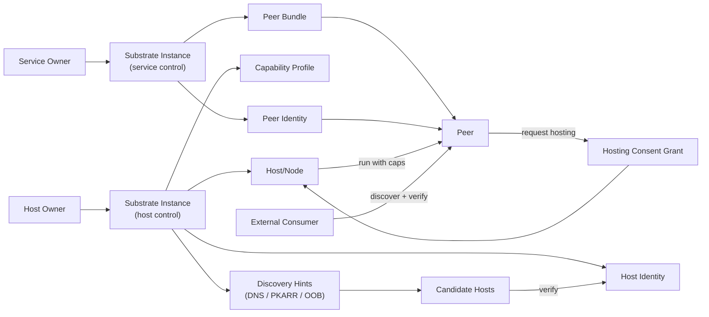
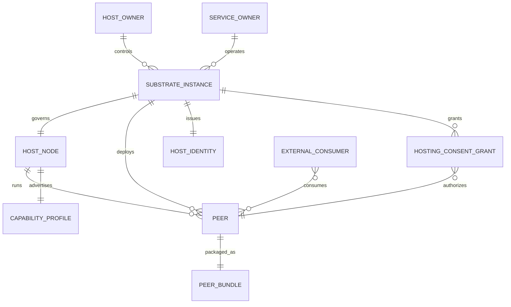

# Conceptual System Model

## Entities
- **Host Owner**: User who installs and controls a substrate instance on their
  host(s).
- **Service Owner**: User who owns and deploys peer services onto hosts.
- **Substrate App**: User-space application that runs on a host. The overall
  system is the **Substrate**, which runs as a **substrate instance** on each
  host. Instances can enable roles like host control, service control, signaling,
  data relay, or proxy while using the same underlying components.
- **Host/Node**: A logical machine or subset of resources governed by a
  substrate instance.
- **Peer**: A uniquely addressable micro-app/service with its own identity.
- **External Consumer**: Browser or client app that consumes peer services.

## Artifacts
- **Peer Identity**: Cryptographic identity for a peer.
- **Host Identity**: Cryptographic identity for a host/substrate instance.
- **Capability Profile**: Signed description of host substrate capabilities and
  limits (CPU, memory, disk, GPU, network constraints).
- **Peer Bundle**: Portable package for a peer, including manifest and resource
  caps.
- **Hosting Consent Grant**: Explicit, revocable approval from a host substrate
  to run a peer under specified limits.

## Relationships (Cardinality)
| Entity A | Relationship | Entity B | Cardinality | Notes |
| --- | --- | --- | --- | --- |
| Host Owner | installs/controls | Substrate Instance | 1 owner : many substrate instances | A host owner can run multiple instances across hosts. |
| Substrate Instance | governs | Host/Node | 1:1 (per instance) | A substrate instance manages a single host/node slice. |
| Service Owner | installs/controls | Peer | 1 owner : many peers | Ownership is explicit and revocable. |
| Peer | runs on | Host/Node | many peers : 1 host (at a time) | A peer is hosted by one host at a time in Phase 1. |
| Host/Node | runs | Peer | 1 host : many peers | Hosts can run multiple peers. |
| Substrate Instance | issues | Host Identity | 1:1 | Each instance has exactly one host identity. |
| Host/Node | advertises | Capability Profile | 1:1 (current) | Capability profile can be updated over time. |
| Peer | packages into | Peer Bundle | 1:1 (current) | A peer bundle may be versioned. |
| Substrate Instance | grants | Hosting Consent Grant | 1 substrate : many grants | Each grant is scoped and revocable. |
| Hosting Consent Grant | authorizes | Peer | many grants : 1 peer | A peer may have multiple grants over time. |
| External Consumer | consumes | Peer | many consumers : many peers | Discovery and verification are required. |

## Relationships & Lifecycle (High Level)
1. **Host onboarding**
   - Host Owner installs a substrate instance on Host/Node.
   - The substrate instance creates Host Identity and Capability Profile.
   - The substrate instance advertises non-authoritative hints (DNS, PKARR, OOB token).

2. **Peer provisioning**
   - Service Owner creates Peer Bundle and Peer Identity.
   - Service Owner discovers candidate hosts via hints and verifies Host Identity.
   - Service Owner negotiates Hosting Consent Grant with a substrate instance
     that has host control enabled.

3. **Execution & consumption**
   - Peer is deployed and run under host resource caps.
   - External consumers discover peer by identity, verify, then connect.

4. **Change & migration**
   - Service Owner updates Peer Bundle or policy.
   - A substrate instance with service control enabled propagates updates or
     migrates peer to another host under explicit consent.

## Conceptual Diagram (Mermaid)

## Cardinality Diagram (Mermaid)

