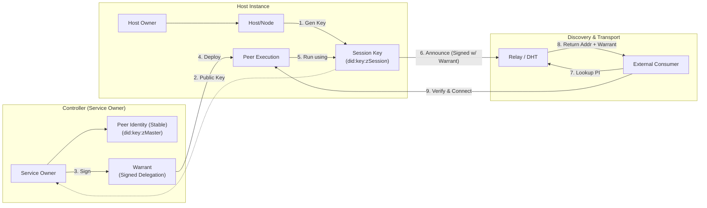
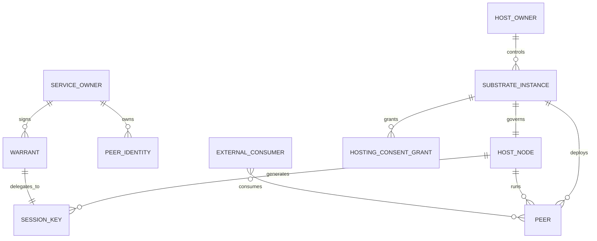

# Conceptual System Model

## Entities
- **Host Owner**: User who installs and controls a substrate instance on their
  host(s).
- **Service Owner (Controller)**: User who owns the stable identity (`did:key:zMaster`) of a service/peer. They control the "Controller" substrate instance.
- **Substrate App**: User-space application that runs on a host. The overall
  system is the **Substrate**, which runs as a **substrate instance** on each
  host. Instances can enable roles like host control, service control, signaling,
  data relay, or proxy while using the same underlying components.
- **Host/Node**: A logical machine or subset of resources governed by a
  substrate instance.
- **Peer**: A uniquely addressable micro-app/service executing on a Host.
- **External Consumer**: Browser or client app that consumes peer services.

## Artifacts
- **Peer Identity (Master)**: The stable cryptographic identity (`did:key:zMaster`) created by the Service Owner. Never leaves the Controller.
- **Host Identity**: Cryptographic identity for a host/substrate instance.
- **Session Key**: An ephemeral cryptographic key pair (`did:key:zSession`) generated by the Host specifically for a single deployment instance of a Peer.
- **Warrant (Delegation)**: A time-bounded, signed certificate issued by the Service Owner. It authorizes the `Session Key` to sign network traffic and announce presence on behalf of the `Peer Identity`.
- **Capability Profile**: Signed description of host substrate capabilities and
  limits (CPU, memory, disk, GPU, network constraints).
- **Peer Bundle**: Portable package for a peer, including manifest, WASM code, and resource requirements.
- **Hosting Consent Grant**: Explicit, revocable approval from a host substrate
  to run a peer under specified limits.

## Relationships (Cardinality)
| Entity A | Relationship | Entity B | Cardinality | Notes |
| --- | --- | --- | --- | --- |
| Host Owner | installs/controls | Substrate Instance | 1 owner : many substrate instances | A host owner can run multiple instances across hosts. |
| Substrate Instance | governs | Host/Node | 1:1 (per instance) | A substrate instance manages a single host/node slice. |
| Service Owner | owns | Peer Identity | 1 owner : many identities | Stable identity management. |
| Service Owner | issues | Warrant | 1 owner : many warrants | Delegated authority to hosts. |
| Host/Node | generates | Session Key | 1 deployment : 1 key | Unique key per peer deployment instance. |
| Warrant | authorizes | Session Key | 1 warrant : 1 key | Binds stable identity to ephemeral host key. |
| Peer | runs on | Host/Node | many peers : 1 host | A peer is hosted by one host at a time in Phase 1. |
| Host/Node | runs | Peer | 1 host : many peers | Hosts can run multiple peers. |
| Substrate Instance | grants | Hosting Consent Grant | 1 substrate : many grants | Each grant is scoped and revocable. |

## Relationships & Lifecycle (High Level)
1. **Host onboarding**
   - Host Owner installs a substrate instance on Host/Node.
   - The substrate instance creates Host Identity and Capability Profile.
   - The substrate instance connects to the Discovery Layer (Relay/DHT) to publish availability.

2. **Peer provisioning**
   - Service Owner creates Peer Bundle and stable **Peer Identity**.
   - Service Owner discovers candidate hosts via Discovery Layer (Ticket/DHT).
   - Service Owner negotiates Hosting Consent Grant.

3. **Delegation & Execution (The "Warrant" Flow)**
   - Host generates an ephemeral **Session Key**.
   - Service Owner signs a **Warrant** linking Peer Identity to Session Key (valid for N hours).
   - Peer is deployed to Host with the Warrant.
   - Host announces Peer availability to Discovery Layer, signed by Session Key + Warrant.

4. **Consumption**
   - External Consumer looks up Peer Identity.
   - Discovery Layer returns Host address + Session Key + Warrant.
   - Consumer verifies Warrant chain (Session Key -> signed by Peer Identity).
   - Connection established.

5. **Change & Revocation**
   - **Graceful:** Service Owner issues new Warrant to new Host (migration).
   - **Revocation:** Service Owner stops renewing Warrant or publishes Revocation List for the old Session Key.

## Conceptual Diagram (Mermaid)

## Cardinality Diagram (Mermaid)

