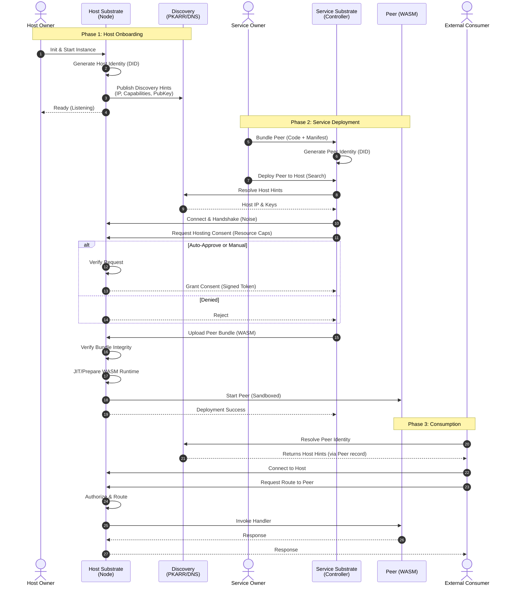

# Technical Specifications & Implementation Details

## 1. Technology Stack (Phase 1)

This section defines the specific technologies chosen to implement the architecture defined in `02-architecture.md`.

### Core Runtime & Languages
- **Substrate Core**: **Rust**. Chosen for memory safety, performance, and WASM ecosystem support.
- **Peer Runtime**: **WebAssembly (WASM) Component Model**. Allows peers to be sandboxed, portable, and language-agnostic.
- **Client SDKs**: **Rust** and **TypeScript/JavaScript**. Rust targets CLI/host control flows; TypeScript targets browser/WebRTC access.

### Identity & Cryptography
- **Identity Standard**: **DID (Decentralized Identifiers)**. Specifically `did:key` (Ed25519) for Phase 1.
- **Signing**: **Ed25519**.
- **Hashing**: **BLAKE3**.
- **Authorization**: **UCANs** (chained capability tokens) for Hosting Consent Grants.

### Networking & Transports
- **Primary Transport**: **QUIC** (via `quinn` or `iroh`). Provides multiplexing (separating Control vs. Data streams) and security (TLS 1.3). TCP/UDP are underlying implementation details where applicable.
- **NAT Traversal**: **UDP Hole Punching** (via `iroh` or `libp2p` techniques) to enable direct connectivity behind home routers.
- **Browser Access**: **WebRTC (Data Channels)**. Allows "External Consumers" (browsers) to connect directly to Host Substrates without gateways.
- **Discovery**:
    - **PKARR**: DHT-based discovery.
    - **DNS TXT**: Infrastructure hints.
    - **OOB**: Manual token entry.

### Protocols (Control vs. Data)
A pluggable architecture is used to support various serialization formats tailored to the deployment stage (Production vs. Development).

- **Control Plane** (Substrate ↔ Substrate / CLI ↔ Daemon):
    - **Architecture**: Pluggable transport and serialization.
    - **Production Default**: **Protobuf**. Chosen for maturity, strict typing, high performance (`prost` in Rust), and excellent cross-language support.
    - **Development/Debug**: **JSON**. Supported for human-readable inspection and easy troubleshooting.
- **Data Plane** (Peer ↔ Peer / Client ↔ Peer):
    - **Architecture**: Pluggable interface adapters.
    - **Production Default**: **WIT (Wasm Interface Types)** via **wRPC**. Native to the WASM Component Model for high-performance internal communication.
    - **Development/Debug**: **JSON-RPC**. An adapter layer to allow easy debugging and interaction from standard HTTP/Web clients without specialized tooling.

### Data & State
- **Local State**: **SQLite**. Structured storage for configuration, keys, and consent grants.
- **Wire Formats**:
    - **Control**: Protobuf (binary) or JSON (text) depending on configuration.
    - **Peer Exchange**: wRPC (binary) or JSON-RPC (text) depending on client negotiation.

---

## 2. End-to-End Lifecycle Sequence

This diagram unifies the Host Onboarding, Service Deployment, and Consumption flows into a single continuity.

